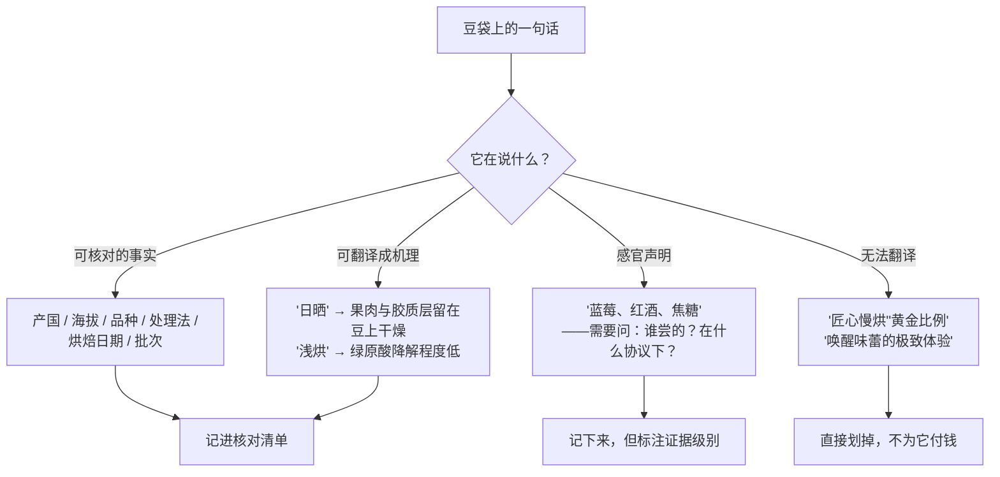

# 🛠 项目 P1 · 给三包豆做一份"成分翻译"

> **这是第一部分的收尾项目**。前五章建立了一套语言：
> 成分（第 1 章）→ 结构（第 2 章）→ 水（第 3 章）→ 感知（第 4 章）→ 证据等级（第 5 章）。
> 这个项目只做一件事：**把豆袋和详情页上的营销语言，逐条翻译回这套语言**，
> 翻译不出来的就明确标成"无法翻译"。
>
> **交付物**：一张三包豆的对照翻译表 + 一份"信息量记分卡" + 一条你自己的采购判断。
> **不需要买新豆**，手边有的、喝完的空袋、甚至电商详情页截图都行。

## P1.1 为什么这个项目值得花两小时

买豆时你面对的从来不是成分表，而是一段文案。文案里混着四种完全不同的东西：



这个项目的价值不在于"挑出好豆"，而在于**让你知道自己花的钱里，有多少买到了信息**。
两包价格相同的豆，一包能让你填满二十个格子，另一包只能填三个——
后者不一定难喝，但**你对它的一切判断都只能靠猜**。

> **诚实说明**：信息量多 ≠ 好喝。这是一条相关性都谈不上的假设。
> 本项目只教你量化"确定性"，不教你预测风味——预测风味要等到第二、三部分学完。

## P1.2 准备：选哪三包

**选样原则：制造对比，而不是凑数。** 推荐三选一的组合：

| 组合方案 | 三包怎么选 | 你会看到什么 |
|---------|-----------|-------------|
| **A · 价格梯度**（推荐新手） | 同一家店的低 / 中 / 高价位各一包 | 多花的钱换来了哪些**字段**，哪些只换来了形容词 |
| **B · 渠道梯度** | 超市速溶或商业豆 1 包 + 连锁咖啡店豆 1 包 + 精品烘焙商 1 包 | 三种商业模式各自愿意披露什么 |
| **C · 同产国不同烘焙商** | 同一个产国（比如都写"埃塞俄比亚"）的三包 | 同样四个字，背后信息密度能差十倍 |

只有一两包也能做，**但至少要有两包才会产生对比**。
一包都没有时用电商详情页——把详情页当成"纸面豆袋"，规则完全一样。

## P1.3 🅐 无器具版 · 任务一：逐句分类

拿第一包豆，把**袋上和详情页上的每一句话**抄进下表（别跳过任何一句），
然后给每句话打一个类别标签。

| # | 原文（照抄，不改写） | 类别 | 依据 |
|---|-------------------|------|------|
| 1 | | ☐事实 ☐可译机理 ☐感官声明 ☐无法翻译 | |
| 2 | | ☐事实 ☐可译机理 ☐感官声明 ☐无法翻译 | |
| … | | | |

四类的判据（**这是本项目的核心规则**）：

| 类别 | 判据 | 例子 |
|------|------|------|
| **事实** | 有确定的指称对象，**原则上可被第三方核对** | "海拔 1750–1900 m""品种 SL28""烘焙日期 2026-08-30" |
| **可译机理** | 是工艺或成分描述，**能用前五章的语言重述** | "水洗处理"→ 采收后立刻去掉果肉、胶质层经发酵或机械脱除（[第 2 章](02-cherry-anatomy.md)） |
| **感官声明** | 描述杯中感受，**必须追问"谁尝的、按什么协议"** | "莓果调性""明亮的柑橘酸质""SCA 87 分" |
| **无法翻译** | 去掉之后信息量不变 | "精选优质生豆""匠心烘焙""风味层次丰富" |

> **判断卡住时用这个测试**：把这句话**换成反面**，还有人会写在袋上吗？
> "粗放烘焙""劣质生豆"没人会写 → 说明原句是**无法翻译**类。
> 而"日晒"的反面"水洗"到处都是 → 说明它**携带真实信息**。

## P1.4 🅐 无器具版 · 任务二：把"可译机理"真的译出来

这是整个项目最费脑子、也最有收获的一步。**只译你抄下来的那些**，
不认识的词先留白，写下"该查第几章"。

| 袋上的词 | 翻译成成分 / 结构 / 工艺语言 | 本书出处 | 它**没有**告诉你什么 |
|---------|------------------------|---------|-------------------|
| 日晒 / Natural | ①外果皮②果肉③胶质层全部留在豆上一起干燥 | [第 2 章 §2.2](02-cherry-anatomy.md) | 干燥用了多少天、在什么载体上、含水率降到多少 |
| 水洗 / Washed | 采收后立即去果皮，③胶质层经发酵或机械脱除后干燥 | [第 2 章 §2.2](02-cherry-anatomy.md) | 发酵时长与温度、是否水下发酵 |
| 蜜处理 / Honey | 去果皮但**保留部分③胶质层**带壳干燥 | [第 2 章 §2.3](02-cherry-anatomy.md) | 保留了多少（黄蜜/红蜜/黑蜜没有统一定义） |
| 浅烘 / 中浅烘 | 绿原酸降解程度较低、醌内酯生成阶段 | [第 1 章 §1.4](01-bean-composition.md) | 用什么衡量烘焙度（色值？失重率？全凭感觉？） |
| 深烘 | 醌内酯进一步降解、苯基茚满类增加 | [第 1 章 §1.4](01-bean-composition.md) | 同上 |
| 低因 / Decaf | 用某种方式脱除了咖啡因 | [术语表](../../glossary.md#caffeine) | **用的哪种脱因法**——这是最常被省略的关键字段 |
| 海拔 xxxx m | 通过温度影响成熟期长度 | [第 2 章 §2.5](02-cherry-anatomy.md) | 它是**代理变量**，不是因果本身 |
| 你袋上的其他词 | | | |

> **两条翻译纪律**：
> 1. **翻译不等于评价**。"日晒"译完就停，不要顺手写"所以更甜"——
>    那一步在[第 2 章 §2.6](02-cherry-anatomy.md) 已经被标成 ⚠️ 了。
> 2. **最右边那一列比中间那一列重要**。"它没告诉你什么"才是你下次向店家提问的清单。

## P1.5 🅐 无器具版 · 任务三：信息量记分卡

三包豆各填一次。**每个字段有明确数值/名称记 1 分，只有模糊词记 0.5 分，没有记 0 分。**

| 字段 | 包 A | 包 B | 包 C | 计分说明 |
|------|------|------|------|---------|
| 烘焙日期（具体到日） | | | | 只写"保质期至…"记 0 |
| 产国 | | | | |
| 产区 / 合作社 / 庄园 | | | | 只写产国记 0 |
| 品种（具体名称） | | | | 写"阿拉比卡"记 0.5——那是物种不是品种 |
| 处理法 | | | | 写"特殊处理"记 0.5 |
| 海拔（具体区间） | | | | |
| 采收年份 / 批次 | | | | |
| 烘焙度**及其衡量方式** | | | | 只写"中度"记 0.5 |
| 建议冲煮参数 | | | | |
| 杯测分**及评分方** | | | | 有分数无评分方记 0.5 |
| 是否单品（非拼配） | | | | |
| **小计（满分 11）** | | | | |

再填一行主观项，**不计分但要写**：

| | 包 A | 包 B | 包 C |
|---|------|------|------|
| 单价（元 / 100 g） | | | |
| "无法翻译"类句子占全部句子的比例 | | | |
| 你**最想追问店家的一个问题** | | | |

## P1.6 🅐 无器具版 · 任务四：把感官声明降级成可检验的陈述

挑出三包里**最具体的三条感官声明**，逐条改写：

| 原句 | 它隐含的主张 | 谁能验证、怎么验证 | 改写成可检验的版本 |
|------|------------|------------------|------------------|
| 例："浓郁的蓝莓风味" | 该样品中存在可被识别为蓝莓的香气特征 | 需要多名评审、盲测、有参照物 | "在盲测中，多数评审把这支豆的果香归类为浆果类而非柑橘类" |
| | | | |
| | | | |

> **为什么要做这一步**：[第 4 章](04-perception.md)讲过，风味的绝大部分来自嗅觉，
> 而描述词需要**参照物**才能锚定。一句"蓝莓"如果没有说明是谁、在什么条件下尝的，
> 它的证据级别接近于零——但这**不代表它是假的**，只代表**你无法据此做判断**。
> 完整的感官方法学在第六部分。

## P1.7 🅑 有条件版 · 任务五：拿"翻译"去做一次盲品验证（备齐后再做）

> **所需器具**：两包处理法明确不同、其余字段尽量接近的豆（比如同产国、同海拔段、
> 同烘焙商、烘焙日期相近的一支水洗 + 一支日晒）；一个磨（或请店家磨成同一粗细）；
> 秤；两个相同的杯子；一位帮你编号的同伴。
> **替代方案**：没有磨和秤，用挂耳包也能做——只要两支挂耳的粉量标称一致。

**流程**（完整的随机化与统计方法在第 39 章，这里只做最简版）：

| 步骤 | 做法 | 记录 |
|------|------|------|
| 1 | 让同伴把两支豆装进标 1、2 的杯子，**不告诉你哪杯是哪支** | |
| 2 | 用完全相同的粉量、水量、水温、时间冲两杯 | 粉 ____ g，水 ____ g，水温 ____ ℃ |
| 3 | 先**只闻不喝**，各写三个词 | 1 号：________ 2 号：________ |
| 4 | 再喝，各写三个词 | 1 号：________ 2 号：________ |
| 5 | 猜哪杯是日晒，并写下**你依据的是哪一条感受** | 猜：____ 依据：________ |
| 6 | 揭晓 | 对 / 错 |
| 7 | **重复两次**（同伴重新随机编号） | 第二次：____ 第三次：____ |

> **怎么解读结果（这才是重点）**：
> 两杯二选一，蒙对的概率是 50%。**猜对一次说明不了任何事**；
> 连续三次全对的偶然概率是 1/8 ≈ 12.5%，仍然不算强证据。
> 所以这个任务的输出**不是"我能尝出来"**，而是：
>
> - 你在步骤 5 写下的**依据**是什么（"更甜""更酸""更像果干"），
> - 以及这个依据在三次里**是否稳定**。
>
> 依据稳定但结论错了，比蒙对三次有价值得多——那说明你抓住了一个真实的差异维度，
> 只是把它挂错了标签。第 38、39 章会教怎么把这件事做成真正的统计检验。

## P1.8 🅑 有条件版 · 任务六：用同一支豆验证"水"这一条（备齐后再做）

> **所需器具**：同一支豆；**两种水**（例如自来水煮沸 vs 一种瓶装水，
> 或纯水 vs 矿泉水）；秤；相同的器具与参数。
> **替代方案**：没有第二种水，就用"同一种水放凉后重新煮沸"作为阴性对照——
> 这一组**理论上不应该有差别**，正好用来测你自己的噪声水平。

| 组别 | 水 | 其他参数 | 入口 | 中段 | 尾段 | 与另一组的**差异方向** |
|------|----|---------|------|------|------|---------------------|
| 甲 | | 全部相同 | | | | |
| 乙 | | 全部相同 | | | | |
| 对照（同一种水） | | 全部相同 | | | | 差异应接近 0 |

> **务必先做"对照"那一行**。如果你在同一种水的两杯之间都能"喝出明显差别"，
> 那么甲乙之间的差别就**不能归因于水**——那是你今天的噪声。
> [第 3 章](03-water.md) 已经说明：本书不写任何"最优水配方"，
> 因为计算研究与实验研究在这一点上结论并不一致。这个任务的目的是让你亲自体会
> **"先测噪声，再谈信号"**这条纪律。

## P1.9 交付物模板：一页纸的采购判断

把上面所有表压缩成一页，这才是这个项目真正要留下的东西。

```
【P1 交付物】日期：________

一、三包豆的信息量得分
  包 A（____________）：___ / 11   单价 ____ 元/100g
  包 B（____________）：___ / 11   单价 ____ 元/100g
  包 C（____________）：___ / 11   单价 ____ 元/100g

二、每包最值得追问的一个问题
  A：____________________________________
  B：____________________________________
  C：____________________________________

三、我发现自己以前会为哪一类句子付钱
  ______________________________________

四、下次买豆我会先看的三个字段（按优先级）
  1. ____________  2. ____________  3. ____________

五、本项目里我**无法**判断的事（诚实列出）
  ______________________________________
```

> **第四栏没有标准答案**，但有一条提醒：多数人写完这个项目后，
> 会把**烘焙日期**排进前三——因为它是唯一一个"**缺失即无解**"的字段：
> 品种不写还能问，海拔不写还能查，烘焙日期不写，这包豆在时间轴上的位置就永远丢了。
> 新鲜度与储存的完整证据讨论在第 41 章。

## P1.10 这个项目**没有**教你的事

按本书的诚实纪律，明确列出来：

- **它不能预测风味**。第一部分只建立了"成分 ↔ 感受"的框架，
  而"某品种 + 某处理法 + 某烘焙 → 某风味"这条链要到第二、三部分才闭合。
- **它不能判断性价比**。价格机制（C 价、指标价、直接贸易）是第 43 章的内容，
  本书对价格**只讲机制不写死数字**。
- **信息量得分高 ≠ 品质高**。这两件事本书**没有**找到可靠的对照研究支持，
  不要把记分卡当成评分卡。
- **盲品任务不构成统计检验**。三次二选一的样本量太小，
  它的产出是"我的判据是否稳定"，不是"我能不能尝出来"。

---

## P1.11 本项目依据

本项目不引入新文献，所用结论全部来自第一部分各章，出处已登记在
[出处与资料登记](../../standards.md)：

- **成分与苦味的归属**：第 1 章 §1.4（[B1][B3][B7] 等）；
- **果实结构与处理法的对应**：第 2 章 §2.1–§2.3（[F1][F2][F3]）；
- **水的组成是否改变萃取**（计算研究 vs 实验研究的分歧）：第 3 章 §3.4（[W1][A1]）；
- **风味以嗅觉为主、描述需要参照物**：第 4 章（[N3][N4][V1][V2]）；
- **"谁做的研究、什么设计"这套提问方式**：第 5 章（[H1]）。

---

**下一站**：[第二部分 · 上游：从一棵树到一袋生豆](../02-upstream/00-intro.md)。
你刚刚列出的那些"它没告诉你什么"，大半会在第二部分被回答。
