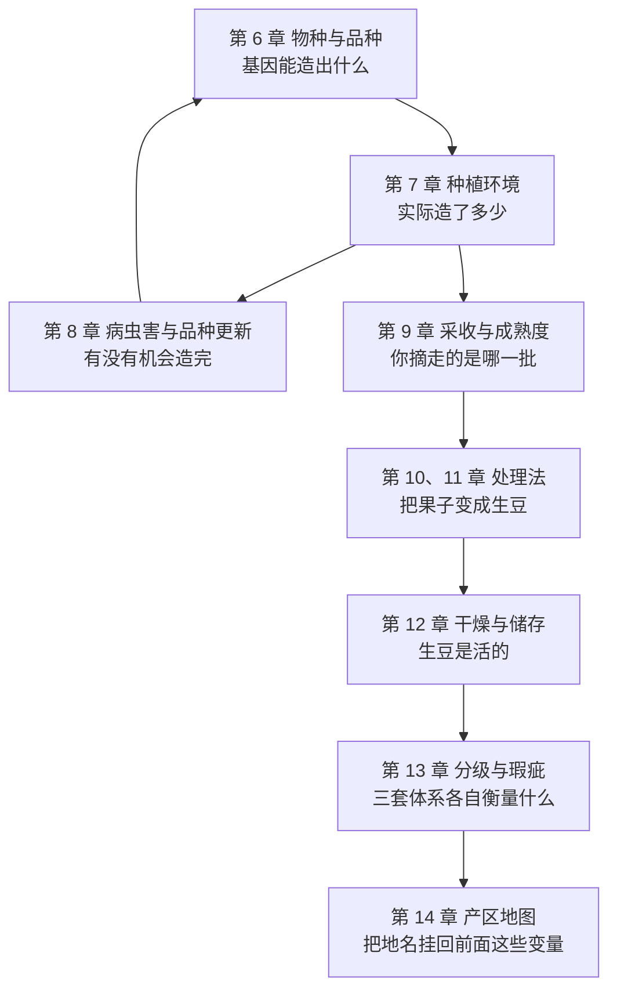

# 第二部分 · 上游：从一棵树到一袋生豆（导读）

> **第一部分回答了"生豆里有什么"，这一部分回答"那些东西是怎么被放进去的"。**
>
> 一句话概括这一部分的地位：**烘焙和冲煮只能在生豆已有的潜力内做事**。
> 你买的从来不是"一包咖啡"，而是**一段已经结束的上游史**——
> 品种决定了基因能造出什么，环境决定了它实际造了多少，
> 病虫害决定了这棵树有没有机会把果子养到成熟，采收决定了你拿到的是不是成熟的那一批。

## 这一部分要拆掉的三个思维习惯

**第一，"产区 = 风味"**。
豆袋上写"耶加雪菲""瑰夏""1800 米"时，你脑子里很可能已经浮出一组形容词。
这一部分要做的事是把那组形容词**拆回它的自变量**：品种 · 环境 · 健康状况 · 成熟度 · 处理法。
地名是这些自变量的**打包缩写**，不是原因本身。

**第二，"高海拔 = 好"**。
[第 2 章 §2.5](../01-foundation/02-cherry-anatomy.md) 已经露出过机理的一角：
真正起作用的是**温度 → 成熟期长度 → 胚乳填充是否充分**，海拔只是温度的代理变量。
第 7 章会把这条链条完整展开，并给出"同样是高海拔，在不同纬度上意味着完全不同的米数"
这个常被忽略的事实。

**第三，"抗病品种不好喝"**。
这是精品圈流传最广、也最需要小心处理的一条。第 6、8 章会把它拆成三个可分别检验的问题：
抗病基因从哪来？它为什么会失效？"卡蒂姆不好喝"到底是基因决定的，还是种植与选择的结果？

## 这一部分的九章 + 一个项目

注意这张图里有一条**回路**：病虫害压力会反过来决定种什么品种（第 8 章 → 第 6 章）。
这不是修辞——现代咖啡品种版图里最大的一块，就是被一场真菌病改写的。

| 章 | 它回答的问题 | 本轮状态 |
|----|------------|---------|
| 6 · 物种与品种 | 阿拉比卡为什么是"混血儿"？"品种"这个词在豆袋上到底指什么？ | ✅ |
| 7 · 种植环境 | 海拔、纬度、遮荫、土壤、气候，各自通过什么机制起作用？ | ✅ |
| 8 · 病虫害与品种更新 | 为什么一场叶锈病能决定你杯子里的东西？抗性为什么会失效？ | ✅ |
| 9 · 采收与成熟度 | "全红果采摘"到底在控什么？颜色可靠吗？ | ✅ |
| 10、11 · 处理法 | 日晒 / 水洗 / 蜜处理 / 厌氧，各自在改变什么 | ⬜ 待写 |
| 12 · 干燥与储存 | 含水率、水分活度、陈化与"过季豆" | ⬜ 待写 |
| 13 · 分级与瑕疵 | 目数 / 瑕疵计数 / 杯测分：三套体系 | ⬜ 待写 |
| 14 · 产区地图 | 把地名拆回品种 + 处理法 + 海拔 | ⬜ 待写 |
| P2 · 项目 | 同产区、不同处理法的对照记录 | ⬜ 待写 |

## 读这一部分时的三个提示

**第一，农学数据的"波动"比化学数据大得多。**
第一部分引用的成分区间已经够宽了，而这一部分的数字——产量、抗性、品质评分——
还要再叠加一层**地点 × 年份 × 管理水平**的变异。所以这一部分会更频繁地出现
"某项在某地某年的观测"这种限定语。**看到限定语请当真，那不是客套。**

**第二，很多结论是"相关"而不是"因果"。**
"高海拔的豆杯测分更高"这类结论几乎都来自**观察性研究**：
海拔高的地块往往也是老树、小农、手工采摘、精细处理——
这些变量纠缠在一起。本书会尽量指出哪些研究做了控制、控制了什么。
这套提问方式，[第 5 章](../01-foundation/05-health-evidence.md) 已经练过一遍了，
只是那里的对象是健康结局，这里是杯测分。

**第三，上游的事有大量"本书查不到"。**
产地实际做法多数没有被写成论文，行业报告又常常无法核对。
遇到这种情况，本书一律明说"这是行业惯例""本书未找到一手出处"，
而**不用听起来合理的措辞填补空白**。

---

**从这里开始**：[第 6 章 · 物种与品种：阿拉比卡、卡内弗拉与利比里卡](06-species-varieties.md)
