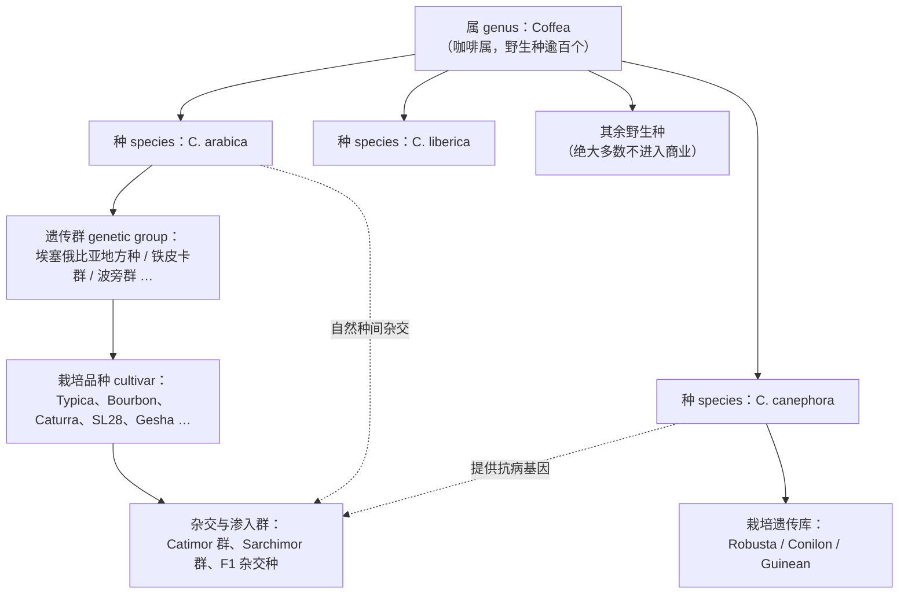
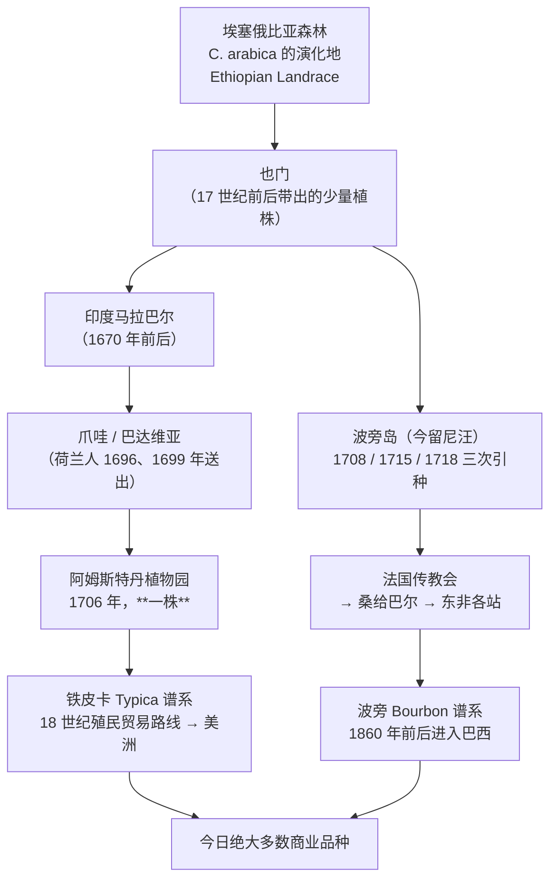

# 第 6 章 物种与品种：阿拉比卡、卡内弗拉与利比里卡

> **本章目标**：把豆袋上那一行"品种"读懂——
> 它到底在指物种、遗传群、栽培品种，还是一个营销名。
>
> 第 1 章给了生豆的成分表，第 2 章给了果实的结构。这一章回答上游链条的第一个问题：
> **这些成分的"配方"是谁写的**。答案是基因——但"基因"在咖啡这里有个特别的故事：
> 你每天喝的那个物种，本身就是两个物种的混血儿，而且它的家底薄得惊人。
>
> 本章仍然**不需要任何器具**，但需要你打开一个网站：
> [World Coffee Research 品种目录](https://varieties.worldcoffeeresearch.org/)（免费、双语、可下载 PDF）。

## 6.1 先把四个层级分清楚

咖啡圈把"品种"这个词用得极其混乱。豆袋上写 "Arabica"、写 "Bourbon"、写 "Gesha"、
写 "Catimor"，这四个词**在生物学上不在同一个层级上**。

| 层级 | 英文 | 例子 | 在豆袋上通常怎么出现 |
|------|------|------|-------------------|
| **属** | genus | *Coffea* | 几乎不写 |
| **[物种](../../glossary.md#species)** | species | *C. arabica* / *C. canephora* / *C. liberica* | 写成 "100% 阿拉比卡"——这其实是**物种**信息，不是品种信息 |
| **[遗传群](../../glossary.md#genetic-group)** | genetic group | 铁皮卡群、波旁群、[卡蒂姆群](../../glossary.md#catimor)、[萨奇姆群](../../glossary.md#sarchimor) | 写成"Catimor"——这是**一群**品种的合称，不是一个品种[^1] |
| **[栽培品种](../../glossary.md#cultivar)** | cultivar / variety | Typica、Bourbon、Caturra、SL28、Gesha、Castillo | 这才是"品种"栏该填的东西 |

> **第一条可执行的判断**：豆袋上"品种"一栏只写 **"阿拉比卡"** 的，
> 等于什么也没写——那是物种，覆盖了全世界大约六成的咖啡[^2]。
> 写 **"Catimor"** 的稍好一点，但它仍然是**一组**品种的名字，
> 目录方明确写道：卡蒂姆与萨奇姆"**本身都不是独立的品种**，而是一群亲本相似的不同品种"[^1]。

[^1]: 本书编号 [G5]：World Coffee Research（WCR）《Varieties Catalog》，<https://varieties.worldcoffeeresearch.org/>（2026-09 核对）。该目录自述为 "A global catalog of Arabica and Robusta coffee varieties from around the world"，把阿拉比卡品种分成 Ethiopian Landrace、Bourbon、Typica、Bourbon-Typica Group、Catimor Group、Sarchimor、Introgressed w/ Congensis、F1 Hybrid 等类别，罗布斯塔侧标注 Guinea / Congo / Congo × Guinea / Uganda 等遗传群。
[^2]: 本书编号 [G1]：Salojärvi 等 (2024), *Nature Genetics* 56:721–731（PMCID PMC11018527，开放获取）。文中写 *C. arabica* "is the source of approximately 60% of coffee products worldwide"。

## 6.2 阿拉比卡是一个混血儿，而且很年轻

这是本章最重要的一个事实，它解释了后面几乎所有现象。

**[异源四倍体](../../glossary.md#allotetraploid)（allotetraploid）**：
*C. arabica* 是 *C. eugenioides* 与 *C. canephora* 两个二倍体物种杂交后
基因组加倍形成的[^2]。它的细胞里同时带着两套来自不同物种的染色体组（亚基因组）。
一项 2024 年的基因组与群体基因组学研究给出了三个可核对的数字[^2]：

| 事实 | 数值 | 它意味着什么 |
|------|------|------------|
| 形成这个物种的多倍化事件 | 距今 **35 万~61 万年** | 在作物里算**极其年轻** |
| 野生居群与栽培祖先的分化 | 约 **3.05 万年前** | 之后两者之间还发生过迁移 |
| 亚基因组优势 | **没有观察到明显的全局性亚基因组优势** | 两套基因组都还在"干活"，不是一套压着另一套 |

同一篇研究还指出：这个物种在驯化之前就经历了**数次瓶颈**，结果是
"**遗传变异狭窄**（narrow genetic variation）"[^2]。

> **为什么这条对喝咖啡的人重要**：
>
> 1. **抗病基因短缺**。阿拉比卡的野生亲本 *C. canephora* 抗病性强得多，
>    但阿拉比卡在成为独立物种时只"带走"了一部分。第 8 章讲的整部育种史，
>    本质上就是把 canephora 的抗病基因**再借回来**。
> 2. **风味潜力的多样性有限**。同一物种内部差异再大，也比不上"换个物种"。
>    这解释了为什么近年的育种思路开始转向 **F1 杂交种**与**野生种**（§6.5、§6.6）。
> 3. **"混血"不是缺陷**。一项把新形成的异源四倍体与两个二倍体亲本放在
>    18-14 ℃ 到 33-29 ℃ 四种昼夜温度条件下对比的研究发现：
>    阿拉比卡在**最热**条件下表现接近 canephora，在**最冷**条件下接近 eugenioides[^3]。
>    也就是说，混血让它**继承了两边的适应区间**——尽管商业上它仍然被当成"娇气"的那个。

另有一项转录组研究把这件事看得更细：在阿拉比卡的种子里，
约三分之一的基因表现出**[同源基因表达偏倚](../../glossary.md#heb)**（homeologue expression bias），
而且这种偏倚在种子成熟过程中**增加**；研究者专门考察了**咖啡因与绿原酸合成通路**上的表达[^4]。
换句话说，第 1 章那张成分表里的数字，**是两套祖先基因组共同投票的结果**。

[^3]: 本书编号 [G10]：Bertrand 等 (2015), *Plant & Cell Physiology* 56:2035–2051（PMCID PMC4679393）。四个昼夜温度处理为 18-14、23-19、28-24、33-29 ℃。
[^4]: 本书编号 [G7]：Combes、Joët、Stavrinides & Lashermes (2023), *Annals of Botany* 131:157–170（PMCID PMC9904342）。该研究比较 *C. arabica* 与两个二倍体亲本在种子五个成熟阶段的基因表达。

## 6.3 三个商业物种：化学差异与它的杯中后果

### 阿拉比卡 vs 卡内弗拉（罗布斯塔）

第 1、2 章已经用三组独立来源建立过量级关系，这里把它整理成一张对照表。
**所有数字都是区间，且随品种、产地、年份大幅漂移**（出处见章末）：

| 成分 | 阿拉比卡 | 卡内弗拉（罗布斯塔） | 杯中后果（本书能说到哪一步） |
|------|---------|-------------------|---------------------------|
| [咖啡因](../../glossary.md#caffeine) | 约 1% 上下（多数报告 1.0%~1.4%） | **大致是前者的两倍量级**（2.0%~2.6%） | 苦味贡献有限（[第 1 章 §1.4](../01-foundation/01-bean-composition.md)），但它是**物种鉴别**的可靠标记 |
| [绿原酸类](../../glossary.md#cga) | 较低 | **明显更高** | 烘焙后转化为苦味与涩感物质链条的起点（第 17 章） |
| [蔗糖](../../glossary.md#sucrose) | 较高 | **较低** | 美拉德与焦糖化的"原料本金"（第 16 章） |
| [脂质](../../glossary.md#lipid) | 较高 | 较低 | 与 body 和意式 crema 相关（第 30 章） |

一项在科摩罗群岛同一火山土壤条件下比较 *C. canephora* 与 *C. liberica* var. *dewevrei*
的研究，为"罗布斯塔多酚更高"提供了又一个独立观测：
该地罗布斯塔的总多酚 121.79 ± 2.73 mg GAE/g、总黄酮 29.43 ± 2.20 mg QE/g、
咖啡因 1.52%（w/w）、可溶性总糖 60.47 ± 3.37 mg GE/g，均显著高于同地的 excelsa[^5]。

> ⚠️ **注意这里有一条容易被误读的线**：上面这项研究里罗布斯塔的**可溶性总糖更高**，
> 而本书第 1 章说罗布斯塔的**蔗糖更低**——这两句话不矛盾，
> 因为"可溶性总糖"与"蔗糖"不是同一个指标，测定方法也不同。
> **看到糖类数字先确认测的是哪一类糖**，这和[第 1 章](../01-foundation/01-bean-composition.md)
> 强调的"先确认干基还是湿基"是同一种纪律。

### 利比里卡与 Excelsa：被忽略的第三个

*C. liberica*（利比里卡）连同它的变种 *C. liberica* var. *dewevrei*（市场上叫 **Excelsa**）
是**商业上第三重要的咖啡物种**；但一篇 2026 年的文献计量 + 定向综述直言：
与阿拉比卡和罗布斯塔相比，关于它的物理化学、活性成分与感官特性的**科学知识仍然有限**[^6]。
该综述能给出的画像是：

- 物理性状独特（豆型大、形状不规则）；
- **咖啡因中等**；绿原酸随处理与烘焙变化，生物碱（葫芦巴碱、可可碱）相对稳定；
- **[咖啡豆醇](../../glossary.md#kahweol)与[咖啡醇](../../glossary.md#cafestol)的比值**可以区分不同的利比里卡变种；
- 感官报告为"**菠萝蜜样的果香、中等酸度、相对饱满的 body**"[^6]。

> **诚实说明**：上面这段感官描述是综述转引的"感官研究报告"，
> **不是**本书能交叉验证的结论。该综述自己就写道"standardized data remain limited"。
> 所以本章只把它当作"存在这样的报告"，**不当作物种的固有风味**。

[^5]: 本书编号 [G8]：Irchad 等 (2026), *Metabolites* 16:303（PMCID PMC13208385，开放获取）。样品为科摩罗群岛火山土壤上栽培的 *C. canephora* 与 *C. liberica* var. *dewevrei*。
[^6]: 本书编号 [G4]：Kurniawan 等 (2026), *Molecules* 31:1518（PMCID PMC13164717，开放获取）。该文同时做了文献计量分析与定向综述。

### 还有一百多个物种，你几乎喝不到

一项把 IUCN 红色名录标准应用于**全部 124 个野生咖啡物种**的评估给出了一组冷峻的数字[^7]：

- **至少 60% 的咖啡物种面临灭绝威胁**；
- **45%** 没有被任何种质资源库收藏；
- **28%** 不在任何已知保护区内。

这不是环保口号，而是育种资源问题——第 8 章会讲到，
现代咖啡最重要的抗病基因来自一次**偶然**的种间杂交。
下一次需要新基因时，它得还在才行。

一个已经被验证的例子：**狭叶咖啡 *C. stenophylla***。
2021 年的一项研究评估了这个西非野生种的感官特性与环境需求，结论是
它具有"**与高品质阿拉比卡类似的感官画像**"，而它生长与结果的年均温
**比阿拉比卡高 6.2~6.8 ℃**（在同等降水条件下）[^8]。

> **这项研究的意义**：它把"高品质风味"与"耐热"这两个此前被认为不可兼得的性状
> **在一个物种身上同时观测到了**。但它目前**不是**商业作物——
> 本书不会写"以后你会喝到它"，只写"这条路被证明不是死路"。

[^7]: 本书编号 [G2]：Davis、Chadburn、Moat、O'Sullivan、Hargreaves & Nic Lughadha (2019), *Science Advances* 5:eaav3473（PMCID PMC6357749，开放获取）。
[^8]: 本书编号 [G3]：Davis、Mieulet、Moat、Sarmu & Haggar (2021), *Nature Plants* 7:413–418（PMID 33875832）。本书**只读到摘要**，因此只引用摘要中明确写出的结论。

## 6.4 阿拉比卡的品种谱系：三次分叉

WCR 品种目录的"阿拉比卡历史"一节给出了一条可核对的传播链[^1]。
这条链解释了为什么全世界的商业阿拉比卡**家底这么薄**：

几条值得记住的细节[^1]：

- **1706 年从爪哇运到阿姆斯特丹的是"一株"植物**——铁皮卡这一支在美洲的扩散，
  很大程度上源自这一株。
- 铁皮卡这一支**很可能是从印度分出去的，而不是直接从也门**；
  近年的 DNA 指纹显示印度老品种 Coorg 与 Kent 属于波旁一系，
  说明 1670 年从也门带到印度的种子**两个群都有**。
- 波旁在东非的扩散靠的是 19 世纪的**法国传教会**路线（留尼汪 → 桑给巴尔 →
  坦桑尼亚 Bagamoyo / 肯尼亚 Bura 与 St. Augustine），
  这就是所谓 "French Mission" 咖啡的来源。
- 后果之一：在占全球产量约 40% 的巴西，目录记录的栽培品种中
  **97.55% 源自铁皮卡与波旁**[^1]。

> **把这条链和 §6.2 的"遗传变异狭窄"放在一起看**，你会得到本章的核心判断：
> **商业阿拉比卡的多样性，是一个本来就窄的物种，又被历史再挤了两次的结果。**
> 这既解释了它为什么脆弱（第 8 章），也解释了为什么"埃塞俄比亚地方种"
> 在育种上被看得很重——那是仍然留在原地、没被挤过的那部分。

### 品种名从哪来：四条常见路径

| 路径 | 机制 | 例子 |
|------|------|------|
| **自然突变** | 单株变异被选出来扦插/留种扩繁，常见的是**矮化**（便于密植与采摘） | Caturra（波旁的矮化突变）、Villa Sarchi |
| **地方种选拔** | 从地方种群里按表现挑母树，**混合选择**（mass selection）后逐代重复 | 东非研究站的早期育种；WCR 把这一手法写进了历史页[^1] |
| **[种间渗入](../../glossary.md#introgression)** | 把别的物种（主要是 *C. canephora*）的性状带进阿拉比卡 | Catimor 群、Sarchimor 群（见 §6.5） |
| **[F1 杂交种](../../glossary.md#f1-hybrid)** | 两个**遗传距离远**的阿拉比卡亲本杂交，只用第一代 | Centroamericano、Starmaya（见 §6.6） |

## 6.5 渗入品种：现代咖啡版图上最大的一块

1920 年代，在东帝汶岛上，一株 *C. arabica* 和一株 *C. canephora* **自然杂交**，
产生了后来被称为 **[帝汶杂交种](../../glossary.md#timor-hybrid)（Timor Hybrid / Híbrido de Timor, HdT）** 的植株[^1]。
它同时具备两件事：

1. **带着 canephora 来的抗叶锈基因**；
2. **染色体数与阿拉比卡相同**，所以能和阿拉比卡杂交[^9]。

育种家随后把 HdT 的不同株系与两个高产矮化品种杂交，得到两大群：

| 群 | 杂交组合 | 说明 |
|----|---------|------|
| **Catimor 群** | HdT × **Caturra** | 不是一个品种，是**一群**[^1] |
| **Sarchimor 群** | HdT × **Villa Sarchi** | 同上；Marsellesa 即属此群 |

HdT 的重要性有多大？一项对某大学种质库中 **152 份 HdT 材料**的表型 + 分子鉴定研究写道：
HdT 是"**全世界育种计划中最重要的抗性品种来源**"；
该批材料**全部**对叶锈菌小种 II 抗性，141 份对小种 XXXIII 抗性，
106 份带有咖啡浆果病抗性基因 *Ck-1* 的分子标记[^10]。

> **这里要建立一个会贯穿全书的判断**：
> 你在精品店里看到的"卡蒂姆"，**不是一个品种、也不是一个风味**，
> 而是"**用 1920 年代那次偶然杂交换来的抗病能力**"这件事在你杯子里的投影。
> 它的味道好不好，见 §6.7 的辨析——那比大多数人以为的复杂。

[^9]: 本书编号 [P8]：Romero、Vásquez、Lashermes、Herrera & Debener (2014), *Plant Breeding* 133:121–129。该文把 HdT 明确写为 "(Coffea arabica x C. canephora)" 的自然杂交种，并在第 4 号染色体上定位到一个独立于已知 SH 位点的抗锈 QTL。
[^10]: 本书编号 [P9]：Silva 等 (2018), *Euphytica* 214:153。152 份 HdT 材料，用 29 个随机 SSR 标记 + 2 个与 *Ck-1* 关联的 SSR 标记。

## 6.6 F1 杂交种：新一代，但有个必须知道的限制

**F1 杂交种**是把**两个遗传距离较远的阿拉比卡亲本**杂交，**只取第一代**。
目录方对它的定位是：产量显著高于非杂交品种，且试图同时兼顾杯品、产量与抗病[^1]。

一个有代表性的例子是 **Starmaya**：它是**第一个可以用种子生产的阿拉比卡 F1 杂交种**，
做法是利用一株**雄性不育**母本（CIR-SM01）与 Marsellesa（一个 Sarchimor 系）
在自然授粉的采种园里杂交[^11]。该研究同时诚实地报告了两件事：

- F1 的田间表现"显著优于常规品种"；
- 但观察到**田间不整齐**，部分变异来自母本克隆本身的杂合性，**无法消除**；
  锈病发生率若能把 Marsellesa 一侧的遗传固定得更彻底，有望从 **15% 降到 5%**[^11]。

> ⚠️ **F1 杂交种最重要的一条实务限制**（目录方专门用一个提示框写出来）：
> **从 F1 植株上采的种子，不会保有亲本的性状**——这叫 **[分离](../../glossary.md#segregation)（segregation）**。
> 子代可能丢失产量、抗性、品质。所以 F1 品种**只能靠无性繁殖（克隆）扩繁**，
> 农民必须从可信的苗圃购买[^1]。
>
> 这条限制有经济后果：它意味着 F1 品种**天然依赖种苗供应链**，
> 而不是像波旁那样"自己留种就能扩种"。你在豆袋上看到 F1 品种名时，
> 背后通常有一个组织化程度较高的供应链——**这是信息，不是品质保证**。

[^11]: 本书编号 [G6]：Georget 等 (2019), *Frontiers in Plant Science* 10:1344（PMCID PMC6818232，开放获取）。

## 6.7 顺带说清楚：罗布斯塔那一侧也有"品种"

市场上习惯把 *C. canephora* 统称"罗布斯塔"，但严格说 Robusta 只是它的一个栽培群。
一项对西非育种材料的群体遗传分析在栽培种质中确认了**三个主要遗传库**：
**Robusta、Conilon、Guinean**[^12]；WCR 目录在罗布斯塔一侧则标注了
**Guinea、Congo、Congo × Guinea、Uganda** 等遗传群[^1]。

> **可执行的判断**：看到"精品罗布斯塔""Fine Robusta"时，
> 至少可以追问一句"**是哪个遗传库、哪个品种**"。
> 像对待阿拉比卡那样对待它，是这几年才开始的事。
> （Fine Robusta 的评价体系属于第六部分，本章不展开。）

[^12]: 本书编号 [G9]：Pokou 等 (2025), *Heredity* 134:695–704。材料为西非的一个代表性育种收集群体。

## 6.8 常见说法辨析

按本书约定标注**证据强度**：✅ 有共识 / ⚠️ 有争议 / ❌ 明确错误 / **缺乏证据**。

| 说法 | 判定 | 说明 |
|------|------|------|
| "100% 阿拉比卡 = 高品质" | ❌ **明确错误**（把物种当成了品质等级） | 阿拉比卡是**物种**，覆盖全球约六成咖啡[^2]，从瑕疵满袋的商业豆到竞标豆全在里面。它只排除了"混了罗布斯塔"，不排除任何品质区间 |
| "罗布斯塔就是难喝的" | ⚠️ **把平均值当成了上限** | 化学上罗布斯塔确实绿原酸与咖啡因更高、蔗糖更低（§6.3），这给了它一个**不同的起点**；但"难喝"主要由**种植与处理的平均投入水平**决定，而它的栽培遗传库本身有 Robusta / Conilon / Guinean 等多个分支[^12]。本书未读到"同等种植与处理条件下罗布斯塔必然更差"的对照研究 |
| "卡蒂姆不好喝" | ⚠️ **有依据但被说死了** | WCR 目录的原话是渗入品种"**传统上被认为杯品低于其他品种**"，同时强调它们对受锈病与浆果病威胁的农户"至关重要"[^1]。注意这是**关于一个大类的平均印象**，而卡蒂姆根本不是单一品种；另一侧的反证是，巴西精品咖啡协会会员农场的调查发现**带 canephora 渗入的品种（HdT 与 Icatu 衍生）在精品农场里出现频率很高**，作者据此认为它们"有生产精品咖啡的遗传潜力"[^13] |
| "瑰夏是一个'高级品种'，所以贵" | ⚠️ **因果方向要拆开** | 品种名本身不产生价格。可核对的是：品种是**性状组合**（目录里每个品种都有产量、株型、抗性、最适海拔等字段[^1]），而价格由稀缺性、产量、竞标机制与营销共同决定（第 43 章）。本书**不写任何品种的价格数字** |
| "阿拉比卡和罗布斯塔是两个完全独立的物种，血统互不相干" | ❌ **明确错误** | 阿拉比卡本身就是 *C. eugenioides* × *C. canephora* 的异源四倍体后代[^2]；而现代抗锈品种又把 canephora 的基因**再借了一次**（§6.5） |
| "F1 杂交种可以自己留种" | ❌ **明确错误** | 目录方明确警告 F1 的种子会**分离**，性状不保，必须无性繁殖[^1] |
| "野生咖啡物种有一百多个，所以基因资源很充足" | ⚠️ **前半句对、后半句错** | 已评估的 124 个野生种中**至少 60% 受灭绝威胁、45% 未被任何种质库收藏**[^7]。"存在"与"可用"是两件事 |
| "高海拔品种 / 低海拔品种" | ⚠️ **说法不完整** | 目录确实有"**最适海拔**"字段，但它的定义里写明"**取决于农场纬度**"：赤道附近 5°N–5°S 的"高"是 >1600 m，而纬度 >15° 的"高"只要 >1000 m[^1]。**同一个"高海拔"在不同纬度上不是同一个数**（第 7 章展开） |
| "品种决定风味" | ⚠️ **方向对，权重被夸大** | 品种设定的是**前体格局的上限**（§6.2–§6.3）。但同一品种在不同海拔、遮荫、处理法下的成分差异是可实测的（第 7、10 章），而烘焙与萃取又在其上再改写一遍。本书对"品种 vs 处理法 vs 烘焙谁的影响大"**没有找到可靠的定量比较**，因此不排序 |
| "帝汶杂交种是人工制造的转基因咖啡" | ❌ **明确错误** | 它是 1920 年代东帝汶岛上**自然发生**的种间杂交[^1]，与转基因无关 |

[^13]: 本书编号 [G11]：Sera 等 (2025), *Scientific Reports* 15:42403（PMCID PMC12660380，开放获取）。该研究调查了 175 家巴西精品咖啡协会（BSCA）会员农场，观察到带 *C. canephora* 渗入的阿拉比卡品种（HdT 与 Icatu 衍生）出现频率很高。**注意这是农场使用频率的调查，不是杯品对照实验。**

## 6.9 🔎 买豆与冲煮时的用处

1. **"品种"一栏只写"阿拉比卡"的，当成没写**。真正有信息量的是具体品种名；
   看到 "Catimor"、"Sarchimor" 也要记得那是**一群**品种[^1]。
2. **看到具体品种名，去目录里查四个字段**：株型、最适海拔、锈病抗性、杯品潜力。
   这比记住"某品种 = 某风味"可靠得多——目录给的是**性状**，不是形容词。
3. **看到 F1 杂交种名（如 Centroamericano、Starmaya），你知道背后有一条种苗供应链**，
   因为它不能自己留种[^1]。这通常意味着这批豆的来源被记录得比较细。
4. **看到"精品罗布斯塔"，追问遗传库与品种**；不要用"罗布斯塔"三个字就把它归档。
5. **不要用品种名去预测杯中风味然后倒推冲煮参数**。品种影响的是**前体格局**，
   而你手上的旋钮调的是萃取（第四部分）。正确的用法是：
   品种 + 处理法 + 烘焙度一起，构成你**第一次冲煮参数的先验**，然后靠记录去修正。

## 6.10 思考题

1. 请用"属 / 物种 / 遗传群 / 栽培品种"四个层级，
   把下面四个词各自归位：*Coffea*、Arabica、Bourbon、Catimor，并说明为什么
   "100% 阿拉比卡"这句宣传语的信息量接近于零。
2. 阿拉比卡是 *C. eugenioides* 与 *C. canephora* 的异源四倍体后代，
   多倍化发生在距今 35 万~61 万年。请由此推出**两条**关于现代咖啡育种的预期，
   并说明为什么"遗传变异狭窄"对喝咖啡的人也是一件相关的事。
3. 有人说："既然阿拉比卡本来就有一半 canephora 血统，
   那卡蒂姆里那点罗布斯塔基因根本不可能影响风味。"
   请指出这个推理里的漏洞（提示：看 §6.2 里"同源基因表达偏倚"那一段）。
4. WCR 目录把"最适海拔"的定义写成**随纬度变化**的三档。
   请说明：为什么同样标"高海拔"，赤道产区和纬度 15° 以上产区的米数会差 600 米？
   这对你读豆袋上的海拔数字有什么直接影响？
5. **【案例】** 一份豆袋写着：*"精选 100% 阿拉比卡，卡蒂姆品种，
   来自海拔 1200 米的高山产区，采用古法自然日晒，风味层次丰富。"*
   请逐项判断：哪些是事实、哪些是可翻译的机理、哪些是无法翻译的话术；
   并指出这段文案里**最该被追问的两个缺失字段**。
6. **【案例】** 一位店员告诉你："这支是 F1 杂交种，我们自己留了种，
   明年在自家庄园也种上了，风味会一模一样。"
   请指出这句话里的技术错误，并说明会出现什么后果。
7. **【辨识】** 打开 [WCR 品种目录](https://varieties.worldcoffeeresearch.org/)，
   任选**两个**品种（建议一个 Bourbon-Typica 群、一个 Catimor 或 Sarchimor 群），
   把它们的株型、叶尖色、豆型大小、产量潜力、高海拔杯品潜力、最适海拔、
   锈病抗性、线虫抗性、浆果病抗性、首次结果年份逐项抄下来对比。
   然后回答：这两个品种的差异，**有几项是"风味"，有几项是"农艺"**？
8. 本章列出至少 60% 的野生咖啡物种受灭绝威胁、45% 未被任何种质库收藏。
   请说明这两个数字**分别**对咖啡育种意味着什么不同的风险，
   以及为什么 *C. stenophylla* 那项研究会被认为重要。
9. 请解释：为什么本书在辨析表里把"卡蒂姆不好喝"判成 ⚠️ 而不是 ❌ 或 ✅？
   要给出你认为**能把它判成 ✅ 或 ❌ 的实验设计**应该长什么样。

> 📖 **参考答案**（想清楚再看）：[Q1](../../qa/06-species-varieties-qa.md#q1) ·
> [Q2](../../qa/06-species-varieties-qa.md#q2) · [Q3](../../qa/06-species-varieties-qa.md#q3) ·
> [Q4](../../qa/06-species-varieties-qa.md#q4) · [Q5](../../qa/06-species-varieties-qa.md#q5) ·
> [Q6](../../qa/06-species-varieties-qa.md#q6) · [Q7](../../qa/06-species-varieties-qa.md#q7) ·
> [Q8](../../qa/06-species-varieties-qa.md#q8) · [Q9](../../qa/06-species-varieties-qa.md#q9)

## 6.11 本章实操

### 🅐 无器具版 · 任务一：建一张属于你自己的"品种卡"

打开 [WCR 品种目录](https://varieties.worldcoffeeresearch.org/)，
把你**手上或最近买过**的豆子的品种查一遍（查不到的写"目录中未收录"）。

| 品种名 | 属于哪个群 | 株型 | 最适海拔（记得看纬度档） | 锈病抗性 | 高海拔杯品潜力 | 首次结果年份 | 目录里**没有**的字段 |
|-------|-----------|------|----------------------|---------|--------------|-----------|-------------------|
| | | | | | | | |
| | | | | | | | |
| | | | | | | | |

> **重点在最后一列**。你会发现目录里**没有**"风味描述"这种东西——
> 它给的是"高海拔杯品**潜力**"这样一个分级。这个措辞差异是有意的：
> 潜力是农艺属性，风味是结果。**把两者分开，是本书要你养成的习惯。**

### 🅐 无器具版 · 任务二：用"四层级"筛一遍电商页面

找 **10 个**咖啡豆商品页（不用买），只记录"品种"一栏写了什么，然后分类：

| # | 商品名 | "品种"栏原文 | 这是哪一层级？ | 能否在 WCR 目录里查到？ |
|---|-------|------------|--------------|---------------------|
| 1 | | | ☐物种 ☐遗传群 ☐品种 ☐营销名 ☐未标 | ☐能 ☐不能 |
| … | | | | |

**统计**：10 个里有几个真正给出了**栽培品种**？

> 这个练习的产出不是一个数字，而是一个感觉：**"品种"这一栏在市场上被填得有多随意**。
> 下次你看到一包认真填了品种的豆，会知道那不是理所当然的。

### 🅐 无器具版 · 任务三：画一张你自己的谱系图

不用工具，纸笔即可。把 §6.4 的传播链**默画一遍**，
然后在图上标出三个位置：

1. 遗传瓶颈发生在哪两步？
2. 抗病基因是在哪一步被"借回来"的？
3. 如果要找**没被挤压过**的多样性，应该去哪一端？

> 画错也不要紧，**能说出"为什么这里是瓶颈"比画对更重要**。
> 对照答案见 [Q2](../../qa/06-species-varieties-qa.md#q2)。

### 🅑 有条件版 · 任务四：同物种、不同品种的对照（备齐后再做）

> **所需器具**：同一产国、同一处理法、烘焙日期相近、烘焙度标称相同的**两支豆**，
> 但**品种不同**（例如一支波旁系、一支卡蒂姆/萨奇姆系）；秤、磨、相同冲煮器具。
> **替代方案**：找不到这么干净的对照，就退一步——买同一烘焙商的两支不同品种豆，
> 并在记录里**如实写下所有未被控制的变量**。

用[冲煮记录表](../../forms/brew-log.md)各记一次，另加一张对照表：

| 观察项 | 品种 A（______） | 品种 B（______） | 未被控制的变量 |
|-------|-----------------|-----------------|--------------|
| 干香 | | | |
| 入口的酸的**类型**（尖 / 圆 / 带咸感…） | | | |
| 苦的**位置**（前段 / 后段 / 回上来） | | | |
| body（第 1 章的定义） | | | |
| 尾段是否发干（涩） | | | |

> **这个实验能证明什么、不能证明什么**：
> 它**不能**证明"某品种更好喝"——因为产地、批次、烘焙曲线全都没被控制，
> 而这些变量的影响很可能大于品种本身。
> 它**能**做的是让你亲自体会：即使两个变量都没控住，
> 你也必须先把"未被控制的变量"那一列写满，才有资格谈结论。
> 真正干净的品种对照需要**同一农场、同一年、同一处理、同一烘焙**——
> 这种样品在市场上很少见，见到了值得买。

### 🅑 有条件版 · 任务五：物种对照——找一支单品罗布斯塔（备齐后再做）

> **所需器具**：一支**单品罗布斯塔**（或标明 Fine Robusta 的豆）+ 一支阿拉比卡，
> 烘焙度尽量接近；秤、磨、相同器具。
> **替代方案**：买不到单品罗布斯塔，可以用含罗布斯塔的意式拼配对比纯阿拉比卡拼配，
> 但**必须在记录里注明这是拼配，结论只能是定性的**。

| 观察项 | 罗布斯塔 | 阿拉比卡 | 本章能解释的部分 |
|-------|---------|---------|---------------|
| 干香的类型（谷物 / 木质 / 花果…） | | | 本章未给依据，**只记录不解释** |
| 苦的强度与持续时间 | | | 绿原酸更高 → 烘焙产物链条更长（第 17 章） |
| 涩感 | | | 同上 |
| body | | | 脂质与蔗糖的差异（§6.3），但 body 成因复杂（第 1 章 §1.5） |
| 冷却后变化 | | | |

> **诚实说明**：这个任务里你感受到的差异，**至少混着三层原因**：
> 物种的化学差异（有依据）、种植与处理的平均投入差异（有理由但难核对）、
> 以及你自己的预期（[第 4 章](../01-foundation/04-perception.md)讲过期待效应）。
> 想把第三层排除掉，需要盲测——那是第 39 章的内容。

---

## 6.12 本章依据

完整书目信息登记在[出处与资料登记 §4.9](../../standards.md)。

- **[G1]** Salojärvi 等 (2024), *Nature Genetics* 56:721–731。本章 §6.2 的主干：
  阿拉比卡是 *C. eugenioides* × *C. canephora* 的异源四倍体；多倍化事件距今 35 万~61 万年；
  野生与栽培祖先分化约 3.05 万年前；无明显全局亚基因组优势；数次瓶颈导致遗传变异狭窄；
  阿拉比卡约占全球咖啡产品的 60%。开放获取，已读摘要。
- **[G2]** Davis 等 (2019), *Science Advances* 5:eaav3473。用到：124 个野生咖啡物种的
  IUCN 评估——至少 60% 受灭绝威胁、45% 未被任何种质库收藏、28% 不在保护区内。
  开放获取，已读摘要。
- **[G3]** Davis 等 (2021), *Nature Plants* 7:413–418。用到：*C. stenophylla* 具有
  与高品质阿拉比卡类似的感官画像；其生长与结果的年均温比阿拉比卡高 6.2~6.8 ℃。
  **仅读到摘要**，因此正文只复述摘要中的原结论。
- **[G4]** Kurniawan 等 (2026), *Molecules* 31:1518。用到：利比里卡（含 var. *dewevrei* / Excelsa）
  是商业上第三重要的咖啡物种；咖啡因中等；咖啡豆醇/咖啡醇比值可区分变种；
  感官报告为菠萝蜜样果香、中等酸度、较饱满 body；并明确承认标准化数据仍然有限。
  开放获取，已读摘要。
- **[G5]** World Coffee Research《Varieties Catalog》（2026-09 核对）。本章 §6.1、§6.4、§6.5、§6.6
  的主干：品种目录的分类体系与逐项字段（株型、叶尖色、豆型、产量潜力、
  高海拔杯品潜力、最适海拔、锈病/线虫/浆果病抗性、首次结果年份、营养需求、成熟期、
  果豆比、种植密度）；"最适海拔"随纬度分档的定义；铁皮卡与波旁的传播史
  （1706 年运抵阿姆斯特丹的**一株**、法国传教会路线、巴西 97.55% 品种源自铁皮卡与波旁）；
  帝汶杂交种 1920 年代于东帝汶自然发生；Catimor = HdT × Caturra、Sarchimor = HdT × Villa Sarchi，
  且两者都是**群**而非单一品种；渗入品种"传统上被认为杯品较低"但对受病害威胁的农户至关重要；
  F1 杂交种的定义与**种子会分离、必须无性繁殖**的警告。一手网页，已逐页核对。
- **[G6]** Georget 等 (2019), *Frontiers in Plant Science* 10:1344。用到：Starmaya 是
  首个利用遗传雄性不育、可由种子生产的阿拉比卡 F1 杂交种；F1 表现显著优于常规品种；
  田间存在不整齐，部分源于母本克隆的杂合性；锈病发生率 15% → 有望 5%。开放获取，已读摘要。
- **[G7]** Combes 等 (2023), *Annals of Botany* 131:157–170。用到：阿拉比卡种子中约三分之一基因
  存在同源基因表达偏倚，且随成熟增加；研究专门考察咖啡因与绿原酸合成通路。已读摘要。
- **[G8]** Irchad 等 (2026), *Metabolites* 16:303。用到：科摩罗同一产地罗布斯塔与 excelsa 的对照——
  罗布斯塔总多酚 121.79 mg GAE/g、总黄酮 29.43 mg QE/g、咖啡因 1.52%、可溶性总糖 60.47 mg GE/g；
  excelsa 的镁、钙、钠、锌、铜更高。开放获取，已读摘要。
- **[G9]** Pokou 等 (2025), *Heredity* 134:695–704。用到：*C. canephora* 栽培种质中确认
  Robusta、Conilon、Guinean 三个主要遗传库。已读摘要。
- **[G10]** Bertrand 等 (2015), *Plant & Cell Physiology* 56:2035–2051。用到：异源四倍体阿拉比卡
  在最热温度条件下生长表现接近 *C. canephora*、最冷条件下接近 *C. eugenioides*。开放获取，已读摘要。
- **[G11]** Sera 等 (2025), *Scientific Reports* 15:42403。用到：巴西 175 家精品协会会员农场中
  带 *C. canephora* 渗入的品种（HdT 与 Icatu 衍生）出现频率很高。**这是使用频率调查，不是杯品实验。**
  开放获取，已读摘要。
- **[P8]** Romero 等 (2014), *Plant Breeding* 133:121–129；**[P9]** Silva 等 (2018), *Euphytica* 214:153。
  用到：HdT 的种间杂交身份与它在全球育种中的地位（152 份材料的抗性与标记统计）。详见第 8 章。

**本章刻意没写的东西**：

- **任何品种的价格数字**——价格机制留到第 43 章，本书对价格只讲结构；
- **"某品种 = 某风味"的对应表**——本书未读到能支持这类对应的盲测研究；
- **"品种 / 处理法 / 烘焙谁影响更大"的排序**——找不到可靠的定量比较；
- **咖啡属野生种的确切总数**——不同分类处理下计数不同，本章只引用
  [G2] 实际评估的 **124 个**这一可核对的数字；
- **瑰夏、SL28 等具体品种的起源故事细节**——多数流传版本本书**未能核到一手出处**，
  因此只写目录已收录的性状字段，不复述传说。

---

**下一章**：第 7 章 种植环境——海拔、纬度、荫蔽、土壤与气候。
"高海拔更好"这句话里，哪一部分是机理、哪一部分只是相关？
这一章会出现一个反直觉的实验结果：**遮荫让豆子变大，却让蔗糖变少。**
