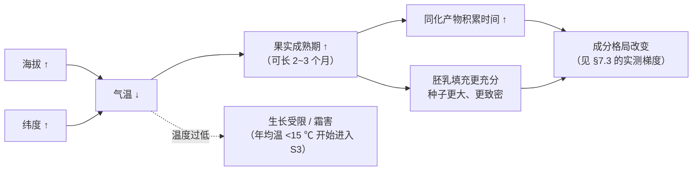

# 第 7 章 种植环境：海拔、纬度、荫蔽、土壤与气候

> **本章目标**：把"高海拔更好"这句话拆成三段——
> **哪一段是机理、哪一段只是相关、哪一段根本是代理变量在替温度说话。**
>
> 第 6 章说清了基因能造出什么，这一章说环境让它实际造了多少。
> 你会看到一个反直觉的实验结果：**遮荫让豆子变大，却让蔗糖变少。**
> 也会看到一组同向但不同幅度的梯度数据——它示范了"两个来源一致到什么程度才算一致"。
>
> 本章**不需要器具**，但需要你查一次自己常买那几支豆的**产地纬度**。

## 7.1 先把主角换掉：不是海拔，是温度

咖啡是多年生木本作物，它对环境的要求可以被写成一张**适宜性分级表**。
一项用 14 个全球环流模式评估咖啡、腰果、牛油果未来适宜性的研究，
在方法部分给出了它所采用的 *Coffea arabica* 生物物理需求（分 S1 高度适宜 /
S2 中度适宜 / S3 边际适宜 / N 不适宜四级）[^1]：

| 指标 | S1 高度适宜 | S2 | S3 | N 不适宜 |
|------|-----------|----|----|---------|
| **年均温** | **17–22 ℃** | 22–25 / 15–17 | 25–28 / 12–15 | >28 / <12 |
| 最冷月平均最低温 | 10–19 ℃ | 19–21 / 7–10 | 21–23 / 4–7 | >23 / <4 |
| **年降水量** | **1400–1800 mm** | 1800–2300 / 1000–1400 | 2300–4200 / 750–1000 | >4200 / <750 |
| 旱季长度 | 1–4 个月 | 4–5 | 5–6 | >6 |
| 最干月相对湿度 | 40–70% | 70–80 / 30–40 | 80–90 / 20–30 | >90 / <20 |
| 坡度 | 0–8% | 8–16% | 16–30% | >30% |
| **土壤 pH** | **5.5–6.5** | 6.5–7.0 / 5.0–5.5 | 7.0–7.5 / 4.5–5.0 | >7.5 / <4.5 |
| 土壤有机碳 | >1.2% | 0.8–1.2% | <0.8% | — |
| 粗碎屑含量 | 0–15% | 15–35% | 35–55% | >55% |
| 土壤盐分（ECe） | 0–0.5 | 0.5–1.5 | 1.5–2.5 | >2.5 |

> **读这张表的三个要点**：
>
> 1. **这是该研究为建模选定的参数，不是"官方标准"**。作者自己说明分级依据的是
>    多篇文献综合；研究本身还诚实地指出他们的模型在高温端"限制得不够严"[^1]。
>    本书引用它，是因为它把散落的经验值**写成了一张可核对的表**，不是因为它是权威裁决。
> 2. **主角是温度与水，不是海拔**。表里根本没有"海拔"这一项——
>    海拔是通过改变温度（和一点降水与辐射）来起作用的。
> 3. **土壤的门槛比想象中宽**。pH 5.5–6.5、有机碳 >1.2%、坡度 <8%——
>    这些是很常见的条件。该研究还发现，对这三种作物而言，**气候因子比土壤因子
>    更能限制适宜区的范围**[^1]。这一条直接打折了"神奇火山土"那类叙事的解释力。

[^1]: 本书编号 [E1]：Grüter、Trachsel、Laube & Jaisli (2022), *PLoS ONE* 17:e0261976（PMCID PMC8791496，开放获取）。上表为该文 Table 1 中咖啡一列的转述（本书重新排版、未复制原表版式）；作者注明分级"基于多个来源"。

## 7.2 海拔是温度的代理变量——而且它的换算取决于纬度

第 2 章已经给过机理的一半：在凉爽的高海拔产区，果实成熟可能比温暖低海拔产区
**晚 2~3 个月**；而温度高于 23 ℃ 会加速果实发育，胚乳填充时间减少、**种子变小**，
产出质量更低的豆[^2]。把这条和 §7.1 的年均温窗口放在一起，机理链就完整了：

**关键推论：海拔数字必须配上纬度才能读。**
品种目录给"最适海拔"下定义时，明确按纬度分了三档[^3]：

| 纬度带 | "低" | "中" | "高" |
|-------|------|------|------|
| 5°N–5°S | 1000–1200 m | 1200–1600 m | **>1600 m** |
| 5–15°N 或 5–15°S | 700–900 m | 900–1300 m | **>1300 m** |
| >15°N 或 >15°S | 400–700 m | 700–1000 m | **>1000 m** |

> **一条立刻能用的判断**：同样标 **1400 m** 的两支豆，
> 在近赤道产区属于"中"，在纬度 15° 以上产区已经是"高"。
> **看到海拔先看产国在几度。**（这也是[第 6 章 Q4](../../qa/06-species-varieties-qa.md#q4) 的结论。）
>
> 顺带注意：该定义里"最适"考虑的是**杯品潜力与对叶锈病、浆果病耐受性的综合**[^3]——
> 里面已经含了病害压力，不只是风味。第 8 章会解释为什么。

[^2]: 本书编号 [F1]：Unigarro 等 (2025), *Plants* 14(21):3396（开放获取）。见[第 2 章 §2.5](../01-foundation/02-cherry-anatomy.md)。
[^3]: 本书编号 [G5]：World Coffee Research《Varieties Catalog》"Optimal Altitude"字段定义（2026-09 核对）。

## 7.3 海拔改变了什么成分：三组独立数据，同向但不同幅

这是本章最"硬"的一节。三项在不同国家做的研究，给出了**方向一致**的梯度。

### 数据一：埃塞俄比亚大种植园（有明确斜率）

一项在埃塞俄比亚西南部大种植园做的研究，同时考察海拔、遮荫与处理法及其**交互作用**，
给出了可直接引用的斜率[^4]：

| 成分 | 随海拔的变化 | 斜率 |
|------|------------|------|
| 咖啡因 | **下降** | 每升高 100 m 约 **−0.12 g/kg** |
| 绿原酸类 | **下降** | 每升高 100 m 约 **−1.23 g/kg** |
| 蔗糖 | **上升**，但**只在水洗豆上显著** | 水洗 **+3.02 g/kg/100 m**；日晒仅 +0.36（不显著） |
| 蔗糖（按遮荫分层） | 上升，**无遮荫时效应强得多** | 无遮荫 **+2.11**；有遮荫 **+0.93** g/kg/100 m |
| 酸度评分 | **只在遮荫条件下**随海拔上升 | 遮荫 **+0.22 分/100 m**；无遮荫不显著 |

### 数据二：埃塞俄比亚的另一项研究（不同设计，同向）

另一项考察海拔、遮荫与**采收期**的研究报告[^5]：

- 海拔从中到高、约 **+400 m**，咖啡因**下降约 10%**；
- **高海拔 + 开放或中度遮荫 + 早中期采收**的豆品质最好；
- **在高海拔，浓密遮荫使 Q1（≥85 分）咖啡的比例下降了 50%**；
- **早采比晚采把 Q1 比例从 27% 提高到 73%**；
- 作者的总结很值得抄下来：这些因素造成的**分数变化本身很小**，
  但"可能引起 Q1 与 Q2 比例的剧烈切换"[^5]。

> **⚠️ 这里有一处必须诚实指出的不一致**：
> 按数据一的斜率，+400 m 对应咖啡因下降约 0.48 g/kg；
> 若以生豆咖啡因约 12 g/kg（1.2%）为基数，这是约 **4%**，
> 而数据二报告的是 **10%**。两者**方向一致、量级同级，但幅度不同**。
>
> 这不奇怪——不同品种、地块、年份与测定方法都会改变斜率。
> 但按本书纪律：**方向可以写，具体百分比必须注明是哪一项研究的观测，不能通用化。**
> 这条分歧已登记进[出处与资料登记 §六](../../standards.md)。

### 数据三：中国云南普洱（第三个独立产区）

一项在普洱做的研究给出了又一个独立方向验证[^6]：

- **脂肪酸含量随海拔升高而增加**；
- **生物碱与绿原酸含量随海拔升高而下降**；
- **有机酸与单糖没有明显趋势**；
- 112 个检出挥发物中**只有 11 个**受海拔显著影响；吡嗪类与醇类倾向下降、醛类倾向上升；
- 杯测里**香气与风味随海拔倾向上升，其他指标变化不显著**。

> **三组数据能支持的结论，只有这么多**：
>
> ✅ **咖啡因与绿原酸随海拔升高而下降**——三个来源同向（[E2][E3][E8]）。
> ⚠️ **蔗糖随海拔升高而上升**——只有一项给出斜率，且**依赖处理法与遮荫**[^4]；
>   另一项在单糖上没看到趋势[^6]。**本书不写通用斜率。**
> ⚠️ **杯测分随海拔上升**——变化小、且只体现在部分维度上[^5][^6]。
>
> 最重要的一句：**这些都是观察性研究**。高海拔地块往往同时意味着
> 老树、小农、手工采摘、更精细的处理——这些变量在现实中纠缠在一起，
> 上面的斜率**不能被当成因果系数**。

[^4]: 本书编号 [E2]：Worku、de Meulenaer、Duchateau & Boeckx (2018), *Food Research International* 105:278–285。已读摘要。
[^5]: 本书编号 [E3]：Tolessa、D'heer、Duchateau & Boeckx (2017), *J. Sci. Food Agric.* 97:2849–2857（PMID 27786361）。Q1/Q2 是埃塞俄比亚按杯测总分的分组（Q1 ≥ 85、Q2 为 80–84.75）。已读摘要。
[^6]: 本书编号 [E8]：Hu、Xu、Chen、Kuang、Xiao & Dong (2024), *Foods* 13(23):3842（PMCID PMC11640416，开放获取）。已读摘要。

## 7.4 遮荫：一个被浪漫化的变量

"树荫下慢慢长大的咖啡更甜"是精品圈最讨人喜欢的叙事之一。它的机理听起来无懈可击：
遮荫降温 → 成熟慢 → 积累多。但实测数据把这条链**从中间打断了**。

### 反直觉结果：遮荫让豆子更大，却让蔗糖更低

一项直接比较**全日照（FS）与遮荫（SH）**下咖啡果实发育与糖代谢的研究发现[^7]：

- 遮荫下的豆子**更大**，原因是**珠心（perisperm）组织发育更充分**；
- 但**遮荫显著降低了蔗糖含量，并提高了还原糖**；
- 遮荫下蔗糖合酶与蔗糖磷酸合酶的活性在成熟期**更高**，
  作者据此推断蔗糖代谢被**重新导向了其他通路**，而不是积累起来。

这和 §7.3 数据一里的那条分层结果**互相印证**：
海拔对蔗糖的正效应，在**无遮荫**时是 +2.11 g/kg/100 m，在**有遮荫**时只剩 +0.93[^4]。
两项独立研究、两种完全不同的设计，都指向同一句话：

> **遮荫不会让豆子更甜。它让豆子更大。这是两件事。**

### 遮荫确实在做的事

| 遮荫的作用 | 证据 | 备注 |
|-----------|------|------|
| **缓冲温度** | 全球气候栅格数据与**遮荫农场**实测温度更接近，而与开放农场差得多；去掉遮荫树带来的升温，其影响相当于最乐观排放情景下约 50 年的气候变化[^8] | 该研究的对象是**食虫鸟类多样性**，不是咖啡品质。本书只取"遮荫确实显著改变微气候"这一层 |
| **不一定牺牲产量（在合适的遮荫度下）** | 厄瓜多尔亚马孙地区 5 年生罗布斯塔：**约 25% 遮荫**下的果实产量与高光照下相当；有豆科遮荫树的植株高 10%、叶氮高 22%[^9] | **对象是罗布斯塔、幼树、湿热条件**，不能直接外推到阿拉比卡高海拔产区 |
| **过度遮荫会伤品质** | **高海拔下浓密遮荫使 Q1 比例下降 50%**[^5] | 与"遮荫总是好"的叙事直接冲突 |
| **改变生态系统与病虫害** | 哥伦比亚 24 个农场：天敌多样性与遮荫系统和树密度**正相关**；但咖啡果小蠹侵染率与遮荫树的有无**不相关**，却与海拔**负相关**[^10] | 生态收益与虫害控制**不是同一件事**，见第 8 章 |

> **本章对遮荫的完整判断**：
> 遮荫是一个**真实且重要**的农艺与生态变量——它缓冲温度、维持生物多样性、
> 增加土壤有机碳。但"遮荫 → 更慢 → 更甜"这条**风味链**，
> 目前的实测证据**不支持**，甚至有反向证据[^7][^4]。
> 把生态价值和风味价值分开讲，是这一节唯一要你带走的东西。

[^7]: 本书编号 [E4]：Geromel 等 (2008), *Plant Physiology and Biochemistry* 46:569–579（PMID 18420417）。已读摘要。
[^8]: 本书编号 [E10]：Schooler、Johnson、Njoroge & Bean (2020), *Ecology and Evolution* 10:12960–12972（PMCID PMC7713971，开放获取）。已读摘要。
[^9]: 本书编号 [E9]：Piato、Subía、Lefort、Pico、Calderón & Norgrove (2022), *Life* 12(6):807（PMCID PMC9224700，开放获取）。已读摘要。
[^10]: 本书编号 [P10]：Moreno-Ramírez 等 (2026), *Agriculture, Ecosystems & Environment* 395。见第 8 章。

## 7.5 蔗糖是什么时候攒起来的：一条会在第 9 章用到的机理

既然蔗糖是最重要的风味前体之一（[第 1 章](../01-foundation/01-bean-composition.md)），
就值得问一句：它是**什么时候**进到种子里的？

一项对咖啡果实三种组织（果皮、珠心、胚乳）发育过程中蔗糖代谢的研究给出了答案[^11]：

- **蔗糖合酶在胚乳与果皮发育的最后阶段活性最高**，
  而且这个活性与这两种组织在该阶段的**蔗糖积累高度同步**；
- 用 ¹⁴CO₂ 饲喂实验发现：**叶片光合作用对种子发育的贡献大于果皮**；
- 珠心组织会**暂时积累淀粉**，随着种子发育被降解——它在物质"下载"过程中起转运作用。

> **两条会反复用到的推论**：
>
> 1. **"最后阶段"这三个字是第 9 章的伏笔**：蔗糖在成熟末期才攒足，
>    所以**提早摘下来的果子，蔗糖还没攒够**。这与[第 2 章](../01-foundation/02-cherry-anatomy.md)
>    引用的"蔗糖在果实完全成熟时达到最大浓度"是同一件事的两个侧面。
> 2. **糖主要来自叶子，不是果肉**：这条从另一个角度削弱了"日晒豆的甜来自果肉糖分渗入"
>    那个说法（第 2 章已判为 ⚠️ 机理未经证实）——
>    种子里的糖，主要是叶片光合产物经维管束运进来的。

[^11]: 本书编号 [E5]：Geromel 等 (2006), *Journal of Experimental Botany* 57:3243–3258（PMID 16926239）。已读摘要。

## 7.6 气候变化：一个来源之间分歧很大的话题

这是本章唯一需要专门处理"来源分歧"的地方，而且分歧**很大**。

| 来源 | 结论 | 方法 |
|------|------|------|
| 拉丁美洲的咖啡与传粉者耦合研究[^12] | 到 2050 年，拉美**适宜种植咖啡的面积减少 73~88%**；这个降幅比全球尺度评估**还要大 46~76%**；蜜蜂丰富度在未来适宜区内下降 8~18% | 物种分布模型 + 多情景 |
| 全球三作物适宜性评估[^1] | 三种作物里**咖啡最脆弱**，在所有主产区都以负面影响为主；但腰果与牛油果的全球适宜面积反而扩大 | 基于气候与土壤需求的分级模型 + 14 个 GCM |
| 生理学综述[^13] | 有证据表明"**升温本身对咖啡适宜性的危害可能小于此前估计——至少在水分供应充足时**"；升高的大气 CO₂ 浓度能在生理与生化层面显著缓解热胁迫 | 对生理实验证据的综述 |

> **本书的处理方式**：**三边都写，并标明它们方法不同。**
>
> 分歧的根源是可以说清楚的：**物种分布模型**问的是"当前气候空间会移到哪里"，
> 它默认作物的气候需求是固定的；**生理学研究**问的是"这株树到底扛不扛得住"，
> 并把 CO₂ 施肥效应、水分供应、品种差异算进来。两类方法回答的**不是同一个问题**。
>
> 本书**不站队**，也**不给"咖啡还有多少年"这类说法**背书。
> 能确定的只有：温度窗口很窄（§7.1），而咖啡是一种**要活几十年**的木本作物，
> 这两条叠加就意味着**选址与品种决策的时间尺度很长**。
>
> 另一条本书**特意不写**的东西：所谓"2050 年咖啡将消失"这类传播广泛的说法。
> 上面三项研究没有一项支持这句话——降幅说的是**适宜面积**，不是**存在与否**。

[^12]: 本书编号 [E7]：Imbach 等 (2017), *PNAS* 114:10438–10442（PMCID PMC5625888）。已读摘要。
[^13]: 本书编号 [E6]：DaMatta、Avila、Cardoso、Martins & Ramalho (2018), *Journal of Agricultural and Food Chemistry* 66:5264–5274（PMID 29517900）。已读摘要。

## 7.7 常见说法辨析

按本书约定标注**证据强度**：✅ 有共识 / ⚠️ 有争议 / ❌ 明确错误 / **缺乏证据**。

| 说法 | 判定 | 说明 |
|------|------|------|
| "高海拔咖啡更好" | ⚠️ **方向有依据、机制被说错、幅度被夸大** | 起作用的是**温度 → 成熟期长度 → 胚乳填充**[^2]，海拔只是代理。实测上咖啡因与绿原酸确实随海拔下降（三个独立产区同向[^4][^5][^6]），杯测分也倾向上升，但**变化很小**，只是恰好可能跨过分级门槛[^5] |
| "海拔 1500 米以上才算精品" | ❌ **把一个随纬度变化的量当成了固定门槛** | "最适海拔"的定义明确随纬度分三档：赤道带的"高"是 >1600 m，纬度 >15° 的"高"只要 >1000 m[^3] |
| "高海拔的豆更硬更密，所以要烘得更久 / 磨得更细" | ⚠️ **前半句有机理、后半句本书不背书** | 温度低、成熟期长确实与胚乳填充更充分相关[^2]；但"密度 → 具体烘焙或研磨参数"的定量关系，本书留到第 15、19、23 章去查，这里不给参数 |
| "遮荫种植的咖啡更甜" | ❌ **有反向实验证据** | 直接对照实验显示遮荫**降低**蔗糖、提高还原糖，同时让豆子更大[^7]；海拔对蔗糖的正效应在遮荫下**减半**[^4] |
| "遮荫种植没有意义，就是营销" | ❌ **明确错误** | 遮荫显著改变微气候（实测温度更接近全球气候栅格值[^8]）、维持天敌多样性[^10]；在合适遮荫度（约 25%）下产量也未必下降[^9]。**它的价值是生态与农艺的，不是甜度的** |
| "浓密遮荫总比稀疏好" | ❌ **明确错误** | 高海拔条件下浓密遮荫使 Q1 咖啡比例下降 50%[^5] |
| "火山土 / 某种特殊土壤造就了风味" | **缺乏证据**（本章范围内） | 适宜性建模显示对咖啡而言**气候因子比土壤因子更能限制适宜区**[^1]；土壤的适宜窗口（pH 5.5–6.5、有机碳 >1.2%）相当常见。本书**未读到**"某类土壤 → 某类风味"的对照研究。土壤当然会通过养分供给影响植株，但"土壤 = 风味签名"这一步缺乏依据 |
| "咖啡 2050 年就要消失了" | ❌ **明确错误（曲解了原文）** | 相关研究说的是**适宜面积**大幅缩减（拉美 73~88%[^12]），不是物种消失；而且另一支生理学证据认为升温本身的危害可能被高估，尤其在水分充足时[^13] |
| "咖啡树喜欢阴凉，所以越湿越好" | ❌ **明确错误** | 年降水 S1 窗口是 1400–1800 mm，**超过 4200 mm 即判为不适宜**；最干月相对湿度 >90% 同样不适宜[^1] |
| "热带就能种咖啡" | ⚠️ **不完整** | 决定性的是年均温窗口（S1 为 17–22 ℃）与最冷月最低温、旱季长度等[^1]，热带低地往往**太热**（>28 ℃ 即 N 级）。这正是罗布斯塔在低地、阿拉比卡在高地的原因 |
| "同一产区的豆风味应该差不多" | ⚠️ **忽略了交互作用** | §7.3 那几组数据里最值得注意的不是主效应，而是**交互作用**：海拔对蔗糖的效应依赖处理法，海拔对酸度的效应依赖遮荫[^4]。**产区是一个把多个变量打包的标签，不是一个变量** |

## 7.8 🔎 买豆与冲煮时的用处

1. **看到海拔数字，先查产国纬度**，再用 §7.2 的三档表把它翻译成"低 / 中 / 高"。
   在近赤道产区，1200 m 只是"低到中"。
2. **别把海拔当品质保证**。它能支持的只有"咖啡因与绿原酸倾向更低、
   杯测的香气与风味维度倾向略高"，而且**幅度很小**[^4][^5][^6]。
3. **看到"遮荫种植"，把它读成生态与农艺信息，不要读成甜度承诺**。
   如果店家把遮荫当成甜度依据，你可以请他说明依据来自哪里。
4. **看到"火山土壤"这类描述，知道它目前缺乏风味层面的对照证据**——
   记下来，但不要为它单独付费。
5. **遇到"同产区不同批次差很多"，先想交互作用**：
   海拔 × 处理法、海拔 × 遮荫、采收期，这些在实测里都会互相改变效应大小[^4][^5]。
   这不是店家不专业，往往是农业本身的真实面貌。

## 7.9 思考题

1. §7.1 的适宜性表里**没有"海拔"这一项**。请解释为什么，
   并说明"海拔是代理变量"这句话的准确含义。
2. 数据一给出"咖啡因每升高 100 m 下降约 0.12 g/kg"，数据二给出"升高约 400 m 下降约 10%"。
   请算一算这两个数字差多少，并说明为什么本书**仍然认为它们互相支持**，
   却又**不允许把任何一个写成通用斜率**。
3. 遮荫让豆子**更大**却让蔗糖**更低**。请解释这为什么不矛盾，
   并说明它对"大豆子 = 好豆子"这个直觉意味着什么。
4. 一项研究说"这些因素造成的分数变化本身很小，但可能引起 Q1 与 Q2 比例的剧烈切换"。
   请用你自己的话解释这句话描述的是什么现象，并举一个咖啡以外的例子。
5. §7.5 说蔗糖在胚乳发育的**最后阶段**才大量积累，且主要来自**叶片**光合产物。
   请由此推出**两条**预测：一条关于采收时机（第 9 章会验证），
   一条关于"日晒豆的甜来自果肉"那个说法。
6. **【案例】** 一份豆袋写着：*"海拔 1350 米，百年老树，全程林荫遮蔽慢速成熟，
   因此糖分积累充分，甜感突出。火山土壤赋予独特矿物风味。"*
   产国写的是**巴西（南纬约 21°）**。请逐句判断，并指出其中**与实测证据直接冲突**的一句。
7. **【案例】** 两位朋友争论。A 说："研究显示 2050 年适宜种咖啡的地方要少七成，
   所以咖啡要完了。"B 说："生理学研究说升温危害被高估了，所以那些模型都是危言耸听。"
   请指出**两个人各自的推理问题**，并说明一个更准确的表述应该是什么样。
8. **【辨识】** 挑三支你手上的豆，查出它们的**产国纬度**与**标注海拔**，
   用 §7.2 的表把每支归到"低 / 中 / 高"。然后回答：
   有没有哪一支的"高海拔"标签在换算之后不成立？
9. 请设计一个实验，用来检验"遮荫使咖啡更甜"这个说法。
   写清楚你要控制哪些变量、测什么指标（化学的与感官的各至少一个）、
   以及**什么结果会让你放弃这个假设**。

> 📖 **参考答案**（想清楚再看）：[Q1](../../qa/07-growing-environment-qa.md#q1) ·
> [Q2](../../qa/07-growing-environment-qa.md#q2) · [Q3](../../qa/07-growing-environment-qa.md#q3) ·
> [Q4](../../qa/07-growing-environment-qa.md#q4) · [Q5](../../qa/07-growing-environment-qa.md#q5) ·
> [Q6](../../qa/07-growing-environment-qa.md#q6) · [Q7](../../qa/07-growing-environment-qa.md#q7) ·
> [Q8](../../qa/07-growing-environment-qa.md#q8) · [Q9](../../qa/07-growing-environment-qa.md#q9)

## 7.10 本章实操

### 🅐 无器具版 · 任务一：给你的豆做一次"海拔换算"

查产国纬度（搜产区名 + "纬度"即可，精确到度就够），然后用 §7.2 的表归档。

| 豆 | 产国 / 产区 | 大致纬度 | 袋上海拔 | 换算后属于 | 袋上是否声称"高海拔"？ | 成立吗 |
|----|-----------|---------|---------|-----------|---------------------|-------|
| | | | | ☐低 ☐中 ☐高 | ☐是 ☐否 | ☐是 ☐否 |
| | | | | ☐低 ☐中 ☐高 | ☐是 ☐否 | ☐是 ☐否 |
| | | | | ☐低 ☐中 ☐高 | ☐是 ☐否 | ☐是 ☐否 |

> **做完会发现的一件事**：近赤道产区（肯尼亚、哥伦比亚、埃塞俄比亚部分产区）
> 标 1500~1800 m 很常见，而巴西、云南这些纬度更高的产区标 1100~1400 m 就已经是"高"。
> **"海拔竞赛"很大程度上是纬度差异被当成了品质差异。**

### 🅐 无器具版 · 任务二：把一句营销文案拆成变量

找一段带环境描述的豆袋文案（自己的、或电商详情页），逐句填：

| 原句 | 它声称的机制 | 本章的证据状态 | 如果为真，应该能观测到什么 |
|------|------------|--------------|------------------------|
| 例："高海拔慢速生长，风味更浓缩" | 低温 → 成熟慢 → 积累多 | 机理部分成立（[F1][E2]），但"浓缩"没有定义 | 蔗糖更高、绿原酸更低——**但这需要化验，不是喝出来的** |
| | | | |
| | | | |

### 🅐 无器具版 · 任务三：读一次适宜性表，给你的城市打分

查一下你所在城市（或你老家）的**年均温、年降水量、最冷月平均最低温**
（气象网站或百科都能查到），对照 §7.1 的表给它打级。

| 指标 | 你查到的值 | 落在哪一级 |
|------|----------|-----------|
| 年均温 | | ☐S1 ☐S2 ☐S3 ☐N |
| 年降水量 | | ☐S1 ☐S2 ☐S3 ☐N |
| 最冷月平均最低温 | | ☐S1 ☐S2 ☐S3 ☐N |
| **综合（取最差的一项）** | | |

> **为什么要做这个看起来没用的练习**：因为它会让你亲手确认
> **咖啡的气候窗口有多窄**——绝大多数人的城市会在某一项上直接掉到 N。
> 这个"窄"是理解第 8 章（病害）与气候话题的前提。

### 🅑 有条件版 · 任务四：同产区、不同海拔段的对照（备齐后再做）

> **所需器具**：同一产国**同一产区**、同一处理法、烘焙度接近、烘焙日期接近的两支豆，
> 但**标注海拔明显不同**（建议差 300 m 以上）；秤、磨、相同冲煮器具。
> **替代方案**：找不到同产区的，退而求其次用同一烘焙商的两支同处理法豆，
> 并在记录里**如实列出所有未控制的变量**。

用[冲煮记录表](../../forms/brew-log.md)各记一次，另填：

| 观察项 | 低海拔那支 | 高海拔那支 | 本章能解释的部分 |
|-------|-----------|-----------|---------------|
| 干香强度 | | | 挥发物受海拔影响的只有少数几个[^6] |
| 酸的**强度** | | | 酸度评分随海拔的效应只在遮荫条件下显著[^4]——**不要期待明显差异** |
| 苦 / 涩 | | | 绿原酸随海拔下降[^4][^5][^6] |
| 甜感 | | | 蔗糖的海拔效应**依赖处理法与遮荫**，不保证出现 |
| 你**能否**分辨两杯？ | | | |

> **这个任务的正确预期是"差别可能很小甚至分不出"**。
> 如果你分不出，那不是你的问题——数据本身就说变化"很小"[^5]。
> 真正有价值的记录是：**你原本预期差多少，实际差多少。**
> 这个落差本身就是对"海拔叙事"的一次校准。

### 🅑 有条件版 · 任务五：测一次你自己的"期待效应"（备齐后再做）

> **所需器具**：**一支**豆（只要一支）；两个相同的杯子；一位同伴。
> **替代方案**：没有同伴，就自己写两张标签扣着抽，抽完立刻冲。

| 步骤 | 做法 |
|------|------|
| 1 | 同伴用**同一支豆**冲两杯，但告诉你"1 号是海拔 1900 m 的微批次，2 号是 1100 m 的商业豆" |
| 2 | 你按平常方式品鉴，各写三个描述词 + 给一个 1–10 的喜好分 |
| 3 | 揭晓：两杯是同一支豆 |
| 4 | 记录：你给两杯的分数差了多少？ |

> **这个实验只有一个目的**：让你亲身确认，
> **"高海拔"三个字本身就能改变你的评分**。
> [第 4 章](../01-foundation/04-perception.md)讲过期待效应的机制，这里让你量一次自己的。
> 量出来的那个分差，就是你以后做任何"非盲"品鉴时必须扣掉的噪声。

---

## 7.11 本章依据

完整书目信息登记在[出处与资料登记 §4.10](../../standards.md)。

- **[E1]** Grüter、Trachsel、Laube & Jaisli (2022), *PLoS ONE* 17:e0261976。本章 §7.1 的主干：
  该文 Table 1 中 *Coffea arabica* 的生物物理需求分级（年均温、最冷月最低温、年降水、
  旱季长度、最干月相对湿度、坡度、土壤质地、粗碎屑、有机碳、pH、盐分）；
  以及"气候因子比土地与土壤因子更能限制适宜区范围""三种作物中咖啡最脆弱"
  这两条结论，和作者自承高温端限制"不够严"的诚实说明。开放获取，已读全文相关章节。
- **[E2]** Worku、de Meulenaer、Duchateau & Boeckx (2018), *Food Research International* 105:278–285。
  用到：咖啡因 −0.12、绿原酸 −1.23 g/kg per 100 m；蔗糖 +3.02（水洗，显著）vs +0.36（日晒，不显著）；
  蔗糖 +2.11（无遮荫）vs +0.93（遮荫）；酸度 +0.22 分/100 m（仅遮荫下显著）；
  无遮荫下日晒物理品质分 37.2 高于水洗 29.1。已读摘要。
- **[E3]** Tolessa、D'heer、Duchateau & Boeckx (2017), *J. Sci. Food Agric.* 97:2849–2857。
  用到：+400 m 咖啡因约 −10%；高海拔 + 开放或中度遮荫 + 早中期采收品质最好；
  高海拔浓密遮荫使 Q1 比例下降 50%；早采使 Q1 比例从 27% 升至 73%；
  以及"分数变化很小但可能引起 Q1/Q2 比例剧烈切换"这句总结。已读摘要。
- **[E4]** Geromel 等 (2008), *Plant Physiol. Biochem.* 46:569–579。本章 §7.4 的关键反例：
  遮荫使豆更大（珠心发育更充分），但**显著降低蔗糖、提高还原糖**；
  蔗糖合酶与 SPS 活性更高，提示蔗糖代谢被导向其他通路。已读摘要。
- **[E5]** Geromel 等 (2006), *J. Exp. Bot.* 57:3243–3258。用到：蔗糖合酶在胚乳与果皮发育
  末期活性最高且与蔗糖积累同步；¹⁴CO₂ 实验显示叶片光合对种子发育的贡献大于果皮；
  珠心暂时积累淀粉后降解。已读摘要。
- **[E6]** DaMatta 等 (2018), *J. Agric. Food Chem.* 66:5264–5274。用到：
  "升温本身对咖啡适宜性的危害可能小于此前估计——至少在水分供应充足时"，
  以及升高的 CO₂ 缓解热胁迫这一条。已读摘要。
- **[E7]** Imbach 等 (2017), *PNAS* 114:10438–10442。用到：拉美适宜区到 2050 年减少 73~88%，
  比全球尺度评估大 46~76%；未来适宜区内蜜蜂丰富度下降 8~18%。已读摘要。
- **[E8]** Hu 等 (2024), *Foods* 13(23):3842。用到：普洱产区脂肪酸随海拔上升、
  生物碱与绿原酸随海拔下降、有机酸与单糖无明显趋势；112 个挥发物中 11 个受显著影响；
  杯测的香气与风味随海拔上升而其他指标不显著。开放获取，已读摘要。
- **[E9]** Piato 等 (2022), *Life* 12(6):807。用到：约 25% 遮荫下罗布斯塔果实产量与高光照相当；
  豆科遮荫树下植株高 10%、叶氮高 22%。开放获取，已读摘要。
- **[E10]** Schooler 等 (2020), *Ecology and Evolution* 10:12960–12972。用到：
  全球气候栅格温度更接近遮荫农场实测值；去掉遮荫树造成的升温影响相当于
  最乐观排放情景下约 50 年的气候变化（**该研究的结局变量是鸟类多样性，不是咖啡品质**）。
  开放获取，已读摘要。
- **[F1]** Unigarro 等 (2025), *Plants* 14(21):3396（第 2 章已登记）。用到：高海拔成熟晚 2~3 个月、
  >23 ℃ 加速发育使种子变小。
- **[G5]** WCR《Varieties Catalog》。用到："最适海拔"随纬度分三档的定义，
  及该定义把病害耐受性算在内这一点。
- **[P10]** Moreno-Ramírez 等 (2026)。用到：天敌多样性与遮荫正相关、
  咖啡果小蠹侵染与遮荫无关而与海拔负相关。详见第 8 章。

**本章刻意没写的东西**：

- **"海拔每升高 100 m 杯测分提高多少"**——没有可交叉验证的定量关系，
  而且原研究明确说分数变化"很小"；
- **土壤类型与风味的对应**——本书未读到对照研究；只写了适宜性表里的**土壤适宜窗口**；
- **"咖啡将在某年消失"这类时间点断言**——相关研究讲的是适宜面积而非存续，
  且方法之间分歧很大（§7.6）；
- **密度 / 硬度与烘焙、研磨参数的定量关系**——留到第 15、19、23 章；
- **具体产区的风味坐标**——留到第 14 章，届时要先挂上品种与处理法。

---

**下一章**：第 8 章 病虫害与品种更新——
为什么一场真菌病能决定你杯子里的东西？为什么"抗病品种"会在二三十年后失效？
这一章会出现本书第一个**经济学变量决定生物学结果**的例子。
