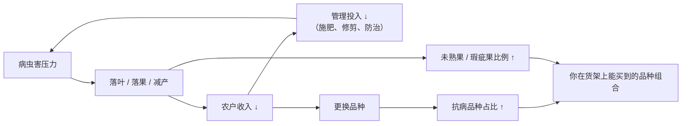
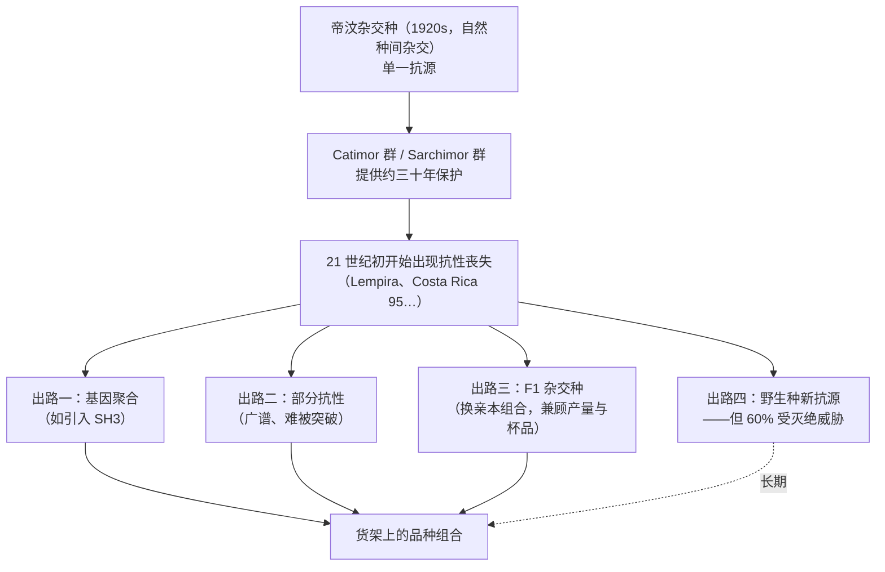

# 第 8 章 病虫害与品种更新：为什么抗病性会决定你杯子里的东西

> **本章目标**：说明一件多数咖啡书跳过、但实际上决定了现代品种版图的事——
> **你能买到什么品种，很大程度上是病虫害压力筛选的结果。**
>
> 第 6 章说基因能造出什么，第 7 章说环境让它造了多少，
> 这一章说：**先得有机会造完**。一棵落光叶子的树不会有好果子。
>
> 本章还会出现本书第一个**经济变量决定生物学结果**的例子——
> 一场大流行的主要驱动因素，被研究者判定为**咖啡价格**。
>
> 本章**不需要器具**。

## 8.1 先建立一个因果方向

咖啡圈讨论品种时，默认的价值轴是"好不好喝"。但育种家的价值轴是另一条：

注意图里那条**反馈回路**：收入下降 → 管理投入下降 → 病害更重 → 收入更低。
这条回路是理解 §8.2 那场危机的钥匙。

## 8.2 咖啡叶锈病：一次改写版图的大流行

### 病原与症状

**咖啡叶锈病（coffee leaf rust, CLR）**由真菌 *Hemileia vastatrix* 引起。
一篇对 2008–2013 年危机的系统分析这样描述它[^1]：

- 它是**专性寄生菌**，侵染 *Coffea* 属的活叶；在栽培物种中 ***C. arabica* 受害最重**；
- 侵染形式是**夏孢子（uredospore）**；
- 最早的症状是叶**背面**的小块淡黄色病斑（菌丝经**气孔**侵入），
  病斑扩大、融合，产生标志性的**橙色**孢子堆；叶正面可见褪绿斑；末期病斑坏死；
- 后果是**落叶**，严重时导致枝条死亡和大幅减产。

> **为什么落叶这么要命**：[第 7 章 §7.5](07-growing-environment.md) 已经给过答案——
> ¹⁴CO₂ 实验显示，**种子发育所需的同化产物主要来自叶片**，而不是果皮[^2]。
> 叶子掉光，等于把给种子供糖的工厂关掉了。
> 所以叶锈病不只是"减产"，它**同时改变留在树上那些果子的品质本金**。

### 那场危机有多大：可核对的数字

该研究给出的产量影响[^1]：

| 地区 | 时期 | 产量变化 |
|------|------|---------|
| 哥伦比亚 | 2008–2011 流行年**平均** | 比 2007 年下降 **31%** |
| 中美洲 | 2013 年 vs 2011–12 | 下降 **16%** |
| 中美洲 | 2013–14 vs 2012–13 | 下降 **10%** |

疫情波及哥伦比亚（2008–2011）、中美洲与墨西哥（2012–13）、秘鲁与厄瓜多尔（2013）[^1]。
研究者特别指出：对中美洲大量小农与采摘工而言，
咖啡往往是**买粮食和基本农资的唯一收入来源**，因此这场病害产生了**粮食安全**层面的间接影响[^1]。

### 两个驱动因素：一个是经济的，一个是气候的

这是本章最重要的一段。该研究给出的结论是[^1]：

> **"这些流行的主要驱动因素是经济的与气象的。"**

**经济侧**：过去 37 年中美洲与哥伦比亚**所有强度较大的流行**，
都与**咖啡盈利能力低迷的时期重合**——
2012–13 年中美洲那次是因为**咖啡价格下跌**，2008–11 年哥伦比亚那次是因为**投入品成本上升**。
低盈利导致**管理不到位**，进而使植株对病虫害的**脆弱性上升**[^1]。

**气候侧**：两地近期流行的一个共同点是**日较差（diurnal thermal amplitude）缩小**——
最低温升高、最高温降低[^1]：

| 地点 | 对比时段 | 最低温 / 最高温变化 |
|------|---------|-------------------|
| 哥伦比亚 Chinchiná | 2008–2011 vs 低发病期 1991–1994 | **+0.1 ℃ / −0.5 ℃**（平均） |
| 危地马拉（1224 个农场） | 2012 vs 常年 | **+0.9 ℃ / −1.2 ℃**（平均） |

研究者认为这**很可能缩短了病害的潜育期**（latency period），
并把这几次流行称为"**对未来的警告**"，因为它们是被与气候变化一致的天气条件放大的[^1]。

> **注意这些数字有多小**：**零点几度**。
> 这正是"温度窗口很窄"（[第 7 章 §7.1](07-growing-environment.md)）
> 在另一个维度上的表现——不是咖啡树受不了，而是**病原菌的世代周期被加快了**。
> 病害流行学里，潜育期缩短一点点，一个季节内能多跑几轮，指数增长的底数就变了。

### 哥伦比亚怎么应对的：一个可核对的案例

同一研究记录了哥伦比亚的响应[^1]：

- 自 2009 年起，在 60 万公顷易感品种中，**超过 30 万公顷被更换为新的抗病多系品种 Castillo**；
- 到当时，哥伦比亚**超过 60% 的咖啡地种的是抗病品种**；
- 全国叶锈病发病率从 **2009 年的 40% 以上降到 2013 年的 3%**。

> **这段历史直接写进了你的杯子**：如果你近十几年喝过哥伦比亚豆，
> 它很可能是 Castillo 或其他渗入系，而不是 Caturra 或 Typica。
> "哥伦比亚的味道变了"这种感觉，**有一个可追溯的农业史原因**。

[^1]: 本书编号 [P1]：Avelino 等 (2015). The coffee rust crises in Colombia and Central America (2008–2013): impacts, plausible causes and proposed solutions. *Food Security* 7:303–321，doi:10.1007/s12571-015-0446-9（CC BY 开放获取）。本书已读全文相关章节。
[^2]: 本书编号 [E5]：Geromel 等 (2006), *J. Exp. Bot.* 57:3243–3258。见[第 7 章 §7.5](07-growing-environment.md)。

## 8.3 抗性为什么会失效：小种、毒性因子与基因聚合

这一节解释一个让很多人困惑的现象：**"抗病品种"为什么会在二三十年后不抗了。**

### 基因对基因：抗性不是一堵墙，是一把锁

植物的**抗性基因（在咖啡叶锈这里叫 SH 基因）**与病原的**毒性因子（v）**是配对的。
病原若带有与某个 SH 基因对应的毒性因子，这把锁就被打开了。
不同的毒性因子组合，构成不同的**[生理小种](../../glossary.md#race)（race）**。

该研究给出了一条可核对的演化时间线[^1]：

- 叶锈病 **1970 年**传入拉丁美洲；
- 传入巴西等国的**小种 II 只带有已知九个毒性因子中的一个（v5）**；
- 随着抗病材料（收集圃里的、商业地块里的）施加**选择压力**，
  在巴西与哥伦比亚**逐步出现了复杂度更高的小种**，涉及最多**八个**毒性因子的不同组合；
- 相比之下，**中美洲的锈菌演化明显更慢**：传入 21 年后（到 1997 年），
  当地只鉴定出两个小种；研究者认为原因是**当地几乎没有施加选择压力**（种的都是易感品种）。

> **这条时间线里藏着一个残酷的因果**：
> **抗病品种本身就是驱动病原进化的选择压力。**
> 你种的抗病品种越多、种得越久，能打开这把锁的小种就越有机会被选出来。
> 这不是咖啡独有的现象，是所有"单基因抗性"作物的共同宿命。

### 已经发生的失效

品种目录在"关于叶锈抗性的说明"里写得很直白[^3]：

- 20 世纪后期出现的**渗入型抗锈阿拉比卡品种**，为许多产区提供了**近三十年**的保护；
- **21 世纪初开始**，中美洲的专家注意到一些历史上抗锈的品种开始被感染，
  特别是**洪都拉斯的 Lempira** 与**哥斯达黎加的 Costa Rica 95**；
- 由于大多数抗锈品种的抗性**来自同一个亲本（帝汶杂交种）**，
  多数专家认为"**现存的多数抗锈品种在中近期内将不再抗锈**"；
- 目录方同时诚实说明追踪这件事有多难：农户常常**不确定自己种的是什么品种**，
  锈病对同一品种的影响在不同地理条件、面对不同小种时也不同；
  因此他们只在两种情况下更新抗性状态——**育种方正式声明抗性丧失**，
  或 **WCR 用 DNA 指纹并咨询育种者与当地专家后确认**。

一项在波多黎各做的三年、15 个点的田间调查提供了独立佐证[^4]：
**易感品种的叶锈显著多于抗病品种，但抗病品种也有锈病损害**，
其中损害最多的抗病品种恰恰是 **Marsellesa**（一个 Sarchimor 系，
在 2017 年飓风后被大量用于替换损失的易感品种）。

### 育种上的两条出路

| 出路 | 做法 | 依据 |
|------|------|------|
| **[基因聚合](../../glossary.md#pyramiding)（pyramiding）** | 把**多个**主效抗性基因累积到一个品种里。病原要突破就得同时丢掉或掩盖多个无毒基因，难度指数上升。一个实际例子是把源自 *C. liberica* 的 **SH3** 抗性基因渗入到已带其他抗性基因的阿拉比卡品种里 | [^1] |
| **部分抗性（partial resistance）** | 不追求"完全不发病"，而是降低发病速率。它是**广谱**的，因而**不容易促使病原产生突破它的基因型**。哥伦比亚品种在丧失完全抗性后，被认为**保留了部分抗性** | [^1] |

研究者还指出一个技术细节：**基因聚合对无性繁殖的病原特别有效**，
因为这类病原**无法通过有性重组**把分散的毒性因子组合到一起[^1]。

> **诚实说明**：部分抗性"在商业品种中的部署仍然只是一种前景"（原文如此）[^1]。
> 这句话写于 2015 年；本书本轮**未能核到**更新的部署状况，因此不写进展。

同时，找新抗源的工作一直在进行。一项对 152 份帝汶杂交种材料的研究显示，
这批材料**全部**对叶锈菌小种 II 抗性、**141 份**对小种 XXXIII 抗性，
**106 份**带有咖啡浆果病抗性基因 *Ck-1* 的标记[^5]；
另一项研究则在第 4 号染色体上定位到一个**独立于已知 SH 位点**的抗锈 QTL，
作者明确提出它"可用于与其他基因做聚合"[^6]。

[^3]: 本书编号 [G5]：World Coffee Research《Varieties Catalog》，"A NOTE ABOUT COFFEE LEAF RUST RESISTANCE"（2026-09 核对）。目录在每个品种的抗性字段旁还印着一句通用提示：**"今天抗某种病的品种，明天不一定还抗。"**
[^4]: 本书编号 [P3]：Mariño 等 (2026), *Frontiers in Plant Science* 17:1768440（PMCID PMC13008843，开放获取）。该研究还报告：发病率与严重度在**采收后的旱季**上升；与温度、降水**负相关**，与相对湿度、叶片湿润时间正相关；在 400–951 m 范围内**随海拔升高而上升**。
[^5]: 本书编号 [P9]：Silva 等 (2018), *Euphytica* 214:153。
[^6]: 本书编号 [P8]：Romero 等 (2014), *Plant Breeding* 133:121–129。

## 8.4 另外两个主角：浆果病与果小蠹

### 咖啡浆果病（CBD）：只在非洲，但被全球盯着

**咖啡浆果病（coffee berry disease, CBD）**由真菌 *Colletotrichum kahawae* 引起，
它攻击的是**果实**而不是叶子。一项遗传研究给出的定位是[^7]：

> 这是一种"**局限于生产 *C. arabica* 的非洲国家**"的病害，
> 但被视为对其他纬度咖啡的**潜在植物检疫威胁**。

品种目录在 CBD 字段的说明里也写道：目前 CBD **不存在于中美洲**，但业界担心它扩散[^3]。

这项研究本身还提供了一个很好的"科学修正自己"的例子[^7]：

- **过去**认为 Rume Sudan 品种的 CBD 抗性由单个 *R* 基因（*Ck-2*/*Ck-3*）控制，
  呈简单的孟德尔 **3:1** 分离；
- 该研究用一个包含 **10,180 株下胚轴**的 F2 群体重新检验，
  结果显示抗性**涉及多基因（QTL）系统**，无法用孟德尔分离模型解释；
- 并且统计分析显示存在 *C. arabica* / *C. kahawae* 的**互作**，
  即病原存在**不同的致病型（pathotypes）**——抗性**不是"通用"的**。

> **为什么本书要写这一段**：因为它示范了两件本书反复强调的事——
> ① **权威结论会被更大样本推翻**（3:1 → 多基因）；
> ② **"抗性"必须问"对哪个致病型"**。这和 §8.3 的小种问题是同一个逻辑。

### 咖啡果小蠹（CBB）：一只能在咖啡因里活的甲虫

**咖啡果小蠹（coffee berry borer, *Hypothenemus hampei*）**被多项研究称为
**全世界危害最大的咖啡害虫**[^8][^9]。它有一个特别之处：
**它是唯一能完全以咖啡种子为食并在其中繁殖的昆虫**——而咖啡种子里含有咖啡因[^8]。

它怎么做到的？一项对其相关细菌的培养与基因组测序研究给出了机制线索[^8]：

- 从夏威夷、墨西哥与实验室种群的果小蠹中分离出的 **21 个细菌物种**，
  至少携带**五个咖啡因 N-去甲基化基因**（*ndmA*、*ndmB*、*ndmC*、*ndmD*、*ndmE*）中的一个；
- 其中数个 *Pseudomonas* 物种带有**全套**这五个基因；
- 部分携带 *ndm* 基因的细菌在**虫卵**中被检出，提示可能存在**垂直传播**；
- 在**虫粪**中也检出，提示可能发生**水平传播**。

> **这条对读者的意义**：它彻底打掉了一个常见的直觉——
> "**咖啡因是植物的杀虫剂，所以咖啡不容易生虫**"。
> 咖啡因确实是一种防御性生物碱，但这只甲虫**外包了解毒工作**给共生菌。
> 顺带一提，反过来用咖啡因做杀虫剂的尝试也确实存在（有研究报告过咖啡因油酸盐制剂），
> 但本书未核对其田间推广状况，不展开。

**温度决定它的节奏**。两项独立的温度—发育研究给出了一致的画像：

| 研究 | 关键参数 |
|------|---------|
| 人工饲料上的生活史研究[^9] | 未成熟期**发育起点温度 8.91 ℃**、**有效积温 485.44 日·度**；24 ℃ 时产卵量最高（29.0 卵/雌）；27 ℃ 时内禀增长率与周限增长率最高 |
| 鲜咖啡豆上的繁殖力模型[^10] | 在 **15–30 ℃** 范围内均能产卵；**23 ℃ 繁殖力最高**；净生殖率在 24 ℃ 最高；内禀增长率在 **26 ℃** 最高 |

两项研究的温度最优区间**落在同一个窄带里（约 23–27 ℃）**。
把这条和[第 7 章](07-growing-environment.md)的海拔—温度关系接起来，就得到一个可检验的预期：
**升温会把果小蠹的适宜区往高海拔推**。

田间观测与之相符：哥伦比亚 24 个农场两年的调查发现，
侵染率与**海拔负相关**；同时该研究还有两条值得注意的结果——
**化学防治无效**；侵染率与遮荫树的有无**不相关**，但**天敌多样性**与遮荫系统和树密度**正相关**[^11]。

抗虫育种也在推进：一项把 Castillo（高农艺表现 + 抗锈）与具有对果小蠹**抗生性**的
埃塞俄比亚材料杂交的研究，在 F3 世代中筛出 13 个株系，
受控条件下产卵量比感虫对照**下降 18.0%~25.8%**，田间**下降 24.1%~69.8%**[^12]。

[^7]: 本书编号 [P7]：Quiroga-Cardona、Loureiro、Várzea、Flórez-Ramos & Silva (2026), *Plants* 15:2002（PMCID PMC13364353，开放获取）。已读摘要。
[^8]: 本书编号 [P4]：Vega 等 (2021), *Frontiers in Microbiology* 12:644768（PMCID PMC8055839，开放获取）。已读摘要。
[^9]: 本书编号 [P5]：Wei、Wang & Lin (2023), *Insects* 14:499（PMCID PMC10298931，开放获取）。已读摘要。
[^10]: 本书编号 [P6]：Azrag & Babin (2023), *Bulletin of Entomological Research* 113:79–85（PMID 35899939）。已读摘要。
[^11]: 本书编号 [P10]：Moreno-Ramírez、Bianchi、Manzano、Martinez-Hofmans & Dicke (2026), *Agriculture, Ecosystems & Environment* 395。该研究报告两年平均侵染率分别为 4.5%（2022）与 14.6%（2023）。已读摘要。
[^12]: 本书编号 [P11]：Molina、Flórez-Ramos、Montoya、Medina & Benavides (2025), *Plants* 14:3744（PMCID PMC12736881，开放获取）。已读摘要。

### 线虫：豆袋上看不见，但在目录里占一格

品种目录为每个品种单列一个**线虫（Meloidogyne spp. 与/或 Pratylenchus spp.）**字段，
定义是"微小的动物，侵染植株根部，可导致植株萎蔫与死亡"，分级为
抗性 / 耐性 / 感病三档[^3]。

> 本书对线虫**只写到这里**——目录字段的存在本身就是有用的信息
> （它说明这是育种必须考虑的约束之一），
> 而线虫与杯中风味的关系，本书**未找到可引用的一手研究**。

## 8.5 把三件事接起来：抗性、品质与你能买到什么

这张图是第 6、8 两章的合流点。它给出的判断是：

> **"抗病品种不好喝"这个印象，与其说是基因决定的，
> 不如说是"抗源太单一 + 育种目标本来就不是风味"共同造成的历史阶段性现象。**

两条支持这个判断的证据：
① 品种目录记录的字段里，只有**一项**与杯品相关，其余全是农艺性状[^3]；
② 巴西精品协会会员农场的调查显示，带 canephora 渗入的品种（帝汶杂交种与 Icatu 衍生）
在**精品农场里出现频率很高**，作者据此认为它们"有生产精品咖啡的遗传潜力"[^13]。

> **诚实说明**：证据②是**农场使用频率的调查，不是杯品对照实验**。
> 它能说明"精品农场在用这些品种"，不能说明"这些品种好喝"。

[^13]: 本书编号 [G11]：Sera 等 (2025), *Scientific Reports* 15:42403（开放获取）。

## 8.6 常见说法辨析

按本书约定标注**证据强度**：✅ 有共识 / ⚠️ 有争议 / ❌ 明确错误 / **缺乏证据**。

| 说法 | 判定 | 说明 |
|------|------|------|
| "抗病品种就是不好喝" | ⚠️ **有行业依据、但被当成了生物学定律** | 目录原话是渗入品种"**传统上被认为**杯品较低"[^3]；而育种目标里只有一项与杯品相关[^3]。同时也存在精品农场大量使用渗入品种的调查[^13]。本书**未读到**同一农场同一年同处理同烘焙条件下的盲测对照 |
| "抗病品种永远抗病" | ❌ **明确错误** | 目录在每个抗性字段旁都印着"今天抗某种病的品种，明天不一定还抗"；21 世纪初 Lempira 与 Costa Rica 95 已出现抗性丧失，且多数抗锈品种共享同一抗源[^3] |
| "种了抗锈品种就不用管了" | ❌ **明确错误** | 波多黎各的田间调查显示抗病品种**仍有锈病损害**，其中 Marsellesa 损害最多[^4] |
| "叶锈病大流行是气候变化造成的" | ⚠️ **只说对了一半** | 该研究把驱动因素判为"**经济的与气象的**"，并指出过去 37 年所有强流行都与**咖啡盈利能力低迷**的时期重合；气象侧的具体机制是**日较差缩小**可能缩短潜育期[^1] |
| "海拔越高病虫害越少" | ⚠️ **要分病害和虫害** | **咖啡果小蠹**：哥伦比亚 24 个农场的调查显示侵染率与海拔**负相关**[^11]，与它 23–27 ℃ 的最适温区一致[^9][^10]。**叶锈病**：波多黎各 400–951 m 范围内发病率与严重度反而**随海拔升高**[^4]。**不要一句话概括** |
| "咖啡因是天然杀虫剂，所以咖啡树不怕虫" | ❌ **明确错误** | 危害最大的咖啡害虫**专以咖啡种子为食**，其相关细菌携带整套咖啡因 N-去甲基化基因[^8] |
| "浆果病（CBD）是全球性病害" | ❌ **明确错误**（就目前而言） | 它"局限于生产 *C. arabica* 的非洲国家"[^7]，目录也注明它目前不存在于中美洲[^3]，但被视为潜在检疫威胁 |
| "抗性由一个基因控制，找到它就解决了" | ⚠️ **过时的简化** | CBD 抗性此前被报告为简单孟德尔 3:1，而用 10,180 株 F2 群体的重新检验显示它是**多基因**的，且存在致病型互作[^7] |
| "遮荫种植能减少虫害" | **缺乏证据**（就果小蠹而言） | 哥伦比亚的调查中，侵染率与遮荫树的有无**不相关**；但**天敌多样性**与遮荫系统、树密度正相关[^11]。生态收益与虫害控制**不是同一件事** |
| "打药能解决果小蠹" | ⚠️ **至少在该项调查中无效** | 同一研究直接写明"化学防治无效"[^11]。本书不据此推荐任何防治方案——那超出本书范围 |
| "哥伦比亚咖啡这些年味道变了，是烘焙商偷工减料" | ⚠️ **至少忽略了一个已记录的变量** | 自 2009 年起哥伦比亚把 60 万公顷中的 30 万公顷以上换成了 Castillo，抗病品种占比超过 60%[^1]。**品种版图确实发生过一次大规模更替**——这不等于"变难喝了"，但它是讨论时必须放在桌上的事实 |

## 8.7 🔎 买豆与冲煮时的用处

1. **看到"Castillo""Lempira""Marsellesa""Catimor""Sarchimor"，你知道它们的共同背景**：
   抗锈育种，且抗源多半是同一个（帝汶杂交种）[^3]。
   这既解释了它们的存在，也解释了为什么它们的抗性在被逐步突破。
2. **看到某产国的品种在近十几年发生过大规模更替（例如哥伦比亚），
   不要把风味变化全部归给烘焙商**[^1]。
3. **看到"有机 / 不打药"的宣传，知道它与虫害控制之间没有简单关系**：
   至少在一项田间调查中，化学防治对果小蠹**无效**，
   而遮荫与天敌多样性正相关但与侵染率不相关[^11]。
4. **看到"高海拔所以没有虫"，请分开问**：对果小蠹，方向大致成立[^11]；
   对叶锈病，至少有一项研究给出了相反方向[^4]。
5. **当某一年某产国的某支豆突然缺货或涨价，先想病虫害与天气**——
   而且要记得那背后往往还有一条**价格 → 管理投入 → 病害**的回路[^1]。

## 8.8 思考题

1. 请解释为什么"抗病品种的推广"本身就是"抗性会失效"的原因之一。
   用小种与毒性因子的语言说明。
2. 该研究把 2008–2013 年叶锈大流行的主要驱动因素判为"经济的与气象的"。
   请画出（或写出）那条把两者串起来的因果回路，并指出这条回路上
   **哪一个环节是政策最容易介入的**。
3. 日较差缩小的幅度只有零点几度到一点几度。请解释为什么这么小的变化
   可能造成流行强度的大幅变化（提示：想想"潜育期"和"一个季节能跑几轮"）。
4. 叶锈病造成的是**落叶**。结合[第 7 章 §7.5](07-growing-environment.md)的
   ¹⁴CO₂ 实验结论，说明为什么落叶不只是"减产"，还会影响**留在树上那些果子的品质**。
5. 咖啡果小蠹的最适温区约为 23–27 ℃（两项独立研究）。
   请由此推出**两条**关于气候变化的预期，并说明第二条为什么与"高海拔更安全"这个印象冲突。
6. **【案例】** 一位烘焙商写道：*"我们坚持只用 Bourbon 与 Typica 这些传统品种，
   因为现代抗病品种是为了产量牺牲了风味的产物。我们的庄园不使用任何化学药剂，
   海拔 1700 米，天然没有病虫害。"*
   请逐句判断：哪些是可核对的事实、哪些是有依据但被说死的、哪些与证据冲突。
7. **【案例】** 某产国的一位农户说："我今年打算把地里的老品种全换成抗锈品种，
   这样接下来二十年就不用担心了。"请指出这个计划里的两个风险，
   并给出你会建议他追问育种方的两个问题。
8. **【辨识】** 打开 [WCR 品种目录](https://varieties.worldcoffeeresearch.org/)，
   找**三个**品种：一个 Bourbon-Typica 群的、一个 Catimor 或 Sarchimor 群的、
   一个 F1 杂交种。把三者的**叶锈病、线虫、咖啡浆果病**三项抗性抄下来对比，
   并回答：目录在抗性字段旁印的那句提示是什么？为什么它必须印在那里？
9. CBD 抗性从"单基因孟德尔 3:1"被修正为"多基因 + 存在致病型互作"。
   请说明这次修正对**育种策略**意味着什么，
   以及它和 §8.3 讲的叶锈病小种问题在逻辑上是同一件事的哪两个侧面。

> 📖 **参考答案**（想清楚再看）：[Q1](../../qa/08-pests-and-renewal-qa.md#q1) ·
> [Q2](../../qa/08-pests-and-renewal-qa.md#q2) · [Q3](../../qa/08-pests-and-renewal-qa.md#q3) ·
> [Q4](../../qa/08-pests-and-renewal-qa.md#q4) · [Q5](../../qa/08-pests-and-renewal-qa.md#q5) ·
> [Q6](../../qa/08-pests-and-renewal-qa.md#q6) · [Q7](../../qa/08-pests-and-renewal-qa.md#q7) ·
> [Q8](../../qa/08-pests-and-renewal-qa.md#q8) · [Q9](../../qa/08-pests-and-renewal-qa.md#q9)

## 8.9 本章实操

### 🅐 无器具版 · 任务一：给你的豆做一次"抗性背景"标注

把手上（或最近买过）的豆按品种查目录，填下表。查不到就写"目录未收录"。

| 豆 | 品种 | 属于哪个群 | 叶锈抗性 | 线虫 | 浆果病 | 抗源是不是帝汶杂交种？ |
|----|------|-----------|---------|------|-------|---------------------|
| | | | | | | ☐是 ☐否 ☐不确定 |
| | | | | | | ☐是 ☐否 ☐不确定 |
| | | | | | | ☐是 ☐否 ☐不确定 |

> **填完会看到一件事**：你手上的"抗病品种"很可能**共享同一个祖先**。
> 这就是目录说"多数现存抗锈品种在中近期将不再抗锈"的原因[^3]。

### 🅐 无器具版 · 任务二：复盘一次自己的"缺货经历"

想一支你曾经买不到、或明显涨价的豆（任何产国），按下表做一次归因练习：

| 问题 | 你的记录 |
|------|---------|
| 哪一年、哪个产国、哪支豆？ | |
| 当时店家给的理由是什么？ | |
| 那一年那个产国有没有公开报道过病虫害或极端天气？（去搜一下） | |
| 那一年前后咖啡价格是什么走势？（只看方向，不必记数字） | |
| 按 §8.2 的回路，**价格 → 管理投入 → 病害**这条链在这个案例里说得通吗？ | |

> **注意这个练习的边界**：单个案例**不能**证明因果。
> 它的作用是让你养成"看到供应异常，先把病虫害与价格放进候选原因"的习惯——
> 这正是那项研究把 37 年的流行记录与盈利周期对照之后得到的模式[^1]。

### 🅐 无器具版 · 任务三：读一次"抗性说明"的原文

去品种目录的"阿拉比卡历史"页，找到关于叶锈抗性的那一节，
把下面四个问题的答案**用目录的原话**抄下来（英文即可）：

| 问题 | 目录怎么说 |
|------|-----------|
| 渗入品种提供了多久的保护？ | |
| 哪两个品种被点名出现抗性丧失？ | |
| 为什么专家认为多数抗锈品种"中近期将不再抗锈"？ | |
| WCR 在什么条件下才会更新一个品种的抗性状态？ | |

> **为什么要抄原话**：因为这一节是本书见过的、行业机构**对自身不确定性最诚实**的一段公开表述——
> 它同时说明了"我们知道什么""我们怎么知道的""我们为什么可能搞错"。
> 这正是[第 5 章](../01-foundation/05-health-evidence.md)教的那套读法，
> 换了一个领域仍然管用。

### 🅑 有条件版 · 任务四：找一支"抗病品种"与一支"传统品种"做对照（备齐后再做）

> **所需器具**：两支豆——一支明确标注渗入系品种（Castillo / Catimor / Sarchimor / Marsellesa 等），
> 一支明确标注 Bourbon / Typica 系；**尽量**同产国、同处理法、同烘焙商、烘焙日期接近；
> 秤、磨、相同冲煮器具；**一位帮你随机编号的同伴**。
> **替代方案**：凑不齐同产国的，就退一步并在记录里写清未控制的变量。

**必须盲测**——因为"抗病品种不好喝"是一条**你已经听说过的**说法，
非盲条件下你的评分几乎一定会被它影响（[第 4 章](../01-foundation/04-perception.md)）。

| 轮次 | 你猜哪杯是渗入系 | 依据（写具体感受，不写"感觉"） | 结果 |
|------|----------------|---------------------------|------|
| 1 | | | ☐对 ☐错 |
| 2 | | | ☐对 ☐错 |
| 3 | | | ☐对 ☐错 |

| 最后回答 | |
|---------|---|
| 三轮里你的**依据**是否一致？ | ☐是 ☐否 |
| 如果依据一致但结论错了，说明了什么？ | |
| 你愿不愿意据此对"抗病品种不好喝"下结论？为什么？ | |

> **正确的结论只有一种**：三轮二选一**无论全对还是全错，都不足以支持任何一般性结论**
> （全对的偶然概率约 12.5%）。这个任务的产出是**你的判据是否稳定**，
> 以及**你亲自体验到样本量有多不够**。完整的做法在第 38、39 章。

### 🅑 有条件版 · 任务五：把"落叶 → 品质"这条链想成可观测的（备齐后再做）

> **所需器具**：**一株**咖啡树（家里养的观赏咖啡也行），或任何你能长期观察的结果植物。
> **替代方案**：没有植物，用番茄、辣椒这类家庭易种的果菜代替，原理相同。

| 观察项 | 记录 |
|-------|------|
| 挑两根条件相近的枝条，其中一根**人为摘掉约一半叶片** | 日期：______ |
| 每周记录两根枝条上果实的大小变化 | |
| 成熟时比较果实大小、颜色转变时间 | |
| 你观察到的差异方向，与"叶片供糖"的机理[^2] 一致吗？ | |

> **这个实验的地位**：它**不能**验证咖啡的杯中品质（你不会真去处理和烘焙这几颗果子）。
> 它能做的是让"源—库关系"（叶片是源、果实是库）从一句话变成你亲眼看过的现象。
> 有了这个直观，"落叶病害会影响品质"就不再是需要背诵的结论。

---

## 8.10 本章依据

完整书目信息登记在[出处与资料登记 §4.11](../../standards.md)。

- **[P1]** Avelino 等 (2015), *Food Security* 7:303–321（CC BY）。本章 §8.2、§8.3 的主干：
  病原与症状描述；产量影响（哥伦比亚流行年平均 −31% vs 2007；中美洲 2013 年 −16% vs 2011–12、
  2013–14 年 −10% vs 2012–13）；流行波及的国家与年份；粮食安全层面的间接影响；
  "主要驱动因素是经济的与气象的"这一判断与 37 年盈利周期的对应；日较差缩小的两组实测
  （Chinchiná +0.1/−0.5 ℃；危地马拉 1224 个农场 +0.9/−1.2 ℃）及其缩短潜育期的推断；
  哥伦比亚更换 Castillo 的规模（60 万 ha 中超过 30 万 ha、抗病品种占比 >60%）与
  发病率从 2009 年 >40% 降到 2013 年 3%；小种演化时间线（1970 年传入拉美、
  小种 II 只带九个已知毒性因子中的 v5、复杂度逐步上升至八个因子的不同组合、
  中美洲到 1997 年只鉴定出两个小种）；基因聚合（含来自 *C. liberica* 的 SH3）与部分抗性两条出路，
  以及"部分抗性在商业品种中的部署仍只是前景"这句诚实说明。已读全文相关章节。
- **[G5]** WCR《Varieties Catalog》。用到：抗锈说明全文（近三十年保护、Lempira 与 Costa Rica 95
  抗性丧失、共享单一抗源、更新抗性状态的两个条件、追踪的现实困难）；
  每个抗性字段旁的通用提示"今天抗某种病的品种明天不一定还抗"；
  线虫字段的定义与分级；CBD 目前不存在于中美洲这一注记。一手网页，已核对。
- **[P3]** Mariño 等 (2026), *Front. Plant Sci.* 17:1768440。用到：波多黎各 15 个点三年调查——
  发病率 0~100%、严重度 0~60%；采收后旱季上升；抗病品种仍有锈病损害且 Marsellesa 最多；
  400–951 m 范围内发病率与严重度随海拔上升。开放获取，已读摘要。
- **[P4]** Vega 等 (2021), *Front. Microbiol.* 12:644768。用到：果小蠹是唯一能完全以咖啡种子为食并繁殖的昆虫；
  21 个相关细菌物种携带咖啡因 N-去甲基化基因（ndmA–E）中至少一个，数个 *Pseudomonas* 携带全套；
  卵中与虫粪中均有检出。开放获取，已读摘要。
- **[P5]** Wei、Wang & Lin (2023), *Insects* 14:499。用到：发育起点温度 8.91 ℃、有效积温 485.44 日·度；
  24 ℃ 产卵量最高（29.0 卵/雌）；27 ℃ 内禀增长率与周限增长率最高。开放获取，已读摘要。
- **[P6]** Azrag & Babin (2023), *Bull. Entomol. Res.* 113:79–85。用到：15–30 ℃ 均能产卵；
  23 ℃ 繁殖力最高；净生殖率 24 ℃ 最高；内禀增长率 26 ℃ 最高。已读摘要。
- **[P7]** Quiroga-Cardona 等 (2026), *Plants* 15:2002。用到：CBD 局限于生产阿拉比卡的非洲国家、
  是其他纬度的潜在检疫威胁；Rume Sudan 抗性从孟德尔 3:1 被修正为多基因（10,180 株 F2）；
  存在致病型互作、抗性不通用。开放获取，已读摘要。
- **[P8]** Romero 等 (2014), *Plant Breeding* 133:121–129。用到：帝汶杂交种中定位到独立于已知 SH 位点的
  抗锈 QTL（第 4 号染色体），作者提出可用于基因聚合。已读摘要。
- **[P9]** Silva 等 (2018), *Euphytica* 214:153。用到：152 份帝汶杂交种材料全部抗小种 II、
  141 份抗小种 XXXIII、106 份带 *Ck-1* 标记；帝汶杂交种是全球育种中最重要的抗源。已读摘要。
- **[P10]** Moreno-Ramírez 等 (2026), *Agric. Ecosyst. Environ.* 395。用到：哥伦比亚 24 个农场两年调查——
  平均侵染率 4.5%（2022）与 14.6%（2023）；化学防治无效；侵染率与遮荫树有无不相关、与海拔负相关；
  天敌多样性与遮荫系统及树密度正相关。已读摘要。
- **[P11]** Molina 等 (2025), *Plants* 14:3744。用到：Castillo × 埃塞俄比亚抗虫材料的 F3 株系，
  受控条件下产卵下降 18.0%~25.8%、田间下降 24.1%~69.8%。开放获取，已读摘要。
- **[E5]** Geromel 等 (2006)（第 7 章已登记）。用到：叶片光合对种子发育的贡献大于果皮——
  本章用它解释落叶为什么会影响品质。
- **[G11]** Sera 等 (2025), *Sci. Rep.* 15:42403。用到：巴西精品农场中渗入品种使用频率高
  （**使用频率调查，不是杯品实验**）。

**本章刻意没写的东西**：

- **任何防治方案或用药建议**——超出本书范围，且各地法规与登记药剂不同；
- **"抗病品种到底好不好喝"的结论**——缺同一农场同年同处理同烘焙的盲测对照；
- **叶锈病的具体气象阈值模型**（如某温湿度组合下潜育期几天）——本书未核到可引用的定量模型；
- **线虫与杯中风味的关系**——未找到一手研究；
- **"部分抗性"在商业品种中的最新部署进展**——[P1] 写于 2015 年称其"仍是前景"，
  本轮未核到更新，因此不写。

---

**下一章**：第 9 章 采收与成熟度——
"全红果采摘"到底在控什么？为什么颜色转红并不等于糖分攒够？
这一章会出现一个直接挑战直觉的概念：**假熟（false maturity）**。
