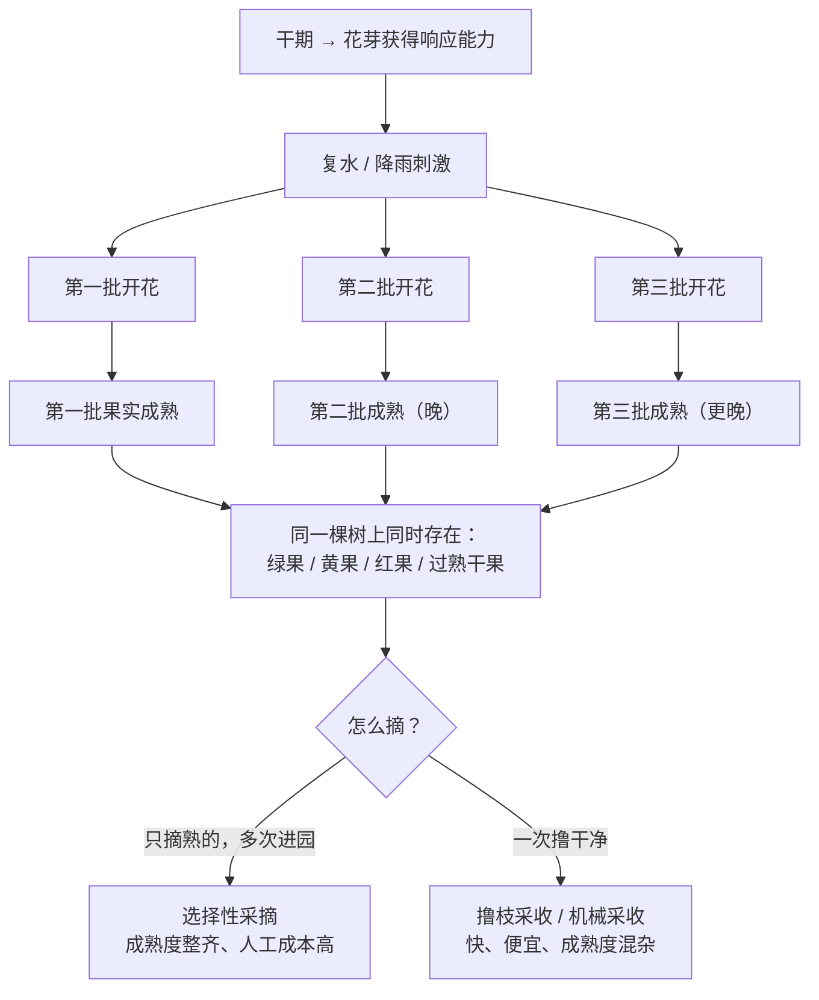
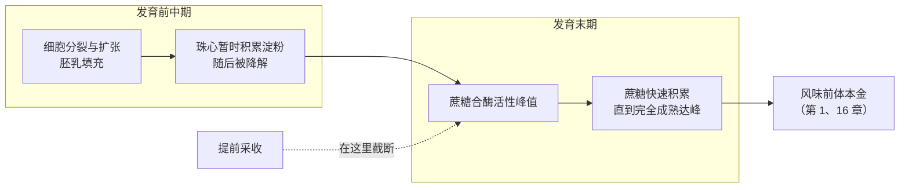

# 第 9 章 采收与成熟度：你摘走的是哪一批果子

> **本章目标**：把"全红果采摘"这句精品咖啡的口号，拆成三个可分别检验的问题——
> **为什么果子会不同步成熟？红色能不能代表成熟？摘早摘晚各自改变了什么？**
>
> 这一章会出现一个直接挑战直觉的概念：**假熟（false maturity）**——
> 果皮已经转红，内部糖分却还没攒够。
> 还会兑现第 2 章留下的一个欠账：**"多少公斤鲜果出一公斤生豆"，这一轮查到了一手数据。**
>
> 本章**不需要器具**，但如果你能弄到咖啡鲜果（或任何会转色的果子），🅑 部分会更有意思。

## 9.1 麻烦的根源：咖啡不是一起开花的

多数一年一熟的作物，同一株上的果子成熟度大致一致。咖啡不是。

一篇关于开花同步化与果实成熟管理的综述把问题说得很直接[^1]：

> **咖啡的生殖发育持续时间很长**，因而容易受到环境波动影响，
> 结果是**多次的、分批的开花事件**；不同批次的果实从不同的时间点开始发育，
> 最终导致**成熟不一致**。而成熟不一致会**损害采收效率与生豆品质**。

同一篇还给出了两条实务背景[^1]：

- 花芽在休眠后通常需要**一段干期**才对环境刺激（通常是恢复灌溉）变得敏感，
  之后才能恢复生长直至开花。因此**灌溉产区可以通过"控水—复水"来人为同步开花**；
- 在**巴西**这样的非赤道阿拉比卡产区，**选择性采摘几乎不做**——
  这使得开花同步化在那里格外重要。

> **这张图就是本章的全部问题域**：树上永远同时有几种成熟度，
> 而**采收方式决定了你把哪几种混进同一个批次**。
> 后面所有关于"分级""瑕疵""处理法效果"的讨论，都建立在这个事实上。

[^1]: 本书编号 [R6]：Ronchi & DaMatta (2025). Managing the coffee crop for flowering synchronisation and fruit maturation: Agronomic and physiological issues. *Advances in Botanical Research* 114:421–454。本书**只读到该章摘要**。

## 9.2 成熟度到底改变了什么：糖是最后才攒的

[第 7 章 §7.5](07-growing-environment.md) 已经给了机制，这里把它接到采收上。

两条可核对的事实：

1. **蔗糖合酶在胚乳与果皮发育的最后阶段活性最高**，且该活性与这两种组织在该阶段的
   **蔗糖积累高度同步**[^2]；
2. **蔗糖在果实完全成熟时达到最大浓度**；阿拉比卡成熟果实的蔗糖为
   **7%~10%（干基）**[^3]。

> **这就是"全红果采摘"最硬的那条依据**：
> 未熟果不是"味道差一点"，而是**风味前体还没攒够**——
> 后面的处理、烘焙、冲煮都无法补上这一段。
>
> 但接下来这一节会说明：**"红"和"攒够了"并不是同一件事。**

[^2]: 本书编号 [E5]：Geromel 等 (2006), *J. Exp. Bot.* 57:3243–3258。
[^3]: 本书编号 [F1]：Unigarro 等 (2025), *Plants* 14(21):3396（开放获取）。

## 9.3 颜色是代理变量——而且它会说谎

### 颜色确实是有效的成熟度指标

一项用多光谱相机（550、660、735、790 nm）与色度计同时测四个品种咖啡果实的研究，
给出了可核对的规律[^4]：

- 成熟过程中，**绿光波段（550 nm）反射率下降、红光波段（660 nm）反射率上升**，
  红边与近红外（735–790 nm）相对稳定；
- 色度参数里，**a\*（绿—红轴）是最可靠的成熟度指示**；L\*（明度）随成熟下降；
  b\* 的重要性随品种而变；
- 主成分分析用 L\*、a\*、b\* 三个参数解释了各品种 **98% 以上**的变异；
  多元线性回归的调整 R² 在 **0.789~0.877**。

这解释了为什么全世界的采摘工都用"红不红"来判断——**它确实管用，而且很好用**。

### 但"假熟"是真的

一项研究直接给"假熟"下了定义并做了量化[^5]：

> 在复杂山地环境下，咖啡果实的**外部转色与内部糖分积累之间存在异步**，
> 这种现象常被称为"**假熟（false maturity）**"，它对采后品质分选
> 与最终产品一致性构成严峻挑战。

该研究的关键结果[^5]：

- **全光谱差异分析定量确认了"目视采收"的局限**：高糖果与低糖果之间的光谱反射率差异
  **集中在红光与红边区域**，最大差异恰好位于 **676 nm**；
- 单一光谱模型的平均准确率 **75.93%**；融合了高光谱、微观形貌与植株生理特征的
  多层感知机模型提升到 **77.22%**（平均 AUC 0.827）。

> **请特别注意第二条**：即使动用高光谱 + 多模态 + 机器学习，
> 区分高糖果与低糖果的准确率也只有约 **77%**。
> **这等于从反面说明：用肉眼看颜色，准确率只会更低。**

### 第三条证据：转色可以和种子发育脱钩

[第 2 章](../01-foundation/02-cherry-anatomy.md)引用过的那篇物候综述提到：
用**乙烯利（ethephon）**催熟只会加速**果皮**转色，**并不改变种子的发育**[^3]。
这是"颜色可以与内部状态脱钩"的一个人为版本证明。

> **三条合起来的判断**：
>
> ✅ **颜色是有效的成熟度代理**（光谱与色度研究[^4]）；
> ⚠️ **但它是代理，不是成熟度本身**——外部转色与内部糖分积累会不同步[^5]，
>   而且这种脱钩可以被人为诱导[^3]。
>
> 这与[第 2 章 §2.6](../01-foundation/02-cherry-anatomy.md) 把"果实越红越熟越甜"
> 判为 ⚠️ **不完整**是同一个结论，只是现在有了量化的版本。

[^4]: 本书编号 [R9]：Cuchca Ramos 等 (2025), *Foods* 14:3644（PMCID PMC12608603，开放获取）。四个品种为 Caturra Amarillo、Excelencia、Milenio、Típica。已读摘要。
[^5]: 本书编号 [R1]：Zhao 等 (2026), *Foods* 15:2149（PMID 42354117）。已读摘要。

## 9.4 三种采收方式：你在买的其实是"采收方式"

| 方式 | 做法 | 成熟度一致性 | 成本 | 典型场景 |
|------|------|------------|------|---------|
| **[选择性采摘](../../glossary.md#selective-picking)**（selective picking） | 只摘达到成熟标准的果子，一季多次进园 | 最高 | 人工成本最高 | 精品豆、坡地、小农 |
| **首采 / fly picking** | 一季最早的一轮，摘最先熟的那批 | 高，但量少 | 单位成本最高 | 印度庄园记录中把阿拉比卡采收分为 fly picking、mid harvesting、stripping 三个阶段[^6] |
| **[撸枝采收](../../glossary.md#strip-picking)**（stripping） | 一次把整根枝条上的果子全撸下来 | 低（绿、红、干果混在一起） | 低 | 一季末的收尾，或人工紧张时 |
| **机械采收** | 用振动式采收机使果实脱落 | 取决于成熟同步程度与机器参数 | 单位成本最低 | 地形平缓的大种植园 |

关于人工这一侧，一项用过程挖掘方法分析印度种植园采收流程的研究给出了一条反直觉的观察[^6]：
在 fly picking 阶段，**工人数量与采摘量之间呈显著负相关**——
"增加人手并不必然提高产出"。该研究把劳动效率、天气与其他因素列为影响采收表现的关键变量。

> **这条对读者的意义**：**选择性采摘的成本不是线性的**。
> 它受制于"熟果密度"——树上熟果太稀疏时，工人大部分时间花在走动与寻找上，
> 加人只会互相干扰。这就是为什么一季末往往会转向撸枝：
> **不是不想精挑，是精挑在经济上已经不成立。**
>
> 把这条和[第 8 章](08-pests-and-renewal.md)的回路接起来：
> **价格低迷的年份，选择性采摘最先被放弃。**

关于机械化这一侧，[R6] 指出：正因为巴西这类非赤道阿拉比卡产区
"几乎不做选择性采摘"，**开花同步化**才成为关键的农艺手段——
先让果子尽量一起熟，再一次性收[^1]。这是另一条解决路径：
**不是在采收端挑，而是在开花端对齐。**

[^6]: 本书编号 [R7]：Saralaya 等 (2026), *BMC Plant Biology* 26:1482（PMCID PMC13523206，开放获取）。研究对象为印度 Sakaleshpur（阿拉比卡）与 Chikkamagaluru（罗布斯塔）。已读摘要。

## 9.5 采收期的早晚：两项研究方向相反

这是本章必须专门处理的一处**来源分歧**。

| 研究 | 地点与材料 | 结论 |
|------|----------|------|
| 埃塞俄比亚特种咖啡[^7] | 埃塞俄比亚，考察海拔 × 遮荫 × 采收期 | **早期到中期采收**的品质更好；**早采使 Q1（≥85 分）比例从 27% 升到 73%** |
| 中国两个 Catimor 品系[^8] | 同一果园，12 月 / 1 月 / 2 月 / 3 月四个采收期 | **推迟采收更好**：7963 品系的瑕疵率从 **11.08% 降到 4.19%**，绿原酸从 **3.78% 升到 4.99%**；2 月与 3 月采收的杯测分显著高于其他时期 |

> **本书的处理：两边都写，并说明它们为什么可能都对。**
>
> 关键在于**"采收期"这个变量在两项研究里指的不是同一件事**：
>
> - 在埃塞俄比亚那项里，一个产季内的**晚期**往往对应雨季推进、湿度升高、
>   留在树上的果子经历更多风险（过熟、发酵、病害）——所以"晚采"混进了"变质"；
> - 在中国那项里，**12 月采**可能意味着**大量果子还没熟透**，
>   所以"早采"混进了"未熟"。它的瑕疵率数据支持这个解读：
>   推迟采收后瑕疵率**下降了一半以上**[^8]。
>
> **也就是说，两项研究可能在说同一句话的两侧**：
> **过早采（未熟）和过晚采（过熟/劣变）都不好，最优点在中间，
> 而"中间"落在日历上的哪个位置，取决于产地的物候与气候。**
>
> 这是**本书的调和解释，不是任何一篇文献的结论**，因此标注为推测。
> 这条分歧已登记进[出处与资料登记 §六](../../standards.md)。

[^8] 这项研究还给出一条有用的方法学提示：瑕疵率、千粒重、生豆尺寸这些**物理指标**，
与脂质、蛋白质、绿原酸、咖啡因、葫芦巴碱这些**化学指标**，
以及**杯测分**之间存在高相关性[^8]。这一点会在第 13 章（生豆分级）被再次用到。

[^7]: 本书编号 [E3]：Tolessa 等 (2017), *J. Sci. Food Agric.* 97:2849–2857。
[^8]: 本书编号 [R2]：Huang 等 (2025), *Foods* 14:3135（PMCID PMC12428010，开放获取）。两个 Catimor 品系为 7963 与 T8667。已读摘要。

## 9.6 未熟果混进来会怎样：一个需要小心处理的问题

直觉上答案很清楚：未熟果 = 前体不足 + 涩 = 毁掉一批豆。
但本书读到的实证结果**比这复杂**，必须诚实呈现。

### 证据一：未熟果确实改变了发酵的起点

一项比较**含 11.0% 与含 0.3% 未熟果**的自发厌氧发酵实验发现[^9]：

- 未熟果比例**显著改变了初始的糖（蔗糖、葡萄糖、果糖）含量、灰分与可滴定酸度**；
- 但**所有处理的最终杯测分都在 84 分以上**，被归类为精品；
- 而且**含 11% 未熟果 + 水下发酵**那一组反而在描述上最突出
  （焦糖、红糖、蜂蜜、橙、柠檬、花香、坚果、黄色与红色水果）。

> **这个结果该怎么读**（三条限定，缺一不可）：
>
> 1. **这是一项单一研究**，样品量有限，本书未读到独立重复；
> 2. **未熟果比例只有两档（0.3% 与 11%）**——它不能告诉你 30% 会怎样；
> 3. **它测的是"经过一套特定发酵后的结果"**，而不是"未熟果本身好不好"。
>    发酵可能改变了未熟果带来的成分格局。
>
> 所以本书能写的只有：**"未熟果比例改变了发酵的化学起点"是有证据的；
> "少量未熟果必然毁掉一批豆"这句话，本书没有找到支持。**

### 证据二：霉菌毒素与成熟度的关系，没有出现预期中的差异

一项考察成熟度阶段（MS1/MS2/MS3）与延长采后处理时间对霉菌毒素影响的研究报告[^10]：

- **三个成熟度阶段之间未检出显著差异**：赭曲霉毒素分别为 2.89、2.98、3.03 μg/kg，
  黄曲霉毒素平均 0.13、0.14、0.15 μg/kg；
- 各延长处理条件下的最高值为 3.51 μg/kg；
- 作者的结论是：**无论处理是否延迟，果实的初始品质对保证生豆安全都是关键**；
  通过分选去除干果与瑕疵果、随后连续干燥，可防止毒素发展。

> **本书对这一段的处理**：只复述该研究**观察到的结果与作者的表述**，
> **不做任何安全性推断、不给限量数值解读**——那属于食品安全监管范畴，
> 与[第 5 章](../01-foundation/05-health-evidence.md)确立的纪律一致。
> 这里唯一要带走的技术点是：**"未熟果"与"干果/瑕疵果"是两类不同的东西，
> 该研究强调要防的是后者。**

[^9]: 本书编号 [R8]：Ferreira 等 (2024), *Electronic Journal of Biotechnology* 69:21–29。已读摘要。
[^10]: 本书编号 [R5]：Osorio、Montoya、Rayo-Mendez & Harris (2026), *Frontiers in Plant Science* 17:1734522（PMCID PMC12907175，开放获取）。已读摘要。

## 9.7 补上第 2 章的欠账：多少鲜果出一公斤生豆

[第 2 章](../01-foundation/02-cherry-anatomy.md)把"鲜果 : 生豆 = 5~6 : 1"列进了
"不采信清单"，理由是**找不到可核对的一手出处**。本轮查到了一项直接测定这个比值的研究。

一项在巴西米纳斯吉拉斯州评价 **44 个 *C. canephora* 基因型**的研究，
专门定义并测定了**成熟果实质量 / 干豆质量比（RFM/DBM）**[^11]：

| 指标 | 结果 |
|------|------|
| 生豆质量占成熟果实的百分比 | **48%~61%** |
| 获得一袋 60 kg 处理后生豆所需的成熟果实 | **209.22~282.61 kg**（按 12% 含水率校正） |
| **换算成"鲜果 : 生豆"** | **约 3.5 : 1 ~ 4.7 : 1** |
| 该性状的遗传力 | **48%~59%**（中到高） |

> **这条补核带来三个结论**：
>
> 1. **这个比值是可测的、而且被测过**——它不是行业口耳相传的数字；
> 2. **它显著依赖基因型**（遗传力 48%~59%），所以"一个通用比值"本身就是错误的提法；
> 3. **该研究测得的范围（3.5~4.7 : 1）低于流传的 5~6 : 1**。
>
> **但绝不能就此说"5~6:1 是错的"**，因为这项研究的条件很具体：
> **罗布斯塔、巴西一个试验点、按 12% 含水率校正的"处理后生豆"**。
> 阿拉比卡、不同处理法（日晒 vs 水洗的失水与剥离路径不同）、
> 是否计入瑕疵豆与加工损耗，都会改变这个数。
>
> 本书的最终表述是：**"鲜果:生豆"是一个随物种、基因型、处理与计量基准变化的量，
> 已测得的一个范围是罗布斯塔的约 3.5~4.7 : 1[^11]；不存在通用比值。**
> [出处与资料登记 §七](../../standards.md)中该条已相应更新。

顺带一提，品种目录也为每个品种记录了一个定性字段
**"果实到生豆的出品比（Cherry to green bean outturn）"**，
分为 Low / Average / High / Very High 四档，并以 Caturra = Average、SL 28 = High 为参照[^12]。
这从另一侧印证了：**出品比是一个品种性状，不是常数。**

[^11]: 本书编号 [R4]：Campanharo 等 (2026), *Frontiers in Plant Science* 17:1878674（PMCID PMC13409374，开放获取）。本书已读全文相关章节（含计算式定义）。
[^12]: 本书编号 [G5]：WCR《Varieties Catalog》字段定义。

## 9.8 常见说法辨析

按本书约定标注**证据强度**：✅ 有共识 / ⚠️ 有争议 / ❌ 明确错误 / **缺乏证据**。

| 说法 | 判定 | 说明 |
|------|------|------|
| "全红果采摘的豆更好" | ✅ **机理清晰、方向有共识** | 蔗糖在发育末期才大量积累、完全成熟时达峰[^2][^3]；未熟果的前体本金不足，后续环节补不回来。但"全红"这个**执行标准**本身有局限，见下一行 |
| "红了就等于熟了" | ⚠️ **不成立（假熟）** | 外部转色与内部糖分积累存在异步；即使用高光谱 + 多模态机器学习，区分高糖果与低糖果的准确率也只有约 77%[^5]。乙烯利催熟只加速果皮、不改变种子发育[^3] |
| "颜色判断没用" | ❌ **矫枉过正** | a\* 是最可靠的成熟度指示参数；L\*a\*b\* 三参数能解释 98% 以上的变异，回归模型调整 R² 达 0.789~0.877[^4]。**颜色是一个好用但不完美的代理** |
| "手工采摘一定比机械好" | ⚠️ **混淆了手段与目标** | 真正起作用的是**成熟度一致性**，不是"手"。机械采收的成熟度混杂问题，也可以通过**开花同步化**在上游解决[^1]。反过来，一季末的人工撸枝同样混杂 |
| "多雇人就能做好选择性采摘" | ❌ **与观测冲突** | 印度种植园的过程分析显示，fly picking 阶段**工人数量与采摘量显著负相关**[^6]。采摘效率受熟果密度、天气等制约 |
| "采收越晚越好（在树上多挂几天更甜）" | ⚠️ **来源分歧，且'晚'的含义不统一** | 中国两个 Catimor 品系的四期对比中，推迟采收使瑕疵率从 11.08% 降到 4.19%、杯测分更高[^8]；但埃塞俄比亚的研究中**早中期采收**更好，早采使 Q1 比例从 27% 升到 73%[^7]。**方向相反，见 §9.5 的调和解释（本书推测）** |
| "混进一点未熟果就毁了" | ⚠️ **本书未找到支持** | 一项对照实验中，含 11% 未熟果与含 0.3% 未熟果的批次**最终都在 84 分以上**，且前者在水下发酵条件下描述最丰富[^9]。**单一研究、只有两档比例、且经过特定发酵**——本书据此只能说"这句断言缺乏证据"，**不能**反过来说"未熟果没关系" |
| "未熟果会导致霉菌毒素" | **缺乏证据（在本书读到的研究里）** | 一项研究在三个成熟度阶段之间**未检出显著差异**，作者强调要防的是**干果与瑕疵果**，并以分选 + 连续干燥为手段[^10]。本书**只复述该研究结果，不做任何安全性推断** |
| "浮豆（floaters）都是坏豆" | **缺乏证据**（本书本轮未核到） | 密度分选在产地确实普遍使用，但本书**未找到**可交叉验证的一手研究来支持"浮起 ⇒ 品质差"的定量对应。留到第 12、13 章去查 |
| "5~6 公斤鲜果出 1 公斤生豆" | ⚠️ **存在实测数据，但不存在通用比值** | 44 个罗布斯塔基因型的实测为约 **3.5~4.7 : 1**，且该性状遗传力 48%~59%[^11]；品种目录也把"出品比"列为**品种字段**而非常数[^12]。**换物种、换处理、换计量基准，数就会变** |
| "同一批豆里成熟度不齐是烘焙商的锅" | ⚠️ **至少要先排除上游** | 成熟不一致的根源是**多批次开花**[^1]，而采收方式决定了哪几种成熟度被混进同一批。烘焙确实会放大不一致（第 15、20 章），但它不是源头 |

## 9.9 🔎 买豆与冲煮时的用处

1. **看到"全红果采摘 / 手工精选"，把它读成"成熟度一致性的承诺"**，
   而不是"每一颗都完美成熟"——假熟是真实存在的[^5]。
2. **看到"某月采收"这类信息，先问它在产季的哪个位置**：
   同一个"晚采"，在不同产地含义相反（§9.5）。
3. **看到"机械采收"不要自动减分**：真正的问题是成熟度一致性，
   而这可以在开花端解决[^1]。有价值的追问是"你们怎么处理成熟度差异"。
4. **看到豆子里明显混着色泽不均、大小不一的粒**，这是上游（采收 + 分级）的信号，
   不是烘焙的信号——完整的瑕疵判据在第 13 章。
5. **冲煮上的一条实际后果**：成熟度混杂的批次，**密度也更不均**，
   烘焙时受热不一致，萃取时溶出速率也不一致。
   这类豆常见的表现是"怎么调都同时有点萃取不足和萃取过度的感觉"——
   遇到这种情况，**先怀疑批次一致性，而不是继续拧旋钮**（第四部分会给完整排查树）。

## 9.10 思考题

1. 请解释为什么咖啡"成熟不一致"是一个**结构性**问题，而不是农户不认真。
   并说明两条上游解决路径分别在哪个环节介入。
2. 即使用高光谱 + 多模态机器学习，区分高糖果与低糖果的准确率也只有约 77%。
   请说明这个数字**同时**支持和反对了哪两句话。
3. 乙烯利催熟只加速果皮转色、不改变种子发育。
   请说明这个事实为什么是"颜色是代理变量"的一个**强证据**，
   并把它和[第 7 章](07-growing-environment.md) 里"海拔是温度的代理"做一次类比。
4. 印度种植园的数据显示 fly picking 阶段工人数量与采摘量**负相关**。
   请给出至少两种可能的解释，并说明你会用什么数据来区分它们。
5. §9.5 里两项研究关于"早采还是晚采"结论相反。
   请复述本书给出的调和解释，指出它**是推测而非文献结论**的理由，
   并设计一个能检验这个调和解释的研究。
6. **【案例】** 一位烘焙商说："我们这批豆混进了大约 10% 的未熟果，
   但杯测还是 85 分，所以未熟果其实无所谓，大家都太紧张了。"
   请指出这段推理里的**三个**问题。
7. **【案例】** 一份豆袋写着：*"3 月末采收的最后一批，果实在枝头充分成熟，
   糖分积累到极致，因此甜感爆棚。"* 产地在**埃塞俄比亚**。
   请用本章内容逐句评估，并指出你最想追问的两个问题。
8. **【辨识】** 第 2 章曾把"5~6 公斤鲜果出 1 公斤生豆"列入不采信清单，
   本章找到了实测数据（罗布斯塔约 3.5~4.7 : 1）。
   请说明：本书为什么**不**据此把流传的 5~6 : 1 判为"错误"？
   并列出三个会让这个比值发生变化的因素。
9. 结合第 7、8、9 三章，请说明"一杯咖啡的风味本金"在**采收之前**
   已经被哪四个环节分别设定了上限。

> 📖 **参考答案**（想清楚再看）：[Q1](../../qa/09-harvest-ripeness-qa.md#q1) ·
> [Q2](../../qa/09-harvest-ripeness-qa.md#q2) · [Q3](../../qa/09-harvest-ripeness-qa.md#q3) ·
> [Q4](../../qa/09-harvest-ripeness-qa.md#q4) · [Q5](../../qa/09-harvest-ripeness-qa.md#q5) ·
> [Q6](../../qa/09-harvest-ripeness-qa.md#q6) · [Q7](../../qa/09-harvest-ripeness-qa.md#q7) ·
> [Q8](../../qa/09-harvest-ripeness-qa.md#q8) · [Q9](../../qa/09-harvest-ripeness-qa.md#q9)

## 9.11 本章实操

### 🅐 无器具版 · 任务一：在豆袋上找"采收信息"

绝大多数豆袋不写采收信息。这个练习就是要让你看见这个空白。

| 豆 | 有无采收年份 / 产季？ | 有无采收方式（手采 / 机械 / 全红果）？ | 有无具体采收月份？ | 缺失的信息让你**无法**判断什么 |
|----|---------------------|----------------------------------|------------------|---------------------------|
| | ☐有 ☐无 | ☐有 ☐无 | ☐有 ☐无 | |
| | ☐有 ☐无 | ☐有 ☐无 | ☐有 ☐无 | |
| | ☐有 ☐无 | ☐有 ☐无 | ☐有 ☐无 | |

> **参考答案方向**：没有采收年份 → 无法判断是不是**过季生豆**（第 12 章）；
> 没有采收方式 → 无法判断**成熟度一致性**的承诺级别；
> 没有月份 → 无法判断它在产季的**哪个位置**（§9.5）。

### 🅐 无器具版 · 任务二：用水果练"假熟"

不需要咖啡果。找**任意一种会转色成熟的水果**（香蕉、番茄、猕猴桃、牛油果都行），
买回来做三天的记录：

| 日期 | 外观（颜色、硬度） | 你的预测：现在吃甜不甜？ | 实际尝到的 | 预测对了吗 |
|------|------------------|----------------------|----------|-----------|
| 第 1 天 | | | | |
| 第 2 天 | | | | |
| 第 3 天 | | | | |

> **这个练习要建立的直觉**：**颜色是"表面在发生什么"，糖是"内部在发生什么"，
> 两者由不同的过程驱动，所以会脱钩。**
> 番茄尤其明显——催熟的番茄红得很快，甜度却跟不上，这就是咖啡"假熟"的家常版。
> 有了这个直觉，"全红果采摘"这句口号你就能听出它的**局限**在哪。

### 🅐 无器具版 · 任务三：算一次你这包豆"用了多少鲜果"

用 §9.7 的实测范围自己算一遍，**过程比答案重要**：

| 步骤 | 你的数 |
|------|-------|
| 你这包豆的净含量（熟豆） | ____ g |
| 熟豆 → 生豆：烘焙失重按你自己的估计（第 1、2 章给过量级） | 生豆约 ____ g |
| 用 3.5 : 1 算，需要多少鲜果？ | ____ g |
| 用 4.7 : 1 算，需要多少鲜果？ | ____ g |
| 两个结果差多少？ | ____ % |
| **你会怎么在别人面前表述这个数？** | |

> **最后一行才是重点**。正确的表述方式类似：
> "这包豆大概需要几公斤鲜果——具体数取决于品种、处理法和计量基准，
> 已测得的一个范围是罗布斯塔约 3.5~4.7 : 1[^11]。"
> 而**不是**"这包豆需要 X 公斤鲜果"。
> **一个有范围、有条件的说法，比一个精确但来路不明的数字更专业。**

### 🅑 有条件版 · 任务四：自己做一次"成熟度分选"实验（备齐后再做）

> **所需器具**：**咖啡鲜果**若干（产区旅行、咖啡庄园开放日、或有卖鲜果的渠道）；
> 白纸；秤（有更好）。
> **替代方案（强烈推荐，几乎人人可做）**：用**任何一种带核的水果**替代——
> 樱桃、枣、小番茄都行。原理完全相同：**把一批果子按外观分成三档，
> 再逐一验证内部状态。**

| 步骤 | 做法 | 记录 |
|------|------|------|
| 1 | 取 30 颗果子，只看外观，分成"未熟 / 适熟 / 过熟"三堆 | 各 ____ / ____ / ____ 颗 |
| 2 | 从"适熟"那堆里随机取 10 颗，逐一切开 | |
| 3 | 每颗记录：种子饱满度、果肉甜度（尝一小口）、有无异味 | |
| 4 | 统计：你凭外观判断为"适熟"的果子里，**内部真正达标的有几颗**？ | ____ / 10 |
| 5 | 与 §9.3 那个约 77% 的准确率对比 | 你的准确率：____% |

> **这个实验能证明什么、不能证明什么**：
> 它**不能**外推到咖啡（不同物种的转色与糖积累机制不同）。
> 它**能**做的是让你亲手量出"目视分选的准确率不是 100%"这件事，
> 并对采摘工每天要做几千次这样的判断建立敬意。

### 🅑 有条件版 · 任务五：找一支标注了采收信息的豆，做一次"信息 vs 体验"对照（备齐后再做）

> **所需器具**：一支**明确标注采收方式或采收月份**的豆（这类豆不多，找到就值得买）
> + 一支同产国但**完全没有采收信息**的豆；秤、磨、相同器具；同伴帮忙盲测。
> **替代方案**：找不到，就只买前者，单独记录，作为你自己的"参照样"。

| 观察项 | 有采收信息的那支 | 无采收信息的那支 |
|-------|----------------|----------------|
| 豆相：颜色是否均匀？大小是否一致？ | | |
| 有无明显未熟豆（发白、皱缩、色浅）？ | | |
| 磨粉后颜色是否均匀？ | | |
| 杯中：是否同时出现"尖酸"与"木质/纸感"？ | | |
| 盲测中你能否分辨两杯？（三轮） | ____ / 3 | |

> **注意最后两行的逻辑**：
> "同时出现萃取不足和萃取过度的特征"是**批次一致性差**的一个**候选信号**——
> 但它也可能来自烘焙或你的冲煮。本书**不能**把它当判据，
> 只能当**提示你去检查批次**的线索。
> 真正的判据需要第 13 章的瑕疵计数和第四部分的萃取诊断。

---

## 9.12 本章依据

完整书目信息登记在[出处与资料登记 §4.12](../../standards.md)。

- **[R6]** Ronchi & DaMatta (2025), *Advances in Botanical Research* 114:421–454。本章 §9.1 的主干：
  咖啡生殖发育期长 → 多次分批开花 → 成熟不一致 → 损害采收效率与生豆品质；
  花芽需经干期才对复水刺激敏感，因而可用"控水—复水"同步开花；
  巴西等非赤道阿拉比卡产区"几乎不做选择性采摘"。**仅读到章摘要。**
- **[E5]** Geromel 等 (2006), *J. Exp. Bot.* 57:3243–3258（第 7 章已登记）。用到：蔗糖合酶在胚乳与果皮
  发育末期活性最高且与蔗糖积累同步；珠心暂时积累淀粉后降解。
- **[F1]** Unigarro 等 (2025), *Plants* 14(21):3396（第 2 章已登记）。用到：蔗糖在果实完全成熟时达峰、
  成熟果实蔗糖 7%~10%（干基）；乙烯利催熟只加速果皮而不改变种子发育。
- **[R9]** Cuchca Ramos 等 (2025), *Foods* 14:3644。用到：四个品种的多光谱与色度学成熟度评估——
  550 nm 反射率下降、660 nm 上升；a\* 是最可靠的成熟度指示；L\* 随成熟下降；
  PCA 解释 >98% 变异；MLR 调整 R² 0.789~0.877。开放获取，已读摘要。
- **[R1]** Zhao 等 (2026), *Foods* 15:2149。本章"假熟"概念的来源：外部转色与内部糖积累异步；
  高低糖果的光谱差异集中在红光与红边、最大差异在 676 nm；单光谱模型平均准确率 75.93%、
  多模态融合 MLP 77.22%（平均 AUC 0.827）。已读摘要。
- **[R7]** Saralaya 等 (2026), *BMC Plant Biology* 26:1482。用到：印度庄园把阿拉比卡采收分为
  fly picking、mid harvesting、stripping 三阶段；fly picking 阶段工人数量与采摘量显著负相关；
  劳动效率、天气等为关键影响因素。开放获取，已读摘要。
- **[E3]** Tolessa 等 (2017)（第 7 章已登记）。用到：埃塞俄比亚的**早中期采收**品质更好、
  早采使 Q1 比例从 27% 升到 73%。
- **[R2]** Huang 等 (2025), *Foods* 14:3135。用到：两个 Catimor 品系四个采收期的对比——
  7963 瑕疵率 11.08% → 4.19%、绿原酸 3.78% → 4.99%；2 月与 3 月采收杯测分显著更高；
  物理指标、化学成分与杯测分高度相关。开放获取，已读摘要。
- **[R8]** Ferreira 等 (2024), *Electron. J. Biotechnol.* 69:21–29。用到：含 11.0% 与 0.3% 未熟果的
  自发发酵对照——显著改变初始糖、灰分与可滴定酸度；所有处理杯测均 >84 分；
  含 11% 未熟果的水下发酵组描述最突出。已读摘要。**单一研究，只有两档比例。**
- **[R5]** Osorio 等 (2026), *Front. Plant Sci.* 17:1734522。用到：三个成熟度阶段之间霉菌毒素
  未检出显著差异（赭曲霉毒素 2.89/2.98/3.03 μg/kg；黄曲霉毒素 0.13/0.14/0.15 μg/kg）；
  延长处理条件下最高 3.51 μg/kg；作者强调初始果实品质关键、应分选去除干果与瑕疵果并连续干燥。
  开放获取，已读摘要。**本书只复述结果，不做任何安全性推断。**
- **[R4]** Campanharo 等 (2026), *Front. Plant Sci.* 17:1878674。本章 §9.7 的主干：
  44 个 *C. canephora* 基因型的果—豆转化效率——生豆质量占成熟果实 48%~61%；
  每 60 kg 袋需成熟果实 209.22~282.61 kg（按 12% 含水率校正），
  换算为约 3.5~4.7 kg 鲜果 / kg 生豆；该性状遗传力 48%~59%。开放获取，已读全文相关章节。
- **[G5]** WCR《Varieties Catalog》。用到："果实到生豆的出品比"作为**品种字段**存在
  （Low / Average / High / Very High，以 Caturra = Average、SL 28 = High 为参照）。

**本章刻意没写的东西**：

- **"每公顷该摘几遍"这类农艺参数**——地区差异极大，本书未核到可通用的数据；
- **浮豆 / 密度分选的品质判据**——本轮未找到可交叉验证的一手研究，留到第 12、13 章；
- **未熟果比例与杯测分的剂量—反应关系**——现有研究只有两档比例，
  不足以画出曲线，因此不写"超过百分之几就不行"；
- **任何霉菌毒素的安全性判断或限量解读**——只复述研究结果，不做推断；
- **"5~6:1"的对错判定**——本章给出了一个实测范围，但那是罗布斯塔、单一试验点，
  不足以否定其他条件下的数值；只能否定"存在通用比值"这个前提。

---

**下一章**：第 10 章 处理法 ①——日晒、水洗、蜜处理的原理。
你在第 2 章拆开的那六层结构，终于要在这一章被真正"处理"掉了；
而这一章要拆掉的核心误解是：**处理法改变的不是"甜度"，是发酵与干燥这两个过程本身。**
