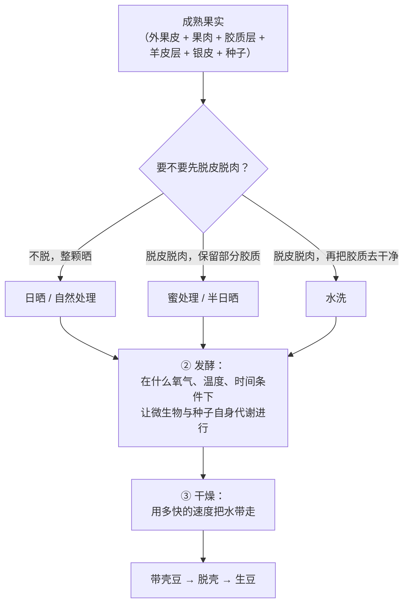
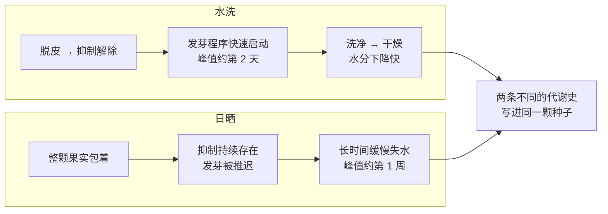

# 第 10 章 处理法 ①：日晒、水洗、蜜处理的原理

> **本章目标**：把"日晒更甜、水洗更干净"这类豆袋语言，拆回它真正的自变量——
> **胶质怎么被去掉、发酵在什么条件下发生、水是以多快的速度离开种子的**。
>
> 这一章最重要的一条认知是反直觉的：
> **处理法改变的不只是"豆子外面发生了什么"，更是"豆子里面的那颗活种子做了什么"。**
> 咖啡生豆在处理期间**是活的**，它会启动发芽程序，也会进入干旱胁迫——
> 而日晒与水洗让它走上了两条不同的代谢路线。
>
> 本章**不需要器具**；🅑 部分需要两支控制了变量的豆。

## 10.1 先把"处理法"这个词拆开

[第 2 章](../01-foundation/02-cherry-anatomy.md)拆过咖啡果的六层结构。
所谓"处理（processing）"，就是把**种子以外的那几层**去掉、并把种子的含水率降到可储存水平。
它由三件**可以独立调节**的事组成：

**三个旋钮是：① 胶质去掉多少 · ② 发酵怎么发生 · ③ 水以多快的速度离开。**

日晒、蜜处理、水洗只是这三个旋钮的**三组常见组合**，不是三种互相排斥的"工艺门派"。
这一点很重要，因为第 11 章要讲的那些"实验性处理"，
做的事情几乎全都是**把这三个旋钮拧到不常见的位置上**。

> **一个术语提醒**：英文里 natural / dry process 指日晒，washed / wet process 指水洗，
> honey / semi-dry / pulped natural 指蜜处理这一族。
> 中文豆袋上常见的"半水洗""湿刨法（印尼 giling basah）"是另外的工艺，本书在第 14 章讲产区时再碰。

## 10.2 关键实验：同一批果子，两种处理，结果仍然不同

先解决一个最容易被绕过去的问题：**日晒豆和水洗豆不同，会不会只是因为原料不同？**

这是一个很合理的怀疑。日晒豆传统上更可能混入成熟度不齐的果子（[第 9 章](09-harvest-ripeness.md)），
水洗流程在脱皮环节还会顺带分掉一部分未熟果[^1]。如果差异全部来自原料，
那"处理法赋予风味"就只是一句误导。

德国的一组研究直接回答了这个问题[^2]：

> 即便用**同一批、成熟度相同**的咖啡果**平行地**做两种处理，
> 最终咖啡的特征差异**依然存在**。因此这些差异**必定是由咖啡豆自身的代谢过程产生的**。

他们进一步指出了那个代谢过程是什么：**发芽**。

- 咖啡种子**没有休眠期**；成熟果实的含水率约 65%[^1]，
  这个水分水平本来足以启动发芽，但只要种子还被果肉包着，
  发芽就被**脱落酸（ABA）等抑制物**压着[^1]；
- 一旦脱皮，抑制解除，**发芽程序立刻启动**。

这条推断有分子层面的证据。研究者用**异柠檬酸裂解酶（isocitrate lyase, ICL）**
——一个只在发芽时表达的酶——作为标记，并用流式细胞术与 β-微管蛋白丰度监测细胞周期恢复[^3]：

| 处理 | 发芽活性峰值出现在 |
|------|------------------|
| **水洗** | 处理开始后约 **2 天** |
| **日晒** | 处理开始后约 **1 周** |

> **这是本章的核心机理**：
> **处理法不是"给豆子加料"，而是"给那颗活着的种子安排了一段不同的经历"。**
> 水洗让它快速发芽、快速脱水；日晒让它在果肉里闷着、慢慢失水、长时间受旱。
> 生豆里最终有什么，取决于这段经历。

[^1]: 本书编号 [C2]：Bastian 等 (2021), *Foods* 10(11):2827（PMCID PMC8620865，开放获取）。本章多处引用其第 4 节（处理）与第 5 节（微生物）的综述内容与其 Table 1。
[^2]: 本书编号 [PR2]：Selmar、Bytof、Knopp & Breitenstein (2006), *Plant Biology* 8(2):260–264。已读摘要。
[^3]: 本书编号 [PR1]：Bytof 等 (2007), *Annals of Botany* 100(1):61–66（PMCID PMC2735289）。已读摘要。

## 10.3 三条路线的工艺差异

| | **[日晒](../../glossary.md#natural-process)（natural / dry）** | **[蜜处理](../../glossary.md#honey-process)（honey / semi-dry）** | **[水洗](../../glossary.md#washed-process)（washed / wet）** |
|---|---|---|---|
| 果肉与胶质 | 全部保留，整颗果实直接干燥 | 机械脱皮脱肉，**保留部分胶质**；文献记载保留量在 **20%~80%** 之间[^1] | 机械脱皮脱肉，再通过发酵或机械脱胶把胶质去净 |
| 发酵发生在哪 | 整颗果实内部与表面，时间最长 | 胶质层，边干边发酵 | 发酵槽或水中，**6~48 小时**[^1] |
| 干燥起点含水率 | 整果约 65%~70%[^1] | 介于两者之间 | 带壳豆（去掉了大部分果肉的水） |
| 干燥时长 | 文献记载可达 **2~4 周**[^1] | 介于两者之间 | 最短；把含水率降到 25% 所需时间"相对很快"[^1] |
| 种子经历 | 发芽被推迟，**长时间干旱胁迫** | 居中 | 快速发芽，干旱胁迫时间短 |

> **诚实说明**：上表的"20%~80% 胶质保留"是综述给出的**范围**，
> 不是"红蜜 = 保留 x%、黑蜜 = 保留 y%"这种对应表。
> 本书查不到一份可核对的、行业统一的"蜜处理颜色分级 ↔ 胶质保留率"定义——
> **黄蜜 / 红蜜 / 黑蜜这套叫法是行业惯例，各产国与各庄园的界定并不统一**，
> 一般理解为遮荫程度与干燥速度的差异（越"黑"通常意味着越慢、越厚）。
> 因此本书**不给这套颜色对应任何数字**。

## 10.4 可以测出来的化学差异：三组数字

处理法的差异不是玄学，它在生豆里留下了可测量的痕迹。三组最扎实的：

### （1）GABA：日晒豆是水洗豆的一个数量级

**γ-氨基丁酸（GABA）**是植物的**胁迫代谢物**，干旱时会大量累积。
一项被综述转引的测定给出了两个产地的平行数据[^1]：

| 样品 | 水洗 | 日晒 |
|------|------|------|
| 阿拉比卡，巴西 | **93** nmol/种子 | **1009** nmol/种子 |
| 阿拉比卡，坦桑尼亚 | **140** nmol/种子 | **1860** nmol/种子 |

两个产地、同一方向、**相差约一个数量级**。机理也说得通：
日晒的干燥期长得多，种子承受干旱胁迫的时间也长得多[^1]。

一项分子研究进一步拆开了 GABA 的来源[^4]：干燥过程中 GABA 出现**三个峰**——
第一个峰与 ICL 表达（也就是发芽过程）同步，
后两个峰分别对应**胚**与**胚乳**组织中脱水素（dehydrin）基因表达的高峰，
被认为是直接由干旱胁迫诱导的。

> **为什么本书要花篇幅讲 GABA**：它不是风味物质本身，
> 但它是目前**最干净的一个"处理法确实改变了种子代谢"的指纹**——
> 十倍的差异、两个产地一致、有机理解释、有分子证据。
> 记住这条逻辑：**要证明某个工艺"真的做了事"，就去找这种指纹，而不是去找形容词。**

### （2）游离氨基酸：水洗更高，但差距有限

发芽伴随蛋白质分解，因而水洗豆的谷氨酸、天冬氨酸、丙氨酸等游离氨基酸更高[^1]。
但综述同时给了一个克制的量级：**水洗与日晒之间游离氨基酸总量的差异在 3.3%~20.9% 之间**[^1]。

> 把这条和上一条并排看，本身就是一堂课：
> **同一对处理法，在某些指标上差十倍，在另一些指标上只差百分之几。**
> 所以"日晒和水洗差别很大"这句话没有信息量——**要问差在哪个指标上**。

### （3）蔗糖：方向不统一，蜜处理端偏高

综述的成分表里，不同研究测得的生豆蔗糖为[^1]：

| 处理 | 报告值（占比，不同研究、不同产地） |
|------|--------------------------------|
| 水洗 | 约 4.4%~9.3% |
| 日晒 | 约 3.2%~9.0%（其中罗布斯塔样品偏低） |
| 蜜处理 / 半日晒 | 约 8.1%~12.3% |

三组范围**大幅重叠**，只有蜜处理那一端整体偏高。
综述自己的表述也很克制：半日晒的蔗糖比日晒或水洗**更高**，
绿原酸比日晒**更低**，葫芦巴碱比另外两者都低，
因而其品质"介于日晒与水洗之间"，常被用于意式配方[^1]。

> **本书对这组数字的处理**：**只写方向与重叠，不写"某处理法的蔗糖是多少"**。
> 理由是这些值来自不同研究、不同产地、不同品种，
> 物种差异（罗布斯塔偏低）与产地差异都比处理法差异更大。
> 这也回应了[第 7 章](07-growing-environment.md)的老问题：
> **处理法的效应必须在控制了品种与产地之后才能读。**

[^4]: 本书编号 [PR3]：Kramer、Breitenstein、Kleinwächter & Selmar (2010), *Plant & Cell Physiology* 51(4):546–553。已读摘要。

## 10.5 "蜜处理更甜"：一项做了梯度的实验

蜜处理是三条路线里**最容易做成对照实验**的一条——因为"保留多少胶质"是个连续变量。

一项在海南做的罗布斯塔实验设了**果肉保留量梯度**（0% / 33% / 66% / 100%）[^5]：

| 结果 | 数值 |
|------|------|
| 与 0% 保留相比，其余各处理 | 功能性成分与挥发性风味前体**均更高** |
| **66% 保留**相对 0% 保留 | 蔗糖 **+8.74%**、有机酸 **+26.58%**、吡嗪类 **+80.66%**、酯类 **+30.18%** |
| 66% 保留组的蛋白质与生物碱 | 显著低于 100% 与 33% 组 |
| 66% 保留组的杯测分 | **80.35**，综合品质优于其他处理 **6.05%~18.51%** |

> **这项研究值得注意的地方不是"66% 最好"，而是"存在最优点"**：
> 保留量与品质**不是单调关系**——0% 不好，100% 也不是最好。
> 这与"胶质越多越甜"的直觉相反。
>
> **三条必须同时说明的限定**：
> ① 对象是**罗布斯塔**、**单一产地（海南）**、单季；
> ② 杯测 80.35 分是精品线附近，不是高分样品；
> ③ 它没有做**盲法与重复的独立验证**。
> 所以本书能写的是"**保留量是一个可以被优化的连续变量**"，
> **不能**写"蜜处理应该保留 66%"。

### 顺便回答一个老问题：糖到底有没有"渗进去"

[出处与资料登记 §七](../../standards.md)里有一条不采信项：
**"日晒豆的甜来自果肉糖分渗入豆体"**——因为糖分子穿过木质化羊皮层进入胚乳这一步没有直接证据，
而且[第 1 章](../01-foundation/01-bean-composition.md)已说明烘焙后蔗糖只剩痕量。

本轮读到的综述里出现了一句相关表述：发酵过程中
**微生物代谢产物会扩散进入种子**，从而改善品质[^1]。
这句话与上面那条不采信项**不是同一件事**，必须分开：

| 说法 | 本书判断 |
|------|---------|
| **果肉里的蔗糖穿过羊皮层进入胚乳，使豆更甜** | 仍列为**缺乏证据**。分子大、屏障在、且烘焙后蔗糖只剩痕量 |
| **发酵产生的小分子代谢物（酸、醇、酯等）扩散进入种子** | 综述有此表述[^1]，机理上更可能（分子小得多），但本书**未读到直接测定进入量的一手实验**，按 ⚠️ 处理 |

> **这个区分本身就是本章的方法论产出**：
> "某物质进入豆子"这类说法，**必须指明是哪一类分子**。
> 把"小分子代谢物可能扩散"当作"糖会渗进去"的证据，是一次偷换。

[^5]: 本书编号 [PR4]：Gui 等 (2026), *Foods* 15(15):2714（PMCID PMC13465081，开放获取）。已读摘要。

## 10.6 五种方法的横向比较：一项同时做了电子舌与代谢组的研究

一项研究把**日晒（DP）、水洗（WP）、红蜜（RH）、黑蜜（BH）、厌氧发酵（AF）**
五种方法放在一起，用电子舌、感官评价与非靶向代谢组同时测[^6]：

- **感官上**：黑蜜与厌氧发酵在**口感（mouthfeel）、平衡感、整体分**上更高；
- **电子舌上**：水洗与日晒的**苦与涩**响应更高，其中水洗尤其明显；
- **代谢组上**：共筛出 808 个差异代谢物，加权基因共表达网络分析（WGCNA）给出 8 个与感官相关的模块、
  467 个枢纽代谢物，主要是**氨基酸及其衍生物、有机酸、生物碱、酚酸**；
- 通路分析指向**咖啡因代谢**与**甘油磷脂代谢**为主要差异通路。

> **这项研究怎么读**（三条）：
>
> 1. **它支持"处理法确实改变非挥发性成分格局"**——这是本章的主线，
>    并且与 §10.4 的三组数字方向一致（差异集中在氨基酸与有机酸）；
> 2. **它不能用来给处理法排名**。"黑蜜和厌氧分更高"是**这一批样品、这一组评价者**的结果，
>    换品种、换产地、换烘焙就未必；
> 3. **电子舌不是舌头**。它测的是溶液的电化学响应，与人的苦涩感受相关但不等价——
>    [第 4 章](../01-foundation/04-perception.md)讲过苦味受体的复杂性，
>    仪器信号与感知之间还隔着好几层。

[^6]: 本书编号 [PR5]：Liang 等 (2026), *Foods* 15(9):1475（PMCID PMC13163802，开放获取）。已读摘要。

## 10.7 发酵那一侧：微生物在做什么（第 11 章展开）

处理过程里的微生物不是"被允许存在"，而是**工艺的一部分**。综述给出的基本图景[^1]：

| | **日晒** | **水洗** |
|---|---|---|
| 发酵时长 | 最长，微生物总量更高 | **6~48 小时**，参与的微生物更少 |
| 优势细菌 | ***Bacillus*** 属为主 | *Lactococcus*、*Leuconostoc*、*Acinetobacter*、*Enterobacter* 为主 |
| 优势酵母 | *Debaryomyces*、*Candida*、*Pichia* | *Hanseniaspora*、*Candida*、*Pichia* |
| 过程指标 | pH 由 **6.5 降到 5.5~5.8**；水分活度由 **0.9 降到 0.7~0.8**，随后适合酵母生长 | 蔗糖在约 8 小时达到峰值后被消耗；24 小时后有机酸上升；36 小时后果糖、葡萄糖、葡萄糖酸上升 |

两条值得单独记住的：

1. **微生物做的主要是"拆胶质"**。综述明确指出，多数研究关注的是微生物在
   **胶质降解**中的作用——果胶酶、纤维素酶、淀粉酶[^1]。
   也就是说，**发酵的第一功能是工艺性的（把胶质弄掉），风味是它的副产品**；
2. **水洗里蔗糖先升后降**：升是因为微生物把果肉与胶质里的多糖拆成糖，
   降是因为种子自身的转化酶与微生物把糖消耗掉[^1]。
   **所以"发酵时间越长糖越多"是反的。**

> 综述自己也留了一句诚实话：**各微生物类群的实际作用尚不清楚**[^1]。
> 第 11 章会看到，当人们开始**接种**特定菌株时，这个"不清楚"变成了可以被实验回答的问题。

## 10.8 常见说法辨析

按本书约定标注**证据强度**：✅ 有共识 / ⚠️ 有争议 / ❌ 明确错误 / **缺乏证据**。

| 说法 | 判定 | 说明 |
|------|------|------|
| "日晒和水洗的差别只是原料不同" | ❌ **有直接反证** | 同批、同成熟度的果实平行处理，差异依然存在[^2]；差异的来源是种子自身代谢（发芽与干旱胁迫）的时间进程不同[^3][^4] |
| "处理法在给豆子加风味" | ⚠️ **表述不准确** | 更准确的说法是：处理法**安排了种子的一段代谢经历**，并**改变了前体格局**（氨基酸、有机酸、GABA、糖）[^1][^4]。真正生成香气分子的是烘焙（第 16 章） |
| "日晒豆的甜来自果肉糖渗进豆子" | **缺乏证据** | 糖分子穿过木质化羊皮层这一步无直接证据；且烘焙后蔗糖只剩痕量（第 1 章）。**要与"小分子代谢物扩散"区分开**，后者综述有提及但本书未读到一手测定[^1] |
| "胶质保留越多越甜" | ⚠️ **与梯度实验不符** | 罗布斯塔的保留量梯度实验中，**66% 组优于 100% 组**，说明存在最优点而非单调关系[^5]。⚠️ 单一产地、单一物种 |
| "红蜜 / 黑蜜对应固定的胶质保留百分比" | **缺乏证据** | 本书未找到可核对的统一定义。综述只给出蜜处理整体保留 **20%~80%** 的范围[^1]。**这是行业惯例用语，各产地界定不一** |
| "水洗豆更酸、日晒豆更醇厚" | ⚠️ **方向常见，但不是定律** | 综述确有"水洗风味与愉悦酸度更突出、body 低于日晒"的表述[^1]；但五方法对照研究中，电子舌反而在水洗与日晒上测到更高的苦与涩响应[^6]。**处理法效应小于品种与产地效应时就会翻车** |
| "发酵时间越长越甜" | ❌ **与测定相反** | 水洗发酵中蔗糖先升后降，糖是**被消耗**的[^1]；日晒里微生物量更大、时间更长同样如此 |
| "日晒豆品质天生不如水洗" | ⚠️ **看指标、看条件** | [第 7 章](07-growing-environment.md)引用的埃塞俄比亚研究里，**无遮荫条件下日晒的物理品质分 37.2 高于水洗 29.1**[^7]。日晒对天气与管理更敏感，但"天生更差"不成立 |
| "处理法能救回不好的果子" | ⚠️ **只有部分证据，且方向要小心** | [第 9 章](09-harvest-ripeness.md)的未熟果实验显示发酵会改变化学起点[^8]，但那不等于"能补上未攒够的前体"。本书的立场仍是：**处理改变格局，不创造本金** |
| "厌氧/特殊处理是新东西，传统处理是'不处理'" | ❌ **概念错误** | 日晒同样是一场**长达数周的自发发酵**，微生物量比水洗更大[^1]。区别只在于**氧气、时间、温度是否被控制**——见第 11 章 |

[^7]: 本书编号 [E2]：Worku 等 (2018), *Food Research International* 105:278–285（第 7 章已登记）。
[^8]: 本书编号 [R8]：Ferreira 等 (2024), *Electronic Journal of Biotechnology* 69:21–29（第 9 章已登记）。

## 10.9 🔎 买豆与冲煮时的用处

1. **把豆袋上的处理法读成"三个旋钮的位置"**，而不是一个风味承诺：
   胶质留了多少、发酵在什么条件下进行、干了多久。缺哪一项就问哪一项。
2. **同一支豆的日晒版与水洗版是最好的学习材料**——
   因为品种、海拔、批次被控住了，你尝到的差异才归得了因（本章 🅑 实操就是干这个的）。
3. **"日晒 = 果味重"只能当先验，不能当判据**。处理法的效应经常小于品种与产地的效应；
   真正稳定的是**机理**：日晒豆经历了更长的干旱胁迫与更大的微生物暴露，
   因此它的**批次一致性风险更高**——这是比"果味"更有用的预期。
4. **冲煮上的一条实际后果**：日晒豆（尤其是带明显发酵风格的）常在**萃取后段**
   出现被放大的发酵感与涩感。遇到这种情况，
   优先试**缩短总接触时间 / 略降水温**，而不是先动粉水比——
   完整的排查树在第四部分。
5. **看到"蜜处理"三个字，追问颜色之外的东西**：保留量、干燥天数、干燥床类型。
   问不出来，就当作"一个保留了部分胶质的批次"，不要给它附加甜度预期。

## 10.10 思考题

1. 请用"三个旋钮"的框架解释：为什么本书说日晒、蜜处理、水洗**不是三种互斥的工艺门派**。
2. 有人说："日晒豆和水洗豆不同，是因为日晒用的果子更杂。"
   请给出**一项能直接反驳这句话的实验设计**，并说明本书引用的研究是怎么做的、结论是什么。
3. GABA 在日晒豆里比水洗豆高约一个数量级，游离氨基酸却只差 3.3%~20.9%。
   请解释这两个数字为什么**不矛盾**，并说明它对"日晒和水洗差别大不大"这个问题意味着什么。
4. 蔗糖在水洗发酵中"先升后降"。请分别说明升和降各自的机制，
   并据此判断"延长发酵时间来提高甜度"这个做法的问题在哪。
5. **【案例】** 一支豆的文案写着：*"72 小时蜜处理，保留 100% 胶质，
   让果胶中的糖分充分渗入豆体，造就极致甜感。"*
   请逐句评估这段话，指出其中**两处**与本章证据冲突的地方、
   **一处**本书判为"缺乏证据"的地方，并给出你会向店家提的两个问题。
6. **【案例】** 两支豆：A 是"埃塞俄比亚 · 水洗 · 1900 m · 74158"，
   B 是"埃塞俄比亚 · 日晒 · 1900 m · 74158"。你盲测后发现 B 更酸。
   这与"水洗更酸"的常见说法相反。请列出**至少三种**可能的解释，
   并说明你要补哪些信息才能区分它们。
7. 本章把"果肉里的蔗糖渗入胚乳"与"发酵产生的小分子代谢物扩散进种子"判成了两件事。
   请说明这个区分的依据，以及为什么把后者当作前者的证据是一次**偷换**。
8. **【辨识】** 请打开你手上任意三包豆的包装，
   找出它们各自提供了本章"三个旋钮"中的哪几项信息。
   然后回答：**哪一个旋钮最常缺失？** 你认为为什么是它？
9. 结合第 9、10 两章，请说明为什么本书反复强调"**处理改变格局，不创造本金**"。
   并指出这句话在买豆时的一条具体用法。

> 📖 **参考答案**（想清楚再看）：[Q1](../../qa/10-processing-basics-qa.md#q1) ·
> [Q2](../../qa/10-processing-basics-qa.md#q2) · [Q3](../../qa/10-processing-basics-qa.md#q3) ·
> [Q4](../../qa/10-processing-basics-qa.md#q4) · [Q5](../../qa/10-processing-basics-qa.md#q5) ·
> [Q6](../../qa/10-processing-basics-qa.md#q6) · [Q7](../../qa/10-processing-basics-qa.md#q7) ·
> [Q8](../../qa/10-processing-basics-qa.md#q8) · [Q9](../../qa/10-processing-basics-qa.md#q9)

## 10.11 本章实操

### 🅐 无器具版 · 任务一：把处理法字段拆成"三个旋钮"

拿三包豆（或三个电商详情页），只看文案，填这张表：

| 豆 | 写的处理法名称 | ① 胶质去掉多少？ | ② 发酵条件（氧气/时间/温度）？ | ③ 干燥方式与天数？ | 缺失项 |
|----|-------------|----------------|---------------------------|------------------|-------|
| | | ☐写了 ☐没写 | ☐写了 ☐没写 | ☐写了 ☐没写 | |
| | | ☐写了 ☐没写 | ☐写了 ☐没写 | ☐写了 ☐没写 | |
| | | ☐写了 ☐没写 | ☐写了 ☐没写 | ☐写了 ☐没写 | |

> **参考观察**：绝大多数豆袋只写第一列的**名字**，三个旋钮一个都不给。
> 这不一定是隐瞒——很多烘焙商自己也只拿到"natural"这一个词。
> **你要建立的判断是：一个能答出旋钮位置的卖家，说明他的供应链信息更深。**

### 🅐 无器具版 · 任务二：给"甜"找一个可检验的说法

找一段你见过的、最夸张的处理法文案，把它改写成**可检验**的版本：

| | 原文 | 改写 |
|---|------|------|
| 原句 | | |
| 它断言了什么因果？ | | |
| 要验证需要什么数据？ | | |
| 本书能支持的最强版本是什么？ | | |

> **示范**：原句"日晒让果肉的糖渗进豆里，所以特别甜"
> → 可检验版本："这支豆经过约 X 天整果干燥，其间种子长时间处于干旱胁迫状态，
> 前体格局（氨基酸、有机酸、糖）与水洗批次不同[^1][^4]；
> **它在杯中是否更甜，需要盲测来回答。**"

### 🅐 无器具版 · 任务三：读懂一次"没有对照"的宣称

挑一家宣称"我们的处理法让分数提高了 X 分"的店或品牌，回答：

1. 对照组是什么？（同一批果子吗？同一年吗？同一个烘焙曲线吗？）
2. 谁打的分？打分时知不知道样品是哪一组？
3. 重复了几次？
4. 如果这三项都答不上来，这个"提高 X 分"能说明什么？

> **这个练习不是为了抬杠**。§10.5 与 §10.6 引用的研究**都做了对照**，
> 所以它们的结论才能被写进本书。**要求别人给对照，就是在要求他给你真信息。**

### 🅑 有条件版 · 任务四：同产区同品种的"处理法对照"（备齐后再做）

> **所需器具**：**同一产区、同一品种、同一烘焙商、烘焙日期接近**的两支豆
> （一支日晒 + 一支水洗，或日晒 + 蜜处理）；秤；磨；同一套冲煮器具。
> **替代方案**：没有磨与秤，就用挂耳或同一家店的两杯手冲，
> 请店员用**同一参数**冲——记录会粗一些，但对照仍然成立。

| 观察项 | 日晒 / 蜜处理那支 | 水洗那支 |
|-------|-----------------|---------|
| 生豆或熟豆的颜色均匀度 | | |
| 干香（未加水，闻粉） | | |
| 湿香（注水后） | | |
| 入口第一秒最突出的是什么 | | |
| 酸的**质地**（尖锐 / 圆润 / 发酵感） | | |
| 尾段是否发干、发涩 | | |
| 放凉后哪一杯变化更大 | | |

> **两条读表的纪律**：
> ① **你在比较两个批次，不是两种处理法**。要想说"处理法导致了这个差异"，
>   还需要品种、海拔、采收期、烘焙度都对齐——而豆袋通常给不全；
> ② **"放凉后变化更大"这一行值得单独看**：温度会改写味觉信号本身
>   （[第 4 章](../01-foundation/04-perception.md)），
>   冷却曲线上的差异往往比热的时候更容易分辨。

### 🅑 有条件版 · 任务五：自己做一次"迷你蜜处理梯度"（备齐后再做）

> **所需器具**：**咖啡鲜果**（产区旅行 / 庄园开放日 / 有鲜果渠道时）；
> 手套；纱网或筛子；一块能晒的干净区域；秤。
> **替代方案（人人可做）**：用**任何带果肉的核果**（李子、杨梅、樱桃、小番茄）替代，
> 目的不是做出咖啡，而是**亲手体会"保留多少果肉"如何改变干燥速度与发酵气味**。

| 组 | 果肉处理 | 每天记录：外观 / 气味 / 手感 | 第几天摸起来"干透" |
|----|---------|---------------------------|------------------|
| A | 完全不脱（整颗） | | |
| B | 脱皮，保留大部分果肉 | | |
| C | 脱皮，果肉刮到基本干净 | | |

> **这个实验能证明什么、不能证明什么**：
> 它**不能**告诉你咖啡的风味会怎样（物种不同、种子代谢不同）。
> 它**能**让你亲手量出两件事：
> ① **保留物越多，干燥越慢**；
> ② **慢的那一组气味变化最剧烈**——这就是"日晒风险更高"这句话的实感来源。
> 顺带你会理解为什么 §10.5 那项梯度实验里 100% 保留不是最优：
> **干得太慢，发酵就可能走过头。**

---

## 10.12 本章依据

完整书目信息登记在[出处与资料登记 §4.13](../../standards.md)。

- **[C2]** Bastian 等 (2021), *Foods* 10(11):2827。本章最主要的综述来源，**已读全文相关章节**。
  用到：三种处理的流程与时间；整果含水率 65%~70%、干燥 2~4 周；蜜处理保留胶质 20%~80%；
  水洗发酵 6~48 小时；发芽被果肉与脱落酸抑制；GABA 与游离氨基酸数据（Table 1）；
  蔗糖、绿原酸、葫芦巴碱的处理间比较；微生物类群、pH 6.5→5.5~5.8、水分活度 0.9→0.7~0.8；
  以及作者自承"各微生物类群的实际作用尚不清楚"。
- **[PR2]** Selmar 等 (2006), *Plant Biology* 8(2):260–264。本章 §10.2 的关键论证：
  **同一批样品平行处理，差异依然存在**，故差异源于豆子自身的代谢过程。已读摘要。
- **[PR1]** Bytof 等 (2007), *Annals of Botany* 100(1):61–66（开放获取）。用到：
  用 ICL 表达、流式细胞术与 β-微管蛋白监测发芽；**水洗第 2 天达峰、日晒约第 1 周达峰**。已读摘要。
- **[PR3]** Kramer 等 (2010), *Plant & Cell Physiology* 51(4):546–553。用到：
  干燥诱发干旱胁迫反应；GABA 的**三个累积峰**分别对应发芽（ICL）与胚、胚乳的脱水素表达。已读摘要。
- **[PR4]** Gui 等 (2026), *Foods* 15(15):2714（开放获取）。本章 §10.5 的主干：
  海南罗布斯塔果肉保留梯度（0/33/66/100%）；66% 组相对 0% 组蔗糖 +8.74%、有机酸 +26.58%、
  吡嗪 +80.66%、酯类 +30.18%；杯测 80.35；综合品质优于其他处理 6.05%~18.51%。已读摘要。
- **[PR5]** Liang 等 (2026), *Foods* 15(9):1475（开放获取）。用到：五种处理（DP/WP/RH/BH/AF）的
  电子舌 + 感官 + 非靶向代谢组；黑蜜与厌氧在口感、平衡、整体分更高；水洗与日晒苦涩响应更高；
  808 个差异代谢物、8 个感官相关模块、467 个枢纽代谢物。已读摘要。
- **[E2]**（第 7 章已登记）用到：无遮荫条件下日晒物理品质分 37.2 高于水洗 29.1。
- **[R8]**（第 9 章已登记）用到：未熟果比例改变发酵化学起点。
- **[PR6]** Knopp、Bytof & Selmar (2006), *Eur. Food Res. Technol.* 223(2):195–201 与
  Kleinwächter & Selmar (2010), *Food Chemistry* 119(2):500–504。
  这两篇专门研究"处理与干燥如何改变生豆糖含量"，**本书只核对到书目，未读到正文或摘要**，
  因此**正文不引用其任何数值**，仅登记坐标供读者自查。

**本章刻意没写的东西**：

- **"红蜜 / 黄蜜 / 黑蜜"对应的胶质保留百分比**——找不到可核对的统一定义，只写综述给的整体范围；
- **任何"某处理法的蔗糖是多少"的单点数字**——各研究范围大幅重叠，物种与产地效应更大；
- **发酵时长与杯测分的定量关系**——本章引用的研究各自只有少数几档，无法给出曲线（第 11 章再补）；
- **"糖渗入豆体"**——仍在不采信清单上；本章只把它与"小分子代谢物扩散"这一条区分开；
- **任何霉菌毒素的安全性判断**——与第 5、9 章的红线一致。

---

**下一章**：第 11 章 处理法 ②——厌氧、接种发酵与"实验性处理"。
这一章会把本章的第二个旋钮（发酵条件）单独拧一遍，
并处理一个特别难的问题：**当豆袋上的词本身就会改变你尝到的东西时，怎么办？**
