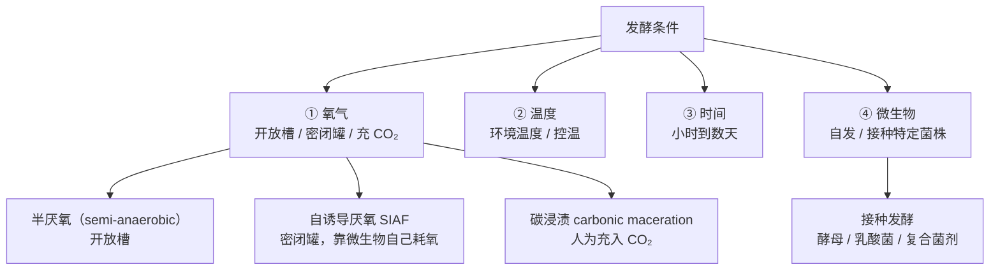
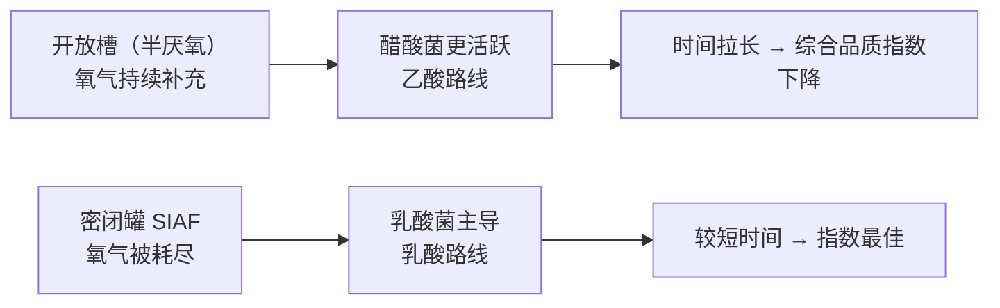
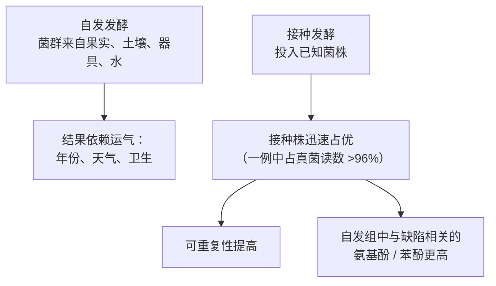

# 第 11 章 处理法 ②：厌氧、接种发酵与"实验性处理"

> **本章目标**：把[第 10 章](10-processing-basics.md)的第二个旋钮——**发酵条件**——单独拧一遍。
> 厌氧、碳浸渍、接种、控温、加压……这些词在豆袋上越来越多，
> 而它们背后其实只有**四个变量**：**氧气、温度、时间、接种谁**。
>
> 这一章还要处理一个别的章节都没遇到过的难题：
> **"厌氧发酵"这几个字印在袋子上，本身就会改变你尝到的东西。**
> 有一项实验直接量过这件事——同一支咖啡，换三个标签，评价就不一样。
>
> 本章**不需要器具**；🅑 部分需要一位帮你换标签的同伴。

## 11.1 先把词分清楚：四个变量，不是一堆门派

"实验性处理（experimental processing）"不是一类工艺，而是一个**筐**。
把筐里的东西倒出来，按变量重新摆：

几个术语的实际所指（按本书读到的研究里的用法）：

| 词 | 研究里的实际做法 |
|----|----------------|
| **半厌氧（semi-anaerobic, SA）** | **开放**发酵槽——氧气可以补进来[^1] |
| **[自诱导厌氧发酵](../../glossary.md#siaf)（self-induced anaerobic fermentation, SIAF）** | **密闭**罐：不充气，靠微生物自身呼吸把氧耗光、并积累 CO₂[^1][^2] |
| **[碳浸渍](../../glossary.md#carbonic-maceration)（carbonic maceration）** | 借自葡萄酒的做法：在**密闭容器中人为充入 CO₂**。一项日晒发酵研究就用了"密闭容器 + CO₂，24 h 与 60 h"两档[^3] |
| **[接种](../../glossary.md#starter-culture)（inoculation）/ 起始培养物（starter culture）** | 投入已知菌株（如 *Saccharomyces cerevisiae*、*Pichia kluyveri*）主导发酵[^2][^4][^5] |

> **一条术语纪律**：豆袋上的"厌氧"**几乎从不说明是哪一种**。
> 密闭罐自耗氧与人为充 CO₂ 是不同的初始条件，
> 开放槽被叫成"厌氧"也很常见。所以看到"厌氧"二字，
> **你知道的其实只有一件事：有人试图控制氧气。**

## 11.2 氧气与时间：一项做了 192 小时的对照

哥伦比亚的一项研究把"氧气条件 × 咖啡形态 × 时间"做成了完整的析因设计[^1]：

- **两种氧气条件**：开放槽（SA）与密闭罐（SIAF）；
- **两种物料**：整颗果实与脱皮后的带胶质豆；
- **时间**：192 小时，**每 24 小时用"牺牲式生物反应器"取一次样**（每个时间点单独一罐，避免开罐扰动）；
- 加一个标准对照，随机完全区组 + 2×2+1 析因。

主要结果[^1]：

| 观察 | 结果 |
|------|------|
| 微生物组成 | 16S 与 ITS 扩增子平均分别检出 **260 ± 71** 与 **101 ± 24** 个 OTU |
| 优势乳酸菌 | ***Weissella*** 为主，其次 *Leuconostoc*、*Lactiplantibacillus* |
| 醋酸菌 | ***Acetobacter*** 在**半厌氧（开放）**条件下更丰富 |
| 受氧气条件影响最大的酵母 | *Pichia*、*Issatchenkia*、*Wickerhamomyces* |
| 显著受影响的过程指标 | pH、葡萄糖消耗、乳酸生成、干物质、**胚的活力**、**健康豆百分比** |
| 综合品质指数（越接近 1.0 越好） | **较短发酵时间 + SIAF** 最佳；**较长时间 + 开放槽**最差（脱皮豆 0.497、整果 0.369） |

> **这项研究给出的两条可迁移结论**：
>
> 1. **"厌氧"最直接的作用不是产生神秘风味，而是压制醋酸菌、把代谢推向乳酸路线**。
>    乙酸主导通常带来尖锐、醋感；乳酸主导则相对圆润。
> 2. **时间不是越长越好**，而且**氧气条件与时间会交互**：
>    开放槽里时间越长，指数掉得越厉害。
>
> ⚠️ **限定**：这是单一产地、单一试验的结果，"综合品质指数"是作者自建的综合指标，
> 不是杯测分。本书**不据此给出任何小时数建议**。

[^1]: 本书编号 [FM1]：Peñuela-Martínez 等 (2025), *Foods* 14(17):3001（PMCID PMC12427761，开放获取）。已读摘要。
[^2]: 本书编号 [FM2]：Bressani 等 (2025), *World Journal of Microbiology & Biotechnology* 41(7):212（PMID 40555793）。已读摘要。
[^3]: 本书编号 [FM6]：Moncayo-Palacios 等 (2025), *TheScientificWorldJournal* 2025:4278424（PMCID PMC12767571，开放获取）。已读摘要。

## 11.3 密闭 + CO₂ 对日晒的影响：糖被"保住"了

上一节是水洗侧。日晒侧也有一项做了对照的研究[^3]：
五个处理——**暴露空气 24 h、48 h；密闭容器充 CO₂ 24 h、60 h；不发酵对照**。

关键结果[^3]：

- 在**改性气氛（CO₂）**条件下，**蔗糖的消耗被抑制**，绿原酸水平被保住，
  反式油酸（elaidic acid）下降不到 10%；
- 各处理之间感官品质有显著差异；
- 作者的结论是：**在改性气氛下发酵整果与日晒咖啡的高感官品质相关联**。

> **把它和[第 10 章 §10.7](10-processing-basics.md)接起来**：
> 水洗发酵中蔗糖是**先升后降**的——糖在被消耗。
> 而密闭 + CO₂ 抑制了这种消耗。
>
> **这给"厌氧更甜"提供了一个真正的机理候选**：
> 不是"厌氧产生了糖"，而是**厌氧让糖少被吃掉一些**。
> ⚠️ 但注意：这是**生豆里的糖**，而生豆里的糖在烘焙中会被大量消耗（第 1、16 章）——
> 从"生豆蔗糖更高"到"杯中更甜"，中间还隔着整个烘焙。本书**不替它把这段路补上**。

## 11.4 接种：四项研究指向同一个方向

如果"发酵"是本章的主题，那么**接种**就是这个领域近年最集中的实验方向。
本书读到的四项研究，设计各不相同，但方向一致：

| 研究 | 设计 | 主要结果 |
|------|------|---------|
| **哥伦比亚 Castillo**[^4] | 接种复合起始培养物 vs 自发发酵，做宏基因组 + 代谢组 + 定量描述分析 | 接种组在**所有感官属性**上优于自发组（更甜、酸与苦更低）；接种组的蔗糖、甘露醇、甲基苯乙酸酯、苹果酸/柠檬酸/奎宁酸更高；**自发组检出更高的氨基酚与苯酚**，作者称这是首次把这两类化合物与缺陷风味直接联系起来 |
| **巴西 SIAF ± 酵母**[^2] | SIAF 发酵 ± *S. cerevisiae* CCMA 0543，对照为常规日晒 | 接种组葡萄糖与果糖消耗更彻底（末端 1.30 与 2.64 g/kg），**乳酸更高（8.76 g/kg）、乙酸更低（6.40 g/kg）**；常规处理乙酸最高（10.12 g/kg）；**只有接种组被判为精品（85.00 分）** |
| **巴西 15,000 L 工业罐**[^5] | 工业规模 SIAF，48 h，控温，多点取样 | 固态 SIAF + 接种 *S. cerevisiae* 使 SCA 分数**最多提高 2.7 分**、鉴定到的挥发物**增加 46%**；PERMANOVA 显示**只有固态发酵在罐内不同位置之间是均匀的** |
| **亚热带湿润区本土酵母**[^6] | 从自发发酵中分离 24 株，筛出 *Pichia kluyveri* LBP UFSC L24 做田间接种 | 接种后该菌占真菌读数 **>96%**；碳水代谢加快、乙醇更高、关键酯类累积更多；**杯测分从 84.0 升到 86.25** |

> **本书对这一组研究的读法**（四条，缺一不可）：
>
> 1. **方向一致是有意义的**：四项独立研究、不同国家、不同菌株、不同规模，
>    都指向"接种使结果更可控、分数不低于自发"。**一致性本身就是证据**；
> 2. **但每一项都是单点研究**：单产地、单季、样本量有限。
>    "提高 2.7 分""从 84 到 86.25"是**那一次试验的观测**，不是通用增益，
>    本书**不把这些数字外推**；
> 3. **最扎实的收益是"减少缺陷"而不是"增加风味"**：
>    Castillo 那项把自发组的**氨基酚与苯酚**（与 phenolic 缺陷相关）测了出来[^4]，
>    接种被解释为**降低杯中缺陷风险的手段**。这与[第 10 章 Q9](../../qa/10-processing-basics-qa.md#q9)
>    的"处理改变格局、不创造本金"完全一致；
> 4. **规模化的核心难题是均匀性**：工业罐里只有固态发酵在不同位置间均匀[^5]。
>    **一罐豆内部不均匀，等于在一个批次里混了几种处理**——
>    这会以"怎么调都同时有萃取不足与萃取过度"的方式出现在你杯子里（[第 9 章](09-harvest-ripeness.md)）。

[^4]: 本书编号 [FM3]：Madrid-Restrepo 等 (2026), *mSystems* 11(1):e0136425（PMCID PMC12817937，开放获取）。已读摘要。
[^5]: 本书编号 [FM5]：Alonso 等 (2026), *Food Research International* 223(Pt 1):117845（PMID 41352791）。已读摘要。
[^6]: 本书编号 [FM4]：Marques Tenório Pereira 等 (2026), *International Journal of Food Microbiology* 458:111878（PMID 42229272）。已读摘要。

## 11.5 温度：同一个"厌氧"，温度不同就是两套菌群

"厌氧"这个词遮住了另一个同样重要的变量。一项在台湾做的研究把温度拉开对比[^7]：
**4 ℃ 与 37 ℃**、**12 h 与 36 h** 的厌氧发酵，用全长 16S rRNA 测序看菌群：

- **37 ℃**（高温）：***Acetobacter*** 成为优势类群；
- **4 ℃**（低温）：***Leuconostoc*** 与 ***Gluconobacter*** 占优，
  且**低温下菌群变化相对缓慢**。

另一项在巴西对 Arara 品种做的 SIAF 研究（时间 0/24/48/72 h、环境温度 vs 27 ℃、
固态 vs 液态、有无接种）同样发现[^8]：**真菌多样性在头 24 小时内急剧下降**，
*Lactobacillus* 与 *Kazachstania* 成为优势属；
决策树模型把 *Leuconostoc*、*Lactobacillus*、*Pichia* 标为与感官正相关的候选标记。

> **合起来的判断**：**"厌氧 36 小时"这句话没有指定温度就不完整。**
> 同样是密闭 36 小时，4 ℃ 与 37 ℃ 得到的是两套不同的菌群、两条不同的代谢路线。
> 这也是为什么产区的**夜间温度、罐体材质与体积**会实质性影响结果——
> 它们都在决定罐子里的温度曲线。
>
> ⚠️ 注意：上述两项研究测的是**菌群与代谢**，不是"哪个温度更好喝"。
> 本书**不给温度建议**。

[^7]: 本书编号 [FM9]：Lee 等 (2023), *Foods* 12(15):2967（PMCID PMC10418422，开放获取）。已读摘要。
[^8]: 本书编号 [FM7]：Silva 等 (2026), *Scientific Reports* 16(1):21933（PMCID PMC13365391，开放获取）。已读摘要。

## 11.6 风险的一侧：延长发酵会换来什么

关于"发酵久一点更有个性"，本书能核到的风险证据有三条，**每一条都要按原文的边界复述**：

1. **综合品质指数下降**：开放槽条件下，发酵时间越长，
   整果与脱皮豆的综合指数分别掉到 0.497 与 0.369[^1]；
2. **胚活力与健康豆比例被显著影响**：同一研究把**胚的活力**与**健康豆百分比**
   列为受处理显著影响的指标[^1]——
   也就是说，长时间发酵会伤到种子本身，而这与[第 12 章](12-drying-storage.md)的储存表现直接相关；
3. **缺陷相关化合物**：自发发酵组中氨基酚与苯酚更高，作者将其与缺陷风味关联[^4]。

关于**霉菌毒素**，[第 9 章](09-harvest-ripeness.md)引用的那项研究同时考察了
"延长采后处理与胶质发酵时间"的影响，报告各延长条件下的最高值为 3.51 μg/kg，
并强调**初始果实品质关键、应分选去除干果与瑕疵果并连续干燥**[^9]。

> **本书的处理与第 5、9 章一致**：**只复述该研究观察到的结果与作者的表述，
> 不做任何安全性推断、不解读限量**。
> 这里唯一要带走的技术点是：**"发酵时间"是一个同时影响风味与风险的旋钮，
> 而干燥必须跟上**——这正好是下一章的主题。

另有一项研究报告了相反方向的一面：厌氧发酵的代谢产物对
产赭曲霉毒素的 *Aspergillus niger* 有**抑制作用**[^7]。

> **两条放在一起才是完整的图景**：
> 发酵既可能是风险源（时间拉长、卫生失控），也可能是**竞争性抑制**的手段
> （优势菌占位、pH 下降）。
> **决定方向的是控制程度，不是"厌氧"这个词。**

[^9]: 本书编号 [R5]：Osorio 等 (2026), *Frontiers in Plant Science* 17:1734522（第 9 章已登记）。

## 11.7 最难的一节：标签本身会改变你尝到的东西

这是本章最重要、也最容易被跳过的一节。

一项研究招募了 **180 名精品咖啡消费者**，做**被试内**设计[^10]：
**同一支咖啡**，配三种标签——**不标处理信息**、标"**发酵（fermentation）**"、
标"**碳浸渍（carbonic maceration）**"。先让他们对香气、风味、酸度、甜度**做出预期**，
再品尝并评价实际体验、喜好度与购买意愿。

结果[^10]：

| 标签 | 预期 | 品尝之后 |
|------|------|---------|
| 无处理信息 | —— | —— |
| **"发酵"** | 被预期为**最酸**、**最不喜欢** | **品尝时得到了证实** |
| **"碳浸渍"** | 提高了**好奇心与新颖感** | **没有损害感官接受度** |

研究还发现：**创新型发酵术语被认为更"异国"、也更贵**[^10]。

这就是[**标签效应**](../../glossary.md#label-effect)。

> **请注意这句话的严重性**：**同一杯咖啡**，因为袋子上的词不同，
> 被喝出了不同的酸度与喜好度。
>
> 这不是说品尝者不诚实——**预期会真实地改变感知**，
> 这正是[第 4 章](../01-foundation/04-perception.md)讲过的多感官整合的一部分。
> 它带来三个后果：
>
> 1. **任何"我尝出厌氧豆特别有果汁感"的个人经验，只要不是盲测，就无法排除标签效应**；
> 2. **店家的非盲杯测同样受影响**——包括善意的店家；
> 3. **"这个词值多少钱"是可以被测量的**：同一支豆，换个词，感知价格就变了[^10]。
>    这是[第 43 章](../../roadmap.md)讲定价机制时会回来的一条。

本章引用的所有产地实验，杯测都由认证评审在标准流程下进行；
但**读者自己的品鉴几乎从不盲**。所以本书给出一条硬性建议：

> **凡是要对"处理法好不好"下结论，必须盲测。**
> 方法在[第 39 章](../../roadmap.md)，而 🅑 实操会先给你一个最小可行版本。

另有一项人类学研究记录了越南精品咖啡农如何在没有统一规范的条件下
**自行组装发酵知识**并让它"在价值链上说得通"[^11]——
它从另一个角度说明：**"实验性处理"目前既是技术，也是一种叙事生产。**

[^10]: 本书编号 [FM8]：Carvalho、de Sousa & Nadaleti (2026), *Foods* 15(8):1287（PMCID PMC13115149，开放获取）。已读摘要。
[^11]: 本书编号 [FM10]：Lindsay (2026), *Agriculture and Human Values* 43(1):1（PMCID PMC12712080，开放获取）。已读摘要。

## 11.8 常见说法辨析

按本书约定标注**证据强度**：✅ 有共识 / ⚠️ 有争议 / ❌ 明确错误 / **缺乏证据**。

| 说法 | 判定 | 说明 |
|------|------|------|
| "厌氧发酵是全新的技术" | ⚠️ **名字新，变量不新** | 它动的是氧气、温度、时间、菌群这四个一直存在的变量。日晒本身就是一场数周的自发发酵（[第 10 章](10-processing-basics.md)） |
| "厌氧 = 完全没有氧气" | ❌ **多数情况下不是** | 研究里最常见的 SIAF 是**密闭后靠微生物自己耗氧**[^1][^2]；开放槽也常被称作"半厌氧"[^1]；只有碳浸渍是人为充 CO₂[^3] |
| "厌氧让咖啡更甜" | ⚠️ **有机理候选，链条未打通** | 改性气氛确实**抑制了蔗糖消耗**[^3]；但从"生豆蔗糖更高"到"杯中更甜"要穿过整个烘焙（第 16 章），本书未读到打通这条链的研究 |
| "发酵时间越长风味越复杂" | ⚠️ **与对照实验方向相反** | 开放槽下时间越长综合指数越低（0.497 / 0.369）[^1]；且胚活力与健康豆比例受显著影响[^1]。**复杂与缺陷不是一回事** |
| "接种是工业化，破坏了风土" | ⚠️ **价值判断，不是事实判断** | 可核对的是：接种使某菌株迅速占优（一例 >96% 真菌读数[^6]），结果更可重复[^2][^4][^5]，并与**更低的缺陷相关化合物**同现[^4]。喜不喜欢这种可重复性是另一个问题 |
| "接种一定能提高分数" | ⚠️ **单点证据，不可外推** | 四项研究都报告了正向结果（如 +2.7 分[^5]、84.0→86.25[^6]、仅接种组达 85.00[^2]），但都是**单产地单季**；本书**不把这些增益通用化** |
| "厌氧豆有酒味/醋味是工艺特色" | ⚠️ **要区分乳酸路线与乙酸路线** | 开放（补氧）条件下醋酸菌更活跃[^1]，常规处理的乙酸高于接种 SIAF（10.12 vs 6.40 g/kg）[^2]。**明显的醋感更可能是控制不足，而不是风格选择** |
| "我一喝就知道是不是厌氧豆" | **缺乏证据（且有反证）** | 同一支咖啡换三个标签，评价就变了[^10]。**非盲条件下的辨认能力无法与标签效应分离**。可验证的是盲测下能否稳定分辨（第 38、39 章） |
| "实验性处理是智商税" | ❌ **同样过头** | 有对照的研究确实测到了可重复的化学与感官差异[^1][^2][^3][^4]；**并且**在减少缺陷这一侧证据最扎实[^4]。"营销放大"与"完全无效"是两回事 |
| "温度不重要，密封才重要" | ❌ **与菌群数据冲突** | 4 ℃ 与 37 ℃ 下的厌氧发酵优势菌完全不同（*Leuconostoc*/*Gluconobacter* vs *Acetobacter*）[^7]；真菌多样性在头 24 h 内急剧下降[^8] |
| "大罐发酵和小罐一样" | ⚠️ **只有部分成立** | 工业规模的物理化学表现与小规模相似，但**只有固态发酵在罐内不同位置间均匀**[^5]。**均匀性是规模化的真正瓶颈** |

## 11.9 🔎 买豆与冲煮时的用处

1. **看到"厌氧"，追问四件事**：密闭还是充 CO₂？多少小时？什么温度？自发还是接种？
   一个都答不上来时，这个词的信息量约等于零。
2. **把"乙酸感"当信号而不是风格**：明显的醋味、尖锐刺激感，
   在对照实验里对应的是**补氧 + 长时间**的组合[^1][^2]。
   遇到这种豆，先怀疑控制程度，而不是先怀疑自己不懂欣赏。
3. **实验性处理的豆，批次一致性风险更高**——尤其是大规模发酵的均匀性问题[^5]。
   同一款豆两次买到差异明显，不一定是烘焙商的锅。
4. **给自己立一条规矩：凡要评判处理法，先盲测。**
   标签效应已经被量化过[^10]，你无法靠"我很客观"绕开它。
5. **冲煮上的实际后果**：发酵风格明显的豆，
   其风味化合物中酯类、醇类、酸类占比更高，这些成分在**高温与长接触时间**下更容易被推到前台。
   出现"闻着漂亮、喝着刺"时，优先试**降低水温 / 缩短接触时间**，
   再考虑放粗研磨——完整排查树在第四部分。

## 11.10 思考题

1. 请用"氧气、温度、时间、接种谁"这四个变量，
   把"半厌氧""SIAF""碳浸渍""接种发酵"四个词分别定位。
   并说明为什么豆袋上的"厌氧"通常不足以让你定位。
2. §11.2 的研究发现：开放槽里醋酸菌更丰富，密闭罐里乳酸菌主导。
   请解释这个差异的机制方向，并说明它如何改变杯中的酸的**质地**。
3. "厌氧让咖啡更甜"有一个真正的机理候选。请说出它是什么，
   并指出这条链条**还差哪一段**才能成立。
4. 四项接种研究都报告了正向结果。请说明：
   （a）为什么"方向一致"本身是有价值的证据；
   （b）为什么本书仍然不把"+2.7 分"这类数字写成通用结论。
5. 工业罐研究发现"只有固态发酵在罐内不同位置间均匀"。
   请说明这件事会以什么形式出现在**消费者的杯子里**，
   以及你能用什么观察去怀疑它。
6. **【案例】** 一家店说："我们做了三支豆的对比杯测，
   厌氧那支明显更有果汁感，大家都同意，所以厌氧确实更好。"
   请指出这个结论的**三个**方法学问题，并给出一个能修正它的最小改造方案。
7. **【案例】** 一份豆袋写着：*"双厌氧 120 小时，风味炸裂，
   带有明显的酒感与醋栗调性。"* 请用本章的证据逐项评估，
   指出"酒感与醋感"最可能对应哪一组工艺条件，并说明你要追问的两个问题。
8. **【辨识】** 标签实验中，"发酵"标签使咖啡被预期为**最酸且最不喜欢**，
   而"碳浸渍"标签提高了好奇心却没有损害接受度。
   请给出至少两种解释这个差异的假说，并说明如何设计实验区分它们。
9. 本章说"最扎实的收益是减少缺陷，而不是增加风味"。
   请结合[第 10 章](10-processing-basics.md)的"处理改变格局、不创造本金"，
   说明这两句话为什么是同一件事的两面。

> 📖 **参考答案**（想清楚再看）：[Q1](../../qa/11-fermentation-experimental-qa.md#q1) ·
> [Q2](../../qa/11-fermentation-experimental-qa.md#q2) · [Q3](../../qa/11-fermentation-experimental-qa.md#q3) ·
> [Q4](../../qa/11-fermentation-experimental-qa.md#q4) · [Q5](../../qa/11-fermentation-experimental-qa.md#q5) ·
> [Q6](../../qa/11-fermentation-experimental-qa.md#q6) · [Q7](../../qa/11-fermentation-experimental-qa.md#q7) ·
> [Q8](../../qa/11-fermentation-experimental-qa.md#q8) · [Q9](../../qa/11-fermentation-experimental-qa.md#q9)

## 11.11 本章实操

### 🅐 无器具版 · 任务一：把"厌氧"翻译成四个变量

收集 5 条你见过的"实验性处理"文案（豆袋、菜单、电商详情页都行），逐条填：

| 文案原词 | ① 氧气条件 | ② 温度 | ③ 时间 | ④ 自发/接种 | 能定位吗 |
|---------|-----------|-------|-------|------------|---------|
| | ☐给了 ☐没给 | ☐给了 ☐没给 | ☐给了 ☐没给 | ☐给了 ☐没给 | ☐能 ☐不能 |
| | ☐给了 ☐没给 | ☐给了 ☐没给 | ☐给了 ☐没给 | ☐给了 ☐没给 | ☐能 ☐不能 |
| | ☐给了 ☐没给 | ☐给了 ☐没给 | ☐给了 ☐没给 | ☐给了 ☐没给 | ☐能 ☐不能 |
| | ☐给了 ☐没给 | ☐给了 ☐没给 | ☐给了 ☐没给 | ☐给了 ☐没给 | ☐能 ☐不能 |
| | ☐给了 ☐没给 | ☐给了 ☐没给 | ☐给了 ☐没给 | ☐给了 ☐没给 | ☐能 ☐不能 |

> **统计一下"能定位"的比例**。多数人会得到 0/5 或 1/5。
> 这个数字本身就是本章最值得带走的观察：
> **这个领域的词汇密度远高于它的信息密度。**

### 🅐 无器具版 · 任务二：给自己做一次"标签效应"自检

回想你喝过的、印象最深的一支"特殊处理"豆，诚实回答：

| 问题 | 你的回答 |
|------|---------|
| 你喝之前知道它的处理法吗？ | ☐知道 ☐不知道 |
| 你是先看到文案还是先喝到？ | |
| 当时的价格比你日常喝的高吗？ | |
| 如果那支豆的袋子上什么都没写，你觉得你的评价会一样吗？ | |
| 你愿意为"重新盲测一次"付出多少代价？ | |

> **这不是要否定你的体验**。标签效应是**真实发生在感知层面**的，
> 不是"你被骗了"。要记住的只有一条：
> **非盲条件下的体验，不能当作"处理法有效"的证据。**

### 🅐 无器具版 · 任务三：读一份发酵宣称的"对照体检表"

挑一篇你能找到的、宣称某处理法更优的文章或产品页，逐项打勾：

| 体检项 | ☐ | 缺失会导致什么 |
|-------|---|--------------|
| 有没有对照组（同批果子、同年、同烘焙）？ | | 无法排除原料与烘焙差异 |
| 评价是否盲法？ | | 无法排除标签效应[^10] |
| 重复了几次？ | | 无法区分真实差异与随机波动 |
| 报告的是杯测分、自建指数还是仪器信号？ | | 三者不等价（§11.2、§11.4） |
| 是单一产地单季吗？ | | 不可外推 |

> 用同一张表去体检**本章引用的研究**，你会发现它们也不是满分——
> 例如都是单产地单季。**本书的做法不是因此弃用它们，而是把限定写在旁边。**
> 这张表的真正用途是：**让你知道一个结论能被推到多远。**

### 🅑 有条件版 · 任务四：最小可行盲测（备齐后再做）

> **所需器具**：两支豆（一支标注实验性处理、一支常规处理，**尽量同产区同烘焙商**）；
> 秤、磨、同一套器具；**一位帮你编号的同伴**（关键，缺了这个实验就不成立）；
> 不透明杯子若干。
> **替代方案**：没有磨与秤，用同一家店的两杯咖啡，请同伴端上来时不说是哪杯。

**流程**（三轮三杯测试，最简单的可信盲测）：

1. 同伴准备**三杯**：其中两杯是同一支豆、一杯是另一支，顺序随机，你不知道哪杯是哪杯；
2. 你的任务只有一个：**找出不一样的那杯**；
3. 重复 **3 轮**（每轮重新随机）。

| 轮次 | 你的选择 | 是否正确 |
|------|---------|---------|
| 1 | | ☐对 ☐错 |
| 2 | | ☐对 ☐错 |
| 3 | | ☐对 ☐错 |

> **怎么读结果**（重要）：
> - **随机猜的正确率是 1/3**。三轮全对也只是初步信号，不是证明；
> - **如果你分不出来**，那么你之前所有关于"这支厌氧豆更有果汁感"的描述，
>   都需要重新归因——很可能来自标签与价格，而不是杯中；
> - **如果你分得出来**，恭喜：你现在拥有一个**真实存在的差异**，
>   下一步才轮到描述它（第 36 章）。
>
> 完整的统计学处理（要多少轮才算显著）在第 38、39 章。**先养成盲的习惯，再谈严谨。**

### 🅑 有条件版 · 任务五：自制"标签互换"实验（备齐后再做）

> **所需器具**：**一支**豆（只要一支）；两个一样的杯子；同伴；两张手写小卡片。
> **替代方案**：用茶、果汁、气泡水都行——目的是体会效应，不是研究咖啡。

1. 同伴用**同一支豆、同一参数**冲两杯；
2. 一杯前面放"**自然日晒**"卡片，另一杯放"**72 小时厌氧发酵**"卡片；
3. 你按第 4 章学的框架，逐项评价两杯：香气强度、酸度、甜感、body、喜好度；
4. 评完之后，同伴告诉你真相。

| 评价项 | "自然日晒"那杯 | "厌氧发酵"那杯 | 差值 |
|-------|--------------|---------------|------|
| 香气强度 | | | |
| 酸度 | | | |
| 甜感 | | | |
| body | | | |
| 喜好度 | | | |
| 你愿意为它付的价格 | | | |

> **多数人会打出不一样的分。这正是重点。**
> 研究里 180 名精品咖啡消费者在同一支咖啡上就是这样表现的[^10]。
> **做过这个实验的人，从此不会再把非盲的品鉴结论当证据——这比任何说教都有效。**

---

## 11.12 本章依据

完整书目信息登记在[出处与资料登记 §4.14](../../standards.md)。

- **[FM1]** Peñuela-Martínez 等 (2025), *Foods* 14(17):3001（开放获取）。本章 §11.2 主干：
  开放槽（半厌氧）vs 密闭罐（SIAF）× 整果 vs 脱皮豆，192 h、每 24 h 牺牲式取样；
  16S/ITS 平均 260 ± 71 与 101 ± 24 个 OTU；*Weissella* 为优势乳酸菌；
  *Acetobacter* 在半厌氧下更丰富；pH、葡萄糖消耗、乳酸、干物质、**胚活力**、**健康豆比例**显著受影响；
  综合指数以"短时间 + SIAF"最佳、"长时间 + 开放槽"最差（0.497 / 0.369）。已读摘要。
- **[FM6]** Moncayo-Palacios 等 (2025), *TheScientificWorldJournal* 2025:4278424（开放获取）。用到：
  日晒侧五处理（空气 24/48 h、密闭 CO₂ 24/60 h、不发酵对照）；改性气氛**抑制蔗糖消耗**、
  保住绿原酸、反式油酸下降 <10%；感官差异显著。已读摘要。
- **[FM3]** Madrid-Restrepo 等 (2026), *mSystems* 11(1):e0136425（开放获取）。用到：
  接种 vs 自发；接种组所有感官属性更优、蔗糖与甘露醇等更高；
  **自发组的氨基酚与苯酚更高**，作者称首次将其与缺陷风味直接关联。已读摘要。
- **[FM2]** Bressani 等 (2025), *World J. Microbiol. Biotechnol.* 41(7):212。用到：
  SIAF ± *S. cerevisiae* CCMA 0543 vs 常规；接种组末端葡萄糖 1.30、果糖 2.64 g/kg，
  乳酸 8.76、乙酸 6.40 g/kg；常规乙酸 10.12 g/kg；**仅接种组达 85.00 分**。已读摘要。
- **[FM5]** Alonso 等 (2026), *Food Research International* 223(Pt 1):117845。用到：
  15,000 L 不锈钢生物反应器、48 h 控温 SIAF；固态 SIAF + 接种使 SCA 分**最多 +2.7**、
  鉴定挥发物 **+46%**；PERMANOVA 显示**只有固态发酵罐内位置间均匀**。已读摘要。
- **[FM4]** Marques Tenório Pereira 等 (2026), *Int. J. Food Microbiology* 458:111878。用到：
  24 株分离物中筛出 *Pichia kluyveri* LBP UFSC L24；接种后占真菌读数 **>96%**；
  酯类累积增加；**杯测分 84.0 → 86.25**。已读摘要。
- **[FM9]** Lee 等 (2023), *Foods* 12(15):2967（开放获取）。用到：
  4 ℃ vs 37 ℃、12 h vs 36 h 厌氧发酵的菌群差异（*Acetobacter* vs *Leuconostoc*/*Gluconobacter*）；
  低温下菌群变化较慢；发酵代谢物对产赭曲霉毒素 *A. niger* 的抑制作用。已读摘要。
- **[FM7]** Silva 等 (2026), *Scientific Reports* 16(1):21933（开放获取）。用到：
  Arara 的 SIAF（0/24/48/72 h、环境温度 vs 27 ℃、固态 vs 液态、±起始培养物）；
  真菌多样性在头 24 h 急剧下降；*Lactobacillus* 与 *Kazachstania* 占优；
  *Leuconostoc*、*Lactobacillus*、*Pichia* 为感官正相关候选标记。已读摘要。
- **[FM8]** Carvalho、de Sousa & Nadaleti (2026), *Foods* 15(8):1287（开放获取）。本章 §11.7 主干：
  180 名精品咖啡消费者、被试内设计、**同一支咖啡配三种标签**；"发酵"被预期为最酸且最不喜欢
  并在品尝中被证实；"碳浸渍"提升好奇与新颖感且不损害接受度；创新术语被认为更异国、更贵。已读摘要。
- **[FM10]** Lindsay (2026), *Agriculture and Human Values* 43(1):1（开放获取）。用到：
  越南精品咖啡发酵知识的民族志——生产者如何组装"能在价值链上说得通"的工作知识。已读摘要。
- **[R5]**（第 9 章已登记）用到：延长采后处理与胶质发酵时间条件下的霉菌毒素测定结果与作者关于
  分选、连续干燥的表述。**本书只复述结果，不做任何安全性推断。**

**本章刻意没写的东西**：

- **任何"厌氧应该发酵多少小时/多少度"的建议**——研究都是单产地单季，
  且各自只有少数几档条件，不足以给出可外推的参数；
- **"厌氧 → 杯中更甜"的因果链**——只到"生豆蔗糖消耗被抑制"为止，
  后半段（穿过烘焙）本书未读到证据；
- **接种菌株的商品推荐**——本书不评价具体产品；
- **"双厌氧""三重发酵"等叠加工艺的效果**——未找到对照研究；
- **霉菌毒素的安全性判断或限量解读**——与第 5、9 章红线一致。

---

**下一章**：第 12 章 干燥、含水率与生豆储存。
本章反复出现的"干燥必须跟上"会在那里变成主角；
而那一章要拆的核心误解是：**生豆不是一袋惰性的种子，它是活的，而且会死。**
