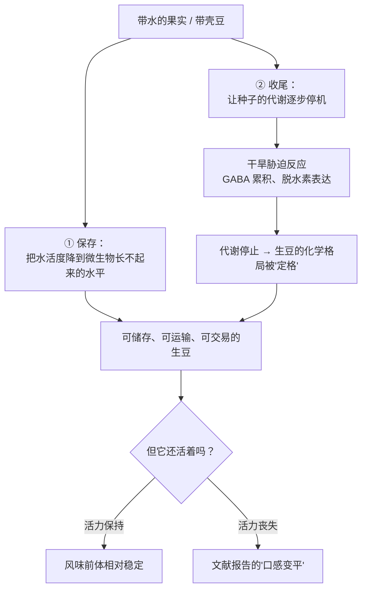
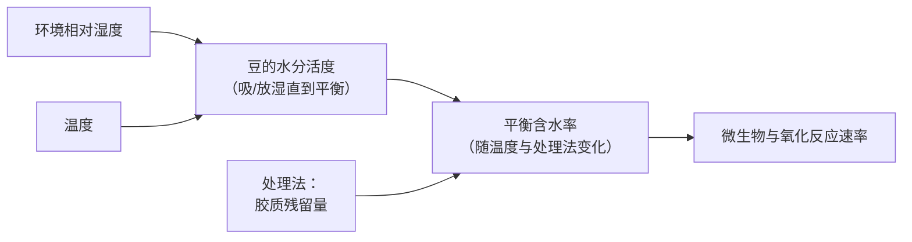
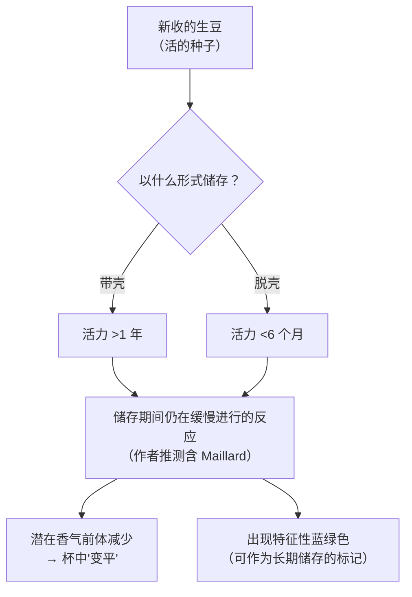

# 第 12 章 干燥、含水率与生豆储存：生豆是活的

> **本章目标**：把"干燥"从一句流水账（"晒了几天"）变成一个**有物理量、有终点判据、有失败模式**的工序；
> 再把"生豆储存"从"放着就行"变成一条**有半衰期的时间线**。
>
> 这一章的核心事实只有一句，但它会推翻很多直觉：
> **生豆不是一袋惰性的种子——它是活的，而且会死。**
> 一项做了两年的储存实验发现：**带壳保存的豆活力能维持一年以上，脱壳的六个月内就失去活力**；
> 而"活力"与生豆的"陈味"高度相关。
>
> 本章 🅐 部分只需要一包豆和一双眼睛；🅑 部分需要一台便宜的湿度计。

## 12.1 干燥同时在做两件事

多数人把干燥理解成"把水拿走以便保存"。它确实是，但那只是一半：

第 ② 条来自[第 10 章](10-processing-basics.md)：种子在处理期间是活的，
干燥就是**给这段代谢收尾的过程**。一项分子研究显示，
干燥过程中水势下降会诱发**大规模的干旱胁迫反应**，
表现为 GABA 累积与**脱水素（dehydrin）**基因表达[^1]。
综述转引的一个量化边界是：**干旱胁迫约在含水率 45% 时开始，代谢在约 25% 时停机**[^2]。

> **所以"干得快"与"干得慢"不只是效率差别**：
> 它决定了种子在胁迫状态下停留多久——这正是[第 10 章](10-processing-basics.md)
> 日晒豆 GABA 高出水洗豆约一个数量级的原因[^2]。
> **干燥是处理法的最后一个旋钮，不是处理之后的收尾工作。**

[^1]: 本书编号 [PR3]：Kramer 等 (2010), *Plant & Cell Physiology* 51(4):546–553（第 10 章已登记）。
[^2]: 本书编号 [C2]：Bastian 等 (2021), *Foods* 10(11):2827（PMCID PMC8620865，开放获取）。已读全文相关章节。

## 12.2 数字与基准：10%~12% 是怎么来的

一篇 2026 年的干燥综述给出了这条链上最常被引用的两个数[^3]：

| 项 | 数值 | 基准 |
|----|------|------|
| 刚采收的豆 | **50%~60%** 含水率 | **湿基（wb）** |
| 安全储存目标 | **10%~12%** | **湿基（wb）** |
| 高于此值的风险 | 综述指出：在采收季相对湿度常超过 70% 的热带地区，若含水率**维持在 12% 以上**，通风不足、雨天中断或干燥延迟会**增加真菌定殖风险** | —— |

另一篇综述给的数字略有不同：**整颗成熟果实**含水率约 **65%~70%**，
日晒先干到约 **15%** 再脱壳（太湿脱不动、太干会碎），之后再干到 **12%**[^2]。

> **两组数字不是矛盾，是基准不同**——这正是本书反复强调的事：
>
> | 说"含水率" | 指的是谁 |
> |-----------|---------|
> | 65%~70% | **整颗果实**（含果肉，果肉本身含水率极高） |
> | 50%~60% | **刚采收/刚脱皮的豆** |
> | 15% → 12% | **脱壳前后的生豆** |
>
> **读到任何一个含水率数字，先问三句：谁的水？湿基还是干基？在工序的哪一步？**
> 这三句话在第 19 章（烘焙失重率）和第 22 章（萃取率）还会各用一次。

至于"**为什么是 10%~12% 而不是更低**"，本书能核到的是两条实务约束：
太湿则微生物与酶活跃[^2][^3]，太干则豆易碎、且重量损失直接变成钱[^2]。
**本书不写任何具体的"最佳含水率"单点值**——各产国的交易规则不同，
而本轮无法核到可引用的标准编号（见 §12.7）。

[^3]: 本书编号 [D1]：Duque-Dussán 等 (2026), *Foods* 15(10):1737（PMCID PMC13205183，开放获取）。已读全文相关章节。

## 12.3 干燥方式：真正的变量是均匀性

| 方式 | 综述记载的做法与量级[^3] | 主要风险 |
|------|----------------------|---------|
| **晒场（patio）** | 摊成 **2~5 cm** 薄层于水泥/砖/沥青地面，定期翻动；依气候需 **7~20 天** | 受天气支配；干燥动力学比高床更慢更不稳定；含水率不均 |
| **高床（raised bed / African bed）** | 高 **0.8~1.2 m** 的网面平台，摊 **2~4 cm**，每天翻 **2~3 次** | 仍受天气影响，但空气可从上下两面流通，污染风险更低 |
| **机械干燥** | 控温 + 强制通风，依批量与初始含水率需 **24~72 小时** | 设备与能耗成本；温度失控会伤及品质 |
| **主动式太阳能干燥** | 集热器预热空气 + 风机送风；温度较环境高 **10~25 ℃**，干燥时间比晒场/被动隧道缩短 **30%~50%** | 建造与运行成本更高 |

两个**失败模式**值得单独记住，因为它们会一路走到你的杯子里[^3]：

- [**表壳硬化**](../../glossary.md#case-hardening)（case hardening）：表面干得太快、内部水出不来，
  形成"外干内湿"的豆——含水率测出来可能是合格的，但分布是错的；
- [**回潮**](../../glossary.md#re-wetting)（re-wetting）：夜间或雨天吸湿，干燥曲线出现反复。

> **综述自己的总结很值得抄下来**：管理失误（回潮、表壳硬化）会**损害稳定性与杯品**，
> 而控制良好的干燥能**保住有机酸、糖与挥发性前体**[^3]。
>
> **也就是说：干燥的技术目标不是"干到多少"，而是"每一颗豆都干到差不多"。**
> 这与[第 9 章](09-harvest-ripeness.md)的成熟度一致性、
> [第 11 章](11-fermentation-experimental.md)的罐内均匀性是同一个主题的第三次出现——
> **上游的所有工序，本质上都在和"不均匀"作斗争。**

巴西的一项对照研究提供了一个量化侧证[^4]：比较日晒、日晒 + 旋转机械干燥、
以及一台机械干燥机三种方式，结果**机械干燥组的水分活度低于 0.6、含水率更稳定（7.73%~10.42%）**，
酚类与抗氧化活性保留更高，感官上香气与风味得分更高，
两个产区的样品分别达到 **80~81 分**（SCA 量表）。

> ⚠️ **怎么读这项研究**：它是**单季、两个产区、特定设备**的比较，
> 且机械干燥机是具名商业设备。本书**不据此推荐任何干燥设备**，
> 只取一条可迁移的结论：**能把含水率控稳的方式，品质表现更一致。**

[^4]: 本书编号 [D7]：Abreu 等 (2025), *Foods* 14(9):1463（PMCID PMC12071231，开放获取）。已读摘要。

## 12.4 水分活度：一个比含水率更有用的量

[**含水率**](../../glossary.md#moisture-content)（moisture content）说的是"有多少水"，
[**水分活度**](../../glossary.md#water-activity)（water activity, a_w）说的是"**这些水有多自由**"——
即样品中水的蒸汽压与同温下纯水蒸汽压之比，取值 0~1。

为什么它更有用：**微生物与化学反应关心的是自由水，不是总水量。**
两份含水率同为 11% 的豆，如果水的结合状态不同，稳定性可以差很多。

一项在哥伦比亚做的实验测了**水洗豆与半日晒（蜜处理）豆的吸附等温线**[^5]：

- 在 **a_w 0.1~0.85**、**25/35/45 ℃** 条件下测定（动态露点法）；
- 两者都呈 **BET 分类中的 II 型 S 形曲线**；温度对曲线有显著影响（p < 0.05）；
- **关键观察**：半日晒豆表面残留的**胶质层对吸水具有保护作用**。

> **三条可以带走的结论**：
>
> 1. **含水率不是豆的固有属性，而是它与环境达成的平衡**——
>    环境湿度变了，含水率就会变（这正是"回潮"的本质）；
> 2. **温度会改写这条平衡曲线**[^5]，所以"含水率 11%"在热带仓库和在冷库里安全性不同；
> 3. **蜜处理豆表面的胶质是一层保护壳**[^5]——
>    这给"蜜处理豆更耐放"这类说法提供了一个机理候选，
>    但⚠️ 该研究测的是**吸湿行为**，不是杯品保质期，两者不能直接等同。

[^5]: 本书编号 [D6]：Collazos-Escobar 等 (2025), *Scientific Reports* 15:3898（PMCID PMC11785944，开放获取）。已读摘要。

## 12.5 本章最重要的一项研究：生豆会失去活力

Selmar 团队把不同处理的咖啡在标准条件下**储存两年**，
用四唑（tetrazolium）法测种子活力，并用 HPLC 追踪游离氨基酸与可溶性糖[^6]。

结果：

| 观察 | 结果 |
|------|------|
| **带壳（parchment）保存的水洗豆** | 活力维持 **一年以上** |
| **其他所有形式（已脱壳）** | **六个月内**即失去活力 |
| 葡萄糖与果糖 | 储存中**略有下降** |
| **谷氨酰胺** | **显著下降** |
| 关键的否定结果 | **糖与氨基酸的变化与活力并不相关** |
| 外观标记 | 出现特征性的**蓝绿色**，推测源于绿原酸氧化及其与伯胺化合物的后续反应 |
| 作者的推论 | 既然活细胞的代谢反应与典型的死后反应都无法解释所观察到的变化，**储存期间发生的 Maillard 反应**可能是潜在香气前体减少的原因；并提出**活力丧失与"香气变平"有关** |

> **这项研究为什么重要**（三条）：
>
> 1. **它给了"带壳储存更保鲜"一个真正的实验依据**——
>    [出处与资料登记 §七](../../standards.md)此前把这句话列为"缺对照实验"，
>    本轮**部分补核**：至少在**种子活力**这个指标上，带壳确实显著更耐放[^6]。
>    ⚠️ 但要注意：**该研究测的是活力，不是杯测分**——
>    "活力 ↔ 香气变平"是作者的**推论与建议**，不是直接测出的因果；
> 2. **它同时给出了一个漂亮的否定结果**：糖与氨基酸的变化**与活力不相关**。
>    这排除了"活着的细胞在消耗前体"这个最直观的解释；
> 3. **它提出了一个反直觉的机制**：储存期间也在发生 Maillard 反应——
>    也就是说，**烘焙里那套化学，在常温仓库里以极慢的速度一直在跑**（第 16 章会回头看这件事）。

### 顺带处理一个颜色问题

那篇研究说长期储存会出现特征性的**蓝绿色**[^6]；
而[第 13 章](13-green-grading.md)会看到，埃塞俄比亚商品交易所的生豆分级里，
颜色档次是 **bluish > greyish > greenish > coated > faded > white**，
**"蓝"是最高档**[^7]。

> **本书不把这两处的"蓝绿"当成同一件事**，理由如下：
> 两份资料对颜色的描述精度都不足以支持这种等同（一个是储存中出现的色变，
> 一个是分级量表上的档位名），而且分级颜色同时受品种、处理、含水率影响。
>
> **能确定的只有一条：用颜色判断生豆新鲜度，需要比"绿不绿"更精确的定义。**
> 这也是为什么本书在[第 13 章](13-green-grading.md)会把"颜色"归入
> **代理变量**而不是判据。

[^6]: 本书编号 [D2]：Selmar、Bytof & Knopp (2008), *Annals of Botany* 101(1):31–38（PMCID PMC2701840）。已读摘要。
[^7]: 本书编号 [GR1]：Gebreselassie 等 (2024), *Heliyon* 10(14):e34378（PMCID PMC11305185，开放获取）。第 13 章主用。

## 12.6 储存实验：包装、地点与时间

三项设计不同的研究，指向同一组结论。

**（1）包装 × 地点 × 365 天（哥伦比亚）**[^8]

八种包装（黄麻纤维、纸、以及六种聚乙烯/聚丙烯基复合材料），
四个存放地点（含一个冷库），生豆存 365 天，用 SCA 总分追踪：

| 地点特征 | 结果 |
|---------|------|
| Alto de Letras（温湿度**全年恒定**） | PE-EVOH、PE-PAV、PE-double、PP-PVC 四种包装**保住了 365 天**的感官总分；**黄麻纤维没有** |
| Santa Marta（**高温高湿**） | **60 天后**总分即受显著影响 |
| 冷库 | **240 天后**才受影响 |
| Chinchiná | 总分随储存时间持续下降 |

> 作者的结论写得很克制：**环境条件决定了包装能发挥多大作用**[^8]。
> 换句话说：**包装不能拯救一个糟糕的仓库。**

**（2）带壳咖啡 × 12 个月（埃塞俄比亚）**[^9]

四种包装（黄麻袋、内衬低密度聚乙烯的编织聚丙烯袋、GrainPro、PICS）
× 三个产区品牌，带壳储存 12 个月：**气密包装（PICS 与 GrainPro）优于黄麻袋对照**，
其中 Sidama 与 Yirgacheffe 在气密袋中杯测值持续 **80 分以上**，Limu 未达到。

**（3）加速储存实验**[^10][^11]

- 一项把日晒与蜜处理生豆放进 GrainPro 袋，在 **30/40/50 ℃、RH 50%** 下做加速试验，
  用过氧化值与 TBARS 建立动力学模型，估得的货架期
  （日晒 45.67 / 29.9 / 24.92 天；蜜处理 60.34 / 38.07 / 19.22 天）[^10]。
  ⚠️ **这些是加速条件下的模型估计值，不是常温保质期**，本书**不做任何换算**；
- 另一项在 40/50/60 ℃ 下做加速储存，用文本挖掘分析 Q-Grader 的描述语，
  发现**真空包装与多层复合袋**更能保住理想属性，而
  **高温与"已研磨"状态会加速劣化**，描述语从新鲜相关词逐步被储存相关的负面词取代[^11]。

> **把三项合起来的实用结论**（这是本章最能直接用的一段）：
>
> | 变量 | 影响方向 | 证据 |
> |------|---------|------|
> | **环境温湿度** | **影响最大**：高温高湿处 60 天见效，冷库 240 天 | [^8] |
> | **包装阻隔性** | 气密/高阻隔 > 黄麻 | [^8][^9] |
> | **是否带壳** | 带壳显著延长**活力** | [^6] |
> | **是否已研磨**（熟豆侧） | 研磨显著加速劣化 | [^11] |
> | 处理法 | 有差异，但方向随温度改变，证据弱 | [^10] |

[^8]: 本书编号 [D3]：Gallego、Pabón、Medina & Osorio (2025), *International Journal of Food Science* 2025:5049217（PMCID PMC12658285，开放获取）。已读摘要。
[^9]: 本书编号 [D4]：Eshete 等 (2024), *Heliyon* 10(8):e29323（PMCID PMC11031754，开放获取）。已读摘要。
[^10]: 本书编号 [D5]：Aung Moon 等 (2024), *Foods* 13(15):2331（PMCID PMC11311548，开放获取）。已读摘要。
[^11]: 本书编号 [D8]：Fernandez-Rosillo 等 (2026), *Foods* 15(15):2756（PMCID PMC13465152，开放获取）。已读摘要。

## 12.7 "过季豆"到底指什么

[**"当季豆 / 过季豆"**](../../glossary.md#past-crop)（current crop / past crop）**是行业惯例用语**，
指生豆距采收的时间。本书查证后的态度是：

| 层次 | 判断 |
|------|------|
| **"生豆会随储存变化"** | ✅ **有实验支持**：活力丧失[^6]、感官总分随时间与环境下降[^8][^9]、氧化指标上升[^10] |
| **"变化的速度取决于环境与包装"** | ✅ **有实验支持**，而且环境的权重大于包装[^8] |
| **"超过 N 个月就是过季豆"** | **缺乏证据**：本书未找到任何可核对的、被广泛采用的时间阈值定义。上述研究的时间点是各自的实验设计，**不是行业标准** |
| **"过季豆一定不好喝"** | ⚠️ **过度简化**：气密包装 + 恒定环境下 365 天总分未受显著影响[^8]；而高温高湿处 60 天就掉了[^8]。**日历天数不是好的自变量，"经历"才是** |

> **正确的追问方式**：不是"这豆是哪一年的"，
> 而是"**这豆离开产地多久、一路怎么存的、什么包装、有没有进过冷柜**"。
> 前者是一个数字，后者才是原因。

关于标准：本书本轮**再次尝试核对国际标准编号，仍被标准机构网站的防护层拦下**
（详见[出处与资料登记 §二](../../standards.md)），
因此**本章不引用任何标准编号**，含水率与储存的一切表述都只给文献出处。

## 12.8 常见说法辨析

按本书约定标注**证据强度**：✅ 有共识 / ⚠️ 有争议 / ❌ 明确错误 / **缺乏证据**。

| 说法 | 判定 | 说明 |
|------|------|------|
| "生豆是惰性的，放着不会变" | ❌ **明确错误** | 生豆是**活的种子**：脱壳后六个月内即失去活力，带壳可维持一年以上[^6]；感官总分随储存时间与环境显著变化[^8][^9] |
| "带壳储存更保鲜" | ✅ **在活力这一指标上有实验支持** | 两年储存实验中带壳豆活力 **>1 年** vs 脱壳 **<6 个月**[^6]。⚠️ 但"活力 ↔ 香气变平"是作者的**推论**，该研究未直接测杯测分 |
| "干燥就是把水弄走" | ⚠️ **不完整** | 干燥同时在**给种子的代谢收尾**：胁迫反应、GABA、脱水素[^1][^2]；干燥速度因此改变生豆化学格局（[第 10 章](10-processing-basics.md)） |
| "含水率达标就安全了" | ⚠️ **要看分布与水分活度** | **表壳硬化**会造成外干内湿，均值合格而分布错误[^3]；微生物关心的是**自由水（a_w）**而非总水量[^4][^5] |
| "含水率是豆子的固有属性" | ❌ **概念错误** | 它是豆与环境达成的**平衡值**，随环境湿度与温度移动[^5]——这正是"回潮"的本质 |
| "晒干的比机器烘干的好" | ⚠️ **对照不支持一般性结论** | 一项巴西研究里**机械干燥组**水分活度更低、含水率更稳定、酚类保留更高、感官得分更高[^4]。⚠️ 单季、特定设备，**不能反过来说机械一定更好** |
| "超过 N 个月就是过季豆" | **缺乏证据** | 未找到可核对的通用阈值。同样的天数，在恒温恒湿处 365 天总分不降，在高温高湿处 60 天就降[^8] |
| "过季豆一定不好喝" | ⚠️ **过度简化** | 见上。**该问的是"怎么存的"，不是"哪一年的"** |
| "生豆越绿越新鲜" | ⚠️ **定义不足** | 长期储存会出现特征性**蓝绿色**[^6]，而分级量表里"蓝"又是最高档[^7]。两者不能简单等同；**用颜色判断新鲜度需要更精确的定义** |
| "冷冻/冷藏生豆能长期保鲜" | ⚠️ **只有部分证据** | 冷库条件下总分在 **240 天**后才受显著影响，优于其他地点[^8]。但这是**冷库（低温仓储）**，不是家用冷冻；本书未读到家庭冷冻生豆的对照研究 |
| "包装比仓库重要" | ❌ **与观测相反** | 环境条件决定了包装能发挥多大作用：高温高湿处 60 天即受影响，无论哪种包装[^8] |
| "买回家的生豆可以随便放" | ⚠️ **至少要控温湿** | 平衡含水率随环境移动[^5]；高温是最强的劣化因子[^8][^10][^11] |

## 12.9 🔎 买豆与冲煮时的用处

1. **问卖家三个比"哪一年的"更有用的问题**：离开产地多久？什么包装？一路的仓储温湿度如何？
   —— 环境的权重大于日历天数[^8]。
2. **看到"带壳储存 / parchment storage"是个加分项**，
   它在活力这一指标上有实验支持[^6]；但不要把它读成"风味保证"。
3. **"当季豆"概念对家庭用户的实际意义有限**——
   你买到的是熟豆，熟豆的劣化速度（尤其是**研磨后**[^11]）远快于生豆。
   **把注意力放在熟豆的新鲜度与你自己的储存上，性价比更高**（第 41 章展开）。
4. **遇到"闷、木质、纸感、风味扁平"的杯子**，
   在怀疑冲煮之前，先把两个上游可能性放进候选名单：
   **干燥不当（表壳硬化/回潮）** 与 **生豆长期储存**。
   两者都会以"香气强度不足但没有明显缺陷"的形式出现——**这是最难靠调参数救回来的一类**。
5. **一条给自己的规矩**：任何关于"这豆放了多久"的判断，
   在你拿到烘焙日期与产地离港时间之前，都只是猜测。**先要数据，再下判断。**

## 12.10 思考题

1. 本章说"干燥同时在做两件事"。请分别说明这两件事，
   并解释为什么"干得快还是慢"会改变生豆的化学格局。
2. 一份资料说刚采收含水率 65%~70%，另一份说 50%~60%。
   请说明这**不是**矛盾，并写出你读到任何含水率数字时应该问的三句话。
3. 请解释**含水率**与**水分活度**的区别，
   并说明为什么"两份含水率都是 11% 的豆，稳定性可以差很多"。
4. **表壳硬化（case hardening）**为什么特别危险？
   请从"测量"与"后果"两个角度各说一条。
5. 两年储存实验发现：糖与氨基酸的变化**与活力不相关**。
   请说明这个**否定结果**排除了什么解释、又把作者引向了哪个推测。
6. **【案例】** 一位卖家说："我们的生豆都是气密袋装的，所以放三年也没问题。"
   请指出这句话忽略了什么，并写出你会追问的两个问题。
7. **【案例】** 你买到一支豆，杯中"没有明显缺陷，但香气很弱、口感扁平、
   怎么调参数都提不起来"。烘焙日期是两周前，烘焙度中浅。
   请列出**至少四种**可能的原因（覆盖上游到你自己），并说明你会按什么顺序排查。
8. **【辨识】** 本章提到长期储存会出现特征性蓝绿色，
   而第 13 章会看到分级量表里"蓝"是最高档颜色。
   请说明本书为什么**不**把这两处等同，并设计一个能厘清这件事的观察方案。
9. 结合第 9、11、12 三章，请说明"**上游的所有工序本质上都在和不均匀作斗争**"这句话，
   在这三章里分别指的是什么，以及它们最终会以什么共同形式出现在你的杯子里。

> 📖 **参考答案**（想清楚再看）：[Q1](../../qa/12-drying-storage-qa.md#q1) ·
> [Q2](../../qa/12-drying-storage-qa.md#q2) · [Q3](../../qa/12-drying-storage-qa.md#q3) ·
> [Q4](../../qa/12-drying-storage-qa.md#q4) · [Q5](../../qa/12-drying-storage-qa.md#q5) ·
> [Q6](../../qa/12-drying-storage-qa.md#q6) · [Q7](../../qa/12-drying-storage-qa.md#q7) ·
> [Q8](../../qa/12-drying-storage-qa.md#q8) · [Q9](../../qa/12-drying-storage-qa.md#q9)

## 12.11 本章实操

### 🅐 无器具版 · 任务一：给手上的豆做一条"时间线"

对每一包豆，尽你所能填出这条线（填不出来的空格才是重点）：

| 节点 | 你能查到吗 | 数值/描述 |
|------|-----------|----------|
| 采收年份/产季 | ☐能 ☐不能 | |
| 处理与干燥完成（大致） | ☐能 ☐不能 | |
| 离开产地 / 到港 | ☐能 ☐不能 | |
| 生豆仓储条件 | ☐能 ☐不能 | |
| **烘焙日期** | ☐能 ☐不能 | |
| 你拿到的日期 | ☐能 ☐不能 | |

> **多数人只能填最后两行**。这就是结论：
> **消费者能看到的时间线，只覆盖了整条链的最后一小段。**
> 所以"当季豆"这类判断，对家庭用户来说往往**不可核实**——
> 与其纠结它，不如把力气放在你能控制的那一段（第 41 章）。

### 🅐 无器具版 · 任务二：用厨房里的东西理解水分活度

不需要买任何器具，用**饼干**做一次演示：

| 步骤 | 做法 | 观察 |
|------|------|------|
| 1 | 取两片同样的脆饼干 | |
| 2 | 一片装进密封袋，一片敞开放在厨房 | |
| 3 | 24 小时后各咬一口 | 敞开的那片：____ |
| 4 | 把软掉的那片放回密封袋，静置一天 | 还能变回去吗：____ |

> **这个演示要建立的直觉**：
> ① **食物的含水率不是固定的，它会向环境的湿度靠拢**——这就是平衡含水率[^5]；
> ② **变软的过程比变干容易，回去却很难**——
> 因为吸湿之后发生的一些变化（在咖啡里是氧化与 Maillard[^6]）是不可逆的。
> 回潮之所以危险，正在于此。

### 🅐 无器具版 · 任务三：给"过季豆"的说法做一次体检

找三条你见过的关于"当季豆/过季豆"的说法（店家话术、社群帖子、文章都行）：

| 说法原文 | 它断言了什么 | 有没有给出"怎么存的" | 本书能支持到哪一层 |
|---------|------------|-------------------|------------------|
| | | ☐有 ☐无 | |
| | | ☐有 ☐无 | |
| | | ☐有 ☐无 | |

> **参考判据**（§12.7 的四层）：
> "会变化" ✅ → "速度取决于环境与包装" ✅ →
> "超过 N 个月就过季" 缺乏证据 → "过季就难喝" ⚠️ 过度简化。

### 🅑 有条件版 · 任务四：用一支温湿度计给自己的储存打分（备齐后再做）

> **所需器具**：一支便宜的**电子温湿度计**（几十元即可）。
> **替代方案**：手机天气 App 的室内估计值很不准，但连续记录**趋势**仍有参考价值。

把温湿度计放在你**实际存放咖啡的位置**（不是客厅中央），连记七天：

| 日期 | 最高温 | 最低温 | 最高湿度 | 最低湿度 | 当天有无开火/开窗/空调 |
|------|-------|-------|---------|---------|---------------------|
| | | | | | |
| | | | | | |
| | | | | | |

> **怎么读这张表**（两条）：
> 1. **看波动幅度，不只看均值**。平衡含水率随温湿度移动[^5]，
>    **反复的吸放湿比稳定的高湿更伤**——这是回潮的家庭版；
> 2. **对照那项包装研究的结论**[^8]：环境恒定的地点让四种包装都撑过了 365 天，
>    高温高湿处 60 天就掉分。**你家的储存位置属于哪一类？**
>
> 如果你的记录显示温度天天大幅波动（比如灶台边、阳台、车里），
> 那么**换储存位置的收益，大于换任何包装**。

### 🅑 有条件版 · 任务五：自己做一次"回潮"对照（备齐后再做）

> **所需器具**：一小包熟豆（分两份）；两个密封罐；一个不密封的容器；秤（0.1 g 精度更好）。
> ⚠️ **用熟豆而不是生豆**，因为你多半拿不到生豆；原理相同，时间尺度更短。
> **替代方案**：用同一款饼干或坚果做，同样能看到重量变化。

| 组 | 处理 | 第 0 天重量 | 第 3 天 | 第 7 天 | 第 7 天的气味与口感 |
|----|------|-----------|--------|--------|------------------|
| A | 密封罐，避光，室温 | | | | |
| B | 敞口容器，同一房间 | | | | |

> **这个实验能证明什么、不能证明什么**：
> 它**不能**告诉你生豆的储存寿命（尺度差了一到两个数量级）。
> 它**能**让你亲手量出两件事：
> ① **重量真的会随环境变**（吸湿是物理事实，不是玄学）；
> ② **敞口那组的香气衰减明显更快**——
> 与加速储存研究中"高温与研磨加速劣化、包装阻隔性有效"的方向一致[^10][^11]。
>
> 做完之后你会对一件事有实感：**咖啡的敌人是氧气、水汽、热和光，而它们一直都在。**

---

## 12.12 本章依据

完整书目信息登记在[出处与资料登记 §4.15](../../standards.md)。

- **[D1]** Duque-Dussán 等 (2026), *Foods* 15(10):1737（开放获取）。本章 §12.2、§12.3 的主干：
  刚采收 50%~60%（湿基）→ 安全储存 10%~12%（湿基）；含水率高于 12% 时真菌定殖风险上升；
  晒场摊层 2~5 cm、7~20 天；高床高 0.8~1.2 m、摊层 2~4 cm、每日翻 2~3 次；
  机械干燥 24~72 小时；主动式太阳能干燥高于环境温度 10~25 ℃、时间缩短 30%~50%；
  **表壳硬化与回潮**两种失败模式；作者自承多尺度建模与实时监测仍是研究空白。已读全文相关章节。
- **[C2]**（第 10 章已登记）用到：整果含水率 65%~70%；日晒先干到约 15% 再脱壳、随后干到 12%；
  干旱胁迫约在 45% 含水率开始、代谢约在 25% 停机；生豆储存的温湿度与包装建议。
- **[PR3]**（第 10 章已登记）用到：干燥诱发干旱胁迫反应（GABA 与脱水素）。
- **[D7]** Abreu 等 (2025), *Foods* 14(9):1463（开放获取）。用到：三种干燥方式的对照——
  机械干燥组水分活度 <0.6、含水率 7.73%~10.42%、酚类与抗氧化保留更高、感官 80~81 分。
  ⚠️ 单季、两产区、具名商业设备，本书不推荐设备。已读摘要。
- **[D6]** Collazos-Escobar 等 (2025), *Scientific Reports* 15:3898（开放获取）。用到：
  水洗与半日晒豆在 a_w 0.1~0.85、25/35/45 ℃ 下的吸附等温线；II 型 S 形曲线；
  温度显著影响曲线；**半日晒豆的胶质残留对吸水有保护作用**。已读摘要。
- **[D2]** Selmar、Bytof & Knopp (2008), *Annals of Botany* 101(1):31–38。本章 §12.5 的主干：
  两年储存；**带壳保存活力 >1 年、其他形式 <6 个月**；葡萄糖与果糖略降、谷氨酰胺显著下降；
  **这些变化与活力不相关**；出现特征性蓝绿色（推测源于绿原酸氧化及其与伯胺化合物的反应）；
  作者推论储存期间的 Maillard 反应可能是潜在香气前体减少的原因，并提出活力丧失与香气"变平"有关。
  已读摘要。
- **[D3]** Gallego 等 (2025), *Int. J. Food Science* 2025:5049217（开放获取）。用到：
  八种包装 × 四个地点 × 365 天；环境恒定地点有四种包装保住全年总分而黄麻纤维未能；
  高温高湿地点 60 天后受显著影响；冷库 240 天；**环境条件决定包装能发挥多大作用**。已读摘要。
- **[D4]** Eshete 等 (2024), *Heliyon* 10(8):e29323（开放获取）。用到：
  带壳咖啡 12 个月储存中，气密包装（PICS、GrainPro）优于黄麻袋；
  两个产区品牌在气密袋中维持 80 分以上。已读摘要。
- **[D5]** Aung Moon 等 (2024), *Foods* 13(15):2331（开放获取）。用到：
  日晒与蜜处理生豆在 30/40/50 ℃、RH 50% 下的加速储存与货架期模型估计值。
  ⚠️ **加速条件下的模型估计，本书不换算成常温保质期。** 已读摘要。
- **[D8]** Fernandez-Rosillo 等 (2026), *Foods* 15(15):2756（开放获取）。用到：
  40/50/60 ℃ 加速储存 + Q-Grader 描述语文本挖掘；真空与多层复合包装更能保住理想属性；
  高温与研磨加速劣化；描述语系统性地由新鲜相关词转向储存相关词。已读摘要。
- **[GR1]** Gebreselassie 等 (2024), *Heliyon* 10(14):e34378（开放获取）。本章只用到其生豆颜色档次
  （bluish / greyish / greenish / coated / faded / white），用于说明"蓝绿"一词的歧义。

**本章刻意没写的东西**：

- **任何标准编号**：本轮再次核对国际标准机构网站仍被拦截（[出处登记 §二](../../standards.md)），
  因此含水率与储存的表述一律只给文献出处；
- **"最佳含水率"的单点值**——各产国交易规则不同，本书只写文献给的区间与其基准；
- **"过季豆"的时间阈值**——未找到可核对的通用定义；
- **家庭冷冻生豆的效果**——只读到冷库（低温仓储）的数据，没有家庭冷冻的对照研究；
  熟豆冷冻另有争议，留到第 41 章；
- **由加速储存实验换算出的常温保质期**——动力学外推需要额外假设，本书不做；
- **霉菌毒素的安全性判断**——与第 5、9、11 章红线一致，只复述研究对干燥与水分活度的表述。

---

**下一章**：第 13 章 生豆分级与瑕疵。
本章反复出现的"均匀""缺陷""颜色"将在那里被三套互不等价的体系分别量化；
而那一章要回答的核心问题是：**当有人说这支豆"等级高"时，他到底在说哪一件事？**
