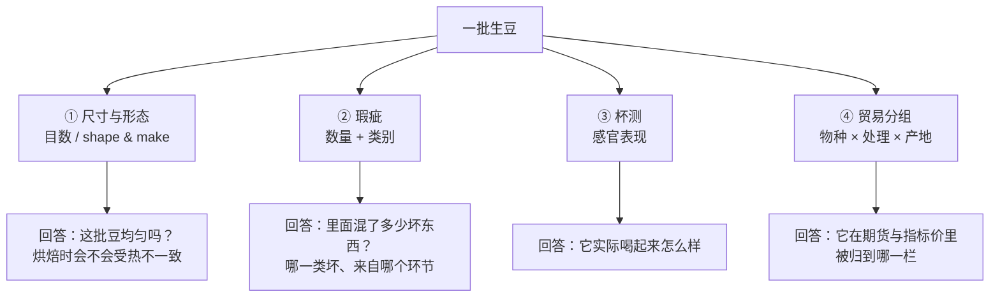
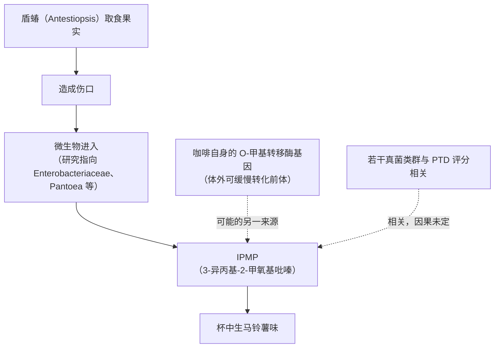

# 第 13 章 生豆分级与瑕疵：三套体系各自衡量什么

> **本章目标**：回答一个每天都在发生、却几乎没人拆开过的问题——
> **当有人说这支豆"等级高"时，他到底在说哪一件事？**
>
> 答案是：**至少三件，而且它们互不等价。**
> 目数量的是**尺寸的一致性**，瑕疵计数量的是**坏东西的数量**，杯测分量的是**杯中的表现**。
> 再加上一层多数人没意识到的：**国际贸易的第一层分类，既不是杯测分也不是瑕疵数，
> 而是"物种 × 处理法 × 产地"的四个组**。
>
> 这一章还会完整拆一个缺陷的因果链——**马铃薯味缺陷**，
> 它从一只虫开始，经过微生物，落到一个具体分子上，
> 是本书目前最完整的"从田间到杯中"的证据链。
>
> 本章 🅐 部分只需要一小把熟豆和一张白纸。

## 13.1 四套体系，一张图

> **四套体系互不等价，这是本章最重要的一句话。**
> 一批豆可以**目数很大但瑕疵很多**，
> 也可以**瑕疵计数合格但杯测平庸**，
> 还可以**杯测很好却因为豆型小而在某些市场卖不上价**。
>
> 所以"等级"这个词单独出现时，信息量接近零——**必须问是哪一套**。

## 13.2 第一套：目数（screen size）——它量的是一致性

[**目数**](../../glossary.md#screen-size)是用带圆孔的筛板筛豆，看**多大比例的豆能被某个孔径截留**。

孔径的单位是 **1/64 英寸**：一篇描述埃塞俄比亚商品交易所（ECX）实验室流程的研究写得很明确——
"screen-size holes of 14（**1/64 inch of 14**）"，记录的是
**被 14 号筛孔截留在上方的豆子百分比**[^1]。

同一篇还给出了一条可核对的**国家分级要求**：按埃塞俄比亚的咖啡分级体系，
**超过 85% 的豆必须达到 14 目**才符合标准要求[^1]。

| 项 | 内容 |
|----|------|
| 测的是什么 | **豆的尺寸分布**（不是单颗大小） |
| 怎么记录 | 某目数筛上的**截留百分比** |
| 一个实例 | ECX 实验室用约 **300 g** 生豆样评估目数、形状与制作、颜色与气味[^1] |
| 一个国家门槛 | 埃塞俄比亚：**>85% 达到 14 目**[^1] |
| 该研究测到的变异 | 30 个基因型 × 3 个地点：**基因型、地点与两者的交互作用对目数都有极显著影响**（p < 0.01）[^1] |

**为什么烘焙商在意目数**：那篇研究把理由说得很直接——
**豆型的均匀性可以避免小颗粒被烤焦**[^1]。

> **所以目数的真正含义是"一致性"，不是"大就好"。**
> 一批全部集中在 15~16 目的豆，比一批 13~18 目混着的豆好烘得多，
> **哪怕后者的平均尺寸更大**。
>
> 这也是[第 12 章 Q9](../../qa/12-drying-storage-qa.md#q9) 那条主线的延续：
> **上游的各种指标，本质上都在给"均匀程度"打分。**

顺带回到[第 6 章](06-species-varieties.md)：品种目录里"**豆粒大小（Bean Size）**"
本身就是一个**品种字段**[^2]——
也就是说，目数**首先是遗传的**，其次才受环境与管理影响，
这与上面"基因型效应极显著"的观测一致[^1]。

[^1]: 本书编号 [GR1]：Gebreselassie、Tesfaye、Gedebo & Tolessa (2024), *Heliyon* 10(14):e34378（PMCID PMC11305185，开放获取）。本书已读全文相关章节（方法与结果）。
[^2]: 本书编号 [G5]：World Coffee Research《Varieties Catalog》（第 6 章已登记，2026-09 核对）。

## 13.3 第二套：瑕疵——它量的是"混进来多少坏东西"

[瑕疵分级](../../glossary.md#defect-count)的基本逻辑是：**在规定重量的样品中，按类别数出瑕疵豆与异物的数量**，
再按类别的严重程度折算。各体系的类别名称与折算规则不同，
但**"数数 + 加权"这个结构是共通的**。

### 瑕疵不是一个词，是一组互不相同的东西

三项化学研究说明了"瑕疵"内部的差异有多大：

| 研究 | 做了什么 | 主要发现 |
|------|---------|---------|
| ¹H qNMR 定量[^3] | 比较**酸豆、黑豆、霉豆**与正常豆 | 瑕疵豆的**糖与脂质更低、乙酸更高**；水溶性部分比油相更适合用于判别；支持向量机能较好区分掺混比例 |
| LC-HRMS 酰基奎宁酸谱[^4] | 分析 **10 类**瑕疵生豆 | 共鉴定 **37 种**酰基奎宁酸；**全黑、部分黑、虫蛀、萎缩、浮豆**五类的酰基奎宁酸含量显著**高于**正常豆；其中黑、虫蛀、萎缩三类抗氧化能力更强 |
| 挥发物指纹[^5] | 对罗布斯塔 **12 类**瑕疵做 GC-MS 轮廓分析 | 共鉴定 42 种挥发物；PCA 第一主轴是"**豆 vs 非豆**"的区分；层次聚类分出三大簇；部分标记物在商业级未分选样品中仍可检出 |

> **三条要点**：
>
> 1. **"瑕疵豆"内部的化学差异很大**——黑豆、酸豆、虫蛀、浮豆不是同一类问题，
>    它们来自不同环节（采收、发酵、虫害、干燥），因此**指向不同的上游责任人**；
> 2. **有些瑕疵在某些指标上"更高"而不是"更低"**：
>    例如几类瑕疵豆的酰基奎宁酸含量**高于**正常豆[^4]。
>    **"瑕疵 = 什么都少"是错的**——它们是**不同**，不只是**更差**；
> 3. **最大的方差来源可能是"是不是豆"**[^5]——石头、树枝、果壳这类异物与瑕疵豆是两回事，
>    这提醒我们瑕疵计数里混了两种性质不同的东西。

### 机器视觉正在接管数数这件事

一项基于改进 YOLOv10 的研究，在一个覆盖**七个瑕疵类别**的数据集上做自动检测，
报告 **mAP@50 为 99.2%**、精确率 98.5%、召回率 98.8%、单次推理 **2.0 ms**[^6]。

> **怎么读这个数字**（两条）：
>
> 1. **它说明"数瑕疵"这件事高度可自动化**——
>    因为瑕疵的判据是**外观上的**，而外观正是视觉模型最擅长的；
> 2. **但它不能替代杯测**。它检测的是**已被人类定义好的类别**，
>    准确率高只意味着"它学会了人怎么分类"，
>    **不意味着这些类别与杯中表现的关系被解决了**——那是另一个问题（§13.5）。

[^3]: 本书编号 [GR2]：Hu、Quan、Dai & Qiu (2024), *Current Research in Food Science* 9:100870（PMCID PMC11472107，开放获取）。已读摘要。
[^4]: 本书编号 [GR3]：Kim & Kim (2025), *Food Chemistry: X* 28:102506（PMCID PMC12133709，开放获取）。已读摘要。
[^5]: 本书编号 [GR4]：Bastian 等 (2026), *Food Chemistry* 523:150212（PMID 42365769）。已读摘要。
[^6]: 本书编号 [GR11]：Hong 等 (2026), *Current Research in Food Science* 13:101461（PMCID PMC13276431，开放获取）。已读摘要。

## 13.4 一个完整的因果链：马铃薯味缺陷

本书到目前为止，**唯一一条能从田间一路追到具体分子的缺陷链**，是东非咖啡的
[**马铃薯味缺陷**](../../glossary.md#ptd)（potato taste defect, PTD）——也叫 "peasy" 缺陷。

逐段看证据：

**① 虫 → 伤口 → 表面与内部的化学指纹**

一项 GC-MS 研究比较了 PTD 与非 PTD 生豆的**表面**与**内部**挥发物[^7]：

- 区分两者的**表面挥发物**轮廓由**十三烷、十二烷、十四烷**主导；
- **IPMP 不在表面挥发物中，而在豆的内部挥发物中被检出**；
- 把干燥的盾蝽本身拿去做 GC-MS，**最主要的三种挥发物恰好也是十三烷、十二烷、十四烷**；
- 有肉眼可见虫害的豆，**同时**表现出 PTD 的表面轮廓与内部的 IPMP。

> 这是一条设计得很漂亮的证据：**表面指纹指向虫，内部分子指向缺陷**，
> 两者在同一批豆上同现。

**② IPMP 是不是"那个"分子**

一项对烘焙后东非阿拉比卡的定量研究[^8]：把样品按无异味、轻、中、强分为四档，

- **IPMP 能区分缺陷与非缺陷样品，IBMP（异丁基）不能**；
- 缺陷样品的 IPMP 浓度跨度很大：**1.6~529.9 ng/g**；
  除一个样品外，缺陷样品的 IPMP 都高于非缺陷样品的平均值（**2.0 ng/g**）；
- IPMP 浓度在不同异味强度档之间有显著差异（p < 0.05）；
- 另有 21 种分析物的浓度随缺陷强度显著变化——**与异味强度正相关的多为气味不愉快的物质，
  与愉快香气相关的物质则负相关**。

**③ 一个重要的反直觉发现：虫害不是充分条件**

另一项研究在**优质**生豆（阿拉比卡与罗布斯塔、多个产地）中测定了三种甲氧基吡嗪[^9]：

- **三种甲氧基吡嗪在所有样品中都能检出**——也就是说，
  **它们本身不是"缺陷特有物质"，而是正常存在、只在浓度过高时成为问题**；
- 在"疑似 PTD"与**虫蛀样品**中，**IPMP 是主要的缺陷指示物**；
- 但虫蛀样品的 IPMP 浓度**变异很大**，作者据此提出：
  **虫害造成的损伤并不是引发这一异味的充分条件**；
- 顺带：研究者去测了**新鲜马铃薯**，其中甲氧基吡嗪浓度**很低**——
  "马铃薯味"这个命名更可能来自 IPMP 在总量中的**相对占比**，
  而不是因为咖啡里出现了马铃薯的特征物质。

**④ 微生物侧与植物侧的两个候选来源**

- 卢旺达的一项分离鉴定研究报告，与马铃薯气味相关的细菌包括
  **肠杆菌科与 *Pantoea***，并指出**马铃薯气味主要出现在受损的浮豆与人工挑出的受损豆上**[^10]；
- 另一项用高通量测序分析卢旺达 PTD 咖啡的真菌群落，发现 6 个高丰度 ASV 与杯测评分相关，
  其中 4 个（*Aspergillus versicolor*、*Penicillium cinnamopurpureum*、*Talaromyces radicus*、
  *Thermomyces lanuginosus*）**负相关**（可能致病），2 个（*Kazachstania humilis*、
  *Clavispora lusitaniae*）**正相关**（可能抑制）[^11]。作者自己写明这是**首次**对 PTD 相关真菌的刻画，
  给出的是**候选**，不是定论；
- 还有一项从**植物自身**找来源：在咖啡基因组里筛出与已知羟基吡嗪 O-甲基转移酶高度同源的基因，
  表达出的一种酶**能够缓慢地**把相应前体转化为 IPMP/IBMP，
  作者据此认为**咖啡植株本身也可能参与其中**[^12]。

> **这条链给读者的三个启发**：
>
> 1. **"这支豆有缺陷"是可以被追责到具体环节的**——
>    而追责的前提是**有人做了从田间到分子的完整工作**；
> 2. **单一原因往往不成立**：虫害是必要条件之一但不充分[^9]，
>    微生物与植物自身都是候选来源[^10][^11][^12]。
>    这与[第 8 章](08-pests-and-renewal.md)"单因素归因不成立"的结论一致；
> 3. **缺陷物质常常是"本来就有、浓度过高才成问题"**[^9]——
>    这个模式在咖啡里会反复出现（第 37 章讲瑕疵风味时会再遇到）。

[^7]: 本书编号 [GR5]：Jackels 等 (2014), *J. Agric. Food Chem.* 62(42):10222–10229（PMID 25284290）。已读摘要。
[^8]: 本书编号 [GR7]：Cain 等 (2021), *J. Agric. Food Chem.* 69(7):2253–2261（PMID 33566609）。已读摘要。
[^9]: 本书编号 [GR6]：Mutarutwa 等 (2020), *J. Agric. Food Chem.* 68(17):4743–4751（PMID 31838839）。已读摘要。
[^10]: 本书编号 [GR9]：Ndayambaje 等 (2019), *Food Science & Nutrition* 7(1):287–292（PMCID PMC6341129，开放获取）。已读摘要。
[^11]: 本书编号 [GR8]：Hale 等 (2022), *Botanical Studies* 63(1):17（PMCID PMC9127006，开放获取）。已读摘要。
[^12]: 本书编号 [GR10]：Frato (2019), *J. Agric. Food Chem.* 67(1):341–351（PMID 30523690）。已读摘要。

## 13.5 第三套：杯测——以及一张把两者合起来的表

多数人以为物理分级与杯测是两回事。**在一些国家的体系里，它们是同一张表。**

那项埃塞俄比亚研究记录的 ECX 评估表结构如下（由三位认证 Q-Grader 独立评分）[^1]：

| 部分 | 项目与满分 |
|------|----------|
| **生豆物理特征** | 形状与制作 **15** · 颜色 **15** · 气味 **10** |
| **杯中品质** | 香气质量 **5** · 香气强度 **5** · 酸度 **10** · 涩感 **5** · 苦味 **5** · body **10** · 风味 **10** · 整体品质 **10** |

也就是说：**在这套体系里，杯子还没端起来，已经有 40 分定下来了。**
颜色的档次为 bluish(15) > greyish(12) > greenish(10) > coated(8) > faded(6) > white(4)；
气味的档次为 clean(10) > fair clean(8) > trace(6) > light(4) > light moderate(2) > strong(0)[^1]。

> **诚实说明（很重要）**：本书**只复述该学术论文所记录的评估表结构与档位名称**，
> 用来说明"物理与感官被合并计分"这一事实。
> 它**不是**任何机构的官方文件，本书也**不复制任何官方杯测表的条文与分值版式**
> （见[出处与资料登记 §一](../../standards.md)的版权红线）。
> 需要现行规则请向相应机构获取。

这套体系还给出了一个可核对的观察：在 30 个基因型 × 3 个地点的试验中，
**基因型、地点及两者的交互作用**对几乎所有性状（含目数、颜色、杯测各项）都有显著影响，
且主成分分析中**风味与目数**是第二主成分上贡献最大的两个变量[^1]。

> **翻译成买豆时的话**：**"同一个品种在不同地方，物理分级与杯测都会变。"**
> 这是[第 7 章](07-growing-environment.md)"基因型 × 环境"在分级表上的直接体现。

### 物理指标与杯测分之间有关系吗

有，但要看清它是**相关**而非**判据**。[第 9 章](09-harvest-ripeness.md)引用的采收期研究发现：
瑕疵率、千粒重、生豆尺寸这些**物理指标**，与脂质、蛋白质、绿原酸、咖啡因、葫芦巴碱这些
**化学指标**以及**杯测分**之间存在高相关[^13]。

> **但相关不是等价**：
> 目数大的豆不一定好喝，瑕疵少的豆也可能平淡。
> **物理分级筛掉的是"明显的坏"，它保证的是下限，不是上限。**
> 这正是为什么三套体系必须并存。

[^13]: 本书编号 [R2]：Huang 等 (2025), *Foods* 14(17):3135（第 9 章已登记）。

## 13.6 第四套：贸易分组——世界市场的第一层分类不是分数

这是多数咖啡书不讲、但对理解价格极其重要的一层。

国际咖啡组织（ICO）发布的[**综合指标价（I-CIP）**](../../glossary.md#icip)，把世界咖啡分成**四个组**[^14]：

| 组 | 英文原名 | 它按什么分 |
|----|---------|-----------|
| 哥伦比亚温和型 | **Colombian Milds** | 产地 + 物种 + 处理法（水洗阿拉比卡） |
| 其他温和型 | **Other Milds** | 同上，其他产地的水洗阿拉比卡 |
| 巴西自然型 | **Brazilian Naturals** | **处理法**（日晒阿拉比卡） |
| 罗布斯塔 | **Robustas** | **物种** |

各组在综合指标价中的权重，依据 **2021—2023 年绿咖啡出口量**重新核定，
自 **2024 年 10 月 1 日**起生效[^15]：

| 组 | 权重 |
|----|------|
| Colombian Milds | **10.15%** |
| Other Milds | **20.48%** |
| Brazilian Naturals | **31.95%** |
| Robustas | **37.42%** |

（同一文件记载三年平均出口总量约 1.156 亿袋、每袋 60 kg[^15]。）

> **这张表值得盯一会儿，它说了三件事**：
>
> 1. **世界贸易的第一层分类，用的正是本书第 6、10 章的两个变量**：
>    **物种**（阿拉比卡 vs 罗布斯塔）与**处理法**（水洗 vs 日晒）。
>    你在豆袋上读到的那两个词，同时也是期货市场的分类轴；
> 2. **按出口量，罗布斯塔组的权重最大**（37.42%）。
>    精品语境里几乎不提的物种，在世界贸易中是最大的一块；
> 3. **这四组的指标价长期处于不同的水平**（ICO 每日公布[^14]）。
>    本书按纪律**不写具体价格数字**——它每天都在变；
>    要记住的是**结构**：**价格首先按"组"分层，然后才在组内按品质议价。**
>    第 43 章会把这条线接到"一杯咖啡的钱分给了谁"。

[^14]: 本书编号 [ICO1]：International Coffee Organization，*ICO Indicator Prices (I-CIP)* 日度数据表（本书 2026-09 取得）。
[^15]: 本书编号 [ICO2]：International Coffee Organization, Joint Committee 文件 *JC-03/24 Rev. 1*：ICO composite and group indicator prices: Share of markets and group weightings（2024-09-07，自 2024-10-01 生效）。本书已读全文。

## 13.7 标准在哪：一次诚实的交代

读到这里你可能会问：**为什么整章没有出现一个标准编号？**

因为本书核不到。两条核对记录：

1. **国际标准机构网站**：本轮（本书第三次尝试）访问其标准检索页，
   仍被站点防护层拦下（返回 403）。按[查证纪律](../../standards.md)，
   **核不到编号就一个都不写**——本章因此不引用任何标准编号；
2. **精品咖啡协会（SCA）的生豆标准**：本书 2026-09 复核其标准页，
   目前处于"**制定中（Standards in Development）**"一栏的是
   **SCA-110 Green Coffee: Grading, Specifications, and Test Methods (for the Purpose of Trading)**——
   也就是说，**核对当日尚未发布**[^16]。

> **这件事本身就是本章的一个结论**：
> **流传最广的那套"精品级生豆瑕疵表"，本书无法从一手来源核到其现行效力与版本**，
> 因此**不复述其中任何数字**（多少瑕疵算几级、多少含水率算合格）。
>
> 这不等于"那套表是错的"——它可能来自某个历史版本或某份行业文件。
> 本书能断言的只是：**核对当日，该机构的已发布标准清单里没有生豆分级标准，
> 它在制定中。** 这两句话的区别，正是本书一直在教的东西。
>
> 可靠的做法是：**要用就去查当时有效的原件**（贸易合同、出口国分级规则、协会现行标准），
> 而不是引用一张在社群里流传多年、没人说得清版本的表。

[^16]: 本书编号 [SCA2]：Specialty Coffee Association 标准页（本书 2026-09-13 核对）。见[出处与资料登记 §1.1](../../standards.md)。

## 13.8 补一笔欠账：浮豆

[第 9 章](09-harvest-ripeness.md)把"**[浮豆](../../glossary.md#floater)（floaters）都是坏豆**"列进了不采信清单，
理由是找不到支持"浮起 ⇒ 品质差"的可交叉验证研究。本轮查到了两条**部分相关**的证据：

| 证据 | 内容 |
|------|------|
| 化学侧[^4] | 在 10 类瑕疵生豆中，**浮豆（floater）**与全黑、部分黑、虫蛀、萎缩一起，酰基奎宁酸含量**显著高于**正常豆——也就是说，**浮豆在化学上确实与正常豆不同** |
| 缺陷侧[^10] | 卢旺达的分离研究指出，**马铃薯气味主要出现在受损的浮豆与人工挑出的受损豆上** |

> **本书更新后的表述**：
>
> - ✅ **浮豆在化学上与正常豆可区分**，并且在分级实践中被当作一个瑕疵类别[^4]；
> - ⚠️ **但"浮起 ⇒ 一定难喝"仍缺乏直接证据**——
>   本书**没有**读到"把浮豆挑出来单独杯测 vs 正常豆"的对照研究；
> - **还要注意一个混杂**：浮豆之所以浮，是因为**密度低**，
>   而密度低可能来自未熟、虫蛀、干燥过度、内部空腔等**完全不同的原因**。
>   "浮豆"是一个**按物理性质定义的集合**，不是一个成因类别——
>   这与 §13.3 的结论一致：**瑕疵类别内部差异很大。**
>
> [出处与资料登记 §七](../../standards.md)中该条已相应更新。

## 13.9 常见说法辨析

按本书约定标注**证据强度**：✅ 有共识 / ⚠️ 有争议 / ❌ 明确错误 / **缺乏证据**。

| 说法 | 判定 | 说明 |
|------|------|------|
| "这支豆等级高" | ⚠️ **信息不足** | 至少有四套互不等价的体系：目数、瑕疵、杯测、贸易分组。**不说是哪一套，等于没说** |
| "目数越大品质越好" | ⚠️ **混淆了大小与一致性** | 目数量的是**尺寸分布**；烘焙商在意它是因为均匀性可避免小颗粒被烤焦[^1]。且豆粒大小首先是**品种性状**[^2] |
| "瑕疵豆就是什么都少的坏豆" | ❌ **与测定不符** | 几类瑕疵豆的酰基奎宁酸**高于**正常豆[^4]；酸豆/黑豆/霉豆则糖与脂质更低、乙酸更高[^3]。**是"不同"，不只是"更差"** |
| "瑕疵计数能代表杯中表现" | ⚠️ **相关但不等价** | 物理指标与化学指标、杯测分之间确有高相关[^13]；但物理分级**保证的是下限，不是上限** |
| "机器视觉已经能替代杯测" | ❌ **两件事** | 视觉模型在**人已定义好的瑕疵类别**上表现优异（mAP@50 99.2%）[^6]，这说明外观分类可自动化，**不说明外观与杯中表现的关系被解决了** |
| "马铃薯味是因为混进了土/马铃薯" | ❌ **明确错误** | 它对应 **IPMP** 这一分子[^7][^8]；而**新鲜马铃薯中的甲氧基吡嗪浓度很低**[^9]，命名来自感知联想而非成分同源 |
| "有虫蛀就一定有马铃薯味" | ❌ **有直接反证** | 虫蛀样品的 IPMP 变异很大，作者明确指出**虫害损伤不是引发该异味的充分条件**[^9] |
| "马铃薯味是虫子造成的" | ⚠️ **只对了一段** | 证据链是：虫 → 伤口 → 微生物[^10] → IPMP[^7][^8]；真菌群落中有与评分相关的候选[^11]；**咖啡植株自身的酶也可能参与**[^12]。单因素归因不成立 |
| "甲氧基吡嗪是缺陷特有的物质" | ❌ **与测定相反** | 三种甲氧基吡嗪在**所有优质样品**中都能检出[^9]。**是浓度问题，不是有无问题** |
| "浮豆都是坏豆" | ⚠️ **部分更新（见 §13.8）** | 浮豆在化学上确与正常豆不同[^4]、且与马铃薯味的出现相关[^10]；但**本书仍未读到"浮豆 vs 正常豆"的盲测对照**，且浮豆是按密度定义的集合，成因混杂 |
| "生豆颜色能判断新鲜度" | ⚠️ **定义不足** | 分级量表里"蓝"是最高档[^1]，而长期储存也会出现特征性蓝绿色（[第 12 章](12-drying-storage.md)）。**需要色度学定义才能谈**，见[第 12 章 Q8](../../qa/12-drying-storage-qa.md#q8) |
| "精品级生豆的瑕疵上限是 X 个" | **缺乏证据（本书无法核到）** | 核对当日该协会的**已发布**标准清单中没有生豆分级标准，相应标准仍在**制定中**[^16]；国际标准机构网站三次核对均被拦截。**本书因此不复述任何具体阈值** |
| "罗布斯塔在世界上无足轻重" | ❌ **与贸易数据相反** | 按 2021—2023 年绿咖啡出口量核定的指标价权重中，Robustas 组为 **37.42%**，是四组中最大的一块[^15] |

## 13.10 🔎 买豆与冲煮时的用处

1. **听到"等级"先问哪一套**：目数？瑕疵？杯测分？还是产地分级名？
   四套互不等价，混着说通常意味着对方也没分清。
2. **把目数读成"一致性承诺"**：它对**烘焙**的意义远大于对风味的意义[^1]。
   如果一支豆的目数跨度很大，烘焙商需要更保守的曲线——这会影响你喝到的东西。
3. **看到明显的豆相不齐（大小、颜色、形状混杂），把它当上游信号**：
   它同时可能来自采收（[第 9 章](09-harvest-ripeness.md)）、
   发酵（[第 11 章](11-fermentation-experimental.md)）与干燥（[第 12 章](12-drying-storage.md)）。
4. **喝到"生马铃薯 / 生豌豆"味时，别先怪自己的冲煮**：
   这是一类**有明确分子对应**的上游缺陷[^7][^8]，冲煮救不回来。
   值得做的是：换一包同款验证是否批次性问题，并把观察反馈给卖家。
5. **理解价格时，先定位"组"再谈品质**：
   世界价格首先按物种与处理法分组[^14][^15]，然后才在组内议价。
   一支水洗阿拉比卡与一支罗布斯塔的价差，**大部分不是品质议价，而是分组差**。

## 13.11 思考题

1. 请说明"目数""瑕疵计数""杯测分""贸易分组"四套体系**各自回答什么问题**，
   并各举一个"它们互相不等价"的具体情形。
2. 目数量的是尺寸分布而不是单颗大小。请解释为什么**一致性**比**平均大小**对烘焙更重要，
   并把它与第 9、11、12 章的"不均匀"主线连起来。
3. 几类瑕疵豆的酰基奎宁酸含量**高于**正常豆。
   请说明这个结果为什么会让"瑕疵 = 成分更少"这句话站不住，
   并给出一个你认为更准确的表述。
4. 请完整复述马铃薯味缺陷的证据链，并指出链条上**哪一环是必要但不充分**的，
   以及支持这一判断的具体观测。
5. 研究者去测了新鲜马铃薯，发现其中的甲氧基吡嗪浓度很低。
   请说明这项"看似多余"的测定在论证中起了什么作用。
6. **【案例】** 一份生豆报价单写着：*"埃塞俄比亚 G1，17/18 目，
   含水率 10.5%，SCA 86 分。"* 请逐项说明每个字段属于哪一套体系、
   各自保证了什么、**没有**保证什么，并指出你最想追问的两个问题。
7. **【案例】** 一位烘焙商说："我们只买瑕疵率低于 X% 的豆，所以我们的豆一定好喝。"
   请指出这个推理的问题，并说明瑕疵分级**真正**保证的是什么。
8. **【辨识】** 请打开 ICO 官网，找到当前的四个组的指标价，
   记下当天的相对高低顺序（不必记具体数字）。
   然后回答：**这个顺序主要反映的是品质差异还是分类差异？**
   你会用什么证据支持你的判断？
9. 本章说"核不到标准编号就一个都不写"。
   请说明这条纪律在本章具体放弃了哪些内容，
   以及为什么放弃它们比"写一个大概正确的数字"更好。

> 📖 **参考答案**（想清楚再看）：[Q1](../../qa/13-green-grading-qa.md#q1) ·
> [Q2](../../qa/13-green-grading-qa.md#q2) · [Q3](../../qa/13-green-grading-qa.md#q3) ·
> [Q4](../../qa/13-green-grading-qa.md#q4) · [Q5](../../qa/13-green-grading-qa.md#q5) ·
> [Q6](../../qa/13-green-grading-qa.md#q6) · [Q7](../../qa/13-green-grading-qa.md#q7) ·
> [Q8](../../qa/13-green-grading-qa.md#q8) · [Q9](../../qa/13-green-grading-qa.md#q9)

## 13.12 本章实操

### 🅐 无器具版 · 任务一：给豆袋上的"等级字段"归类

把你手上豆袋（或详情页）出现的所有"等级类"字样抄下来，逐个归类：

| 原文字样 | 属于哪一套？（目数/瑕疵/杯测/贸易分组/说不清） | 它保证了什么 | 它**没**保证什么 |
|---------|----------------------------------------|------------|----------------|
| | | | |
| | | | |
| | | | |

> **参考**：像"G1""AA""SHB""Supremo"这类**产地分级名**，
> 通常是**多个指标的打包缩写**（可能含目数、瑕疵、海拔），
> 且**各国规则不同**。遇到它们时，正确的动作是**去查该国当年的规则**，
> 而不是套用另一国的含义。

### 🅐 无器具版 · 任务二：用一小把熟豆做一次"一致性目测"

不需要生豆。取 **50 颗**熟豆倒在白纸上：

| 观察项 | 记录 |
|-------|------|
| 明显偏小的有几颗？ | ____ / 50 |
| 颜色明显偏浅或偏深的有几颗？ | ____ / 50 |
| 形状异常（碎、贝壳形、畸形）的有几颗？ | ____ / 50 |
| 有没有明显发黑、虫蛀孔、异物？ | |
| **你的总体印象：这批豆整齐吗？** | |

> **两条读表纪律**：
> ① **这不是瑕疵分级**——正式分级用的是**生豆**、规定样重与规定类别；
>   熟豆的颜色差异还混入了烘焙不均；
> ② **它的用途是训练你的"一致性眼光"**。
>   连续对三四包不同价位的豆做一次，你会发现**整齐程度的差别比你以为的大**，
>   而这正是第 9、11、12 章所有上游努力的可见结果。

### 🅐 无器具版 · 任务三：查一次 ICO 的四组指标价

打开 ICO 官网的指标价页面，记录**当天**四个组的相对高低，并回答：

| 问题 | 你的回答 |
|------|---------|
| 四组从高到低的顺序是？ | |
| 哪一组最低？ | |
| 这个顺序更像是"品质排序"还是"分类排序"？ | |
| 如果某天某一组大涨，你会先怀疑什么原因？ | |

> **提示**：分组的依据是**物种 × 处理法 × 产地**[^14]，不是杯测分。
> 所以组间差价里混着**物种差异、处理法差异、产地供给与物流**等多个因素。
> 把它读成"某种咖啡更好喝"是典型的误读——**第 43 章会把这条线讲完**。

### 🅑 有条件版 · 任务四：自己做一次"挑豆对照"（备齐后再做）

> **所需器具**：一包**没有精挑过**的豆（中低价位、量大的口粮豆最合适）；
> 白纸；秤（可选）；同一套冲煮器具；**一位帮你编号的同伴**。
> **替代方案**：没有同伴，就自己把两杯都冲好、贴上背面编号后打乱再喝。

1. 从同一包豆里取两份等量的豆；
2. 一份**逐颗挑掉**明显异常的（发黑、碎裂、极浅色、虫蛀、异物），另一份**原样不动**；
3. 记录挑出来的比例：____%；
4. 用**完全相同的参数**分别冲煮，盲测比较。

| 观察项 | 挑过的那杯 | 没挑的那杯 |
|-------|----------|-----------|
| 干净度（有无杂味） | | |
| 苦/涩强度 | | |
| 甜感 | | |
| 尾韵是否清晰 | | |
| 盲测能分辨吗（三轮） | ____ / 3 | |

> **这个实验的价值与边界**：
> - **价值**：它让你亲手验证"**挑豆有没有用**"，而不是接受别人的断言。
>   本书没有读到"家庭手工挑豆对杯中表现影响"的对照研究，
>   所以**你的结果对你自己是新证据**；
> - **边界**：样本只有一包、冲煮者是你自己、盲法也是最简版本。
>   结论只能写成"**在这包豆上，我三轮中有 N 轮能分辨**"，
>   不能写成"挑豆一定有用/没用"。
>
> 顺带记下挑出来的**比例**——这个数字对判断这包豆的上游把控，
> 比任何"等级"字样都直接。

### 🅑 有条件版 · 任务五：给缺陷做一次"追责演练"（备齐后再做）

> **所需器具**：一支你喝出明显异常的豆（放心，迟早会遇到）；
> [杯测记录表](../../forms/cupping-sheet.md)；纸笔。
> **替代方案**：用你过去的记录回溯做一次。

| 步骤 | 要写下的内容 |
|------|------------|
| 1 描述 | 尽量具体：是"生马铃薯/生豌豆"？"发酵过头/醋"？"霉/土"？"纸/木"？ |
| 2 定位环节 | 用本章与第 9~12 章的链条，列出**至少两个**可能的上游环节 |
| 3 排除自己 | 换参数、换水、换器具各试一次，确认不是冲煮问题 |
| 4 验证批次 | 换同款另一包 / 请朋友冲一次，确认是不是批次性的 |
| 5 反馈 | 把 1~4 的记录发给卖家（不是投诉，是信息） |

> **为什么第 5 步重要**：一份写清楚"**什么味道、什么参数、是否批次性**"的反馈，
> 对烘焙商的价值远高于"这豆不好喝"。
> 而且它会倒逼你把描述写准——**这正是第六部分（杯测与感官）要练的能力。**

---

## 13.13 本章依据

完整书目信息登记在[出处与资料登记 §4.16](../../standards.md)。

- **[GR1]** Gebreselassie 等 (2024), *Heliyon* 10(14):e34378（开放获取）。本章 §13.2、§13.5 主干：
  目数以 **1/64 英寸**为单位（14 号筛 = 14/64 英寸），记录截留百分比；ECX 实验室用约 300 g 生豆样；
  埃塞俄比亚分级要求 **>85% 达到 14 目**；生豆物理特征（形状与制作 15、颜色 15、气味 10）
  与杯中品质（香气质量 5、香气强度 5、酸度 10、涩感 5、苦味 5、body 10、风味 10、整体 10）
  合并计分；颜色与气味的档位名；30 个基因型 × 3 地点下基因型、地点与交互作用均显著；
  豆型均匀性可避免小颗粒被烤焦。**已读全文相关章节。**
- **[GR2]** Hu 等 (2024), *Curr. Res. Food Sci.* 9:100870（开放获取）。用到：酸豆/黑豆/霉豆的
  ¹H qNMR 表征——糖与脂质更低、乙酸更高；水溶性部分比油相更适合判别。已读摘要。
- **[GR3]** Kim & Kim (2025), *Food Chemistry: X* 28:102506（开放获取）。用到：10 类瑕疵生豆中
  共鉴定 37 种酰基奎宁酸；**全黑、部分黑、虫蛀、萎缩、浮豆**的含量显著高于正常豆。已读摘要。
- **[GR4]** Bastian 等 (2026), *Food Chemistry* 523:150212。用到：罗布斯塔 **12 类**瑕疵的挥发物轮廓；
  42 种挥发物；PCA 解释 57.8% 方差，第一主轴为"豆 vs 非豆"；标记物在商业级样品中仍可检出。已读摘要。
- **[GR11]** Hong 等 (2026), *Curr. Res. Food Sci.* 13:101461（开放获取）。用到：改进 YOLOv10 在
  七类瑕疵数据集上 mAP@50 99.2%、精确率 98.5%、召回率 98.8%、推理 2.0 ms。已读摘要。
- **[GR5]** Jackels 等 (2014), *JAFC* 62(42):10222–10229。用到：PTD 豆的**表面**挥发物由十三/十二/十四烷
  主导且与盾蝽体内最主要的三种挥发物一致；**IPMP 出现在豆的内部挥发物中**；
  有可见虫害的豆同时具备两者。已读摘要。
- **[GR7]** Cain 等 (2021), *JAFC* 69(7):2253–2261。用到：IPMP 可区分缺陷与非缺陷、IBMP 不能；
  缺陷样品 IPMP 1.6~529.9 ng/g、非缺陷平均 2.0 ng/g；浓度随异味强度显著不同；
  另有 21 种分析物随强度变化。已读摘要。
- **[GR6]** Mutarutwa 等 (2020), *JAFC* 68(17):4743–4751。本章最重要的一条反直觉证据：
  三种甲氧基吡嗪在**所有优质样品**中均可检出；IPMP 是主要缺陷指示物；
  **虫害损伤不是引发异味的充分条件**；新鲜马铃薯中甲氧基吡嗪浓度很低。已读摘要。
- **[GR9]** Ndayambaje 等 (2019), *Food Sci. Nutr.* 7(1):287–292（开放获取）。用到：
  卢旺达咖啡中与气味相关的细菌（肠杆菌科、*Pantoea*）；**马铃薯气味主要出现在受损浮豆
  与人工挑出的受损豆上**。已读摘要。
- **[GR8]** Hale 等 (2022), *Botanical Studies* 63(1):17（开放获取）。用到：
  6 个高丰度真菌 ASV 与杯测评分相关（4 负、2 正）；作者自述为首次刻画、给出的是**候选**。已读摘要。
- **[GR10]** Frato (2019), *JAFC* 67(1):341–351。用到：咖啡自身的羟基吡嗪 O-甲基转移酶同源基因，
  表达出的酶能缓慢转化相应前体，提示植株本身可能参与 IPMP/IBMP 的产生。已读摘要。
- **[ICO1][ICO2]** ICO 指标价日度数据表与 Joint Committee 文件 JC-03/24 Rev. 1。用到：
  四个组的划分（Colombian Milds / Other Milds / Brazilian Naturals / Robustas）；
  依 2021—2023 年绿咖啡出口量核定、自 2024-10-01 生效的组权重
  （10.15% / 20.48% / 31.95% / 37.42%）与三年平均出口总量约 1.156 亿袋（60 kg/袋）。**已读全文。**
- **[SCA2]** SCA 标准页（2026-09-13 核对）：**SCA-110 Green Coffee: Grading, Specifications,
  and Test Methods (for the Purpose of Trading)** 列在"制定中"一栏，**核对当日尚未发布**。
- **[G5]**（第 6 章已登记）用到："豆粒大小"是品种目录中的**品种字段**。
- **[R2]**（第 9 章已登记）用到：瑕疵率、千粒重、生豆尺寸等物理指标与化学指标、杯测分高度相关。

**本章刻意没写的东西**：

- **任何标准编号**——国际标准机构网站第三次核对仍被拦截（[出处登记 §二](../../standards.md)）；
- **"精品级"的瑕疵上限、含水率上限等具体阈值**——相应协会标准仍在制定中[^16]，
  流传的版本无法核到效力与版本号；
- **任何官方杯测表的条文与分值版式**——版权红线。§13.5 只复述学术论文所记录的
  某国交易所评估表结构，并已注明其性质；
- **各产国分级名（G1、AA、SHB、Supremo 等）的具体规则**——各国不同且会变，
  本书只教"去查当年规则"的方法，留到第 14 章讲产区时给查证入口；
- **具体价格数字**——只写分组结构与权重（后者有正式文件且标注了生效日期）；
- **"浮豆一定难喝"**——仍未读到盲测对照，只更新到"化学上可区分"这一层。

---

**下一章**：第 14 章 产区地图——把地名挂回品种 + 处理法 + 海拔。
第二部分的最后一章，会把第 6~13 章的所有变量重新组装成一张可查的表；
之后就是**项目 P2**：用控制变量的方式，亲手买三支豆做一次对照。
