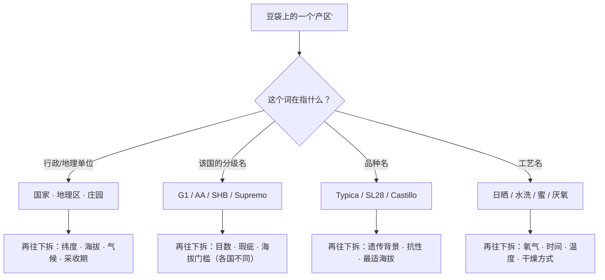
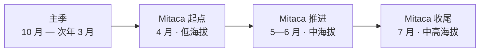

# 第 14 章 产区地图：把地名拆回它的自变量

> **本章目标**：拆掉全书最顽固的一个习惯——**看到地名就想起一串形容词**。
>
> "耶加雪菲＝柑橘花香""曼特宁＝醇厚草本""哥伦比亚＝均衡"——
> 这类对应被印在无数张豆袋上，但它们**不是产地的性质**，
> 而是"品种 × 海拔 × 处理法 × 采收期 × 烘焙"这一串变量的**打包缩写**，
> 而且这串变量在同一个地名底下**每年都在变**。
>
> 这一章不给你一张"产区风味对照表"——**本书查不到能支撑那种表的证据**。
> 它给你三样更耐用的东西：
> ① 世界咖啡的**数量骨架**（谁产多少、什么时候产、按什么口径统计）；
> ② 一个**把地名拆成六个可查字段**的拆解法；
> ③ "**产地指纹到底能不能被测出来**"这个问题的实验现状——
>    答案比两边的极端说法都更有意思。
>
> 这是第二部分的最后一章。学完它，你手里就有了读懂一张生豆报价单和一张豆袋标签的全套工具，
> 接着就可以做[项目 P2](project-P2-processing-comparison.md)：亲手做一次控制变量的对照。

## 14.1 "产区"这个词，同时在说四种不同的东西

先做一次词义分类。下面这些字样经常并排出现在同一张豆袋上，读者很容易把它们当成同一类信息：

| 豆袋上的字样 | 它其实是 | 在本书哪一章讲过 |
|------------|---------|----------------|
| 埃塞俄比亚、哥伦比亚、云南 | **国家**（统计与贸易的基本单位） | 本章 |
| 耶加雪菲、Tarrazú、Huehuetenango | **地理区**（有时也是法定或习惯的产区名） | 本章 |
| G1、AA、SHB、Supremo | **该国的分级名**（打包了目数/瑕疵/海拔等指标） | [第 13 章](13-green-grading.md) |
| Typica、Bourbon、SL28、Castillo | **品种** | [第 6 章](06-species-varieties.md) |
| 日晒、水洗、厌氧 | **处理法** | [第 10](10-processing-basics.md)、[11 章](11-fermentation-experimental.md) |
| Colombian Milds、Brazilian Naturals | **贸易分组**（物种 × 处理法 × 产地） | [第 13 章](13-green-grading.md) |

> **本章的第一条纪律**：**遇到"产区"两个字，先问它属于上表哪一行。**
> 这不是咬文嚼字——四类词的**可核对程度完全不同**：
> 国家与地理区是事实，分级名要查该国当年规则，品种名可能是误标（[第 6 章](06-species-varieties.md)），
> 处理法术语则没有统一定义（[第 11 章](11-fermentation-experimental.md)）。

## 14.2 数量骨架：世界咖啡的四个区与两个物种

先看规模。国际咖啡组织（ICO）在其月度市场报告中给出的最新一轮供需数据是这样的[^1]：

| 项 | 2024/25 咖啡年 | 2025/26 咖啡年（估计） |
|----|---------------|----------------------|
| 世界总产量 | **175.9** 百万袋（+2.5%） | **183.6** 百万袋（+4.4%） |
| 其中阿拉比卡 | 101.6 | **104.4** |
| 其中罗布斯塔 | 74.4 | **79.2** |
| 世界消费量 | **182.2** 百万袋（+4.3%） | 180.6（估计 −0.8%） |

（"袋"指 60 kg 袋，下同。）

**区域分布**（2025/26 估计）[^1]：

| 区域 | 占世界产量 |
|------|-----------|
| 南美 | **45.8%** |
| 亚洲与大洋洲 | **29.7%** |
| 非洲 | **13.6%** |
| 加勒比、中美与墨西哥 | **10.8%** |

> **这组数字里有三件值得记住的事**：
>
> 1. **罗布斯塔不是配角**：按产量，它占 2025/26 估计值的约 **43%**（79.2 / 183.6）。
>    这与[第 13 章](13-green-grading.md)按出口量核定的指标价权重（Robustas 组 37.42%）方向一致——
>    **两套独立口径都指向同一结论**：精品语境里几乎不提的物种，在世界供给里是接近一半的一块；
> 2. **产量与消费量是同一个量级，缓冲很薄**：ICO 记录 2021/22 至 2024/25 **连续四个咖啡年赤字**，
>    2025/26 才预计出现约 **300 万袋**的盈余[^1]。这解释了为什么天气新闻能立刻反映到价格上；
> 3. **"世界最大产区"是南美，不是非洲**——尽管咖啡的起源地在非洲。
>    产量分布是**历史与产业的结果**，不是植物学的结果（[第 6 章](06-species-varieties.md)的传播史）。

## 14.3 统计口径：为什么"某国产量"这句话需要先问三个问题

这一节是本章最容易被跳过、却最能防止误读的一节。

ICO 在其报告的说明页里写得非常清楚[^1]：

- 它做全球平衡表时用的是[**咖啡年（coffee year）**](../../glossary.md#coffee-year)，即**每年 10 月 1 日**开始的销售年度；
- 但各生产国的[**作物年（crop year）**](../../glossary.md#crop-year)不同，目前使用的作物年起点有三个：
  **4 月 1 日、7 月 1 日、10 月 1 日**；
- 所以它必须**按各国的收获月份把作物年数据换算到咖啡年**。
  报告举的例子是巴西：巴西 2022/23 作物年从 2022-04-01 到 2023-03-31，
  只覆盖咖啡年 2022/23 的前半段，因此换算时要把两个作物年的产量**各切一部分**拼进同一个咖啡年；
- 最关键的一句（原文的诚实说明）：这些按咖啡年做出的**国别**估计，
  目的是拼出一张口径一致的全球平衡表，**"并不代表各国境内实际发生的产量"**[^1]。

> **所以"某国去年产了 X 百万袋"这句话，至少要问三个问题**：
>
> 1. **哪个"年"**？咖啡年还是作物年？两者可以错开半年；
> 2. **哪种咖啡**？绿咖啡、还是折算后的速溶与烘焙咖啡（ICO 另有换算系数规则）；
> 3. **谁报的**？ICO 的数据来自成员国申报，缺失或不一致时由秘书处用其他来源补充[^1]。
>
> 这与[第 12 章](12-drying-storage.md)"读到含水率先问基准"、
> [第 9 章](09-harvest-ripeness.md)"读到出品比先问怎么算的"是同一条纪律：
> **数字本身没有意义，口径才有。**

## 14.4 采收期：为什么"新豆"在不同产区不是同一个月

对买豆的人来说，比产量更有用的是**日历**。而日历的第一课是：
**同一个国家里，采收期本身就跟着海拔走。**

ICO 对哥伦比亚的描述给了一个可核对的例子[^1]：

- 哥伦比亚有**两个收获季**：**主季在 10 月至次年 3 月**；
- 之后是被称为 [**Mitaca（fly crop）**](../../glossary.md#mitaca)的副季，**从 4 月开始于低海拔产区，
  一路推进到 7 月的中高海拔产区**。

> **这张小图把第 7 章的机理接到了日历上**：
> 海拔通过温度改变果实发育速度（[第 7 章](07-growing-environment.md)），
> 于是**同一个国家、同一个副季，低海拔比高海拔早三个月成熟**。
>
> **买豆时的用处**：当你看到"产季 2025/26"这类字样，它可能指作物年、可能指咖啡年、
> 也可能指该庄园的实际采收月份。**有意义的字段是"采收月份 + 到港/烘焙日期"**，
> 而不是年份区间。

同一份报告还展示了这条链条的另一端：哥伦比亚的**出口量与产量**在
2010/11—2024/25 之间相关系数高达 **98%**[^1]——
也就是说，产地的气候事件会**几乎同步**地传到出口量上，只是延迟了几个月。

> **一个反向的例子（避免把相关读成必然）**：同一份报告指出，
> 乌干达在 2024/25 咖啡年出口 **826 万袋**创纪录，而此前四年的年均出口为 **622 万袋**、
> 此前最高为 2020/21 的 650 万袋；报告把创纪录归因于产量提高**与高价刺激下的库存释放**，
> 并提醒随后的同比下滑"更应被解读为从异常高基数的**正常化**"[^1]。
> **出口量 ≠ 当年产量**——中间隔着库存决策，而库存决策受价格驱动。

## 14.5 同一个品种放到四个国家，会发生什么

现在回到那个核心问题：**产地本身到底贡献了什么？**

要回答它，理想的实验是：**同一个品种、同一种处理法、同一套烘焙，只换地点。**
本书检索到一项设计方向正确、但**混杂没有控制干净**的研究，值得完整拆给读者看[^2]：

| 项 | 内容 |
|----|------|
| 设计 | **同一品种（Typica）**的阿拉比卡，取自**秘鲁、哥斯达黎加、危地马拉、埃塞俄比亚**四国 |
| 记录了什么 | 各样品的海拔、产区、土壤、遮荫与气候、采收方式、**处理法**、干燥方式 |
| 测了什么 | 咖啡因、生育酚、酚类、挥发物轮廓（HPLC + GC + 电子鼻） |
| 主要结论 | 海拔对咖啡因含量、酚类含量、挥发物释放强度等有显著影响；遮荫与处理法**与海拔交互** |
| 一个具体观察 | 总酚在四者中**埃塞俄比亚样品最高**（其海拔也最高，记为 2065 m），作者据此认为海拔正向影响酚类合成 |

**但这项研究不能用来说"埃塞俄比亚的咖啡酚类高"**，理由就写在它自己的表里：

> **四个样品的处理法并不相同**——其中秘鲁样品记录为**厌氧发酵 48~60 小时**，
> 其余为不同时长的水洗[^2]。
>
> 也就是说，"国家"这一列里**同时混进了海拔、土壤、遮荫、处理法、干燥方式五个变量**，
> 而每个国家**只有一个样品**。
> 按[第 5 章](../01-foundation/05-health-evidence.md)与[第 7 章](07-growing-environment.md)练过的读法：
> **这是一项描述性研究，不是对照实验**；它能告诉你"这些样品之间存在差异"，
> **不能告诉你差异来自国家**。

> **本书为什么还是把它写进来**：因为它的**表格本身就是本章要教的东西**——
> 一个负责任的产地描述，应该长成那样：**品种、海拔、产区、土壤、遮荫、采收方式、处理法、干燥方式**，
> 一行一个字段。豆袋上的"埃塞俄比亚 2065 m"只是这张表的**第一列与第二列**。

## 14.6 产地指纹：能被测出来吗？

如果"产地"只是别的变量的打包名，那它应该测不出来才对。**实际结果比这有意思。**

近年有一批研究专门做[**产地溯源**](../../glossary.md#origin-authentication)，方法各不相同，但结论方向一致：

| 方法 | 样本 | 结果 |
|------|------|------|
| 蛋白质组 + 判别分析[^3] | 中美、南美、非洲、亚洲的精品生豆；鉴定 1596 种蛋白，取 ANOVA 排序前 30 个标志物 | 留一交叉验证准确率 **85.3%**；5 折交叉验证 20 次后降到 **84.0%**；**亚洲样品预测最差** |
| 吡嗪类 HPLC 指纹 + 机器学习[^4] | **180 个批次**，9 个共有吡嗪峰 | 深度神经网络内部留出集 **91.7%**、5 折交叉验证 **88.33%**；**换一个收获批次的外部测试集降到 85.0%** |
| 电化学指纹[^5] | **13 个**阿拉比卡产地，每产地 8 份独立提取物 | 支持向量机总体准确率 **92.31%** |

> **怎么读这三行（三条要点）**：
>
> 1. **产地确实留下了可测的化学差异**——三种完全不同的测量原理都达到了 85% 以上的判别率。
>    这条证据比"产地只是营销"要强；
> 2. **但没有一项接近 100%**，而且**换一个收获批次就掉几个百分点**[^4]，
>    某些区域（亚洲）系统性更难[^3]。
>    这说明产地指纹是**统计意义上的**，不是每一颗豆都带着的标签；
> 3. **最关键的一点**：这些研究判别的是**化学轮廓**，**不是风味描述词**。
>    "能把产地分开"与"能从产地推出风味"**是两个方向相反的问题**——
>    前者是分类，后者是预测，**本书没有读到后者的可靠证据**。

还有一项对印尼利比里卡的研究给出了**更直接的比较**：
同时考察产地（Jambi / Kayong / Meranti）与处理法（日晒 / 蜜处理），
结果是**多元分析的主聚类按产地，处理法是次级区分因素**[^6]。

> **诚实说明（很重要）**：这是**单一物种、单一国家、单季**的一项研究，
> **不能**外推成"产地效应一定大于处理法效应"。
> 本书能说的只是：**至少在这一组样品上，地点的效应大于处理法的效应。**
> 与之相对，[第 10 章](10-processing-basics.md)引用的数据里，
> 处理法对 GABA 的影响达到一个数量级——**哪个变量更大，取决于你看的是哪个指标。**

## 14.7 拆解法：把一个地名拆成六个可查字段

这是本章的主交付物。拿到任何一个产区名，按下表逐格填；**填不出来的格子本身就是信息**。

| # | 字段 | 去哪查 | 本书哪里讲过 |
|---|------|--------|------------|
| 1 | **物种与品种** | 豆袋 → 烘焙商 → 出口商；品种性状查 WCR 品种目录[^7] | [第 6 章](06-species-varieties.md) |
| 2 | **海拔 + 纬度** | 豆袋/庄园资料。**注意"高海拔"随纬度分档**，同一个米数在不同纬度含义不同[^7] | [第 7 章](07-growing-environment.md) |
| 3 | **采收期与采收方式** | 庄园资料；国别日历见 ICO 与出口商 | [第 9 章](09-harvest-ripeness.md) |
| 4 | **处理法（含发酵与干燥细节）** | 豆袋；术语不统一，要问具体做法 | [第 10](10-processing-basics.md)、[11](11-fermentation-experimental.md)、[12 章](12-drying-storage.md) |
| 5 | **分级与瑕疵体系** | **该国当年的分级规则**（各国不同、会修订） | [第 13 章](13-green-grading.md) |
| 6 | **贸易分组与价格层** | ICO 的四个组与指标价 | [第 13 章](13-green-grading.md)、本章 §14.8 |

三个常见产区名的拆解示范（**只填本书已核对过的字段，其余留空——这正是示范的重点**）：

| 地名 | 物种/品种 | 海拔/纬度 | 处理法 | 分级体系 | 本书已核对的一条具体事实 |
|------|----------|----------|--------|---------|----------------------|
| 埃塞俄比亚（Sidama / Yirgacheffe 等） | 阿拉比卡；大量**地方种**（landrace） | 赤道带，高海拔 | 水洗与日晒并存 | 本国体系：**>85% 的豆须达 14 目**[^8] | 该国交易所的评估表把**生豆物理特征与杯中品质合并计分**[^8] |
| 哥伦比亚 | 阿拉比卡；**Castillo** 等抗锈品种大规模推广 | 近赤道，两个收获季 | 以水洗为主 | 本国分级名（本书未逐条核对） | 叶锈流行后换种 Castillo，**60 万公顷中超过 30 万公顷**更新，发病率从 2009 年 >40% 降到 2013 年 3%[^9] |
| 巴西 | 阿拉比卡与罗布斯塔（Conilon）皆有 | 纬度较高、地势较平 | **日晒与半日晒占比高**（对应贸易分组 Brazilian Naturals） | 本国体系 | 一项调查记载，巴西 **97.55%** 的栽培品种源自铁皮卡与波旁两支[^7] |

> **注意这张表刻意留下的空白**：本书**不给任何一个产区写风味形容词**。
> 理由在 §14.9 会逐条说明——简单讲：**没有可核对的一手证据支持"地名 → 风味"的稳定映射**，
> 而流传的映射多数来自烘焙商文案与教材的相互转引。

## 14.8 价格：先定位"组"，再谈品质

[第 13 章](13-green-grading.md)已经讲过 ICO 把世界咖啡分成四组。本章补上**当期的结构快照**，
让你看到"组差"有多大。

**截至 2026 年 8 月的月均值（仅供理解结构，价格每天都在变）**[^1]：

| 组 | 该月均价（美分/磅） |
|----|------------------|
| Colombian Milds | **387.46** |
| Other Milds | **361.31** |
| Brazilian Naturals | **322.24** |
| Robustas | **180.63** |

同月的综合指标价（I-CIP）为 **287.29** 美分/磅[^1]。

> **从这张表能读出三件事**：
>
> 1. **组间差价远大于组内的品质议价空间**：最高组与最低组之间**相差一倍以上**，
>    而这个差距的成因是**物种与处理法**，不是杯测分；
> 2. **两个"温和型"组之间的差价是被逐月公布的**：该月 Colombian Milds 与 Other Milds 之差为
>    **26.15** 美分/磅[^1]——同样是水洗阿拉比卡，**产地本身就构成一个价格层**；
> 3. **价格反映的是供给预期，不是杯中表现**：同一份报告把该月的价格走势归因于
>    厄尔尼诺预期、巴西开花窗口、以及**纽约交易所认证阿拉比卡库存降至 1999 年以来最低**
>    （8 月 31 日为 223,976 袋）[^1]。
>
> 这三条合起来就是本书对价格的一贯立场：**先定位分类，再谈品质**。
> 第 43 章会把这条线接到"一杯咖啡的钱分给了谁"。

## 14.9 常见说法辨析

按本书约定标注**证据强度**：✅ 有共识 / ⚠️ 有争议 / ❌ 明确错误 / **缺乏证据**。

| 说法 | 判定 | 说明 |
|------|------|------|
| "耶加雪菲＝柑橘花香，曼特宁＝醇厚草本" | **缺乏证据（作为因果陈述）** | 本书未读到任何"**控制品种、处理法、烘焙后**，产地仍稳定对应某组风味词"的盲测研究。可核实的是产地留下了**可判别的化学差异**（85%~92% 准确率[^3][^4][^5]），但那是**分类**，不是风味预测 |
| "产地只是营销，真正起作用的是处理法和烘焙" | ❌ **与测量不符** | 三种独立方法都能从化学轮廓判别产地[^3][^4][^5]；一项利比里卡研究中主聚类按**产地**、处理法为次级因素[^6]。产地效应真实存在，只是**不等于风味词** |
| "同一个产区的豆，风味是稳定的" | ⚠️ **取决于粒度** | 同一地名底下每年换品种、换处理法、换采收期。一个直接反例：哥伦比亚在叶锈后大规模换种 Castillo[^9]——**同一个国名，底下的基因已经换了一大批** |
| "高海拔产区的豆一定更好" | ⚠️ **见第 7 章** | 机理是温度—成熟期，海拔只是代理变量；且"高海拔"的米数**随纬度分三档**[^7]。本章新增一条：**同一国家内，低海拔先成熟**（哥伦比亚 Mitaca 从 4 月的低海拔推进到 7 月的中高海拔[^1]） |
| "某国产量 X 百万袋" | ⚠️ **口径先行** | ICO 明确写出：按咖啡年做出的**国别**估计是为了拼全球平衡表，**不代表该国境内实际发生的产量**[^1]。作物年起点有 4/1、7/1、10/1 三种 |
| "产季就是新豆上市的时间" | ⚠️ **两回事** | 采收 → 处理 → 干燥 → 出口 → 到港 → 烘焙，中间还有库存决策。乌干达 2024/25 的创纪录出口被报告归因于产量提高**与高价下的库存释放**[^1] |
| "罗布斯塔在世界上无足轻重" | ❌ **与数据相反** | 2025/26 估计罗布斯塔产量 79.2 百万袋，约占总量 **43%**[^1]；按出口量核定的指标价权重中 Robustas 组为 37.42%（[第 13 章](13-green-grading.md)） |
| "价格高说明这支豆更好喝" | ⚠️ **先看是组差还是组内差** | 四组月均价相差一倍以上[^1]，而分组依据是**物种 × 处理法 × 产地**。品质议价发生在**组内** |
| "同一个品种在不同国家的差异证明了风土" | ⚠️ **那项研究混杂未控制** | 本书读到的四国 Typica 研究中，各国**只有一个样品**，且**处理法并不相同**（其一为厌氧发酵 48~60 h）[^2]。设计方向对，但不能据此归因给国家 |
| "买豆要认产区，不必看品种与处理法" | ❌ **顺序反了** | 产地是**打包缩写**，品种与处理法是**自变量**。拆开之后才有可操作性——这正是本章 §14.7 那张表的用途 |
| "某国分级名（G1/AA/SHB）能跨国比较" | ❌ **各国规则不同** | 见[第 13 章](13-green-grading.md)。本书不复述任何具体阈值，只教"去查该国当年规则" |

## 14.10 🔎 买豆与冲煮时的用处

1. **看到地名，先在心里填 §14.7 那六个格子**。填不出来的格子越多，
   说明你为"不确定性"付的钱越多——这不代表豆不好，但你**无法复购到同一个东西**。
2. **把"产季"换算成"采收月 + 烘焙日"**。跨半球时尤其重要：
   南半球（如巴西）的作物年从 4 月起算[^1]，与北半球产区差半年。
3. **同一国名的豆，两年之间可以完全不是一回事**：品种更新（[第 8 章](08-pests-and-renewal.md)）、
   处理法流行变化（[第 11 章](11-fermentation-experimental.md)）都会改写它。
   **复购时要对的是批次，不是地名。**
4. **看到价格差，先问是不是组差**：水洗阿拉比卡与罗布斯塔之间的价差，
   大部分是**分组差**而非品质议价[^1]。
5. **别用产地给自己的杯子解释**：一杯不对劲时，可查的原因顺序是
   冲煮参数 → 烘焙 → 批次新鲜度 → 上游。**产地是最后才轮到、也最难验证的那一项。**

## 14.11 思考题

1. 请说明"国家""地理区""分级名""品种名""处理法""贸易分组"这六类词各自的**可核对程度**，
   并解释为什么把它们混称为"产区"会导致误判。
2. ICO 说它的国别咖啡年产量估计"不代表各国境内实际发生的产量"。
   请说明这句话背后的技术原因，并给出你读到任何产量数字时应当追问的三个问题。
3. 哥伦比亚的副季从 4 月的低海拔开始、到 7 月推进到中高海拔。
   请用[第 7 章](07-growing-environment.md)的机理解释这个现象，并说明它对"什么时候能买到新豆"意味着什么。
4. 三项产地溯源研究的准确率在 85%~92% 之间。请说明为什么这个结果
   **既不支持**"产地决定风味"**也不支持**"产地只是营销"，并写出它真正支持的那句话。
5. **【案例】** 一张豆袋写着：*"埃塞俄比亚 · 耶加雪菲 · G1 · 水洗 · 海拔 1900–2100 m ·
   风味：柑橘、茉莉、红茶"*。请逐字段判断：哪些是事实、哪些要查规则、哪些是感官声明；
   并说出你最想追问卖家的**三个**问题。
6. **【案例】** 一位朋友说："我做过对比，同一个品种在四个国家的化学成分确实不一样，
   所以产地就是决定性因素。" 已知他引用的研究中各国只有一个样品且处理法不同，
   请写出一段**既承认数据、又指出其局限**的回应。
7. **【辨识】** 请打开 ICO 官网的月度市场报告，找到最新一期的四组指标价与世界产量估计，
   记录下：① 四组的高低顺序；② 阿拉比卡与罗布斯塔的产量比例；
   ③ 报告把当月价格变化归因于哪些事件。然后回答：**这三项里哪一项最可能在一年后仍然成立？**
8. 本章没有给任何产区写风味形容词。请说明这个决定的理由，
   并设计一个**能够**检验"地名 → 风味"映射的实验（写清对照、盲法与你需要控制的变量）。

> 📖 **参考答案**（想清楚再看）：[Q1](../../qa/14-origin-map-qa.md#q1) ·
> [Q2](../../qa/14-origin-map-qa.md#q2) · [Q3](../../qa/14-origin-map-qa.md#q3) ·
> [Q4](../../qa/14-origin-map-qa.md#q4) · [Q5](../../qa/14-origin-map-qa.md#q5) ·
> [Q6](../../qa/14-origin-map-qa.md#q6) · [Q7](../../qa/14-origin-map-qa.md#q7) ·
> [Q8](../../qa/14-origin-map-qa.md#q8)

## 14.12 本章实操

### 🅐 无器具版 · 任务一：给三包豆做"六字段拆解"

翻出手边的豆袋或详情页（喝完的空袋也行），填下表。**空格不要猜，留空。**

| 字段 | 豆 A | 豆 B | 豆 C |
|------|------|------|------|
| 国家 / 地理区 / 庄园 | | | |
| 物种与品种 | | | |
| 海拔（米）与纬度带 | | | |
| 采收月份 | | | |
| 处理法（含发酵/干燥细节） | | | |
| 分级名（并注明是哪国体系） | | | |
| 贸易分组（可推断） | | | |
| **填出来几格 / 共 7 格** | ___ / 7 | ___ / 7 | ___ / 7 |

> **读表方式**：格子填得最满的那一包，**不一定最好喝，但一定最可复购**。
> 这与[项目 P1](../01-foundation/project-P1-composition-translation.md) 的"信息量记分卡"是同一件事，
> 只是这次拆的是**上游变量**而不是营销词。

### 🅐 无器具版 · 任务二：查一次你最常喝的产区的"日历"

选一个你常买的产国，用 ICO 的公开报告与出口商/烘焙商资料，填：

| 问题 | 你查到的 | 出处（写清是谁说的） |
|------|---------|-------------------|
| 它的作物年从几月开始？ | | |
| 主要采收月份是哪几个月？ | | |
| 有没有第二个收获季？ | | |
| 你手上这包豆的**采收月**是？ | | |
| 从采收到你手里，大约过了多久？ | | |

> **提示**：多数豆袋只写烘焙日期。**采收月要问烘焙商**——
> 这个问题问出口，你会立刻分辨出卖家掌握了多少上游信息。

### 🅐 无器具版 · 任务三：给一段产区文案做"归因体检"

找一段写着"因为本产区的火山土壤与高海拔，赋予这支豆丰富的莓果调性"之类的文案，逐句体检：

| 文案里的因果链 | 本书查到的证据 | 你的判定 |
|--------------|--------------|---------|
| 火山土 → 莓果风味 | [第 7 章](07-growing-environment.md)：未读到"某类土壤 → 某类风味"的对照研究 | |
| 高海拔 → 更甜 | [第 7 章](07-growing-environment.md)：机理是温度—成熟期；遮荫实验中蔗糖**反而下降** | |
| 产地 → 风味词 | 本章 §14.6：可判别化学轮廓，**不能**预测风味词 | |

### 🅑 有条件版 · 任务四：同产区、不同年份的复购测试（备齐后再做）

> **所需**：同一烘焙商、同一产区、**相隔至少半年**的两包豆；同一套冲煮器具；
> [冲煮记录表](../../forms/brew-log.md)。**替代方案**：用你过去的记录做回溯。

1. 记录两包豆的六字段（任务一的表）；
2. 用**完全相同**的参数各冲一杯，盲测比较（请人编号或自己贴背面编号打乱）；
3. 填表：

| 观察项 | 这一批 | 上一批 | 两者差异 |
|-------|-------|-------|---------|
| 六字段中有几格不同？ | | | |
| 香气强度 | | | |
| 酸的强度与质地 | | | |
| 甜感与 body | | | |
| **盲测能分辨吗（三轮）** | ____ / 3 | | |

> **这个实验真正要验证的**：**"同一个产区名"能给你多少确定性。**
> 如果两批在六字段上就已经不同（换了处理法、换了海拔段、换了采收年），
> 那么杯中的差异**不需要**用"今年风土不同"来解释——**先看字段，再谈风土**。

### 🅑 有条件版 · 任务五：做一次"地名盲猜"的自我校准（备齐后再做）

> **所需**：三支产地不同、但**烘焙度接近**的豆（请店家帮忙选）；帮你编号的同伴。
> **替代方案**：三支挂耳，请同伴撕掉外包装后编号。

| 轮次 | 你猜的产地 | 实际产地 | 对/错 |
|------|----------|---------|-------|
| 1 | | | |
| 2 | | | |
| 3 | | | |
| 4（重复一轮，换顺序） | | | |

> **怎么解读你的成绩**（两条，都很重要）：
> - **猜对不代表你能尝出产地**：三选一的随机命中率就有 1/3，
>   要判断你是否真的能分辨，需要的是**三角测试**（[第 39 章](../../roadmap.md)会教），不是猜产地；
> - **猜错也不代表你不行**：本书没有读到任何盲测条件下"专业人士能尝出产地"的验证研究
>   （见[出处与资料登记 §七](../../standards.md)）。**这一项在证据上是空白的**，
>   所以它是一个诚实的自我校准练习，不是能力测试。

---

## 14.13 本章依据

完整书目信息登记在[出处与资料登记 §4.17](../../standards.md)。

- **[M1]** International Coffee Organization，*Coffee Market Report – August 2026*（公开 PDF，本书 2026-09 取得并读全文）。
  本章 §14.2、§14.3、§14.4、§14.8 的全部数字：世界产量 2024/25 为 175.9 百万袋、2025/26 估计 183.6 百万袋；
  阿拉比卡 104.4 / 罗布斯塔 79.2；区域份额 45.8% / 29.7% / 13.6% / 10.8%；消费 182.2 百万袋、
  四年赤字后 2025/26 预计盈余 300 万袋；**咖啡年自 10 月 1 日起、作物年起点有 4/1、7/1、10/1 三种**，
  以及"国别咖啡年估计不代表各国境内实际产量"的说明；哥伦比亚双收获季与 **Mitaca 自 4 月低海拔推进到 7 月中高海拔**；
  哥伦比亚出口—产量相关 98%；乌干达 2024/25 出口 826 万袋与前四年均值 622 万袋；
  2026 年 8 月四组均价（387.46 / 361.31 / 322.24 / 180.63 美分/磅）与 I-CIP 287.29；
  Colombian Milds–Other Milds 差 26.15；ICE 认证阿拉比卡库存 223,976 袋（8 月 31 日，1999 年以来最低）。
- **[M2]** Rusinek 等 (2025), *Scientific Reports* 15:478255（PMCID PMC12358513，开放获取）。
  用到：**同一品种（Typica）四国**（秘鲁、哥斯达黎加、危地马拉、埃塞俄比亚）的对照设计与其记录的
  海拔/土壤/遮荫/采收/处理/干燥字段；总酚以埃塞俄比亚样品最高；**其中秘鲁样品为厌氧发酵 48~60 h、
  其余为水洗**——本书用它做"混杂未控制"的教学案例。已读全文相关章节。
- **[M3]** 绿咖啡蛋白质组 + 判别分析的产地溯源研究 (2025), *Food Chemistry* 145784。
  用到：1596 种蛋白中取前 30 个标志物；留一交叉验证 **85.3%**、5 折 20 次后 **84.0%**；亚洲样品最差。已读摘要。
- **[M4]** 吡嗪指纹 + 机器学习的产地判别研究 (2026), *Food Chemistry: X* 103706（PMCID PMC13148071，开放获取）。
  用到：180 个批次、9 个共有吡嗪峰；DNN 内部留出 **91.7%**、5 折 **88.33%**、**外部（不同收获批次）85.0%**。已读摘要。
- **[M5]** 电化学指纹产地判别研究 (2026), *Food Chemistry* 150623。
  用到：**13 个**阿拉比卡产地、每产地 8 份独立提取物、SVM 总体 **92.31%**。已读摘要。
- **[M6]** 印尼利比里卡的产地 × 处理法研究 (2026), *Food Chemistry: X* 104257（PMCID PMC13452413，开放获取）。
  用到：产地对多数参数显著；处理法主要影响含水率、脂质组分与抗氧化能力；
  **多元分析的主聚类按产地、处理法为次级因素**。已读摘要。
- **[G5]**（第 6 章已登记，WCR 品种目录）用到："最适海拔"随纬度分三档；
  巴西 **97.55%** 的栽培品种源自铁皮卡与波旁两支。
- **[GR1]**（第 13 章已登记）用到：埃塞俄比亚分级要求 >85% 达 14 目；该国交易所评估表把物理与杯测合并计分。
- **[P1]**（第 8 章已登记）用到：哥伦比亚 Castillo 的换种规模与发病率下降。

**本章刻意没写的东西**：

- **任何"产区 → 风味词"的对照表**——本书未读到控制品种、处理法与烘焙后的盲测证据；
- **各产国分级名（G1、AA、SHB、Supremo 等）的具体阈值**——各国不同且会修订，
  见[第 13 章 §13.7](13-green-grading.md)；
- **各产国的"典型处理法比例"**——本书未找到可核对的一手统计；
- **价格预测与"该不该囤豆"**——本章只给结构与当期快照，并标注了日期；
- **"某国咖啡更健康/抗氧化更高"**——[M2] 的酚类测定只是化学量，
  本书不做任何健康推断（[第 5 章](../01-foundation/05-health-evidence.md)的红线）。

[^1]: 本书编号 [M1]：International Coffee Organization，*Coffee Market Report – August 2026*（本书 2026-09 取得）。
[^2]: 本书编号 [M2]：Rusinek 等 (2025), *Scientific Reports* 15:478255（PMCID PMC12358513，开放获取）。
[^3]: 本书编号 [M3]：Proteomics coupled machine learning 产地溯源研究 (2025), *Food Chemistry* 145784。
[^4]: 本书编号 [M4]：Pyrazine-based fingerprinting 产地判别研究 (2026), *Food Chemistry: X* 103706（PMCID PMC13148071）。
[^5]: 本书编号 [M5]：电化学指纹产地判别研究 (2026), *Food Chemistry* 150623。
[^6]: 本书编号 [M6]：印尼利比里卡产地 × 处理法研究 (2026), *Food Chemistry: X* 104257（PMCID PMC13452413）。
[^7]: 本书编号 [G5]：World Coffee Research《Varieties Catalog》（第 6 章已登记，2026-09 核对）。
[^8]: 本书编号 [GR1]：Gebreselassie 等 (2024), *Heliyon* 10(14):e34378（第 13 章已登记）。
[^9]: 本书编号 [P1]：Avelino 等 (2015), *Food Security* 7:303–321（第 8 章已登记）。

---

**下一步**：[🛠 项目 P2 · 同产区、不同处理法的对照](project-P2-processing-comparison.md)——
第二部分的收尾项目：用控制变量的方式，亲手做一次可复现的对照记录。
