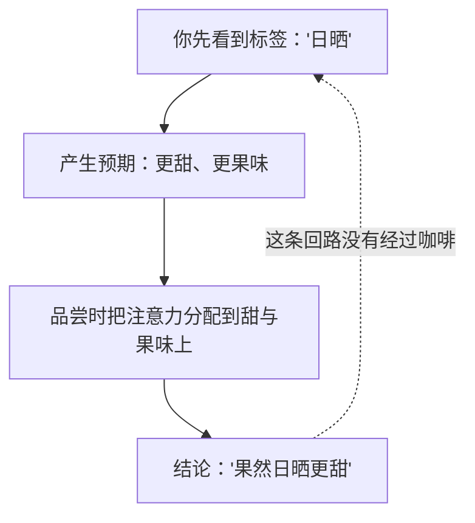

# 🛠 项目 P2 · 同产区、不同处理法的对照

> **这是第二部分的收尾项目**。第 6~14 章把上游拆成了一串自变量：
> 品种 → 环境 → 健康 → 成熟度 → 处理法 → 干燥 → 分级 → 产地。
> 这个项目只做一件事：**挑一个变量（处理法），把其余变量尽量按住，然后自己去看差异有多大。**
>
> **交付物**：① 一张"变量控制表"（写清你控住了什么、没控住什么）；
> ② 一份盲测记录；③ 一句只针对这组样品的结论。
>
> **它不是品鉴会**。项目的价值不在于"尝出日晒更甜"，
> 而在于**让你亲手体会到：要让一次比较站得住，需要压住多少变量**——
> 这正是[第 10](10-processing-basics.md)、[11 章](11-fermentation-experimental.md)里那些研究反复在做的事。

## P2.1 为什么这个项目必须盲测

先把理由摆在最前面，因为它决定了整个流程。

[第 11 章](11-fermentation-experimental.md)引用过一项被试内设计的消费者研究：
**同一支咖啡**配上三种不同标签（无信息 / "fermentation" / "carbonic maceration"），
180 名精品咖啡消费者对它的**酸度与喜好度评价随标签改变**，
而创新术语还让人觉得它更异国、**更贵**[^1]。

> **所以本项目的第一条规则**：**先喝，后看标签。**
> 做不到盲测的对比，得到的是**你对处理法的信念**，不是这两支豆的差异。
> 这一条在[第 11 章](11-fermentation-experimental.md)里被立成了硬规矩，本项目只是执行它。

## P2.2 选样：把"同产区"落实到字段

"同产区"这个说法太粗。真正要按住的是[第 14 章 §14.7](14-origin-map.md)那六个字段。
按下表打勾，**勾越多，你的比较越有意义**：

| 要控的变量 | 理想 | 可接受 | 不可接受 |
|-----------|------|-------|---------|
| **国家 / 产区** | 同一庄园、同一地块 | 同一产区 | 不同国家 |
| **品种** | 完全相同 | 同一遗传支系 | 一支瑰夏对一支卡蒂姆 |
| **海拔** | 相同 | 相差 < 200 m | 相差 > 500 m |
| **采收年份/季** | 同一批采收 | 同一年 | 相隔一年以上 |
| **处理法** | **这是你要变的那一个** | — | — |
| **烘焙商与烘焙度** | 同一烘焙商、烘焙度接近 | 同一烘焙商 | 两家店、深浅差很多 |
| **烘焙日期** | 相差 < 7 天 | 相差 < 14 天 | 一支新鲜一支放了两个月 |

> **诚实说明**：能同时满足"同庄园 + 同品种 + 同年 + 同烘焙商 + 只差处理法"的样品**不好找**，
> 通常要向烘焙商直接问（很多烘焙商恰好有这样的"对照套装"）。
> **找不到也能做**——但必须在交付物里**写清楚你没控住哪几项**。
> 这不是免责声明，这是结论的有效范围。

## P2.3 🅐 无器具版（不需要磨豆机、秤、温度计）

**思路**：把"控制变量"这件事在**纸面与嘴上**做完整。三个任务。

### 任务一：纸面对照——填变量控制表

先不喝。找两支候选豆（可以是电商详情页），把字段抄进来：

| 字段 | 豆 A | 豆 B | 是否一致？ |
|------|------|------|-----------|
| 国家 / 产区 / 庄园 | | | ☐是 ☐否 ☐不详 |
| 品种 | | | ☐是 ☐否 ☐不详 |
| 海拔 | | | ☐是 ☐否 ☐不详 |
| 采收年/季 | | | ☐是 ☐否 ☐不详 |
| **处理法** | | | **应为"否"（这是自变量）** |
| 发酵/干燥细节 | | | ☐是 ☐否 ☐不详 |
| 烘焙商 | | | ☐是 ☐否 ☐不详 |
| 烘焙度（袋上写法 + 你的目测） | | | ☐是 ☐否 ☐不详 |
| 烘焙日期 | | | 相差 ____ 天 |
| **"不详"有几项？** | | | ____ / 9 |

> **"不详"的项数就是你这次比较的误差来源清单。** 记住它，写结论时要用到。

### 任务二：先写下你的预期（然后封存）

这一步不能省——它把"事后合理化"堵死：

| 问题 | 你的预期（做之前写） |
|------|-------------------|
| 哪一支更甜？为什么（用第 10、11 章的机理讲，不许用形容词堆砌） | |
| 哪一支酸更强？ | |
| 哪一支 body 更厚？ | |
| 你觉得自己盲测能分辨吗？（三轮里能对几轮） | ____ / 3 |

### 任务三：盲测（挂耳 / 已磨粉 / 店里两杯都行）

**无器具的三种做法，任选其一**：

| 做法 | 怎么做 | 注意 |
|------|-------|------|
| **挂耳** | 买同一烘焙商的两款挂耳，请人撕掉外袋后编号 | 挂耳的粉量与研磨已固定，反而更好控制 |
| **已磨粉** | 请店家磨成同一刻度 | 粉放置会加速失香（[第 12 章](12-drying-storage.md)的道理同样适用于熟豆），当天喝完 |
| **店里点两杯** | 请咖啡师用**同一套参数**做两杯，不告诉你哪杯是哪支 | 事先说明你在做对照，多数咖啡师很乐意配合 |

记录表（**每一轮都要独立重新编号**）：

| 轮次 | 左杯编号 | 右杯编号 | 你判断"哪杯是日晒/哪杯是水洗" | 正确与否 |
|------|---------|---------|---------------------------|---------|
| 1 | | | | |
| 2 | | | | |
| 3 | | | | |

感受记录（**先记感受，最后才揭晓**）：

| 观察项 | 杯 ① | 杯 ② |
|-------|------|------|
| 干香（闻粉/闻杯） | | |
| 入口第一秒 | | |
| 酸：强度 / 质地（尖锐·圆润·发涩） | | |
| 甜感出现在什么时候 | | |
| body（[术语](../../glossary.md#body)） | | |
| 余韵长度与干净度 | | |
| **整体：你更喜欢哪杯** | | |

## P2.4 🅑 有条件版（备齐后再做）

> **所需器具**：磨豆机、秤（0.1 g）、温度计或控温壶、同一套滤杯与滤纸、计时器；
> [冲煮记录表](../../forms/brew-log.md)。
> **替代方案**：没有秤 → 用同一个量勺并数勺数；没有温度计 → 水沸后固定静置时间（如 60 秒）。
> **必须有的那一样**：**一位帮你编号的同伴**（或自己贴背面编号后彻底打乱）。

### 任务四：三支豆的对照（同产区 × 三种处理）

理想样品：同一庄园、同一年、同一烘焙商的**水洗 / 日晒 / 蜜处理（或厌氧）**各一支。

**固定下来的参数**（写死，全程不动）：

| 参数 | 你的设定 |
|------|---------|
| 粉量 | ______ g |
| 粉水比 | 1 : ______ |
| 研磨刻度 | ______（**同一台磨，同一刻度**） |
| 水温 | ______ ℃ |
| 注水方式与总时间 | ______ |
| 水（同一批） | ______ |

> **为什么"同一刻度"不等于"同一粒径"**：不同豆的密度与脆性不同，
> 同一刻度磨出来的粒径分布并不相同——这一点第 23 章会展开。
> 本项目**接受这个不完美**，但要求你把它**写进误差来源**。

**结果记录**：

| 观察项 | 水洗 | 日晒 | 蜜/厌氧 |
|-------|------|------|--------|
| 粉的干香 | | | |
| 闷蒸时的膨胀（大/中/小） | | | |
| 总流速（快/中/慢） | | | |
| 酸的强度 | | | |
| 酸的质地 | | | |
| 甜感 | | | |
| 发酵味 / 酒感 / 过熟感 | | | |
| body | | | |
| 干净度（有无杂味） | | | |
| 余韵 | | | |

### 任务五：把它变成一次能站得住的测试

只做一次对照，得到的是印象。要变成证据，加两件事：

**① 三角测试**（判断"能不能分辨"，而不是"哪个更好"）

准备 3 杯：**两杯同一支豆，一杯另一支**，由同伴随机安排并编号。你的任务只有一个：**指出不同的那一杯。**

| 轮次 | 三杯编号 | 你指认的"不同的那杯" | 正确答案 | 对/错 |
|------|---------|-------------------|---------|-------|
| 1 | | | | |
| 2 | | | | |
| 3 | | | | |
| 4 | | | | |
| 5 | | | | |
| 6 | | | | |

> **怎么读成绩**：三角测试的随机命中率是 **1/3**。
> 6 轮里对 2 轮 ≈ 随机水平；**要谈"我能分辨"，至少需要明显高于随机的成绩，
> 而且轮数越多结论越稳**。具体的显著性判断留到[第 39 章](../../roadmap.md)，
> 这里先把**"先证明能分辨，再谈描述"**这个顺序建立起来。

**② 重复一次**（换一天、换一个时间段、最好换一位品尝者）

| 项 | 第一次 | 第二次 |
|----|-------|-------|
| 三角测试成绩 | ____ / 6 | ____ / 6 |
| 偏好是否一致 | | |
| 你对"哪杯更甜"的判断是否一致 | | |

> **两次不一致很常见，而且是有价值的结果**：它说明差异接近你当前的分辨阈，
> 或者说明你的状态（时间、饥饿、上一杯喝了什么）在影响判断。
> [第 38 章](../../roadmap.md)会把"自我校准"做成一套可练的流程。

## P2.5 交付物模板

把下面三块填完，这个项目就完成了。

### ① 变量控制表（结论的有效范围）

| 我控住了 | 我没控住 | 它可能带来的影响 |
|---------|---------|----------------|
| | | |
| | | |
| | | |

### ② 盲测结果

| 项 | 结果 |
|----|------|
| 盲测/三角测试成绩 | ____ / ____ |
| 我的预期（P2.3 任务二）与结果是否一致 | |
| 最明显的一处差异 | |
| 我**没有**尝出差异的方面 | |

### ③ 一句话结论（按这个句式写）

> **"在 ______（时间）、用 ______（参数）冲煮的 ______（具体两/三支豆）上，
> 我在 ____ 轮三角测试中对了 ____ 轮；
> 我观察到的最大差异是 ______；
> 但因为没有控住 ______，这个结论不能推广到'处理法一般会怎样'。"**

> **为什么句式这么啰嗦**：因为这正是[第 10、11 章](11-fermentation-experimental.md)里那些研究**自己**的写法——
> 它们几乎都注明"单产地、单季、单一物种"。
> **一个诚实的小结论，比一个夸张的大结论有用得多**，因为它能被下一次实验继续用。

## P2.6 常见的五个坑

| 坑 | 为什么是坑 | 怎么避 |
|----|----------|-------|
| 先看标签再喝 | 标签效应已被实验量化[^1] | 编号、打乱、先喝后揭 |
| 两支豆烘焙度差很多 | 烘焙度改变的东西比处理法多得多（第三部分） | 目测颜色 + 问烘焙商，尽量接近 |
| 烘焙日期差两周以上 | 熟豆状态随时间变（第 41 章） | 尽量同批次购入 |
| 只做一次就下结论 | 单次差异可能来自冲煮波动 | 至少重复一次，最好三角测试 |
| 把"我更喜欢"写成"它更好" | 偏好 ≠ 品质（[第 4 章](../01-foundation/04-perception.md)） | 分开记录"差异"与"偏好"两栏 |

## P2.7 这个项目为第三部分留下的问题

做完之后，你多半会遇到一个尴尬：**两支豆的差异里，有多少是处理法，有多少是烘焙？**

这正是第三部分要回答的问题。从下一章开始，本书把变量移到**烘焙**上：

- [第 15 章](../03-roasting/15-roasting-physics.md) 先讲物理——热量怎么进到豆子里，"豆温"到底是什么；
- 第 16、17 章讲化学——前体怎么变成风味，苦味到底从哪来；
- 第 18~20 章讲结构、测量与缺陷。

> **把你这次的记录留好。** 学完第三部分，回头看你写的"日晒那支更甜"，
> 你会知道该去追问哪一个环节。

---

## P2.8 本项目的依据

- **[FM8]**（第 11 章已登记）Carvalho 等 (2026), *Foods* 15(8):1287（开放获取）：
  180 名精品咖啡消费者、被试内设计、同一支咖啡配三种标签，
  感官与喜好评价随标签改变，创新术语还提高了"更贵"的预期。
  本项目"必须盲测"这条规则的直接依据。
- 变量清单与控制思路来自本书第 6~14 章各章的一手文献（见[出处与资料登记](../../standards.md)），
  其中"单产地、单季、单一物种"的限定语写法，直接取自
  [第 10](10-processing-basics.md)、[11 章](11-fermentation-experimental.md)所引研究的自我限定。
- **本项目不提供**"日晒 vs 水洗谁更甜"的标准答案——
  [第 10 章](10-processing-basics.md)已经说明：各研究的成分区间**大幅重叠**，
  且物种与产地效应常常大于处理法效应。**你的记录对你自己才是新证据。**

[^1]: 本书编号 [FM8]：Carvalho、de Sousa & Nadaleti (2026), *Foods* 15(8):1287（PMCID PMC13115149，开放获取；第 11 章已登记）。
