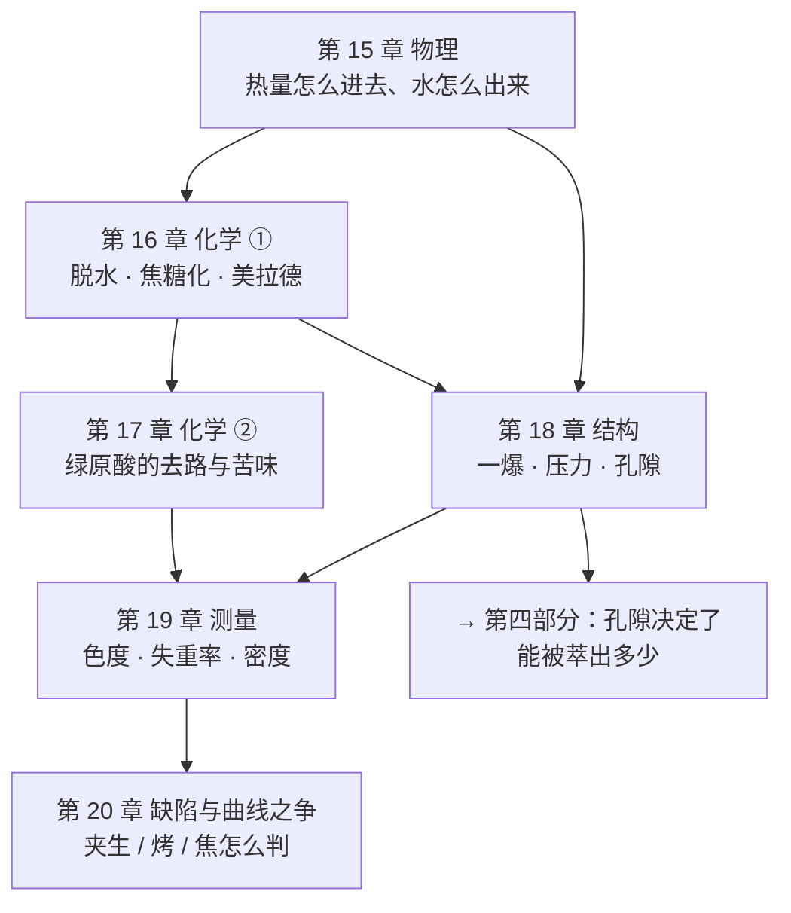

# 第三部分 · 烘焙：把前体变成风味（导读）

> **第二部分回答了"生豆里有什么"，这一部分回答"那些东西是怎么被改写的"。**
>
> 一句话概括这一部分的地位：**烘焙是全链条里唯一一次大规模的化学改造**。
> 种植与处理决定了前体库存（第一、二部分），冲煮只是从熟豆里**选择性取出**（第四、五部分）——
> 只有烘焙**造出**了生豆里几乎不存在的东西：数百种挥发性香气分子、类黑精、
> 以及绝大部分苦味物质。
>
> **你不需要自己烘豆才能学这一部分。** 目标不是让你去买烘焙机，
> 而是让你在喝到"闷""涩""空""焦"的时候，**能分清这是烘焙的问题还是冲煮的问题**。

## 这一部分最容易踩的三个坑

**第一，把"曲线"当成因果。**
烘焙圈流传着大量关于曲线形状的说法：升温速率（RoR）不能掉、一爆后要发展多久、
"flick"是缺陷……这些说法里有真知识，但**经验参数的密度远高于实验证据的密度**。
本书的做法是：**凡是能找到实验的，以实验为准；找不到的，明确写成"行业经验"并标注证据强度。**
你会在第 15、20 章看到几处"实验结果与流行说法不一致"的例子——
那正是这一部分最值得读的部分。

**第二，把"豆温"当成一个客观量。**
烘焙机上显示的温度是**探针周围的温度**，而探针插在哪里、被多少豆子包围、
热容多大、响应多快，各家机器都不同。
连建模研究都必须**先假设**"某个测点代表豆温"才能往下算（第 15 章会引用这样一段自白）。
**所以"180 ℃ 下锅"这类数字，在换一台机器后不一定指同一件事。**

**第三，把化学反应想成"一步一步来"。**
脱水 → 焦糖化 → 美拉德 → 一爆 → 发展，这套阶段划分是**操作上的分段**，
不是化学上的先后。一项在商用烘焙机上逐分钟取样的研究明确指出：
虽然烘焙师把某个阶段叫"美拉德阶段"，但**美拉德反应在一爆之后仍在继续**（第 16 章）。
**阶段是给人用的，分子不看日程表。**

## 这一部分的六章

| 章 | 它回答的问题 | 状态 |
|----|------------|------|
| [15 · 烘焙的物理](15-roasting-physics.md) | 热量以什么方式进入豆子？豆内是一个温度吗？"同一条曲线换台机器"成不成立？ | ✅ |
| [16 · 烘焙的化学 ①](16-roasting-chemistry-1.md) | 水走了以后发生了什么？糖和氨基酸去了哪里？香气是怎么被造出来的？ | ✅ |
| [17 · 烘焙的化学 ②](17-cga-and-bitterness.md) | 绿原酸去了哪里？咖啡的苦到底是谁贡献的？深烘为什么"苦得不一样"？ | ✅ |
| 18 · 结构变化 | 一爆是怎么回事？孔隙如何决定"能被萃出多少"？ | ⬜ |
| 19 · 烘焙度的测量 | 色度、失重率、密度——三种"烘焙度"为什么互不等价？ | ⬜ |
| 20 · 烘焙缺陷与曲线之争 | 夹生/烤/焦的判据是什么？"发展时间比"这类指标的证据级别如何？ | ⬜ |

## 读这一部分时的两个提示

**第一，注意"同一个词的两种用法"。**
"烘焙度"可以指颜色、可以指失重率、可以指豆温终点，三者不等价（第 19 章）；
"发展"在烘焙师口中指一爆之后的时段，在化学上却没有对应的分界线。
遇到这类词，**先问对方在说哪一种**——这与[第 13 章](../02-upstream/13-green-grading.md)问"等级是哪一套"是同一个动作。

**第二，这一部分的数字比前两部分更"可实验"，但更"依赖设备"。**
农学数据受地点与年份影响（第二部分的提示），而烘焙数据受**机器与批量**影响：
同一条结论在 100 g 实验室烘焙机与 5 kg 商用机上可能不同。
本书引用时会尽量注明**批量与机型**——看到这些限定语，请当真。

---

**从这里开始**：[第 15 章 · 烘焙的物理：传热、豆内温度场与"豆温不是一个数"](15-roasting-physics.md)
