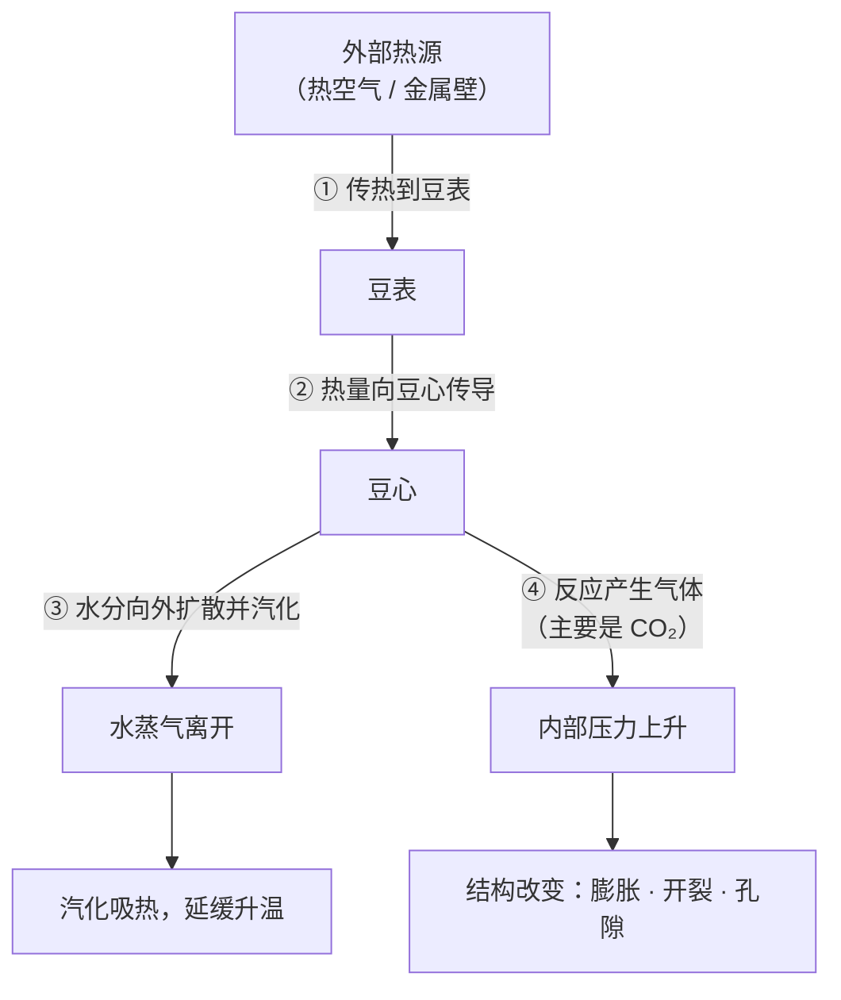
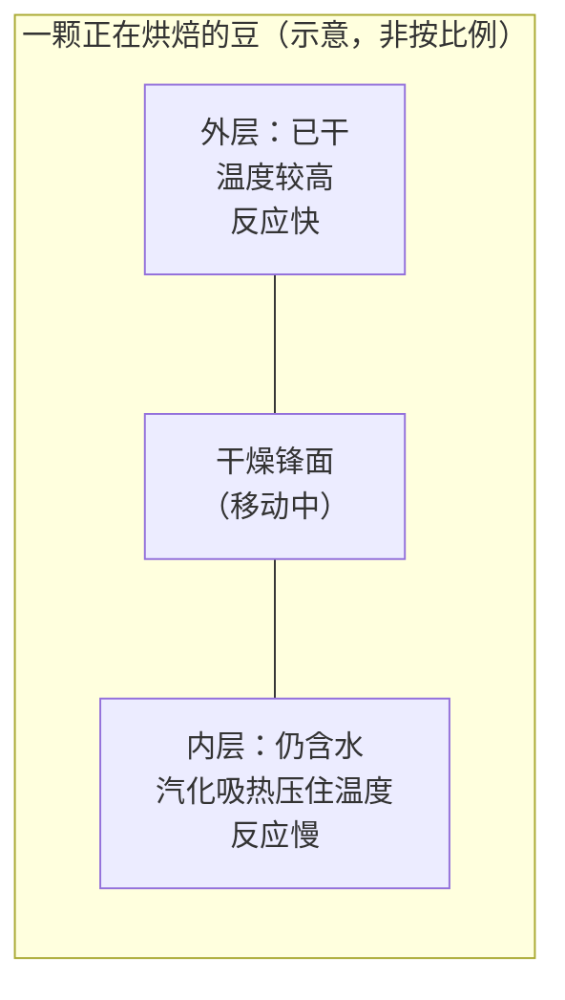
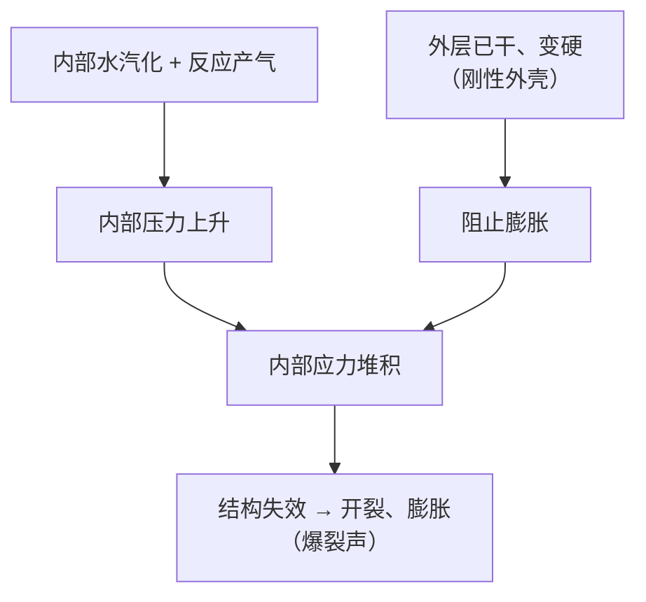

# 第 15 章 烘焙的物理：传热、豆内温度场与"豆温不是一个数"

> **本章目标**：在讲任何化学之前，先把**热量是怎么进到一颗豆子里的**讲清楚。
>
> 因为烘焙的所有争论——曲线该怎么走、RoR 能不能掉、一爆后要发展多久——
> 都建立在一个几乎没人追问的前提上：**"豆温"这个数是可靠的、
> 而且它代表了豆子里正在发生的事。**
>
> 这一章要说明：**这两件事都只是近似**。
> 豆内存在一条移动的干燥锋面，内外水分与温度并不相同；
> 烘焙机上那个读数是探针周围的温度，换台机器就未必指同一件事。
>
> 这不是要否定烘焙曲线——**恰恰相反**：知道读数的边界在哪，
> 才知道一条曲线什么时候可以搬到另一台机器上，什么时候不行。
> 本章末会给出一条有实验支持的判据。

## 15.1 物理上，烘焙是"加热一个含水的多孔体"

先把对象说清楚。进烘焙机的是一颗**含水约 10%~12%（湿基）的致密种子**[^1]，
出来的是一个**体积膨胀、布满孔隙、几乎不含自由水**的多孔固体。

中间发生的事，在物理上可以拆成四件同时进行的过程：

> **四件事互相耦合，这是烘焙难控的根本原因**：
> 水汽化要吸热，于是**只要还有水，豆温就升不快**；
> 水走了，升温加速，反应加速，产气加快，压力上升，结构改变；
> 结构一变，传热与传质的路径又变了。
> **没有哪一步可以单独调节。**

## 15.2 三种传热方式，两类机器

热量进入豆子的方式只有三种，咖啡上都用得到[^2]：

| 方式 | 在烘焙机里对应什么 | 特点 |
|------|------------------|------|
| **传导（conduction）** | 豆与**热金属面**（滚筒壁、桨叶）直接接触 | 局部强度高，接触点温度高，依赖翻搅是否均匀 |
| **对流（convection）** | **热空气**流过豆堆 | 可控性好，热量分布更均匀，随风量变化 |
| **辐射（radiation）** | 高温壁面与豆之间的热辐射 | 随温度升高而增强，常被忽略但并非不存在 |

两类常见机型的差别，本质是**三者的配比不同**[^2]：

| 机型 | 结构 | 传热特征 |
|------|------|---------|
| [**滚筒式（drum roaster）**](../../glossary.md#drum-roaster) | 水平旋转的圆筒，热空气从中心或穿孔壁送入，豆在筒内不断翻滚 | **传导 + 对流**并重；是家用与工业最常见的形式 |
| [**流化床式（fluidized-bed roaster）**](../../glossary.md#fluid-bed-roaster) | 高速热气从底部吹入，豆被气流托起并同时加热与推动 | **以对流为主**；豆与金属面接触少 |

> **一个可核对的对照观察**：一篇综述转引的研究比较了滚筒、流化床与传统烘焙对
> 埃塞俄比亚三个产区咖啡的影响（150~200 ℃、7~15 分钟），报告
> **滚筒烘焙保留的葫芦巴碱高于流化床与传统烘焙**[^2]。
>
> **怎么读这条**（两句）：① 它说明**机型确实会改变化学结果**，不只是"手感不同"；
> ② 但它是**单一研究、单一产地组、具体机型**，
> **不能**据此得出"滚筒一定比流化床好"。本书不做这种外推。

## 15.3 豆内不是一个温度：一条会移动的干燥锋面

这是本章最重要的一节。

咖啡豆很小（单粒质量在**零点几克**的量级，见[第 2 章](../01-foundation/02-cherry-anatomy.md)），
所以很多人默认"豆内温度基本均匀"。**建模研究给出的图景不是这样。**

一项发表在传热传质领域期刊的研究[^3]做了两件事：

1. 先把一个已有的热—湿传输模型（Fabbri 等提出的那一版[^4]）简化后与**豆内含水率的实测数据**拟合，
   指出该模型虽然拟合得不错，但**存在数值稳定性问题，且缺少若干重要的物理机制**；
2. 然后从守恒方程重新推导了一个模型。作者明确写出了一处**诚实的取舍**：
   **CO₂ 生成被略去了，因为目前的实验数据不足以拟合相关参数**[^3]。

新模型最重要的预测是：

> **豆内会形成一条["锐利的干燥锋面"](../../glossary.md#drying-front)（sharp drying front），
> 把豆子分成"外层已干区"与"内层仍湿区"两部分**[^3]。

作者同时指出：这一版模型与旧模型对**平均**行为的预测"定性上相似"，
但对**内部结构与水分分布**的预测显著不同——
原因在于新模型追踪的是**局部量**而不是**整体平均量**[^3]。

> **这一段给读者的三条结论**：
>
> 1. **"豆温"这个词，在物理上指的是一个分布，不是一个数**；
> 2. **同一颗豆的内外，可能正处在不同的反应阶段**——
>    外层已经进入高温干区，内层还在被汽化吸热压着；
> 3. **这解释了"夹生（underdeveloped）"为什么可能发生在看起来颜色正常的豆上**：
>    颜色首先是**表面**的性质。第 19、20 章会回到这个问题。
>
> **诚实说明**：以上是**模型预测**，不是对豆内温度场的直接测量。
> 本书没有读到在真实烘焙过程中直接测定豆心与豆表温差的一手实验。
> 因此本章**不给任何"内外温差 X ℃"的数字**。

## 15.4 "豆温"是测出来的，还是被定义出来的

既然豆内是一个分布，那烘焙机上显示的那个[豆温](../../glossary.md#bean-temperature)是什么？

**答案：是探针周围环境的温度**——它同时受热空气、豆堆与金属的影响。
一个能说明问题的细节来自一篇建立烘焙动力学模型的论文[^5]：
作者在处理温度数据时**必须先做一个假设**——
认定初始点接近环境温度（约 25 ℃），
并**假定从第二个测点开始，测到的温度代表豆子的温度**，
再用分段三次埃尔米特插值把这些点连成"豆温曲线"[^5]。

> **请注意这句话的含义**：连一篇专门做烘焙建模的论文，
> 也只能**假定**某个测点代表豆温——**这不是研究做得不好，
> 而是"豆温"本身就是一个需要被操作性定义的量。**

那么实践中是怎么保证读数可比的？一项在**商用 5 kg 滚筒烘焙机**上做的研究，
把它的操作条件写得非常详细，值得当作"读数可比性"的清单[^6]：

| 做法 | 研究中的设定 | 为什么重要 |
|------|------------|-----------|
| **预热** | 每次烘焙前预热到 **210 ± 5 ℃**，至少 **30 分钟**，让滚筒温度稳定 | 机器蓄热量不同，读数起点就不同 |
| **装载量** | 5 kg 容量的机器**只装 4 kg（80%）**，以保证气流一致 | 装载率改变豆堆与气流的关系，也改变探针被包围的程度 |
| **记录方式** | 用烘焙软件记录温度与**每 30 秒的[升温速率（RoR）](../../glossary.md#ror)** | RoR 是温度曲线的导数，依赖采样间隔的定义 |
| **端点控制** | 各曲线的起止温度分别控制在 **215 ± 8 ℃** 与 **237 ± 2 ℃**，总时长统一 16 分钟 | 只有把端点按住，才能把"曲线形状"当成唯一变量 |

> **翻译成一句可执行的话**：**当别人给你一条[烘焙曲线](../../glossary.md#roast-profile)时，
> 除非同时给出机型、装载率、预热方式与 RoR 的采样间隔，
> 否则那条曲线只是"他那台机器上的一条线"。**

## 15.5 水走了之后：体积、孔隙与内部的应力

烘焙不仅改变化学，也**重建了豆子的结构**——而结构直接决定第四部分的萃取。

**① 烘焙条件决定孔隙结构**

一项用容积测定、压汞法与电子显微镜做的研究，把同一种咖啡用两种定义清晰的工艺
**烘到相同烘焙度**，然后比较结构[^7]：

> **高温烘焙的咖啡，豆体积更大、孔体积更大、细胞壁上的微孔更大**[^7]。

也就是说：**"烘到同样的颜色"不等于"烘成同样的东西"**——
颜色相同、结构不同，而结构控制着烘焙中与储存中的传质[^7]。

**② 一爆的力学：内部被自己憋住**

同一批作者后续用**多孔黏弹性（poroviscoelastic）**方程描述了豆内的应力[^8]。
结论很直观：

> 豆内会出现**一次很大的应力堆积**，原因是
> **黏弹性的内部被一个刚性的弹性外壳包住、无法向外膨胀**[^8]。

> **两点提示**：
> - 这是**模型结果**，作者自己把它定位为"**为改进工业烘焙提供可能方向**"[^8]，
>   不是对一爆的完整解释；
> - 但它与 §15.3 的干燥锋面是**同一套图景**：
>   **先干的外层与还湿的内层性质不同**，这正是应力的来源。
>   一爆因此不是"某个温度到了"，而是**结构承受不住内外差异**的结果。
>
> **所以"一爆在 X ℃"这类说法要小心**：本书读到的论文里，
> 出现过"约 205 ℃ 时豆膨胀并发生一爆"这样的**叙述性**表述[^5]，
> 但那是文献综述式的描述、且依赖于该文的温度定义。
> **本书不把任何一爆温度写成判据**——判据是**声音与结构**，不是读数。

## 15.6 吸热与放热：烘焙不是单向加热

烘焙过程中的热量并非全部来自外部。

一项用**热流量热法**做的早期研究测定了咖啡与菊苣产品的比热，并观察到：
**在密闭池中测量时，会出现强烈的放热反应**——该文的动机正是理解这类放热
（以及由此导致的自热）如何让物料升到其最低着火温度之上[^9]。

> **本书对这条证据的使用边界（重要）**：
> 这项研究测的是**物料在量热仪中的热行为**，**不是烘焙机里的豆**。
> 它能支持的结论只有一条：**咖啡物料在高温下会发生放热反应**。
>
> 它**不能**用来支持烘焙圈常说的那句"一爆后进入放热阶段，所以 RoR 会自己抬头（flick）"——
> 这个因果链本书**没有**找到直接实验证据。
> 有意思的是，有一项实验从侧面检验了"flick 是缺陷"的说法，见下一节与[第 20 章](../../roadmap.md)。

## 15.7 同一条曲线，换台机器成不成立？

这是烘焙师最关心的实践问题，而它恰好有一项设计得很干净的实验[^10]。

研究者在**商用卧式滚筒机**与**实验室流化床机**上，
分别用高温短时（HTST）与低温长时（LTLT）条件烘焙，
**所有试验都烘到以豆色亮度定义的同一个终点**，追踪 16 种香气化合物与物理性质[^10]。

两个结论：

| 发现 | 内容 |
|------|------|
| **① 条件不同 → 结果不同** | 与 LTLT 相比，**HTST 在物理性质与香气生成动力学上有明显差异**[^10]；过度烘焙时多数挥发物减少或持平，但**己醛、吡啶、二甲基三硫**的浓度**继续上升**[^10] |
| **② 但曲线一致 → 结果趋同** | 当两台机器以"**温度曲线模式**"运行，即**沿着完全相同的豆温—时间发展**时，**两种工艺的香气生成动力学相似**[^10] |

> **这两条合起来，给出了本章最实用的一句话**：
>
> **"同一条曲线换台机器不成立"这个说法需要修正——
> 不成立的不是曲线，而是"两台机器上同名的曲线其实是同一条"这个假设。**
>
> 如果你真的能让另一台机器上的**豆温—时间曲线**与原机一致，
> 那项实验的结果是：**香气动力学会趋同**[^10]。
> 问题在于"真的一致"极难做到——因为探针位置、装载率、气流、机器蓄热都不同（§15.4）。

再补一条来自商用机的实验证据。§15.4 提到的那项 5 kg 滚筒机研究，
特意设计了两条**被烘焙圈视为缺陷**的曲线[^6]：

- **NRoR**：模拟一爆前后**掉火**造成的升温速率转负；
- **EF（exaggerated flick）**：在一爆后制造一次**夸张的 RoR 抬头**。

结果是：这两条"缺陷曲线"产生的**可滴定酸度随时间的变化，与标准中庸曲线（MD）几乎无法区分**[^6]。

> **必须非常小心地读这个结果**（三句）：
>
> 1. 它**只**说明：在**可滴定酸度**这一个指标上，这两种被认为有害的曲线没有制造出差异；
> 2. 它**没有**做感官评价——作者自己把感官评价列为后续工作[^6]；
> 3. 所以正确的表述是：**"flick 毁掉咖啡"这一说法，至少在酸度这一项上没有得到支持**，
>    而不是"flick 无害"。
>
> 这正是本部分导读里说的那类例子：**流行说法与实验证据之间存在缝隙，
> 本书的任务是把缝隙指出来，而不是站队。**

## 15.8 常见说法辨析

按本书约定标注**证据强度**：✅ 有共识 / ⚠️ 有争议 / ❌ 明确错误 / **缺乏证据**。

| 说法 | 判定 | 说明 |
|------|------|------|
| "豆温 180 ℃ 时该做某事" | ⚠️ **读数依赖机器** | 读数是探针周围温度；建模研究也只能**假定**某测点代表豆温[^5]。可比性要靠机型、装载率、预热与采样间隔一起给出[^6] |
| "豆子很小，所以内外温度一样" | ❌ **与模型不符** | 模型预测存在**锐利的干燥锋面**，把豆分成外干区与内湿区[^3]。本书同时说明：这是模型，不是直接测温 |
| "颜色一样就是烘得一样" | ❌ **有直接反证** | 烘到**相同烘焙度**的两种工艺，豆体积、孔体积与细胞壁微孔仍显著不同[^7] |
| "一爆是因为温度到了 X ℃" | ⚠️ **把结果当成阈值** | 力学模型显示一爆来自**内部应力堆积**（黏弹性内部被刚性外壳束缚）[^8]；温度只是促成条件之一。本书不写一爆温度判据 |
| "一爆后进入放热阶段，所以 RoR 会自己抬头" | **缺乏证据（作为完整因果链）** | 可核实的只有"咖啡物料在高温下会放热"（量热仪，非烘焙机）[^9]。**从放热到 RoR 抬头**这一步本书未找到直接实验 |
| "flick / RoR 掉头会毁掉这锅豆" | ⚠️ **至少在酸度上未被支持** | 商用机实验中，EF 与 NRoR 两条"缺陷曲线"的可滴定酸度动态与中庸曲线**几乎无法区分**[^6]；但该研究**未做感官评价**，因此不能反过来说"无害" |
| "同一条曲线换台机器就不成立" | ⚠️ **需要精确化** | 当两台机器沿**相同的豆温—时间曲线**运行时，香气生成动力学**相似**[^10]。真正不成立的是"同名曲线 = 同一条曲线"这个假设 |
| "流化床（热风）比滚筒好 / 差" | ⚠️ **机型会改变结果，但没有普遍优劣** | 单一研究报告滚筒保留更多葫芦巴碱[^2]；同时 HTST/LTLT 的差异在两类机器上都存在[^10]。**本书不给机型排名** |
| "烘得快 = 烘得浅" | ❌ **两个维度** | 时间—温度组合与最终烘焙度是**独立**的：HTST 与 LTLT 可以烘到**同一个颜色终点**，结果却不同[^10][^7] |
| "水在烘焙里只是要被赶走的东西" | ⚠️ **低估了它** | 水的汽化吸热直接决定升温节奏（§15.1）；而含水率还改变化学反应的速率窗口——下一章会看到，多数香气化合物的增幅峰出现在**含水率 7%→2%** 这一段[^11] |

## 15.9 🔎 买豆与冲煮时的用处

1. **别把烘焙商给的曲线参数当成可复制的配方**：没有机型与装载信息的曲线，
   对你手里的豆没有可操作含义。**要问的是结果性指标**（烘焙度怎么测的、失重率多少），
   第 19 章会教怎么读它们。
2. **"同样烘焙度"的两支豆可能结构不同**[^7]，因此**吃水与出汤速度也会不同**。
   换豆后流速明显变化时，先怀疑结构差异，而不是立刻改研磨。
3. **豆子大小/密度差异越大，越难烘匀**（§15.3 的锋面在大小不同的豆上位置不同）——
   这就是[第 13 章](../02-upstream/13-green-grading.md)说"目数量的是一致性"的物理原因。
4. **喝到"外焦里生"的感觉（表面焦苦 + 内里青涩），先怀疑烘焙而不是冲煮**：
   这与外层已干、内层仍湿的图景一致（§15.3）。验证方法：换一个冲煮参数仍不消失，
   再换另一包同款验证是否批次性。
5. **遇到宣称"独家曲线"的营销，问一句"你怎么测烘焙度"**——
   能答出测量方法的，通常也控得住过程。

## 15.10 思考题

1. 请用"传导 / 对流 / 辐射"三种方式说明滚筒机与流化床机的差别，
   并解释为什么"同一条曲线"在两类机器上不一定意味着同一件事。
2. 干燥锋面模型预测豆内分成"外干区"与"内湿区"。
   请说明这个图景如何解释：① 一爆的力学来源；② "颜色正常但内里夹生"为什么可能发生。
3. 一篇建模论文必须**假定**某个测点代表豆温。
   请说明这件事对读者意味着什么，并列出你在接受任何一条烘焙曲线之前要问的四个问题。
4. 高温与低温烘焙到**相同烘焙度**，豆的体积与孔结构却不同。
   请解释这个结果为什么会让"用颜色定义烘焙度"这件事变得不完整，
   并说明它会怎样影响第四部分要讲的萃取。
5. **【案例】** 一位烘焙师说："我这条曲线在 12 kg 机上跑得很好，
   你在 1 kg 的机器上照着做就行，温度点都给你了。"
   请指出这段话里被省略的前提，并写出你会补问的三个问题。
6. **【案例】** 有人引用一项量热研究说"咖啡在烘焙中会放热，所以一爆后 RoR 一定会抬头"。
   请指出这个推理链上哪一环缺证据，并说明一个能检验它的实验大概该怎么设计。
7. 商用机实验发现，两条被视为缺陷的曲线（掉火与夸张 flick）在**可滴定酸度**上
   与标准曲线几乎无法区分。请写出这个结果**支持**与**不支持**的结论各一条。
8. **【辨识】** 找一篇你信任的烘焙技术文章，把它里面出现的每一个温度数字标出来，
   然后逐个判断：它是**豆温读数**、**空气温度**、**机器设定**，还是**没说明**？
   统计"没说明"的比例。

> 📖 **参考答案**（想清楚再看）：[Q1](../../qa/15-roasting-physics-qa.md#q1) ·
> [Q2](../../qa/15-roasting-physics-qa.md#q2) · [Q3](../../qa/15-roasting-physics-qa.md#q3) ·
> [Q4](../../qa/15-roasting-physics-qa.md#q4) · [Q5](../../qa/15-roasting-physics-qa.md#q5) ·
> [Q6](../../qa/15-roasting-physics-qa.md#q6) · [Q7](../../qa/15-roasting-physics-qa.md#q7) ·
> [Q8](../../qa/15-roasting-physics-qa.md#q8)

## 15.11 本章实操

### 🅐 无器具版 · 任务一：给一篇烘焙文章做"温度体检"

把思考题 8 做成可留存的记录：

| # | 文中的温度数字 | 它指什么？（豆温/风温/设定/未说明） | 有没有给机型与装载量？ |
|---|--------------|--------------------------------|---------------------|
| 1 | | | |
| 2 | | | |
| 3 | | | |
| **统计** | 共 ____ 个数字 | "未说明"占 ____ % | 给了机型的占 ____ % |

> **这个练习的价值**：做过一次之后，你再看烘焙教程会自动区分
> "**这是一个物理量**"与"**这是他那台机器上的一个刻度**"。

### 🅐 无器具版 · 任务二：用一把熟豆做"结构目测"

烘焙改变结构，而结构在熟豆上肉眼可见。取两包不同豆各 20 颗：

| 观察项 | 豆 A | 豆 B | 提示 |
|-------|------|------|------|
| 中线（center cut）是否张开、颜色深浅 | | | 张开程度与膨胀有关 |
| 豆体是否明显膨大、棱角是否变圆 | | | 体积增大是孔隙形成的外在表现[^7] |
| 表面是否有油光 | | | 只记录现象；"出油＝新鲜/不新鲜"本书列为⚠️（见[出处登记 §七](../../standards.md)） |
| 掰开一颗：断面是蓬松还是致密？ | | | 断面结构比表面颜色更接近"发展程度" |
| 断面颜色与表面颜色是否一致？ | | | **不一致是本章 §15.3 的直接可见证据** |

> **重点在最后一行**：如果断面明显比表面浅，说明**表面与内部走了不同的历程**。
> 这一条不需要任何仪器就能观察到。

### 🅑 有条件版 · 任务三：同一支豆、两种烘焙度的"结构—流速"对照（备齐后再做）

> **所需**：同一支豆的浅烘与深烘各一包（多数烘焙商有）；磨豆机、秤、滤杯、计时器；
> [冲煮记录表](../../forms/brew-log.md)。
> **替代方案**：没有同款两种烘焙度，就用两支烘焙度明显不同的豆，并在记录里注明这是混杂。

固定**粉量、水温、注水方式、研磨刻度**，只比较：

| 观察项 | 浅烘 | 深烘 |
|-------|------|------|
| 闷蒸时的膨胀（大/中/小） | | |
| 总萃取时间（秒） | | |
| 粉层塌陷速度 | | |
| 汤色（同样浓度下） | | |
| 苦/涩强度 | | |

> **要得出的观察**：深烘豆通常吃水更快、流速更快——
> 这与"烘焙度更深 → 结构更疏松、孔隙更多"的方向一致[^7]。
> **但注意**：这是**你这两包豆上的观察**，不是定律；
> 而且研磨刻度相同 ≠ 粒径相同（深烘豆更脆，同刻度下细粉更多），
> **这一层混杂要写进记录**，第 23 章会专门处理。

### 🅑 有条件版 · 任务四：做一次"曲线可移植性"的思想实验 + 记录（备齐后再做）

> **所需**：如果你有烘焙机（含小型样品烘焙机），才做这一项；否则用任务一代替。

| 步骤 | 要记录的 |
|------|---------|
| 1 | 记下你的机型、容量、**实际装载量**、预热方式与时长 |
| 2 | 记下探针位置（照片或文字描述）与软件的 RoR 采样间隔 |
| 3 | 跑一锅，保存豆温—时间曲线 |
| 4 | **换装载量**（如从 80% 降到 50%），用**完全相同的火力与风门**再跑一锅 |
| 5 | 对比两条曲线：形状差多少？一爆时间差多少？ |

> **这个实验要建立的直觉**：**你没改"曲线"，你只改了装载量，曲线却变了。**
> 这正是 §15.4 的意思——曲线是**系统的输出**，不是输入。
> 那项商用机研究之所以要固定 80% 装载率与 30 分钟预热[^6]，原因就在这里。

---

## 15.12 本章依据

完整书目信息登记在[出处与资料登记 §4.18](../../standards.md)。

- **[RP3]** Fadai、Melrose、Please、Schulman & Van Gorder (2017), *Int. J. Heat and Mass Transfer* 104:787–799。
  本章 §15.3 主干：对既有模型的拟合与批评（数值稳定性、缺少机制）；从守恒方程重推的新模型；
  **因实验数据不足而略去 CO₂ 生成**；预测存在**锐利干燥锋面**，把豆分为外干区与内湿区；
  新模型追踪**局部量**而非整体平均量。已读摘要。
- **[RP4]** Fadai、Please & Van Gorder (2019), *Int. J. Non-Linear Mechanics* 110:123–130。
  用到：温度相关的多孔黏弹性方程；**内部出现大幅应力堆积**，原因是**黏弹性内部被刚性弹性外壳束缚而无法膨胀**；
  作者把结论定位为对工业烘焙的可能改进方向。已读摘要。
- **[RP5]** Schenker、Handschin、Frey、Perren & Escher (2000), *J. Food Science* 65:452–457。
  用到：两种定义清晰的工艺**烘到相同烘焙度**后，**高温组豆体积更大、孔体积更大、细胞壁微孔更大**；
  孔结构控制烘焙与储存中的传质。已读摘要。
- **[RP6]** Baggenstoss、Poisson、Kaegi、Perren & Escher (2008), *J. Agric. Food Chem.* 56:5836–5846。
  本章 §15.7 主干：商用卧式滚筒 + 实验室流化床，HTST 与 LTLT，**以豆色亮度定义同一终点**；
  过度烘焙时多数挥发物减少或持平，但**己醛、吡啶、二甲基三硫继续上升**；
  **当两机沿相同豆温发展运行时，香气生成动力学相似**。已读摘要。
- **[RP7]** Schenker、Heinemann、Huber、Pompizzi、Perren & Escher (2002), *J. Food Science* 67:60–66。
  本章只用一句（详见第 16 章）：多数香气化合物的增幅峰出现在**含水率 7%→2%（湿基）**的脱水中段；
  不同时间—温度历程给出不同的香气谱。已读摘要。
- **[RP8]** Raemy & Lambelet (1982), *Int. J. Food Science and Technology* 17:451–460。
  用到：用热流量热法测定咖啡与菊苣产品的比热；**密闭池中出现强烈放热反应**；
  该研究的关注点是自热与着火温度。**本书只取"高温下会放热"这一层**，不外推到烘焙机内的 RoR 行为。已读摘要。
- **[RP9]** Anokye-Bempah 等 (2024), *Scientific Reports* 14:8237（PMCID PMC11002029，开放获取）。
  本章用到其**方法与两条曲线的结果**：商用 **5 kg** 滚筒机；预热 **210 ± 5 ℃ / ≥30 分钟**；
  **只装 4 kg（80%）以保证气流一致**；软件记录每 **30 秒**的 RoR；七条曲线总时长均为 16 分钟、
  起止温度 **215 ± 8 ℃ / 237 ± 2 ℃**；FS 曲线一爆约在第 8 分钟、SS 约在第 12 分钟；
  **EF 与 NRoR 两条"缺陷曲线"的可滴定酸度动态与 MD 几乎无法区分**，且该研究**未做感官评价**。
  已读全文。
- **[C1]**（第 1 章已登记）用到：绿豆含水率约 10%~12%；烘焙分干燥、烘焙、冷却三步且均涉及热质传递；
  以及该文对"**豆温曲线由假定 + 插值得到**"的处理方式。**其叙述性温度数字（如一爆约 205 ℃）
  本书不作为判据引用。**
- **[C2]**（第 1 章已登记）用到：三种传热方式与滚筒/流化床的结构描述；
  以及其转引的单一研究"滚筒保留葫芦巴碱高于流化床与传统烘焙"（150~200 ℃、7~15 分钟）。
- **[RP2]** Fabbri、Cevoli、Alessandrini & Romani (2011), *J. Food Engineering* 105:264–269。
  **仅登记坐标**：本书通过 [RP3] 的复述知道它提出了热—湿传输模型并有含水率实测数据，
  **但未读到其原文与摘要**，因此不引用其中任何数值。
- **[RP1]** Schenker & Rothgeb (2017), *The Roast—Creating the Beans' Signature*,
  in *The Craft and Science of Coffee*, pp. 245–271。**仅登记坐标，正文未读**，不引用其中数值。

**本章刻意没写的东西**：

- **任何"一爆温度""下锅温度"的具体数值判据**——读数依赖机型与探针，见 §15.4；
- **豆心与豆表的温差数值**——只有模型预测，本书未读到直接测温实验；
- **"放热阶段"与 RoR 抬头之间的因果**——缺直接证据，已写进辨析表；
- **机型优劣排名**——单一研究不足以支持；
- **CO₂ 生成与排气的定量**——连建模研究都因**实验数据不足**而略去这一项[^3]，
  本书更不写死数字（排气与新鲜度留到第 41 章）。

[^1]: 本书编号 [C1]：Bruno 等 (2026), *Scientific Reports* 16(1):15857（第 1 章已登记，开放获取）。
[^2]: 本书编号 [C2]：Bastian 等 (2021), *Foods* 10(11):2827（第 1 章已登记，开放获取）。
[^3]: 本书编号 [RP3]：Fadai 等 (2017), *Int. J. Heat and Mass Transfer* 104:787–799。
[^4]: 本书编号 [RP2]：Fabbri 等 (2011), *J. Food Engineering* 105:264–269（**本书仅登记坐标，未读原文**）。
[^5]: 本书编号 [C1]，同注 1。
[^6]: 本书编号 [RP9]：Anokye-Bempah 等 (2024), *Scientific Reports* 14:8237（PMCID PMC11002029，开放获取）。
[^7]: 本书编号 [RP5]：Schenker 等 (2000), *J. Food Science* 65:452–457。
[^8]: 本书编号 [RP4]：Fadai 等 (2019), *Int. J. Non-Linear Mechanics* 110:123–130。
[^9]: 本书编号 [RP8]：Raemy & Lambelet (1982), *Int. J. Food Sci. Technol.* 17:451–460。
[^10]: 本书编号 [RP6]：Baggenstoss 等 (2008), *J. Agric. Food Chem.* 56:5836–5846。
[^11]: 本书编号 [RP7]：Schenker 等 (2002), *J. Food Science* 67:60–66。

---

**下一章**：[第 16 章 烘焙的化学 ①：脱水、焦糖化与美拉德反应](16-roasting-chemistry-1.md)——
水走了以后，糖与氨基酸去了哪里，香气分子是怎么被造出来的。
