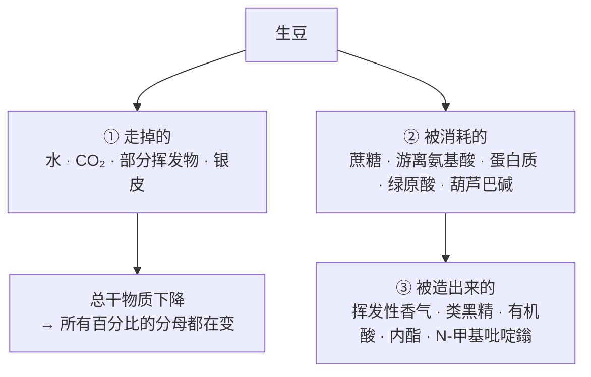
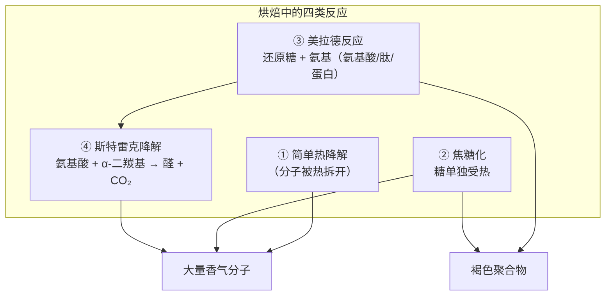
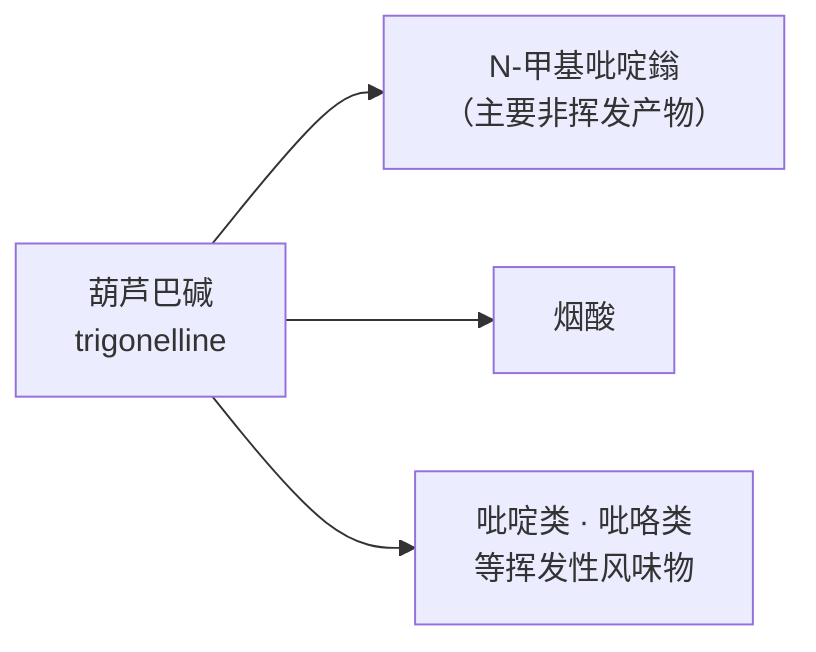
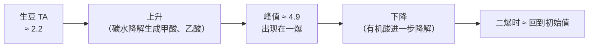
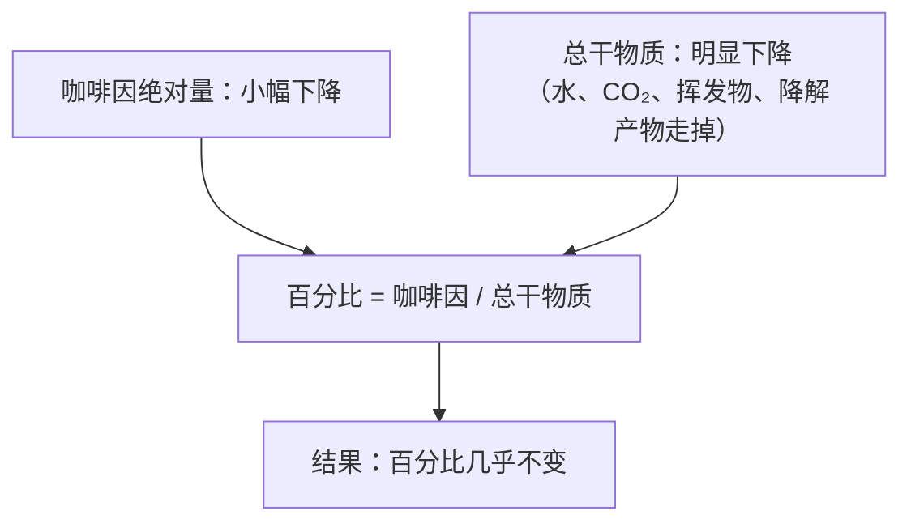

# 第 16 章 烘焙的化学 ①：脱水、焦糖化与美拉德反应

> **本章目标**：回答"**生豆里的东西，在烘焙里到底去了哪儿**"。
>
> 这是全书信息密度最高的一章之一，因为烘焙是链条上**唯一一次大规模的化学改造**：
> 大部分蔗糖消失、游离氨基酸被消耗、蛋白被破坏、
> 同时出现了生豆里几乎不存在的数百种挥发物，以及占熟豆干重四分之一左右的褐色聚合物。
>
> 本章只讲**糖、氨基酸与水**这条主线（绿原酸的去路和苦味留给[第 17 章](17-cga-and-bitterness.md)）。
> 讲法有一条硬规矩：
>
> > **烘焙化学里流传的经验参数极多，本章一律以实验文献为准；
> > 没有实验支持的说法一概进「常见说法辨析」并标注证据强度。**
>
> 你会看到：几条最常被引用的"烘焙常识"要么只有综述转引、要么被实验直接修正了。

## 16.1 三张清单，一张对照表

烘焙里发生的事，可以先粗暴地分成三类：

一份权威手册章节汇编的成分对照表（质量百分比，**干基**）[^1]：

| 成分 | 阿拉比卡**生豆** | 阿拉比卡**熟豆** |
|------|----------------|----------------|
| 碳水化合物 | **53.7** | **38** |
| 绿原酸 | **8.1** | **2.5** |
| 氨基酸 | **11.1** | **7.5** |
| 葫芦巴碱 | 0.8 | **0.3** |
| 咖啡因 | 1.3 | **1.2** |
| 脂质 | 15.2 | **17.0** |
| 有机酸 | 2.3 | 2.4 |
| **类黑精** | — | **25.4** |
| 挥发性香气 | 痕量 | 0.1 |
| 灰分（矿物质） | 3.9 | 4.5 |

> **这张表要配三条读法，否则会读错**：
>
> 1. **两列来自不同的原始来源**（该章的表注明确写出：生豆列与熟豆列引自不同作者[^1]），
>    所以**不能把两列相减当成"损失量"**——这是本书一贯的"分母与口径"纪律；
> 2. **脂质"变多了"是假象**：脂质几乎不参与主要的褐变反应，
>    但因为**总干物质在减少**，它的百分比反而上升。
>    **看到百分比上升，先问分母有没有变小**；
> 3. **类黑精从零变成约四分之一**：这是熟豆里最大的一类新生成物质。
>    注意它是**按定义与分离方法而变的一个操作性类别**，不是单一分子（§16.8）。

## 16.2 脱水：水不只是"被赶走"

生豆含水率约 10%~12%[^2]。烘焙的第一段是把它赶走——但水在这里扮演三个角色：

| 角色 | 效果 |
|------|------|
| **热沉** | 汽化吸热，**只要还有水，豆温就升不快**（[第 15 章](15-roasting-physics.md)） |
| **反应介质** | 许多反应需要水参与或在水相中发生；**水太多太少都不利** |
| **压力来源** | 汽化产生的水蒸气是内部压力的主要来源之一（[第 15 章](15-roasting-physics.md)） |

第三点有一个很漂亮的实验证据。一项用六种不同工艺烘焙、
并用气相色谱—质谱—嗅闻法追踪香气化合物的研究报告[^3]：

> **大多数香气化合物的浓度增幅最大的阶段，出现在脱水的中段——
> 豆内含水率从 7% 降到 2%（湿基）这一区间**[^3]。

同一研究还明确写出：**不同的时间—温度历程会得到不同的香气谱**，
所以"要得到特定的风味轮廓，需要对时间与温度做精确控制"[^3]。

> **两条推论**：
>
> 1. **"烘焙前段只是烘干、没有化学变化"是错的**——
>    香气生成的高峰恰恰落在含水率还在下降的那一段[^3]；
> 2. **含水率是一个比时间更本质的坐标**。
>    这也是为什么[第 12 章](../02-upstream/12-drying-storage.md)反复强调生豆含水率：
>    **入锅含水率不同，等于起点不同。**

## 16.3 四类反应：把名字对上号

文献在讲烘焙时，通常把反应分成四类[^2][^4]：

三组容易被混用的词，必须分清：

| 词 | 它到底指什么 | 为什么容易混 |
|----|------------|------------|
| **[焦糖化](../../glossary.md#caramelization)（caramelization）** | **糖单独**受热发生的降解与聚合，**不需要氨基** | 咖啡里两者同时发生，日常说话常把褐变都叫"焦糖化" |
| **[美拉德反应](../../glossary.md#maillard)（Maillard reaction）** | **还原糖的羰基**与**氨基化合物的氨基**反应，是一条庞大的反应网络 | 它不是"一个反应"，而是一族反应，产物成百上千 |
| **[斯特雷克降解](../../glossary.md#strecker)（Strecker degradation）** | 氨基酸与美拉德中间体（α-二羰基）反应，生成**醛**并放出 CO₂ | 它是美拉德网络的一个分支，但常被单列，因为它产的醛是很多香气的骨架 |

> **咖啡里有"斯特雷克产物参与呈味"的直接证据**：
> [第 1 章](../01-foundation/01-bean-composition.md)引用过的一项研究，在熟咖啡中鉴定并定量了
> **奎宁酸、奎宁酸内酯与绿原酸同斯特雷克醛形成的缩醛加成物**，
> 并测出它们的苦味识别阈值[^5]——也就是说，
> 斯特雷克降解的产物不只是"香气"，它们还会**继续反应并参与味觉**。

**另一条需要特别标注证据强度的说法**：焦糖化与美拉德"各自从多少度开始"。

> 本书读到的建模论文里有"**在 170~200 ℃，糖开始焦糖化**"这样的叙述性表述[^4]，
> 但那是**该文综述式的转引**，且依赖它自己的温度定义。
> 按[第 15 章](15-roasting-physics.md)的结论，**豆内温度是一个分布**，
> 因此**本书不把任何反应写成"某个温度启动"**。
> 更可靠的坐标是**含水率与褐变程度**，而不是一个读数。

## 16.4 糖与氨基酸的去向

**① 糖**

多组分核磁共振（NMR）追踪给出了最清晰的一张全景图[^6]：研究同时监测 30 种可见组分，
结果是：

> **蔗糖与绿原酸被降解；奎宁酸、N-甲基吡啶鎓与水溶性多糖被生成；
> 咖啡因与肌醇相对热稳定。**作者据此提出蔗糖、绿原酸、奎宁酸与多糖
> **可以作为监控烘焙进程的化学标志物**[^6]。

> **注意"水溶性多糖增加"这一条**——它反直觉但很重要：
> 烘焙不只是把大分子拆小，**也会让原本不溶的细胞壁多糖变得可溶**。
> 这与第四部分要讲的"body 从哪来"直接相关（[第 1 章](../01-foundation/01-bean-composition.md)已埋过伏笔）。

**② 氨基酸与蛋白质**

对照表里氨基酸从 11.1% 降到 7.5%[^1]，而蛋白质侧有一项更直接的测定[^7]：

| 项 | 结果 |
|----|------|
| 可提取蛋白浓度 | 从 **14~23 g/100 g 干重**降到 **3~10 g/100 g 干重** |
| 电泳图谱 | 17~26、34~43、55~72 kDa 的主要条带在烘焙后**减弱** |
| 只在熟豆中出现的 | **>180 kDa 的高分子量峰** |
| 作者的解读 | 结构蛋白显著下调，提示**热诱导的结构破坏** |

> **">180 kDa 只在熟豆中出现"这一条特别值得记住**：
> 它是**"小分子被消耗、大分子被造出来"**这一模式的直接证据——
> 而那些新出现的大分子，正是下一节要讲的类黑精所属的范畴。

## 16.5 葫芦巴碱：一条相对干净的分解链

在一片复杂之中，[葫芦巴碱](../../glossary.md#trigonelline)是少数**去向清楚**的成分。

两个独立来源一致[^2][^6]：

> 葫芦巴碱在烘焙中**持续减少**，其主要的非挥发性热解产物是
> [**N-甲基吡啶鎓**](../../glossary.md#n-methylpyridinium)（主产物）与**烟酸**；
> 同时它也是**呋喃、吡嗪、烷基吡啶、吡咯**等风味物质的前体之一[^2]。

对照表上的数字与之吻合：0.8% → 0.3%[^1]。

> **为什么本书要讲这条链**（三个理由）：
>
> 1. **它是"烘焙度的化学指标"的一个候选**：产物随烘焙持续累积[^2][^6]；
> 2. **它把"苦"的来源又多拆出一块**：葫芦巴碱本身有苦味，其产物也参与呈味[^4]；
> 3. **它示范了一个通用模式**——**一个前体，多条去路，产物分别落进香气、味觉与颜色三个桶里。**
>    这个模式在[第 17 章](17-cga-and-bitterness.md)的绿原酸上会以更大的规模重演。

## 16.6 酸：被造出来，又被拆掉

"浅烘更酸"几乎是所有人的共识。**但酸在烘焙中的轨迹，比"越烘越不酸"复杂。**

一项在**商用 5 kg 滚筒机**上做的研究，用七条差异极大但**总时长同为 16 分钟**的曲线烘焙，
**每分钟取样一次**（共 663 个样品），全部以全浸泡方式萃取后测
[可滴定酸度](../../glossary.md#titratable-acidity)（TA）[^8]。结果：

| 发现 | 内容 |
|------|------|
| **轨迹形状** | TA 从烘焙开始上升，**在[一爆](../../glossary.md#first-crack)期间达到峰值**，随后下降 |
| **峰值大小** | 各曲线与各产地的峰值平均为 **4.9 ± 0.2 mL NaOH / 40 mL**（生豆初始为 **2.2 ± 0.3**） |
| **最反直觉的一条** | **峰值几乎不随曲线与产地改变**——七条差异巨大的曲线、三个不同产地与处理法的豆，峰值无显著差异（仅两组例外） |
| **终点** | **到[二爆](../../glossary.md#second-crack)时，TA 已降回接近初始值**（例如 2.5~2.8 vs 初始 2.2） |
| **曲线确实影响的部分** | **达到这些值的时间点**：快起步曲线的峰出现在第 8 分钟，慢起步曲线出现在第 13 分钟 |

作者对机理的解释（引自既有文献）是：**上升来自碳水化合物降解生成的甲酸与乙酸；
下降来自柠檬酸、苹果酸等有机酸进一步降解**[^8]。

> **这项研究给读者的三条结论**：
>
> 1. **"烘焙度决定酸度"比"曲线决定酸度"更接近事实**——
>    至少在 TA 这个指标上，**你停在哪里**比**你怎么走到那里**影响更大[^8]；
> 2. **"深烘不酸"有了一个具体的机制**：不是酸被"烤掉"了，
>    而是**生成与降解两个过程此消彼长**，到二爆时净值回到起点[^8]；
> 3. **但这只是 TA 一个指标**。作者自己强调：TA 是所有酸的总量，
>    **单个酸怎么变、感官上怎么被感知，本研究没有回答**[^8]。
>    （感知酸度与酸的种类构成的关系，见[第 1 章](../01-foundation/01-bean-composition.md)与[出处登记 §六 #4](../../standards.md)。）

**顺带一条对术语的提醒**：同一篇论文在描述烘焙阶段时写得很诚实——
烘焙师把"变色到一爆"这一段称为"美拉德阶段"，
但论文明确指出**美拉德反应在一爆之后仍在继续**[^8]。

> **所以"美拉德阶段"是操作分段，不是化学分段。**
> 这与第三部分导读里那条提醒是同一件事：**阶段是给人用的，分子不看日程表。**

## 16.7 香气：造得出来的，与造不出来的

熟豆香气的**数量**问题，[第 1 章](../01-foundation/01-bean-composition.md)已经讲过一半：
检出数随方法而变（85 种、111 种），而其中**气味活性值大于 1 的只有 32 种**[^9][^10]。
本章补上**动态**的一半：烘焙让哪些分子变多，哪些不变。

一项对生豆与熟豆的定量对比研究给出了非常干净的结果[^11]：

| 观察 | 内容 |
|------|------|
| 生豆里最强的气味物 | **3-异丁基-2-甲氧基吡嗪**（IBMP），气味活性值最高，被认为造成生豆特征的**"豌豆味"** |
| **烘焙后它怎么样？** | **浓度没有变化** |
| 烘焙中大幅上升的 | **甲硫基丙醛（methional）**、3-羟基-4,5-二甲基-2(5H)-呋喃酮、**香兰素**、**(E)-β-突厥酮**、**4-乙烯基愈创木酚与 4-乙基愈创木酚** |

> **"IBMP 浓度不变"这一条，是本书最有用的一条烘焙事实之一**：
>
> **烘焙能造出大量新香气，但它并不能把已经存在的某些分子消掉。**
>
> 这与[第 13 章](../02-upstream/13-green-grading.md)的马铃薯味缺陷是同一个道理：
> 那条缺陷对应的 IPMP 是**另一个**甲氧基吡嗪，
> 而这一族化合物的共同特点是**阈值极低且相当耐热**。
> 所以"**上游的缺陷，烘焙救不回来**"不是修辞，而是有定量支持的结论。

**过度烘焙时会发生什么**：

> 一项追踪 16 种香气化合物的研究报告：**过度烘焙时多数挥发物减少或持平，
> 但己醛、吡啶与二甲基三硫的浓度继续上升**[^12]。

这三个名字值得记：**吡啶**（刺鼻、带焦味）与**二甲基三硫**（硫味、腐败样）
正是"烘过头"在杯中的两种典型不愉快感受的可能来源。

## 16.8 类黑精：既是产物，也是"调音台"

[类黑精](../../glossary.md#melanoidin)（melanoidins）是美拉德网络的终点产物：
由**多糖、蛋白质与多酚**在烘焙中形成的褐色聚合物[^13]。
按前面那张对照表，它约占熟豆干重的 **25%**[^1]。

> **对这个数字要加一条限定**：类黑精是一个**按分离方法定义**的类别，不是单一化合物；
> 不同的提取与定义会给出不同的占比。本书此前一直不写这个百分比（见[出处登记 §六 #6](../../standards.md)），
> 本轮改为**写出该手册章节汇编的数值并标明其来源与局限**。

类黑精不只是"颜色"。它至少有三重作用：

| 作用 | 证据 |
|------|------|
| **改变质地** | 被描述为"质地调节剂"，能提高乳液黏度[^13] |
| **削弱苦味** | 在天然浓度下，类黑精把**咖啡因的苦味强度削弱约一半**[^14] |
| **贡献涩感** | 一个**富酚的类黑精级分**在"咖啡相关浓度"下产生可感知的涩感[^15] |

**还有第四重，很多人不知道**：**它会把香气"按住"**。

一项模型研究把从中度烘焙咖啡粉中水提得到的类黑精级分，
加进含 25 种香气化合物的模拟咖啡溶液，结果[^16]：

> **"烘烤—硫味"这一类香气的强度显著下降**；静态顶空分析显示
> **2-糠硫醇（FFT）、3-甲基-2-丁烯-1-硫醇、3-巯基-3-甲基丁基甲酸酯**三种著名咖啡气味物
> 在顶空中**显著减少**；其中**低分子量类黑精（1500~3000 Da）对 FFT 的削弱最明显**；
> 相比之下**醛类不受影响**[^16]。

> **这条证据的意义**（两句）：
>
> 1. **同样的分子，在不同的基质里"闻起来"不一样**——
>    顶空浓度才是鼻子接触到的量，而它被大分子调节；
> 2. **它解释了一个常见现象**：深烘咖啡的"烘烤香"在杯中常常不如闻粉时强烈。
>    一个可能的原因是类黑精更多，硫醇类被更强地束缚[^16]。
>    **这是机理推测，不是对深烘的实测结论**——本书按 ⚠️ 处理。

## 16.9 咖啡因的"分母问题"：一条分歧的部分解决

[第 1 章](../01-foundation/01-bean-composition.md)留下过一个未决分歧（[出处登记 §六 #1](../../standards.md)）：
有的来源说咖啡因在烘焙中**基本稳定**，有的综述转引的研究报告**下降 40%~60%**。

本轮读到的手册章节给出了一个**能同时容纳两种说法的解释**[^1]：

> 咖啡因含量**以干物质为基准时不受处理与烘焙影响**；
> 虽然烘焙温度已经高于它的升华温度，但**只有很小一部分咖啡因散失，
> 而这一损失被有机物的重量损失所抵消**[^1]。

也就是说：

另有两个独立来源支持"相对稳定"这一侧：核磁共振追踪把**咖啡因与肌醇**列为
"相对热稳定"的组分[^6]；本书第 1 章引用的建模论文也写明咖啡因"相对热稳定"[^4]。

> **本书更新后的表述**：
> - ✅ **按干基百分比看，咖啡因在烘焙前后变化很小**（三个来源方向一致[^1][^4][^6]）；
> - ⚠️ **"下降 40%~60%"的报告仍然存在**（见[出处登记 §六 #1](../../standards.md)），
>   本书判断这多半是**计量基准差异**，但**未读到把两种口径直接对齐的实验**，
>   因此**仍不写死损失比例**；
> - 🔎 **实用结论**：**"浅烘咖啡因更高"这类说法，先问是按重量还是按体积量粉**——
>   深烘豆更疏松，同样一勺的质量更小，这足以造成"每杯咖啡因不同"，
>   而与豆本身的咖啡因百分比无关。

## 16.10 丙烯酰胺：只讲证据，不做安全判断

烘焙会生成一些**热加工产物**，其中被讨论最多的是丙烯酰胺。本书按[第 5 章](../01-foundation/05-health-evidence.md)的红线处理：
**只复述可核对的化学事实，不做任何摄入量、风险或安全性判断。**

一篇综述转引的研究描述了一条**与直觉相反**的动态[^2]：

> 丙烯酰胺的生成**主要发生在烘焙循环的早期**，此阶段浓度较高，
> 随后在烘焙末段因快速降解而迅速下降；动力学模型与同位素标记的加标实验显示
> **烘焙过程中超过 95% 的丙烯酰胺被破坏**，
> 因此**浅烘咖啡中的浓度高于非常深烘的咖啡**[^2]。

> **本书对这段话的三点限定**：
> ① 这是**综述的转引**，本书**未读到**其原始文献，因此标注为"仅见于该综述转引"；
> ② 它是**化学动力学**陈述，**与任何健康结论无关**；
> ③ [第 5 章](../01-foundation/05-health-evidence.md)已说明本书不复述相关机构评估文件中的数值。
>
> 写它的唯一理由是：**"深烘＝更多有害物"这个直觉在这个具体分子上方向是反的**，
> 而这正是本书想训练的那种"**先看证据方向，再下判断**"的习惯。

## 16.11 常见说法辨析

按本书约定标注**证据强度**：✅ 有共识 / ⚠️ 有争议 / ❌ 明确错误 / **缺乏证据**。

| 说法 | 判定 | 说明 |
|------|------|------|
| "烘焙前段只是烘干，没有化学反应" | ❌ **与实验不符** | 多数香气化合物的增幅峰出现在含水率 **7%→2%** 的脱水中段[^3] |
| "美拉德阶段结束于一爆" | ❌ **术语误用** | 这是**操作分段**；论文明确指出**美拉德反应在一爆之后仍在继续**[^8] |
| "焦糖化就是糖变甜变香" | ⚠️ **不准确** | 焦糖化指糖**单独**受热的降解与聚合；而咖啡中**蔗糖被大量降解**[^6]，成品里的甜感主要不是残留糖（[第 1 章](../01-foundation/01-bean-composition.md)） |
| "反应在 170 ℃ / 200 ℃ 启动" | ⚠️ **依赖温度定义** | 本书只读到综述性叙述[^4]；且豆内温度是分布（[第 15 章](15-roasting-physics.md)）。本书**不写反应启动温度** |
| "曲线决定酸度" | ⚠️ **需要精确化** | 七条差异极大的曲线，**TA 峰值无显著差异**；变的是**到达时间**[^8]。**停在哪里比怎么走更重要**（就 TA 而言） |
| "深烘把酸烤掉了" | ⚠️ **机制不是"烤掉"** | TA 在一爆达峰后下降，**到二爆回到接近初始值**[^8]；是**生成与降解的此消彼长**，不是单纯的破坏 |
| "烘焙能把生豆的怪味烤掉" | ❌ **有直接反证** | 生豆中最强的气味物 IBMP 在烘焙后**浓度不变**[^11]；[第 13 章](../02-upstream/13-green-grading.md)的 PTD 同理。**上游缺陷烘焙救不回来** |
| "烘过头就是味道变淡" | ⚠️ **不只是变淡** | 过度烘焙时多数挥发物减少或持平，但**己醛、吡啶、二甲基三硫继续上升**[^12]——是**此消彼长**，不是单向衰减 |
| "类黑精只是颜色" | ❌ **至少有四重作用** | 质地[^13]、削弱咖啡因苦味约一半[^14]、贡献涩感[^15]、**在顶空中束缚硫醇类香气**[^16] |
| "深烘咖啡因更低 / 浅烘咖啡因更高" | ⚠️ **先问量粉方式** | 按干基百分比看变化很小[^1][^4][^6]；**按体积量粉**时深烘更蓬松，同一勺的质量更小——差异主要来自这里 |
| "深烘＝更多有害热加工产物" | ⚠️ **至少在丙烯酰胺上方向相反** | 综述转引的研究称其**主要在早期生成、烘焙中 >95% 被破坏**，浅烘反而更高[^2]。**本书不做任何安全性判断** |
| "蛋白质在烘焙里基本不变" | ❌ **与测定不符** | 可提取蛋白从 14~23 降到 **3~10 g/100 g 干重**；主要电泳条带减弱，**>180 kDa 的高分子量峰只在熟豆中出现**[^7] |
| "熟豆里有 800~1000 种香气物质" | **缺乏证据（作为可核对的总数）** | 检出数随方法而变（85、111）；更有用的对比是 111 种检出中**仅 32 种气味活性值 >1**[^9][^10]（[出处登记 §六 #5](../../standards.md)） |

## 16.12 🔎 买豆与冲煮时的用处

1. **"浅烘＝酸、深烘＝苦"可以更精确地说**：
   TA 的峰在一爆附近、二爆时回到起点[^8]——
   所以**一爆到二爆之间那一段，才是酸度变化最剧烈的区间**。
   买豆时问"烘到一爆后多久"，比问"浅烘还是中烘"信息量更大。
2. **闻粉很香、喝起来香气不足**：一个可能的机理是类黑精对硫醇类香气的束缚[^16]。
   与其怀疑自己的冲煮，不如先接受"**顶空浓度 ≠ 液相浓度**"这个事实。
3. **喝到生青、豌豆味，别指望换个冲煮法解决**：这类甲氧基吡嗪在烘焙中都相当稳定[^11]。
   换豆验证，而不是加大萃取。
4. **按重量买豆、按重量量粉**：深烘与浅烘的密度差别足以让同一勺差出可观的质量（§16.9）。
5. **看到"低温慢烘更健康/更甜"的宣传**：先问它指哪一个分子。
   本书能核到的两条相关事实是——不同时间温度历程确实给出不同香气谱[^3]，
   以及丙烯酰胺在浅烘中反而更高[^2]。**"更健康"这三个字本书不做评价。**

## 16.13 思考题

1. 对照表里脂质从 15.2% "上升"到 17.0%。请解释这个上升是怎么来的，
   并说出你在读任何成分百分比时应该先确认的两件事。
2. 多数香气化合物的增幅峰出现在含水率 7%→2% 这一段。
   请说明这个发现如何否定"前段只是烘干"的说法，
   并解释为什么**入锅含水率**会影响最终风味。
3. 请用自己的话区分焦糖化、美拉德反应与斯特雷克降解，
   并各举一个本书引用过的、与咖啡有关的具体证据。
4. 七条差异极大的烘焙曲线，可滴定酸度的**峰值**几乎没有差别，
   但**到达峰值的时间**差了 5 分钟。请说明这两句话合起来告诉了我们什么，
   以及它**没有**告诉我们什么。
5. **【案例】** 一位烘焙师说："我这支豆走了很长的美拉德阶段，所以甜感特别足。"
   请指出这句话里有哪些环节是**操作描述**、哪些是**化学主张**，
   并说明要验证它需要什么证据。
6. **【案例】** 朋友说："生豆有点青草味没关系，烘深一点就盖过去了。"
   请用本章与第 13 章的证据回应他，并给出一个能验证的做法。
7. 类黑精能让 2-糠硫醇在顶空中显著减少，却不影响醛类。
   请说明这个选择性对"香气强度"这个概念意味着什么，
   并推测它会如何影响你对同一支豆在**闻粉**与**入口**两个环节的判断。
8. 本章说"丙烯酰胺在浅烘中反而更高"，同时又强调本书不做安全性判断。
   请说明这两句话为什么不矛盾，并指出把前一句直接用作购买建议会犯什么错误。
9. **【辨识】** 找三篇讲"烘焙化学"的中文科普文章，统计其中出现的温度数字与百分比数字，
   逐个标注：**有出处 / 无出处 / 出处是另一篇科普**。这个比例说明了什么？

> 📖 **参考答案**（想清楚再看）：[Q1](../../qa/16-roasting-chemistry-1-qa.md#q1) ·
> [Q2](../../qa/16-roasting-chemistry-1-qa.md#q2) · [Q3](../../qa/16-roasting-chemistry-1-qa.md#q3) ·
> [Q4](../../qa/16-roasting-chemistry-1-qa.md#q4) · [Q5](../../qa/16-roasting-chemistry-1-qa.md#q5) ·
> [Q6](../../qa/16-roasting-chemistry-1-qa.md#q6) · [Q7](../../qa/16-roasting-chemistry-1-qa.md#q7) ·
> [Q8](../../qa/16-roasting-chemistry-1-qa.md#q8) · [Q9](../../qa/16-roasting-chemistry-1-qa.md#q9)

## 16.14 本章实操

### 🅐 无器具版 · 任务一：给一包豆做"成分去向"翻译

拿一包熟豆，把袋上的描述翻译成本章的语言（**能翻译的翻译，翻译不了的写"无法对应"**）：

| 袋上的说法 | 可能对应的化学事实 | 本书证据 |
|-----------|-----------------|---------|
| "焦糖甜感" | 甜感**不是残留蔗糖**（蔗糖被大量降解[^6]）；更可能来自香气诱导的甜感与质地 | [第 1](../01-foundation/01-bean-composition.md)、[4 章](../01-foundation/04-perception.md) |
| "坚果、可可" | 常与美拉德/吡嗪类产物相关联（**本书未核对具体分子与该描述词的对应**） | ⚠️ 无法核对 |
| "明亮的酸" | TA 在一爆附近达峰，随烘焙度加深下降[^8] | 本章 §16.6 |
| "烟熏、焦香" | 过度烘焙时吡啶等继续上升[^12] | 本章 §16.7 |
| （抄你自己的） | | |

### 🅐 无器具版 · 任务二：闻粉 vs 入口的"顶空实验"

不需要任何器具，只需要一包豆和你的鼻子：

| 步骤 | 记录 |
|------|------|
| 1. 闻**干粉**，写下三个最突出的气味 | |
| 2. 冲一杯（任何方式），**先闻杯**，写下三个气味 | |
| 3. 入口后**用回气嗅觉**感受（[第 4 章](../01-foundation/04-perception.md)），写下三个 | |
| 4. **三组词重合了几个？** | ___ / 3 |

> **怎么解读**：三组词重合度通常远低于人们的预期。
> 本章 §16.8 给了一个可能的机理：**类黑精会选择性地把某些香气按在液相里**[^16]，
> 而干粉的顶空里没有这层束缚。
> **这不是你的鼻子不准，而是三个环节的物理条件本来就不同。**

### 🅑 有条件版 · 任务三：同豆不同烘焙度的"酸度轨迹"复现（备齐后再做）

> **所需**：同一支豆的浅、中、深三种烘焙度（多数烘焙商可定制或已有）；
> 秤、同一套冲煮器具；**可选**：pH 试纸或 pH 计。
> **替代方案**：没有 pH 工具就只做感官强度排序。

| 样品 | 你的酸强度排序（1 最强） | 苦强度排序 | pH（若有） |
|------|----------------------|-----------|-----------|
| 浅烘 | | | |
| 中烘 | | | |
| 深烘 | | | |

> **要对照的预期**：按那项研究，TA 在**一爆附近达峰**、到**二爆时回到接近生豆的水平**[^8]。
> 如果你的三个样品分别落在一爆后不久 / 一爆与二爆之间 / 二爆附近，
> 感官上的酸度排序应当是**中间那支不一定最低**。
>
> **两条纪律**：① pH 与 TA **不是同一件事**（TA 量总酸量，pH 量氢离子活度）；
> ② 感知酸度与 TA 的相关在文献里是**中等而非完美**[^8]。
> 所以这个实验能验证的是**方向**，不是**数值**。

### 🅑 有条件版 · 任务四：做一次"香气随时间衰减"的记录（备齐后再做）

> **所需**：一包刚烘好（3 天内）的豆；同一套冲煮参数；连续三周、每周一次。

| 周次 | 干香强度（1~5） | 杯中香气强度（1~5） | 最先消失的那个气味词 |
|------|---------------|------------------|-------------------|
| 第 1 周 | | | |
| 第 2 周 | | | |
| 第 3 周 | | | |

> **这个记录为第 41 章做准备**：本章只讲"香气是怎么被造出来的"，
> 而它们**造出来之后会流失**——流失的速率与分子种类有关。
> 先把观察攒下来，学到第七部分时你会有自己的数据。

---

## 16.15 本章依据

完整书目信息登记在[出处与资料登记 §4.19](../../standards.md)。

- **[RC1]** Oestreich-Janzen, S. (2010). *Chemistry of Coffee*. In *Comprehensive Natural Products II*,
  3.25, pp. 1085–1113. Elsevier。本章 §16.1 的对照表（碳水 53.7→38、绿原酸 8.1→2.5、氨基酸 11.1→7.5、
  葫芦巴碱 0.8→0.3、咖啡因 1.3→1.2、脂质 15.2→17.0、类黑精 —→25.4、灰分 3.9→4.5，均为干基质量百分比），
  **以及该表自己注明的"各列来自不同原始来源"**；§16.9 的关键解释：
  咖啡因按干物质计**不受处理与烘焙影响**，少量散失**被有机物重量损失所抵消**。
  **本书已读到该章节的前半部分（含上述表与咖啡因一节）**，其余部分未读。
- **[RP7]** Schenker 等 (2002), *J. Food Science* 67:60–66（第 15 章已登记）。用到：
  多数香气化合物的增幅峰出现在**含水率 7%→2%（湿基）**；不同时间—温度历程给出不同香气谱。
- **[RP6]** Baggenstoss 等 (2008), *JAFC* 56:5836–5846（第 15 章已登记）。用到：
  过度烘焙时多数挥发物减少或持平，**己醛、吡啶、二甲基三硫继续上升**。
- **[RP9]** Anokye-Bempah 等 (2024), *Scientific Reports* 14:8237（第 15 章已登记，开放获取）。
  本章 §16.6 主干：七条曲线 × 逐分钟取样（663 个样品）；TA 初始 **2.2 ± 0.3**、
  峰值 **4.9 ± 0.2 mL NaOH/40 mL** 且**峰值几乎不随曲线与产地改变**；峰**出现在一爆**；
  **二爆时回到接近初始值**；到达时间随曲线差 5 分钟；机理解释（甲酸/乙酸生成、有机酸进一步降解）；
  以及"**美拉德反应在一爆后仍在继续**"这句术语提醒。**已读全文。**
- **[RC2]** Wei, F., Furihata, K., Koda, M., Hu, F., Miyakawa, T., & Tanokura, M. (2012).
  *Roasting process of coffee beans as studied by nuclear magnetic resonance: time course of changes in composition*.
  *JAFC* 60(4):1005–1012。用到：同时监测 **30 种** NMR 可见组分；
  **蔗糖与绿原酸降解，奎宁酸、N-甲基吡啶鎓与水溶性多糖生成，咖啡因与肌醇相对热稳定**；
  作者提出以这些组分作为烘焙进程的化学标志物。已读摘要。
- **[RC3]** Lu, W., Chen, Y., Niu, Y., & Yu, L. (2026). *Roast-Driven Coffee Proteome Changes*.
  *Foods* 15(3):538（PMCID PMC12896866，开放获取）。用到：可提取蛋白由 **14~23** 降到 **3~10 g/100 g 干重**；
  17~26 / 34~43 / 55~72 kDa 条带减弱；**>180 kDa 峰只在熟豆中出现**。已读摘要。
- **[RC4]** Czerny, M., & Grosch, W. (2000). *Potent odorants of raw Arabica coffee. Their changes during roasting*.
  *JAFC* 48(3):868–872。本章 §16.7 主干：生豆中气味活性值最高者为 **3-异丁基-2-甲氧基吡嗪（IBMP）**，
  被认为造成生豆的"豌豆味"；**烘焙后其浓度不变**；而甲硫基丙醛、3-羟基-4,5-二甲基-2(5H)-呋喃酮、
  香兰素、(E)-β-突厥酮、4-乙烯基与 4-乙基愈创木酚**大幅上升**。已读摘要。
- **[RC5]** Hofmann, T., Czerny, M., Calligaris, S., & Schieberle, P. (2001).
  *Model studies on the influence of coffee melanoidins on flavor volatiles of coffee beverages*.
  *JAFC* 49(5):2382–2386。用到：加入类黑精级分后**烘烤—硫味**强度下降；
  静态顶空中 **FFT、3-甲基-2-丁烯-1-硫醇、3-巯基-3-甲基丁基甲酸酯**显著减少；
  **低分子量类黑精（1500~3000 Da）**对 FFT 的削弱最明显；**醛类不受影响**。已读摘要。
- **[C2]**（第 1 章已登记）用到：葫芦巴碱的热解主产物为 **N-甲基吡啶鎓与烟酸**，
  并作为呋喃、吡嗪、烷基吡啶、吡咯的前体；以及丙烯酰胺"早期生成、烘焙中 >95% 被破坏、
  浅烘高于极深烘"这一段**综述转引**。
- **[C1]**（第 1 章已登记）用到：四类反应的分类（简单热降解、焦糖化、美拉德、斯特雷克降解）；
  咖啡因"相对热稳定"；其叙述性温度数字本书不作判据。
- **[A3][A4][B6][B7][V1][V2]**（第 1 章已登记）分别用于：类黑精的涩感[A3]、
  类黑精的定义与质地作用[A4]、斯特雷克醛加成物的苦味阈值[B6]、
  类黑精削弱咖啡因苦味约一半[B7]、香气检出数与气味活性值[V1][V2]。

**本章刻意没写的东西**：

- **任何反应的"启动温度"**——见 §16.3；
- **蔗糖在各烘焙度下的残留百分比**——本书未读到可交叉验证的定量系列；
- **"某个香气词对应某个分子"的对照表**——多数流传版本无法核到一手来源；
- **丙烯酰胺的任何安全性解读或摄入量说明**——[第 5 章](../01-foundation/05-health-evidence.md)的红线；
- **"发展时间比"等曲线指标**——留到第 20 章，并会同样要求实验证据。

[^1]: 本书编号 [RC1]：Oestreich-Janzen (2010), *Chemistry of Coffee*, in *Comprehensive Natural Products II* 3.25:1085–1113。
[^2]: 本书编号 [C2]：Bastian 等 (2021), *Foods* 10(11):2827（第 1 章已登记，开放获取）。
[^3]: 本书编号 [RP7]：Schenker 等 (2002), *J. Food Science* 67:60–66。
[^4]: 本书编号 [C1]：Bruno 等 (2026), *Scientific Reports* 16(1):15857（第 1 章已登记，开放获取）。
[^5]: 本书编号 [B6]：Gigl 等 (2021), *JAFC* 69(3):1027–1038（第 1 章已登记）。
[^6]: 本书编号 [RC2]：Wei 等 (2012), *JAFC* 60(4):1005–1012。
[^7]: 本书编号 [RC3]：Lu 等 (2026), *Foods* 15(3):538（PMCID PMC12896866，开放获取）。
[^8]: 本书编号 [RP9]：Anokye-Bempah 等 (2024), *Scientific Reports* 14:8237（PMCID PMC11002029，开放获取）。
[^9]: 本书编号 [V1]：Chen 等 (2025), *Foods*（第 1 章已登记，开放获取）。
[^10]: 本书编号 [V2]：Guo & Cao (2026), *Food Chemistry*（第 1 章已登记）。
[^11]: 本书编号 [RC4]：Czerny & Grosch (2000), *JAFC* 48(3):868–872。
[^12]: 本书编号 [RP6]：Baggenstoss 等 (2008), *JAFC* 56:5836–5846。
[^13]: 本书编号 [A4]：Feng 等 (2024), *Food Hydrocolloids* 139（第 1 章已登记）。
[^14]: 本书编号 [B7]：Gigl、Kreissl & Frank (2026), *JAFC* 74(23):18243–18252（第 1 章已登记，开放获取）。
[^15]: 本书编号 [A3]：Linne 等 (2025), *Food & Function* 16(7):2870–2880（第 1 章已登记）。
[^16]: 本书编号 [RC5]：Hofmann、Czerny、Calligaris & Schieberle (2001), *JAFC* 49(5):2382–2386。

---

**下一章**：[第 17 章 烘焙的化学 ②：绿原酸的去路与苦味的真正来源](17-cga-and-bitterness.md)——
本章讲的是糖与氨基酸这条线；下一章讲生豆里含量最高的那一类酚，
以及"咖啡为什么苦"这个被误解最久的问题。
