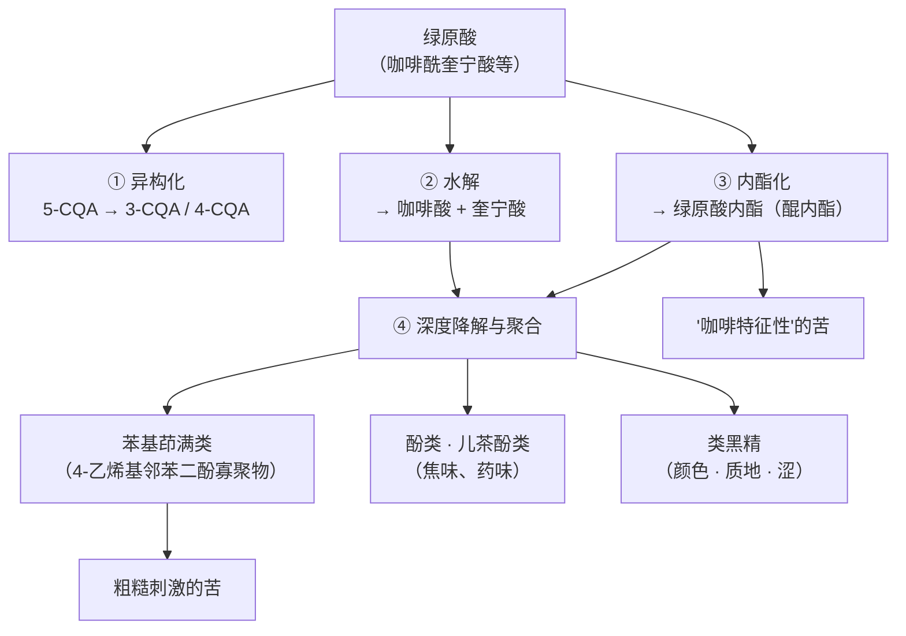
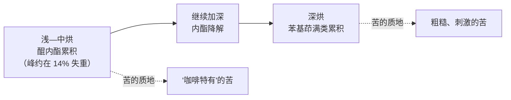

# 第 17 章 烘焙的化学 ②：绿原酸的去路与苦味的真正来源

> **本章目标**：讲清楚咖啡里被误解最久的一件事——**咖啡为什么苦**。
>
> 流传最广的答案是"因为咖啡因"。
> 而以感官为导向的分离研究给出的答案是：**主要的苦味驱动者是
> [绿原酸](../../glossary.md#cga)的烘焙产物**，咖啡因的角色至今"尚不清楚"（研究者原话）。
>
> 这一章沿着一条线索走到底：**生豆里含量最高的那一类酚，在烘焙中去了哪里。**
> 它会分成四条路，分别落进**苦味、涩感、焦味与颜色**四个桶里——
> 这是全书最完整的一条"一个前体 → 多个感受"的因果链。
>
> 学完这一章，你就能回答一个实际问题：
> **"浅烘的苦"和"深烘的苦"为什么不是同一种苦？**

## 17.1 绿原酸：生豆里最大的一类酚

[绿原酸](../../glossary.md#cga)（chlorogenic acids, CGA）不是一种物质，而是**一族酯**：
由**咖啡酸、阿魏酸、对香豆酸**等肉桂酸类与**奎宁酸**缩合而成，每一组至少有三个异构体[^1]。

| 项 | 内容 |
|----|------|
| 主要类别 | 咖啡酰奎宁酸（CQA）、二咖啡酰奎宁酸、阿魏酰奎宁酸（FQA）、对香豆酰奎宁酸，以及混合二酯[^1] |
| 生豆含量 | **在所有植物里属于最高之列**，干基可达 **14%**[^1]；一份手册章节汇编的阿拉比卡生豆值为 **8.1%**（干基）[^2] |
| 熟豆含量 | 同一张表给出的阿拉比卡熟豆值为 **2.5%**（干基）[^2] |
| 烘焙中的命运 | **异构化、水解、降解**，并部分转化为**醌内酯**与**类黑精**[^1] |

> **两条读法提醒**：
> ① "14%"是该综述给出的**上限**，不是典型值；实际随物种与产地变化很大（[第 1 章](../01-foundation/01-bean-composition.md)）；
> ② 手册表里生豆列与熟豆列**来自不同原始来源**[^2]，**不能相减当作损失量**——
> 这条纪律在[第 16 章](16-roasting-chemistry-1.md)已经强调过。

关于"烘掉了多少"，有一条可核对的定量描述来自一篇综述转引的研究[^3]：

> 在中浅烘焙条件下，两支埃塞俄比亚咖啡的绿原酸相对生豆下降约 **55%**，
> 另一支只下降约 **30%**；**深烘时平均下降约 90%**[^3]。

> **本书对这组数字的标注**：**仅见于该综述的转引**，且是单一研究、单一产地组。
> 本书用它来说明**量级与方向**（中浅烘掉一半上下、深烘掉大部分），
> **不把它当作通用系数**。

## 17.2 一个前体，四条去路

四条路对应四种可感受到的结果，下面逐条给证据。

## 17.3 第三条路最关键：内酯的峰出现在浅中烘

**醌内酯**（[绿原酸内酯](../../glossary.md#cql)，chlorogenic acid lactones, CGL）
是绿原酸在烘焙中失水成环的产物。一项用合成标准品定量的研究给出了完整曲线[^4]：

| 项 | 结果 |
|----|------|
| 鉴定出的内酯 | **7 种**（3-CQL、4-CQL、3-pCoQL、4-pCoQL、3-FQL、4-FQL、3,4-diCQL） |
| 最丰富的一种 | **3-CQL**；阿拉比卡峰值 **230 ± 9 mg/100 g**（干重），罗布斯塔 **254 ± 4** |
| 峰值出现在 | **浅中烘（约 14% 失重）** |
| 第二丰富 | 4-CQL：**116 ± 3**（阿拉比卡）、**139 ± 2**（罗布斯塔） |
| 转化率上限 | 内酯最大量约为**可用前体的 30%** |
| 一个反直觉发现 | 熟豆中 3-CQL 与 4-CQL 的相对比例与生豆中它们前体的比例**相反**——作者据此推断**烘焙先让绿原酸异构化，再形成内酯**，因此**熟豆里的内酯水平并不反映生豆里前体的水平** |

> **最后一行是本节的重点，值得单独读一遍**：
>
> **"生豆绿原酸含量高 ⇒ 熟豆内酯多 ⇒ 更苦"这条推理链，在这项研究里被直接否定了。**
> 中间隔着一步**异构化**，而异构化受烘焙条件影响。
>
> 这与[第 16 章](16-roasting-chemistry-1.md)的主题一致：**烘焙不是按比例缩放生豆，而是重排它。**

异构化本身也有独立证据：另一项对生豆与中烘豆冲煮液的分析报告，
**烘焙引起异构化——5-*O*-咖啡酰奎宁酸下降，3-*O*- 与 4-*O*- 衍生物相应上升**[^5]。

> （同一研究还报告了抗氧化能力方面的变化。**本书不复述、也不评价这一部分**——
> 按[第 5 章](../01-foundation/05-health-evidence.md)的红线，化学抗氧化指标与健康结论之间隔着整条证据链。）

**第二条路（水解）的产物也有去处**：核磁共振追踪显示烘焙中**奎宁酸类被生成**[^6]；
一篇综述则记载，**γ-奎宁内酯**（奎宁酸的内酯）与 **syllo-奎宁酸**在常规烘焙条件下生成[^3]。
奎宁酸本身是[第 1 章](../01-foundation/01-bean-composition.md)提到的感知酸度相关酸之一[^7]。

## 17.4 深烘的苦：从内酯变成另一类分子

现在到了本章最有价值的一段证据——**它解释了"深烘的苦不一样"这件事**。

一项系统研究了烘焙参数与热水渗滤对苦味物浓度影响的工作报告[^8]：

> **醌内酯在浅到中烘时生成**，并呈现"**咖啡特征性的苦味轮廓**"；
> **在重烘焙时，它们降解成粗糙刺激的（harsh）4-乙烯基邻苯二酚寡聚物**[^8]。

而那一类"4-乙烯基邻苯二酚寡聚物"是什么，另一项结构解析研究给了答案[^9]：

| 项 | 内容 |
|----|------|
| 来源 | 加热**咖啡酸**产生的苦味物质，其苦味被描述为"令人联想到重烘意式咖啡的苦" |
| 鉴定数量 | **10 种**苦味化合物，识别阈值 **23~178 μmol/L** |
| 其中 | **8 种是多羟基苯基茚满**（[phenylindanes](../../glossary.md#phenylindane)），推定由 **4-乙烯基邻苯二酚寡聚**而来 |

把两条接起来，就是一条完整的时间线：

> **所以"浅烘的苦"与"深烘的苦"不是同一种苦，是两类不同的分子在起作用**[^8][^9]。
>
> 这条结论有三个实用推论：
>
> 1. **"苦＝烘太深"是不完整的**——浅中烘也有苦，只是苦的**质地**不同；
> 2. **深烘的苦不是"更多的同一种苦"**，所以**靠调冲煮把深烘的苦调成浅烘的苦是做不到的**；
> 3. **不同类别的苦味物，萃取行为也不同**[^8]——这条直接通向第四部分：
>    **同一支豆，改变萃取参数会改变"你取出了哪一类苦"**，而不只是"取出了多少苦"。

补两类同样被鉴定过的苦味物，说明这个体系有多复杂：

| 类别 | 阈值 | 出处 |
|------|------|------|
| 一个具体的绿原酸内酯（3-*O*-咖啡酰-epi-γ-奎宁内酯） | **58 μmol/L** | [^10] |
| （呋喃-2-基）甲基化的苯二酚与苯三酚类 | **100~537 μmol/L** | [^11] |
| 奎宁酸/绿原酸与斯特雷克醛的缩醛加成物 | CQA 加成物 **48~297 μmol/L** | [^12] |

## 17.5 酚与儿茶酚：焦味、药味从哪来

绿原酸水解出的两个碎片各自受热会生成什么？一项把**奎宁酸、咖啡酸、绿原酸**
分别在氮气、空气与氦气流下加热的研究给出了直接答案[^13]：

| 观察 | 内容 |
|------|------|
| 产物总量 | **咖啡酸产生的挥发物总量最多** |
| 氧气的作用 | 奎宁酸与绿原酸在**氮气**下产生的挥发物种类**多于**空气下——作者据此认为**氧气在这类热降解中不起重要作用** |
| 酚类的量 | 总酚从 60.6 μg/g（氦气下的奎宁酸）到 **89,893.7 μg/g**（氦气下的咖啡酸）不等 |
| 归属 | **酚主要来自[奎宁酸](../../glossary.md#quinic-acid)**；[**儿茶酚类**](../../glossary.md#catechol)**来自[咖啡酸](../../glossary.md#caffeic-acid)** |
| 一个反直觉现象 | 这三种酸**都不含氮**，但产物中却回收到**吡啶、吡咯与吡嗪**类含氮杂环 |

> **三条要点**：
>
> 1. **"焦味/烟味/药味"有具体的分子来源**：酚类与儿茶酚类[^13]，
>    而它们的前体正是绿原酸的两个碎片；
> 2. **无氧也能生成**：儿茶酚在厌氧条件下依然形成，说明**不是氧化降解**[^13]——
>    这提醒我们别把烘焙里的一切都归给"氧化"；
> 3. **不含氮的原料产出含氮杂环**，说明**体系里的反应会相互串联**——
>    这些模型实验里的氮只能来自共存的杂质或反应器环境，
>    在真实豆子里更是与氨基酸池耦合在一起（[第 16 章](16-roasting-chemistry-1.md)）。

## 17.6 那么，咖啡的苦到底是谁贡献的

现在可以正面回答本章的核心问题了。证据分三层。

**第一层：感官导向的分离**

一项以**生物响应（味觉）为导向**逐级分离咖啡饮料的研究，直接指认了主要苦味驱动者[^14]：

> 主要的苦味驱动者是**羟基肉桂酰奎宁酸（即绿原酸类）的烘焙产物**（醌内酯），
> **而不是咖啡因**；所鉴定苦味物的识别阈值在 **9.8~180 μmol/L**（水中）[^14]。

**第二层：咖啡因的实际角色被两次限制**

| 证据 | 结论 |
|------|------|
| 咖啡因与绿原酸成络的核磁与感官实验[^15] | 该络合**对咖啡因的苦味没有影响** |
| 在天然浓度下加入类黑精[^15] | 咖啡因的苦味强度被**削弱约一半** |
| 该文的自述[^15] | 咖啡因"在咖啡感官知觉中的角色**仍不清楚**" |

**第三层：受体侧**

苦味受体研究指出 **TAS2R43** 被认为是识别咖啡苦味的关键受体之一，
并把咖啡因与咖啡醇列为咖啡中的苦味物[^16]。
同时，人类苦味受体只有**约 25~26 个**（不同文献计数口径不同，见[第 4 章](../01-foundation/04-perception.md)），
而咖啡里的苦味物远多于此——**多种分子共用少数受体，且存在拮抗，
所以苦味强度不能简单相加**（[第 4 章](../01-foundation/04-perception.md)）。

> **本书对"咖啡因占苦味多少百分比"的立场没有变**：
> 圈内流传的"10%~30%"**找不到一手出处**，本书**不引用任何百分比**
> （见[出处与资料登记 §六 #3](../../standards.md)）。
> 能说的是：**主要驱动者是绿原酸的烘焙产物[^14]，
> 而咖啡因的贡献还会被类黑精削弱约一半[^15]。**

## 17.7 涩不是苦：两种不同的感受

很多人把"涩"并进"苦"里，但它们在生理上就不是一回事（[第 4 章](../01-foundation/04-perception.md)：
涩是**口腔触觉/化学触觉**，苦是**味觉**）。

咖啡上的直接证据：一个**富酚的类黑精级分**被分离并做了感官评价，
作者称这是"**首个类黑精参与咖啡复杂触觉风味轮廓的证据**"，
该级分在"**咖啡相关浓度**"下能产生可感知的[涩感](../../glossary.md#astringency)[^17]。

另有一项在不同烘焙度下做的冷萃研究报告：随烘焙度加深，
冷萃液中的类黑精显著上升，感官上**坚果味、涩感、苦味、body 与余韵强度都上升**[^18]。

> **把这两条与 §17.4 合起来**：
>
> **深烘同时增加了三件事**——粗糙的苦（苯基茚满类[^9]）、涩（富酚类黑精[^17]）、
> 以及 body 与余韵的强度[^18]。
> 所以"深烘豆喝起来更沉更粗糙"不是一个感受，而是**至少三条独立的化学线索叠加**。

## 17.8 通向第四部分的一句话

本章最后要留一个伏笔。那项研究在讨论苦味物浓度时，除了烘焙参数，
还专门考察了**热水渗滤**的影响，并指出：**不同类别的化合物萃取行为不同**[^8]。

> **这意味着：你手里的旋钮不仅决定"取出多少"，还决定"取出哪一类"。**
>
> 同一支深烘豆，用不同的水温、粒径与接触时间，
> 取出的苦味物**构成比例**可以不同——这正是第四部分（萃取原理）要展开的内容。
> [第 1 章](../01-foundation/01-bean-composition.md)引用过的冷萃对照实验也指向同一点：
> **把浓度统一到相同 TDS 之后，热冲与冷冲的苦、酸仍显著不同**——
> **浓度相同不等于成分格局相同。**

## 17.9 常见说法辨析

按本书约定标注**证据强度**：✅ 有共识 / ⚠️ 有争议 / ❌ 明确错误 / **缺乏证据**。

| 说法 | 判定 | 说明 |
|------|------|------|
| "咖啡的苦来自咖啡因" | ❌ **与感官导向的分离结果不符** | 主要苦味驱动者是**绿原酸的烘焙产物**[^14]；咖啡因的苦还会被类黑精削弱约一半[^15]，研究者自述其感官角色"仍不清楚"[^15] |
| "咖啡因占苦味 10%~30%" | **缺乏证据** | 本书**未找到任何给出该百分比的一手文献**（[出处登记 §六 #3](../../standards.md)） |
| "绿原酸高的生豆，烘出来一定更苦" | ❌ **有直接反证** | 熟豆内酯的相对水平**与生豆前体的相对水平相反**，中间隔着异构化[^4]。"生豆成分 → 熟豆成分"不是线性缩放 |
| "深烘就是苦味更多" | ⚠️ **是苦的种类变了** | 醌内酯在浅中烘生成、呈现"咖啡特征性"的苦；重烘时它们**降解成粗糙的 4-乙烯基邻苯二酚寡聚物**[^8][^9] |
| "涩就是苦得厉害" | ❌ **两种感受** | 涩属于触觉通路（[第 4 章](../01-foundation/04-perception.md)）；咖啡上已有**富酚类黑精产生涩感**的直接证据[^17] |
| "深烘咖啡的焦味是烧焦的糖" | ⚠️ **至少还有另一条来源** | 酚类主要来自**奎宁酸**、儿茶酚类来自**咖啡酸**[^13]，而它们都是绿原酸的水解碎片 |
| "烘焙里的降解都是氧化" | ❌ **与实验不符** | 奎宁酸与绿原酸在**氮气**下产生的挥发物种类多于空气下；儿茶酚在厌氧条件下照样形成[^13] |
| "绿原酸掉得越多烘得越深" | ⚠️ **方向对，但不能当刻度** | 可核到的是量级：中浅烘约掉 30%~55%、深烘约掉 90%（**仅见于综述转引，单一研究**）[^3]。本书不把它当通用系数 |
| "苦味物越多越苦" | ⚠️ **忽略了受体与拮抗** | 人类苦味受体只有约 25~26 个，且存在拮抗剂，**混合物的苦不能简单相加**（[第 4 章](../01-foundation/04-perception.md)） |
| "把咖啡冲淡一点，苦味结构就一样只是变淡" | ❌ **与实验不符** | 不同类别的苦味物**萃取行为不同**[^8]；把浓度统一后热冲与冷冲的苦、酸仍显著不同（[第 1 章](../01-foundation/01-bean-composition.md)） |
| "绿原酸是好东西，所以浅烘更健康" | **本书不做评价** | 本书只复述化学变化，不做任何健康推断（[第 5 章](../01-foundation/05-health-evidence.md)的红线）；相关抗氧化指标的变化本书**不复述** |

## 17.10 🔎 买豆与冲煮时的用处

1. **描述苦的时候，先描述它的"质地"**：是**圆润、类似黑巧的苦**，
   还是**粗糙、刺激、附着在舌面的苦**？前者更可能来自醌内酯一侧，
   后者更可能来自深烘的苯基茚满一侧[^8][^9]。
   **这一句描述比"太苦了"对烘焙商有用一百倍。**
2. **判断"是不是烘过头"时，看的不是苦的强度，而是苦的类型 + 是否伴随涩与焦味**：
   深烘会同时抬高粗糙苦、涩与 body[^9][^17][^18]。
3. **喝到明显涩感，先别归因于萃取过度**：涩有独立的化学来源[^17]；
   可以先换一支烘焙度更浅的同产地豆做对照。
4. **"想喝不苦的咖啡"不等于"买浅烘"**：浅中烘正是醌内酯的峰区[^4][^8]。
   更可操作的是**降低萃取强度**（第四部分），或选择苦味物萃取更少的冲煮方式。
5. **别用"绿原酸含量"推断杯中表现**：中间隔着异构化、内酯化与深度降解三步[^4]，
   而这三步由烘焙条件决定。

## 17.11 思考题

1. 请画出（或写出）绿原酸在烘焙中的四条去路，并说明每条路最终对应哪一种可感受到的结果。
2. 熟豆中 3-CQL 与 4-CQL 的相对水平与生豆中其前体的相对水平相反。
   请解释这个观察为什么能否定"生豆绿原酸高 ⇒ 熟豆更苦"这条推理，
   并说出它对"用生豆成分预测杯中表现"这件事的一般性启示。
3. 请说明"浅烘的苦"与"深烘的苦"在分子层面的差别，
   并解释为什么**靠调整冲煮参数**无法把后者变成前者。
4. 三种不含氮的酸在加热后却产生了吡啶、吡咯与吡嗪。
   请说明这个结果提醒我们在读模型实验时要注意什么。
5. **【案例】** 一位朋友说："我买了低咖啡因的豆，所以应该不苦。"
   请用本章的证据回应，并指出他的推理里缺了哪一步。
6. **【案例】** 一杯深烘美式，你喝到"苦 + 涩 + 有点烧焦味"。
   请分别写出这三种感受**最可能**对应的化学来源，
   并给出一个能区分"烘焙问题"与"冲煮问题"的验证步骤。
7. 本章说"不同类别的苦味物萃取行为不同"。
   请预测：如果你把同一支豆的萃取时间延长一倍，杯中苦味的**强度**与**质地**
   会分别发生什么变化？你会怎么验证自己的预测？
8. **【辨识】** 请找出三处（书、文章、视频）关于"咖啡为什么苦"的说法，
   逐一对照本章证据判断其正确性，并记录它们各自给了出处没有。

> 📖 **参考答案**（想清楚再看）：[Q1](../../qa/17-cga-and-bitterness-qa.md#q1) ·
> [Q2](../../qa/17-cga-and-bitterness-qa.md#q2) · [Q3](../../qa/17-cga-and-bitterness-qa.md#q3) ·
> [Q4](../../qa/17-cga-and-bitterness-qa.md#q4) · [Q5](../../qa/17-cga-and-bitterness-qa.md#q5) ·
> [Q6](../../qa/17-cga-and-bitterness-qa.md#q6) · [Q7](../../qa/17-cga-and-bitterness-qa.md#q7) ·
> [Q8](../../qa/17-cga-and-bitterness-qa.md#q8)

## 17.12 本章实操

### 🅐 无器具版 · 任务一：给"苦"建一套自己的描述词

只需要你手边任何一杯咖啡。目标不是学会形容词，而是**把苦拆成可记录的维度**：

| 维度 | 这一杯的记录 | 提示 |
|------|------------|------|
| **强度**（1~5） | | 与"质地"分开记 |
| **起始时间**：入口即苦 / 中段 / 吞咽后 | | 与萃取和分子种类都有关 |
| **质地**：圆润·干净 / 粗糙·刺激 / 附着感强 | | 粗糙刺激更接近深烘一侧[^9] |
| **持续时间**：几秒钟 / 很久不散 | | |
| **是否伴随涩**（口腔发干、发紧） | | 涩是**触觉**，不是味觉（[第 4 章](../01-foundation/04-perception.md)） |
| **是否伴随焦味/烟味/药味** | | 可能对应酚与儿茶酚一侧[^13] |

> **连续记录五杯不同的咖啡**，你会发现"苦"这个字下面至少藏着三种不同的东西。
> 这正是[第六部分](../../roadmap.md)（杯测与感官）要系统训练的能力，本章先起个头。

### 🅐 无器具版 · 任务二：给三段"咖啡为什么苦"的说法做证据体检

把思考题 8 做成可留存的表：

| 说法出处 | 它的主张 | 本章证据 | 判定 | 它给出处了吗 |
|---------|---------|---------|------|------------|
| | | | | |
| | | | | |
| | | | | |

> **参考判据**：凡说"苦主要来自咖啡因"的，与感官导向的分离结果不符[^14]；
> 凡给出"咖啡因占苦味 X%"的，本书**未找到一手出处**——
> 可以直接问对方要出处，这是最有效的一个动作。

### 🅑 有条件版 · 任务三：同豆三烘焙度的"苦的质地"盲测（备齐后再做）

> **所需**：同一支豆的浅、中、深三种烘焙度；同一套冲煮器具与参数；同伴编号。
> **替代方案**：用三支烘焙度明显不同的豆，并在记录中注明"豆不同"这层混杂。

| 编号 | 苦强度(1~5) | 苦的质地 | 涩(1~5) | 焦味/烟味 | 你猜的烘焙度 |
|------|-----------|---------|--------|----------|------------|
| ① | | | | | |
| ② | | | | | |
| ③ | | | | | |

> **预期与解读**：随烘焙度加深，本章预期**苦的质地向"粗糙刺激"移动**[^8][^9]，
> 且**涩与 body 同向上升**[^17][^18]。
> **如果你的结果不是这样**，先别怀疑文献——先检查三支豆是否同一支豆、
> 冲煮是否真的一致、以及你是否真的盲测了（[第 11 章](../02-upstream/11-fermentation-experimental.md)的标签效应）。

### 🅑 有条件版 · 任务四："同浓度不同格局"的验证（备齐后再做）

> **所需**：TDS 计（或折光仪）；同一支豆；两种冲煮方式（如热冲 vs 冷萃）。
> **替代方案**：没有 TDS 计，就用"加水稀释到两杯看起来同样浓、喝起来同样'厚'"的粗略方式，
> 并在结论里注明这是粗略对齐。

1. 用两种方式各做一杯；
2. **把两杯稀释到相同 TDS**（或粗略对齐浓度）；
3. 盲测比较：

| 观察项 | 热冲 | 冷萃 |
|-------|------|------|
| 苦强度 | | |
| 苦的质地 | | |
| 酸强度 | | |
| 涩 | | |
| 花香/果香 | | |

> **这个实验复现的是[第 1 章](../01-foundation/01-bean-composition.md)引用过的那项对照**：
> 把样品**统一稀释到 2% TDS 并在同一温度下供样**后，
> 热冲的苦、酸仍显著高于冷冲，而花香冷冲更高。
>
> **它要建立的直觉**：**"浓度"与"成分格局"是两件事。**
> 这个直觉是第四部分（萃取原理）的入场券。

---

## 17.13 本章依据

完整书目信息登记在[出处与资料登记 §4.20](../../standards.md)。

- **[CGA1]** Farah, A., & Donangelo, C. M. (2006). *Phenolic compounds in coffee*.
  *Brazilian Journal of Plant Physiology* 18(1):23–36。用到：绿原酸是生豆酚类的主要成分、
  干基可达 **14%**；主要类别（CQA、二咖啡酰奎宁酸、FQA、对香豆酰奎宁酸与混合二酯，
  每组至少三个异构体）；加工中可被**异构化、水解或降解**；高温烘焙把部分绿原酸转化为
  **醌内酯**并与其他化合物一起形成**类黑精**。已读摘要。
- **[CGA2]** Farah, A., de Paulis, T., Trugo, L. C., & Martin, P. R. (2005).
  *Effect of roasting on the formation of chlorogenic acid lactones in coffee*. *JAFC* 53(5):1505–1513。
  本章 §17.3 主干：**7 种**内酯；**3-CQL** 峰值 **230 ± 9**（阿拉比卡）与 **254 ± 4**（罗布斯塔）mg/100 g 干重，
  出现在**浅中烘（约 14% 失重）**；4-CQL 为 **116 ± 3 / 139 ± 2**；
  内酯最大量约为**可用前体的 30%**；**熟豆中 3-CQL 与 4-CQL 的相对水平与生豆前体相反**，
  提示先异构化后内酯化，**熟豆内酯水平不反映生豆前体水平**。已读摘要。
- **[CGA3]** Stalmach, A., Mullen, W., Nagai, C., & Crozier, A. (2006).
  *On-line HPLC analysis of the antioxidant activity of phenolic compounds in brewed, paper-filtered coffee*.
  *Brazilian Journal of Plant Physiology* 18(1):253–262。**本书只用其中一条化学观察**：
  烘焙引起**异构化**——5-*O*-咖啡酰奎宁酸下降、3-*O*- 与 4-*O*- 衍生物上升。
  其抗氧化能力相关结果**本书不复述、不评价**。已读摘要。
- **[CGA4]** Moon, J.-K., & Shibamoto, T. (2010). *Formation of volatile chemicals from thermal degradation
  of less volatile coffee components: quinic acid, caffeic acid, and chlorogenic acid*. *JAFC* 58(9):5465–5470。
  用到：**咖啡酸产生的挥发物总量最多**；奎宁酸与绿原酸在**氮气**下产物种类多于空气下，
  作者据此认为**氧气不起重要作用**；总酚 60.6~**89,893.7 μg/g**；
  **酚主要来自奎宁酸、儿茶酚来自咖啡酸**；三种不含氮的酸却回收到吡啶、吡咯与吡嗪。已读摘要。
- **[B1][B2][B3][B4][B5][B6][B7][B8]**（均为第 1 章已登记）本章分别用于：
  主要苦味驱动者是绿原酸的烘焙产物而非咖啡因、阈值 9.8~180 μmol/L [B1]；
  4-乙烯基邻苯二酚寡聚物（含 8 种多羟基苯基茚满）、阈值 23~178 μmol/L、
  其苦"令人联想到重烘意式" [B2]；**醌内酯在浅中烘生成并呈咖啡特征性苦、
  重烘时降解为粗糙的 4-乙烯基邻苯二酚寡聚物**，且**不同类别化合物萃取行为不同** [B3]；
  单一内酯阈值 58 μmol/L [B4]；（呋喃-2-基）甲基化苯二酚/苯三酚阈值 100~537 μmol/L [B5]；
  斯特雷克醛加成物阈值 [B6]；咖啡因—绿原酸络合**不改变苦味**、类黑精把咖啡因苦味**削弱约一半**、
  以及"咖啡因的感官角色仍不清楚" [B7]；TAS2R43 与咖啡苦味 [B8]。
- **[A3]**（第 1 章已登记）用到：**富酚类黑精级分**在咖啡相关浓度下产生可感知涩感，
  作者称为类黑精参与触觉风味轮廓的**首个证据**。
- **[A6]**（第 1 章已登记）用到：随烘焙度加深，冷萃液中类黑精显著上升，
  **坚果味、涩感、苦味、body 与余韵强度上升**。
- **[RC1]**（第 16 章已登记）用到：阿拉比卡生豆绿原酸 **8.1%**、熟豆 **2.5%**（干基），
  以及该表两列来自不同来源的提醒。
- **[RC2]**（第 16 章已登记）用到：烘焙中**奎宁酸类被生成**。
- **[C2]**（第 1 章已登记）用到：绿原酸随烘焙下降的量级（中浅烘约 30%~55%、深烘约 90%，
  **综述转引、单一研究**）；**γ-奎宁内酯与 syllo-奎宁酸**在常规烘焙条件下生成。
- **[A1]**（第 1 章已登记）用到：奎宁酸属于被研究者按"风味性质"选定测定的有机酸之一。

**本章刻意没写的东西**：

- **"咖啡因占苦味百分之多少"**——无一手出处（[出处登记 §六 #3](../../standards.md)）；
- **绿原酸损失率的通用系数**——只写量级并标注"仅见于综述转引"；
- **任何抗氧化能力与健康的关联**——[第 5 章](../01-foundation/05-health-evidence.md)的红线；
- **"某个烘焙度的苦味物浓度是多少"**——文献给的是模型体系与特定样品的值，不能当查表；
- **成分的"溶出先后顺序表"**——[出处登记 §七](../../standards.md)的不采信条目，
  本章只写"不同类别萃取行为不同"这一条有出处的表述[^8]，留待第 21~24 章展开。

[^1]: 本书编号 [CGA1]：Farah & Donangelo (2006), *Braz. J. Plant Physiol.* 18(1):23–36。
[^2]: 本书编号 [RC1]：Oestreich-Janzen (2010), *Chemistry of Coffee*（第 16 章已登记）。
[^3]: 本书编号 [C2]：Bastian 等 (2021), *Foods* 10(11):2827（第 1 章已登记，开放获取）。
[^4]: 本书编号 [CGA2]：Farah 等 (2005), *JAFC* 53(5):1505–1513。
[^5]: 本书编号 [CGA3]：Stalmach 等 (2006), *Braz. J. Plant Physiol.* 18(1):253–262。
[^6]: 本书编号 [RC2]：Wei 等 (2012), *JAFC* 60(4):1005–1012（第 16 章已登记）。
[^7]: 本书编号 [A1]：Bratthäll 等 (2024), *Heliyon* 10(5):e26625（第 1 章已登记，开放获取）。
[^8]: 本书编号 [B3]：Blumberg、Frank & Hofmann (2010), *JAFC* 58(6):3720–3728（第 1 章已登记）。
[^9]: 本书编号 [B2]：Frank 等 (2007), *JAFC* 55(5):1945–1954（第 1 章已登记）。
[^10]: 本书编号 [B4]：Frank 等 (2008), *JAFC* 56(20):9581–9585（第 1 章已登记）。
[^11]: 本书编号 [B5]：Kreppenhofer、Frank & Hofmann (2011), *Food Chemistry* 126(2):441–449（第 1 章已登记）。
[^12]: 本书编号 [B6]：Gigl 等 (2021), *JAFC* 69(3):1027–1038（第 1 章已登记）。
[^13]: 本书编号 [CGA4]：Moon & Shibamoto (2010), *JAFC* 58(9):5465–5470。
[^14]: 本书编号 [B1]：Frank、Zehentbauer & Hofmann (2006), *Eur. Food Res. Technol.* 222(5–6):492–508（第 1 章已登记）。
[^15]: 本书编号 [B7]：Gigl、Kreissl & Frank (2026), *JAFC* 74(23):18243–18252（第 1 章已登记，开放获取）。
[^16]: 本书编号 [B8]：Kim 等 (2026), *Nature Structural & Molecular Biology*（第 1 章已登记，开放获取）。
[^17]: 本书编号 [A3]：Linne 等 (2025), *Food & Function* 16(7):2870–2880（第 1 章已登记）。
[^18]: 本书编号 [A6]：Shi 等 (2024), *Foods* 13(19):3119（第 1 章已登记，开放获取）。

---

**下一章**：第 18 章 结构变化——一爆、二爆、豆内压力与孔隙，
以及"为什么烘焙度直接改变能被萃出多少"。
