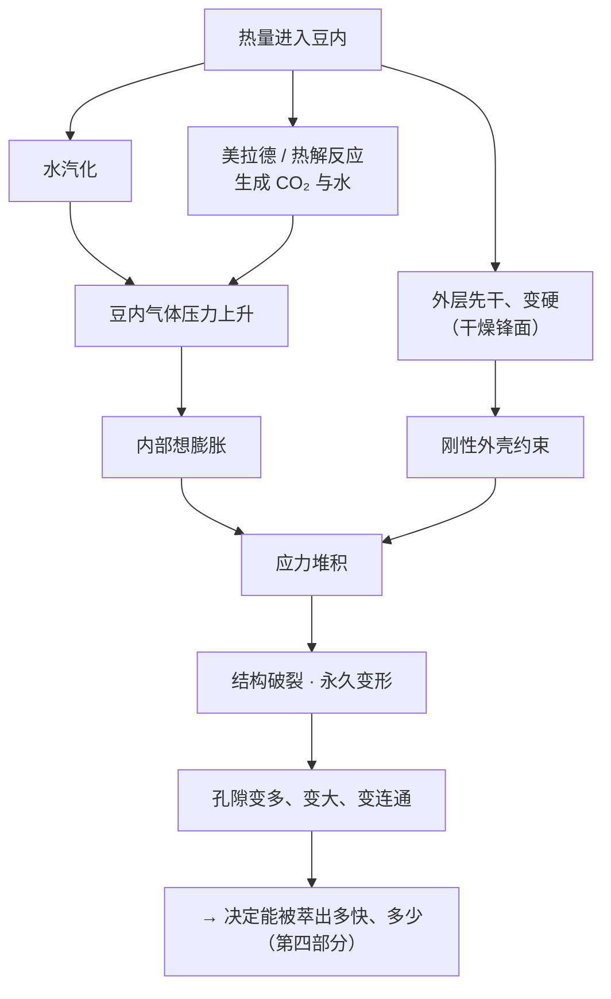
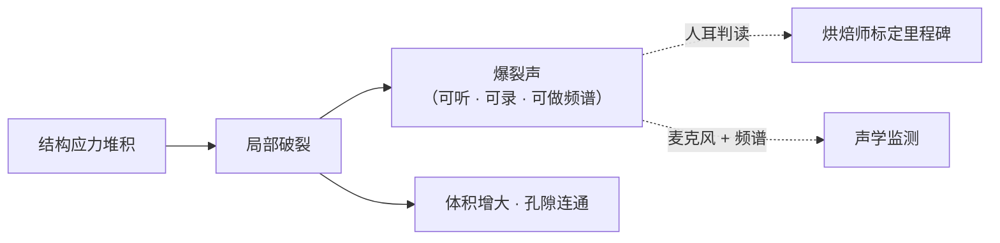
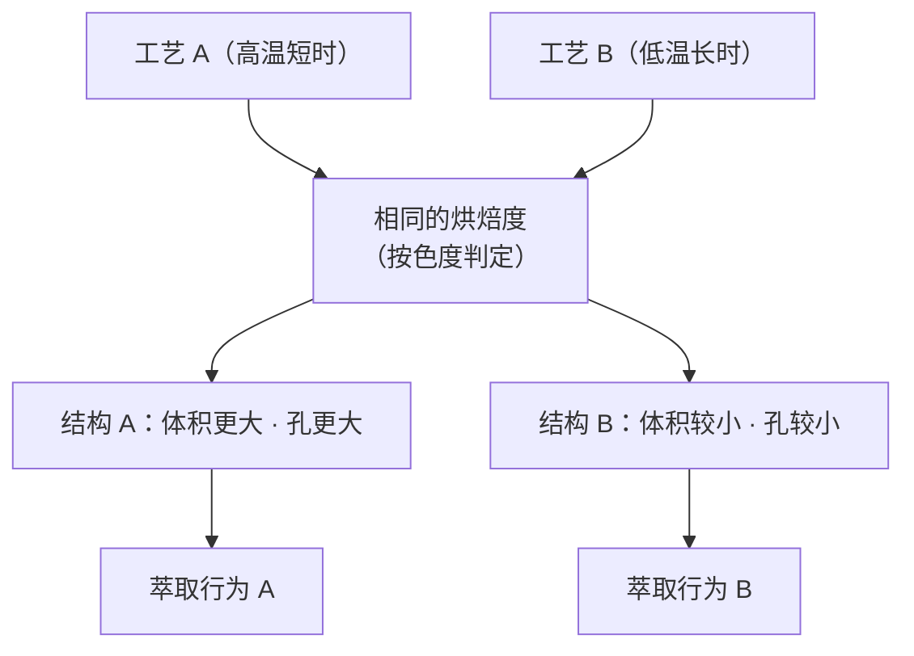

# 第 18 章 结构变化：一爆、二爆、豆内压力与孔隙

> **本章目标**：把烘焙的另一半讲完。
>
> 第 16、17 章讲的是**化学改造**——分子被重排成新的分子。
> 这一章讲**结构改造**：一颗致密、几乎不透水的种子，被改造成一块**多孔的脆性材料**。
>
> 这件事的重要性常被低估。因为：
>
> - **化学决定"里面有什么"**，
> - **结构决定"水能不能拿到它、拿得多快、以及你磨出来的是什么粒径"**。
>
> 学完这一章，你会明白一件很实际的事：
> **换一个烘焙度，不只是换了味道，还换了你手里的研磨刻度与冲煮速度。**

## 18.1 生豆是一块致密的固体

生豆不是海绵。它的胚乳细胞壁厚而致密（[第 2 章](../01-foundation/02-cherry-anatomy.md)），
水很难进去，也很难出来。

有一项以**超声辅助萃取**为背景的多尺度研究，顺带把这件事量化了[^1]：

| 样品 | 总孔隙率 | **连通孔隙率** | 传质系数 |
|------|---------|--------------|---------|
| 生豆 | 4.47% | **0%** | 0.16 min⁻¹ |
| 120 ℃ 热处理 | 9.17% | 3.79% | 0.38 min⁻¹ |
| 180 ℃ 热处理 | 13.52% | 5.98% | 0.46 min⁻¹ |

> **这张表里最重要的一栏是"连通孔隙率"**：生豆的连通孔隙被测为 **0%**[^1]。
> 有孔但**互不相通**，水就没有路径；随着受热程度加深，孔隙不但变多，而且**连起来了**，
> 传质系数随之上升。
>
> ⚠️ **三条使用边界**：① 这是 **120 / 180 ℃ 定温热处理**，不是商用烘焙机上的常规烘焙；
> ② 该研究的目标是超声萃取，不是冲煮；③ 绝对数值强烈依赖测量方法（见下）。
> 本书用它来说明**机理链条**（孔隙 → 连通 → 传质），**不把这些百分比当成烘焙豆的标准值**。

**为什么不能把这些百分比当标准值**——因为不同方法给出的数字差得很远：

| 研究 | 方法 | 生豆 | 熟豆 |
|------|------|------|------|
| [^1] | 孔结构表征（超声萃取背景） | 总孔隙 4.47% | 9.17%~13.52%（定温热处理） |
| [^2] | 电镜孔径与分布计算 | **9.8%** | **34.2%** |
| [^3] | X 射线显微 CT（试点规模喷动床） | — | 烘焙中孔隙率**增加最多约 60%** |

> **诚实说明**：这三行**不能横向比较**。孔隙率是一个**由测量方法定义**的量——
> 压汞、电镜图像阈值、显微 CT 体素分割各自"看得见"的孔尺寸范围不同。
> 本书从这组数据里只取一条**方向性结论**：
> **烘焙使豆从"接近实心"变成"高度多孔"，且孔隙之间变得连通。**

## 18.2 为什么会胀：气被困在里面

结构改造的驱动力是**豆内产生了气体，而它出不去**。

气体有两个来源，都在前两章出现过：

1. **水**：原有的水受热汽化（[第 15 章](15-roasting-physics.md)的干燥锋面）；
2. **反应产物**：美拉德与热解反应**生成 CO₂ 与水**。

第二条有直接的过程测量支持：一项用**非分散红外气体分析**监测排气的研究，
同时追踪了烘焙中 CO₂ 与水蒸气的释放，并指出所建立的**质量平衡能相当好地解释
称重法测得的失重**[^4]。同一研究还有一个对第 19 章很关键的发现，留到那里讲。

力学侧的依据来自一项**温度相关多孔黏弹性**建模：豆内出现**大幅应力堆积**，
原因正是"**黏弹性的内部被刚性弹性外壳束缚而无法自由膨胀**"[^5]；
同一课题组的传热传质模型则预测豆内存在**锐利的干燥锋面**[^6]。

> **本章不写的两个数**（延续[第 15 章](15-roasting-physics.md)的纪律）：
>
> - **豆内压力的具体数值**——本书未读到在真实烘焙过程中**直接测定豆内压力**的实验；
> - **豆心与豆表的温差数值**——同样只有模型预测（见[出处登记 §七](../../standards.md)）。

## 18.3 一爆与二爆：它们首先是"声音事件"

咖啡圈把一爆讲得很玄，但在文献里它的定义朴素得出奇：

> 一项罗布斯塔烘焙研究在正文里直接写：这种爆裂"**被定义为烘焙中豆子发出的爆裂声**"[^7]；
> 另一项以 ¹H NMR 追踪工业烘焙的研究把一爆定义为"**因种子破裂而产生的特征噪声**"[^8]。

更说明问题的是**最严谨的实验也是这么判的**：在一项 5 kg 商用滚筒机上做的色度研究里，
三个里程碑（转色、一爆、二爆）是由**一位有经验的烘焙师依据视觉与听觉线索**标定的[^9]。

**能不能机器化？能，但走的仍是声音这条路。**
一项声学状态监测研究用两支麦克风记录样品滚筒机（五种下豆温度、每种重复五次）的空气声压，
比较了**一爆与二爆在频谱组成上的差异**，并报告多数过程中声压级可按豆温分离[^10]。

> **本书对"一爆在多少度"的立场没有变**：**不写任何温度判据**。
> 理由在[第 15 章](15-roasting-physics.md)讲过——机器显示的是**探针周围**的温度，
> 依赖机型、装载率、探针位置与采样间隔；而豆内温度是一个**分布**。
> 可用的判据是**声音**（本节）与**颜色**（[第 19 章](19-roast-degree-measurement.md)）。

**关于"一爆是水汽、二爆是油脂或纤维素"这类机制归属**：
本书**未读到直接验证这一归属的实验**。能核到的是：两者**声学特征不同**[^10]，
且落在颜色轨迹上的不同位置[^9]。所以本书只写到这里。

## 18.4 一爆确实是个转折点——但这句话要有证据

"一爆是分水岭"是圈内共识。本书能找到**两条互相独立的定量证据**，
并且它们**都不依赖温度**：

| 证据 | 观察 | 出处 |
|------|------|------|
| 化学动态 | **可滴定酸度的峰总是出现在一爆**，且峰值几乎不随曲线与产地改变；到二爆回落到接近生豆水平 | [^11]（[第 15、16 章](16-roasting-chemistry-1.md)） |
| 理化性质 | 主要的理化性质改变发生在**一爆之后**；此时豆的**水分活度从 0.22 降到 0.15**；低水分活度下类黑精持续生成、5-CQA 与总酚缓慢降解 | [^7] |

> ⚠️ 第二行是**单一研究、单一罗布斯塔样品**（印尼楠榜），且那项研究的主要目的是找"临界烘焙水平"。
> 本书用它说明**方向**：一爆之后体系进入另一个状态；**不把 0.22 → 0.15 当作通用阈值**。

**两条证据合起来给出的可操作结论**：

> **停在一爆前后的哪一侧，比你用什么路径走到那里更能决定杯中表现**——
> 这与第 16 章 §16.6 的结论（就可滴定酸度而言"停在哪里比怎么走更重要"）是同一件事的两面。

## 18.5 同样的"烘焙度"，可以是不同的结构

这是本章最反直觉、也最有用的一条。

一项经典研究用**两种定义清晰的工艺**把咖啡烘到**相同的烘焙度**，
再用体积测定、压汞孔隙测定与电子显微镜比较结构[^12]：

> **高温工艺组的豆体积更大、孔体积更大、细胞壁上的微孔也更大。**[^12]

换句话说：

> **"烘焙度"不能唯一确定一颗豆的状态。** 路径也被写进了结构里。
> 这条与[第 15 章](15-roasting-physics.md)"同名曲线不是同一条曲线"、
> 以及[第 19 章](19-roast-degree-measurement.md)"三种烘焙度互不等价"构成同一组警告。

另外，结构演化在**豆内是不均匀的**：一项用时间分辨 X 射线显微 CT
逐颗追踪巴西、哥伦比亚、埃塞俄比亚三地豆子的研究报告，
从生豆到深烘孔隙率与孔径显著增加，但**增速并不随烘焙时间线性变化**，
且**不同来源的豆在孔隙与开裂的空间异质性上表现不同**[^13]。
更早的 μCT 工作同样观察到随烘焙进行总孔体积与孔隙率上升[^14]。

## 18.6 结构如何决定"能被萃出多少"

现在把结构接到杯子上。这里有一条**必须拆成两半**的因果链。

### 第一半：更深的烘焙 → 萃得**更快**

一组 1980 年代的动力学实验直接测了这件事：把生豆烘到不同程度、磨到**同一粒径区间**
（0.85~1.18 mm）再浸泡，测咖啡因浸出的半衰期[^15]：

> 轻度烘焙时半衰期**没有显著变化**；烘得更重时**下降约 40%**；
> 继续烘到焦化（scorching）再**下降约 30%**[^15]。

这与结构侧的观察互相印证：孔隙率随烘焙度上升（电镜法[^16]、显微 CT[^3][^13]），
连通性上升[^1]——**水的通道变多了**。

### 第二半：更深的烘焙 ≠ 萃得**更多**

一项 2024 年的研究用 30 组组合（2 支生豆 × 5 个烘焙度 × 3 个冲煮时间，
AeroPress、粉水比 1:15、折光仪测萃取率、HPLC 测咖啡因）报告[^16]：

> 扫描电镜显示**孔隙率随烘焙度上升**；
> 但**当烘焙失重超过约 12%~14% 时，萃取率普遍下降**[^16]。

作者的解释是：**可溶物本身在深烘时被分解或挥发掉了**[^16]。

> **把两半合起来，就是本章最值得记住的一句话：**
>
> **烘得越深，水越容易进去（更快），但里面能被带走的东西可能更少（更少）。**
> "快"与"多"是两件事——这条区分会在[第 22 章](../../roadmap.md)（浓度与萃取率）被再次放大。
>
> ⚠️ 第二半是**单一研究、单一冲煮方式、有限的时间与粒径组合**，作者自己也写明
> "无法对所有烘焙度与萃取率给出普适结论"[^16]。本书据此**不写任何"最佳失重率"**。

### 第三件事：烘焙度改变了你磨出来的粒径

这条最容易被忽略，但它每天都在影响你。

在前面那项色度研究中，研究者用**同一台实验室磨、同样的设定**磨了两个取样点[^9]：

| 取样点 | 粒径范围 | **中位粒径 D50** |
|--------|---------|-----------------|
| 一爆时取的样 | 25~1363 μm | **393 μm** |
| 二爆时取的样 | 25~553 μm | **96 μm** |

> **同一台磨、同样刻度，二爆样的中位粒径只有一爆样的约四分之一。**
>
> 原因就是本章的主题：**烘得越深，结构越脆**，同样的机械作用会把它碎得更小。
>
> 这条有一个立刻能用的推论：
> **"换豆要重调研磨"不是玄学，也不全是因为萃取速度变了——
> 你手里那个刻度本身就已经不是同一个粒径了。**
>
> ⚠️ 边界：这是两个取样点的**粒度分析**，不是系统的烘焙度—粒径标定实验，
> 也没有覆盖家用磨。本书**只取方向**。

## 18.7 结构的下游：水进去之后颗粒还会变

结构改造在杯子里还没结束。一项用激光衍射与显微镜测量的研究报告[^17]：

| 观察 | 内容 |
|------|------|
| 溶胀幅度 | 熟豆颗粒在水中**直径约增加 15%**（覆盖很宽的粒径范围） |
| 速度 | **30 秒内达到最终直径的 60%~80%**，约 **4 分钟**完成——**在常规冲煮的时间尺度之内** |
| 与什么无关 | 溶胀程度**与初始粒径无关，也与烘焙度无关** |
| 一个副产物 | 湿润过程伴随**颗粒侵蚀**：细粉比例上升，且**温度越高越明显** |

> **两条直觉**：
>
> 1. **你冲的不是你磨的那批颗粒**——它们会变大，还会掉渣（产生新的细粉）；
> 2. 作者指出，先前各研究对咖啡颗粒溶胀的结果差异很大，正是因为**没有把颗粒侵蚀与排气考虑进去**[^17]。
>    这提醒我们：连"颗粒变大了多少"这么简单的量，测起来都有坑。
>
> 这条直接通向[第 21 章](../04-extraction/21-what-is-extraction.md)（萃取的物理）与第 23 章（研磨）。

## 18.8 常见说法辨析

按本书约定标注**证据强度**：✅ 有共识 / ⚠️ 有争议 / ❌ 明确错误 / **缺乏证据**。

| 说法 | 判定 | 说明 |
|------|------|------|
| "一爆在 XXX ℃" | ❌ **不可通用** | 读数是**探针周围**温度，依赖机型、装载率、探针位置与采样间隔[^11]；豆内温度是分布[^6]。本书只用**声音与颜色**做判据 |
| "一爆是水蒸气造成的，二爆是油脂/纤维素造成的" | **缺乏证据** | 本书未读到直接验证这一机制归属的实验。可核到的是两者**频谱特征不同**[^10]、在颜色轨迹上位置不同[^9] |
| "一爆是个分水岭" | ✅ **有两条独立证据** | 可滴定酸度峰总在一爆[^11]；理化性质的主要改变发生在一爆之后[^7]。但**两条都不给温度** |
| "烘得越深越好萃" | ⚠️ **要拆成两件事** | **更快**有证据（同粒径下浸出半衰期下降[^15]，孔隙与连通性上升[^1][^16]）；**更多**则相反——失重超过约 12%~14% 后萃取率反而下降[^16] |
| "同样的烘焙度就是同样的豆" | ❌ **有直接反证** | 烘到相同烘焙度的两种工艺，豆体积、孔体积与细胞壁微孔都不同[^12] |
| "深烘豆要磨粗一点" | ⚠️ **现象常见，但原因常被说错** | 至少有两条机制同时指向这个操作：深烘萃取更快[^15]，**以及同刻度下深烘本来就磨得更细**[^9]。后一条常被忽略 |
| "熟豆孔隙率大约是 X%" | ⚠️ **数字取决于方法** | 同一件事被测成 34.2%[^2]、9.17%~13.52%[^1]、"增加最多约 60%"[^3]。跨方法比较绝对值没有意义 |
| "豆表出油说明豆新鲜/不新鲜" | **缺乏证据** | 见[出处登记 §七](../../standards.md)：未找到"出油量 ↔ 新鲜度"的一手文献 |
| "豆子有裂纹说明烘坏了" | **缺乏证据** | 开裂是烘焙结构演化的一部分；μCT 研究把孔隙与**开裂**一起当作正常演化来刻画，并观察到不同来源豆的空间异质性不同[^13] |
| "养豆就是等 CO₂ 排完" | ⚠️ **留到第 41 章** | 可核到的是：CO₂ 确实在烘焙中生成，并在储存期间继续释放[^4]。本书**不写排气的定量与"最佳养豆天数"** |
| "膨胀率/密度能反映'发展是否充分'" | **缺乏证据** | 本书未读到把密度或膨胀率与感官评价做对照的研究。密度作为烘焙度指标之一见[第 19 章](19-roast-degree-measurement.md) |

## 18.9 🔎 买豆与冲煮时的用处

1. **换烘焙度 = 同时换了三件事**：可溶物构成（第 16、17 章）、颗粒脆度 → 粒径[^9]、
   孔隙与连通性 → 萃取速率[^1][^15]。所以"换豆先重调研磨"是有物理依据的默认动作。
2. **同一支豆换了批次，先量一次粒径感**（手捻、看粉相）：
   如果同刻度明显更细，多半这批烘得更深。
3. **遇到"深烘但很薄"的杯子**，不要只往"萃取不足"想：
   深烘本身可能已经损失了可萃取物[^16]——换豆比调参数更快见效。
4. **看到"一爆后发展 XX 秒"的文案**，知道它描述的是**路径**；
   要判断结果还得看落点（第 19 章讲怎么读烘焙度）。
5. **冲煮的前 30 秒很重要，但原因不是玄学**：颗粒在这段时间里完成大半溶胀[^17]，
   同时在产生新的细粉——这正是不同注水方式会分岔的物理起点。

## 18.10 思考题

1. 生豆的**连通孔隙率**被测为 0%[^1]。请解释这个数字为什么比"总孔隙率"更能说明
   "生豆很难被萃取"，并说出它在烘焙后发生了什么变化。
2. 三项研究给出的孔隙率数字差异很大（9.8% → 34.2%；4.47% → 13.52%；"增加最多约 60%"）。
   请说明这是不是矛盾，以及读到这类数字时应该先问什么。
3. 请用"气体生成 + 外壳约束"这条链条，解释为什么一爆是一个**结构事件**而不是一个**温度事件**，
   并说明这对"照搬别人的下豆温度"意味着什么。
4. 本章说"烘得越深，萃得更快但可能更少"。请分别写出支持这两半的证据，
   并解释它们为什么不矛盾。
5. **【案例】** 一位烘焙师说："我这支豆和上一支烘到同样的 Agtron 值，
   所以你按上次的参数冲就行。" 请用本章的证据指出这句话缺了什么。
6. **【案例】** 你换了一支更深烘的豆，用**完全相同的刻度、粉量、水温与时间**冲，
   结果又苦又涩。请列出**至少三条**本章提供的可能原因，并给出一个能区分它们的实验顺序。
7. 溶胀实验发现颗粒直径约增加 15%，且**与烘焙度无关**[^17]。
   请解释这个"无关"为什么反而是个有用的结论。
8. **【辨识】** 找三段关于"一爆"的中文教程或视频，记录它们各自给出的判据
   （温度 / 声音 / 颜色 / 时间），对照本章标注哪些是可核对的、哪些不是。

> 📖 **参考答案**（想清楚再看）：[Q1](../../qa/18-structure-cracks-porosity-qa.md#q1) ·
> [Q2](../../qa/18-structure-cracks-porosity-qa.md#q2) · [Q3](../../qa/18-structure-cracks-porosity-qa.md#q3) ·
> [Q4](../../qa/18-structure-cracks-porosity-qa.md#q4) · [Q5](../../qa/18-structure-cracks-porosity-qa.md#q5) ·
> [Q6](../../qa/18-structure-cracks-porosity-qa.md#q6) · [Q7](../../qa/18-structure-cracks-porosity-qa.md#q7) ·
> [Q8](../../qa/18-structure-cracks-porosity-qa.md#q8)

## 18.11 本章实操

### 🅐 无器具版 · 任务一：用一杯水看"结构"

只需要一小把咖啡粉、一个透明玻璃杯和常温水。

1. 倒入约一指深的常温水，撒一小撮咖啡粉在水面；
2. 盯着看 4 分钟，每分钟记一次：

| 时间 | 粉是浮着还是沉下去了 | 有没有气泡冒出 | 水色变化 | 杯壁有没有细粉附着 |
|------|-------------------|--------------|---------|-----------------|
| 0 分 | | | | |
| 1 分 | | | | |
| 2 分 | | | | |
| 4 分 | | | | |

> **你在看什么**：气泡是被困在孔隙里的气体（本章 §18.2、[^4]）；
> 沉降变化对应**溶胀与润湿**（§18.7、[^17]）；杯壁附着的细粉部分来自**颗粒侵蚀**[^17]。
> **常温水看得更慢、更清楚**——这也是为什么冷萃的时间尺度完全不同（第 28 章）。

### 🅐 无器具版 · 任务二：给三支豆做一张"结构线索表"

不用器具，只用眼睛和手。翻出你手上的（或店里的）三支不同烘焙度的豆：

| 观察项 | 豆 A | 豆 B | 豆 C | 判读提示 |
|--------|------|------|------|---------|
| 颜色（文字描述，不要只写"中深"） | | | | 描述要能让别人复现 |
| 中央沟里的银皮还在不在 | | | | 只做记录，本书不据此判烘焙度 |
| 表面有无油光 | | | | **不作新鲜度判据**（缺乏证据） |
| 用指甲能不能压碎 | | | | 脆度对应结构破坏程度 |
| 捏碎后的碎屑是"块"还是"粉" | | | | 粉多 → 更脆 → 同刻度会磨得更细[^9] |

> **这张表的用处**：下次这支豆冲不对时，你有一份**当时的结构记录**可以回看，
> 而不是只记得"好像有点深"。

### 🅑 有条件版 · 任务三：同刻度粒径对照（备齐后再做）

> **所需**：磨豆机（任意）、厨房秤、两支烘焙度明显不同的豆、一张白纸。
> **替代方案**：没有筛网也能做——用白纸对比法即可。

1. 两支豆各称 15 g，**用完全相同的刻度**分别磨；
2. 各取一小撮倒在白纸上，用卡片刮平，拍照对比；
3. 记录：

| 项 | 浅一些的豆 | 深一些的豆 |
|----|-----------|-----------|
| 目测颗粒大小（粗/中/细） | | |
| 细粉（贴在纸上不易刮动的那部分）多不多 | | |
| 磨的时候手感（阻力、声音） | | |
| 同样冲煮参数下的流速（如果接着冲一杯） | | |

> **预期**：深烘的一支在同刻度下应当**更细、细粉更多**[^9]。
> **如果不是这样**，先检查两支豆的烘焙度差距是否真的够大、磨盘是否已磨损、
> 以及两次磨之间是否清空了残粉。

### 🅑 有条件版 · 任务四：失重率的家庭近似（备齐后再做，需要烘焙条件）

> **所需**：能称到 0.1 g 的秤；**能自己烘豆**（手网、爆米花机或小型烘焙机）。
> **没有烘焙条件的读者请跳过这一项**——第 19 章会给一个不用烘豆的替代任务。

1. 记录下锅生豆重量（记作 **m0**）；
2. 烘完冷却后立刻称熟豆重量（记作 **m1**）；
3. 计算失重率 = （m0 − m1）÷ m0 × 100%；
4. 把豆装进单向排气袋，**第 1、3、7 天各再称一次**并记录。

| 项 | 数值 | 备注 |
|----|------|------|
| 生豆重 / 熟豆重 | | |
| 失重率 | | 这是**总失重**，含水与干物质两部分（第 19 章） |
| 第 1 / 3 / 7 天的重量 | | 烘焙后仍在释放的气体[^4] |

> **要建立的直觉**：失重率**不是**单一化学量，它是"水 + 干物质损失"的合计[^4]；
> 而且豆在离开烘焙机之后**还在变轻**。

---

## 18.12 本章依据

完整书目信息登记在[出处与资料登记 §4.21](../../standards.md)。

- **[ST1]** Li, J., 等 (2024). *Food Research International* 182:114034。用到：
  生豆总孔隙 **4.47%**、**连通孔隙 0%**，120/180 ℃ 处理后总孔隙 9.17%/13.52%、
  连通孔隙 3.79%/5.98%，传质系数 0.16/0.38/0.46 min⁻¹。
  ⚠️ 定温热处理而非常规烘焙、以超声辅助萃取为背景。已读摘要。
- **[ST2]** Oliveros, N. O., 等 (2017). *Journal of Food Engineering* 199:100–112。
  用到：由电镜孔径与分布计算的孔隙率，生豆 **9.8%**、熟豆 **34.2%**。已读摘要。
- **[ST3]** Al-Shemmeri, M., Fryer, P., Farr, R., & Lopez-Quiroga, E. (2024).
  *Journal of Food Engineering* 378:112096。用到：X 射线显微 CT 测得烘焙中孔隙率
  **增加最多约 60%**；并把孔隙率与密度、热导率、比热及常用过程指标（颜色、质量、含水率、体积）关联。已读摘要。
- **[ST4]** Geiger, R., Perren, R., Kuenzli, R., & Escher, F. (2005). *Journal of Food Science* 70(2)。
  用到：烘焙排气中 CO₂ 与水蒸气的在线测定；**质量平衡能相当好地解释称重法测得的失重**；
  两种工艺 CO₂ 释放速率不同但储存 63 天后释放总量相同。
  **本书只取定性结论，不复述任何排气定量数值**（见[出处登记 §七](../../standards.md)）。已读摘要。
- **[ST5]** Siebald, H., Möller, M., Lenz, F., Kirchner, S., & Hensel, O. (2024). *LWT* 199:116119。
  用到：样品滚筒机、五种下豆温度、两支麦克风、每种重复五次；**比较一爆与二爆的频谱组成**；
  多数过程的声压级可按豆温分离。已读摘要。
- **[ST6]** Herawati, D., Giriwono, P. E., Dewi, F. N. A., Kashiwagi, T., & Andarwulan, N. (2019).
  *Food Science and Biotechnology* 28(1):7–14。用到：**主要理化性质改变发生在一爆之后**，
  彼时水分活度自 **0.22 降到 0.15**；一爆"被定义为豆子发出的爆裂声"。
  ⚠️ 单一罗布斯塔样品。已读摘要。
- **[ST7]** Ganju, E., Chawla, K., Yang, S., & Chawla, N. (2024). *Journal of Food Engineering*
  （doi:10.1016/j.jfoodeng.2023.111733）。用到：时间分辨 X 射线显微 CT 逐颗追踪三个产地的豆；
  孔隙率与孔径显著增加但**增速不随时间线性变化**；**不同来源豆在孔隙与开裂上的空间异质性不同**。已读摘要。
- **[ST8]** Frisullo, P., Barnabà, M., Navarini, L., & Del Nobile, M. A. (2012).
  *Journal of Food Engineering* 108:232–237。用到：μCT 观察烘焙过程中总孔体积与孔隙率上升。已读摘要。
- **[RP3][RP4][RP5][RP9]**（第 15 章已登记）本章分别用于：豆内**应力堆积**源自
  "黏弹性内部被刚性外壳束缚"[RP4]；**锐利干燥锋面**[RP3]；
  **烘到相同烘焙度的两种工艺给出不同的体积与孔结构**[RP5]；
  **可滴定酸度峰总在一爆**、以及"读数是探针温度"这一限制[RP9]。
- **[RD1][RD2]**（[第 19 章登记](../../standards.md)）本章用于：
  失重超过约 **12%~14%** 后**萃取率下降**、SEM 显示孔隙率随烘焙度上升 [RD1]；
  里程碑由烘焙师依视觉与听觉线索标定、以及**同一台磨下 D50 由 393 μm 降到 96 μm** [RD2]。
- **[EX3][EX8]**（[第 21 章登记](../../standards.md)）本章用于：
  同粒径下咖啡因浸出半衰期随烘焙加深**下降 40% 与再 30%** [EX3]；
  颗粒在水中**直径约 +15%**、30 秒达 60%~80%、4 分钟完成、与初始粒径和烘焙度无关、
  并伴随**颗粒侵蚀** [EX8]。
- **[NM1]**（[第 20 章登记](../../standards.md)）本章只用其中一条定义：
  一爆是"因种子破裂产生的特征噪声"。

**本章刻意没写的东西**：

- **一爆 / 二爆的温度判据**——[出处登记 §七](../../standards.md)的不采信条目；
- **豆内压力与内外温差的数值**——只有模型预测，无直接测定；
- **CO₂ 生成与排气的定量**——本章只用"CO₂ 会生成、储存中继续释放"这一定性层面，
  定量留到第 41 章另找一手实验；
- **"最佳失重率 / 膨胀率"**——文献给的是特定样品与设备下的观测，不能当查表；
- **豆表油脂与新鲜度的关系**——无一手文献。

[^1]: 本书编号 [ST1]：Li 等 (2024), *Food Research International* 182:114034。
[^2]: 本书编号 [ST2]：Oliveros 等 (2017), *J. Food Engineering* 199:100–112。
[^3]: 本书编号 [ST3]：Al-Shemmeri 等 (2024), *J. Food Engineering* 378:112096。
[^4]: 本书编号 [ST4]：Geiger 等 (2005), *Journal of Food Science* 70(2)。
[^5]: 本书编号 [RP4]：Fadai、Please & Van Gorder (2019)（第 15 章已登记）。
[^6]: 本书编号 [RP3]：Fadai 等 (2017)（第 15 章已登记）。
[^7]: 本书编号 [ST6]：Herawati 等 (2019), *Food Sci. Biotechnol.* 28(1):7–14（开放获取）。
[^8]: 本书编号 [NM1]：Febvay 等 (2019), *Magn. Reson. Chem.* 57(9):589–602（第 20 章登记）。
[^9]: 本书编号 [RD2]：Anokye-Bempah 等 (2025), *Scientific Reports* 15:24192（第 19 章登记，开放获取）。
[^10]: 本书编号 [ST5]：Siebald 等 (2024), *LWT* 199:116119。
[^11]: 本书编号 [RP9]：Anokye-Bempah 等 (2024), *Scientific Reports* 14:8237（第 15 章已登记，开放获取）。
[^12]: 本书编号 [RP5]：Schenker 等 (2000), *Journal of Food Science* 65(3):452–457（第 15 章已登记）。
[^13]: 本书编号 [ST7]：Ganju 等 (2024), *J. Food Engineering*。
[^14]: 本书编号 [ST8]：Frisullo 等 (2012), *J. Food Engineering* 108:232–237。
[^15]: 本书编号 [EX3]：Spiro & Hunter (1985), *JSFA* 36(9):871–876（第 21 章登记）。
[^16]: 本书编号 [RD1]：Lindsey 等 (2024), *Scientific Reports* 14:29126（第 19 章登记，开放获取）。
[^17]: 本书编号 [EX8]：Hargarten、Kuhn & Briesen (2020), *JSFA* 100(10):3960–3970（第 21 章登记，开放获取）。

---

**下一章**：第 19 章 烘焙度的测量——色度、失重率、密度，
以及"为什么三种烘焙度互相不等价"。
