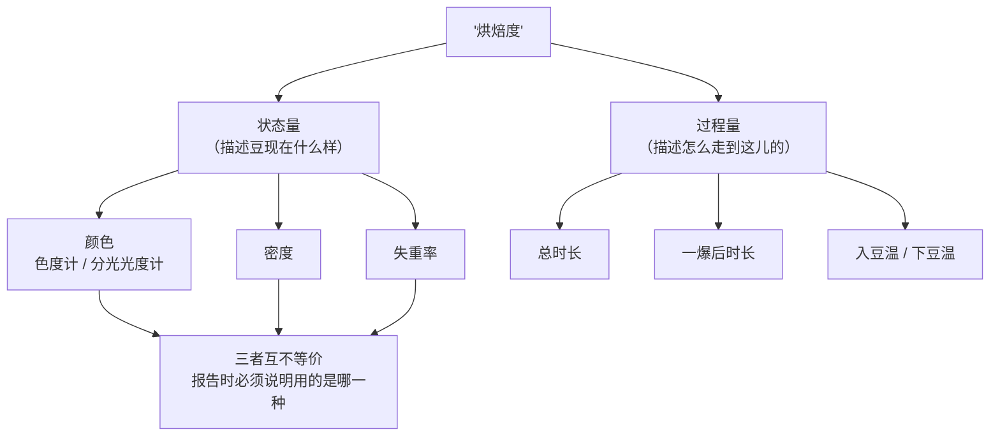
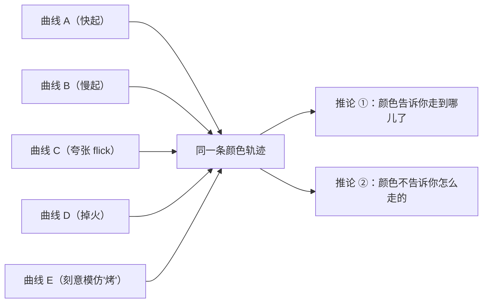
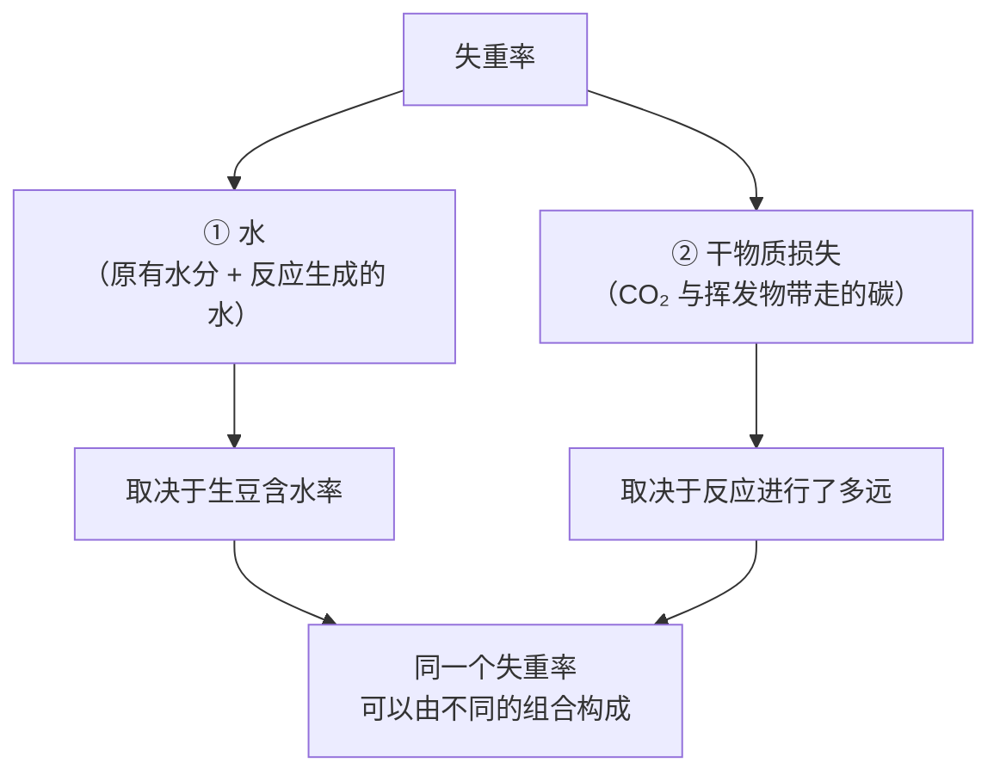

# 第 19 章 烘焙度的测量：色度、失重率、密度

> **本章目标**：回答一个看起来很简单、其实没有标准答案的问题——
> **"这支豆烘到几分？"该怎么测？**
>
> 这一章的结论可以先摆出来，因为它来自一篇论文的原话：
>
> > **目前没有任何标准方法能够普遍而精确地量化烘焙度。**[^1]
>
> 于是行业与文献各自用了至少七种量去"部分地"描述它。
> 本章讲清楚**每一种量在测什么、漏掉了什么、什么时候会骗你**。
>
> 学完你能做一件很实际的事：看到豆袋或杯测单上的"中深烘 / Agtron 58 / 失重 15%"，
> 知道**该追问哪一句**。

## 19.1 为什么"烘焙度"没有唯一定义

一项 2024 年的研究在方法部分把这件事说得很直白[^1]：

> 可以用来**部分描述**烘焙度的物理量至少包括：
> **颜色、密度、失重（质量损失）、总烘焙时长、一爆之后的时长、入豆（charge）温度与下豆（drop）温度。**[^1]

该研究的做法很值得学——**把这些量全部测了一遍**再报告，理由是：
不同研究对烘焙度的判定方式不同，本身就是文献结论互相冲突的一个来源[^1]。

> **一个现成的例子**：关于"烘焙度如何影响杯中咖啡因"，
> 该文统计了过去数十年**20 多项**研究，结论分布在"不受影响""浅烘更高""中烘更高""深烘更高"
> **四种**之间[^1]。这与[出处登记 §六 #1](../../standards.md)登记的分歧是同一件事：
> **口径不统一时，结论会散开。**

**标准侧的状态**：精品咖啡协会的 **SCA-131 Coffee Roast Level: Test Method**
在本书核对当日仍列在"**Standards in Development**"一栏[^2]。
所以本书**不复述任何"标准烘焙度分级表"**——处理方式与[第 13 章](../02-upstream/13-green-grading.md)
对生豆分级标准完全一致。

## 19.2 颜色 ①：仪器在测什么

**日常做法是比色**：与参照色盘（例如美国精品咖啡协会的色盘）对照。
但视觉判定是**主观的**，会受**照明、样品量、周围颜色与观察角度**影响[^3]。

**仪器有两类**[^3]：

| 仪器 | 原理 | 输出 |
|------|------|------|
| **分光光度计** | 测样品在可见光范围（约 380~780 nm）的反射（或透射）光谱 | 反射光谱，或换算成 **Agtron** 等烘焙度量表 |
| **色度计** | 用三个传感器模拟人眼的三色视觉 | XYZ 三刺激值 → 换算成 **CIELAB（L\*a\*b\*）** 等色空间 |

CIELAB 之所以被广泛使用，是因为它是**近似感知均匀**的色空间：
两个颜色之间的欧氏距离大致对应人眼感到的差异大小[^3]。

> **读色度数字前必须问的第一句：整豆还是粉？**
>
> 那项色度研究在做系统综述时，**把只报告整豆颜色的研究排除在外**，
> 理由是"**整豆颜色与咖啡粉颜色差异显著**"[^3]；
> 另一项研究则**两种都测**（同一台仪器、Agtron gourmet 量表，
> 分别测粉与整豆，每个样品旋转约 90° 测四次取平均）[^1]。
>
> 所以"Agtron 58"这种说法在没有注明测法时，**信息是不完整的**。

## 19.3 颜色 ②：一条"普适色曲线"，以及它的两个推论

这是本章最重要的一项证据。

一项在 **5 kg 商用滚筒机**上做的研究，用**七条总时长相同（16 分钟）但动态差异极大**的曲线，
烘三个产地的阿拉比卡，每个取样点取样、液氮速冷、统一研磨后测 L\*a\*b\*[^3]：

| 发现 | 内容 |
|------|------|
| 颜色路径 | 不论曲线与产地，L\*a\*b\* **始终落在同一条轨迹上**——作者称之为"**普适熟咖啡色曲线**" |
| 非单调 | L\* 在转色阶段**先略微上升**（豆变黄），随后持续下降；a\*、b\* 同样**先升后降** |
| 里程碑 | 在**转色、一爆、二爆**三个里程碑处，各样品的 L\*a\*b\* **近似相同** |
| 外部验证 | 用 PRISMA 流程做了系统综述，元分析显示**罗布斯塔也落在这条曲线上** |
| 起点 | 同一批生豆的初始值：L\* **59.33 ± 2.3**、a\* **2.43 ± 0.7**、b\* **21.33 ± 0.4** |

> **推论 ①（好消息）**：颜色是一个**稳健的落点指标**。
> 既然不同曲线、不同产地都收敛到同一条轨迹，
> 那么"这支豆烘到哪个阶段"用颜色来标定是**可跨机器沟通**的——
> 这比温度可靠得多（[第 15、18 章](18-structure-cracks-porosity.md)）。
>
> **推论 ②（坏消息）**：**颜色对"路径"是盲的**。
> 七条曲线里有一条（该研究记为 EM）是**专门设计来复制"烤（baked）"这种缺陷**的[^3]，
> 而它同样落在这条普适曲线上。
> **所以：靠色度读数发现不了"烤"这类曲线缺陷。** 这条直接通向[第 20 章](20-roast-defects.md)。

> ⚠️ **这项研究的边界**：单一机型、总时长固定为 16 分钟、
> 阿拉比卡为实验对象（罗布斯塔结论来自元分析）、色度测的是**咖啡粉**。
> 另需注意该文另有一则**更正（Correction）**[^4]。

## 19.4 失重率：它是由两样东西合成的

失重率（roast loss）= （生豆重 − 熟豆重）÷ 生豆重。它看起来最"客观"，但它是**合计量**。

一项用非分散红外分析排气的研究同时测了烘焙中释放的 **CO₂ 与水蒸气**，
并报告所建立的**质量平衡能相当好地解释称重法测得的失重**[^5]。也就是说：

> **这就是为什么行业会把它拆成"总失重"与"有机物失重"两个说法**
> （**行业惯例**，各家定义与算法不完全一致，本书不给公式）。
> 从测量角度说，重点只有一句：
> **含水率 11% 的生豆与含水率 9% 的生豆，烘到同样的失重率，干物质损失并不相同。**

同一项研究还有一个与[第 18 章](18-structure-cracks-porosity.md)呼应的发现：
两种工艺的 CO₂ **释放速率不同**，但储存 63 天后**释放总量相同**[^5]。

> **本书对排气的立场**：只写"CO₂ 会生成、储存中继续释放"这一**定性**层面，
> **不复述任何排气定量数值**，也不写"养豆几天"——留到第 41 章另找一手实验
> （见[出处登记 §七](../../standards.md)）。

**失重率在文献里的地位**：它是**最常用的可比坐标**之一。例子：

- 一项研究直接把"烘焙度"定义为**干基失重百分比**，取 **4.7%~5.0% / 8.7% / 10%** 三档[^6]；
- [第 17 章](17-cga-and-bitterness.md)里醌内酯的峰出现在"**约 14% 失重**"[^7]；
- [第 18 章](18-structure-cracks-porosity.md)里萃取率的转折出现在"**约 12%~14% 失重**"[^1]。

> **注意这三处的可比性是有限的**：有的是干基、有的未注明基准，
> 且样品与设备各不相同。**看到失重率先问：干基还是湿基？谁的分母？**
> （与[第 12 章](../02-upstream/12-drying-storage.md)问含水率基准是同一个动作。）

## 19.5 密度：能用，但混杂最多

烘焙会让豆**体积增大、孔隙增多**（[第 18 章](18-structure-cracks-porosity.md)），
所以密度随烘焙加深而下降。前述那项研究把**自由沉降密度**
（对磨碎并过筛的样品测）与颜色、失重并列为烘焙度的描述量之一[^1]；
生豆侧同样用密度描述（该研究两支埃塞俄比亚生豆的供应商报告值为 **0.707** 与 **0.692 g/mL**，
含水率 10.5% 与 9.6%）[^1]。

**但密度有三层混杂**：

| 混杂来源 | 说明 |
|---------|------|
| **生豆本身** | 品种、海拔、处理法、含水率都会改变生豆密度（第二部分）——所以**跨豆比较密度无法说明烘焙度** |
| **口径** | 堆积密度（自由沉降 / 振实）与真密度、表观密度不是一回事；显微 CT 与比重瓶测的又是另一套[^8] |
| **状态** | 磨碎与否、是否过筛、是否已排气，都会改变读数[^1] |

> **能用的方式**：**同一支豆、同一套流程、跟踪自己的历史**。
> **不能用的方式**：用密度去比较两支不同的豆烘得深不深。

## 19.6 还有哪些测法：在线、图像与"便宜的替代"

| 方法 | 做了什么 | 本书怎么用 |
|------|---------|-----------|
| **排气在线质谱** | 用单光子电离飞行时间质谱以 5 秒分辨率分析烘焙排气，把下豆时刻的质谱与色度值（Colorette）做回归，交叉验证解释协方差 **>89%**[^9] | 说明**颜色可以被过程信号预测**，即色度与化学进程相关；该文另有抗氧化能力的结论，**本书不复述、不评价**（[第 5 章](../01-foundation/05-health-evidence.md)红线） |
| **图像 + 机器学习** | 在 1600 张图像、四类（生豆/浅/中/深）平衡数据集上，多个模型（含 CNN、随机森林、SVM）都达到 **100% 准确率**[^10] | 说明**粗分类非常容易**；**不说明**颜色能分辨细微差别——类别越粗，准确率越没有信息量 |
| **昂贵分析 ↔ 快速判别** | 显微 CT、比重瓶与热物性分析成本高，作者据此把它们与更易获得的快速测试做相关，供开发者使用[^8] | 一个务实的方向：**用便宜的量去代理贵的量，但必须先做相关性验证** |

## 19.7 三种烘焙度为什么互不等价（本章小结）

| 指标 | 类型 | 它能告诉你 | 它漏掉了什么 | 主要陷阱 |
|------|------|-----------|------------|---------|
| **颜色** | 状态量 | 走到了轨迹上的哪一点；里程碑位置稳定[^3] | **路径**（含"烤"这类缺陷）[^3] | 整豆 vs 粉[^3][^1]；量表与仪器版本；视觉比色的主观性[^3] |
| **失重率** | 合计量 | 总共少了多少质量 | 水与干物质的**构成比**[^5] | 基准（干基/湿基）；生豆含水率不同 |
| **密度** | 状态量 | 结构膨胀的程度[^18ch] | 生豆自身差异 | 口径混乱；跨豆不可比[^1] |
| **一爆后时长 / 下豆温** | 过程量 | 路径的一部分 | 结果 | 依赖机器与判读（探针[^11]、人耳[^3]） |

> **一句话**：**没有一个指标是"烘焙度"本身**。
> 报告与阅读烘焙度时，**必须带上"用什么测的、怎么测的"**。
> 这与[第 13 章](../02-upstream/13-green-grading.md)"等级是哪一套"、
> [第 12 章](../02-upstream/12-drying-storage.md)"含水率是什么基准"是同一条纪律。

## 19.8 常见说法辨析

按本书约定标注**证据强度**：✅ 有共识 / ⚠️ 有争议 / ❌ 明确错误 / **缺乏证据**。

| 说法 | 判定 | 说明 |
|------|------|------|
| "烘焙度有统一标准" | ❌ **与文献不符** | "目前没有任何标准方法能普遍而精确地量化烘焙度"[^1]；SCA-131 核对当日仍在制定中[^2] |
| "Agtron 数值越低越深" | ✅ **方向成立** | 在该量表上数值更高对应更浅的颜色（一项研究用"颜色**等于或高于** Agtron 82.8"来描述颜色更浅的未熟豆[^12]） |
| "Agtron 58 就是一个确定的烘焙度" | ⚠️ **信息不完整** | 至少要注明**整豆还是粉**[^3][^1]；不同仪器与量表版本之间不能默认互换 |
| "看颜色就知道发展够不够" | ❌ **有直接反证** | 七条差异极大的曲线（含一条刻意模仿"烤"的）都落在同一条颜色轨迹上[^3] |
| "L\* 一路下降，所以颜色是单调变深的" | ⚠️ **早期不是** | L\*、a\*、b\* 在转色阶段**先升后降**[^3] |
| "失重 15% 就是中深烘" | ⚠️ **取决于基准与生豆** | 失重由水与干物质两部分构成[^5]；且干基与湿基不同 |
| "密度高说明豆好 / 烘得浅" | ⚠️ **混杂太多** | 生豆密度受品种、海拔、处理与含水率影响；口径（堆积/真/表观）也不统一[^1][^8] |
| "机器视觉都能 100% 判烘焙度了" | ⚠️ **误读了指标** | 那是**四个粗类别**上的分类准确率[^10]，与"能否分辨相近烘焙度"是两个问题 |
| "同样烘焙度的两支豆可以用同一套参数" | ❌ **结构不同** | 相同烘焙度下工艺不同会给出不同的体积与孔结构[^13]；同刻度下粒径也可能差数倍[^3]（[第 18 章](18-structure-cracks-porosity.md)） |
| "浅烘咖啡因更高 / 更低" | ⚠️ **文献未收敛** | 20 多项研究给出四种互相矛盾的结论，作者归因于烘焙度判定方式不统一[^1]（另见[出处登记 §六 #1](../../standards.md)） |
| "色度值可以换算成失重率" | **缺乏证据** | 本书未读到可跨机型使用的换算关系；两者分别是状态量与合计量 |

## 19.9 🔎 买豆与冲煮时的用处

1. **看到烘焙度描述，先问三句**：哪一种量？怎么测的？（颜色：整豆还是粉）在什么设备上？
   一个愿意回答这三句的烘焙商，比一个只写"中深烘"的可靠得多。
2. **把颜色当"落点"，不要当"品质"**：颜色能告诉你走到了哪儿，
   不能告诉你路上有没有出问题（[第 20 章](20-roast-defects.md)）。
3. **自己记录时用可复现的描述**：与其写"中深"，不如写
   "比上次那支深一点，同刻度磨出来更细，冲煮流速快了约 10 秒"——
   这三条都是可核对的。
4. **同一支豆做纵向比较，不同豆做横向比较时换指标**：
   密度、失重率适合纵向（自己跟自己比），颜色更适合横向沟通。
5. **别被小数点骗**：Agtron 差 2、失重差 0.3% 在没有统一测法时**没有意义**；
   而"整豆还是粉"这一句话带来的差异可能比它们大得多。

## 19.10 思考题

1. 请列出本章提到的、可用来"部分描述"烘焙度的物理量，并把它们分成**状态量**与**过程量**两类，
   说明各自漏掉了什么。
2. "普适色曲线"同时是好消息和坏消息。请分别说明它在什么场景下是好消息、什么场景下是坏消息。
3. 为什么"同一个失重率"可以对应不同的干物质损失？这对比较两家烘焙商的失重率数据意味着什么？
4. 密度是一个物理上很明确的量，为什么本章说它"混杂最多"？请给出一个**能用**密度的场景。
5. **【案例】** 两家烘焙商给出的数据：A 写"Agtron 62（整豆）"，B 写"Agtron 62（粉）"。
   请说明你能不能据此认为两支豆烘焙度相同，并写出你会追问的问题。
6. **【案例】** 有人说："我用色卡确认了颜色一致，所以这两批烘焙是一样的。"
   请用本章证据指出这句话的两个漏洞（一个关于测法，一个关于颜色本身能承载的信息）。
7. 一项图像分类研究在四个类别上达到 100% 准确率[^10]。
   请解释为什么这**不能**推出"机器已经能精确测量烘焙度"，并说出你会怎么设计一个更有说服力的测试。
8. **【辨识】** 找三包豆（实体或网店），把它们对烘焙度的描述抄下来，
   逐条判断属于哪一种量、是否说明了测法，并给出你会问卖家的一个具体问题。

> 📖 **参考答案**（想清楚再看）：[Q1](../../qa/19-roast-degree-measurement-qa.md#q1) ·
> [Q2](../../qa/19-roast-degree-measurement-qa.md#q2) · [Q3](../../qa/19-roast-degree-measurement-qa.md#q3) ·
> [Q4](../../qa/19-roast-degree-measurement-qa.md#q4) · [Q5](../../qa/19-roast-degree-measurement-qa.md#q5) ·
> [Q6](../../qa/19-roast-degree-measurement-qa.md#q6) · [Q7](../../qa/19-roast-degree-measurement-qa.md#q7) ·
> [Q8](../../qa/19-roast-degree-measurement-qa.md#q8)

## 19.11 本章实操

### 🅐 无器具版 · 任务一：给三包豆的"烘焙度"做口径体检

翻出三包豆（或三个商品页），把它们的烘焙度描述抄进表里：

| 豆 | 原文描述 | 属于哪种量 | 说明测法了吗 | 缺什么 | 我会问的问题 |
|----|---------|-----------|------------|-------|------------|
| A | | 颜色 / 失重 / 密度 / 过程量 / 只是形容词 | | | |
| B | | | | | |
| C | | | | | |

> **判读提示**：只写"中焙""City+"的属于**行业惯例分档**，不是测量值；
> 写"Agtron xx"的要追问整豆还是粉[^3][^1]；
> 写"失重 xx%"的要追问干基还是湿基。
> 完整的豆袋字段核对见[豆袋核对清单](../../forms/bag-checklist.md)。

### 🅐 无器具版 · 任务二：自制一套"可复现的颜色描述"

不用色卡，用**对比**代替绝对值——这正是普适色曲线给的启发（重要的是你在轨迹上的位置）：

1. 把手上所有豆按颜色从浅到深排成一列（自然光下，白纸背景）；
2. 给每支豆写一句**相对描述**："比 B 浅、比 A 深，接近 C"；
3. 记录当时的**光源**（日光 / 灯光）与背景颜色——这两项正是视觉比色的主要误差源[^3]。

| 豆 | 排序位置 | 相对描述 | 光源与背景 | 表面状态（干/有油光） |
|----|---------|---------|-----------|-------------------|
| | | | | |

> **为什么这比"中深烘"有用**：三个月后你还能复现这个排序，
> 而"中深烘"三个字在不同人那里意思完全不同。

### 🅑 有条件版 · 任务三：用厨房秤做一次"失重率"的替身实验（备齐后再做）

> 不能自己烘豆也能做这一项——**测的是排气失重，不是烘焙失重**。
> **所需**：能称到 0.01 g 的秤（珠宝秤即可）、一包**刚烘好**的豆、密封袋。

1. 买到豆当天称重（连袋称，记录袋重），记为第 0 天；
2. 之后第 1、3、7、14 天各称一次，**每次都在同样条件下**（同一台秤、同样温度）；
3. 画一条"重量 vs 天数"的折线。

| 天 | 重量 | 与第 0 天之差 | 备注（开袋次数、储存位置） |
|----|------|-------------|------------------------|
| 0 | | — | |
| 1 | | | |
| 3 | | | |
| 7 | | | |
| 14 | | | |

> **能得到的结论**：豆离开烘焙机之后**还在变轻**[^5]。
> **不能得到的结论**：**不要**据此推算"排完气需要几天"或"什么时候最好喝"——
> 本书在第 41 章之前不做这个推断（[出处登记 §七](../../standards.md)）。
> ⚠️ 家用秤的漂移、包装吸湿与开袋都会污染这条曲线，记得把它们记下来。

### 🅑 有条件版 · 任务四：同刻度粒径 × 烘焙度的两点标定（备齐后再做）

> **所需**：磨豆机、厨房秤、两支烘焙度明显不同的豆、计时器、手冲或浸泡器具各一。

沿用[第 18 章](18-structure-cracks-porosity.md)的发现（同刻度下深烘磨得更细[^3]），
做一次**闭环**记录：

| 项 | 浅一些的豆 | 深一些的豆 |
|----|-----------|-----------|
| 卖家给的烘焙度描述 | | |
| 同刻度磨出的目测粒径 | | |
| 相同参数下的总出液时间 | | |
| 你为了把时间调回来，刻度改了几格 | | |

> **这张表的价值**：它把"烘焙度"翻译成了**你自己的设备语言**。
> 下次再买到"同样烘焙度"的豆，你有一个可比的基准，而不是从零试。

---

## 19.12 本章依据

完整书目信息登记在[出处与资料登记 §4.22](../../standards.md)。

- **[RD1]** Lindsey, Z. R., Williams, J. R., Burgess, J. S., Moore, N. T., & Splichal, P. M. (2024).
  *Caffeine content in filter coffee brews as a function of degree of roast and extraction yield*.
  *Scientific Reports* 14:29126（开放获取）。用到：**"目前没有标准方法能普遍而精确地量化烘焙度"**；
  可用于部分描述烘焙度的七个量；同一批次同时测颜色（Agtron gourmet，**粉与整豆各测**）、
  自由沉降密度与失重；两支生豆的含水率与密度（10.5% / 0.707 g/mL；9.6% / 0.692 g/mL）；
  20 多项研究关于烘焙度与咖啡因的四类互相矛盾结论；
  **失重超过约 12%~14% 后萃取率下降**（第 18 章用）。已读全文相关章节。
- **[RD2]** Anokye-Bempah, L., Styczynski, T., Ristenpart, W. D., & Donis-González, I. R. (2025).
  *A universal color curve for roasted arabica coffee*. *Scientific Reports* 15:24192（开放获取）。
  用到：七条同总时长、动态不同的曲线 × 三个产地；**L\*a\*b\* 始终落在同一条轨迹上**；
  **转色、一爆、二爆三个里程碑处颜色近似相同**；L\*、a\*、b\* 早期先升后降；
  生豆初始 L\*a\*b\* = 59.33 ± 2.3 / 2.43 ± 0.7 / 21.33 ± 0.4；
  里程碑由**有经验的烘焙师依视觉与听觉线索**标定；
  系统综述中**排除只报整豆颜色的研究**（整豆色与粉色差异显著）；
  视觉比色的误差来源；分光光度计与色度计的分工；
  **EM 曲线是刻意复制"烤"的**；同一台磨下 **D50 393 μm（一爆样）vs 96 μm（二爆样）**（第 18 章用）。
  已读全文相关章节。**该文另有一则更正 [RD2c]**。
- **[RD3]** Nunes, F. M., & Coimbra, M. A. (2002). *JAFC* 50(6):1429–1434。
  用到：文献中把"烘焙度"直接定义为**干基失重百分比**（4.7%~5.0% / 8.7% / 10%）这一做法。已读摘要。
- **[RD4]** Heide, J., Czech, H., Ehlert, S., Koziorowski, T., & Zimmermann, R. (2020).
  *JAFC* 68(17):4752–4759。用到：单光子电离飞行时间质谱以 5 秒分辨率在线分析排气，
  与色度值（Colorette）回归，交叉验证解释协方差 **>89%**。
  **其抗氧化能力相关结论本书不复述、不评价。** 已读摘要。
- **[RD5]** García Rivas, R. E., Bertarini, P. L. L., & Fernandes, H. (2025).
  *Journal of Food Science* 90(9)。用到：1600 张图像、四个平衡类别上多模型达 **100%** 准确率——
  本书用作"**粗分类容易 ≠ 能精确测量**"的例证。已读摘要。
- **[ST3][ST4]**（第 18 章已登记）本章用于：显微 CT / 比重瓶 / 热物性分析与"快速判别测试"
  做相关的思路 [ST3]；失重的**质量平衡由 CO₂ 与水解释**、两种工艺**释放速率不同而总量相同** [ST4]。
- **[RP5][RP9]**（第 15 章已登记）本章用于：相同烘焙度下不同工艺给出不同结构 [RP5]；
  温度读数是探针周围温度这一限制 [RP9]。
- **[CGA2]**（第 17 章已登记）用到：醌内酯峰以"约 14% 失重"为坐标。
- **[DF4]**（[第 20 章登记](../../standards.md)）用到：以"颜色等于或高于 Agtron 82.8"描述颜色更浅的未熟豆——
  本书据此说明该量表的方向。
- **[SCA2]**（第 13 章已登记）用到：**SCA-131 Coffee Roast Level: Test Method** 核对当日仍在
  "Standards in Development"一栏。

**本章刻意没写的东西**：

- **任何"标准烘焙度分级表"与色度分档表**——标准仍在制定中[^2]，且本书不复制官方表格版式；
- **色度与失重率之间的换算**——未读到可跨机型使用的关系；
- **排气的定量与"养豆天数"**——留到第 41 章；
- **"某个烘焙度最好"**——本书不做这类断言；
- **具体仪器与量表的品牌推荐**——本章只写原理与口径。

[^1]: 本书编号 [RD1]：Lindsey 等 (2024), *Scientific Reports* 14:29126（开放获取）。
[^2]: 本书编号 [SCA2]：SCA 标准页（第 13 章已登记，2026-09 复核）。
[^3]: 本书编号 [RD2]：Anokye-Bempah 等 (2025), *Scientific Reports* 15:24192（开放获取）。
[^4]: 本书编号 [RD2c]：该文的更正（Correction），*Scientific Reports* 15:35559。
[^5]: 本书编号 [ST4]：Geiger 等 (2005), *Journal of Food Science* 70(2)（第 18 章已登记）。
[^6]: 本书编号 [RD3]：Nunes & Coimbra (2002), *JAFC* 50(6):1429–1434。
[^7]: 本书编号 [CGA2]：Farah 等 (2005), *JAFC* 53(5):1505–1513（第 17 章已登记）。
[^8]: 本书编号 [ST3]：Al-Shemmeri 等 (2024), *J. Food Engineering* 378:112096（第 18 章已登记）。
[^9]: 本书编号 [RD4]：Heide 等 (2020), *JAFC* 68(17):4752–4759。
[^10]: 本书编号 [RD5]：García Rivas 等 (2025), *Journal of Food Science* 90(9)。
[^11]: 本书编号 [RP9]：Anokye-Bempah 等 (2024), *Scientific Reports* 14:8237（第 15 章已登记）。
[^12]: 本书编号 [DF4]：Rabelo 等 (2021), *Food Chemistry* 342:128304（第 20 章登记）。
[^13]: 本书编号 [RP5]：Schenker 等 (2000), *J. Food Science* 65(3):452–457（第 15 章已登记）。
[^18ch]: 见[第 18 章](18-structure-cracks-porosity.md)：体积增大与孔隙率上升（[RP5][ST2][ST3]）。

---

**下一章**：第 20 章 烘焙缺陷与曲线之争——夹生、烤、焦的判据，
以及"发展时间比"这类指标的证据级别。
