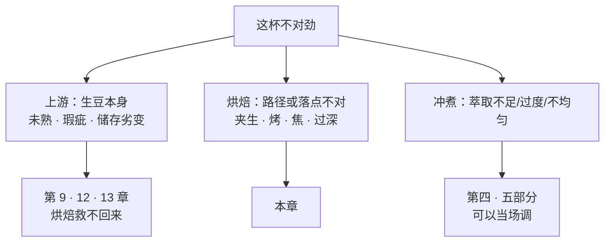
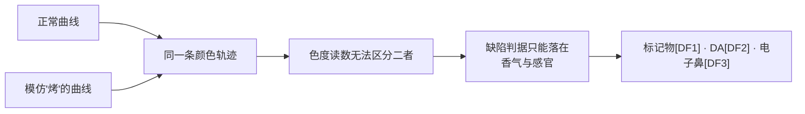

# 第 20 章 烘焙缺陷与曲线之争

> **本章目标**：这是第三部分的收尾，要回答两个问题：
>
> 1. **"烘坏了"有没有客观判据？** ——有，而且比想象中扎实：
>    五类常见缺陷已经被**化学标记物 + 训练有素的描述性分析 + 消费者测试**三重刻画过。
> 2. **烘焙圈那些关于曲线的争论，证据级别如何？** ——这就要分开说了。
>    有的说法有实验、有的只有经验、有的在文献里**一条都查不到**。
>
> 本章的态度与全书一致：**能找到实验的，以实验为准；找不到的，明说找不到，
> 并且说清楚"找不到"不等于"错"。**

## 20.1 先把三类问题分开

一杯咖啡出问题，来源至少有三层，而它们的解法完全不同：

> **为什么这个顺序重要**：[第 16 章](16-roasting-chemistry-1.md)给过一条定量证据——
> 生豆中气味活性值最高的那个分子（造成"豌豆味"的 IBMP），**烘焙后浓度不变**。
> **上游的问题不会被烘焙修好**；而冲煮能改的又只是"取出多少、取出哪一类"。
> 所以判断顺序应该是：**先排除上游 → 再看烘焙 → 最后调冲煮。**

## 20.2 五类烘焙缺陷：有化学标记物，也有感官验证

这是本章最硬的一段证据，来自同一套实验体系的两篇论文。

**第一篇**：用同一支豆、**六条时间—温度曲线**（一条"正常"+ 五种常见缺陷：
**light（过浅）、scorched（焦斑）、dark（过深）、baked（烤）、underdeveloped（夹生）**），
用顶空固相微萃取 GC-MS 分析 37 种此前已被确认为咖啡关键气味物的挥发物，
为**每一类缺陷各选出一个标记物**[^1]：

| 缺陷 | 标记化合物 |
|------|-----------|
| **light（过浅）** | 吲哚（indole） |
| **scorched（焦斑）** | 4-乙基-2-甲氧基苯酚（4-乙基愈创木酚） |
| **dark（过深）** | 苯酚（phenol） |
| **baked（烤）** | 麦芽酚（maltol） |
| **underdeveloped（夹生）** | 2,5-二甲基呋喃 |

> 作者称此前没有研究把不同烘焙缺陷与特定香气变化关联起来，
> 并提出这可以做成**快速筛查工具**[^1]。

**第二篇**：同一套样品，加上感官[^2]：

| 环节 | 做法与结果 |
|------|-----------|
| 化学 | GC-MS 香气分析 |
| 训练评审 | 描述性分析（DA） |
| 消费者 | **N = 83** 的喜好度 + CATA（勾选所有适用描述词） |
| 多元统计 | 香气、DA 与 CATA 三套数据给出**相似的样品空间**；**过浅**与**过深/焦斑**明显对立，正常烘焙居中 |
| 关键结果 | **正常烘焙被消费者显著偏好**，并显著关联到"和谐""愉悦""平衡"三个正面描述词 |

> **为什么这两篇放在一起讲，但不能算"两个独立证据"**：
> 它们**共用同一套样品与同一组作者**[^1][^2]。
> 按本书的交叉验证纪律，这算**一个证据体系的两个侧面**（化学 + 感官），
> **不是独立重复**。

**一个真正独立的旁证**来自另一个课题组[^3]：用危地马拉 Typica 豆刻意做出
**欠发展**与**过发展**两种缺陷与正常烘焙，用 GC-MS 与电子鼻分析，
报告挥发物族群与**到一爆的时间、干燥时间、豆温与热风平均温度**存在相关，
并称电子鼻有助于识别烘焙缺陷[^3]。

> **合起来能说的话**：
> **"烘焙缺陷"不是玄学**——至少五类在化学上有标记物、在感官上可区分，
> 而且**普通消费者也能感觉到差别**（不是只有专家能喝出来）[^2]。

## 20.3 但"颜色"发现不了它们

第 19 章的普适色曲线在这里派上了用场，而且结论有点扎心：

> 七条差异极大的曲线（**其中一条是专门设计来复制"烤（baked）"的**）
> 在 L\*a\*b\* 色空间里**全部落在同一条轨迹上**[^4]。

于是：

> **这条推论很重要，因为它否定了一种常见的质量控制做法**：
> "每批测色度，色度对了就算过关"——**色度对了，"烤"照样过关**。
>
> 能判缺陷的是**闻与喝**（以及实验室的香气分析）。
> 这也解释了为什么严肃的烘焙商每批都要杯测：**没有捷径。**

## 20.4 曲线之争 ①：RoR 掉头与"夸张 flick"

烘焙圈争得最凶的两条：**升温速率（RoR）中途掉头（crash）**与
**一爆后 RoR 突然抬起（flick）**。行业普遍认为二者严重损害品质。

本书能核到的实验只有一项，而它给的是**否定性结果**[^5]：

| 项 | 内容 |
|----|------|
| 设备与设计 | 5 kg 商用滚筒机；七条**总时长相同（16 分钟）**但动态差异极大的曲线；三个产地 |
| 其中两条 | **EF**：一爆后 RoR 突然抬升（夸张 flick）；**NR**：模拟燃气流失、一爆附近 RoR 转负 |
| 测的指标 | 可滴定酸度（TA）的全程动态 |
| 结果 | **EF 与 NR 两条"缺陷曲线"的 TA 动态与中庸曲线几乎无法区分** |
| 作者的一句话 | 据其所知，**没有已发表数据支持"RoR 转负会严重降低品质"**这一行业观点 |
| 作者自述的局限 | **该研究未做感官评价** |

同一课题组的色度研究进一步显示：这两条曲线的**颜色**同样落在普适曲线上[^4]。

> **本书的表述（请逐字读）**：
>
> **在"可滴定酸度"与"颜色"这两个指标上，这两条被行业视为严重缺陷的曲线
> 没有表现出可区分的差异；但目前没有人对它们做过感官对照实验。**
>
> 这句话**不等于**"RoR crash / flick 无害"。它的意思是：
> **行业把一个尚未被感官实验检验的判据，当成了硬指标在用。**
>
> 这与[第 15 章](15-roasting-physics.md)的处理完全一致，
> 也登记在[出处登记 §六 #23](../../standards.md)。

## 20.5 曲线之争 ②："发展时间比"的证据级别

"发展时间比"（development time ratio, DTR）——一爆后时长占总烘焙时长的比例——
是近十年流传最广的烘焙指标之一，常见的说法是"应当落在某个百分比区间"。

**本书的检索记录（可复现）**：

> 在 Europe PMC 以 **"development time ratio"** 与 coffee 组合检索
> （题名/摘要字段），**核对当日命中 0 条**。
>
> 这是**本书自己的检索观察**，不是任何文献的结论；读者可以自行重复。
> 注意"0 命中"只说明**该数据库中以此为题名/摘要关键词的文献不存在**，
> 不能推出"这个指标没有意义"。

**能查到的是它的近亲**：把"**发展时间**"（一爆之后的时长）当作工艺变量来研究。
一项用 ¹H NMR 加化学计量学分析 **13 条工业烘焙曲线**的工作报告[^6]：

> 即使**终温只差约 1 ℃**、或**总时长只差约 25 秒**，
> 咖啡萃取液的化学组成变化也**可以被检出**[^6]。

> **这条要非常小心地读**：它证明的是**灵敏度**（差异可检出），
> **不是品质**（该研究**没有做感官评价**）。
>
> **"可检出"与"更好喝"之间隔着一整条证据链**——这是本书反复强调的同一件事
> （[第 5 章](../01-foundation/05-health-evidence.md)、[第 11 章](../02-upstream/11-fermentation-experimental.md)）。

**本书的结论**：**DTR 是行业惯例参数**，本书**不给推荐区间**，
也不判它为错——它只是**尚未被公开实验检验过**。

## 20.6 一个来自上游的"假烘焙缺陷"：未熟豆（quaker）

有一类缺陷看起来像烘焙问题（一批豆里混着几颗明显更浅、不上色的豆），
根子却在[第 9 章](../02-upstream/09-harvest-ripeness.md)。

一项实验把三种颜色的 **quaker**（未熟豆）按**七个不同比例**加进日晒精品咖啡里，
做感官分析与挥发物分析[^7]：

| 结果 | 内容 |
|------|------|
| 剂量效应 | 颜色**等于或高于 Agtron 82.8**（即颜色更浅）的未熟豆，**要到一杯（65 颗豆）里有 7 颗**才显著损害感官特征 |
| 化学解释 | 未熟豆在烘焙中生成的挥发物，来自**未熟生豆里的前体**——**颜色与风味都是未熟这一化学组成的后果** |
| 与规定的对照 | 作者把这一结果与"精品级日晒批次要求**完全不含** quaker"的行业规定并置讨论 |

> **三个教学点**：
>
> 1. **缺陷是有剂量的**——"有一颗就毁了一杯"在这项实验里没有得到支持；
> 2. **这颗豆的问题发生在采收期**，烘焙只是把它**显影**了（未熟豆前体不同 → 褐变不足 → 颜色浅）；
> 3. **规定往往比实验更严格，这是合理的**：规定要**可执行、可检验**，
>    "完全不含"比"每杯不超过 6 颗"好操作得多。
>    **别把"规定更严"误读成"实验说没关系"。**

## 20.7 到底哪些判据站得住：一张诚实的清单

| 判据 | 证据 | 可用性 |
|------|------|-------|
| **焦斑（scorched）** | 标记物 4-乙基-2-甲氧基苯酚[^1]；感官上与过浅明显对立[^2] | ✅ 化学 + 感官 |
| **过深（dark）** | 标记物苯酚[^1]；感官验证[^2]；深烘的苦与涩另有机理（[第 17 章](17-cga-and-bitterness.md)） | ✅ |
| **过浅（light）** | 标记物吲哚[^1]；感官验证[^2] | ✅ |
| **烤（baked）** | 标记物麦芽酚[^1]；感官验证[^2]；**颜色测不出**[^4] | ✅（但必须靠闻/喝） |
| **夹生（underdeveloped）** | 标记物 2,5-二甲基呋喃[^1]；感官验证[^2]；电子鼻可判[^3] | ✅ |
| **消费者能不能觉察** | 正常烘焙被 83 名消费者**显著偏好**并关联到"和谐/愉悦/平衡"[^2] | ✅ |
| **RoR 掉头 / 夸张 flick** | 仅有"在 TA 与颜色上不可区分"的**否定性证据**[^5][^4]；**无感官研究** | ⚠️ 悬而未决 |
| **发展时间比（DTR）** | 检索当日**无文献**；近亲研究只证明"差异可检出"[^6] | **缺乏证据** |
| **quaker（未熟豆）** | 有剂量—效应实验[^7] | ✅ 但属于**上游**问题 |
| **用色度做质量控制** | 不同曲线收敛到同一条颜色轨迹[^4] | ❌ 不足以发现缺陷 |

## 20.8 常见说法辨析

按本书约定标注**证据强度**：✅ 有共识 / ⚠️ 有争议 / ❌ 明确错误 / **缺乏证据**。

| 说法 | 判定 | 说明 |
|------|------|------|
| "烘焙缺陷只是玄学，普通人喝不出来" | ❌ **与实验不符** | 83 名普通消费者显著偏好无缺陷的那一支，并关联到正面描述词[^2] |
| "'烤'（baked）可以靠看颜色发现" | ❌ **有直接反证** | 刻意复制"烤"的曲线与其他曲线落在**同一条颜色轨迹**上[^4] |
| "RoR 一掉头这锅豆就废了" | ⚠️ **尚未被检验** | 在 TA[^5] 与颜色[^4] 上不可区分，且该研究**未做感官**。**不能反过来读成"无害"** |
| "发展时间比必须落在某个区间" | **缺乏证据** | 检索当日以该词为题名/摘要关键词**无文献**；本书不给区间，也不判其错 |
| "终温差 1 ℃ 都会改变味道" | ⚠️ **混淆了两件事** | 可核到的是**化学组成的差异可被检出**（NMR + 化学计量学）[^6]；**该研究未做感官评价** |
| "一颗 quaker 就毁一杯" | ⚠️ **该实验未支持** | 在该实验里要到**一杯 65 颗中有 7 颗**才显著损害感官[^7]。但**不能**反读成"未熟豆没关系"——规定更严有其可执行性的理由 |
| "缺陷豆是烘焙师的锅" | ⚠️ **要先分层** | quaker 来自采收期（[第 9 章](../02-upstream/09-harvest-ripeness.md)）；马铃薯味等来自生豆（[第 13 章](../02-upstream/13-green-grading.md)）；烘焙救不回上游缺陷（[第 16 章](16-roasting-chemistry-1.md)） |
| "同一支豆烘两次，只要色度一样就一样" | ❌ | 颜色不记录路径[^4]；结构也可能不同（[第 18 章](18-structure-cracks-porosity.md)） |
| "电子鼻/机器能自动判缺陷了" | ⚠️ **方向可行，证据尚薄** | 有研究报告电子鼻有助于识别缺陷[^3]，但样本与品种有限；标记物法也只是**筛查**工具[^1] |
| "浅烘就是夹生" | ❌ **两回事** | "过浅（light）"与"夹生（underdeveloped）"在该实验里是**两条不同的曲线、两个不同的标记物**[^1] |

## 20.9 🔎 买豆与冲煮时的用处

1. **闻干粉是最便宜的缺陷筛查**：磨完先闻。
   "谷物/生青"指向夹生一侧，"纸板/面包皮/平淡"指向"烤"一侧，"烟熏/刺鼻"指向焦斑一侧——
   这些方向对应的是有标记物支持的类别[^1]，但**你的鼻子给的是线索不是判决**。
2. **一杯不对时，先问"哪一层"**：上游 → 烘焙 → 冲煮。
   **调参数之前先换一支豆做对照**，这一步能省掉大半的无效调试。
3. **看到烘焙商晒曲线图，不必过度解读**：曲线是路径记录，
   而目前**唯一被感官验证过**的判据是杯子里的表现[^2]。
4. **看到"DTR 20%~25% 是黄金区间"这类说法**，知道它属于**行业经验**，
   可以试，但不要当定律——文献里查不到它。
5. **买到混着几颗浅色豆的批次**，那是上游分选的问题（quaker），不是烘焙师手抖；
   它有**剂量效应**[^7]，少量未必毁杯，但它是一个**分选质量**的信号。

## 20.10 思考题

1. 五类烘焙缺陷各自的标记化合物是什么？请说明"标记物"这个说法比"某分子等于某缺陷"更准确在哪里。
2. 为什么本章说第一、二篇论文**不算两个独立证据**？如果要做一次真正独立的验证，你会怎么设计？
3. 请用第 19 章的普适色曲线解释：为什么"每批测色度"这种质量控制方式**发现不了"烤"**。
4. 关于 RoR 掉头，本书的表述是"在某两个指标上不可区分"，而不是"无害"。
   请说明这两种说法的区别，以及为什么必须用前者。
5. "终温差 1 ℃ 都能检出化学差异"——请解释这条为什么**不能**用来支持"1 ℃ 决定成败"。
6. **【案例】** 一位烘焙师说："这批豆一爆后 RoR flick 了，我直接倒掉了。"
   请写出你会怎么回应（要同时尊重实验证据与他的经验）。
7. **【案例】** 你买到一包豆，冲出来"纸板味 + 平淡 + 没有甜感"，但豆子颜色看起来很正常。
   请列出可能的原因，并给出一个**能区分烘焙问题与冲煮问题**的两步实验。
8. quaker 实验的结果（7 颗/65 颗才显著）与"精品批次要求完全不含 quaker"的规定不一致。
   请解释这两者为什么可以同时合理。
9. **【辨识】** 找三段讲"烘焙缺陷"的中文内容，逐条标注：它给的判据是
   **化学/感官证据、行业经验，还是无法核对**。

> 📖 **参考答案**（想清楚再看）：[Q1](../../qa/20-roast-defects-qa.md#q1) ·
> [Q2](../../qa/20-roast-defects-qa.md#q2) · [Q3](../../qa/20-roast-defects-qa.md#q3) ·
> [Q4](../../qa/20-roast-defects-qa.md#q4) · [Q5](../../qa/20-roast-defects-qa.md#q5) ·
> [Q6](../../qa/20-roast-defects-qa.md#q6) · [Q7](../../qa/20-roast-defects-qa.md#q7) ·
> [Q8](../../qa/20-roast-defects-qa.md#q8) · [Q9](../../qa/20-roast-defects-qa.md#q9)

## 20.11 本章实操

### 🅐 无器具版 · 任务一：干粉闻香的缺陷筛查表

只需要一包豆和你的鼻子。磨完（或打开包装）立刻闻，30 秒内记录：

| 闻到的方向 | 勾选 | 可能对应 | 本书的证据级别 |
|-----------|------|---------|--------------|
| 谷物 / 生青 / 花生衣 | | 夹生一侧 | 有标记物与感官验证[^1][^2] |
| 纸板 / 面包皮 / 平淡无香 | | "烤"一侧 | 同上（且**颜色看不出**[^4]） |
| 烟熏 / 刺鼻 / 灰烬 | | 焦斑或过深一侧 | 同上 |
| 甜香 / 可可 / 坚果 / 均衡 | | 无明显缺陷 | 正常烘焙在感官上被描述为"平衡"[^2] |
| 泥土 / 霉 / 药味 | | **先怀疑上游**（第 12、13 章） | 不同层的问题 |

> ⚠️ **这张表是线索，不是判决**：你闻到的是混合气味，而标记物法用的是仪器。
> 表的真正用途是**让你在喝之前先形成一个假设**，然后用下面的任务去检验它。

### 🅐 无器具版 · 任务二：给一段烘焙文案做证据分级

找一段烘焙商或自媒体关于"我们怎么烘"的文案，逐句分类：

| 原句 | 它在说什么 | 分级 | 依据 |
|------|-----------|------|------|
| | 化学/感官证据 / 行业经验 / 无法核对 | | |
| | | | |
| | | | |

> **分级参考**：
> "我们控制 RoR 不掉头" → **行业经验**（TA 与颜色上未见差异[^5][^4]，无感官研究）；
> "发展时间比 22%" → **行业经验**（文献查不到该指标）；
> "每批杯测" → **与证据一致**的做法（缺陷判据只能落在感官[^1][^2][^4]）；
> "我们用色度仪每批检测，保证一致" → **不完整**：色度能定落点，不能发现"烤"[^4]。

### 🅑 有条件版 · 任务三：三支豆的缺陷盲测（备齐后再做）

> **所需**：三支**同产地、同处理法、标称同烘焙度**但来自不同烘焙商的豆；
> 同一套器具与参数；一位帮你编号的同伴（盲测是硬要求，见[第 11 章](../02-upstream/11-fermentation-experimental.md)的标签效应）。
> **替代方案**：同一家的三个不同批次也可以，但要在记录里注明这层限制。

| 编号 | 干粉香方向 | 甜感(1~5) | 酸质(1~5) | 苦的质地 | 有无纸板/谷物/烟熏 | 整体平衡(1~5) |
|------|-----------|----------|----------|---------|-----------------|-------------|
| ① | | | | | | |
| ② | | | | | | |
| ③ | | | | | | |

> **怎么读结果**：
> 该实验体系里，**正常烘焙的特征是"平衡"**（描述性分析与消费者 CATA 都指向这一点[^2]），
> 而缺陷样品往往在某一维度上突出而在另一维度上缺失。
> 所以**别找"最香的那杯"，找"没有短板的那杯"**。
>
> ⚠️ 三支豆来自不同烘焙商，意味着生豆批次也不同——
> **这是一次有混杂的对照**，结论只能是"我更喜欢哪一支"，不是"谁烘得对"。

### 🅑 有条件版 · 任务四：把"烘焙问题"与"冲煮问题"分开（备齐后再做）

> **所需**：一支你怀疑有问题的豆；秤、计时器；同一套器具。

按顺序做两步，**一次只动一个变量**：

| 步骤 | 做什么 | 如果症状明显改变 | 如果症状几乎不变 |
|------|-------|----------------|----------------|
| 第一步 | 把萃取强度往**两个方向**各推一次（更细/更久 与 更粗/更快） | 说明症状对萃取敏感 → **冲煮问题为主** | 进入第二步 |
| 第二步 | 换一支**不同烘焙商、同类型**的豆，用你原来的参数冲 | 症状消失 → **豆（烘焙或生豆）的问题** | 检查水与器具（[第 3 章](../01-foundation/03-water.md)） |

| 记录项 | 原始 | 更细/更久 | 更粗/更快 | 换豆 |
|-------|------|----------|----------|------|
| 甜感 | | | | |
| 苦（强度 / 质地） | | | | |
| 纸板或谷物味 | | | | |
| 整体 | | | | |

> **判读提示**：**"纸板/平淡"这一类症状对冲煮参数往往不敏感**——
> 因为缺的是香气物本身，而不是"取出来的量不够"。
> 这正是[第 16 章](16-roasting-chemistry-1.md)"烘焙造出来的东西，冲煮只能选择性取出"的直接推论。

---

## 20.12 本章依据

完整书目信息登记在[出处与资料登记 §4.23](../../standards.md)。

- **[DF1]** Yang, N., Liu, C., Liu, X., Degn, T. K., Munchow, M., & Fisk, I. (2016).
  *Determination of volatile marker compounds of common coffee roast defects*.
  *Food Chemistry* 211:206–214（开放获取）。用到：同一支豆、**六条时间—温度曲线**
  （正常 + light / scorched / dark / baked / underdeveloped）；37 种关键气味物；
  每类缺陷各选一个标记物（吲哚 / 4-乙基-2-甲氧基苯酚 / 苯酚 / 麦芽酚 / 2,5-二甲基呋喃）；
  作者称此前未有研究做过这种关联，并提出可用于快速筛查。已读摘要。
- **[DF2]** Giacalone, D., Degn, T. K., Yang, N., Liu, C., Fisk, I., & Münchow, M. (2019).
  *Common roasting defects in coffee: Aroma composition, sensory characterization and consumer perception*.
  *Food Quality and Preference* 71:463–474。**与 [DF1] 共用样品体系与部分作者，不构成独立重复。**
  用到：GC-MS + 训练评审描述性分析 + **N = 83** 消费者喜好度与 CATA；三套数据给出相似样品空间；
  过浅与过深/焦斑明显对立、正常居中；**正常烘焙被显著偏好**并关联"Harmonic / Pleasant / Balanced"。已读摘要。
- **[DF3]** Rusinek, R., Dobrzański, B., Oniszczuk, A., Gawrysiak-Witulska, M., Siger, A., Karami, H.,
  Ptaszyńska, A. A., Żytek, A., & Kapela, K. (2022). *How to Identify Roast Defects in Coffee Beans
  Based on the Volatile Compound Profile*. *Molecules* 27(23):8530（开放获取）。
  用到：危地马拉 Typica；刻意做出**欠发展**与**过发展**缺陷与无缺陷对照；GC-MS 与电子鼻；
  挥发物族群与**到一爆的时间、干燥时间、豆温与热风平均温度**相关；电子鼻有助于识别缺陷。已读摘要。
- **[DF4]** Rabelo, M. H. S., Borém, F. M., Lima, R. R. de, Alves, A. P. de C., Pinheiro, A. C. M.,
  Ribeiro, D. E., Santos, C. M. dos, & Pereira, R. G. F. A. (2021).
  *Impacts of quaker beans over sensory characteristics and volatile composition of specialty natural coffees*.
  *Food Chemistry* 342:128304。用到：三种颜色的未熟豆 × **七个添加比例**；
  颜色**等于或高于 Agtron 82.8** 者需**一杯（65 颗）中有 7 颗**才显著损害感官；
  未熟豆的挥发物来自未熟生豆中的前体，**颜色与感官都是未熟这一化学组成的后果**；
  并与"精品级日晒批次要求完全不含 quaker"的规定并置讨论。已读摘要。
- **[NM1]** Febvay, L., Hamon, E., Recht, R., Andres, N., Vincent, M., Aoudé-Werner, D., & This, H. (2019).
  *Identification of markers of thermal processing ("roasting") in aqueous extracts of Coffea arabica L. seeds
  through NMR fingerprinting and chemometrics*. *Magnetic Resonance in Chemistry* 57(9):589–602。
  用到：把"**发展时间**"（一爆之后的时长）与终温作为两个关键工艺参数；
  13 条**工业**烘焙曲线；**终温差约 1 ℃ 或总时长差约 25 秒即可检出组成差异**；
  一爆定义为"因种子破裂产生的特征噪声"（第 18 章用）。**该研究未做感官评价。** 已读摘要。
- **[RP9]**（第 15 章已登记）用到：七条曲线的设计；**EF 与 NR 两条"缺陷曲线"的 TA 动态与中庸曲线
  几乎无法区分**；作者关于"没有已发表数据支持 RoR 转负会严重降质"的表述；**未做感官评价**。
- **[RD2]**（第 19 章已登记）用到：七条曲线（含**刻意复制"烤"的 EM 曲线**）
  的颜色**全部落在同一条轨迹上**。
- **[RC4]**（第 16 章已登记）用到：生豆中气味活性值最高的 IBMP **烘焙后浓度不变**——
  "上游缺陷烘焙救不回"的定量证据。

**本书自己的检索记录（2026-09，可复现）**：

- 在 Europe PMC 以 **"development time ratio"** 与 coffee 组合检索（题名/摘要字段），
  **核对当日 0 命中**。这是**本书的检索观察**，不是任何文献的结论。

**本章刻意没写的东西**：

- **DTR 的推荐区间**——查不到一手文献；
- **"RoR 不能掉头"的定论**（任一方向）——现有证据只覆盖 TA 与颜色，且无感官研究；
- **任何"缺陷豆对健康的影响"**——[第 5 章](../01-foundation/05-health-evidence.md)的红线；
- **缺陷的温度/时间判据**——延续[第 15、18 章](18-structure-cracks-porosity.md)的纪律；
- **把标记化合物当"检测阈值"用**——文献给的是相对丰度变化，不是判定限。

[^1]: 本书编号 [DF1]：Yang 等 (2016), *Food Chemistry* 211:206–214（开放获取）。
[^2]: 本书编号 [DF2]：Giacalone 等 (2019), *Food Quality and Preference* 71:463–474。
[^3]: 本书编号 [DF3]：Rusinek 等 (2022), *Molecules* 27(23):8530（开放获取）。
[^4]: 本书编号 [RD2]：Anokye-Bempah 等 (2025), *Scientific Reports* 15:24192（第 19 章已登记，开放获取）。
[^5]: 本书编号 [RP9]：Anokye-Bempah 等 (2024), *Scientific Reports* 14:8237（第 15 章已登记，开放获取）。
[^6]: 本书编号 [NM1]：Febvay 等 (2019), *Magn. Reson. Chem.* 57(9):589–602。
[^7]: 本书编号 [DF4]：Rabelo 等 (2021), *Food Chemistry* 342:128304。

---

**第三部分到此结束。** 你现在可以回答本部分开头提出的问题：
喝到"闷""涩""空""焦"时，它更可能是烘焙的问题还是冲煮的问题。

**下一章**：[第四部分导读](../04-extraction/00-intro.md)，
以及[第 21 章 萃取是什么：溶解、扩散与浓度梯度](../04-extraction/21-what-is-extraction.md)。
