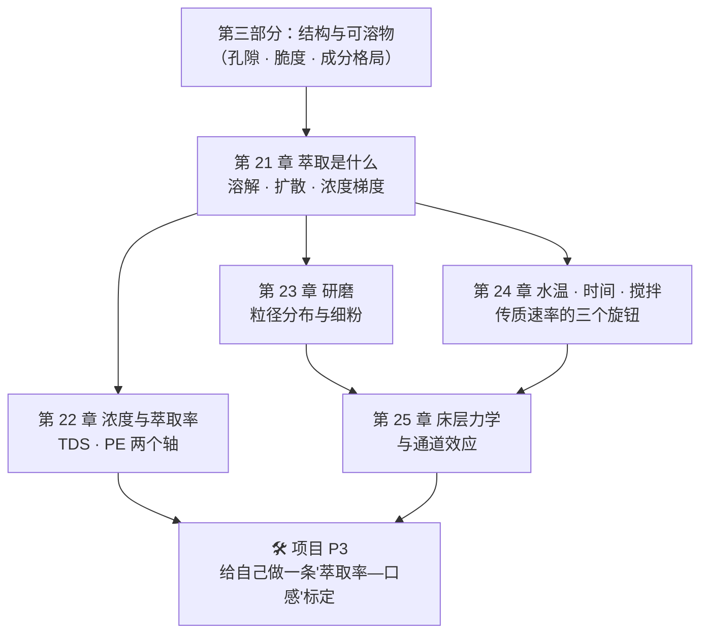

# 第四部分 · 萃取原理：一切冲煮方法的共同底层（导读）

> **前三部分讲的是"杯子里可能有什么"，这一部分开始讲"怎么把它取出来"。**
>
> 这一部分的地位：**它是全书唯一一段"换任何器具都用得上"的内容。**
> 手冲、法压、爱乐压、摩卡壶、意式、冷萃——器具千变万化，
> 底层永远是同一套物理：**溶解 + 扩散 + 传质速率**，
> 再加上一个经常比参数更重要的因素：**均匀性**。
>
> 学完这一部分，你遇到任何一杯不对劲的咖啡，
> 都能把它落进**三格**里的一格：**浓度不对 / 萃取率不对 / 萃取不均匀。**

## 这一部分最容易踩的三个坑

**第一，把"浓"和"萃得多"当成一件事。**
这是全书最值得纠正的一个直觉。**浓度**（TDS）说的是"这杯液体里溶了多少东西"，
**萃取率**说的是"从粉里取走了多少"。它们是**两个独立的轴**：
同一个浓度可以由完全不同的萃取率做到（只要改粉水比）。
第 22 章会把这两个轴画成一个坐标系；在此之前，第 21 章会先讲清楚它们各自的物理来源。

**第二，以为调参数就是在调"多少"。**
[第 17 章](../03-roasting/17-cga-and-bitterness.md)已经埋过一个伏笔：
不同类别的化合物**萃取行为不同**。所以改变水温、粒径与接触时间，
不只改变"取出了多少"，还改变"**取出了哪一类**"。
[第 1 章](../01-foundation/01-bean-composition.md)引用过的那项冷萃对照实验说的正是这件事：
把两杯**统一稀释到相同 TDS** 之后，热冲与冷冲在苦、酸与花香上仍然显著不同。
**浓度相同，不等于成分格局相同。**

**第三，以为"参数正确"就够了。**
真实的冲煮是一个**分布**：粉有粒径分布，床层有流速分布，颗粒有新旧（细粉与粗颗粒）之分。
你算出来的"萃取率 20%"是一个**平均值**，而两杯平均值相同的咖啡，
可以由完全不同的分布构成——一杯均匀，一杯是"一半过萃 + 一半没萃到"。
第 25 章会专门讲这件事；但从第 21 章起，你就该习惯问一句：**这是平均值还是分布？**

## 这一部分的五章 + 一个项目

| 章 | 它回答的问题 | 状态 |
|----|------------|------|
| [21 · 萃取是什么](21-what-is-extraction.md) | 水是怎么把东西带走的？谁是限速步？为什么泡久了就不再变浓？ | ✅ |
| 22 · 浓度与萃取率 | TDS 与 PE 怎么算、怎么用？"金杯"坐标系的边界在哪？ | ⬜ |
| 23 · 研磨 | 为什么"刻度"不是粒径？细粉的双重角色是什么？ | ⬜ |
| 24 · 水温、时间与搅拌 | 三者怎么互相替代、什么时候不能替代？ | ⬜ |
| 25 · 床层力学与通道效应 | 为什么"均匀"往往比"参数正确"更重要？ | ⬜ |
| P3 · 项目 | 固定其他变量，只动一个旋钮，画出属于你自己的坐标 | ⬜ |

## 读这一部分时的三个提示

**第一，这一部分的文献质量比前面高，但"可搬运性"更低。**
萃取是物理化学问题，实验容易控制、可复现性好——这是好消息。
坏消息是：绝大多数定量结果来自**特定器具、特定粉量、特定粒径分布**
（尤其是意式，因为它最容易仪器化）。
所以你会看到本书反复注明"该实验用的是什么器具"——**看到这些限定语，请当真**。

**第二，注意"模型"与"实验"的区别。**
这一部分会引用不少数学模型（多孔介质流动、双孔隙扩散、CFD）。
模型的价值是**给出机理图景与可检验的预测**，不是给你参数。
本书引用模型时会明确写出"这是模型预测"——
与[第 15 章](../03-roasting/15-roasting-physics.md)处理烘焙建模的方式一致。

**第三，这一部分最终要落到你自己的设备上。**
所有"正确参数"都依赖你的磨、你的水、你的豆。
本部分末尾的项目 P3 要做的就是这件事：
**不是背别人的配方，而是标定出你自己的坐标。**

---

**从这里开始**：[第 21 章 · 萃取是什么：溶解、扩散与浓度梯度](21-what-is-extraction.md)
