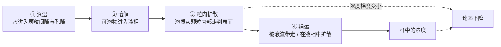
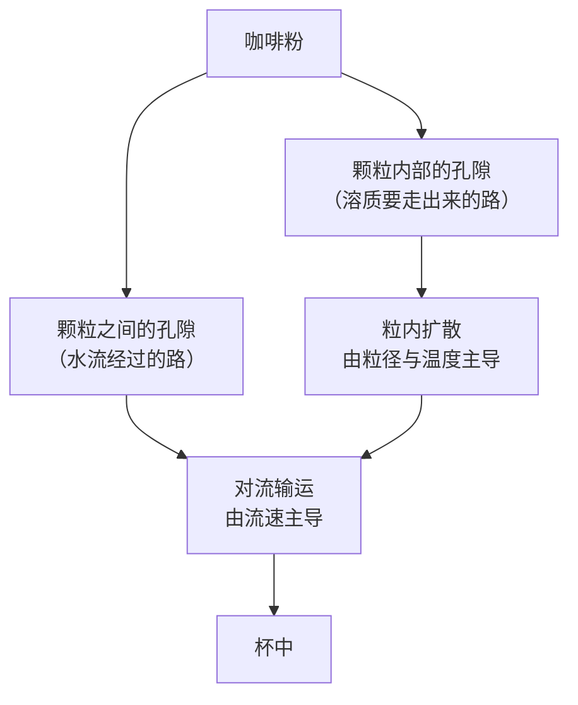
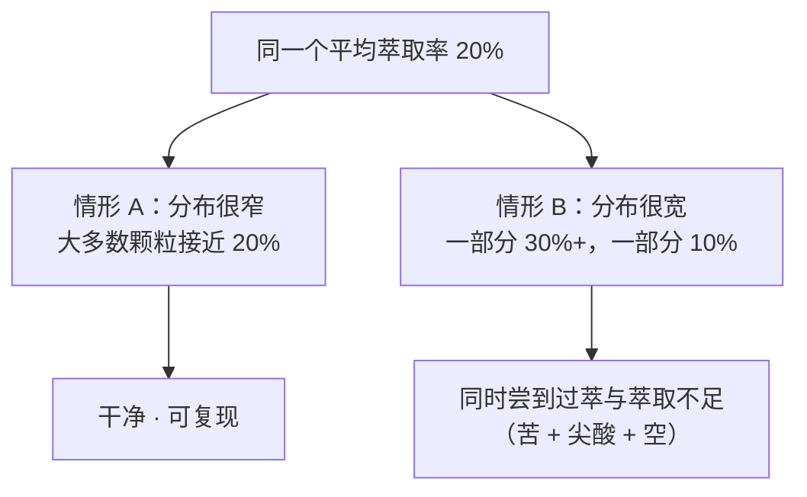

# 第 21 章 萃取是什么：溶解、扩散与浓度梯度

> **本章目标**：把"冲咖啡"翻译成一句物理描述，并找出**谁是限速步**。
>
> 结论先放这里，因为它会改变你调参数的顺序：
>
> > **在经典的浸泡实验里，限速步不是溶解，也不是水流过颗粒表面，
> > 而是溶质在**颗粒内部**的扩散——而且是一种"受阻"的扩散。**
>
> 这条结论有一个非常实际的推论：
> **粒径是你手上最有力的旋钮，而搅拌并不能替代研磨。**
>
> 学完这一章，你会知道"泡久一点会怎样""磨细一点为什么效果这么猛"
> "为什么两杯浓度一样却不一样好喝"分别属于哪个物理问题。

## 21.1 一杯咖啡，就是一次固—液萃取

把咖啡粉浸到水里，实际发生的事可以拆成四步：

**每一步都可能成为瓶颈**，而"哪一步是瓶颈"决定了你该调什么。
本章的任务就是逐步锁定它。

> **先与第三部分接上**：这四步全都发生在一个**多孔的脆性材料**里。
> 生豆的连通孔隙接近于零，是烘焙把它变成了一块可以让水通行的材料
> （[第 18 章](../03-roasting/18-structure-cracks-porosity.md)）。
> **没有烘焙，就没有萃取可言。**

## 21.2 第一步：水要先进得去

润湿不是瞬间完成的，而且它本身可以被观察。

一项用**时间分辨 X 射线显微 CT** 研究意式粉饼的工作，
利用密度差追踪水的**渗润锋面**，把粉床分成**已湿区**与**仍干区**，
并与一维非饱和多孔介质流模型（含泵的动态）对比，得到良好一致[^1]。

**颗粒本身也在变**。一项用激光衍射与显微镜测量熟豆颗粒在水中行为的研究报告[^2]：

| 观察 | 内容 |
|------|------|
| 溶胀 | 颗粒直径**约增加 15%**（覆盖很宽的粒径范围） |
| 速度 | **30 秒内达到最终直径的 60%~80%**，约 **4 分钟**完成——**落在常规冲煮的时间尺度内** |
| 与什么无关 | 溶胀程度**与初始粒径无关，也与烘焙度无关** |
| 副产物 | 湿润伴随**颗粒侵蚀**：细粉比例上升，**温度越高越明显** |
| 作者的方法学提醒 | 先前研究结果差异很大，正是因为没有把**颗粒侵蚀与排气**分离出来 |

> **两条可用的直觉**：
>
> 1. **你冲的不是你磨的那批颗粒**——它们会变大（约 15%）、会掉渣（产生新细粉）；
> 2. **粉床在最初几十秒里一直在变**：颗粒膨胀会改变堆积与流动阻力。
>    这就是为什么"前段注水"这件事有物理意义（**但本书不给时间参数**，留到第 27 章）。

## 21.3 第二步与第三步：先"冲洗"，再"扩散"

文献里描述冲煮动力学的通行图像是**两段式**：
先是颗粒**表面**自由可溶物的快速溶解（常被称为冲洗阶段），
随后是可溶物从**多孔颗粒内部**扩散出来的慢过程。

有一类模型把这个图像写成了方程：**双孔隙（double porosity）模型**——
把体系分成"颗粒之间的孔隙"与"颗粒内部的孔隙"两套，
同时包含**溶解**与**输运**两类过程；
它已被用来描述两种情形：**稀悬浮液中的萃取**与**填充床中的萃取**[^3][^4]。

意式侧的介观模型走的是同一条思路：把粗颗粒当作静止的多孔区域、
把细粉当作随流迁移的颗粒，同时包含**液相扩散与粒内扩散**两套扩散[^5]。

> **为什么要记住"两套孔隙"**：
> 你调**流速/搅拌**时，动的主要是第一套；
> 你调**研磨**时，动的是第二套（缩短溶质要走的距离）。
> 下一节会告诉你：在经典浸泡实验里，**第二套才是瓶颈**。

## 21.4 谁是限速步：三个 1980 年代的漂亮实验

这一节的证据来自一组设计极干净的动力学研究，
它们至今仍是萃取教科书里的骨架。实验对象是**咖啡因**（因为好定量）。

### 实验一：粒径与温度

把中烘肯尼亚阿拉比卡豆磨碎并筛成八个粒径级分，在 25.8 ℃ 下测咖啡因浸出速率[^6]：

| 观察 | 结果 |
|------|------|
| 粒径 | **粒径越小，一级速率常数急剧增大** |
| 温度 | 对某一粒径级分，温度从 **25.8 ℃ 升到 84.1 ℃**，速率常数**上升约 8 倍** |
| 平衡 | 同时测定了咖啡因在咖啡粉与水之间的**分配系数** |
| 机理结论 | 限速步是**咖啡因在溶胀颗粒内部的扩散**；扩散系数小、活化能高，说明这是一种**受阻扩散** |

### 实验二：把"搅拌"单独拿出来测

第二项实验用**旋转圆盘**控制流体力学条件：把磨好并筛过的咖啡粉涂在大水平圆盘上，
在 25 ℃ 的蒸馏水中以不同转速旋转，测咖啡因的萃取速率[^7]：

| 观察 | 结果 |
|------|------|
| 粒径 | 速率常数与**颗粒半径的平方成反比**（约 1/r²） |
| 转速 | **速率常数与转速无关** |
| 结论 | 限速步**不在**颗粒外的扩散边界层（Nernst 层），而**在颗粒内部**；作者指出同样的机理结论可以推广到搅拌的咖啡悬浮液 |

### 实验三：烘焙度改变结构，也改变速率

第三项实验把生豆烘到不同程度，磨到**同一粒径区间（0.85~1.18 mm）**，
在 80 ℃ 水中测咖啡因浸出[^8]：

> 轻度烘焙时半衰期**没有显著变化**；烘得更重时**下降约 40%**；
> 继续烘到焦化再**下降约 30%**。作者把这些动力学参数与失重、颜色、豆体积等物理性质关联[^8]。

> **三个实验合起来，给出本章最有价值的三条推论：**
>
> 1. **粒径是最有力的旋钮**：速率随 1/r² 变化[^7]——粒径减半，速率大约变成四倍，
>    **不是两倍**。这解释了为什么"磨细一点点"经常导致过萃。
> 2. **温度整体加速**：在该实验体系里，从约 26 ℃ 到约 84 ℃ 速率常数升约 8 倍[^6]。
>    这是**冷萃需要几小时到十几小时**的物理原因（第 28 章）。
> 3. **搅拌不能替代研磨**：在这套实验条件下，加快外部流动**不改变**萃取速率[^7]。
>
> ⚠️ **边界必须写清楚**：这三条来自**浸泡/旋转圆盘体系、以咖啡因为指标、常温到 84 ℃ 区间**。
> 在**滤过式**冲煮里，搅拌还会改变粉层分布与接触状况（第 24、25 章），
> 那是另一条机制，**不能**用本节结论去否定。

## 21.5 浓度梯度：为什么"泡久了就不再出东西"

扩散的驱动力是**浓度梯度**——颗粒内部与外部液相的浓度差。于是：

这条曲线有两个直接后果：

| 冲煮方式 | 液相浓度 | 结果 |
|---------|---------|------|
| **浸泡式**（法压壶、聪明杯、冷萃） | 不断上升，最终趋近**分配平衡**[^6] | 泡到一定程度后**几乎不再变浓**；延长时间的边际收益递减 |
| **滤过式**（手冲、意式） | 新鲜的水不断更新液相，梯度被**持续维持** | 只要水还在流，萃取就还在继续——所以"什么时候停"是一个必须主动做的决定 |

> **这条区分是第五部分所有器具讨论的骨架**：
> **浸泡式在"等平衡"，滤过式在"防止走太远"。**
> 两者需要的技能完全不同。

> **本书不写的一个数**：圈内常说"咖啡里约 30% 可溶"。
> 本书**未核到该数字的一手来源**，因此**不写**。
> 能写的是：文献里可核到的是**特定条件下测得的萃取率**，而不是一个普适上限。

## 21.6 不同分子的萃取行为不同

如果所有可溶物都以同样速率溶出，那么"萃取率"这一个数字就够用了。可惜不是。

| 证据 | 内容 |
|------|------|
| 苦味物 | 一项系统研究烘焙参数与热水渗滤的工作明确指出：**不同类别的化合物萃取行为不同**[^9]（[第 17 章](../03-roasting/17-cga-and-bitterness.md)） |
| 冷 vs 热 | 把全部样品**统一稀释到 2% TDS 并在同一温度下供样**后，热冲的苦、酸、橡胶味仍显著高于冷冲，花香则冷冲更高[^10]（[第 1 章](../01-foundation/01-bean-composition.md)） |
| 意式动力学 | 对葫芦巴碱、咖啡因、5-CQA 与 TDS 分十段收集测定：**流速的影响最强**，且在更细研磨与更高水温下更明显；但整体影响**小于**总萃取液质量差异带来的影响[^11] |

> **本书的立场（重申）**：**不存在"先酸、后甜、后苦"的溶出顺序表。**
> 可核到的只有"不同类别行为不同"这一条[^9]；
> 流传的顺序表找不到原始文献（见[出处登记 §七](../../standards.md)）。
>
> 但**方向**是明确的，而且很有用：
> **你的旋钮不仅决定"取出多少"，也决定"取出哪一类"。**

## 21.7 平均值的陷阱：萃取从来不均匀

最后一件必须在第 21 章就说清楚的事：**"这杯的萃取率"是一个平均值。**

一项把一维流动模型与计算流体力学（CFD）对比的研究发现[^12]：

> 在**锥形**（截头圆锥）几何中，流动不均匀会造成**局部萃取水平的显著变化**；
> 作者用"萃取图"把这种变化画出来，并映射到行业常用的冲煮控制图上，
> 指出萃取率的高度不均**可以预期会给杯中带来苦味**[^12]。

另一项意式实验则显示**细粉**如何改变流动：
对给定的中位粒径，不同磨机会给出不同的细粉（<100 μm）比例；
**细粉比例上升 → 粉床渗透率下降 → 流速下降、萃取时间延长**；
同时用质子转移反应质谱观察到**香气物随萃取率呈非线性上升**[^13]。

> **所以从这一章起，请把"萃取率"当成两个问题**：
> **平均值是多少？分布有多宽？**
> 第 22 章讲怎么算平均值，第 23、25 章讲怎么管分布。

## 21.8 常见说法辨析

按本书约定标注**证据强度**：✅ 有共识 / ⚠️ 有争议 / ❌ 明确错误 / **缺乏证据**。

| 说法 | 判定 | 说明 |
|------|------|------|
| "萃取就是溶解" | ⚠️ **只说对了一步** | 溶解之后还要**走出来**；经典实验指认限速步是**粒内受阻扩散**[^6][^7] |
| "搅拌越多萃得越多" | ⚠️ **分体系** | 旋转圆盘实验中速率常数**与转速无关**[^7]；但在滤过式里搅拌会改变粉层与接触（第 24、25 章），属另一条机制 |
| "粒径减半，萃取速度翻倍" | ❌ **是平方关系** | 速率常数约与 **1/r²** 成正比[^7]——减半大约变四倍 |
| "泡得越久越浓" | ❌ **有平衡** | 浸泡式中浓度梯度随液相变浓而下降，最终趋近分配平衡[^6] |
| "咖啡里约 30% 可溶" | **本书未核到出处** | 不写该数字；文献里可核到的是特定条件下的**萃取率测量** |
| "冷萃只是慢一点，其他一样" | ❌ **成分格局不同** | 统一到相同 TDS 后，热冲与冷冲在苦、酸、花香上仍显著不同[^10] |
| "成分按酸→甜→苦的顺序溶出" | **缺乏证据** | 可核到的只有"不同类别行为不同"[^9]；顺序表无一手来源 |
| "细粉只会带来苦味" | ⚠️ **它先改变的是流动** | 细粉比例上升会**降低渗透率、拖慢流速**[^13]；而且湿润本身就在产生新细粉[^2] |
| "同样的萃取率 = 同样的一杯" | ❌ **忽略了分布** | 几何与流动不均会造成局部萃取差异[^12]；平均值相同、分布不同的两杯并不一样 |
| "闷蒸是为了排气" | ⚠️ **留到第 27 章** | 本章能给的物理是**渗润锋面**[^1]与**溶胀 + 颗粒侵蚀**[^2]；排气的定量本书暂不写（第 41 章） |
| "水温越高萃得越多" | ⚠️ **提高的是速率** | 温度主要改变**速率常数**（该体系约 8 倍/60 ℃[^6]）；最终取出多少还取决于时间与平衡 |

## 21.9 🔎 买豆与冲煮时的用处

1. **要大幅改变萃取，先动研磨**：速率对粒径是**平方**关系[^7]，
   所以研磨的杠杆远大于时间和搅拌。相应地，**调研磨时步子要小**。
2. **"再多搅两下"通常不是解法**：在浸泡体系里它不改变限速步[^7]。
   如果你觉得搅拌有用，先怀疑它其实是在**让粉分布更均匀**（那是第 25 章的问题）。
3. **浸泡式不必纠结"多泡一分钟"**：接近平衡后边际收益很小[^6]；
   要更浓应该改**粉水比**（第 22 章）。
4. **滤过式必须主动决定"何时停"**：只要水还在流，萃取就没停。
5. **冷萃要给时间，是物理决定的**：温度低 → 速率常数小[^6]，不是"冷萃更温柔"这种修辞。
6. **两杯浓度一样却不一样好喝，是正常现象**，不是你的味觉出错：
   浓度相同不等于成分格局相同[^10]，也不等于分布相同[^12]。

## 21.10 思考题

1. 请把"冲一杯咖啡"拆成四个步骤，并说明每一步分别由什么主导。
2. 旋转圆盘实验同时给出了两个结果：速率常数与 1/r² 成正比、与转速无关[^7]。
   请解释这两个结果**合在一起**为什么能锁定限速步的位置。
3. 为什么浸泡式咖啡"泡到后来几乎不再变浓"，而手冲"只要水还在流就还在萃"？
   请用浓度梯度解释。
4. 颗粒在水中会溶胀约 15% 并发生侵蚀[^2]。请说明这两件事分别会如何影响一杯手冲，
   以及它们为什么让"粒径"这个变量比听起来更复杂。
5. **【案例】** 一位朋友说："我把研磨从 20 格调到 18 格，怎么一下就苦了？我只动了两格。"
   请用本章的定量关系解释，并给出你建议他下次怎么调。
6. **【案例】** 两杯咖啡测出来都是 TDS 1.35%、萃取率 20%，但一杯干净、一杯又苦又尖。
   请给出**至少两条**本章支持的解释，并设计一个能区分它们的实验。
7. 有人主张"冷萃更健康/更温和，因为萃取得更少"。
   请指出这句话里哪一部分是本章能回答的、哪一部分本书不回答，为什么。
8. **【辨识】** 找两篇讲"萃取原理"的中文文章，看它们有没有出现
   "成分溶出顺序表"或"咖啡可溶物 30%"这类说法，记录它们是否给出出处。

> 📖 **参考答案**（想清楚再看）：[Q1](../../qa/21-what-is-extraction-qa.md#q1) ·
> [Q2](../../qa/21-what-is-extraction-qa.md#q2) · [Q3](../../qa/21-what-is-extraction-qa.md#q3) ·
> [Q4](../../qa/21-what-is-extraction-qa.md#q4) · [Q5](../../qa/21-what-is-extraction-qa.md#q5) ·
> [Q6](../../qa/21-what-is-extraction-qa.md#q6) · [Q7](../../qa/21-what-is-extraction-qa.md#q7) ·
> [Q8](../../qa/21-what-is-extraction-qa.md#q8)

## 21.11 本章实操

### 🅐 无器具版 · 任务一：用两个杯子看"浓度梯度"

只需要咖啡粉、两个杯子、常温水（**常温更慢，更容易看清**）。

1. 甲杯：粉 + 水，**放着不动**；
2. 乙杯：同样的粉 + 同样的水，**每分钟搅一次**；
3. 每 2 分钟观察一次颜色（对着白纸看），记录 10 分钟：

| 时间 | 甲杯（静置）颜色 | 乙杯（搅拌）颜色 | 我的判断 |
|------|----------------|----------------|---------|
| 2 分 | | | |
| 4 分 | | | |
| 6 分 | | | |
| 10 分 | | | |

> **预期与解读**：两杯的差距通常远比想象中小——
> 因为限速步在**颗粒内部**，搅拌主要改变的是外部[^7]。
> **注意**：这是一个粗糙的定性观察（颜色不等于浓度），
> 它的目的是**动摇"搅拌 = 萃取更多"这个直觉**，不是做测量。

### 🅐 无器具版 · 任务二：给自己的冲煮做一次"三格归类"

翻出最近三次不满意的冲煮记录（或凭记忆），把它们归到三格里：

| 这一杯 | 症状描述 | 我的归类（浓度 / 萃取率 / 均匀性） | 依据 | 下次改什么 |
|-------|---------|--------------------------------|------|-----------|
| 1 | | | | |
| 2 | | | | |
| 3 | | | | |

> **归类提示**（第 22 章会更精确）：
> "太淡/太浓但风味没问题" → 多半是**浓度**（改粉水比）；
> "整体尖酸、空、没甜" 或 "整体苦、干" → 多半是**萃取率**；
> **"同时又苦又尖酸"** → 高度怀疑**均匀性**[^12]。

### 🅑 有条件版 · 任务三：粒径的平方效应（备齐后再做）

> **所需**：可调磨豆机、秤、计时器、同一支豆、浸泡器具（法压壶或杯子 + 滤网）。
> **替代方案**：没有磨可以买两种研磨度的挂耳/粉包，但要注明豆可能不同。

固定粉水比、水温与时间，**只改研磨**，做三杯：

| 研磨 | 目测粒径 | 口感（酸/甜/苦/涩） | 与中间那杯的差距 |
|------|---------|------------------|----------------|
| 比平时粗两格 | | | |
| 平时的刻度 | | | |
| 比平时细两格 | | | |

> **要建立的直觉**：**同样"两格"，往细的方向走，变化通常更剧烈**。
> 这与 1/r² 的关系一致[^7]（刻度变化在细端对应的相对粒径变化更大）。
> ⚠️ 磨豆机刻度与粒径**不是线性关系**，这一点第 23 章会展开；
> 本任务只要求你记录**感受到的变化幅度**。

### 🅑 有条件版 · 任务四：浸泡的"平衡感"（备齐后再做）

> **所需**：法压壶或任何可浸泡的容器、秤、计时器、五个小杯。

1. 固定粉水比与水温，做一次浸泡；
2. 在 **1、2、4、8、16 分钟**各取出一小杯（每次取样后不要搅动）；
3. 放凉到接近室温后**依次品尝**（温度会改变感受，[第 4 章](../01-foundation/04-perception.md)）：

| 时间 | 颜色 | 浓度感 | 酸 | 苦 | 与上一杯的差距 |
|------|------|-------|----|----|--------------|
| 1 分 | | | | | — |
| 2 分 | | | | | |
| 4 分 | | | | | |
| 8 分 | | | | | |
| 16 分 | | | | | |

> **预期**：**相邻两杯的差距会越来越小**——这正是浓度梯度下降、趋近平衡的表现[^6]。
> **如果 8 分到 16 分之间差距依然很大**，先检查：粉是不是太粗、水温是不是掉得太快、
> 取样是否搅动了粉层。
>
> 把结果填进[冲煮记录表](../../forms/brew-log.md)，第 22 章会用到这组观察。

---

## 21.12 本章依据

完整书目信息登记在[出处与资料登记 §4.24](../../standards.md)。

- **[EX1]** Spiro, M., & Selwood, R. M. (1984). *The kinetics and mechanism of caffeine infusion
  from coffee: The effect of particle size*. *Journal of the Science of Food and Agriculture* 35(8):915–924。
  用到：八个筛分级分在 25.8 ℃ 下的浸出；**粒径越小速率常数急剧增大**；
  温度自 25.8 升到 84.1 ℃ 速率常数**上升约 8 倍**；测定了**分配系数**；
  结论为**限速步是咖啡因在溶胀颗粒内的扩散**，且扩散系数低、活化能高（**受阻扩散**）。已读摘要。
- **[EX2]** Spiro, M., & Page, C. M. (1984). *The kinetics and mechanism of caffeine infusion from coffee:
  Hydrodynamic aspects*. *JSFA* 35(8):925–930。用到：旋转圆盘控制流体力学条件；
  速率常数**与颗粒半径平方成反比**、**与转速无关**；
  据此判定限速步**不在 Nernst 扩散层**而在颗粒内部，并指出该结论可推广到搅拌的咖啡悬浮液。已读摘要。
- **[EX3]** Spiro, M., & Hunter, J. E. (1985). *The kinetics and mechanism of caffeine infusion from coffee:
  The effect of roasting*. *JSFA* 36(9):871–876。用到：烘到不同程度后磨到同一粒径区间（0.85~1.18 mm）、
  80 ℃ 浸出；半衰期在轻烘时无显著变化、重烘**降约 40%**、烘至焦化再**降约 30%**；
  动力学参数与失重、颜色、豆体积等物理性质相关联。已读摘要。
- **[EX4]** Moroney, K. M., Lee, W. T., O'Brien, S. B. G., Suijver, F., & Marra, J. (2015).
  *Modelling of coffee extraction during brewing using multiscale methods: An experimentally validated model*.
  *Chemical Engineering Science* 137:216–234。**经由 [EX5] 的复述使用**：
  这是被实验验证过的**双孔隙**萃取模型的原始出处。⚠️ **本书未读到其正文与摘要**，仅作坐标。
- **[EX5]** Moroney, K. M., Lee, W. T., O'Brien, S. B. G., Suijver, F., & Marra, J. (2016).
  *Coffee extraction kinetics in a well mixed system*. *Journal of Mathematics in Industry* 7:3（开放获取）。
  用到：该模型**同时包含溶解与输运**、采用**双孔隙**描述，
  并已被证明能描述**稀悬浮液**与**填充床**两种情形。已读摘要。
- **[EX6]** Moroney, K. M., O'Connell, K., Meikle-Janney, P., O'Brien, S. B. G., Walker, G. M., & Lee, W. T. (2019).
  *Analysing extraction uniformity from porous coffee beds using mathematical modelling and computational
  fluid dynamics approaches*. *PLOS ONE* 14(7):e0219906（开放获取）。用到：一维流动模型与 CFD 对比；
  **截头圆锥几何中的非均匀流动造成局部萃取水平显著变化**；用"萃取图"表示并映射到冲煮控制图；
  作者指出萃取率的高度不均**可预期给杯中带来苦味**。已读摘要。
- **[EX7]** Ellero, M., & Navarini, L. (2019). *Mesoscopic modelling and simulation of espresso coffee extraction*.
  *Journal of Food Engineering* 263:181–194。用到：介观模型把粗颗粒当静止多孔区、细粉当随流迁移的颗粒，
  并同时包含**液相扩散与粒内扩散**。已读摘要。
- **[EX8]** Hargarten, V. B., Kuhn, M., & Briesen, H. (2020). *Swelling properties of roasted coffee particles*.
  *JSFA* 100(10):3960–3970（开放获取）。用到：颗粒直径**约 +15%**；**30 秒达 60%~80%、4 分钟完成**；
  **与初始粒径和烘焙度无关**；伴随**颗粒侵蚀**且温度越高越明显；
  作者指出先前结果分歧源于未考虑颗粒侵蚀与排气。已读摘要。
- **[EX9]** Foster, J., Lee, W., Moroney, K., 等 (2025). *Dynamics of liquid infiltration into an espresso bed
  using time-resolved micro-computed tomography: Insights from experiment and modeling*. *Physics of Fluids* 37(1)。
  用到：用 X 射线断层成像追踪**渗润锋面**，把床分为湿区与干区，并与一维非饱和多孔介质流模型比较。已读摘要。
- **[EX10]** Schmieder, B. K. L., Pannusch, V. B., Vannieuwenhuyse, L., Briesen, H., & Minceva, M. (2023).
  *Influence of Flow Rate, Particle Size, and Temperature on Espresso Extraction Kinetics*. *Foods* 12(15):2871（开放获取）。
  用到：分十段收集测定葫芦巴碱、咖啡因、5-CQA 与 TDS；**流速影响最强**，
  且在更细研磨与更高水温下更明显；但整体影响**小于**总萃取液质量差异带来的影响。已读摘要。
- **[EX11]** Smrke, S., Eiermann, A., & Yeretzian, C. (2024). *The role of fines in espresso extraction dynamics*.
  *Scientific Reports* 14:5612（开放获取）。用到：细粉（<100 μm）比例上升**降低粉床渗透率**、
  导致流速下降与萃取时间延长；香气物随萃取率**非线性上升**。已读摘要。
- **[B3]**（第 1 章已登记）用到：**不同类别化合物的萃取行为不同**。
- **[A2]**（第 1 章已登记）用到：统一稀释到 **2% TDS** 并在同一温度供样后，
  热冲的苦、酸、橡胶味仍显著高于冷冲、花香冷冲更高。

**本章刻意没写的东西**：

- **"咖啡可溶物约 30%"**——未核到一手来源；
- **成分的溶出顺序表**——[出处登记 §七](../../standards.md)的不采信条目；
- **任何推荐的水温/时间/粉水比**——留到第 22~27 章，并且要以你自己的设备为准；
- **闷蒸时间与排气量**——本章只给渗润与溶胀的物理，定量留到第 27、41 章；
- **把 1/r² 当成家用磨"刻度"的换算**——刻度不是粒径（第 23 章）。

[^1]: 本书编号 [EX9]：Foster 等 (2025), *Physics of Fluids* 37(1)。
[^2]: 本书编号 [EX8]：Hargarten、Kuhn & Briesen (2020), *JSFA* 100(10):3960–3970（开放获取）。
[^3]: 本书编号 [EX5]：Moroney 等 (2016), *J. Mathematics in Industry* 7:3（开放获取）。
[^4]: 本书编号 [EX4]：Moroney 等 (2015), *Chemical Engineering Science* 137:216–234（**仅作坐标，未读正文**）。
[^5]: 本书编号 [EX7]：Ellero & Navarini (2019), *J. Food Engineering* 263:181–194。
[^6]: 本书编号 [EX1]：Spiro & Selwood (1984), *JSFA* 35(8):915–924。
[^7]: 本书编号 [EX2]：Spiro & Page (1984), *JSFA* 35(8):925–930。
[^8]: 本书编号 [EX3]：Spiro & Hunter (1985), *JSFA* 36(9):871–876。
[^9]: 本书编号 [B3]：Blumberg、Frank & Hofmann (2010), *JAFC* 58(6):3720–3728（第 1 章已登记）。
[^10]: 本书编号 [A2]：Batali 等 (2022), *Foods* 11(16):2440（第 1 章已登记，开放获取）。
[^11]: 本书编号 [EX10]：Schmieder 等 (2023), *Foods* 12(15):2871（开放获取）。
[^12]: 本书编号 [EX6]：Moroney 等 (2019), *PLOS ONE* 14(7):e0219906（开放获取）。
[^13]: 本书编号 [EX11]：Smrke、Eiermann & Yeretzian (2024), *Scientific Reports* 14:5612（开放获取）。

---

**下一章**：第 22 章 浓度与萃取率——TDS、PE 与"金杯"坐标系：
两个独立的轴，怎么算、怎么用，以及它的边界在哪。
