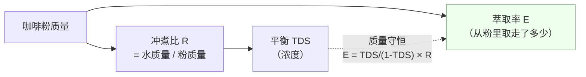
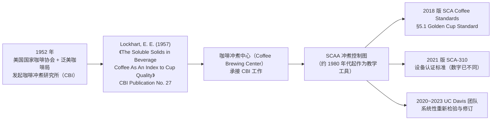
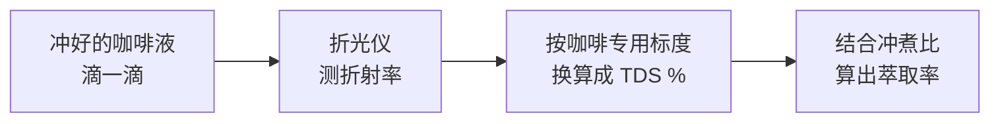
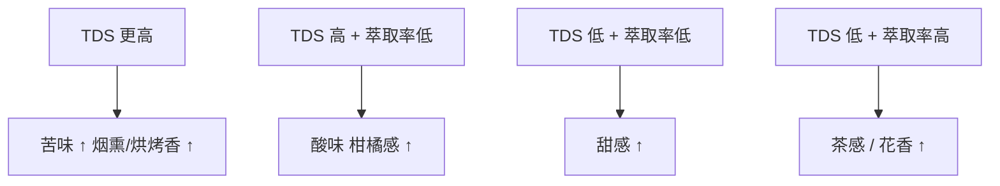

# 第 22 章 浓度与萃取率：TDS、PE 与"金杯"坐标系

> **本章目标**：把"这杯咖啡怎么样"拆成两个可以分别测量的数——
> **浓度（TDS）**和**萃取率（PE）**，讲清楚它们**怎么算、怎么测、互相独立到什么程度**，
> 再讲清楚咖啡圈最常被引用的那张"金杯坐标系"**从哪来、现在还站不站得住**。
>
> 结论先放这里：
>
> > **TDS 回答"这杯有多浓"，PE 回答"从粉里取走了多少"——它们是两个独立的轴，
> > 同一个 TDS 可以由完全不同的冲煮比与萃取率组合出来。**
> > **"18%~22%、1.15%~1.35%"这组数字真实存在、确有出处，但它是 1950 年代一项
> > 细节已不可考的研究留下的历史产物，而不是一条物理定律**——
> > 连 SCA 自己较新的设备认证标准都已经把上限从 1.35% 放宽到 1.55%，
> > SCA 资助的最新感官研究也已经指出这张图的"中心即理想"假设站不住。

## 22.1 先把两个量定义清楚

[第 21 章](21-what-is-extraction.md)已经给出了直觉：**浓度**和**萃取率**是两件事。
这一节把它们变成可以算的数。

| 量 | 定义 | 衡量什么 |
|----|------|---------|
| **[TDS](../../glossary.md#tds)**（total dissolved solids，总溶解固体） | 液体咖啡中溶解物质的**质量占比** | 这杯"**有多浓**" |
| **[萃取率](../../glossary.md#extraction-yield)**（extraction yield，E / PE） | 被溶出进入液体的**干物质质量**，占投入**干咖啡粉质量**的百分比 | "**从粉里取走了多少**" |

两者由质量守恒连在一起。设**冲煮比 R**（water-to-coffee ratio）= 水的质量 ÷ 咖啡粉的质量，
一篇 2021 年的同行评议论文给出了精确的质量守恒式[^1]：

```
萃取率 E = TDS / (1 − TDS) × 冲煮比 R
```

> **这条公式不是近似，是严格的质量守恒**（分母里的 `1 − TDS` 来自"液体总质量 = 水 + 溶出的固体"
> 这一事实，而不是经验拟合）[^1]。
> 把冲煮比近似为"冲出液体质量 ÷ 粉质量"（忽略咖啡粉自身的质量会微量计入液体这一项），
> 就得到了业界更常见的简化写法 `E ≈ TDS × (冲出液体质量 / 粉质量)`——
> 在 TDS 较低（粗略到个位数百分比以下）时，这个简化式与精确式的差距很小[^1]。



> **读这张图的要点**：浓度和萃取率**不是因果关系**，而是**同一个物理过程的两种读数**。
> 调冲煮比能几乎独立地改变 TDS（下一节会给出实验证据），
> 但萃取率是否跟着变、变多少，要看具体的冲煮方式——这正是本章最反直觉的一个结论。

## 22.2 "金杯坐标系"是怎么来的

把 TDS（纵轴）和萃取率（横轴）画成一张图、中间划出一个"推荐区间"，
是咖啡行业最广为流传的一张图——通常被称为"**金杯坐标系**"或"**冲煮控制图**"
（Golden Cup Standard / Coffee Brewing Control Chart）。它的历史脉络如下：



**这张图上每一环的证据强度并不一样**，必须分开说：

> **✅ 高置信度（多来源交叉确认）**：Lockhart 在咖啡冲煮研究所的工作建立了"用 TDS 与萃取率
> 两个坐标描述冲煮质量"这个框架，后被 SCAA / SCA 沿用至今[^3][^4][^5]。
> 这条历史脉络被一篇 2021 年的同行评议论文的引言直接复述——其原话是：
> "Early work by Lockhart established that the TDS and E are good indicators for the quality
> of coffee, with TDS values near 1.25% and E values near 20% identified as 'ideal.'"[^1]
>
> **⚠️ 未核到一手出处**：Lockhart (1957) 这份报告本身**本书未能获取全文或扫描件**。
> 现代所有引用（包括上面这句引言）都是对其**结论性文字**的转引，而不是对原始数据
> 的直接核查——评委人数、统计方法、所用水质与豆种等方法学细节，查不到可公开获取的原文[^6]。
>
> **⚠️ 未核到一手出处**：圈内流传"该区间最初是 17.5%~21.2%，后被 Midwest Research Institute
> 修订为现在的 18%~22%"这一具体修订史，**只见于咖啡行业资深从业者的口述考证**
> （会议演讲 + 行业媒体转载），**没有找到任何一手档案或同行评议论文核实这次修订的方法与理由**[^6]。
> 本书**不写这条具体数字变化**，只提示现行区间的来历比看起来更难追溯。

> **本章对 Lockhart 原始报告的态度**：
> 它是这套坐标系真实的历史起点，这一点有多个独立来源佐证[^1][^3][^4][^5]；
> 但它的**具体实验设计本书查不到**，所以本书只把它当作"历史坐标"来写，
> 不复述其方法学细节，也不把"1.25% / 20%"这两个具体数字当作它本人确凿写下的原文
> （这两个数字来自后人转述，详见 [出处登记 §4.25 GC1](../../standards.md)）。

## 22.3 "18%~22%、1.15%~1.35%"这组数字，现在到底是谁在用

这组数字**确实存在于 SCA 的官方文件**，而且被同行评议论文直接引用过原文[^7]：

> SCA 的 *Coffee Standards*（2018 年修订版）§5.1 "Golden Cup Standard" 写道，
> 金杯标准咖啡的冲煮浓度（TDS）应为 **1.15% 到 1.35%**，对应**萃取率 18% 到 22%**。

但这不是 SCA 唯一在用的数字。SCA 2021 年发布的设备认证标准
**SCA-310（Home Coffee Brewers: Specifications and Test Methods）**
把目标浓度区间定为**标准冲煮比（55 g 咖啡 / 1.000 kg 水）下 1.15%~1.55%**[^8]——
**上限被放宽了**，萃取率区间则没有在该标准中单独给出。

| 文件 | TDS 目标区间 | 萃取率目标区间 | 冲煮比 |
|------|-------------|---------------|--------|
| SCA *Coffee Standards*（2018 版）§5.1 | 1.15%~1.35% | 18%~22% | 未在该条文中给出 |
| SCA-310（2021 版设备认证标准） | **1.15%~1.55%** | 未单独给出 | 55 g/1.000 kg（约 1:18.2） |

> **本书的立场**：**不判定哪个数字"对"**。它们来自同一个机构不同时间、不同用途的文件，
> 本身就说明"金杯标准"从来不是一个一次性钉死、永不变化的数字。
> 正文与读者引用"金杯"时，**请标明这是哪一份文件、哪一年的数字**，
> 并以**查询当时的 SCA 官网**为准——这与[第 3、13 章](../01-foundation/03-water.md)
> 处理"SCA 水质表""生豆分级标准"时的纪律完全一致。
> 本书两次直接核对 `sca.coffee` 上这两份 PDF 的官方链接，**当日均返回 404**；
> 本章引用的条文内容经同行评议论文全文直接引述（[^7]）与检索引擎对该标准条文的独立转引
> 交叉确认，但**本书未能亲自读到两份 SCA PDF 的完整原文**，按纪律标注为⚠️待核
> （见[出处登记 §4.25](../../standards.md)）。

## 22.4 怎么测：折光仪与 TDS

实务上，没人去测"干物质质量"——那需要把整杯咖啡烘干。
行业通行的做法是用**折光仪**测折射率，换算成 TDS。



**这个换算标度是怎么定下来的**：一篇 2021 年的论文用已知质量的**速溶咖啡**溶于已知质量的水，
配出一系列精确已知 TDS 的溶液，再用数字折光仪（VST）去测，拿回归曲线与真值比较[^1]：

> 配制液的真实浓度按 `TDS = 速溶咖啡质量 / (速溶咖啡质量 + 水质量) × 100%`
> 计算；作者报告"折光仪给出了极好的 TDS 测量"（原文："the refractometer yields excellent
> measurements of the TDS"）[^1]。
> 另一篇独立的同行评议研究同样写道："用烘箱干燥法做的校准实验证实，数字折光仪给出了
> 准确的 TDS 测量"（原文："Calibration experiments with oven-drying of brewed coffee samples
> confirmed that the digital refractometer yielded accurate measures"）[^9]。

> **为什么不能直接套用蔗糖 Brix 标度**：咖啡液里是几百种不同的可溶物混合物，
> 每种物质对折射率的贡献并不相同；通用的 Brix 标度是按**蔗糖溶液**标定的。
> 咖啡专用折光仪（如 VST、部分型号的 Atago）出厂时用**咖啡专用标定曲线**，
> 这条曲线本身是用烘箱重量法作为"真值"反推出来的[^1][^9]。
> ⚠️ **具体的 Brix→咖啡 TDS 换算系数**（市面上能查到一些具体回归系数）
> **只见于非同行评议的行业技术笔记**，本书不采信其具体数字，只写这个方向性结论
> （见[出处登记 §4.25 的不采信条目](../../standards.md)）。

### 烘箱干燥法的一个系统性陷阱

另一种测萃取率的办法是**烘箱干燥法**：把冲完的湿咖啡渣烘干，用干燥前后的质量差
倒推"粉里被取走了多少"。这个办法存在一个容易被忽略的系统性误差，
由前面提到的那篇 2021 年论文首次系统地建模并验证[^1]：

> 湿咖啡渣里**滞留着一部分冲煮液**（连同其中溶解的可溶物）。
> 把湿渣直接烘干，这部分滞留液里的可溶物会被**错误地算作"没被萃出"**，
> 导致烘箱法测出的萃取率**系统性低于**真实的平衡萃取率。
> 冲煮比越低（粉越多、水越少），滞留液占比越大，这个低估就越严重。
> 作者用实验验证：冲煮比 ≥ 3 时，**用 TDS 与冲煮比直接算出的"平衡萃取率"为
> 20.70% ± 1.08%**，与模型预测的 **21.5% ± 0.2%** 高度吻合；
> 而**同一批次用烘箱法测出来的萃取率明显更低，且随冲煮比增大才逐渐逼近这个平衡值**[^1]。

> **实践含义**：如果你看到两份资料给出的"萃取率"数字对不上，
> 先问**它们是怎么测的**——用折光仪读 TDS 再换算，和直接烘干咖啡渣，
> 测的不是同一件事，差距在低冲煮比（浓缩冲煮、意式）下会更明显。

## 22.5 一个反直觉的发现：全浸泡式几乎锁死了萃取率

这是本章最值得记住的一条物理结论，来自同一篇论文的系统实验[^1]。

作者给全浸泡式冲煮（法压壶、冷萃、传统杯测都属于此类）建立了一个**平衡脱附模型**：
假设液相与固相之间存在一个**平均化的平衡常数 K**（刻画可溶物在固、液两相间分配的难易程度），
以及豆本身**最大可萃取比例 E_max**，推导出——

```
平衡 TDS = K × E_max / (冲煮比 R + K × E_max)
平衡萃取率 E = K × E_max
```

注意第二个式子：**平衡萃取率 E 不含冲煮比 R**——模型预测它**与冲煮比无关**，
只取决于豆与水之间的平衡常数 K 和豆本身的可溶解上限 E_max。

| 实验 | 冲煮比范围 | 测得的平衡萃取率 | 与模型预测的吻合度 |
|------|-----------|----------------|------------------|
| 1 L 杯全浸泡（多种水温、多种粒径） | 3~25 | **20.70% ± 1.08%** | 模型预测 21.5% ± 0.2% |
| 传统杯测协议（含咖啡因咖啡，五种烘焙度） | 12~21 | **23.9% ± 0.6%** | 模型预测 23.79% |
| 传统杯测协议（低咖啡因咖啡） | 12~21 | **22.2% ± 0.4%** | 模型预测 21.79% |

同一组实验还发现：这个平衡常数 K 在 **80~99 ℃** 的范围内**对水温不敏感**，
粒径在很宽的范围内对最终萃取率的影响也很小（萃取率变化幅度约在 19%~23% 之间）[^1]。

> **这条结论的实践分量很重**：
>
> 1. **全浸泡式能精确调浓度，却几乎调不动萃取率**——
>    改冲煮比能让 TDS 大幅变化（该实验中从约 0.7% 变到约 13%），
>    但萃取率始终在 20%~24% 这个窄区间里打转[^1]；
> 2. **想要更低或更高的萃取率，全浸泡式天生做不到**——
>    论文作者明确指出：要萃取率更低，只能**提前中断冲煮**（不等它到平衡）；
>    要萃取率更高，**单次全浸泡做不到**[^1]；
> 3. **滤过式（手冲、意式）没有这个限制**——因为水在持续流动、持续更新，
>    流速、冲煮比、总时长可以独立调节，这正是滤过式"更灵活、但也更难稳定"的物理原因，
>    留到[第 26、27 章](../../roadmap.md)细讲。
>
> ⚠️ **边界条件**：这组数字来自**特定的豆、特定的水、特定的温度范围（80~99 ℃）**，
> **不要**把 "20.70%" 或 "23.9%" 当成放之四海而皆准的全浸泡式萃取率——
> 论文本身的落脚点是"**机制**"（萃取率与冲煮比无关），不是某个通用数值。

## 22.6 浓度与萃取率各自对应什么感受

如果 TDS 和萃取率只是两个抽象的数字，这一章就没有意义。
两篇围绕"金杯坐标系"展开的系统感官研究把这件事落到了具体感受上。

一项用响应面法系统改变滴滤咖啡 TDS 与萃取率、让受训评审描述感官属性的研究报告[^10]：

> **更高的 TDS** 强烈关联**更强的苦味、烟熏味与烘烤香**；
> **TDS 高且萃取率低**关联**更强的酸味与柑橘感**；
> **TDS 低**则在**低萃取率**端关联**更强的甜感**、在**高萃取率**端关联**更强的茶感/花香**。

另一项同行评议研究进一步挑战了"萃取率越高越苦"这个经典图表的隐含假设[^11]：

> 在固定萃取率、只变 TDS 的一组对比中，**苦、涩、稠厚感主要只随 TDS 变化**
> （原文："had significant differences based on TDS alone"），
> 而经典冲煮控制图把苦味画成"**萃取率越高越苦**"
> （原文对此评价为"might not be a useful descriptor"）。
> 这组实验还证明：**固定 TDS 与萃取率时，87~93 ℃ 范围内的冲煮水温**
> **对受训评审能分辨的感官轮廓没有显著影响**[^11]——
> 也就是说，水温本身可能不是直接的风味变量，它更多是**通往某个 TDS/萃取率组合的路径**。



> ⚠️ **这张图是本书根据[^10]的文字描述自绘的示意图**，不是对 SCA 或任何机构官方图表的复制，
> 也**不是**一张"数据越靠近中心越好"的推荐坐标——它只标出四个**方向性**关联，
> 不代表具体数值边界。

## 22.7 这张图近年被怎么修订

既然浓度与萃取率真的对应不同的感官方向，那"中间一块方格是理想区"这个经典画法
自然会受到挑战。SCA 自己的新闻页面总结了近年的争议和后续工作[^12]：

经典冲煮控制图被指出三个问题：

1. **混淆了"描述性"与"喜好性"**——假定图表中央那个区域对所有人都是"理想"的，
   但没有数据支持这一点；
2. **方格边界暗示了比实际感知更精细的差异**——文中举例，
   大多数评审**分辨不出**萃取率 17.9% 和 18.1% 之间的差别；
3. **把咖啡风味简化成"苦"与"欠发展"两极**，忽视了风味轮上数以百计的属性。

UC Davis 团队随后用逾 58000 个感官数据点、为**每一个感官属性**分别画等高线图，
发现不同风味属性的峰值落在 TDS–萃取率平面的**不同区域**
（例如甜感在低 TDS 低萃取率，黑巧克力感在高萃取率低 TDS）[^13][^12]。

> **本书的立场**：**SCA 官方认证体系（如 SCA-310）仍部分沿用固定区间，
> 但 SCA 资助的最新学术研究已系统性质疑"中心即理想"这一假设，并提出按属性分别作图的修订方案；
> 二者目前并存，后者尚未正式取代前者。**
> 这与[第 20 章](../03-roasting/20-roast-defects.md)处理"发展时间比"时的态度一致：
> **行业工具的历史地位 ≠ 它仍然是被最新证据支持的最优描述**。

## 22.8 一个顺带澄清：Jonathan Gagné 不是同行评议来源

咖啡圈经常引用一位名叫 Jonathan Gagné 的作者关于"用折光仪测到 0.01% 精度"
之类的技术主张（他著有自费出版书籍《The Physics of Filter Coffee》，并经营相关技术博客）。

> **本书核对后的结论**：检索未发现他发表过任何同行评议期刊论文。
> 他关于折光仪精度、萃取率计算方法的内容，**全部来自个人博客与自费出版书籍**，
> 不属于本书查证纪律里"一手优先"的任何一级（同行评议论文 / 标准 / 权威教材）。
> **这不代表内容一定是错的**，但本书**不把它当作科学依据引用**，
> 只在这里说明它的性质——咖啡圈大量"看起来很专业"的内容其实都是这个层级。

## 22.9 常见说法辨析

按本书约定标注**证据强度**：✅ 有共识 / ⚠️ 有争议 / ❌ 明确错误 / **缺乏证据**。

| 说法 | 判定 | 说明 |
|------|------|------|
| "浓度和萃取率是一回事" | ❌ **明确错误** | 两者由质量守恒关联，但彼此**独立可调**：同一 TDS 可以来自完全不同的冲煮比与萃取率组合[^1] |
| "金杯标准是 SCA 定的唯一标准数字" | ⚠️ **只说对了一半** | SCA 不同文件数字不完全一致（2018 版 1.15%~1.35% vs 2021 版 1.15%~1.55%），且该坐标系的历史起点是 Lockhart 1950 年代的研究，不是 SCA 原创[^1][^7][^8] |
| "萃取率 18%~22% 是颠扑不破的科学结论" | ⚠️ **历史产物，证据链不完整** | 它确实写在 SCA 官方文件里[^7]，但其历史起点 Lockhart (1957) 的原文本书**未核到**，且 SCA 资助的新研究已指出"中心即理想"的假设缺乏依据[^11][^12] |
| "用折光仪测 TDS 不如烘箱法准" | ❌ **方向反了** | 经烘箱法校准过的折光仪读数本身就与真值吻合[^1][^9]；**烘箱法自己反而有系统性低估**，因为忽略了湿渣中滞留的冲煮液[^1] |
| "全浸泡式泡久一点，萃取率就能调高" | ❌ **到平衡后调不动** | 实验显示平衡萃取率与冲煮比（在该实验范围内也包括延长时间到平衡）几乎无关；能调的是**到达平衡前**提前中断[^1] |
| "萃取率越高，咖啡越苦" | ⚠️ **部分实验未支持** | 一项系统实验显示苦味**主要只随 TDS 变化**，与萃取率的关联弱于经典图表暗示的程度[^11] |
| "冲煮水温本身是决定风味的关键变量" | ⚠️ **可能只是路径变量** | 固定 TDS 与萃取率后，87~93 ℃ 范围内的水温对受训评审可分辨的感官轮廓无显著影响[^11]；但该结论的温度范围较窄 |
| "Jonathan Gagné 的折光仪方法是科学定论" | **缺乏证据（非一手科学来源）** | 未查到其同行评议发表记录，内容属于博客/自费出版层级 |

## 22.10 🔎 买豆与冲煮时的用处

1. **看到"按金杯标准冲煮"这类宣传语，先问是哪份文件的哪个数字**：
   "金杯"不是一个一成不变的常数，SCA 自己的文件之间都有出入（§22.3）。
2. **用法压壶或冷萃想"泡久一点让它更浓更有层次"，先分清你想调的是哪个轴**：
   泡到平衡后，萃取率基本调不动了，想变浓该改**冲煮比**，不是继续泡（§22.5）。
3. **同一包豆，手冲和法压壶"浓淡感"不同很正常**：
   滤过式可以独立调流速与总时长，全浸泡式的萃取率却被平衡死死锁住，两者物理机制不同（§22.5）。
4. **怀疑一杯"太苦"，先用 TDS 而不是萃取率去想**：
   至少在一项系统研究里，苦味与 TDS 的关联比与萃取率的关联更直接（§22.6）。
5. **买了折光仪，别纠结"准不准"，先确认它是不是咖啡专用标定**：
   通用 Brix 标度和咖啡专用标度不是一回事（§22.4）。

## 22.11 思考题

1. 请写出 TDS 与萃取率之间的质量守恒公式，并说明为什么这是一个**精确关系**而不是经验拟合。
2. 一篇论文证明"全浸泡式在平衡时萃取率与冲煮比无关"。
   请解释这个结论对"调冲煮比能不能让咖啡既更浓又萃取率更高"这个常见愿望意味着什么。
3. 烘箱干燥法为什么会系统性低估萃取率？请说明误差的来源，以及这个误差会在什么条件下变大。
4. 请说明本章为什么**不**把"18%~22%、1.15%~1.35%"这组数字写成"金杯标准就是这样规定的、
   不需要再讨论"，而是花了一整节去讲它的历史与版本差异。
5. **【案例】** 一位朋友买了台折光仪，测出今天冲的咖啡 TDS 只有 0.9%，
   对照"金杯标准 1.15%~1.35%"觉得自己冲得太淡了，打算把研磨磨得更细。
   请指出他这个判断里可能存在的至少两个问题。
6. **【案例】** 某咖啡馆的冷萃菜单写着："我们的冷萃萃取率高达 25%，比金杯标准的 18%~22% 更充分，
   风味更饱满。" 请结合本章内容，指出这句话里哪些是可核实的、哪些需要追问
   （包括追问他们是怎么测的）。
7. 一篇研究发现"固定 TDS 与萃取率时，87~93 ℃ 范围内水温对感官轮廓没有显著影响"。
   请说明这是否意味着"冲煮水温不重要"，并指出该结论成立的边界条件。
8. **【辨识】** 找一份你能接触到的咖啡器具或折光仪的说明书/宣传页，
   看它有没有提到"金杯标准"或具体的 TDS/萃取率数字，并查它有没有标明数字的出处年份。

> 📖 **参考答案**（想清楚再看）：[Q1](../../qa/22-tds-pe-golden-cup-qa.md#q1) ·
> [Q2](../../qa/22-tds-pe-golden-cup-qa.md#q2) · [Q3](../../qa/22-tds-pe-golden-cup-qa.md#q3) ·
> [Q4](../../qa/22-tds-pe-golden-cup-qa.md#q4) · [Q5](../../qa/22-tds-pe-golden-cup-qa.md#q5) ·
> [Q6](../../qa/22-tds-pe-golden-cup-qa.md#q6) · [Q7](../../qa/22-tds-pe-golden-cup-qa.md#q7) ·
> [Q8](../../qa/22-tds-pe-golden-cup-qa.md#q8)

## 22.12 本章实操

### 🅐 无器具版 · 任务一：拆解一句"金杯"文案

找一份豆袋、咖啡馆菜单或器具广告里提到"金杯标准""黄金萃取率"之类字样的文案
（没有就上网搜一条），填表：

| 文案原话 | 它提到的具体数字 | 它有没有标注出处/年份 | 对照本章 §22.3，属于哪种情况 |
|---------|---------------|-------------------|---------------------------|
| | | | |

> **判断提示**：没有标年份/文件出处的"金杯标准"宣传语，本身就值得多问一句
> ——它引用的是 1957 年的原始研究、2018 年的 SCA 标准、还是 2021 年的设备认证标准？
> 三者数字并不完全相同（§22.3）。

### 🅐 无器具版 · 任务二：用公式自己算一遍

假设你有一次冲煮：咖啡粉 15 g，冲出液体 240 g，用折光仪测得 TDS = 1.30%。

1. 用近似公式 `E ≈ TDS × (冲出液体质量 / 粉质量)` 算出萃取率；
2. 再用精确公式 `E = TDS / (1 − TDS) × 冲煮比 R`（冲煮比 R = 水质量/粉质量，
   这里可用冲出液体质量近似水质量）算一遍；
3. 比较两次结果的差距。

| 步骤 | 计算 | 结果 |
|------|------|------|
| 近似式结果 | | |
| 精确式结果 | | |
| 两者差距 | | |

> **预期**：在这个 TDS 量级下，两种算法的差距应该很小（§22.1）。
> 如果你以后遇到 TDS 很高的浓缩冲煮（如意式），再回来验证差距是否变大。

### 🅑 有条件版 · 任务三：验证"全浸泡式萃取率锁死了吗"（备齐后再做）

> **所需**：法压壶或任何可浸泡容器、秤、折光仪（没有折光仪可以只做定性版，见下）、计时器。

固定豆与粉量，只改变**冲煮比**（即只改变水量），做三杯全浸泡，泡到你平时认为"够了"的时间：

| 冲煮比 | TDS（折光仪） | 算出的萃取率 | 口感印象 |
|-------|-------------|------------|---------|
| 1:12（较浓） | | | |
| 1:16（常规） | | | |
| 1:20（较淡） | | | |

> **预期**：TDS 应该随冲煮比明显变化，但**算出的萃取率应该相对接近**（§22.5）。
> **没有折光仪的替代方案**：对着白纸看三杯的颜色深浅差异（替代 TDS 的粗略指标），
> 并记录三杯的"浓淡感"与"风味饱满度"是否呈现相同的变化趋势——
> 如果浓淡感差异明显但"饱满度/复杂度"印象接近，这是萃取率相对恒定的一个间接佐证。

### 🅑 有条件版 · 任务四：给折光仪做一次自检（备齐后再做）

> **所需**：折光仪、速溶咖啡、秤、水。

参照 [^1] 的校准思路，自己配几杯已知浓度的"咖啡液"来检查折光仪读数是否合理：

1. 称 1 g 速溶咖啡 + 99 g 热水，算出真实 TDS（= 1/(1+99) × 100% ≈ 0.99%）；
2. 用折光仪测这杯液体，记录读数；
3. 换一个浓度（如 2 g / 98 g）重复。

| 配制浓度（计算值） | 折光仪读数 | 差距 |
|------------------|----------|------|
| ≈ 0.99% | | |
| ≈ 1.96% | | |

> **预期**：读数应该接近计算值（该设备类型在原始研究中表现"excellent"[^1]）。
> 如果差距很大，先怀疑仪器是否需要清洁或重新校零，而不是怀疑这个方法本身。

---

## 22.13 本章依据

完整书目信息登记在[出处与资料登记 §4.25](../../standards.md)。

- **[GC1]** Lockhart, E. E., Pan American Coffee Bureau, & National Coffee Association of U.S.A. (1957).
  *The Soluble Solids in Beverage Coffee As An Index to Cup Quality*. Coffee Brewing Institute, Publication No. 27。
  用到："金杯"坐标系的历史起点。⚠️ **本书未能获取原文**，仅通过 [GC2] 的引言转引确认其存在与大致结论。
- **[GC2]** Liang, J., Chan, K. C., & Ristenpart, W. D. (2021). *An equilibrium desorption model for the
  strength and extraction yield of full immersion brewed coffee*. *Scientific Reports* 11:6904。开放获取。
  用到：TDS/萃取率的质量守恒精确式；全浸泡式平衡脱附模型；平衡萃取率与冲煮比无关的实验证据；
  烘箱干燥法系统性低估萃取率的推导与验证；折光仪经速溶咖啡配制液校准的方法与结果。已读全文。
- **[GC3]** Batali, M. E., Ristenpart, W. D., & Guinard, J.-X. (2020). *Brew temperature, at fixed brew
  strength and extraction, has little impact on the sensory profile of drip brew coffee*. *Scientific Reports*
  10:16450（勘误 *Sci Rep* 2021, 11, 2676）。开放获取。
  用到：直接引述 SCA 金杯标准区间（1.15%~1.35% / 18%~22%）原文；对经典图表"ideal"措辞的批评；
  苦/涩/稠厚感主要只随 TDS 变化的实验证据；固定 TDS 与萃取率时水温（87~93 ℃）对感官轮廓无显著影响。已读全文相关段落。
- **[GC4]** Frost, S. C., Ristenpart, W. D., & Guinard, J.-X. (2020). *Effects of brew strength, brew yield,
  and roast on the sensory quality of drip brewed coffee*. *Journal of Food Science* 85(8):2530–2543。
  用到：响应面法测定 TDS × 萃取率对多项感官属性的方向性影响。⚠️ 仅通过 [GC2] 引言转述确认，未读全文。
- **[GC5]** Guinard, J.-X., Frost, S., Batali, M., Cotter, A., Lim, L. X., & Ristenpart, W. D. (2023).
  *A new Coffee Brewing Control Chart relating sensory properties and consumer liking to brew strength,
  extraction yield, and brew ratio*. *Journal of Food Science* 88:2168–2177。
  用到：UC Davis 团队对经典金杯图的系统性修订，按属性分别作图。⚠️ 仅通过 [SCA5] 官方新闻稿转述确认，未读全文。
- **[SCA3]** Specialty Coffee Association (2018, Revised). *SCA Coffee Standards*, §5.1 Golden Cup Standard。
  用到：官方 TDS 1.15%~1.35% / 萃取率 18%~22% 的条文（经 [GC3] 全文引述确认措辞）。
  ⚠️ 官网 PDF 2026-10 核对当日返回 404，本书未能亲自读到完整原文。
- **[SCA4]** Specialty Coffee Association (2021). *SCA Standard 310-2021: Home Coffee Brewers —
  Specifications and Test Methods*。用到：标准冲煮比 55 g/1.000 kg 水；目标浓度区间 1.15%~1.55%。
  ⚠️ 官网 PDF 2026-10 核对当日同样返回 404，内容经检索引擎对标准条文的独立转引确认，本书未亲自读到完整原文。
- **[SCA5]** Specialty Coffee Association. *Towards a New Brewing Chart*. SCA News, Issue 25-13。
  用到：经典冲煮控制图三项缺陷的官方总结；[GC5] 研究的介绍与关键发现复述。已直接读取原文。

**本章刻意没写的东西**：

- **Lockhart (1957) 原始报告的实验方法细节**（评委人数、统计方法、水质、豆种）——未核到一手出处；
- **"17.5%~21.2% 后被改成 18%~22%"这一具体修订史**——仅见于口述考证，未见一手档案；
- **折光仪 Brix→咖啡 TDS 换算的具体回归系数**——仅见于非同行评议技术笔记；
- **任何推荐的冲煮比、水温、时间数字**——那是第 24~27 章的内容，并且要以你自己的设备为准；
- **把 Jonathan Gagné 的博客/书籍内容当作科学依据**——未查到同行评议发表记录。

[^1]: 本书编号 [GC2]：Liang, Chan & Ristenpart (2021), *Scientific Reports* 11:6904（开放获取）。
[^3]: 本书编号 [GC2] 引言复述 Lockhart 工作。
[^4]: 本书编号 [SCA5]：SCA News, *Towards a New Brewing Chart*。
[^5]: 本书编号 [GC3]：Batali, Ristenpart & Guinard (2020), *Scientific Reports* 10:16450。
[^6]: 见[出处登记 §4.25 GC1](../../standards.md) 与「不采信清单」。
[^7]: 本书编号 [SCA3]：SCA *Coffee Standards*（2018 版）§5.1，经 [GC3] 全文引述确认措辞。
[^8]: 本书编号 [SCA4]：SCA Standard 310-2021。
[^9]: 本书编号 [GC3]：Batali, Ristenpart & Guinard (2020), *Scientific Reports* 10:16450，
  "Physical measurements of coffee samples" 一节。
[^10]: 本书编号 [GC4]：Frost, Ristenpart & Guinard (2020), *Journal of Food Science* 85(8):2530–2543。
[^11]: 本书编号 [GC3]：Batali, Ristenpart & Guinard (2020), *Scientific Reports* 10:16450。
[^12]: 本书编号 [SCA5]：SCA News, *Towards a New Brewing Chart*。
[^13]: 本书编号 [GC5]：Guinard 等 (2023), *Journal of Food Science* 88:2168–2177。

---

**下一章**：第 23 章 研磨——粒径分布、细粉与表面积：
为什么"刻度"不是粒径，细粉的双重角色是什么。
