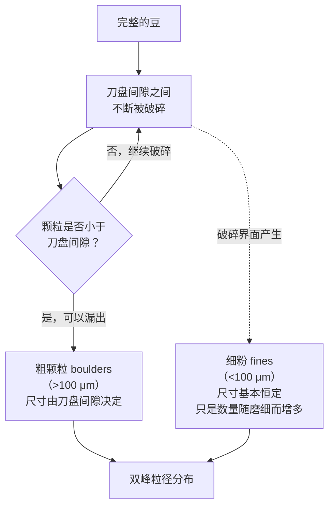
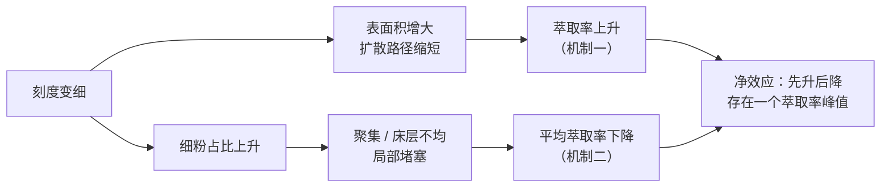

# 第 23 章 研磨：粒径分布、细粉与表面积

> **本章目标**：讲清楚研磨这件事里最容易被忽略的三点——
> **磨豆机的"刻度"不是一个可跨场景比较的物理量**、
> **磨出来的从来不是"一个粒径"而是一条分布（而且是双峰的）**、
> **细粉的作用比"会变苦"复杂得多**。
>
> 结论先放这里：
>
> > **刻度只在"同一台磨、同一豆温、同一副刀盘状态"下才有意义。**
> > 换磨豆机、换季节室温、磨头用热之后，同一个刻度数字对应的早已不是同一个粒径。
> > 磨出来的粉从来不是单一粒径，而是"**粗颗粒（boulders）+ 细粉（fines）**"的双峰分布——
> > 细粉数量占了绝大多数、还占了粉体大部分的表面积，
> > 但**细粉真正被实验证实的核心作用是降低粉床渗透率，而不是"因为表面积大所以萃得更多"**。

## 23.1 刻度不是粒径

[第 21 章](21-what-is-extraction.md)已经证明萃取速率与粒径的平方成反比，
是手上最有力的旋钮。但"调研磨"真正调的是什么？——是磨豆机面板上的一个**刻度数字**，
而刻度和真实粒径之间，隔着好几层容易被忽略的变量。

一项用激光衍射系统测量研磨颗粒的研究，把磨豆机刻度**固定不变**（Mahlkönig EK43，
刻度固定在 2.7），只改变**豆子本身的温度**，结果发现[^1]：

> 把豆子从室温冷冻到 **−200 ℃** 再磨，**众数粒径下降约 31%**[^1]。
> 作者据此直接警告：**磨头在使用中会逐渐升温**，
> "磨头变热后，要获得与磨头较冷时同样的有效表面积，可能需要把刻度调细"[^1]。

这意味着：**同一个刻度数字，在"磨头刚开始冷的时候"和"连续出了几十杯之后磨头发热时"，
对应的根本不是同一个粒径**。同一台磨尚且如此，换一台磨豆机（不同品牌、不同刀盘几何）
就更谈不上"刻度 3 等于刻度 3"了。

> **这条结论的实践分量**：
>
> 1. **不要相信"别人家的刻度 X"能直接套到你自己的磨上**——哪怕是同一型号，
>    刀盘状态、环境温度都会让同一个数字对应不同的粒径；
> 2. **连续冲煮一段时间后，可能需要微调刻度**——不是因为你的手艺变了，
>    而是磨头确实在变热；
> 3. **磨豆机的刻度盘本身也不是线性的**——这一点[第 21 章的案例题](../../qa/21-what-is-extraction-qa.md#q5)
>    已经埋过伏笔：细端的"一格"对应的粒径变化通常比粗端的"一格"更大。

同一研究还有一个容易被忽视但很重要的发现：固定刻度下，**按颗粒数量统计**，
粒径分布看起来接近一个偏态的单峰（类高斯）形状；但**按表面积加权统计**，
分布"因为细粉贡献了可及表面积的大部分，而呈现明显的双峰"（原文直引）[^1]。
也就是说，**"粒径分布长什么样"取决于你用什么口径去看它**——这是下一节要展开的主题。

同一研究还确认了一件对豆袋信息有用的事：**粒径分布与豆子的产地和处理法基本无关**[^1]——
换句话说，"这支豆更难磨细"这类说法，更可能来自烘焙度或新鲜度差异，而不是产地本身
（烘焙度如何改变可磨性，见[第 18 章](../03-roasting/18-structure-cracks-porosity.md)）。

## 23.2 磨出来的从来不是一个粒径：双峰分布

一项用数学建模 + 实验系统研究意式萃取的工作，直接测量了磨豆机磨出来的粒径分布，
并给出了一个非常直观的类比[^2]：

> 咖啡颗粒的粒径分布是**双峰**的，就像**爆炸性火山岩碎屑的粒径分布**一样[^2]。
> 作者把颗粒分成两族：**"boulders"（粗颗粒，大于 100 μm）**与**"fines"（细粉，小于 100 μm）**。
> 这个双峰分布的成因是：**粗颗粒不断被破碎，直到能从刀盘间隙中漏出去为止**；
> **粗颗粒的尺寸由刀盘间隙决定，而细粉（远小于刀盘间隙）被认为产生于破碎界面本身**[^2]。
> 支持这一机理的证据是：**磨得越细（刻度数字减小），细粉的相对占比越高，
> 但细粉自身的尺寸基本保持不变**[^2]。

这项研究给出了一组被反复引用的定量数据，直接说明了"细粉的占比问题"有多极端[^2]：

> 在某个典型意式刻度下（GS = 2.5）：
> **99% 的颗粒数量是小于 100 μm 的细粉，而这部分细粉占了整个粉体表面积的 80%**[^2]。

> **怎么理解这组数字**：细粉数量极多、单颗极小，但因为"表面积随半径平方缩小、
> 数量随半径立方增多"这个几何关系，**大量极小的颗粒合计起来能贡献巨大的表面积**。
> 这组数字经常被用来支持"细粉因为表面积大所以萃取贡献不成比例地高"这一推论——
> 但 §23.4 会说明，**这个推论本身已经被后续研究修正**。

## 23.3 为什么磨得越细不一定萃得越多：非单调的萃取率

如果"表面积越大萃取越多"成立，那么磨得越细、萃取率应该单调上升。
上一节提到的那项研究恰好系统测试了这件事，结果出乎意料[^2]：

> 在假设水流均匀穿过粉床的理论模型下，预测萃取率应该随刻度变细**单调上升**。
> 但实际测量显示，萃取率—刻度关系是**一条有峰值的曲线**：
> **太粗和太细两端，萃取率都偏低**[^2]。

作者把这个现象归因于**两种相互竞争的机制**同时在起作用[^2]：

| 机制 | 方向 | 发生条件 |
|------|------|---------|
| **机制一：预期的流动机制** | 磨得越细 → 表面积越大、粒内扩散路径越短 → 萃取率上升 | 粉床流动**均匀**时占主导 |
| **机制二：局部堵塞机制** | 细粉过多 → 发生**聚集**或**床层密度不均** → 部分区域实质上被堵死、不参与萃取 → **平均**萃取率反而下降 | 刻度低于某个临界值后开始显现 |

> **这条结论和[第 21 章](21-what-is-extraction.md)是同一个故事的意式版本**：
> 第 21 章讲过"均匀性"决定了"同样的平均萃取率可以对应完全不同的一杯"；
> 这里更进一步——**不均匀不只是让同一杯喝起来参差，还会把平均萃取率本身往下拉**。

该研究还指出一个重要的边界条件：**这个"先升后降"的关系与具体豆种无关**——
因为不同咖啡磨出来的粒径分布差异本身很小（引用 §23.1 的研究[^1]作为依据）[^2]。
换句话说，**这不是某一支豆的特殊现象，而是研磨这个过程本身的物理结构**。

> ⚠️ **边界必须写清楚**：这组结论来自**意式冲煮体系**（固定冲煮比、特定压力与时间）。
> 手冲这类滤过式冲煮的堵塞机制与程度会不同（见[第 25 章](../../roadmap.md)床层力学），
> 但"细粉过多会影响流动均匀性"这个方向在不同冲煮方式下是共通的。

## 23.4 细粉的双重角色：被修正的表面积叙事

§23.2 的"99%/80%"数字很容易让人直接推出"细粉因为表面积大，所以萃取贡献也不成比例地大"。
一项后续的、专门系统改变细粉比例的研究，用控制实验检验了这个推论，结果是一次重要的修正[^3]。

研究者用 120 μm 筛网把细粉筛出来，再按精确的质量比例（1 g、2 g、4 g）重新加回主体粉中，
系统观察流速、萃取时间与萃取率的变化[^3]：

> 细粉比例上升会**降低粉床渗透率**，导致流速下降、萃取时间延长。
> 但作者明确写道：**"细粉增大表面积对萃取效率的影响看起来是边际的（marginal）"**；
> **"从实用角度看，细粉只是在改变咖啡粉床的渗透率"**（原文直引）[^3]。

| 叙事 | 核心机制 | 证据状态 |
|------|---------|---------|
| **"细粉因表面积大，不成比例地贡献萃取"** | 表面积驱动溶解效率 | [GR-C1] 提供了**结构性事实**（细粉确实占大部分表面积），但**没有**直接验证"表面积→萃取效率"这一步 |
| **"细粉主要是在改变流动"** | 渗透率/流速驱动萃取格局 | [GR-S1] 用**控制实验**直接检验后明确判定表面积效应"边际"，渗透率才是核心机制 |

> **本书的立场**：**不写"细粉因为表面积大所以不成比例地贡献萃取"这个推论**。
> "99%/80%"是一个关于粒径分布几何结构的**真实事实**，但从这个结构事实
> 直接跳到"所以萃取效率由表面积主导"，中间缺了一步实验验证——
> 而晚近的控制实验恰恰没有支持这一步（见[出处登记 §六 #29](../../standards.md)）。

**同一项研究还有一个经常被忽视、也最反直觉的发现**：在该实验的条件范围内，
**没有观察到细粉比例上升带来的感官扣分**（原文直引"did not observe any penalty in the
sensory scores"），加入了 1 g、2 g 细粉的两个样品反而是评分最高的几杯咖啡之一[^3]。

> ⚠️ **不要把这条结论过度推广**：
> 这是**单一研究、单一磨豆机、单一人工加粉方式**的结果，
> 不等于"细粉永远无害"或"多多益善"。本书的态度与第 21 章对细粉的处理一致：
> **细粉的第一作用是改变流动，而不是自动等于"苦味"或"坏味"**——
> 这件事是否影响感官，要看具体的流动状态与冲煮方式，**不能一概而论**。

## 23.5 磨削生热会不会损失香气：被夸大的"热"

圈内常有一种说法："磨豆机转速太高、磨削生热会加速风味挥发/氧化，所以应该用低转速磨豆机。"
这条说法值得拆成两半来查证。

**可以查到一手证据的那一半**：一项用固相微萃取 + 气相色谱-质谱-嗅闻联用技术的研究，
定量测定了研磨过程中释放的挥发物，确认**研磨这个动作本身会释放大量香气挥发物**，
释放物"富含坚果与烟熏烘烤香气"[^4]。

> **但这篇研究测的是"研磨动作本身（破碎、打开孔隙）导致挥发物释放"，
> 不是"磨削摩擦产生的热量导致额外的挥发物损失"**——这是两件不同的事。

**查不到一手证据的那一半**：本书未找到任何同行评议研究**直接测量磨削过程中的瞬时温升**，
并把这个温升与香气挥发物的损失量建立相关性。网络上流传的"转速 1400~1800 RPM 以上
会加速氧化/破坏风味"这类具体转速阈值，查无可追溯的同行评议出处。

一项针对磨豆机刀盘磨损的工程测量研究间接提到：**刀盘转速越低，磨削过程的温升越小**[^5]，
但这篇研究测的是刀盘磨损对粒径分布的影响，并未把温升与香气损失直接关联起来。

> **本书的判定**：**"研磨会释放香气"是有一手证据的事实**[^4]；
> **"磨削摩擦热会额外加速风味损失"是未经证实的行业经验（folklore）**，
> 具体转速阈值与温度数字**一律不写**（见[出处登记 §七](../../standards.md)）。

## 23.6 静电与结块：一个被科学验证过的"土办法"

咖啡圈流传已久的一个土办法——**磨豆前往全豆里滴几滴水**，俗称 **Ross droplet technique
（RDT）**——通常被当作"减少磨豆机起静电、少撒粉"的经验技巧。这是本章里少见的、
**被严谨同行评议研究直接定量验证过**的行业经验。

一项由咖啡化学家与火山电学研究者跨界合作的研究，系统测量了研磨过程中的颗粒带电[^6]：

> 咖啡颗粒在破碎时通过两种机制带电：**摩擦起电（tribocharging，颗粒与刀盘、颗粒与颗粒之间）**
> 与**断裂起电（fractocharging，发生在裂纹扩展处）**。
> 带电密度可以达到**与火山灰、雷暴云冰晶相当的量级**（原文直接类比）[^6]。

研究还发现带电的极性与烘焙度相关，**残余水分是决定带电极性的主要因素**[^6]：

> **深烘焙的咖啡带负电，浅烘焙的咖啡带正电**；正负极性的转变发生在
> **含水率约 2% 以下**[^6]。

研究定量测试了往全豆中加水（模拟 RDT）的效果[^6]：

| 处理 | 效果 | 数据 |
|------|------|------|
| 加水 20~30 μL/g 全豆 | 电荷至少降低 | **50%~60%** |
| 加水 10 μL/g 全豆 | 磨豆机内滞留率下降 | 从约 **12% 降到约 2.5%** |
| 深烘咖啡加水处理后冲煮意式 | TDS 提高 | **至少 15%**（另一处写"约 16%"） |

> **机理解释**：细粉因为表面积-体积比大，带电后更容易**静电吸附在磨豆机内壁**
> （该研究用"电荷-重力比"定量描述这个趋势，颗粒越小越容易被吸附）。
> 加水抑制了摩擦起电，让这些原本会卡在磨膛里的细粉也能正常流出、
> 参与到冲煮的粉床里——**这正是 TDS 提升的来源**，而不是水本身参与了萃取[^6]。

该研究明确把这个发现和业界的 RDT 经验对照起来，并与离子风/高压电离等"不加水"的
替代去静电方法做了横向比较：**电离法只在磨豆机出粉口起作用，不解决磨膛内部的滞留问题，
对 TDS 的提升幅度远小于加水法**（约 7.76%→8.02%，相比加水法的"至少 15%"）[^6]。

> **这是本章证据质量最高的一条**：
> 一个长期被当作"玄学"的咖啡圈土办法，被严谨的定量实验证实了其机理和效果，
> 而且效果的量级相当可观。**RDT 不是安慰剂，而是有机理支撑的实操技巧**。
> ⚠️ 但同样要写边界：该研究只测了**意式冲煮**与**三支特定咖啡**，
> 加水量过大会引发**毛细力驱动的结块**（与静电结块是不同机制），
> 具体的"最优加水量"因咖啡、因磨豆机而异，本书不给单一推荐数字。

## 23.7 跨磨豆机的粒径分布：磨豆机类型本身就是一个变量

既然刻度不能跨磨豆机比较，那"换一台磨会不会磨出完全不同的东西"这个问题，
有没有系统的答案？一项用十种数学模型拟合多台磨豆机、多个磨细档位、多种豆子产出的
粒径分布的研究给出了方向性的回答[^7]：

> 咖啡粉粗/细颗粒的比例，**主要是磨豆机类型（与其破碎机制相关）和磨细程度的特征**，
> **烘焙度的影响很小**[^7]。同时确认了咖啡粉的粒径分布本质上是**双峰或组合分布**，
> 用单一对数正态或高斯分布描述都不够准确，三种"双分布组合模型"
> （对数正态/Weibull、Weibull/Betaprime、Gamma/Weibull）拟合效果最好[^7]。

> ⚠️ **本书未能亲自读到这篇论文的全文**（付费墙），只能引用其摘要与机构页面确认的方向性结论
> （见[出处登记 §4.26 GR-B1](../../standards.md)）。

这条结论和 §23.1 的温度实验共同指向同一个教学要点：

> **"刻度"从来就不是一个独立的物理量，它是"磨豆机类型 × 豆温 × 刀盘状态 × 磨细程度"
> 这几个变量共同决定出来的一个读数。** 跨任何一个维度比较刻度数字，都可能产生误导。

关于"锥刀 vs 平刀哪种更容易产生双峰分布"这个圈内常见说法，本书查无专门对比两种刀盘
几何参数的严谨力学论文——只能确认"磨豆机类型整体上确实系统性影响粒径分布"[^7]，
**不对具体刀盘几何形态下定论**。

## 23.8 常见说法辨析

按本书约定标注**证据强度**：✅ 有共识 / ⚠️ 有争议 / ❌ 明确错误 / **缺乏证据**。

| 说法 | 判定 | 说明 |
|------|------|------|
| "同样的刻度数字，在不同磨豆机上是一样的研磨细度" | ❌ **明确错误** | 粒径分布受磨豆机类型、豆温、刀盘状态共同决定[^1][^7]，刻度不可跨机型比较 |
| "磨头用久了会变热，可能需要重新调细研磨" | ✅ **有实验支持** | 豆温/磨头温度显著影响粒径，冷冻到 −200 ℃ 时众数粒径降约 31%[^1] |
| "研磨出来的是一个均匀的粒径" | ❌ **明确错误** | 实测是**双峰分布**（粗颗粒 + 细粉），类比火山碎屑的双峰成因[^2] |
| "磨得越细，萃取率一定越高" | ❌ **非单调** | 实验显示萃取率—刻度关系存在峰值，过细会因细粉堵塞导致萃取率反而下降[^2] |
| "细粉因为表面积大，所以不成比例地贡献萃取" | ⚠️ **证据不支持这个推论** | "99%/80%"是真实的结构事实[^2]，但控制实验显示表面积效应对萃取效率的影响"边际"，渗透率才是细粉的主要作用机制[^3] |
| "细粉一定带来负面的涩/苦口感" | ⚠️ **至少一项研究未观察到** | 在特定实验条件下未观察到细粉比例上升的感官扣分，加细粉的样品反而评分最高[^3]；但这是单一研究，不能一概而论 |
| "高转速磨豆机生热，会破坏风味" | **缺乏证据** | 可核实的只是"研磨动作本身会放出香气"[^4]；磨削摩擦热导致额外损失这条因果链未找到同行评议支持 |
| "磨豆前滴几滴水（RDT）只是心理作用" | ❌ **已被定量验证** | 严谨同行评议研究证实摩擦/断裂起电机制，加水 20~30 μL/g 可降电荷 50%~60%，深烘意式 TDS 提升至少 15%[^6] |
| "锥刀必然产生双峰分布、平刀必然单峰" | **缺乏证据（具体几何层面）** | 磨豆机类型整体上确实系统性影响分布[^7]，但未找到专门对比刀盘几何的力学论文，不对具体类型下定论 |

## 23.9 🔎 买豆与冲煮时的用处

1. **换磨豆机、换季节，先预期要重新找一遍研磨刻度**：刻度数字本身不跨机型、
   不跨豆温可比（§23.1）。
2. **连续出杯一段时间后流速变快，先怀疑磨头发热**，而不是怀疑豆子或手法（§23.1）。
3. **觉得意式"越磨细越浓越好"而迟迟做不出满意的一杯，先怀疑是不是磨过头进入了
   堵塞区间**：萃取率—刻度关系是有峰值的，不是越细越高（§23.3）。
4. **买了带静电清除功能的磨豆机，或准备试试滴水研磨法，不必觉得这是智商税**：
   这条土办法有严谨实验支持，效果主要来自减少磨膛滞留、让细粉正常参与冲煮（§23.6）。
5. **看到"低速研磨更香"的宣传语，先问有没有具体数据支持**：
   磨削会放香是真的，但"转速阈值"和"生热损失风味"这条因果链目前缺证据（§23.5）。

## 23.10 思考题

1. 请解释为什么"刻度 3"在你自己的磨豆机上和在朋友的磨豆机上可能根本不是同一个粒径。
2. 咖啡粉的粒径分布为什么是双峰而不是单峰？请用"粗颗粒"与"细粉"各自的产生机制来解释。
3. 为什么磨得越细，萃取率不是单调上升，而是存在一个峰值？请用两种竞争机制来解释。
4. §23.2 给出"99% 颗粒数 <100 μm、占 80% 表面积"这组数字，§23.4 却说不能直接推出
   "细粉因表面积大而不成比例贡献萃取"。请解释这两件事为什么不矛盾。
5. **【案例】** 一位朋友说："我新买的磨豆机转速比旧的低很多，冲出来的豆子香气明显更好，
   一定是因为转速低、磨削生热少。" 请指出这个推理里缺了哪些验证步骤。
6. **【案例】** 一个咖啡爱好者论坛的帖子说："磨豆前滴水是心理作用，我盲测根本喝不出区别。"
   请结合本章内容，说明这条说法在什么条件下可能部分成立、在什么条件下与现有证据冲突。
7. 为什么"同一台磨、同一个刻度"磨出来的豆，磨头刚开始冷的时候和连续用了一个小时后，
   可能需要不同的刻度才能达到同样的研磨效果？
8. **【辨识】** 找一份磨豆机的产品说明书或测评文章，看它有没有给出"刻度 N 对应多少微米"
   这样的对照表，并判断这个对照表在换了豆子、换了季节后是否还可信。

> 📖 **参考答案**（想清楚再看）：[Q1](../../qa/23-grinding-particle-size-qa.md#q1) ·
> [Q2](../../qa/23-grinding-particle-size-qa.md#q2) · [Q3](../../qa/23-grinding-particle-size-qa.md#q3) ·
> [Q4](../../qa/23-grinding-particle-size-qa.md#q4) · [Q5](../../qa/23-grinding-particle-size-qa.md#q5) ·
> [Q6](../../qa/23-grinding-particle-size-qa.md#q6) · [Q7](../../qa/23-grinding-particle-size-qa.md#q7) ·
> [Q8](../../qa/23-grinding-particle-size-qa.md#q8)

## 23.11 本章实操

### 🅐 无器具版 · 任务一：追踪一次"刻度漂移"

连续冲煮三杯以上（手冲或意式皆可），**不主动调整刻度**，记录每一杯的出液时间/流速感受：

| # | 与上一杯的时间间隔 | 感觉流速变快/变慢/不变 | 我的猜测（磨头温度 / 豆子吸湿 / 手法差异） |
|---|------------------|---------------------|----------------------------------------|
| 1 | — | | |
| 2 | | | |
| 3 | | | |

> **判断提示**：如果流速逐渐变快且没有换豆换天气，优先怀疑磨头温度上升（§23.1）。
> 这不是让你去纠正它（本书不给具体调整数字），而是培养"先问为什么变了"的习惯。

### 🅐 无器具版 · 任务二：核查一条"磨削生热"说法的出处

找一篇讨论"磨豆机转速与风味"的文章或视频，记录：

| 它的主张 | 有没有给出具体数据来源 | 对照本章 §23.5，属于"已验证"还是"未经证实" |
|---------|---------------------|------------------------------------------|
| | | |

### 🅑 有条件版 · 任务三：RDT 盲测对照（备齐后再做）

> **所需**：磨豆机、秤、滴管或喷壶（可精确到约 0.5 mL）、你常用的冲煮器具、一位帮手。

1. 称两份等量的全豆（建议选**深烘**，效果更明显，见 §23.6）；
2. 一份不处理，另一份喷洒约 0.5~1 mL 水并轻轻摇匀（约每 10 g 豆 0.5 mL，
   对应研究中约 50 μL/g 的量级上限附近，可自行调整）；
3. 请帮手打乱顺序后分别研磨、冲煮（其余参数完全一致）；
4. 盲品并记录：

| 处理 | 研磨时的"扬尘"感受 | 出液时间 | 浓淡印象 | 风味印象 |
|------|-------------------|---------|---------|---------|
| 未处理 | | | | |
| 加水处理 | | | | |

> **预期**：加水组研磨时扬尘明显减少，出液可能略慢、浓度可能略高
> （该研究在意式上测到至少 15% 的 TDS 提升[^6]，手冲等滤过式冲煮的效果本书未读到对应数据，
> 请把这当作一次你自己的探索，而不是去验证一个你已读到的具体数字）。

### 🅑 有条件版 · 任务四：观察细粉的"双峰"（备齐后再做）

> **所需**：磨豆机、一张深色纸、放大镜（可选）。

1. 把磨好的咖啡粉薄薄地撒在深色纸上；
2. 轻轻倾斜纸张，让粗颗粒滚动分离，观察留在原地的极细粉末（贴纸不易被吹动的那部分）；
3. 用放大镜（如果有）对比粗颗粒与细粉末的形态差异；
4. 换一档更细的刻度重复，比较细粉末看起来是否明显变多：

| 刻度 | 目测细粉比例（多/中/少） | 粗颗粒形态 | 细粉是否明显增多 |
|------|------------------------|-----------|-----------------|
| 平时常用 | | | |
| 更细一档 | | | |

> **预期**：更细的刻度下，细粉的**比例**应该明显增多，但细粉本身的**颗粒大小**
> 看起来不应该有太大变化——这正是 §23.2 "细粉尺寸基本恒定、只是数量变多"这条结论
> 在肉眼观察尺度上的粗糙验证。

---

## 23.12 本章依据

完整书目信息登记在[出处与资料登记 §4.26](../../standards.md)。

- **[GR-U1]** Uman, E., Colonna-Dashwood, M., Colonna-Dashwood, L., Perger, M., Klatt, C.,
  Leighton, S., Miller, B., Butler, K. T., Melot, B. C., Speirs, R. W., & Hendon, C. H. (2016).
  *The effect of bean origin and temperature on grinding roasted coffee*. *Scientific Reports* 6:24483。
  开放获取。用到：刻度固定、豆温改变粒径（冷冻 −200 ℃ 众数粒径降约 31%）；
  数量分布近似单峰、表面积加权后呈双峰；粒径分布与产地/处理法基本无关；
  磨头变热需调细刻度的警告。已读全文并逐句核对引文（PMC）。
- **[GR-C1]** Cameron, M. I., Morisco, D., Hofstetter, D., Uman, E., Wilkinson, J., Kennedy, Z. C.,
  Fontenot, S. A., Lee, W. T., Hendon, C. H., & Foster, J. M. (2020). *Systematically Improving Espresso:
  Insights from Mathematical Modeling and Experiment*. *Matter* 2(3):631–648。
  用到：双峰粒径分布的机理（粗颗粒由刀盘间隙决定、细粉产生于破碎界面）；
  "99% 颗粒数 <100 μm、占 80% 表面积"定量数据；BET 表面积建模；
  萃取率—刻度非单调关系及其两种竞争机制解释。已下载 PDF 并逐句核对全文（作者学术主页公开版）。
- **[GR-S1]** Smrke, S., Eiermann, A., & Yeretzian, C. (2024). *The role of fines in espresso extraction
  dynamics*. *Scientific Reports* 14:5612。开放获取。用到：120 μm 筛分加回法；
  细粉降低渗透率；**明确判定表面积效应"边际"**，细粉主要作用是改变渗透率；
  未观察到细粉的感官扣分。已读全文并逐句核对关键引文（PMC）。
- **[GR-B1]** Bora, M., & Briesen, H. (2026). *Characterization of Bimodal Particle Size Distribution of
  Ground Coffee Powder*. *Journal of Food Process Engineering* 49(6):e70645。
  用到：跨磨豆机、跨磨细程度、跨豆种的分布拟合，确认粗细比例主要由磨豆机类型与磨细程度决定、
  烘焙度影响小；确认双峰/组合分布模型优于单峰模型。⚠️ 付费墙，仅通过摘要与机构页面确认，未逐句核对全文。
- **[GR-M1]** Méndez Harper, J., & Hendon, C. H. (2023). *Chemical strategies to mitigate electrostatic
  charging during coffee grinding*. arXiv:2312.03103（正式版 *Matter* 2023, doi:10.1016/j.matt.2023.11.005）。
  用到：摩擦起电与断裂起电机制；深烘负电/浅烘正电及含水率阈值；
  加水 20~30 μL/g 降电荷 50%~60%；加水 10 μL/g 降滞留率至约 2.5%；
  深烘意式 TDS 提升至少 15%；与电离法的横向对比。已下载 PDF 并逐句核对全文。
- **[GR-A1]** Akiyama, M., Murakami, K., Ohtani, N., Iwatsuki, K., Sotoyama, K., Wada, A., Tokuno, K.,
  Iwabuchi, H., & Tanaka, K. (2003). *Analysis of volatile compounds released during the grinding of
  roasted coffee beans using solid-phase microextraction*. *Journal of Agricultural and Food Chemistry*
  51(7):1961–1969。用到：研磨动作本身释放大量挥发物（坚果/烟熏烘烤香）。
  ⚠️ 仅通过检索摘要确认，未逐句核对全文。
- **[GR-G1]** Griffiths, C. A., Adams, G. C., & Rees, A. (2018). *Wear Monitoring of Coffee Grind-On-Demand
  Burrs Using Precision Sieving and Laser Diffraction*. *International Journal of Food and Bioscience*
  1(1):34–41。用到：刀盘磨损改变粒径分布；转速与磨削温升的关系。
  ⚠️ 非顶级期刊，已读全文但仅引用测量数据。

**本章刻意没写的东西**：

- **"磨豆机刻度 N 对应多少微米"的通用对照表**——刻度不可跨机型/跨状态比较（§23.1、§23.7）；
- **具体的"最优"RDT 加水量**——因咖啡、因磨豆机而异，本书不给单一推荐数字（§23.6）；
- **"磨削生热导致风味损失"的具体转速阈值或温度数字**——未核到一手出处（§23.5）；
- **"锥刀 vs 平刀"对粒径分布形态的具体几何归因**——未找到专门的力学对比论文（§23.7）；
- **Jonathan Gagné 关于 24 台磨豆机的粒径分布分析结论**——该分析未经同行评审（[出处登记 §4.26](../../standards.md)）。

[^1]: 本书编号 [GR-U1]：Uman 等 (2016), *Scientific Reports* 6:24483（开放获取）。
[^2]: 本书编号 [GR-C1]：Cameron 等 (2020), *Matter* 2(3):631–648。
[^3]: 本书编号 [GR-S1]：Smrke、Eiermann & Yeretzian (2024), *Scientific Reports* 14:5612（开放获取）。
[^4]: 本书编号 [GR-A1]：Akiyama 等 (2003), *JAFC* 51(7):1961–1969。
[^5]: 本书编号 [GR-G1]：Griffiths、Adams & Rees (2018), *International Journal of Food and Bioscience* 1(1):34–41。
[^6]: 本书编号 [GR-M1]：Méndez Harper & Hendon (2023), arXiv:2312.03103 / *Matter* (2023)。
[^7]: 本书编号 [GR-B1]：Bora & Briesen (2026), *Journal of Food Process Engineering* 49(6):e70645。

---

**下一章**：第 24 章 水温、时间与搅拌——传质速率的三个旋钮：
三者怎么互相替代、什么时候不能替代。
