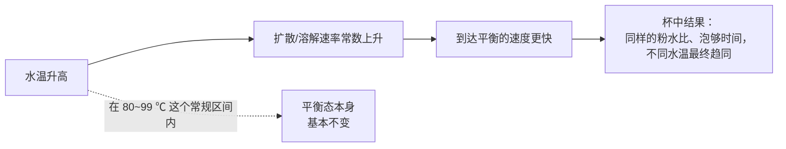
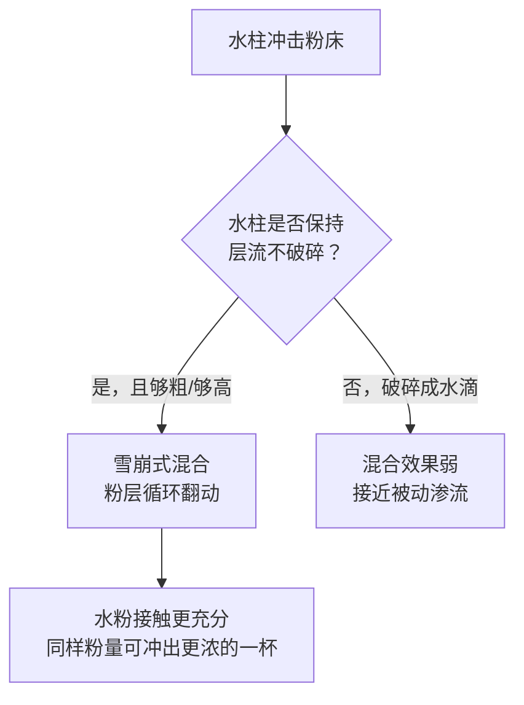

# 第 24 章 水温、时间与搅拌：传质速率的三个旋钮

> **本章目标**：讲清楚水温、时间、搅拌这三个最常被调的旋钮，
> 它们**各自真正改变的是什么**、**什么时候能互相替代**、**什么时候不能**。
>
> 结论先放这里：
>
> > **水温和时间大多数情况下在做同一件事——改变"到达某个萃取状态"的速度，
> > 而不是改变这个状态本身的上限。** 这意味着：水温不够高，可以用更长的时间去补；
> > 时间不够长，可以用更高的水温去补——**但只在一定范围内**，
> > 而且"搅拌"这个旋钮在浸泡式和滤过式里完全不是一回事。

## 24.1 水温：主要调速度，不太调上限（但有例外）

[第 21 章](21-what-is-extraction.md)已经给出过一个数字：在 25.8~84.1 ℃ 之间，
咖啡因浸出的速率常数上升约 8 倍[^1]。[第 22 章](22-tds-pe-golden-cup.md)进一步证明：
在全浸泡式冲煮的**常规热萃区间**（80~99 ℃），**平衡常数本身对水温不敏感**——
也就是说，水温在这个区间内主要影响"多快到达平衡"，**不太影响"最终能到多浓"**[^2]。

这条结论被另一项独立研究从感官角度再次印证[^3]：

> 在**固定 TDS 与萃取率**（通过调整流速、研磨等参数来补偿）的前提下，
> 直接对比 87 ℃、90 ℃、93 ℃ 冲煮的滴滤咖啡，**受训评审分辨不出感官差异**[^3]。
> 作者据此提出：冲煮设备的认证标准，或许应该**更关注流速的精确控制，
> 而不是收窄水温的区间**[^3]。

**但这个"上限不变"的结论是有边界的**。另一项把测试温度范围大幅拉宽
（从接近冰点的 4 ℃ 一直测到 93 ℃）的研究发现[^4]：

> 咖啡的**最终萃取率随冲煮温度升高、随粒径减小而增加**（原文摘要直引）[^4]。

> **这两条结论不是互相矛盾，而是测试区间不同**：
> [^2] 只测了"热萃常用区间"（80~99 ℃），在这个窄区间内看不出萃取上限随温度变化；
> [^4] 把区间下沿拉到接近冷萃的温度，在这个更宽的跨度上，萃取上限本身也会随温度小幅上升
> （见[出处登记 §六 #30](../../standards.md)）。
> ⚠️ **本书未能获取 [^4] 的论文全文**（付费墙），只核实了摘要给出的方向性结论，
> **具体的增幅数字不采信**。

> **背后的机理**：水温之所以能加速萃取，是因为它提高了溶质扩散与溶解过程对应的
> 速率常数——这类"速率常数随温度升高"的关系通常可以用一个**活化能**来描述
> （活化能越高，升温带来的加速效果越明显）。本书检索到的几个具体活化能数值
> （用于描述咖啡因在豆内扩散的速率）都来自本书**未能亲自获取全文核对**的论文，
> 其中一个流传的数字还只是第三方对原始数据的二次拟合，而非论文原文直接给出的结果。
> **按查证纪律，本书不写出任何具体的活化能数值**，只写这条方向性结论
> （见[出处登记 §4.27](../../standards.md)）。

一项更早的研究还提示了另一层复杂性——**低温下，简单的扩散模型可能不够用**[^5]：

> 把 25.5 ℃ 下测得的"受阻因子"（衡量实际扩散比自由扩散慢多少的指标）
> 与另一项研究在 80 ℃ 测得的受阻因子相比，**低温下的受阻因子远大于高温**[^5]。
> 作者认为，低温下咖啡因在豆内的**有限溶解速率、与绿原酸等其他可溶物的络合、
> 豆基质内的物理吸附**，都可能在简单扩散之外额外拖慢萃取[^5]。

> **实践含义**：水温越低，"萃取不只是单纯扩散变慢"这件事就越值得怀疑——
> 这也是为什么冷萃不能简单地当作"把热萃的时间等比例拉长"来理解，
> §24.5 会专门展开这一点。

## 24.2 SCA 水温标准：和第 22 章的"金杯"是同一个故事

圈内常引用的"冲煮水温应为 **195~205 ℉（约 90.6~96.1 ℃）**"这条标准，
**和[第 22 章](22-tds-pe-golden-cup.md)的"金杯坐标系"出自同一段历史**：
都源自 1950 年代 Lockhart 在咖啡冲煮研究所的工作，后被 Ted Lingle 的
《The Coffee Brewing Handbook》与 SCA 官方文件沿用。

> ⚠️ **本书同样未能亲自获取 SCA 官方 PDF 原文**核对这组数字的完整表述
> （与第 22 章核对金杯标准 PDF 时遇到的问题相同——核对当日官网链接返回 404）。
> 这组数字的存在本身被多个独立二手来源一致确认，但**本书未读到一手原文**。

> **本书的立场与第 22 章一致**：**不把这组数字包装成一条经过独立物理验证的最优解**，
> 而是如实写出——
>
> 1. 它有真实的历史来源（Lockhart 的研究），但**本书未核到原始方法学细节**；
> 2. 两项独立的同行评议研究都指向"这个区间比字面上看起来更宽容"：
>    80~99 ℃ 范围内平衡化学基本不受影响[^2]，87~93 ℃ 范围内感官无法分辨差异[^3]；
> 3. 所以这组数字更适合理解为"**一个经过长期实践检验、能保证冲煮在合理时间内
>    稳定完成的工程惯例**"，而不是"唯一能冲出好咖啡的物理窗口"。

## 24.3 时间：浸泡式"等平衡"，滤过式"防止走太远"

[第 21 章 §21.5](21-what-is-extraction.md)已经讲过这条区分的物理基础：
浸泡式的液相浓度会趋近一个平衡，滤过式因为水在持续更新，理论上可以一直萃下去。
本章补充两个更具体的时间尺度。

**全浸泡式的真实时间曲线**：同一篇建立平衡脱附模型的论文，用实验直接测量了
不同条件下到达平衡所需的时间[^2]：

| 冲煮比 | 水温 | 到达平衡所需时间 |
|-------|------|----------------|
| 25（较稀） | 80~99 ℃（各温度） | 约 **20 分钟**内都到达约 0.7% TDS 的平台 |
| 5（较浓） | 99 ℃ | 20 分钟内超过 4% TDS |
| 5（较浓） | 94 ℃ 与 80 ℃ | 需要**超过 30 分钟**才达到可比的数值 |

> **怎么读这张表**：**冲得越浓（冲煮比越小），到达平衡需要的时间越长**——
> 这是因为液相浓度越高，浓度梯度（驱动扩散的动力）就越小，速度自然放慢[^2]。
> **水温越低，同样到达平衡所需的时间也越长**——这正是 §24.1 讲的"水温主要调速度"
> 在时间维度上的另一种表述。
>
> 这组实验**全程不做人工搅拌**（除了短暂取样），只在最初加水时"以画圈的方式"
> 确保粉完全湿润一次[^2]——这提醒我们：接下来要讲的"搅拌"，
> 在浸泡式体系里甚至不是必需的操作，而是一个额外的选项。

**滤过式的时间，本书暂时给不出一条曲线**。滴滤类研究中，
冲煮时间通常是被**调整**来补偿研磨、流速等参数、从而达到某个目标 TDS/萃取率的
**从属变量**，而不是被单独测量效应的自变量——本书检索未找到专门"只改变接触时间、
固定其余所有变量"的滤过式冲煮同行评议研究。

> **本书的态度**：时间在滤过式里和水温一样是个"速率变量"，
> 但**本书未核到一条专门隔离出时间单一影响的曲线**，不编造一个看似合理的关系（§24.6）。

## 24.4 搅拌：浸泡式"不替代研磨"，滤过式"是另一套机制"

[第 21 章 §21.4](21-what-is-extraction.md)已经用旋转圆盘实验证明：
在那套体系里，**速率常数与转速无关**，限速步在颗粒内部而不在外部流动，
所以**搅拌不能替代研磨**[^1]。

**滤过式冲煮里的"搅拌"是另一套完全不同的机制**。一项用激光片光 + 高速摄影
观察手冲注水过程的研究，揭示了一个此前没有被量化过的物理图景[^6]：

> 手冲注水时，一股**足够粗、保持层流不破碎**的水柱冲击粉床，
> 会在粉床里引发一种**"雪崩"式的混合**——被冲开的粉层随着水流持续下探而循环翻动，
> 让水与粉实现比被动渗流更充分的接触[^6]。

作者给出了直接可执行的建议，并用真实的咖啡粉冲煮验证了效果[^6]：

> "**我们建议把注水点尽量拉高，同时保持水柱是层流、不要在冲击粉床前破碎**"
> （作者 Ernest Park 原话）[^6]。
> "**如果水柱太细，它会破碎成一串水滴**——这正是冲煮时要避免的情况，
> 因为破碎的水柱没办法有效搅动咖啡粉"（作者 Margot Young 原话）[^6]。
> 粗而连续的水柱能用**更少的咖啡粉**冲出同样浓度的一杯[^6]。

> **这条结论的实践分量**：手冲里常说的"注水要稳、要高"，
> 至少在这篇研究的框架下，**有具体的流体力学机制支撑**——
> 不是纯粹的仪式感，而是在利用水柱本身去"搅拌"粉床。
> ⚠️ **本书未能获取该论文全文**（付费墙），这里引用的是作者接受媒体采访时的
> 直接原话（经作者所在机构发布的官方新闻稿核对），而不是论文正文的逐句引用，
> 具体的"雪崩"动力学细节与定量数据本书未读到。

**关于"杯测破渣""搅拌转速"这类更具体的说法**，本书检索的结果是：
查到的相关"实验"（如延迟破渣时间、比较不同转速的萃取速率）**均来自行业研发博客，
不是同行评议文献**，且有的实验结果与作者自己的假设相反、作者也只能给出数学层面
而非机理层面的解释。**本书不采信这类具体数字**（见[出处登记](../../standards.md)），
只在 §24.7 的常见说法辨析里提一句它们的存在。

## 24.5 为什么冷萃不能简单理解为"时间拉长版的热萃"

一项专门研究冷萃动力学的工作给出了比直觉更精确的时间尺度[^7]：

> 室温（21~25 ℃）冷萃中，**3-咖啡酰奎宁酸（3-CGA）与咖啡因**按一级动力学
> 在**6~7 小时**内达到平衡[^7]——**明显快于"浸泡过夜（10~24 小时）"这条常见行业建议**。

这项研究还有一个和热萃文献形成鲜明对比的发现[^7]：

> **研磨粗细对冷萃中这两种成分的平衡浓度没有显著影响**（原文直引
> "did not have significant impact"）[^7]——而在热萃文献里，
> [第 21、23 章](23-grinding-particle-size.md)已经反复证明研磨是最有力的旋钮之一。

> **怎么理解这个反差**：低温下，§24.1 提到的"简单扩散模型之外的其他机制"
> （溶解速率、络合、吸附）可能变得更重要[^5]，而这些机制对粒径的敏感度
> 原本就和纯扩散不同。**这提示我们：冷萃可能不是"同一套机理、只是变慢了"，
> 而是在某些成分上切换到了一套相对不同的限速机制**——
> 这与[第 1 章](../01-foundation/01-bean-composition.md)、
> [第 21 章](21-what-is-extraction.md)已经确认的"冷萃成分格局与热萃不同"是同一类现象
> 在动力学层面的呼应。

> ⚠️ **边界条件**：[^7] 只测了 3-CGA 与咖啡因这两种成分，**不能推广到"所有成分
> 在冷萃里都对研磨不敏感"**。本书只写这两种成分上观察到的具体结果。

## 24.6 三个旋钮能互相替代吗

把前面几节的结论放在一起，可以回答本章标题提出的问题。

| 替代方向 | 能不能替代 | 依据与边界 |
|---------|-----------|-----------|
| **水温不够高，用更长时间补** | ✅ **在浸泡式里基本可以** | 温度只改变到达平衡的速度，时间足够长总能到达同一个平衡态[^2] |
| **时间不够长，用更高水温补** | ✅ **同上，反方向** | 同上 |
| **研磨不够细，用更长时间/更高水温补** | ⚠️ **部分可以，但不是等价替代** | [第 23 章](23-grinding-particle-size.md)已证明萃取率—研磨关系是**非单调**的，磨细到一定程度反而因堵塞降低萃取率；用时间或温度去补偿粗研磨，改变的是**速度**，补不回"表面积/扩散路径"这个结构性差异 |
| **搅拌替代研磨（浸泡式）** | ❌ **不能** | 限速步在颗粒内部，旋转圆盘实验显示速率常数与转速无关[^1] |
| **搅拌替代注水技巧（滤过式）** | ⚠️ **本书未读到直接对比** | 水柱冲击本身就是一种"搅拌"机制[^6]，人工搅拌是否能达到同等效果，本书未找到直接比较的研究 |
| **冷萃替代"慢速版热萃"的理解方式** | ❌ **不建议** | 研磨对冷萃中 3-CGA/咖啡因的影响与热萃不同[^7]，提示机理可能部分不同，不是单纯的"时间轴拉长" |

一项直接讨论意式冲煮中研磨与时间关系的建模与实验工作（已在
[第 23 章 §23.3](23-grinding-particle-size.md)详细介绍）给出了一个很好的例子，
说明"替代"需要很小心：
该研究显示**磨得更细，冲煮时间会线性延长**，但**萃取率并不会跟着线性上升**，
作者据此建议了两种**不是靠单纯调时间**、而是同时调整粉量或冲煮比的策略来达到目标萃取率。
这说明"旋钮之间的替代关系"往往**不是简单的线性置换**，而要考虑具体机制是否同步变化。

## 24.7 常见说法辨析

按本书约定标注**证据强度**：✅ 有共识 / ⚠️ 有争议 / ❌ 明确错误 / **缺乏证据**。

| 说法 | 判定 | 说明 |
|------|------|------|
| "水温越高，冲出来的咖啡一定更浓/萃取率更高" | ⚠️ **区间依赖** | 在常规热萃区间（80~99 ℃）内，水温主要改变速度而非上限[^2]；跨越到冷萃的更宽区间后，萃取上限本身也会小幅随温度上升[^4]（具体数字未核） |
| "SCA 规定的冲煮水温 195~205 ℉ 是唯一正确的科学窗口" | ⚠️ **历史产物，比字面看起来更宽容** | 与"金杯坐标系"同源于 1950 年代的历史工作；两项独立同行评议研究都显示这个区间内外的差异比预期小[^2][^3] |
| "搅拌能让萃取更快/更充分" | ⚠️ **要分体系** | 浸泡式里旋转圆盘实验显示搅拌不改变速率常数[^1]；滤过式里水柱本身的冲击是一种真实的混合机制[^6]，但这是"注水方式"而不是"额外搅拌" |
| "冷萃就是把热萃的时间拉长、温度调低而已" | ❌ **过度简化** | 冷萃中研磨对 3-CGA/咖啡因的影响与热萃文献中的研磨敏感性形成对比[^7]，提示部分机制可能不同，不只是"更慢的同一个过程" |
| "冷萃应该泡过夜（10~24 小时）才够味" | ⚠️ **可能超过了真正的平衡点** | 一项研究测得室温冷萃在 6~7 小时就已按一级动力学达到平衡[^7]；但这只针对该研究测的两种成分与条件，不能直接当作通用冲煮建议 |
| "手冲注水要又高又稳，这是仪式感/没什么科学依据" | ❌ **有具体流体力学机制支撑** | 粗而不破碎的水柱能引发粉床的"雪崩"式混合，比破碎成水滴的细水柱更有效[^6] |
| "转速翻倍，萃取速率提高固定倍数（如 1.4 倍）" | **缺乏证据** | 该系数仅见于技术博客作者本人基于化学工程通用理论的类比估算，作者本人也说明这不是咖啡专用实验数据 |
| "破渣时间早晚会显著改变萃取结果" | **缺乏证据** | 查到的相关实验来自行业研发博客而非同行评议文献，且结果与假设相反、缺乏机理解释 |

## 24.8 🔎 买豆与冲煮时的用处

1. **水温计坏了或没有，不用太焦虑**：在常规热萃温度区间内，水温主要影响速度而不是上限，
   差几度通常可以用稍微调整时间来补偿（§24.1、§24.6）。
2. **手冲注水，优先练"稳定的粗水柱"而不是追求花哨的画圈手法**：
   水柱本身保持层流、不破碎，就已经在帮你搅拌粉床（§24.4）。
3. **泡浓缩的全浸泡式咖啡（如浓缩冷萃）要给足时间**：冲煮比越小，到达平衡需要的时间越长，
   这不是你的器具有问题（§24.3）。
4. **冷萃不必死守"过夜"**：室温下可能几小时就已经接近平衡，剩下的时间边际收益很小
   （但这取决于你关心的具体成分，§24.5）。
5. **调整一个旋钮时，想清楚你是在补速度还是在补结构**：
   研磨不够细，用更长时间/更高水温去补，补的是速度，可能补不回表面积差异带来的结构性影响
   （§24.6）。

## 24.9 思考题

1. 为什么"水温提高会让萃取变快"和"水温在 80~99 ℃ 范围内不太改变萃取上限"这两件事不矛盾？
2. 请解释为什么冲得越浓（冲煮比越小），到达平衡所需的时间反而越长。
3. 手冲水柱的"雪崩式混合"和浸泡式冲煮里"搅拌不能替代研磨"这两条结论，
   分别在讨论哪一类混合，为什么它们不冲突？
4. 冷萃研究发现研磨粗细对 3-CGA 和咖啡因的平衡浓度没有显著影响，这为什么提示
   冷萃可能不只是"更慢的热萃"？
5. **【案例】** 一位朋友说："我家里没有温度计，就用烧开的水稍微晾一会儿冲手冲，
   每次晾的时间都不太一样，是不是每次冲出来的咖啡都不可控？"
   请结合本章内容，评估这个担忧有多大道理，并给出一个更有效的应对方式。
6. **【案例】** 一篇文章写道："把冲煮水温从 92 ℃ 提高到 96 ℃，可以让萃取率提高整整 5 个百分点。"
   请指出这句话需要追问哪些细节才能判断它是否可信。
7. 为什么本章不给出"研磨不够细时，应该用高几度的水温或多泡几秒来补偿"这样的具体数字？
8. **【辨识】** 找一篇讨论"冷萃该泡多久"的中文文章，看它有没有给出具体时长，
   并记录这个时长有没有标注出处或者只是经验之谈。

> 📖 **参考答案**（想清楚再看）：[Q1](../../qa/24-temperature-time-agitation-qa.md#q1) ·
> [Q2](../../qa/24-temperature-time-agitation-qa.md#q2) · [Q3](../../qa/24-temperature-time-agitation-qa.md#q3) ·
> [Q4](../../qa/24-temperature-time-agitation-qa.md#q4) · [Q5](../../qa/24-temperature-time-agitation-qa.md#q5) ·
> [Q6](../../qa/24-temperature-time-agitation-qa.md#q6) · [Q7](../../qa/24-temperature-time-agitation-qa.md#q7) ·
> [Q8](../../qa/24-temperature-time-agitation-qa.md#q8)

## 24.10 本章实操

### 🅐 无器具版 · 任务一：追踪一次"水温漂移"冲煮

连续用同一壶水（不加热）冲三杯（手冲或浸泡皆可），不用温度计，只记录"水放了多久"：

| # | 烧开后放置时间 | 出液/完成时间感受（变快/变慢/不变） | 浓淡印象 |
|---|--------------|------------------------------|---------|
| 1 | 刚烧开 | | |
| 2 | 约 2 分钟 | | |
| 3 | 约 5 分钟 | | |

> **判断提示**：如果浓淡印象差异不大，这与"常规热萃区间内水温主要影响速度"
> 这条结论是一致的（§24.1）；如果差异很明显，可能是你的"放置时间"跨度本身已经
> 让水温降到了区间之外，或者混入了其他变量（比如水温低到影响了润湿）。

### 🅐 无器具版 · 任务二：观察注水水柱的"粗细"

用普通水壶（不需要专用手冲壶）练习倒水，观察：

| 倒水方式 | 水柱形态（连续细线 / 破碎成水滴 / 粗水流） | 落到水面时有没有明显的"打开"或"扰动"效果 |
|---------|------------------------------------|----------------------------------|
| 倒得很慢 | | |
| 正常速度 | | |
| 刻意倒快 | | |

> **预期**：倒得太慢容易让水柱破碎成水滴，扰动效果弱；
> 有一定流速、水柱连续不断时，冲击效果更明显（§24.4）。
> 这个任务不需要咖啡粉，纯粹观察水柱本身的物理形态。

### 🅑 有条件版 · 任务三：全浸泡式的"达到平衡"时间感（备齐后再做）

> **所需**：法压壶或任何可浸泡容器、秤、计时器、折光仪（没有可做定性版）。

固定粉水比与水温，在 **5、15、30、45 分钟**各取样（不搅动），记录 TDS 或颜色深浅：

| 时间 | TDS（或颜色深浅印象） | 与上一次的差距 |
|------|---------------------|---------------|
| 5 分 | | — |
| 15 分 | | |
| 30 分 | | |
| 45 分 | | |

> **预期**：相邻两次的差距应该越来越小，这正是趋近平衡的表现（§24.3，呼应
> [第 21 章任务四](../../qa/21-what-is-extraction-qa.md#q3)）。把结果填进
> [冲煮记录表](../../forms/brew-log.md)。

### 🅑 有条件版 · 任务四：对比"高而稳"与"低而散"的注水（备齐后再做）

> **所需**：手冲器具、秤、磨豆机、同一支豆、计时器。

固定粉量、水量、研磨、水温，只改变**注水高度与手法**，冲两杯：

| 注水方式 | 具体做法 | 总萃取时间 | 浓淡/风味印象 |
|---------|---------|-----------|-------------|
| 高而稳 | 壶嘴适当抬高，保持水柱连续不破碎 | | |
| 低而散 | 壶嘴贴近粉面，水流断续、容易散开 | | |

> **预期**：高而稳的注水方式**可能**带来更充分的混合效果（§24.4）。
> ⚠️ 这是一个粗糙的家庭对照，不是严格控制的实验——如果两杯差异不明显，
> 先怀疑是不是其他变量（粉层厚度、滤杯形状）也在同时变化。

---

## 24.11 本章依据

完整书目信息登记在[出处与资料登记 §4.27](../../standards.md)。

- **[GC2]** Liang, J., Chan, K. C., & Ristenpart, W. D. (2021). *An equilibrium desorption model for
  the strength and extraction yield of full immersion brewed coffee*. *Scientific Reports* 11:6904。
  开放获取。用到：80~99 ℃ 范围内平衡常数对水温不敏感；不同冲煮比/水温下到达平衡所需时间；
  全程不搅拌的实验设计。已读全文并逐句核对引文（第 22 章已核对，本章复用）。
- **[WT1]** Batali, M. E., Ristenpart, W. D., & Guinard, J.-X. (2020). *Brew temperature, at fixed
  brew strength and extraction, has little impact on the sensory profile of drip brew coffee*.
  *Scientific Reports* 10:16450。用到：固定 TDS/萃取率后，87~93 ℃ 水温对感官轮廓无显著影响；
  作者关于认证标准应关注流速而非水温区间的建议。已读全文（第 22 章已核对，本章复用）。
- **[WT2]** Fuller, M., & Rao, N. Z. (2017). *The Effect of Time, Roasting Temperature, and Grind
  Size on Caffeine and Chlorogenic Acid Concentrations in Cold Brew Coffee*. *Scientific Reports*
  7:17979。开放获取。用到：室温冷萃 3-CGA/咖啡因在 6~7 小时内达到平衡；热萃对照组 98 ℃/6 分钟；
  研磨粗细对冷萃这两种成分无显著影响。已读全文并逐句核对引文（PMC）。
- **[WT3]** Wang, X., & Lim, L.-T. (2021). *Modeling study of coffee extraction at different
  temperature and grind size conditions to better understand the cold and hot brewing process*.
  *Journal of Food Process Engineering* 44(8):e13748。用到：4~93 ℃ 范围内萃取率随温度升高的方向性结论。
  ⚠️ 付费墙，仅通过官方摘要确认，未能逐句核对全文，具体数值不采信。
- **[WT4]** Park, E., Young, M., & Mathijssen, A. J. T. M. (2025). *Pour-over coffee: Mixing by a
  water jet impinging on a granular bed with avalanche dynamics*. *Physics of Fluids* 37(4):043332。
  用到：水柱雪崩混合机制；粗而连续的层流水柱比破碎的细水柱混合效果更好；作者原话建议。
  ⚠️ 论文全文付费墙未能获取，已通过作者机构官方新闻稿（含作者直接引述）逐句核对。
- **[WT5]** Lee, W. T., Smith, A., & Arshad, A. (2022). *Uneven Extraction in Coffee Brewing*.
  arXiv:2206.12373。用到：双路径渗透率差异的正反馈放大机制；低于临界粒径后继续磨细反而降低
  萃取率的预言与实验一致。⚠️ 预印本，未确认期刊正式发表状态，仅通过摘要确认。
- **[WT6]** Spiro, M., & Chong, Y. Y. (1997). *The kinetics and mechanism of caffeine infusion from
  coffee: the temperature variation of the hindrance factor*. *Journal of the Science of Food and
  Agriculture* 74(3):416–420。用到：低温（25.5 ℃）下受阻因子远大于高温（80 ℃），提示低温下
  存在扩散之外的额外限速机制。⚠️ 付费墙，仅通过检索摘要确认，不引用具体数值。

**本章刻意没写的东西**：

- **咖啡因/可溶物萃取的具体 Arrhenius 活化能数值**——查到的数字均来自未能亲自核对全文的论文，
  其中一个数字是第三方对原始数据的二次拟合；
- **滤过式冲煮中"只改变接触时间"的量化曲线**——未找到专门隔离这一变量的同行评议研究；
- **搅拌转速与萃取速率的具体换算系数**——仅见于作者自述为类比估算的技术博客；
- **杯测破渣时间早晚的具体影响数字**——仅见于行业研发博客，非同行评议、结果与假设相反；
- **SCA 冲煮水温标准（195~205 ℉）的完整官方条文**——与第 22 章核对金杯标准 PDF 时遇到相同的
  访问障碍，本书未能亲自读到官方原文。

[^1]: 本书编号 [EX2]：Spiro & Page (1984), *JSFA* 35(8):925–930（第 21 章已登记）。
[^2]: 本书编号 [GC2]：Liang, Chan & Ristenpart (2021), *Scientific Reports* 11:6904（开放获取）。
[^3]: 本书编号 [WT1]（= 第 22 章 [GC3]）：Batali、Ristenpart & Guinard (2020), *Scientific Reports* 10:16450。
[^4]: 本书编号 [WT3]：Wang & Lim (2021), *Journal of Food Process Engineering* 44(8):e13748。
[^5]: 本书编号 [WT6]：Spiro & Chong (1997), *JSFA* 74(3):416–420。
[^6]: 本书编号 [WT4]：Park、Young & Mathijssen (2025), *Physics of Fluids* 37(4):043332。
[^7]: 本书编号 [WT2]：Fuller & Rao (2017), *Scientific Reports* 7:17979（开放获取）。

---

**下一章**：第 25 章 床层力学与通道效应：
为什么"均匀"往往比"参数正确"更重要。
