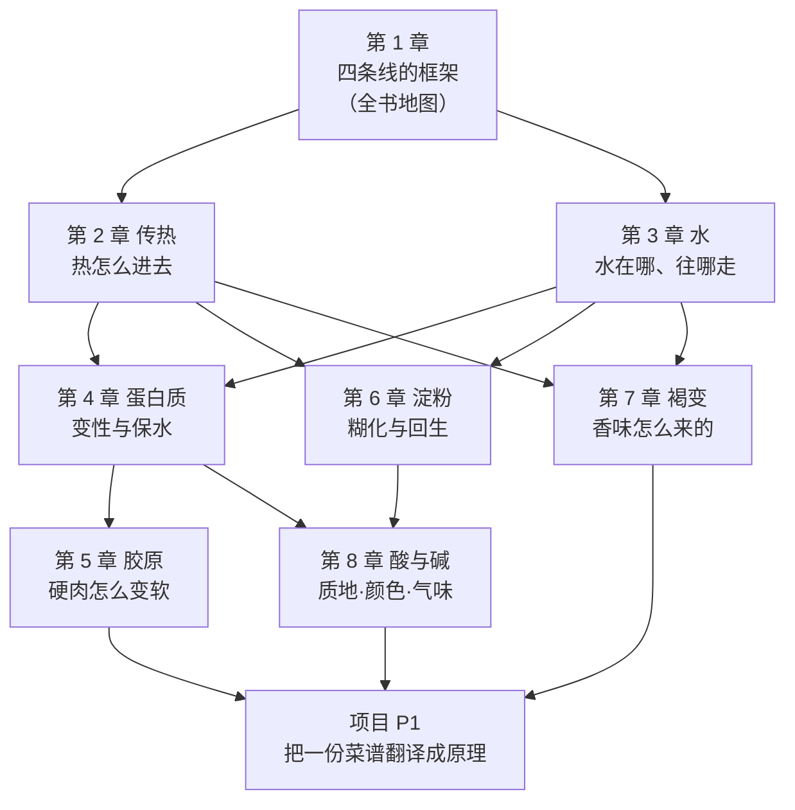

# 第一部分 · 底层四条线：做菜到底在改变什么

> **这一部分不教任何一道菜。** 它建立的是一套语言——
> 后面六部分、45 章、所有的技法和菜例，都用这套语言来解释。

## 为什么要先讲原理

如果你只想今天晚上做出一道菜，跳到第六部分照着做也行。
但你会遇到同一个问题：**换了食材、换了锅、换了火力，那套参数就不成立了**。

因为菜谱给的是**一组参数**，而参数只在特定条件下有效。
条件变了要重算，而"重算"需要知道**这些参数当初是为什么定的**。

所以这一部分回答的是同一个问题的八个侧面：

> **加热一样东西的时候，到底有什么在改变？**

答案是：**热在传递、水在移动、味在变化、而这一切都需要时间**。
这就是本书的四条线。第 1 章先把四条线整体讲一遍（并用番茄炒蛋走完一遍），
第 2~8 章分别把每条线背后的机理讲透。

## 这一部分的地图

图里的依赖关系值得说明一句：**褐变（第 7 章）同时依赖"热"和"水"**——
这不是巧合，而是本书反复出现的模式：
**厨房里几乎所有"想要但做不到"的事，都是两条线在互相拉扯**
（想上色就得干、想嫩就得留水）。看懂这些拉扯，就是这一部分的收获。

## 各章一句话

| 章 | 它回答的问题 | 状态 |
|----|------------|------|
| [第 1 章 一道菜里到底在发生什么](01-what-happens-in-a-dish.md) | 怎么把任何一步操作归到四条线之一？ | ✅ |
| 第 2 章 传热 | 为什么同样"熟了"，水煮和油炸差那么远？ | ⬜ |
| 第 3 章 水 | 为什么"有水就上不了色"？水活度是什么？ | ⬜ |
| 第 4 章 蛋白质 | 为什么蛋和肉"过了就回不来"？ | ⬜ |
| 第 5 章 胶原 | 为什么硬肉必须炖、嫩肉不能炖？ | ⬜ |
| 第 6 章 淀粉 | 勾芡、米饭、面条为什么是同一件事？ | ⬜ |
| 第 7 章 褐变 | 香味是怎么被"造"出来的？ | ⬜ |
| 第 8 章 酸与碱 | 醋和小苏打在菜里动了什么？ | ⬜ |
| 项目 P1 | 把一份看不懂的菜谱逐行翻译成原理 | ⬜ |

## 学完这一部分，你应该能

1. 拿任何一份菜谱，**逐行**说出每一步属于四条线的哪一条、目的是什么；
2. 判断哪些步骤**可以省**（说不出目的的那些），哪些**绝对不能省**（安全相关的那些）；
3. 遇到"食材换了"的情况，能说出**该跟着改什么参数**；
4. 把这些判断落到一张[处理方案表](../../forms/dish-plan.md)上——动手前先想清楚。

> **诚实说明**：这一部分会出现不少温度和时间。
> 请注意本书的纪律：**凡是查不到可靠出处的数字，本书不写**；
> 写出来的每个数字都在[出处登记](../../standards.md)里能查到来源与核对状态。
> 你会看到一些地方写着"这个数字流传很广但找不到一手出处"——
> 那不是偷懒，那是这本书想教给你的第二件事：
> **厨房里的很多"常识"，经不起查。**
