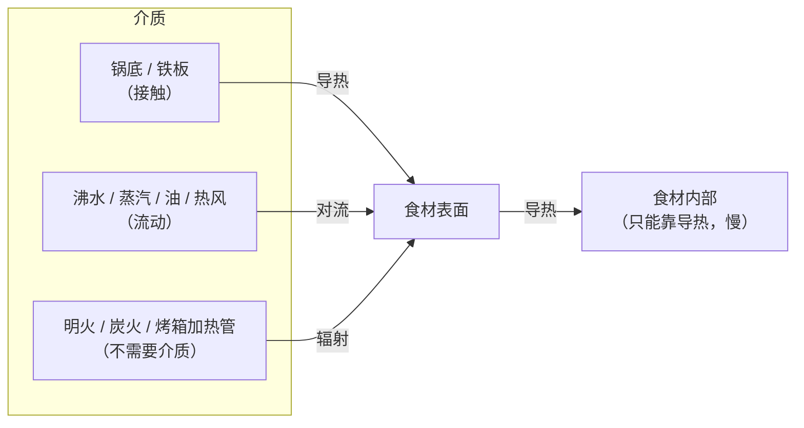
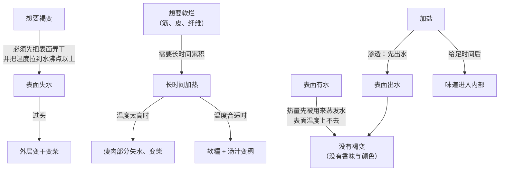
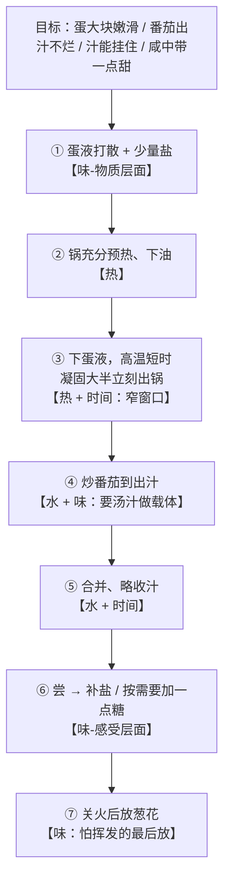

# 第 1 章 一道菜里到底在发生什么：热、水、味、时间四条线

> **本章目标**：给你一副"拆解菜谱"的眼镜。学完这一章，
> 你看任何一份菜谱的任何一行——焯水、热锅冷油、大火快炒、小火慢炖、出锅前淋香油——
> 都能立刻说出它在动**哪一条线**、想达到什么目的、以及**能不能省**。
>
> 这是全书**最该反复看**的一章：它不教具体做法，但后面 44 章都用它的语言。

## 1.1 菜谱为什么不管用

先看一个真实的现象。搜"番茄炒蛋"，你会看到互相矛盾的指令：

| 有的菜谱说 | 另一些菜谱说 | 都有道理吗？ |
|-----------|------------|------------|
| 先炒蛋，盛出，再炒番茄，最后合并 | 先炒番茄出汁，再倒入蛋液 | 是（但成品不一样） |
| 蛋液里加盐 | 盐最后放，早放蛋会老 | 是（它们在解决不同问题） |
| 加半勺糖 | 不加糖 | 是（取决于番茄的酸） |
| 大火快炒 | 中火 | 是（取决于你的锅和火力） |

三种可能的解释：一、有人错了；二、都对但适用条件不同；三、这些参数其实在解决**不同的问题**。

真相基本是第二和第三种。这就暴露了菜谱的根本局限：

> **菜谱给的是一组参数，而参数只在特定条件下成立**——
> 特定的锅、特定的火力、特定的食材含水量、作者特定的口味偏好。
> 菜谱**不告诉你这些参数当初是为什么定的**，所以条件一变，你没法重算。

而"重算"需要的不是更多菜谱，是**一个框架**：知道一道菜里到底有什么在变化，
知道每个参数在控制哪个变化。

这个框架，本书用四条线来表示。

## 1.2 四条线：热、水、味、时间

先把结论给出来：

> **做菜就是在四条线上做决定。**
>
> | 线 | 它管什么 | 你实际在控制的 |
> |----|---------|--------------|
> | **热** | 能量从哪来、走多快、表面和中心分别到了多少 | 火力、锅具、介质（水/油/蒸汽/空气）、食材厚度 |
> | **水** | 食材里的水、锅里的水、跑掉的水 | 加不加水、盖不盖盖、擦不擦干、收不收汁、放不放盐 |
> | **味** | 可溶物往哪走 + 感受层面谁增强谁 | 放什么、放多少、**什么时候放** |
> | **时间** | 上面三件事**累积**了多少 | 下锅顺序、每个阶段多久、什么时候离火 |

任何一步操作，都能归到其中一条（常常是两条）。举几个例子先热热身：

| 菜谱里的这一行 | 它在动哪条线 | 真正的目的 |
|--------------|------------|-----------|
| "肉切好后用厨房纸擦干" | 水（+ 热） | 表面有水，热量都被用来蒸发水了，温度上不去，就没有褐变 |
| "焯水后捞出冲凉" | 热 + 水 | 停止加热（避免余温继续熟）+ 定色 |
| "小火慢炖 1 小时" | 时间 + 热 | 让筋膜类结构在**不剧烈失水**的前提下慢慢软化 |
| "出锅前淋香油" | 味 | 香气分子一加热就跑，所以必须最后放 |
| "盖上锅盖焖 2 分钟" | 水 + 热 | 留住蒸汽，靠水蒸气加热内部（同时放弃了表面褐变） |
| "大火收汁" | 水 + 味 | 蒸发水 → 浓缩味道 + 让汁能挂住食材 |

看出规律了吗：**同一个动作常常同时服务两条线，而且这两条线可能互相打架。**
这是本书最重要的模式，下面单独讲。

### 热：三种走法，两个上限

热量进入食材只有三种走法[^1][^2][^3]：

这张图里最该记住的一点：**热量到了表面之后，进入内部只有一条路——导热，而且很慢。**
所以"外面焦了里面还生"不是手艺问题，是物理的必然结果，
唯一的解法是**降低表面温度、拉长时间**，或者**把食材切薄切小**。

第二个要点是**温度上限**：

| 介质 | 大致能达到的温度 | 后果 |
|------|--------------|------|
| 沸水、蒸汽（常压） | 封顶在水的沸点附近（约 100 °C） | 永远做不出褐色外壳 |
| 油 | 可以远高于水的沸点 | 能褐变、能脆壳 |
| 热空气（烤箱） | 可以远高于水的沸点 | 能褐变，但传热比油慢得多 |

> **诚实说明**：不同介质"传热快慢"的**定量**对比（换热系数）需要工程数据，
> 本书写作时**没有在可访问的文献里核到烹饪场景的具体数值**，
> 所以这里只给方向：**同样温度下，液体（水、油）向食材传热比空气快**——
> 这也是为什么 100 °C 的沸水能很快把手烫伤，而 100 °C 的烤箱你可以把手伸进去几秒。
> 这一点在第 2 章会再查一遍（见[出处登记](../../standards.md)里的已知缺口）。

### 水：它同时是三件东西

水是四条线里最被低估的一条。它在一道菜里同时扮演三个角色：

1. **食材的一部分**：蔬菜、肉、蛋的主体都是水。水跑掉了，就是"干、柴、缩"；
   水留住了，就是"嫩、多汁"。
2. **传热介质**：你加进去的水（煮、炖、蒸）负责把热送进去，
   但它同时**把温度锁在 100 °C 以下**。
3. **溶剂**：盐、糖、鲜味物质、部分维生素都溶在水里。
   水往哪走，这些东西就往哪走[^4]。

第 3 点有个直接的证据。对焯水和水煮的研究显示：水溶性成分会大量**浸出到水里**——
一篇 2024 年的综述汇总了多项研究，在 90 °C/15 分钟的焯水条件下，
豌豆与茄子的抗坏血酸（维生素 C）损失约 65~70%，青椒约 50%；
100 °C/5 分钟水煮塌菜，抗坏血酸下降 32.6%。
而蒸制的结果好得多，机制很朴素：**没有液态水，就没有浸出的去处**。
同一篇综述还提到一个厨房里很实用的结论：**加了盐会造成渗透失衡，
水分流失更多，水溶性成分损失也更大**。

> **所以"水"这条线的第一条判断规则**：
> **先想清楚你要不要溶出。** 做汤要的就是溶出（味道要进汤里），
> 炒青菜怕的就是溶出（味道要留在菜里）。
> 同一个"焯水"动作，在这两种目标下的正确做法完全不同。

### 味：两个完全不同的层面

调味出错，通常不是因为放错了调料，而是因为**把两个层面搞混了**：

| 层面 | 在发生什么 | 需要的条件 | 例子 |
|------|-----------|-----------|------|
| **物质层面** | 可溶物在移动：盐进去、鲜味出来、糖渗进去 | **时间 + 水** | 腌、卤、煲汤、提前撒盐 |
| **感受层面** | 你的味觉与嗅觉如何解读这堆分子 | 只在**尝的那一刻**发生 | 咸淡判断、"提鲜"、酸甜平衡 |

物质层面的操作**需要时间**（盐进入一块肉的内部不是一瞬间的事），
所以要**早做**；感受层面的判断只能在**接近成品时**做，所以定味要**晚做**。

> **这就解释了"盐到底什么时候放"为什么会有两派说法——
> 因为它其实是两个不同的动作**（下面 §1.4 展开）。

感受层面还有一件必须诚实说明的事：**味与味之间的相互作用没有简单规律**[^5]。
一篇 2025 年关于减钠的综述给出的总体结论是：
两种味道混在一起，可能出现**增强、抑制、或没有影响**三种结果。
有具体实验数据的方向是这样的：

| 实验做了什么 | 结果 |
|------------|------|
| 在盐溶液里加蔗糖（0.40 M） | 咸味的**察觉阈值下降约 60%**（更容易察觉到咸） |
| 在盐溶液里加柠檬酸（0.0042 M） | 咸味察觉阈值下降约 56% |
| 在盐溶液里加奎宁（苦，0.00025 M） | 咸味察觉阈值下降约 33% |
| 在盐溶液里加 0.10% 味精 | 咸味**强度**增强 |
| 用鲜味物质替代部分盐 | 最好的情形实现约 24.25% 的减钠 |

> ⚠️ **注意方向**：上面这些实验测的是"**别的味道怎么影响咸味**"。
> 而厨房里常说的是反过来的那句——"**盐能提甜**"。
> 这句话在本书查到的证据里**没有对应的数据**，所以本书把它标为
> **⚠️ 有争议 / 方向性证据不足**，不作为规则使用。
> **这本书会经常做这种事：把"听起来对"和"查得到"分开。**

### 时间：它和温度是同一件事的两个轴

最容易被忽略的一条线。核心观念只有一句：

> **温度决定速率，时间决定累积量**[^6]。
> 你要的从来不是"某个温度"，而是"某个累积到刚好的状态"。

这不是抽象说法，官方的安全指引里就是这么写的。英国食品标准局（FSA）
把下面这些"食物中心温度 + 时间"组合列为**等效**：

| 中心温度 | 需要保持的时间 |
|---------|--------------|
| 60 °C | 45 分钟 |
| 65 °C | 10 分钟 |
| 70 °C | 2 分钟 |
| 75 °C | 30 秒 |
| 80 °C | 6 秒 |

同样的逻辑在口感上也成立。低温慢煮的研究综述显示：
牛肉里较硬的部位，在约 50~58 °C 下保持 24~48 小时可以显著嫩化——
那是因为结缔组织的软化需要**累积时间**，而不是更高的温度[^7]。
反过来，同一篇综述也指出：牛肉的蒸煮损失在 60 °C 升到 70 °C 之间显著上升，
70 °C 到 80 °C 之间反而变化不大——也就是说，**"再多煮一会儿"在某些温度区间代价很大，
在另一些区间几乎没影响**。

> **时间这条线给你的第一条判断规则**：
> 当你想要的效果"**需要累积**"（软烂、入味、杀菌），就往**时间**上找办法；
> 当你想要的效果"**需要瞬间**"（褐变、脆壳、保持嫩），就往**温度**上找办法，
> 并且**必须缩短时间**。

## 1.3 四条线为什么会互相打架

如果四条线各自独立，做菜就不难了。难点在于**它们互相约束**：

这张图解释了厨房里几乎所有"想要但做不到"的事：

- **想上色，又想嫩** → 上色要干、要高温；嫩要留水、要低温。
  **解法是分段**：先高温给表面上色，再低温把内部做到刚好。
- **想入味，又不想出水** → 盐进入需要时间，但盐同时会把水拉出来。
  **解法是分次**：一部分早放（为了进入），一部分晚放（为了定味）。
- **想炖烂，又不想柴** → 长时间是必要的，但温度一高瘦肉部分就失水。
  **解法是控温**：让它"咕嘟"而不是"大滚"。

> **本章最重要的一句话**：
> **你不是在优化四条线，你是在为它们排优先级。**
> 而"排优先级"必须先知道**这道菜的目标是什么**——这就是 §1.6 的第一原理。

## 1.4 一个例子走完四条线：番茄炒蛋

现在用一道人人做过的菜，把四条线走一遍。
番茄炒蛋之所以是最好的例子，是因为它**只有两样食材，却把四条线的矛盾全占了**：
蛋怕久、番茄多水、要有蛋香（褐变的边缘）、又要有汁。

### 为什么先炒蛋

这是最常被问、也最容易答错的问题。常见答案是"这样蛋比较嫩"——对，但没解释为什么。

真正的原因在**热**和**水**两条线上：

1. **蛋是"窗口最窄"的食材**。蛋液受热时蛋白质变性凝聚[^8]，
   而这个过程**基本不可逆**——凝过了头就是硬、散、出水，没法回头。
   有实验数据可以给这个"窄"一个量级：一项对全蛋液加热的研究显示，
   在 55~67 °C 范围内，55~64 °C 时乳化性没有显著变化，到 67 °C 就显著下降；
   储能模量（可以粗略理解为"变稠成胶"的程度）在 67 °C 之后**急剧上升**；
   同样时间下溶解度损失从 55 °C 的 17.94% 升到 67 °C 的 41.29%。
   换句话说，**十几度的区间里，蛋从"还是液体"走到"完全凝固"**。
2. **番茄一下锅就出水，锅温立刻被水按住**。水的沸点把温度封顶在约 100 °C；
   更重要的是，锅里一旦有大量液态水，蛋液就不再是"被炒"，而是"被煮"——
   它会变成散碎的、有点老又有点水的状态，而不是大块嫩滑。

所以"先炒蛋"的本质是：

> **把需要高温短时的食材，放在锅里还干、还热的时候做；
> 把会大量出水的食材，放在它后面。**

这条规则是**可迁移**的——它和番茄炒蛋没关系。任何一道菜里，
只要有"窄窗口 + 高温"的食材和"多水"的食材同锅，都该这么排。
炒虾仁配青菜、炒肉片配西葫芦，全是同一个道理。

**那反过来做（先炒番茄再倒蛋液）为什么也有人做、也能吃？**
因为它其实做的是**另一道菜**：蛋液倒进番茄汁里，走的是"被煮"的路线，
成品是**软嫩带汁、蛋和番茄融在一起**的那种。
它不是错，它是另一个目标。**先判断目标，再判断顺序**——顺序不是道德问题。

### 为什么番茄要"出汁"

"番茄要炒到出汁"这一步，其实同时在做三件事，分属三条线：

| 它在做什么 | 属于哪条线 | 为什么重要 |
|-----------|-----------|-----------|
| 细胞结构被破坏，汁水流出来 | 水 | **汤汁是味道的载体**：盐、糖、鲜味物质都溶在里面，没有汁就没法"挂味" |
| 番茄自身的酸、糖、鲜味物质被释放出来 | 味 | 番茄是常见食材里少见的**自带鲜味**的蔬菜（美国 FDA 在讨论谷氨酸时就以番茄和奶酪为例）[^9] |
| 部分水蒸发掉，汤汁变浓 | 水 + 时间 | 收汁既浓缩味道，也让汁能挂住蛋 |

但它有**代价**，这就是四条线打架的地方：

> 番茄一出汁，锅里就有大量液态水 → 温度被按在 100 °C 附近 → **不可能再有褐变**。
> 所以番茄炒蛋里那点"锅气"香味，只能在**蛋和油还干的那个阶段**拿到。
> 这也是为什么"先炒蛋"的那一下要**舍得用火**。

### 盐什么时候放

这是全书第一个"看起来矛盾、其实是两个动作"的例子。

**两派说法都对，因为它们在解决不同问题**：

| 加盐时机 | 属于哪条线 | 它在解决什么 |
|---------|-----------|------------|
| **蛋液里加一点**（下锅前） | 味（物质层面）+ 水 | 让蛋液内部的咸味均匀——这件事在蛋凝固之后就做不到了 |
| **番茄出汁后、快出锅前加** | 味（感受层面） | **定味**。只有在接近成品的浓度下，咸淡才判断得准 |
| **早期给番茄撒盐** | 水（渗透）[^10] | 加速番茄出水出汁；但如果你不想它太快出汁，就不要这么做 |

于是得到一条比"盐什么时候放"有用得多的规则：

> **盐有两个身份，要分开处理。**
>
> - **作为"对水的命令"**（让谁出水、让谁保水、让味道渗进去）：**早放**，因为它需要时间；
> - **作为"定味"**：**最后放**，而且必须**尝过之后**再放。
>
> 所以正确问法不是"盐什么时候放"，而是"**这次放盐，我是在下命令，还是在定味？**"

至于"早放盐蛋会老"——这类说法涉及盐对蛋白质变性的影响，
本书**没有核到可靠的定量证据**，所以不下结论；它进了下面的辨析栏目。

### 糖的那半勺

很多番茄炒蛋菜谱会加一点糖。它的作用**不是让菜变甜**，而是调整对酸的感受。
但按本书的纪律，必须诚实标注：这属于**味味相互作用**，
而混合味可能增强、可能抑制、也可能没影响（见 §1.2）。

> **所以正确的做法不是"加半勺糖"，而是"尝一口，如果酸得突出，加一点点糖，再尝"。**
> 番茄的酸度差异极大（品种、成熟度、季节），**固定的糖量根本不可移植**。

### 把整道菜画成时序图

七步里，**没有一步是"因为菜谱这么写"**——每一步都能说出它动的是哪条线、为什么在这个位置。
这就是本章想给你的能力。

> 把这张图换成你自己的菜，就是[一道菜的处理方案表](../../forms/dish-plan.md)。

## 1.5 常见说法辨析

按本书约定标注**证据强度**：✅ 有共识 / ⚠️ 有争议 / ❌ 明确错误 / 缺乏证据。
来源见[出处登记](../../standards.md)。

| 说法 | 判定 | 说明 |
|------|------|------|
| "肉先大火煎一下，能**锁住肉汁**" | ❌ **明确错误** | 这个说法可追溯到 19 世纪。McGee 在《On Food and Cooking》里专门讨论过（"The Searing Question"，2004 年修订版第 161 页，由文献转引）：自 1930 年代起的测试显示，煎过的烤肉失水**相同或更多**——因为煎让表面经历更高温度、破坏更多细胞。**煎的价值是褐变带来的香味与颜色，不是锁水。** 值得煎，但别为错误的理由煎 |
| "味精有害" | ❌ **明确错误** | 美国 FDA 认为在食品中添加味精"一般认为是安全的"（GRAS）；味精里的谷氨酸与食物蛋白消化释放的游离谷氨酸**化学上相同**；典型膳食每天从蛋白质获得约 13 g 谷氨酸，而添加味精约 0.55 g。FDA 还指出，对照试验中"科学家未能稳定地诱发反应"。1990 年代 FASEB 的评估结论是味精安全，同时指出敏感人群**不随餐**摄入 3 g 以上时可能出现短暂轻微症状，而一份添加味精的食物通常含不到 0.5 g |
| "焯水会流失**全部**营养" | ❌ **"全部"错误**，但损失确实可观 | 文献汇总：90 °C/15 分钟焯水，豌豆与茄子的抗坏血酸损失约 65~70%、青椒约 50%；100 °C/5 分钟水煮塌菜下降 32.6%。所以正确的说法是：**水溶性成分损失显著，脂溶性与矿物质情况不同，蒸制损失明显更小**。⚠️ 本书不把它说成"没关系"，也不说成"全没了" |
| "靠颜色和口感就能判断肉熟没熟" | ❌ **明确错误（安全问题）** | 美国 CDC 明确表述：**除海鲜外**，不能通过颜色和质地判断食物是否安全熟透，**温度计是唯一可靠的方法** |
| "**热锅冷油**不粘锅、不过火" | **缺乏直接证据**（机制可部分解释） | 本书查证时**没有找到直接的实验证据**。机制上可以部分解释（锅先热到足够温度、油进入后很快铺开并迅速升温，食材下锅时表面快速受热而不是慢慢"泡"在温油里），但这既没有量化，也不是唯一解释。作为惯例可以用，**别当原理讲** |
| "盐能提甜" | ⚠️ **有争议 / 方向性证据不足** | 现有实验数据的方向是反过来的：糖、酸、苦都能**降低咸味的察觉阈值**（如 0.40 M 蔗糖让咸味阈值下降约 60%），鲜味物质能**增强咸味强度**。"盐反过来增强甜"在本书查到的综述里没有对应数据。混合味的总体结论是"可能增强、抑制或没有影响" |
| "肉煮得越久越烂" | ⚠️ **分情况，不能一概而论** | 对**带筋/带皮部位**方向上成立：结缔组织软化需要累积时间（研究显示较硬部位在约 50~58 °C 保持 24~48 小时可显著嫩化）。对**瘦肉部位**恰好相反：同一综述显示牛肉蒸煮损失在 60→70 °C 显著上升，越煮越失水越柴。**所以"炖"这件事对不同部位是两套策略** |
| "大火快炒能锁住营养" | ⚠️ **机制方向合理，缺乏定量出处** | "水少、时间短 → 浸出少"这个方向与浸出机制一致（蒸制损失小于水煮就是同一机制）；但"锁住"是个营销化的说法，本书**没有核到家庭炒菜场景的定量数据**，所以只写方向、不写数字 |
| "蛋在 62 °C 开始凝固" | ⚠️ **单点数字不可靠** | 变性温度取决于体系。实验室 DSC 测得纯卵白蛋白在水中的变性温度约 80 °C，而全蛋液在 60 多 °C 就出现明显的功能与结构变化（67 °C 后急剧成胶）。**所以本书写"60 多 °C 这个量级开始、并且会随浓度/盐/pH/升温速率漂移"，不写单点** |
| "美拉德反应从 140~165 °C 开始" | **缺乏可靠出处** | 这个区间在二手资料里到处出现，但本书查证时**找不到给出该区间的一手实验出处**（连英文百科条目的这句话都没有引文）。而且有研究指出这类反应在 10~15 °C 的条件下也能缓慢进行。**本书因此不写这个数字**，改写成：温度越高越快，在厨房的时间尺度内，需要"表面干燥 + 温度高于水的沸点"才看得到明显褐变 |

## 1.6 贯穿全书的第一原理

现在可以把这一章收敛成一条规则了。它适用于你以后遇到的**每一道**没做过的菜：

> ## 先想清楚"要把什么变成什么"，再选热、控水、定调味的时机。
>
> 具体是三个问题，顺序不能换：
>
> **① 目标**：我要把什么**状态**变成什么**状态**？（说状态，不说菜名）
> **② 主次**：哪条线是主要手段？哪条线是约束？
> **③ 顺序**：谁怕水、谁怕久、谁必须最后放？

三个问题的展开：

| 问题 | 怎么回答 | 例子（番茄炒蛋） |
|------|---------|----------------|
| ① 要把什么变成什么 | 描述**质地 + 味道 + 汤汁**三件事，不要说"做个番茄炒蛋" | 蛋从液体变成**大块嫩滑的凝固物**；番茄从硬块变成**出汁但不烂**；有能挂住蛋的汁；咸中带一点甜 |
| ② 哪条线是主手段 | 问自己：这道菜的成败主要卡在哪？褐变？软烂？入味？不出水？ | 主手段是**热**（蛋的窄窗口）；约束是**水**（番茄出汁会封顶温度） |
| ③ 顺序怎么排 | 三条子规则（见下） | 蛋先、番茄后；盐分两次；葱花关火后 |

第 ③ 步的三条子规则，是全书用得最多的三句话：

> 1. **怕水的先做**（需要干、热、褐变的先做，会出水的后做）；
> 2. **怕久的最后下**（窄窗口食材放在最后，或单独做好再合并）；
> 3. **靠加热才起作用的先放，一加热就没了的最后放**（爆香类先放，香油/香菜/柠檬汁最后放）；
>    而**定味的盐放在"尝过之后"**。

> **这就是"自己决定怎么做"的全部内容。** 你不需要记住 100 道菜，
> 你需要的是每次做菜前花两分钟回答这三个问题——
> 填在[一道菜的处理方案表](../../forms/dish-plan.md)里，做完记一句复盘。
> 十次之后，你对自己的锅和火力的了解，会超过任何一份菜谱的作者。

## 1.7 后面六部分怎么服务这四条线

本书剩下的部分，都是在把某条线讲细，或把几条线合起来用：

| 部分 | 主要服务哪条线 | 它回答的问题 |
|------|--------------|------------|
| 一（本部分，第 2~8 章） | **热 + 水**的机理 | 传热、水分、蛋白质、胶原、淀粉、褐变、酸碱：**加热时到底发生了什么** |
| 二（第 9~15 章） | **味** | 五味与鲜的机理、相互作用、每种中式调料解决什么问题、**什么时候加**、怎么纠偏 |
| 三（第 16~22 章） | **水 + 味**（预处理） | 肉怎么嫩化、去腥增香的机理、蔬菜的水与颜色、蛋奶米面的行为 |
| 四（第 23~30 章） | **热 + 时间**（技法） | 炒煎炸蒸煮炖烤拌各自的传热特征、成功条件、典型失败模式 |
| 五（第 31~34 章） | **热 + 时间**（工程与调度） | 火力锅具、油温判断、切配前置、一顿多菜怎么排、家庭灶的限制怎么绕 |
| 六（第 35~41 章） | **四条线合起来** | 拆解家常菜：每一步标注对应原理 + 换食材换设备的变体推演 |
| 七（第 42~45 章） | **安全 + 诊断** | 温度红线与时间规则、失败诊断手册、营养的证据等级、设备与继续学的地图 |

完整章节清单见[学习路线图](../../roadmap.md)。

## 1.8 🔎 下次做菜时的用处

这一章能让你**当场**少犯的几个错：

1. **下锅前多问一句"它会出水吗"**——会出水的东西往后排。
   这一条能挡掉家庭炒菜最常见的失败（一锅菜炒成了煮菜）。
2. **想要焦香就先把表面擦干**，并且**别一次下太多**。
   表面湿、食材挤在一起 = 锅温掉下去 = 变成煮。
3. **盐分两次**：早放的那次是为了"让味道进去 / 让水出来"，
   晚放的那次是为了定味，而且**必须尝过再放**。
4. **怕挥发的最后放**（香油、香菜、葱花、鲜柠檬汁、白胡椒）。
   一起下锅等于白放。
5. **判断肉熟没熟别只看颜色**——这是安全问题，不是口感问题（CDC 的明确表述）。
6. **尝到不对时先分诊"多了还是少了"**：多了（咸、苦、油）只能稀释或去除；
   少了好办得多。所以**永远先少放**。查表见[尝味纠偏表](../../forms/tasting-fix.md)。

## 1.9 思考题

1. 把"**焯水**"这个动作拆到四条线上：它动了哪几条线？它能解决哪些**具体**问题？
   代价是什么（给出本章引用过的数据量级）？在什么情况下这一步可以省？
2. 用"热"和"水"两条线解释**为什么番茄炒蛋要先炒蛋**。
   然后回答：在什么目标下，"先炒番茄再倒蛋液"是更合适的做法？
3. 本章说"盐有两个身份"。请分别说出这两个身份属于哪条线、各自需要什么条件，
   并解释为什么"盐什么时候放"这个问题**本身问错了**。
4. **【案例】** 你手上有一块**带筋的牛腱**，从没做过，也没有菜谱。
   请按第一原理的三个问题写出处理方案：
   （a）你要把什么变成什么？（b）主要手段是哪条线、约束是哪条？
   （c）顺序怎么排？另外回答：如果你**只有 30 分钟**，这道菜还成立吗？该换成什么目标？
5. **【案例】** 一份菜谱这样写：
   *"热锅冷油，肉片下锅大火快炒至变色，加盐、生抽，倒入洗净带水的青菜，大火快炒 2 分钟，
   出锅前淋香油。"*
   请逐句翻译成四条线，指出：（a）哪一句缺乏证据支持？
   （b）哪一步最可能导致这道菜"炒成了煮"？（c）你会怎么改这份菜谱，为什么？
6. **【辨析】** "肉先煎一下能锁住肉汁"——判断它的证据强度，说明它为什么流传这么广，
   并设计一个**你自己在家就能做**的实验来检验它（提示：需要一台厨房秤）。
7. **【辨析】** 英国 FSA 把"70 °C 保持 2 分钟"与"60 °C 保持 45 分钟"列为等效组合。
   请回答：（a）这个"等效"指的是什么等效？（b）能不能由此推出
   "只要一直保持在 60 °C，食物就一定安全"？为什么？
8. 本书为什么**不写**"美拉德反应从 140~165 °C 开始"这个数字？
   从这件事里，你应该带走一个什么样的查证习惯？

> 📖 **参考答案**（想清楚再看）：[Q1](../../qa/01-what-happens-in-a-dish-qa.md#q1) ·
> [Q2](../../qa/01-what-happens-in-a-dish-qa.md#q2) · [Q3](../../qa/01-what-happens-in-a-dish-qa.md#q3) ·
> [Q4](../../qa/01-what-happens-in-a-dish-qa.md#q4) · [Q5](../../qa/01-what-happens-in-a-dish-qa.md#q5) ·
> [Q6](../../qa/01-what-happens-in-a-dish-qa.md#q6) · [Q7](../../qa/01-what-happens-in-a-dish-qa.md#q7) ·
> [Q8](../../qa/01-what-happens-in-a-dish-qa.md#q8)

## 1.10 本章实操

本章的实操**主菜是 🅐 档**——因为本章讲的是"想清楚"，而想清楚不需要开火。

### 🅐 零成本版 · 任务一：把一份菜谱翻译成原理

找一份你**想学但看不太懂**的家常菜菜谱（网上、手机里、家人给的都行），
逐行填下面这张表。**一行都不要跳过**，包括看起来废话的那些。

| # | 菜谱原文（照抄） | 它动的是哪条线 | 它想解决的具体问题 | 能不能省？为什么 |
|---|----------------|--------------|-----------------|----------------|
| 1 | | | | |
| 2 | | | | |
| 3 | | | | |
| … | | | | |

填完回答三个问题：

| 问题 | 你的答案 |
|------|---------|
| 有几行你**说不出**它解决什么问题？ | |
| 这些"说不出"的行里，有几行其实是作者的个人习惯？ | |
| 整份菜谱里，**唯一不能省**的那一步是哪一步？为什么？ | |

> 这个练习最常见的结果是：**一份 12 行的菜谱里，通常有 3~5 行说不出目的。**
> 这不是菜谱写得差，而是菜谱的体裁就不负责解释。
> 本书第一部分学完后，你可以回来重填一次，对比两次的差别——
> 这也是项目 P1 的雏形。

### 🅐 零成本版 · 任务二：找到你自己的咸度阈值

**不用开火**，只要水、盐和几个杯子。目的是让你亲身体会 §1.2 里的"阈值"概念[^11]——
以及**你的阈值和别人不一样**这件事。

**做法**：取 4 个杯子，每杯 200 mL 凉白开，按下表加盐（用厨房秤最好；
没有秤就用同一个小勺，按"半勺、1 勺、2 勺"这样的相对量做，**记下你实际用的量**）。

| 杯号 | 加盐量 | 我尝到了什么（无 / 隐约 / 明确咸 / 太咸） |
|------|-------|--------------------------------|
| A | 不加（对照） | |
| B | 很少（如 0.2 g） | |
| C | 中（如 0.5 g） | |
| D | 多（如 1.0 g） | |

**关键步骤**：找出**你第一次能明确察觉到咸**的那一杯——那大致就是你的察觉阈值区间。
每尝一杯之间用清水漱口；**不要按顺序猜**，让人帮你打乱顺序更好。

**加分实验（味味相互作用）**：在 B 杯（你尝不出咸或只隐约的那杯）里加一小撮糖，
再尝一次，记录咸味是否变得**更容易察觉**。

| 观察 | 结果 |
|------|------|
| B 杯加糖前，咸味：无 / 隐约 / 明确 | |
| B 杯加糖后，咸味：无 / 隐约 / 明确 | |
| 我的结论 | |

> **诚实说明**：文献里"蔗糖降低咸味察觉阈值约 60%"是在控制条件下、
> 用特定浓度（0.40 M 蔗糖）、由训练过的受试者做出的结果。
> 你家厨房里的这一次不是严格实验：没有盲测、没有重复、没有随机化。
> **所以它只能让你"体会到"这个现象，不能用来证明或推翻任何结论**——
> 这本身就是本书想教的一课：**分清"体会"和"证据"**。

### 🅐 零成本版 · 任务三：给冰箱里的东西写一张方案表

打开冰箱，挑**两样**你从没一起做过的食材，填[一道菜的处理方案表](../../forms/dish-plan.md)
的第 0~3 栏（目标、食材盘点、预处理、技法选择）。**不用真做**。

| 我挑的两样 | 谁会出水 | 谁窗口窄（怕久） | 所以谁先下锅 |
|-----------|---------|---------------|------------|
| | | | |

> 光是回答"谁会出水、谁怕久"这两个问题，就已经避开了家常菜最常见的两类失败。

### 🅑 开火版 · 任务四：冷锅 vs 热锅炒蛋（有灶台和食材时做）

**这是一个可控变量的对照实验**，目的是让你亲眼看到"热"这条线的作用。

**需要**：鸡蛋 2 个（分成两份，尽量等量）、同一口锅、同样多的油、
计时器（手机即可）、纸笔。**替代方案**：没有两个鸡蛋就用同一个蛋分两次、
锅之间要等它冷回来。

**唯一变量**：下蛋液时锅的温度。其他全部保持一致（油量、火力档位、蛋液量、搅动方式）。

| 组 | 操作 | 记录：凝固用了多久 | 记录：颜色 / 有没有焦边 | 记录：口感（嫩 / 老 / 出水） |
|----|------|-----------------|--------------------|------------------------|
| ① 冷锅 | 油和蛋液一起进冷锅，然后开火 | | | |
| ② 热锅 | 锅先充分预热（油面开始轻微波动），再下蛋液 | | | |

做完回答：

| 问题 | 你的答案 |
|------|---------|
| 两组的**凝固时间**差多少？ | |
| 哪一组更接近"大块嫩滑"？为什么（用四条线解释）？ | |
| 如果要复现你更喜欢的那一组，你要记住的**现象判据**是什么？（不是时间，是"看到什么"） | |

> ⚠️ **安全提醒**：蛋类请按自己所在地的官方指引处理
> （例如美国 FDA 对蛋类菜品给出的是 160 °F 的中心温度，而各国口径不同）；
> 生蛋液接触过的碗、筷、台面要与即食食物分开。本书用到的来源见[出处登记](../../standards.md)。

### 🅑 开火版 · 任务五（加分）：擦干 vs 不擦干（褐变与"锁汁"一起验）

**需要**：两块尽量一样的肉片（或两块豆腐）、厨房纸、厨房秤（关键）、同一口锅。

| 组 | 操作 | 下锅前重量 | 出锅后重量 | 失重比例 | 表面颜色 |
|----|------|-----------|-----------|---------|---------|
| ① 表面擦干 | 用纸吸干表面水分后下锅 | | | | |
| ② 不擦干 | 直接下锅 | | | | |

预期与要回答的问题：

1. 哪一组更快出现褐色？用"水"这条线解释；
2. 两组的**失重比例**差多少？这个结果**支持还是不支持**"煎能锁住肉汁"的说法？
3. 你这次实验的**局限**是什么？（提示：样本量 1、没有测中心温度、两块肉本身不完全一样）

> 第 3 问比前两问重要。**能说出自己实验的局限，是本书希望你带走的核心习惯。**

## 1.11 本章依据

本章引用的来源与核对状态详见[参考书目与出处登记](../../standards.md)，具体对应如下：

| 本章用到的内容 | 依据 |
|--------------|------|
| 时间—温度等效组合（60 °C/45 分钟 ≡ 70 °C/2 分钟 ≡ 80 °C/6 秒 等） | 英国 FSA「Cooking your food」（发布于 gov.uk），✅ 已核到官方页面 |
| "不能靠颜色判断熟没熟"、危险温度带的量级 | 美国 CDC 食品安全页面，✅ |
| 蛋类菜品中心温度、2 小时冷藏规则 | 美国 FDA「Safe Food Handling」，✅ |
| 各国安全温度口径不同（例如猪肉整块：美国与加拿大不同） | 美国 FDA 与加拿大卫生部的对应页面，✅ |
| 味精的安全性、谷氨酸的量级对比（约 13 g / 0.55 g）、番茄含谷氨酸 | 美国 FDA「Questions and Answers on MSG」，✅ |
| 全蛋液在 55~67 °C 的变化、67 °C 后急剧成胶、溶解度损失 17.94%→41.29% | 一项关于加热对全蛋液功能与结构性质影响的研究，*Foods*，2023（PMC10094217），✅ 开放获取全文 |
| 纯卵白蛋白 DSC 变性温度约 80 °C（用于说明"单点数字不可靠"） | 一项关于卵白蛋白与溶菌酶热力学与凝胶性质的研究，*Gels*，2025（PMC12191903），✅ |
| 结缔组织需累积时间软化（约 50~58 °C、24~48 小时）、牛肉蒸煮损失在 60→70 °C 显著上升 | 一篇低温慢煮改善肉品质量的综述，*Foods*，2023（PMC10453940），✅。⚠️ 该综述内部对肌动蛋白变性温度存在矛盾引文，故本章只写区间与方向 |
| 焯水/水煮的抗坏血酸损失（65~70% / 约 50% / 32.6%）、浸出机制、加盐加剧损失 | 一篇热处理对果蔬中多酚、类胡萝卜素、硫苷与抗坏血酸影响的综述，*Comprehensive Reviews in Food Science and Food Safety*，2024（PMC11605278），✅ |
| 味味相互作用：糖/酸/苦降低咸味阈值（约 60% / 56% / 33%）、味精增强咸味、减钠约 24.25%、"增强/抑制/无影响"三种结果 | 一篇通过感官相互作用实现减钠的综述，*Food Science & Nutrition*，2025（PMC12231224），✅ |
| "煎能锁汁"被推翻（含 1930 年代起的测试） | McGee《On Food and Cooking》2004 年修订版第 161 页"The Searing Question"，⚠️ 由文献转引，页码未核到纸本 |
| 美拉德反应机理、"140~165 °C"缺乏一手出处、低温下也能进行 | 通用条目（机理）+ 一篇关于起泡酒陈年烘烤香气的综述（低温可进行），✅ 已确认"该数字来源薄弱"这一事实 |
| 不同介质传热速率的**定量**对比 | ⚠️ **未核到**烹饪场景的换热系数数据，本章只写方向、不写数值 |
| "热锅冷油"的直接证据 | ⚠️ **未找到**，按"缺乏直接证据 + 机制可部分解释"处理 |

[^1]: [导热](../../glossary.md#conduction)（conduction）。
[^2]: [对流](../../glossary.md#convection)（convection）。
[^3]: [辐射](../../glossary.md#radiation)（radiation）。
[^4]: [溶出 / 浸出](../../glossary.md#leaching)（leaching）。
[^5]: [味味相互作用](../../glossary.md#taste-interaction)（taste–taste interaction）。
[^6]: [时间—温度等效](../../glossary.md#time-temperature)（time–temperature equivalence）与[速率](../../glossary.md#rate)（rate）。
[^7]: [胶原与明胶](../../glossary.md#collagen-gelatin)（collagen / gelatin）。
[^8]: [蛋白质变性](../../glossary.md#denaturation)（protein denaturation）。
[^9]: [鲜味](../../glossary.md#umami)（umami）与[谷氨酸](../../glossary.md#glutamate)（glutamate）。
[^10]: [渗透](../../glossary.md#osmosis)（osmosis）。
[^11]: [阈值](../../glossary.md#threshold)（threshold）。

---

**下一章**：第 2 章 传热——导热、对流、辐射，以及水和油为什么不是一回事。
这一章给了你四条线的地图，接下来要把"热"这条线拆开：
为什么同样"熟了"，水煮和油炸的结果能差那么远。
