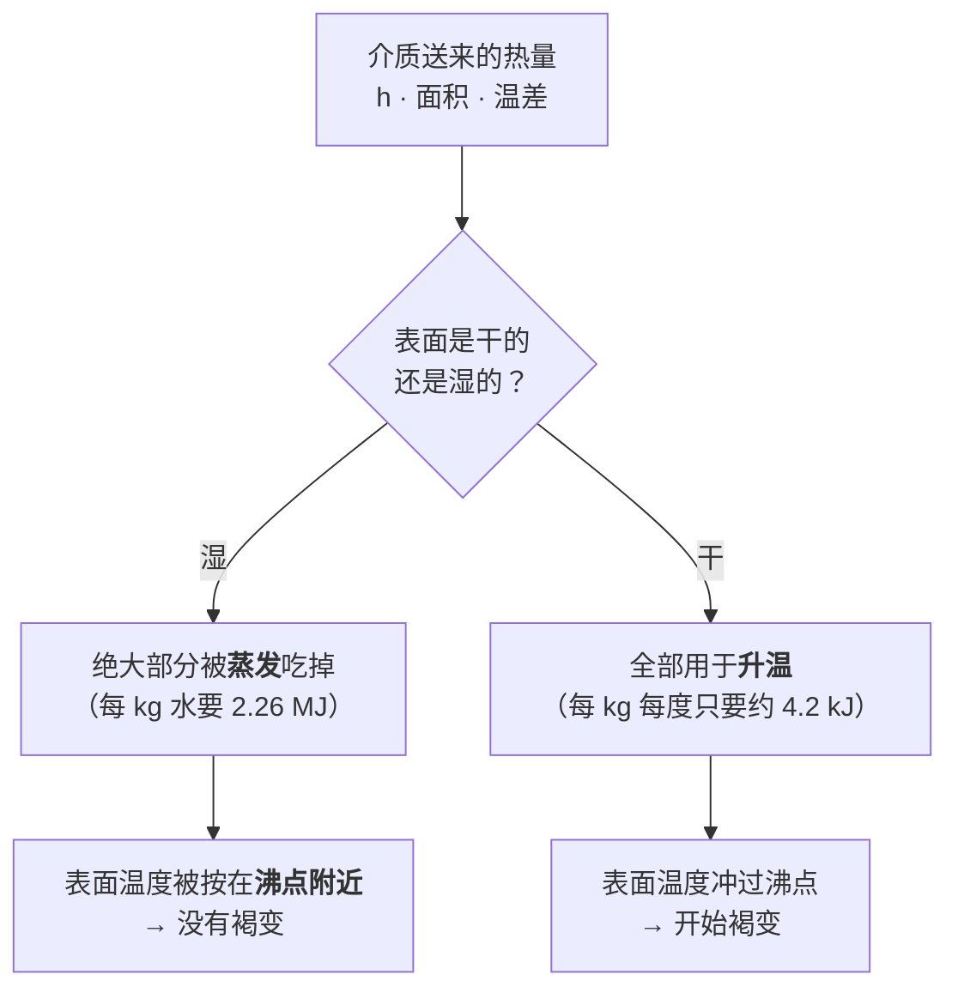
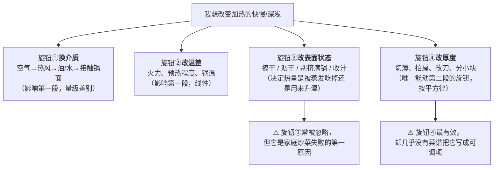

# 第 2 章 传热：导热、对流、辐射，以及水和油为什么不是一回事

> **本章目标**：把第 1 章里"热"这条线拆开。学完这一章，你能回答：
> 为什么同样是"熟了"，水煮和油炸的结果能差那么远？
> 为什么"外面焦了里面还生"几乎是必然？为什么切薄比开大火有用得多？
>
> 这一章有本书第一批**定量**内容。请注意它们的来源与适用范围——
> 凡是模型取值、而不是普适常数的地方，本书都会明说。

## 2.1 加热其实是两段路，而且两段的规律完全不同

先把全章的骨架立起来。热量要把一块生食材变熟，必须走完两段：

这两段的关键差别是：

| | 第一段（热源 → 表面） | 第二段（表面 → 中心） |
|---|---|---|
| 有几种走法 | 三种：导热、对流、辐射 | **只有一种：导热** |
| 你能怎么改 | 换介质、换火力、改表面状态 | **只能改厚度**（切薄、切小、拍扁） |
| 快慢差多少 | 换个介质能差一个数量级以上 | 几乎改不动——那是食材的物性 |

> **本章最该记住的一句话**：
> **绝大多数"做不好"的加热问题，瓶颈在第二段；而绝大多数人只在第一段上使劲（开大火）。**

下面两节分别讲这两段。

## 2.2 第一段：介质决定热量"送得多快"

热量到达食材表面只有三条路，第 1 章画过图，这里补上它们各自的脾气[^1][^2][^3]。

| 走法 | 靠什么 | 厨房里是谁 | 特点 |
|------|-------|-----------|------|
| **导热** | 直接接触 | 锅底、铁板、烤盘 | 只加热**贴着的那一面**，所以要翻面、要压平 |
| **对流** | 流动的液体或气体 | 沸水、油、蒸汽、烤箱热风、气炸锅风扇 | 能包住整个表面；**流动越快送得越快** |
| **辐射** | 电磁波，不需要介质 | 明火、炭火、烤箱上火管、烧烤架 | 只加热**"看得见"的那一面**；温度越高越猛 |

### 这三条路差多少？——一个量级参考

工程上用**换热系数**[^4]（单位 W/(m²·K)）描述"每平方米表面、每度温差、每秒能送进去多少能量"。
它越大，同样的温差下热量送得越快。

本书在食品加工的建模文献里核到了几个**模型取值**：

| 情形 | 模型取的换热系数 | 出处 |
|------|----------------|------|
| 食材周围的**静止空气**自然对流 | 约 8 W/(m²·K) | 一项煎肉的有限元建模研究（2025） |
| **气炸 / 热风**（强制对流） | 约 100 W/(m²·K) | 一项关于食品起孔与结壳条件的建模研究（2026） |
| 食材与**平底锅接触** | 约 200 W/(m²·K) | 同上第一项（2025） |

> ⚠️ **必须诚实说明三件事**：
> ①这些是**模型里选用的参数**，不是权威手册里的实测汇编。不同研究拟合出的数值差别很大——
> 例如另一篇同类论文对锅—肉接触的"热导"拟合值只有 40 W/(m²·K) 量级，
> 因为它把"接触面上的一层水汽"也算进了同一个系数里。
> ②因此**只能看量级，不能当精确值用**。
> ③本书**没有**核到"沸水""热油"在烹饪场景下的换热系数，所以上表里没有它们。

但**量级本身已经足够有用**了：

> 静止空气 ≈ 8 → 热风 ≈ 100 → 锅面接触 ≈ 200。
> **换个介质，热量送达的速度能差一个数量级以上。**
> 这就是为什么 200 °C 的烤箱里你可以把手伸进去几秒，而 200 °C 的油一滴都受不了——
> **温度一样，送得快慢差太远。**

### 每种介质还有一个"温度上限"

这是介质之间**更重要**的差别（第 1 章提过，这里给机制）：

| 介质 | 常压下温度大致封顶在 | 后果 |
|------|------------------|------|
| 沸水、蒸汽 | 水的沸点附近（约 100 °C） | **永远做不出褐色外壳** |
| 油 | 远高于水的沸点 | 能褐变、能脆壳 |
| 热空气（烤箱、气炸） | 远高于水的沸点 | 能褐变，但送热慢得多 |
| 辐射（明火、上火管） | 由热源温度决定，可以很高 | 上色最快，也最容易只焦一面 |

有一个可以拿来定位的实测锚点：一项煎汉堡的实验研究把电磁炉的锅面温度**设定在 215 °C**
并用热电偶监测。**油和金属能到这个温度，水不能**——这就是"水和油不是一回事"的第一层含义。

## 2.3 第二段：进了食材，就只能靠导热，而且很慢

热量一旦到达表面，**再往里走只有导热一条路**。而食材的导热能力很差。

同一篇建模研究列出了食物主要成分的**导热系数**（单位 W/(m·K)，越大越能导热）：

| 成分 | 导热系数 | 说明 |
|------|---------|------|
| 水 | 约 0.57~0.6 | 食物里导热最好的成分 |
| 蛋白质 | 约 0.18~0.2 | 差不多是水的三分之一 |
| 脂肪 | 约 0.18 | 和蛋白质接近 |

> 换句话说，**一块肉的导热能力基本由它含的水决定**，而且总体在 0.2~0.6 这个量级。
> 作为对照：金属的导热系数是几十到几百，**高出两三个数量级**——
> 这就是为什么"锅烧热"很快、"肉烧透"很慢。
> ⚠️ 金属的具体数值属于工程手册范畴，本书**没有核到一手来源**，所以这里只写"高出两三个数量级"这个量级判断。

### 由此推出厨房里最有用的一条标度关系：厚度的平方

导热方程告诉我们，热量在固体里靠导热走完一段距离所需的**特征时间，大致与距离的平方成正比**。
落到厨房里就是：

> **厚度加倍，需要的时间大致变成 4 倍；厚度减半，大致只要 1/4。**

这条关系解释了三件看起来无关的事：

1. **"外面焦了里面还生"是必然**。表面被持续加热，而热量往中心爬的速度按平方律变慢，
   所以厚的东西天然存在巨大的温度梯度。唯一的解法是**降低表面温度、拉长时间**，
   或者**把它变薄**。
2. **切薄、拍扁、切小、改刀，是效率最高的加速手段**——比开大火有效得多，
   因为开大火只作用在第一段，而瓶颈在第二段。
3. **中式炒菜为什么必须"切配"**：把食材切成薄片、细丝、小丁，
   本质上是把第二段的时间压到几十秒的量级，这样"大火快炒"才可能成立。

> ⚠️ **诚实说明**：平方律是**导热方程的标度关系**，它假设了"均匀固体 + 表面温度固定"。
> 真实食材有形状、有相变（水在蒸发）、有汁水流动，所以**它是一个估算方向，不是精确公式**。
> 本书把它当成"该切多薄"的量级判断用，不用它算时间。

## 2.4 水和油为什么不是一回事：三层差别

现在可以正面回答标题里的问题了。水和油的差别有三层，一层比一层反直觉。

### 第一层：温度上限不同（大家都知道的那层）

常压下水到沸点就不再升温，油可以远远超过。所以**水煮永远没有外壳，油炸有**。

### 第二层：蒸发要吃掉大量热量（多数人不知道的那层）

这是本章最有用的一个数字。文献给出的水的**汽化潜热**[^5]约为 **2.26 × 10⁶ J/kg**，
而水的**比热容**[^6]约为 4.1~4.2 kJ/(kg·K)。两个数一除：

> **把 1 kg 水从液态变成蒸汽，需要的能量大约相当于把这 1 kg 水升温 540 °C 所需的能量——
> 也就是把它从 0 °C 烧到 100 °C 的 5 倍还多。**

这个比例解释了厨房里一大类现象。表面湿的时候，能量流向是这样的：

建模文献把这写成一个很直白的式子：**净进入食材的热量 = 介质送来的热量 − 蒸发拿走的热量**。
只要蒸发这一项足够大，前一项就基本被抵消掉了。

**这就是"表面擦干"和"别一次下太多"这两条厨房铁律的定量原因**——
它们都是在减小蒸发这一项。

### 第三层：食材"湿的那部分"温度上不去（几乎没人知道的那层）

前两层都还在说表面。第三层说的是**内部**：

> **只要食材内部还有自由水，那一部分的温度就上不了沸点以上——
> 哪怕锅是 215 °C、油是 180 °C。**

这不是推测，本书核到了两个独立来源：

| 来源 | 它测到/算到了什么 |
|------|----------------|
| 一项煎汉堡的实验 + 建模研究（2026） | 锅面设定 215 °C 时，距接触面 **2 mm** 处的实测温度**接近 100 °C 但不超过**；作者解释为"脱水层下方形成了一个蒸发区，它的潜热需求给向内的热流设了一个硬上限" |
| 一项关于起孔与结壳条件的建模研究（2026） | "油炸时，产品温度迅速达到**沸点**"，而这个沸点由环境压力（和水活度）决定 |

于是得到本书反复要用的一条判断：

> ## 褐变只能发生在**已经干掉的那一层**上；只要还有水，那里就是"水的世界"。
>
> 所以"外壳"和"里面"是两个物理上分开的区域：
> 外壳是**已经脱水、可以超过沸点**的薄薄一层（上面那项研究里**不到 2 mm**），
> 里面是**仍然被水锁在沸点以下**的部分。
> **炸得好 = 外壳足够干足够薄，里面的水还没跑光。**

这条判断一口气解释了：为什么炸物要**先擦干**、为什么**复炸**有用（第一次把外层水赶走、第二次才真正结壳）、
为什么裹粉裹糊有用（把"要被牺牲的那层水"换成外来的淀粉层）、
以及为什么**面糊太湿的东西怎么炸都不脆**。

## 2.5 同样是水，换个相态和压力就变了

### 蒸汽：温度不高，但送热很猛

蒸汽在常压下和沸水一样封顶在约 100 °C，可是"蒸"给人的感觉明显比"泡在热水里"更凶。机制是**相变反过来走**：

> 水蒸气碰到较冷的食材表面会**冷凝**，而冷凝会把汽化时吸掉的那 2.26 MJ/kg **原样放出来**。
> 所以蒸汽是"自带一个巨大能量包"的介质。

这也是为什么**被水蒸气烫伤通常比被同温度的热水烫伤更重**——同样 100 °C，蒸汽多给了一份潜热。

但蒸的**温度上限并没有变**。所以：

> **蒸的优势从来不是"温度高"，而是两条：**
> ① 温度稳定地封顶在沸点附近，**给了窄窗口食材一个很难烧过头的环境**；
> ② **没有液态水**，所以食材里的可溶物**没有地方可去**（第 1 章的浸出数据就是这个机制）。
> **蒸的代价同样明确：永远蒸不出壳。**

### 高压：抬高沸点，是"换温度"不是"压进去"

家用高压锅常被解释成"压力把热压进食物里"。机制其实是另一回事：**压力升高，水的沸点升高**。

有一个官方口径的锚点：美国的家庭食品保藏指引写明，**海平面处约 10.5 磅表压对应罐内约 240 °F
（约 116 °C）**，并且强调"压力本身不杀菌，是足够高的温度维持足够长的时间在杀菌"；
海拔升高时同样的表压达不到同样的温度，所以要按海拔上调压力。

> ⚠️ **口径提示**：这是美国的家庭罐藏指引，服务的是罐藏安全，**不是**中国家用高压锅的产品参数。
> **各国口径不同，具体以自己所在地现行发布和自家锅具说明书为准。**

同一条物理规律（克劳修斯—克拉佩龙关系）还有一个反向的用法，建模文献里写得很清楚：

> **食材变干（水活度下降）时，它内部水的沸点会被抬高。**
> 这解释了结壳的最后一步：表层先干到一定程度 → 那里的"沸点"升高 →
> 温度才终于能冲过 100 °C → 褐变开始。
> **水活度是第 3 章的主角，这里先记住它和温度上限直接挂钩。**

## 2.6 辐射与微波：另外两条路

### 辐射：只加热看得见的那一面

明火、炭火、烤箱上火管、烧烤架都是辐射。它的两个厨房含义：

1. **只有被"照到"的表面在被加热**，背面几乎不受影响——所以**必须翻面**，
   而且"离得近"比"火大"更影响上色速度；
2. **热源温度越高，辐射越猛**（物理上按温度的四次方增长），
   所以明火和上火管**上色极快**，也极容易只焦一面。

> **判断规则**：想快速上色又不想把里面弄熟 → 用**高温辐射 + 短时间 + 离得近**；
> 想把里面做熟 → 辐射不是好工具，因为它进不到内部（第二段还是只能靠导热）。

### 微波：它不是"从里往外"加热

这是本书要正面纠正的一条流传极广的说法。美国 FDA 的微波炉页面写得很直接：

- 微波**让食物里的水分子振动**，分子间的摩擦产生热量，所以**含水多的东西热得快**；
- **微波炉"不是从里往外"做熟食物**。对较厚的食物，微波加热的是**外层**，
  **内部主要是靠热量从外层导进去**的。

看，**又回到了第二段**：哪怕换成微波，厚的食物内部还是只能靠导热。
这也是微波加热容易"外面烫、里面凉"的原因。

> **补充**：家用微波炉的工作频率常见为 2450 MHz——这个数字本书在一项对照传统微波
> （2450 MHz）与固态微波（912~913 MHz）烹饪牛肉的研究里核到，
> **FDA 的那个页面本身没有给频率**。

## 2.7 把这一章收敛成四个旋钮

想让加热变快或变慢，你能动的只有四样东西。任何一条"火候"经验都能翻译成它们中的一个：

> **可迁移的判断规则**：
> 遇到"不够快"时，**先问瓶颈在第一段还是第二段**。
> - 表面半天没反应（不响、不上色、不冒泡）→ 瓶颈在**第一段**：预热不够、锅太满、表面太湿；
> - 表面已经过火、里面还生 → 瓶颈在**第二段**：太厚了。开大火只会让情况更糟，
>   正确动作是**降温 + 延时**，或者**下次切薄**。

## 2.8 常见说法辨析

按本书约定标注**证据强度**：✅ 有共识 / ⚠️ 有争议 / ❌ 明确错误 / 缺乏证据。
来源见[出处登记](../../standards.md)。

| 说法 | 判定 | 说明 |
|------|------|------|
| "水开了以后要**大火**才熟得快" | ❌ **明确错误** | 常压下沸水的温度封顶在沸点附近，火再大水也不会更热。大火只会让水蒸发得更快（更费气、更快烧干），**不会提高传热温度**。它流传是因为"火大=快"在**没有水**的场合（煎、炒、烤）确实成立，被过度推广到了水里 |
| "微波炉是**从里往外**加热的" | ❌ **明确错误** | 美国 FDA 的页面明确写：微波炉**不是**"从里往外"做熟食物；较厚的食物由微波加热外层，**内部主要靠从热的外层导热进去**。这个说法流传，可能是因为微波加热的确比表面加热"进得更深一点"（它直接作用于一定厚度内的水分子），于是被夸张成了"从里往外" |
| "油炸 180 °C，所以食物里面也到了 180 °C" | ❌ **明确错误** | 只要内部还有自由水，那部分温度就被按在沸点附近。实测证据：锅面 215 °C 煎汉堡时，距接触面 2 mm 处的温度**接近 100 °C 但不超过**；建模文献也写"油炸时产品温度迅速达到沸点"。**高温只发生在已经脱水的那薄薄一层** |
| "厚度加倍，时间加倍" | ❌ **明确错误（低估了）** | 内部靠导热，特征时间大致与**厚度的平方**成正比 → 厚度加倍大致要 4 倍时间。⚠️ 平方律是导热方程的标度关系，真实食材有形状、相变与汁水流动，**只能当量级判断** |
| "高压锅快，是因为压力把热**压进**食物里" | ❌ **明确错误** | 是因为**压力抬高了水的沸点**，于是有了更高的加热温度。美国家庭罐藏指引：海平面约 10.5 磅表压对应约 240 °F（约 116 °C），并强调"压力本身不杀菌，是温度和时间在杀菌"。⚠️ 各国口径不同 |
| "**蒸**比**煮**温度高" | ❌ **明确错误** | 常压下蒸汽和沸水都封顶在沸点附近。蒸的真正优势是另外两条：温度稳定难烧过头；没有液态水所以可溶物无处可去 |
| "被蒸汽烫比被开水烫更严重" | ✅ **机制上有共识** | 冷凝会把汽化潜热（约 2.26 × 10⁶ J/kg）原样释放，所以同样 100 °C，蒸汽多给了一大份能量。⚠️ 本书引的是物性数据与机制，**没有**核到伤情统计 |
| "200 °C 的烤箱能把手伸进去，200 °C 的油不行" | ✅ **有共识** | 同样温度下，液体/接触传热的换热系数比静止空气高一个数量级以上（建模取值：静止空气约 8、热风约 100、锅接触约 200 W/(m²·K)）。⚠️ 这些是**模型取值**，不同研究差别很大，只看量级 |
| "火越大，菜熟得越快" | ⚠️ **只在第一段是瓶颈时成立** | 如果瓶颈在第二段（食材太厚），开大火只会让表面更焦而中心照样慢。**先判断瓶颈在哪**，再决定动哪个旋钮 |
| "不粘锅传热比铁锅差，所以炒不出锅气" | **缺乏证据** | 锅具差异至少涉及导热、蓄热、表面状态三件事，互相纠缠。本书**没有核到家庭锅具的一手对照数据**，留到第 31 章专门查。现阶段只能说：**换锅之后同一套参数不成立，这一点是确定的** |

## 2.9 🔎 下次做菜时的用处

1. **先判断瓶颈在第一段还是第二段**。"里面不熟"就不要再开大火了——那是厚度问题，
   要么改小火延时，要么下次切薄。
2. **要上色，先制造"干"**：擦干表面、锅别挤满、必要时先收汁。
   因为只要还在蒸发，热量就被那 2.26 MJ/kg 吃掉了，表面温度根本上不去。
3. **一次下太多 = 自找失败**。食材挤满锅 → 蒸发总量骤增 → 锅温被按住 → 炒变成煮。
   **分批下锅从来不是矫情。**
4. **选介质等于选上限**：想要壳，就别让它泡在水里；想要温柔均匀不烧过头，就用蒸。
   这个选择在开火之前就决定了成品的天花板。
5. **微波别指望它"里外一起熟"**：厚的东西要**切小、摊开、中途翻动、加盖静置**，
   让导热有时间把外层的热送进去。
6. **辐射类（明火、上火管、烧烤）必须翻面**，而且"离多近"比"火多大"更影响上色。

## 2.10 思考题

1. 第一段和第二段的瓶颈分别怎么判断？各举一个厨房现象，说明它属于哪一段的问题、该动哪个旋钮。
2. 用本章的数据解释：为什么"表面擦干"能明显加快上色？
   （提示：把汽化潜热和比热容放在一起比。）
3. 为什么"炸得外脆里嫩"在物理上是可能的？请用"两个区域"的说法讲清楚，
   并解释**复炸**为什么有用。
4. **【案例】** 你要做一块 4 cm 厚的带骨猪排，只有一口平底锅和一个盖子，没有烤箱和温度计。
   请回答：（a）按平方律，它相对于 2 cm 厚的排大约需要多少倍时间？
   （b）如果你全程用能把表面煎上色的火力，会发生什么？
   （c）写出一个分段方案，并说明每一段动的是四个旋钮里的哪一个。
   （d）没有温度计时，你打算用什么**现象判据**判断它熟了？这个判据的风险是什么？
5. **【案例】** 一份菜谱写："锅烧至冒烟，倒油，下**刚洗好的**虾仁，大火翻炒 30 秒至变色，
   盛出备用。" 请指出：（a）这份菜谱里哪个环节会让"大火 30 秒"的前提失效？
   （b）用本章的能量流向图解释后果；（c）你会怎么改，为什么。
6. **【辨析】** "微波炉是从里往外加热的"——判断证据强度，说出官方来源怎么写的，
   并解释这个说法**为什么**会流传（提示：它有一部分是对的）。
7. **【辨析】** "水开了要大火才熟得快"——判断证据强度，并设计一个**你家厨房就能做**的
   检验方法（提示：你需要的不是温度计，而是两口一样的锅和一个计时器；
   同时想清楚你这个检验**能**和**不能**证明什么）。
8. 本章给的换热系数（8 / 100 / 200 W/(m²·K)）为什么只能当量级看？
   如果有人拿这三个数去算"油炸比烤箱快多少倍"，他错在哪？

> 📖 **参考答案**（想清楚再看）：[Q1](../../qa/02-heat-transfer-qa.md#q1) ·
> [Q2](../../qa/02-heat-transfer-qa.md#q2) · [Q3](../../qa/02-heat-transfer-qa.md#q3) ·
> [Q4](../../qa/02-heat-transfer-qa.md#q4) · [Q5](../../qa/02-heat-transfer-qa.md#q5) ·
> [Q6](../../qa/02-heat-transfer-qa.md#q6) · [Q7](../../qa/02-heat-transfer-qa.md#q7) ·
> [Q8](../../qa/02-heat-transfer-qa.md#q8)

## 2.11 本章实操

### 🅐 零成本版 · 任务一：给你家的加热方式做一张"介质表"

不用开火。把你家能用的加热方式全列出来，填完下表。**目的是让"选介质"变成一个自觉动作。**

| 加热方式 | 主要靠哪种传热 | 温度上限大致在哪 | 能不能上色 | 我通常拿它做什么 | 它其实更适合做什么 |
|---------|--------------|---------------|-----------|---------------|-----------------|
| 炒锅 + 油 | | | | | |
| 煮锅 + 水 | | | | | |
| 蒸锅 | | | | | |
| 烤箱（热风） | | | | | |
| 烤箱（上火管） | | | | | |
| 微波炉 | | | | | |
| 电饭锅 | | | | | |

填完回答：**有没有哪一行，"我通常拿它做什么"和"它其实更适合做什么"对不上？**

### 🅐 零成本版 · 任务二：厚度审计（平方律的第一次体感）

打开冰箱或回忆你上周做的菜，挑 4 样食材，量一下（或估一下）它们**最厚的地方**有多厚。

| 食材 | 最厚处（cm） | 相对 1 cm 的估算倍数（厚度²） | 我上次给了它多长时间 | 对得上吗 |
|------|-----------|------------------------|-----------------|---------|
| | | | | |
| | | | | |
| | | | | |
| | | | | |

> 这个练习最常见的发现是：**你给"厚的"和"薄的"分配的时间，差距远小于平方律要求的差距。**
> 这正是"里面不熟"的来源。

### 🅐 零成本版 · 任务三：把一份菜谱标上"瓶颈在哪段"

拿[一道菜的处理方案表](../../forms/dish-plan.md)里你写过的那道菜（或任意一份菜谱），
给每一个加热步骤标注：

| 步骤 | 用的是什么介质 | 瓶颈在第一段还是第二段 | 如果要加快，该动哪个旋钮 |
|------|--------------|-------------------|--------------------|
| | | | |

### 🅑 开火版 · 任务四：厚薄对照（检验平方律，有灶台和食材时做）

**需要**：一样食材切出**厚薄两份**（建议土豆片或胡萝卜片，1 cm 与 2 cm；或鸡胸肉片）、
同一口锅、同样的水或油量、计时器。**替代方案**：没有刀工把握就用两块厚薄明显不同的现成食材，
但要记下实际厚度。

**唯一变量**：厚度。火力、介质、量、翻动方式全部保持一致。

| 组 | 厚度 | 到"中心刚熟"用了多久 | 表面状态（颜色/有没有过火） |
|----|------|------------------|------------------------|
| ① 薄 | | | |
| ② 厚 | | | |

做完回答：

| 问题 | 你的答案 |
|------|---------|
| 时间比大约是多少？接近 2 倍还是接近 4 倍？ | |
| 厚的那组表面有没有先过火？ | |
| 这次实验的**局限**是什么？（至少写三条） | |

> ⚠️ **安全提醒**：判断"熟没熟"不要只看颜色。涉及肉、禽、蛋时请按所在地官方指引的
> 中心温度执行（美国 CDC 的表述是：除海鲜外，不能靠颜色和质地判断，**温度计才可靠**；
> 各国口径不同）。本任务建议用**不涉及安全争议的食材**（如土豆、胡萝卜）来验证平方律。

### 🅑 开火版 · 任务五：湿表面 vs 干表面（检验"蒸发吃掉热量"）

**需要**：两块尽量一样的食材（豆腐、土豆片、厚蘑菇片都行）、厨房纸、同一口锅、计时器。

**唯一变量**：下锅前表面擦不擦干。

| 组 | 操作 | 下锅后前 30 秒听到什么 | 出现明显褐色用了多久 | 最终颜色 |
|----|------|------------------|------------------|---------|
| ① 擦干 | 纸巾吸干表面 | | | |
| ② 不擦干 | 直接下锅（甚至再洒几滴水） | | | |

做完回答：

1. 两组"出现褐色"的时间差多少？用**能量流向图**解释这个差别。
2. 不擦干那组在前 30 秒的**声音**有什么不同？（提示：听到的是水在做什么？）
3. 如果把"不擦干"那组的火调到最大，它能不能追上？为什么？

> **第 3 问是关键。** 答案不是"能"或"不能"，而是"要看你补进去的热量能不能超过蒸发的消耗"——
> 而家庭灶的功率上限恰恰是有限的。**这就是第五部分要专门讲的"家庭灶的限制"。**

## 2.12 本章依据

本章引用的来源与核对状态详见[参考书目与出处登记](../../standards.md)，具体对应如下：

| 本章用到的内容 | 依据 |
|--------------|------|
| 换热系数量级：静止空气约 8、锅接触约 200 W/(m²·K)；食物成分导热系数（水约 0.6、蛋白约 0.2 W/(m·K)）；锅面温度 140 °C 设定 | 一项关于肉在烹饪中各向异性大变形的有限元研究，*Current Research in Food Science*，2025（PMC12615324），✅ 开放获取全文。⚠️ 这些是**模型取值**，非实测汇编 |
| 汽化潜热 2.26 × 10⁶ J/kg；水比热容约 4.1 kJ/(kg·K)；水/蛋白/脂肪导热系数；锅面 215 °C 实验设定；**距接触面 2 mm 处温度接近但不超过 100 °C**；脱水层厚度不到 2 mm；净热流 = 对流输入 − 蒸发消耗 | 一项关于汉堡煎制的有限元建模与实验研究，*Current Research in Food Science*，2026（PMC12887417），✅ 开放获取全文 |
| 气炸/热风换热系数取值约 100 W/(m²·K)；"油炸时产品温度迅速达到沸点"；水活度下降会抬高沸点（克劳修斯—克拉佩龙）；结壳即玻璃化/表面硬化 | 一项关于食品起孔（结壳）前提条件的建模研究，*Current Research in Food Science*，2026（PMC13157119），✅ 开放获取全文 |
| 微波加热机制（水分子振动摩擦生热）、**"不是从里往外加热"**、厚食物内部主要靠导热 | 美国 FDA「Microwave Ovens」页面，✅ 已核到官方页面。⚠️ 该页面**不含频率数字** |
| 家用微波炉 2450 MHz | 一项对照固态微波（912~913 MHz）与传统微波（2450 MHz）烹饪牛肉的研究，*Foods*，2026（PMC12840329），✅ 摘要层面 |
| 高压下沸点升高：海平面约 10.5 磅表压 ↔ 约 240 °F（约 116 °C）；"压力本身不杀菌"；海拔修正 | 美国家庭食品保藏中心（NCHFP，基于 USDA《Complete Guide to Home Canning》）的"推荐罐藏器具"与"食品保藏温度"页面，✅。⚠️ 美国口径，服务于罐藏安全，非家用高压锅参数 |
| "不能靠颜色判断熟没熟" | 美国 CDC 食品安全页面，✅（第 1 章已登记） |
| 厚度平方律 | 导热方程的标度关系（机制推理），⚠️ 本书**未引用**任何烹饪场景的实测验证，只作量级判断 |
| 金属导热系数比食物高两三个数量级 | ⚠️ **未核到一手来源**，本章只写量级、不写数值；锅具的定量对照留到第 31 章 |
| 沸水、热油在烹饪场景下的换热系数 | ⚠️ **仍未核到**，本章表格中不列 |

[^1]: [导热](../../glossary.md#conduction)（conduction）。
[^2]: [对流](../../glossary.md#convection)（convection）。
[^3]: [辐射](../../glossary.md#radiation)（radiation）。
[^4]: [换热系数](../../glossary.md#htc)（heat transfer coefficient）。
[^5]: [汽化潜热](../../glossary.md#latent-heat)（latent heat of vaporization）。
[^6]: [比热容](../../glossary.md#specific-heat)（specific heat capacity）。

---

**下一章**：第 3 章 水——食材里的水、锅里的水、跑掉的水。
本章反复提到"只要还有水，温度就上不去"。下一章就去看这些水到底在哪、有多少、
以及"水活度"为什么比"含水量"更能决定一道菜的走向。
