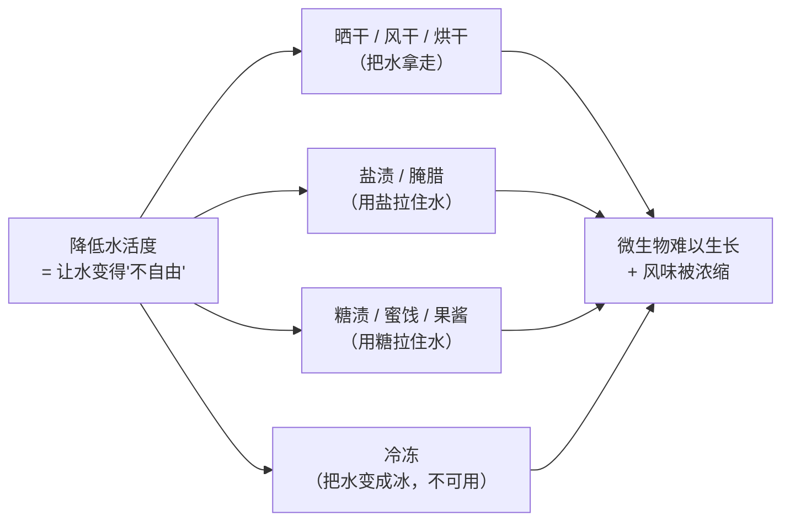
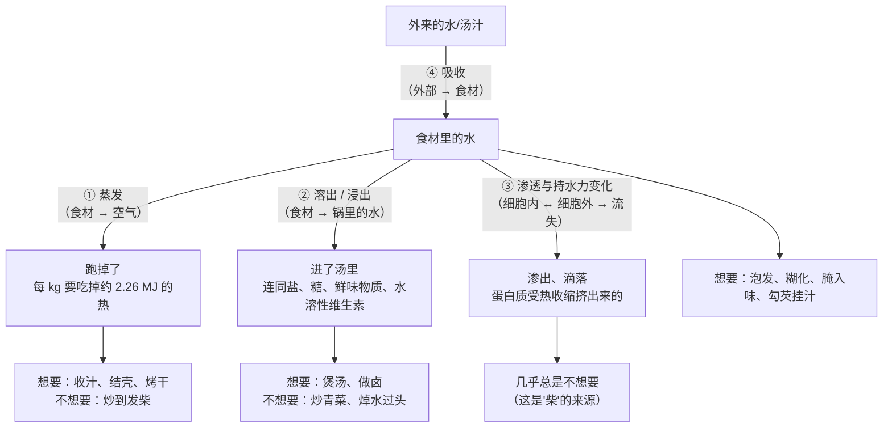

# 第 3 章 水：食材里的水、锅里的水、跑掉的水

> **本章目标**：把"水"这条线讲透。学完这一章，你会发现自己做的几乎每一道菜，
> 本质上都是**在处理一堆水**——而"好吃"与"不好吃"的差别，
> 常常只是这些水**去了哪里**。
>
> 本章还要引入一个比"含水量"更有用的概念：**水活度**。
> 它解释了为什么"有水就上不了色"，也解释了腌腊、晒干、糖渍为什么能保存食物。

## 3.1 先看一组数字：你做的东西，大部分是水

下面这些数值来自美国农业部的食物成分数据库（每 100 g 生食材中的水，克）：

| 食材（生） | 含水量 |
|-----------|-------|
| 黄瓜（去皮） | 96.7 |
| 黄瓜（带皮） | 95.2 |
| 番茄（红、熟，全年均值） | 94.5 |
| 白蘑菇 | 92.4 |
| 卷心菜 | 92.2 |
| 菠菜 | 91.4 |
| 土豆（带皮带肉） | 79.2 |
| 鸡蛋（全蛋，生） | 76.2 |
| 鸡肉糜（生） | 73.2 |
| 豆腐（老豆腐，硫酸钙凝固） | 69.8 |
| 牛肉糜（草饲，生） | 67.1 |

另一个**独立来源**给出的畜禽骨骼肌平均组成是：**约 75% 水、20% 蛋白质、1~10% 脂肪、1% 糖原**——
与上面肉类的数值互相印证。

> **两条立刻能用的结论**：
>
> 1. **蔬菜基本在 90%~97% 这个区间，肉在 65%~78%**。
>    所以"炒一盘青菜"的物理实质是：**把一堆 90% 以上是水的东西放进热锅里**。
>    它出水不是意外，是必然——问题只在于你**想让多少水出来、什么时候出来**。
> 2. **"多汁"从来不是加水加出来的，是"少赶走"出来的**。
>    一块生肉本来就有七成是水，你做的所有事情都只会让它变少。
>    ⚠️ 腌制、上浆、注射盐水这些做法能改善保水，但**起点永远是"它本来有多少"**。

## 3.2 水在一道菜里有四个身份

第 1 章讲了三个，这一章要补上最重要的第四个。

| 身份 | 它在做什么 | 你能怎么控制 |
|------|-----------|------------|
| ① **食材的主体** | 水跑掉了就是"干、柴、缩"；留住了就是"嫩、多汁" | 温度上限、加热时间、切法、是否加盐上浆 |
| ② **传热介质** | 煮、炖、蒸都靠它送热；但它把温度锁在沸点以下 | 加不加水、盖不盖盖、水量多少 |
| ③ **溶剂** | 盐、糖、鲜味物质、水溶性维生素都溶在里面，**水往哪走它们就往哪走** | 焯不焯、水量、要不要用那锅水 |
| ④ **温度的看门人** | **只要表面还有自由水，热量就优先被用来蒸发它，表面温度上不去** | 擦干、沥干、分批下锅、收汁 |

第 ④ 条是第 2 章的结论，本章把它讲到底：它和"水活度"是同一件事的两个说法。

## 3.3 含水量不等于"水有多可用"：水活度

### 定义

美国 FDA 的水活度技术指南给出的定义是：

> **水活度**[^1]（a_w）= 食物本身在完全平衡时的**蒸汽压** ÷ 同等条件下**纯水**的蒸汽压。
>
> 它也等于平衡相对湿度除以 100（a_w = ERH / 100）。
> 例如 a_w = 0.80，意思是这个食物的蒸汽压是纯水的 80%。
> ⚠️ **水活度随温度升高而升高**，所以测量时温度必须稳定。

用厨房的话说：

> **含水量说的是"有多少水"，水活度说的是"这些水有多自由"。**
> 被盐、糖、淀粉、蛋白质拉住的水（**结合水**[^2]）不算数；
> 能自由跑出去、能供微生物用的那部分（**自由水**[^3]）才算数。

一个直观的对比：果酱和新鲜水果的含水量可能差不多，但果酱里有大量糖把水拉住了，
所以它的水活度低得多，因此更耐放。

### FDA 给出的几个阈值（美国口径）

| 数值 | 含义 |
|------|------|
| **大多数食物 > 0.95** | 足以支持细菌、酵母和霉菌生长 |
| **约 0.93** | 肉毒梭菌生长的最低水活度；**视产品特性可高到 0.96** |
| **0.85** | 美国法规上的分界：成品水活度控制在 0.85 或以下，就不受 21 CFR 第 108、113、114 部分（低酸罐头与酸化食品）的管辖 |

FDA 同一份文件里列出的一些样品值，很能帮你建立直觉：

| 食物 | 水活度 |
|------|-------|
| 肝肠 | 0.96 |
| 奶酪酱 | 0.95 |
| 红豆沙 | 0.93 |
| 鱼子酱 | 0.92 |
| 巧克力酱 | 0.83 |
| 萨拉米香肠 | 0.82 |
| 酱油 | 0.80 |
| 花生酱、奶粉 | 0.70 |

> ⚠️ **这是美国的口径，服务的是食品加工的法规判定，不是家庭烹饪指南。
> 各国规定不同，且会修订，以自己所在地现行发布为准。本书不据此给出任何保存期限建议。**

### 为什么厨房要关心它

因为**人类几乎所有的传统保存方法，本质上都是在降低水活度**：

而**它还有第二个作用，正好连回第 2 章**：

> 建模文献用克劳修斯—克拉佩龙关系指出：**水活度下降时，食物里水的沸点会被抬高。**
>
> 这就把"表面必须先干"这件事解释到底了：
> 表层脱水 → 水活度下降 → 那里的"沸点"升高 → 温度终于能冲过 100 °C → **褐变开始**。
> **所以"上色"和"脱水"不是两件事，是同一件事的两个阶段。**

## 3.4 水在一道菜里往哪走：四条通道

**这张图就是本章的核心工具**。每次动手前，对照它问一句：

> **"这一步，我要水**进去**、**留住**、还是**赶走**？"**

三个答案对应三套完全不同的操作，而**菜谱从来不说它选的是哪一个**。

### 通道②：溶出，和它的代价

第 1 章已经给过数据，这里复述结论并补上机制：
文献综述汇总的例子是——90 °C/15 分钟的焯水条件下，豌豆与茄子的抗坏血酸损失约 **65%~70%**，
青椒约 **50%**；100 °C/5 分钟水煮塌菜，抗坏血酸下降 **32.6%**。
同一综述指出的机制有四条：①水溶性成分**浸出到水里**；②抗坏血酸本身**不耐高温**；
③**蒸没有液态水，可溶物无处可去**，所以损失明显更小；
④**加了盐会造成渗透失衡，水分流失更多、水溶性成分损失更大**。

> 注意第 ④ 条：**焯水时加盐并不是"保住味道"，它反而加剧流失**。
> 厨房里"焯水加盐能保持翠绿"的说法，本书**没有核到支持它的一手证据**，
> 而现有证据的方向是相反的（见下面的辨析表）。

### 通道③：渗出，和它的温度门槛

这是"柴"的来源，也是第 4、5 章的主题。这里只给"水"视角的结论，数据来自一篇低温慢煮综述：

| 温度区间 | 肌肉里发生了什么 | 水去哪了 |
|---------|---------------|---------|
| 40~60 °C | 肌纤维**横向收缩**，纤维之间的空隙变大 | 水从肌纤维内部被挤到**纤维间隙**（该综述给出的一个节点是 46 °C） |
| 60~65 °C | 开始**纵向收缩** | **保水与结合水的能力下降**，水开始真正离开这块肉 |
| 60 → 70 °C | — | **蒸煮损失显著上升** |
| 70 → 80 °C | — | 蒸煮损失**变化不明显**（已经跑得差不多了） |

同一综述汇总的牛肉低温慢煮**得率**（出锅重量 ÷ 下锅重量）是这样的：

| 温度 | 得率 |
|------|------|
| 50 °C | 91.7% / 89.2% |
| 55 °C | 84.3% / 77.3% / 74.4%（随时间延长而下降） |
| 60 °C | 81% |
| 约 100 °C，2 小时 | 64.2% |
| 75 °C，36 小时 | 61.1% |

> ⚠️ **诚实说明**：这些数字来自**不同研究、不同肌肉、不同尺寸和时间**，
> 综述把它们汇总在一张表里，**不能横向直接比较**，只能看**方向**。
> 而方向非常清楚：**温度越高，留下的水越少；而在低温区，时间的影响明显小于温度。**

**方向本身已经足够写成一条判断规则**：

> ## 决定"多不多汁"的主要是**温度**，不是时间。
>
> 所以"炖了三小时还是柴"和"只煮了 10 分钟也柴"并不矛盾——
> 前者是温度太高，后者也是温度太高。
> **想留水，先把温度降下来；想赶水（收汁、上色），才把温度提上去。**

## 3.5 锅里的水：同时是朋友和敌人

| 锅里有水时 | 好处 | 代价 |
|-----------|------|------|
| 温度被封顶在沸点附近 | **不容易烧焦、受热均匀、给了窄窗口食材一个安全区** | **不可能褐变**，没有壳、没有"锅气"香 |
| 有液体作载体 | 味道能溶进去、能挂住、能形成汤汁 | 可溶物也会从食材里**跑到汤里** |
| 蒸发带走热量 | 能给食材降温（这也是"加水救场"有效的原因） | **锅温被按住**，"大火快炒"的前提被破坏 |

所以"收汁"这个动作同时在做**三件事**，分属三条线（第 1 章提过，这里补第三条的机制）：

1. **浓缩味道**（味）——水少了，溶质浓度上升；
2. **提高黏度，让汁能挂住食材**（水 + 味）——挂得住，味道在嘴里待的时间才长；
3. **把"温度的看门人"赶走**（水 + 热）——水少到一定程度，表面温度才有机会冲过沸点，
   于是最后阶段才可能出现焦香与光泽。

> **这解释了一个很多人觉得神秘的现象**：红烧类菜品**最后几十秒**颜色和香味会突然变好。
> 那不是"火候到了"的玄学，是**水少到不足以再压住温度**的那一刻。

## 3.6 家庭厨房里，水最常见的三次失控

| 失控 | 现象 | 机制 | 对策 |
|------|------|------|------|
| **带水下锅** | 盘底积水、颜色暗、没有香味 | 表面水 + 高含水食材 → 蒸发量骤增 → 锅温被按住 | 沥干、吸干、分批下锅 |
| **加热过头** | 肉柴、蛋出水、豆腐蜂窝 | 超过保水力的下坡区间，水被蛋白质挤出来 | **降温**，而不是缩短时间；提前离火用余温 |
| **该溶出时没溶出 / 不该溶出时溶出了** | 汤没味、菜没味 | 没想清楚"要不要溶出" | 做汤：冷水下锅、久一点；炒菜：别焯过头、焯完的水该用就用 |

## 3.7 本章的可迁移规则

> ## 动手前，对每一步问一句："这一步，我要水**进去**、**留住**，还是**赶走**？"
>
> | 答案 | 该做什么 | 该避免什么 |
> |------|---------|-----------|
> | **进去**（泡发、腌入味、糊化、勾芡挂汁） | 给时间、给液体、必要时给盐（盐是"对水的命令"） | 急，以及高温——高温只会让它往外跑 |
> | **留住**（想嫩、想多汁） | **控制温度上限**，缩短高温段，用余温收尾 | 靠"缩短时间"来补救过高的温度 |
> | **赶走**（想上色、想收汁、想脆） | **先把表面弄干**、别挤满锅、后期加大火力 | 盖盖子、中途加水、一次下太多 |
>
> **同一道菜的不同阶段，答案常常不一样**——这就是为什么"顺序"比"参数"重要。

## 3.8 常见说法辨析

按本书约定标注**证据强度**：✅ 有共识 / ⚠️ 有争议 / ❌ 明确错误 / 缺乏证据。
来源见[出处登记](../../standards.md)。

| 说法 | 判定 | 说明 |
|------|------|------|
| "含水量高的食物就容易坏" | ⚠️ **不准确** | 真正相关的是**水活度**而不是含水量。FDA 的技术指南以 **0.85** 作为法规分界，并给出肉毒梭菌生长的最低水活度约 **0.93**（视产品可高到 0.96）；果酱含水不少但水活度低。⚠️ 美国口径，各国不同，本书不据此给保存期限建议 |
| "青菜出水是因为洗完没甩干" | ⚠️ **只说对了一小部分** | 表面水只是一部分。数据摆在那里：卷心菜 92.2 g/100 g、菠菜 91.4 g/100 g——**菜本身九成以上就是水**。甩干确实有用（它减少了额外的蒸发负担），但**即使完全甩干，菜也会出水**。真正的对策是锅温、分批和时间 |
| "焯水时加盐能保住颜色和味道" | **缺乏证据，且现有证据方向相反** | 本书**没有核到**支持"加盐保色/保味"的一手证据；而一篇 2024 年的综述明确指出**加盐会造成渗透失衡，水分流失更多、水溶性成分损失更大**。⚠️ 加盐可能确实改变口感（表面先有味），但那是另一回事 |
| "**蒸**比煮**更有营养**" | ⚠️ **方向有证据，但说法过简** | 有机制也有数据：蒸没有液态水，可溶物**没有去处**，所以水溶性成分损失明显小于水煮。但"更有营养"是把多维问题压成一句口号——同一综述也指出蒸的结果**因蔬菜而异**，且抗坏血酸本身不耐高温。**本书只写机制，不给营养建议** |
| "煎肉先大火'封住'，肉汁就锁住了" | ❌ **明确错误** | 第 1 章已辨析（McGee 记述的测试显示煎过的烤肉失水相同或更多）。从本章角度补一句机制：**水离开肉的主因是蛋白质受热收缩把它挤出来**（60~65 °C 起纵向收缩、保水能力下降），而不是"从表面漏出去"。**表面封不封，管不了里面的收缩** |
| "解冻流出来的红水是血" | ✅ **判定为错误说法**（机制由两条已核事实推得） | 两条已核事实：①肌肉在储存期间，肌纤维**横向收缩并把细胞内的水挤到细胞外空隙**，随后从切面流出；②红色来自**肌红蛋白**——它是肌浆里的色素蛋白，负责携氧、让肌肉呈红色。合起来：流出的是**水 + 溶在其中的肌浆蛋白（含肌红蛋白）**，不是血液。⚠️ 本书是由这两条事实推得结论，**没有**核到直接检测渗出液成分的一手文献 |
| "肉泡水/冲水能去腥" | ⚠️ **部分成立，但有明确代价** | 成立的部分：一部分异味物质是水溶性的，泡/冲确实能带走一些（同一机制也带走呈味物质与水溶性维生素）。代价：**溶出是不挑食的**——它带走异味的同时也带走鲜味。所以泡水**该有时限、该有目的**，"泡越久越干净"不成立。⚠️ 去腥的具体机理本书尚未核到一手文献，留到第 19 章 |
| "收汁就是把水煮干" | ⚠️ **说少了** | 收汁同时做三件事：浓缩味道、提高黏度让汁挂住食材、以及**把压住温度的水赶走**从而让最后阶段能上色。只盯着"煮干"，就会错过"什么时候该停"——**停在能挂住勺背、而不是停在锅底发糊** |
| "菜出水了，加点淀粉水就好了" | ⚠️ **能救现象，救不了原因** | 勾芡确实能把游离的水变成挂得住的汁（淀粉糊化，第 6 章）。但**水已经从菜里出来了这件事不可逆**——菜的口感已经变了。勾芡是**补救**，不是**预防** |
| "焯完的水一定要倒掉" | ⚠️ **取决于你焯的是什么、为了什么** | 如果目的是去血水、浮沫、涩味，那些东西就在水里，**该倒**；如果焯的是干净的蔬菜、目的只是断生或对齐成熟时间，那锅水里是**你刚刚损失掉的味道**，可以用来做汤、煮面。**"倒不倒"取决于你焯的是四个问题中的哪一个**（第 1 章 Q1） |

## 3.9 🔎 下次做菜时的用处

1. **下锅前把"这一步要水进去、留住还是赶走"想清楚**，一句话就能定下火力和盖不盖盖。
2. **想留水，先降温**，别指望靠"快一点"来补救。保水力的下坡区间是温度决定的。
3. **想上色，先让水少**：擦干 → 分批 → 收汁。三步之后才该考虑加大火力。
4. **别在焯水时加盐指望"保住味道"**——现有证据的方向是它让流失更多。
5. **焯完的水先想一秒再倒**：它是垃圾还是原料，取决于你刚才焯的是什么。
6. **把"收汁到什么程度"变成现象判据**：能挂住勺背、锅底划开不立刻合拢——
   而不是"收 3 分钟"。
7. **看到盘底积水时，不要怪自己手慢**：先回想是不是带水下锅、是不是一次下太多。

## 3.10 思考题

1. "含水量"和"水活度"分别是什么？为什么果酱能放很久而新鲜水果不能？
   用 FDA 给的阈值说明"0.85"这个数字是什么性质的数字（它是安全保证，还是法规分界？）。
2. 用本章的四条通道图，说明"收汁"这个动作同时在动哪几条通道、解决哪几个问题。
3. 为什么本书说"多汁不是加水加出来的"？请用 3.4 节的温度—得率数据支持你的回答，
   并说明这些数字**不能**被怎样使用。
4. **【案例】** 你要做一道**清炒杏鲍菇**，从没做过。已知蘑菇类含水量在 92% 左右，
   而你希望成品是"边缘微焦、有香味、盘底不积水"。请回答：
   （a）这道菜里"水"这条线的目标是进去、留住还是赶走？
   （b）为了达到这个目标，切法、锅具、下锅量、火力、盖不盖盖分别该怎么定？
   （c）如果做到一半发现锅里已经有一层水了，你还能救吗？怎么救？代价是什么？
5. **【案例】** 一份菜谱写："排骨冷水下锅，加料酒姜片焯水 5 分钟，捞出用**冷水**冲洗干净，
   另起锅加热水炖 1 小时。" 请逐句回答：
   （a）"冷水下锅"和"热水下锅"在"水"这条线上的差别是什么？这里为什么用冷水？
   （b）"焯完用冷水冲"这一步在解决什么问题？它的代价是什么？
   （c）"另起锅加**热水**"——为什么不用冷水？请从两条线（水和热）各给一个理由。
6. **【辨析】** "焯水加盐能保住蔬菜的颜色和味道"——判断证据强度，说明现有证据的方向，
   并设计一个你在家能做的对照（提示：你需要一台厨房秤，还需要想清楚你到底在测什么）。
7. **【辨析】** "解冻出来的红水是血"——判断这个说法，并说明本书是**怎么**得到这个判断的
   （提示：本书用了两条已核事实做推理，而不是直接引用一篇检测渗出液的论文——
   这个区别为什么重要？）。
8. 第 2 章说"表面必须先干才能上色"，本章说"水活度下降会抬高沸点"。
   请把这两句话连成一条完整的因果链，解释**结壳**的全过程。

> 📖 **参考答案**（想清楚再看）：[Q1](../../qa/03-water-qa.md#q1) ·
> [Q2](../../qa/03-water-qa.md#q2) · [Q3](../../qa/03-water-qa.md#q3) ·
> [Q4](../../qa/03-water-qa.md#q4) · [Q5](../../qa/03-water-qa.md#q5) ·
> [Q6](../../qa/03-water-qa.md#q6) · [Q7](../../qa/03-water-qa.md#q7) ·
> [Q8](../../qa/03-water-qa.md#q8)

## 3.11 本章实操

### 🅐 零成本版 · 任务一：给冰箱做一次"含水量普查"

不用开火，不用秤。打开冰箱，把里面的食材按你的**直觉**排个序，然后对照本章表格（或查
美国农业部食物成分数据库）核对。

| 食材 | 我猜的含水量 | 查到的含水量 | 差了多少 | 它下锅后会不会大量出水 |
|------|------------|------------|---------|-------------------|
| | | | | |
| | | | | |
| | | | | |
| | | | | |
| | | | | |

填完回答：

| 问题 | 你的答案 |
|------|---------|
| 我**低估**了含水量的是哪几样？ | |
| 这几样在我做菜时，是不是正好就是"总是出水"的那几样？ | |

> 常见结果：人们普遍**低估**蘑菇、西葫芦、大白菜、番茄的含水量，
> 而这几样恰恰是家庭炒菜里最容易"炒成煮"的。

### 🅐 零成本版 · 任务二：给身边的食物排一张"水活度直觉表"

不用仪器。把下面这些东西按**你觉得的"水有多自由"**排序，再对照 FDA 给的样品值。

| 食物 | 我的排序（1 = 水最自由） | FDA 给的值（若有） | 我猜错了吗 |
|------|--------------------|-----------------|-----------|
| 新鲜番茄 | | （本书未查到） | |
| 红豆沙 | | 0.93 | |
| 萨拉米香肠 | | 0.82 | |
| 酱油 | | 0.80 | |
| 花生酱 | | 0.70 | |
| 奶粉 | | 0.70 | |

然后回答：**酱油是液体，为什么它的水活度反而比红豆沙还低？**
（提示：想想酱油里溶了多少盐。）

### 🅐 零成本版 · 任务三：把一份菜谱标成"进去 / 留住 / 赶走"

拿任意一份你想学的菜谱，给**每一个**涉及液体或加热的步骤打标签：

| 步骤 | 进去 / 留住 / 赶走 | 判断理由 | 菜谱有没有告诉你这一点 |
|------|-----------------|---------|-------------------|
| | | | |

> 这个练习的价值在最后一栏。**菜谱几乎从不说明它在动哪条通道**，
> 而这正是你换食材时无法迁移的原因。

### 🅑 开火版 · 任务四：同一把菜，甩干 vs 不甩干（有灶台和食材时做）

**需要**：同一批青菜（或蘑菇片）分成尽量等量的两份、厨房秤、同一口锅、计时器、
一个能看清盘底的浅盘。

**唯一变量**：下锅前有没有沥干/甩干。火力、油量、下锅量、翻动方式、时间全部一致。

| 组 | 下锅前重量 | 出锅后重量 | 失重比例 | 盘底积水（多 / 少 / 无） | 颜色与口感 |
|----|-----------|-----------|---------|--------------------|-----------|
| ① 充分沥干 | | | | | |
| ② 洗完直接下锅 | | | | | |

做完回答：

| 问题 | 你的答案 |
|------|---------|
| 哪组盘底积水更多？差多少？ | |
| 用"能量流向"解释这个差别（第 2 章） | |
| 即使是沥干那组，盘底是不是也有水？为什么？ | |
| 这次实验的局限有哪些？ | |

> **第 3 问是这个任务的重点**：沥干组照样出水，因为**菜本身就是 90%+ 的水**。
> 这会帮你把期望值调整到正确的位置——**你能改善它，但不能消灭它。**

### 🅑 开火版 · 任务五：加盖 vs 不加盖（看"水"怎么改变整道菜）

**需要**：两份尽量一样的食材（土豆块、鸡腿肉块都可以）、同一口锅、锅盖、秤、计时器。

**唯一变量**：加不加盖。

| 组 | 操作 | 熟到同样程度用了多久 | 失重比例 | 表面颜色 | 锅底有没有汁 |
|----|------|------------------|---------|---------|------------|
| ① 加盖 | 全程盖上 | | | | |
| ② 不加盖 | 全程敞开 | | | | |

做完回答：

1. 哪组更快熟？为什么？（提示：加盖留住了什么？它是怎么传热的？）
2. 哪组上色更好？为什么？
3. 如果你**既想快熟又想上色**，应该怎么安排这两种状态的顺序？
   （这道题的答案，就是"先煎后焖""先焖后收汁"这两类做法的全部道理。）

> ⚠️ **安全提醒**：涉及肉、禽、蛋时，"熟没熟"请按所在地官方指引的中心温度判断
> （美国 CDC：除海鲜外不能靠颜色和质地判断，温度计才可靠；各国口径不同）。
> 本任务若用土豆等非风险食材，可以只用口感判断。

## 3.12 本章依据

本章引用的来源与核对状态详见[参考书目与出处登记](../../standards.md)，具体对应如下：

| 本章用到的内容 | 依据 |
|--------------|------|
| 各种生食材的含水量（黄瓜 96.7 / 番茄 94.5 / 卷心菜 92.2 / 菠菜 91.4 / 蘑菇 92.4 / 土豆 79.2 / 全蛋 76.2 / 鸡肉糜 73.2 / 豆腐 69.8 / 牛肉糜 67.1 g 每 100 g） | 美国农业部 FoodData Central（SR Legacy 数据集），✅ 逐条查询核对 |
| 骨骼肌平均组成约 75% 水、20% 蛋白、1~10% 脂肪、1% 糖原；肌红蛋白是肌浆中的红色色素；储存期间肌纤维横向收缩把细胞内水挤到细胞外并从切面流出 | 一篇关于肌肉结构与组成如何影响肉/鱼品质的综述，*The Scientific World Journal*，2016（PMC4789028），✅ 开放获取全文 |
| 水活度定义（蒸汽压之比、= ERH/100、随温度升高）、"大多数食物 > 0.95"、肉毒梭菌最低约 0.93（可高到 0.96）、法规分界 0.85、各类食品样品值 | 美国 FDA「Water Activity (aw) in Foods」检查技术指南，✅ 已核到官方页面。⚠️ 美国口径，服务于法规判定 |
| 水活度下降会抬高食物内部水的沸点（克劳修斯—克拉佩龙） | 一项关于食品起孔（结壳）前提条件的建模研究，*Current Research in Food Science*，2026（PMC13157119），✅ |
| 汽化潜热约 2.26 × 10⁶ J/kg | 一项关于汉堡煎制的建模与实验研究，*Current Research in Food Science*，2026（PMC12887417），✅ |
| 加热时肉里水的去向：40~60 °C 横向收缩、46 °C 水被挤到纤维间隙、60~65 °C 纵向收缩且保水下降、蒸煮损失 60→70 °C 显著上升而 70→80 °C 不明显；牛肉低温慢煮得率（50 °C 91.7/89.2%、55 °C 84.3/77.3/74.4%、60 °C 81%、约 100 °C×2 h 64.2%、75 °C×36 h 61.1%）；猪肉 48 与 53 °C 得率最高 84.9~88.2% | 一篇关于低温慢煮改善肉品质量的综述，*Foods*，2023（PMC10453940），✅。⚠️ 综述汇总的是**不同研究**的结果，条件不同，**不可横向直接比较**，只能看方向 |
| 焯水/水煮的抗坏血酸损失数据、浸出机制、蒸的损失更小、**加盐加剧流失** | 一篇关于热处理对果蔬中多酚、类胡萝卜素、硫苷与抗坏血酸影响的综述，*Comprehensive Reviews in Food Science and Food Safety*，2024（PMC11605278），✅ |
| "煎能锁汁"被推翻 | McGee《On Food and Cooking》2004 年修订版第 161 页"The Searing Question"，⚠️ 由文献转引（第 1 章已登记） |
| "不能靠颜色判断熟没熟" | 美国 CDC 食品安全页面，✅ |
| "焯水加盐保色保味"的支持证据 | ⚠️ **未找到**；现有证据方向相反，本章据此标注 |
| 泡水去腥的机理与定量 | ⚠️ **未核到一手文献**，只写方向，留到第 19 章 |
| 渗出液（"血水"）成分的直接检测 | ⚠️ **未核到**；本章结论由两条已核事实推得，并在辨析表中明确标注 |

[^1]: [水活度](../../glossary.md#water-activity)（water activity, a_w）。
[^2]: [结合水](../../glossary.md#bound-water)（bound water）。
[^3]: [自由水](../../glossary.md#free-water)（free water）。

---

**下一章**：第 4 章 蛋白质——变性、凝固与保水。
本章反复提到"蛋白质受热收缩把水挤出来"。下一章就去看这个收缩到底是怎么回事，
以及为什么它**基本不可逆**——这是"过了就回不来"的物理原因。
