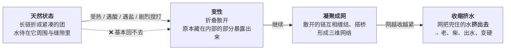
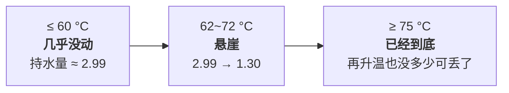
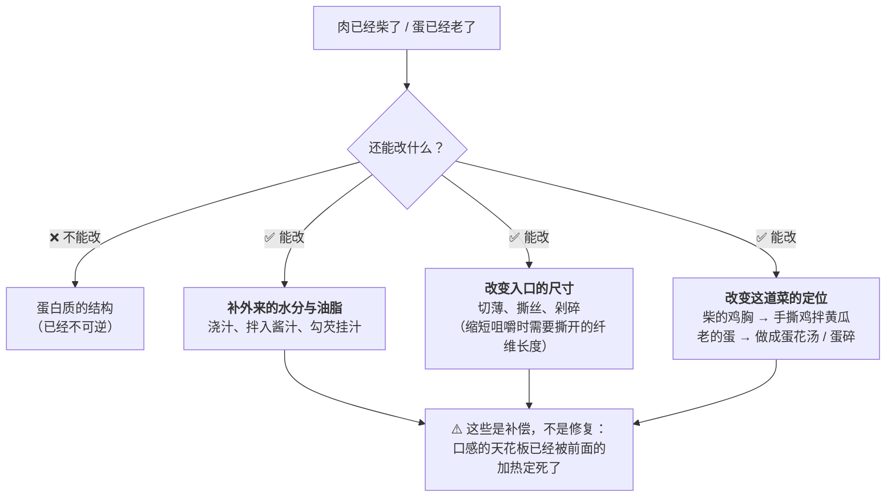

# 第 4 章 蛋白质：变性、凝固与保水

> **本章目标**：解释厨房里最残酷的一条规律——**过了就回不来**。
> 学完这一章，你能说出蛋、肉、奶各自的"窗口"在哪、为什么窗口不一样宽，
> 以及为什么"再煮一会儿"在某些温度区间代价巨大、在另一些区间几乎没影响。
>
> ⚠️ **本章温度最多，也最容易被误用。** 请务必先读 4.2 末尾的"关于这些数字"那段——
> 它们是**区间与顺序**，不是开关。

## 4.1 蛋白质是一根"折好的绳子"

先给一个够用的物理图像：

三个阶段，对应厨房里三种手感：

| 阶段 | 厨房里看到的 | 可逆吗 |
|------|------------|-------|
| **变性**[^1] | 蛋白由透明变白、肉由软变紧、鱼肉由半透明变不透明 | ❌ 基本不可逆 |
| **凝聚成网** | 蛋液变成蛋块、肉变得有弹性、奶被"点"成豆花 | ❌ |
| **收缩挤水** | 蛋出水、肉缩小变柴、豆腐起蜂窝 | ❌ |

> **这就是"过了就回不来"的物理原因。**
> 而它也给出了一条最重要的操作原则：
> **蛋白质类食材的加热，必须按"宁可不足"来安排**——
> 不足可以补（再加热一会儿），过了没法补。

## 4.2 肉里有三类蛋白质，脾气完全不同

把肉当成"一种东西"是很多失败的根源。文献里肉的蛋白质分成三类，
它们在**完全不同的温度区间**做事：

| 类别 | 占肉中蛋白质的比例 | 它是谁 | 它决定什么 |
|------|-----------------|-------|-----------|
| **肌原纤维蛋白**[^2] | 约 50%~55% | 肌球蛋白、肌动蛋白等 | **质地的主体**：弹性、紧实、收缩、挤水 |
| **肌浆蛋白**[^3] | — | 溶在细胞浆里的酶类、肌红蛋白等 | 颜色、部分风味；受热聚集后会"糊"住 |
| **结缔组织蛋白** | 胶原约占肉中蛋白质的 5.3% | 胶原为主 | **筋膜的韧**，以及久炖之后的软糯（第 5 章专讲） |

### 一张温度顺序表

下面这张表汇总自一篇低温慢煮综述所转引的多项研究。**请先看完表下的警告再用它。**

| 大致温度 | 发生了什么 |
|---------|-----------|
| 30~32 °C | 肌原纤维蛋白开始**展开**（变性的第一步） |
| 35~40 °C | 肌纤维**开始收缩**，并会一直持续到 80 °C |
| 36~40 °C | 蛋白质之间开始**交联** |
| 40~60 °C | 肌浆蛋白**聚集**；肌纤维**横向收缩**，纤维间空隙变大 |
| 45~50 °C | 开始**成胶**（形成网络） |
| 约 46 °C | 水被从肌纤维内部挤到**纤维间隙** |
| 53~63 °C | **胶原变性** |
| 60~65 °C | 肌纤维**纵向收缩**，**保水与结合水的能力下降** |
| 60~70 °C | 胶原纤维**成胶** |
| 70~80 °C | 肌动蛋白变性 |

> ## ⚠️ 关于这些数字，必须说清楚四件事
>
> 1. **它们是区间，不是开关**。蛋白质变性是一个有**速率**的过程（第 1 章的"时间"线）：
>    温度决定速率，时间决定累积量。写"53~63 °C 胶原变性"不等于"53 °C 以下什么都不发生"。
> 2. **它们会随体系漂移**。pH、盐浓度、升温速率、部位、动物年龄都会移动这些区间。
>    **同一个蛋白质，在实验室的纯溶液里和在一块肉里，测出来的温度可以差很远**
>    （第 1 章举过：纯卵白蛋白在水中的 DSC 变性温度约 80.22 °C，
>    而全蛋液在 60 多 °C 就有明显变化）。
> 3. **来源本身是有冲突的**。本书引用的这篇综述**内部就不一致**：
>    一处写"肌动蛋白与肌球蛋白在 40~50 °C 变性"，另一处写"肌动蛋白在 70~80 °C 变性"。
>    本书**不替它做裁决**，只把冲突摆出来，并因此**只用区间和顺序，不用单点数字**。
> 4. **不要拿它当安全依据**。质地的温度和安全的温度是两套东西，
>    安全一律以官方指引为准（各国口径不同，见[出处登记](../../standards.md)）。

**那这张表还有什么用？** 它给出的是**顺序**，而顺序是可靠的、可迁移的：

> **先展开 → 再交联成网 → 再横向收缩（水被挤到间隙）→ 再纵向收缩（水真正离开）。**
>
> 也就是说：**"变紧"发生在前，"失水"发生在后。**
> 你有一个窗口——**肉已经不生了，但还没开始大量失水**。
> 这个窗口就是"嫩"的全部含义。

## 4.3 保水力：一条集中在十度左右的下坡

上一节说"失水发生在后"，那到底有多陡？本书核到了一个很具体的答案。

一项煎肉的有限元建模研究，用一个拟合出来的函数描述肉的**持水量**随温度的变化。
把这个函数的数值算出来是这样的（单位：kg 水 / kg 干物质）：

| 温度 | 持水量 | 相对于起点 |
|------|-------|-----------|
| 40 °C | 2.99 | 100% |
| 55 °C | 2.99 | 100% |
| 60 °C | 2.98 | 99.6% |
| 63 °C | 2.86 | 95.8% |
| 约 67 °C | 1.90 | 63.7% |
| 70 °C | 1.36 | 45.4% |
| 75 °C | 1.30 | 43.4% |
| 85 °C | 1.30 | 43.4% |

把它画成图，形状极其清楚：

> **这条曲线告诉你三件事**：
>
> 1. **肉的保水力不是随温度均匀下降的，它集中在一个约 10 °C 宽的陡坡里**，
>    坡的中点在 **67 °C 附近**；
> 2. **坡的上方（低于约 60 °C）几乎是平的**——所以在这个区间里多待一会儿，代价很小；
> 3. **坡的下方（高于约 75 °C）也是平的**——所以"已经过了"之后再多煮，
>    并不会让它更柴多少。**柴是在那 10 °C 里发生的。**

**这条曲线有第二个独立来源印证**：一篇低温慢煮综述汇总的实验结论是
**蒸煮损失在 60 → 70 °C 之间显著上升，而在 70 → 80 °C 之间变化不明显**。
两个来源、两套方法（建模拟合 vs 实验汇总），**结论方向与位置一致**。

> ⚠️ **仍然要标注的限制**：那条曲线是**某项研究为拟合自己的实验而选定的函数**，
> 不是普适常数；不同部位、不同 pH、不同腌制状态的肉，坡的位置会移动。
> **本书用它来说明"形状"，不用它来算具体的温度。**

**于是第 1 章的一句话有了定量支撑**：

> **"再煮一会儿"在某些温度区间代价很大，在另一些区间几乎没影响。**
> 具体来说：**在悬崖区间里，每一度都很贵；在悬崖之外，时间便宜得多。**

## 4.4 蛋：窗口最窄的那一个

第 1 章已经给过数据，这里把它讲完整。

一项关于加热对全蛋液功能与结构性质影响的研究，在 55~67 °C / 0~10 分钟的范围内测到：

| 观察项 | 结果 |
|-------|------|
| 乳化性 | **55~64 °C 无显著变化**；到 **67 °C 显著下降** |
| 储能模量（可粗略理解为"变稠成胶"的程度） | **67 °C 之后急剧上升** |
| 溶解度损失（同一时间下） | 55 °C 时 **17.94%** → 67 °C 时 **41.29%** |

> **也就是说：十几度的区间里，蛋从"还基本是液体"走到了"明显成胶"。**
> 这就是"蛋是窗口最窄的常见食材"的具体含义。

作为对照，同一批资料里还有两个数字值得记住，因为它们教你**怎么读温度**：

- 纯卵白蛋白在水中（5% 浓度、升温 5 °C/min）的 DSC 变性温度是 **80.22 °C**，
  溶菌酶是 **77.46 °C**；
- 而**全蛋液**在 60 多 °C 就有明显变化。

> ⚠️ **这两组数字都没错，它们测的是不同的东西。**
> 纯蛋白在稀溶液里"分子层面完全展开"的温度，
> **高于**同种蛋白在真实食物体系里"宏观上开始变稠"的温度。
> **所以"蛋白质在 X °C 凝固"这种单点说法，本身就是一个不成立的问法。**

同一份研究里还记录了两个官方口径的巴氏杀菌参数，正好演示了"各国不同"：

| 地区 | 全蛋液巴氏处理要求 |
|------|-----------------|
| 美国 | 至少 60 °C / 3.5 分钟 |
| 英国 | 建议至少 64 °C / 2.5 分钟 |

⚠️ 这是**工业液蛋**的处理参数，**不是**家庭做蛋类菜品的指引。
家庭做法请按所在地官方指引（例如美国 FDA 对蛋类菜品给出的是 160 °F 的中心温度），
**各国口径不同**。

**窄窗口食材的通用对策**（这是可迁移的，不只对蛋）：

1. **降低介质温度**——窗口窄的时候，把升温速度降下来，等于把窗口"变宽"；
2. **缩短时间 + 提前离火**——利用[余温加热](../../glossary.md#carryover)完成最后一段；
3. **单独做、最后合并**——不要和会出水的食材同锅（第 1 章的番茄炒蛋）；
4. **加东西稀释**——加水、加奶、加油会降低蛋白质浓度并改变热容，
   ⚠️ 但本书**没有核到**关于"加多少能让窗口宽多少"的一手定量证据，
   所以只写方向，不给比例。

## 4.5 让蛋白质变性的，不只有热

热是最常用的手段，但不是唯一的。厨房里另外三种：

| 手段 | 例子 | 本书目前能说什么 |
|------|------|----------------|
| **酸** | 柠檬汁腌生鱼、醋点豆花、酸奶发酵、酸汤鱼 | 酸能改变蛋白质表面的电荷状态，从而引发变性与凝聚。⚠️ 具体的 pH 阈值本书**尚未核到一手文献**，留到第 8 章 |
| **盐** | 腌肉、上浆、做鱼丸打胶 | 盐既能促进某些蛋白质溶解（"打出胶"），也参与改变保水。⚠️ 定量关系本书**尚未核到**，留到第 11、17 章 |
| **机械** | 打发蛋白、摔打肉馅 | 剧烈搅打把蛋白质从界面上"扯开"，形成泡沫或胶状结构 |

> **本章不展开这三条**，但要记住一件事：
> **它们和热是可以叠加的**——腌过盐的肉在受热时的表现，和没腌过的不一样。
> 这就是为什么"腌制"能改变一块肉的可行温度范围（第 17 章的主题）。

## 4.6 过了之后还能做什么

**变性不可逆**，但"吃起来怎么样"还受另外几件事影响。所以"救"的思路不是**逆转**，
而是**补偿**：

> **诚实说明**：上面这三条"能改"的路，本书归类为**惯例与机制推理**——
> 它们背后是"口感由结构 + 润滑 + 入口尺寸共同决定"这个常识性框架，
> 本书**没有核到**针对每一条的一手对照实验。**列出来是为了给你一个当场的选项，
> 而不是宣称它们一定有效。**

## 4.7 本章的可迁移规则

> ## 动手前问一句："这道菜的主角是哪一类蛋白质？"——答案直接给出温度上限。
>
> | 主角 | 典型食材 | 你该做什么 |
> |------|---------|-----------|
> | **窄窗口的凝固型**（蛋、鱼、虾、嫩豆腐、奶） | 蛋羹、清蒸鱼、滑蛋、奶制品 | **压低温度上限**、缩短时间、**提前离火用余温**。宁可回锅，不要过头 |
> | **肌原纤维为主的瘦肉** | 鸡胸、里脊、牛排、瘦猪肉 | **别越过那个约 10 °C 的悬崖**。高温只用在表面上色，内部要控温 |
> | **结缔组织为主的硬部位** | 牛腩、牛腱、猪蹄、鸡爪、肘子 | 走**另一条路**：接受瘦肉部分的失水，换取胶原转化（第 5 章） |
>
> **这三类的策略互相冲突，所以最重要的一步是先分类。**
> 分错了类，后面每一步都会错——"把牛腱当牛排煎"和"把鸡胸当牛腩炖"，
> 是同一个错误的两个方向。

## 4.8 常见说法辨析

按本书约定标注**证据强度**：✅ 有共识 / ⚠️ 有争议 / ❌ 明确错误 / 缺乏证据。
来源见[出处登记](../../standards.md)。

| 说法 | 判定 | 说明 |
|------|------|------|
| "蛋白质在 62 °C（或任何单一温度）凝固" | ❌ **问法本身不成立** | 变性是有**速率**的过程，且强烈依赖体系。同一批资料里：纯卵白蛋白在水中的 DSC 变性温度约 80.22 °C，而全蛋液在 60 多 °C 就有明显变化、67 °C 后储能模量急剧上升。**两个数都没错，它们测的不是同一件事** |
| "肉煮到发白 / 不见血色就熟了" | ❌ **明确错误（安全问题）** | 美国 CDC 明确表述：**除海鲜外**，不能通过颜色和质地判断食物是否安全熟透，**温度计是唯一可靠的方法**。⚠️ 本章的温度是**质地**的温度，不是安全的温度，两者不能混用 |
| "煎牛排先大火封边能锁住肉汁" | ❌ **明确错误** | 第 1 章已辨析。本章补上机制：**水离开肉的主因是蛋白质受热收缩把它挤出来**（60~65 °C 起纵向收缩、保水能力下降，持水量在约 62~72 °C 之间掉掉一半以上）。**表面那层壳管不了里面的收缩** |
| "越煮越柴，所以要尽量少煮" | ⚠️ **只说对了一段** | 保水力的下降**集中在一个约 10 °C 宽的区间**（拟合曲线的中点在 67 °C 附近），而在它**上方**（低于约 60 °C）和**下方**（高于约 75 °C）都相当平。所以"再多煮五分钟"的代价，**完全取决于你此刻在曲线的哪一段** |
| "低温慢煮的肉不安全" | ⚠️ **取决于是否满足前提** | 英国 FSA 把食物中心 60 °C/45 分钟、65 °C/10 分钟、70 °C/2 分钟、75 °C/30 秒、80 °C/6 秒列为**等效组合**——低温不等于不安全，但它要求"**中心真的达到 + 真的保持 + 有可靠测量**"三个前提。家用灶台很难同时满足。⚠️ 各国口径不同，以所在地现行发布为准 |
| "肉出锅后要**静置**，肉汁会回到肉里" | **缺乏证据** | 本书**没有核到**支持"汁回流"的一手实验。能确认的只有相邻的一条：离火后中心温度还会继续上升（[余温加热](../../glossary.md#carryover)），所以**静置会让它更熟**——这本身就是安排时间的理由。至于"切开流出的汁更少"，本书只能标为**机制推理 + 惯例**，不作为原理讲 |
| "打蛋时加点水/牛奶会更嫩" | **缺乏证据** | 方向上可以解释（稀释降低蛋白质浓度、改变热容与凝胶行为），但本书**没有核到**给出"加多少、嫩多少"的一手对照实验。**当惯例用可以，别当原理讲，更不要照抄比例** |
| "蛋白质加热变性了就没营养了" | ⚠️ **与现有表述方向相反** | 本书核到的综述指出：**加热通常提高蛋白质的消化率**，且低温把胶原转成明胶时"改善了蛋白质消化率"；同时也指出加热会带来氨基酸的一些损失。⚠️ **本书不做任何营养或健康建议**，只复述机构与文献的表述范围，详细的证据等级讨论留到第 44 章 |
| "冷冻过的肉一定更柴" | **缺乏证据** | 本书**没有核到**一手对照数据。可确认的相邻事实是：储存期间肌纤维横向收缩、把细胞内水挤到细胞外并从切面流出——**所以解冻会有渗出**是有机制支持的；但"因此一定更柴"是**跨了一步**的结论。留到第 16 章补查 |
| "肉要逆纹切才嫩" | ⚠️ **方向合理，本书未核到定量出处** | 机制上清楚：切断长纤维 = 缩短咀嚼时需要撕开的长度。文献里可佐证的相邻事实是"剪切力随肌束膜束的粗细而上升"。⚠️ 但"逆纹切能降低多少剪切力"本书**没有核到**，留到第 16 章 |

## 4.9 🔎 下次做菜时的用处

1. **先给这道菜的蛋白质分类**：窄窗口凝固型 / 瘦肉型 / 结缔组织型。
   这一步决定了温度上限，而温度上限决定了其余一切。
2. **宁可不足，不要过头**。不足能补，过了不能。所有含蛋白质的食材都适用这一条。
3. **蛋、鱼、虾、嫩豆腐提前离火**，让余温收尾。等"看起来刚好"再关火，通常已经过了。
4. **煮瘦肉时，别在那个悬崖区间里久留**。要么停在它上面（低温慢做），
   要么干脆冲过去（高温短时表面上色 + 控制中心）。**最差的是慢慢地在悬崖中间磨。**
5. **判断熟没熟别只靠颜色**——这是安全问题（CDC 的明确表述），
   而本章给的温度全都是**质地**的温度。
6. **柴了就别硬修**，改定位：切薄、撕丝、浇汁、改做凉拌或汤。
   承认天花板已定，比继续加热有用。

## 4.10 思考题

1. 用"变性 → 凝聚成网 → 收缩挤水"这三个阶段，解释为什么"嫩"是一个**窗口**而不是一个点。
   这个窗口在肉里大致对应哪两个事件之间？
2. 本章给了一条持水量曲线（约 62~72 °C 的悬崖）。请回答：
   （a）为什么说"在悬崖之上和之下，时间都相对便宜"？
   （b）这条曲线和另一个独立来源的哪条结论互相印证？
   （c）这条曲线**不能**被怎样使用？
3. 为什么"蛋白质在 X °C 凝固"这个问法本身不成立？请用本章的两组数字说明。
4. **【案例】** 你要做一份**滑蛋虾仁**，手里只有普通灶台和不粘锅，没有温度计。
   这道菜里有两种蛋白质：蛋和虾。请回答：
   （a）它们各自属于哪一类？窗口哪个更窄？
   （b）写出下锅顺序与火力安排，并说明每一步在控制什么。
   （c）你打算用什么**现象判据**决定"关火"？为什么关火的时机要早于"看起来刚好"？
   （d）如果家里人临时说晚十分钟吃饭，这道菜该怎么办？
5. **【案例】** 一份菜谱写："鸡胸肉切片，加盐、料酒、蛋清、淀粉抓匀腌 15 分钟，
   热锅凉油滑散至变色盛出；另起锅炒配菜，最后倒回鸡肉大火翻炒 2 分钟收汁。"
   请回答：（a）"腌 15 分钟"这一步里，盐、蛋清、淀粉各在解决什么问题？
   哪一个是本书**有证据**支持的，哪一个只是惯例？
   （b）"滑散至变色盛出"为什么要盛出？
   （c）最后"倒回去大火翻炒 2 分钟"有什么风险？你会怎么改？
6. **【辨析】** "肉出锅要静置，肉汁会回到肉里"——判断证据强度，
   说明本书能确认的是什么、不能确认的是什么，并设计一个你在家能做的检验。
7. **【辨析】** "打蛋加点牛奶会更嫩"——判断证据强度，
   并说明为什么本书拒绝给出"加多少"的比例。
8. 第 3 章说"决定多不多汁的主要是温度不是时间"，本章说"变性是有速率的过程，
   时间决定累积量"。这两句话矛盾吗？请调和它们。

> 📖 **参考答案**（想清楚再看）：[Q1](../../qa/04-protein-qa.md#q1) ·
> [Q2](../../qa/04-protein-qa.md#q2) · [Q3](../../qa/04-protein-qa.md#q3) ·
> [Q4](../../qa/04-protein-qa.md#q4) · [Q5](../../qa/04-protein-qa.md#q5) ·
> [Q6](../../qa/04-protein-qa.md#q6) · [Q7](../../qa/04-protein-qa.md#q7) ·
> [Q8](../../qa/04-protein-qa.md#q8)

## 4.11 本章实操

### 🅐 零成本版 · 任务一：给冰箱里的蛋白质食材分类

不用开火。把冰箱里所有含蛋白质的食材列出来，填下表。
**这张表填完，你以后做菜的第一个决定就自动有了。**

| 食材 | 属于哪一类（窄窗口 / 瘦肉 / 结缔组织） | 判断依据（看到了什么） | 所以温度上限该怎么定 | 我以前是怎么做的 |
|------|--------------------------------|------------------|-----------------|---------------|
| | | | | |
| | | | | |
| | | | | |
| | | | | |

**判断依据的提示**：看**筋膜多不多**（白色的膜、韧的条）、**颜色深不深**（越红说明肌红蛋白越多、
通常是运动多的部位）、**摸起来软还是紧**。

填完回答：**有没有哪一样，"我以前的做法"和"它应该的温度上限"是冲突的？**

### 🅐 零成本版 · 任务二：画出你自己的"悬崖图"

不用开火。拿一张纸，把本章的持水量曲线重画一遍，
然后在上面标出你**常做的几道菜**大致处在哪一段。

| 我常做的菜 | 我估计的内部温度区间 | 在悬崖的上方 / 中间 / 下方 | 它通常柴吗 | 对得上吗 |
|-----------|-----------------|----------------------|-----------|---------|
| 清蒸鱼 | | | | |
| 炒肉片 | | | | |
| 炖牛腩 | | | | |
| （你自己加） | | | | |

> ⚠️ 这一栏的"估计"必然很粗——你没有温度计。
> **这个练习的目的不是估准，而是让你意识到"我完全不知道我的肉到了多少度"**。
> 这就是本书唯一反复建议购买的器具：**一支探针温度计**。

### 🅐 零成本版 · 任务三：把一份菜谱标上"哪一步在动蛋白质"

拿任意一份含肉或蛋的菜谱：

| 步骤 | 动的是哪一类蛋白质 | 它想让蛋白质走到哪一步（变性 / 成网 / 收缩） | 这一步有风险吗 |
|------|----------------|------------------------------|-------------|
| | | | |

### 🅑 开火版 · 任务四：同一个蛋，三种火力（有灶台和食材时做）

**需要**：3 个鸡蛋（打散混匀后**分成三等份**，这样起点完全一致）、同一口不粘锅、
同样的油量、计时器、纸笔。**替代方案**：用同一个蛋分三次，但每次之间必须**等锅冷回来**。

**唯一变量**：火力。其他（蛋液量、油量、搅动方式、判断"凝固"的标准）全部一致。

| 组 | 火力 | 从下锅到凝固用了多久 | 口感（嫩 / 刚好 / 老） | 有没有出水 | 有没有焦边 |
|----|------|------------------|------------------|-----------|-----------|
| ① 小火 | | | | | |
| ② 中火 | | | | | |
| ③ 大火 | | | | | |

做完回答：

| 问题 | 你的答案 |
|------|---------|
| 哪一组你最喜欢？ | |
| 你最喜欢的那一组，**从"看起来快好了"到"已经过了"有多长时间**？ | |
| 这个"可反应时间"在三组之间差多少？这说明了什么？ | |

> **第 2、3 问才是重点。** 火力越大，那个"可反应时间"越短——
> 这就是**窄窗口食材为什么要降低介质温度**的直接体感：
> **降温不是为了做得慢，是为了给自己留出反应时间。**

### 🅑 开火版 · 任务五：提前离火 vs 看起来刚好才离火

**需要**：两份尽量一样的蛋液（或两块一样的鱼片、虾仁）、同一口锅、同样火力、计时器。

**唯一变量**：什么时候关火。

| 组 | 关火时机 | 关火时的样子 | 静置 1 分钟后的样子 | 最终口感 |
|----|---------|------------|-----------------|---------|
| ① 提前 | 还有约三分之一看起来"没好" | | | |
| ② 正常 | 看起来**刚刚好**才关火 | | | |

做完回答：

1. 静置之后，两组分别变成了什么样？哪一组更接近你想要的？
2. 用[余温加热](../../glossary.md#carryover)解释这个差别。
3. 如果换成一块**厚的**食材（比如整块鸡胸），余温的影响会更大还是更小？为什么？
   （提示：回到第 2 章的"第二段"。）

> ⚠️ **安全提醒**：蛋类、禽肉、肉类请按所在地官方指引处理
> （例如美国 FDA 对蛋类菜品给出的是 160 °F 的中心温度、禽类 165 °F；
> 加拿大卫生部的口径不同；**各国口径不同，以当地现行发布为准**）。
> "提前离火用余温"是**口感**手段，**不能**用来突破安全要求——
> 需要达到安全中心温度时，请用温度计确认，而不是靠余温估计。
> 本任务建议只用于练习火候感觉，不要用于风险较高的食材。

## 4.12 本章依据

本章引用的来源与核对状态详见[参考书目与出处登记](../../standards.md)，具体对应如下：

| 本章用到的内容 | 依据 |
|--------------|------|
| 肉中蛋白质分类与比例（肌原纤维约 50%~55%、胶原约占肉中蛋白质 5.3%）；温度顺序表（肌原纤维蛋白 30~32 °C 展开、36~40 °C 交联、45~50 °C 成胶、肌浆蛋白 40~60 °C 聚集、肌纤维 35~40 °C 起收缩至 80 °C、40~60 °C 横向收缩、46 °C 水被挤到间隙、53~63 °C 胶原变性、60~65 °C 纵向收缩且保水下降、60~70 °C 胶原成胶、70~80 °C 肌动蛋白变性）；蒸煮损失 60→70 °C 显著上升、70→80 °C 不明显；加热提高蛋白质消化率 | 一篇关于低温慢煮改善肉品质量的综述，*Foods*，2023（PMC10453940），✅ 开放获取全文。⚠️ **该综述内部存在矛盾引文**（肌动蛋白变性一处写 40~50 °C、另一处写 70~80 °C），本章因此**只用区间与顺序，不用单点** |
| 持水量随温度变化的曲线（约 2.99 → 1.30 kg 水/kg 干物质，中点约 67 °C，悬崖约 62~72 °C） | 一项关于肉在烹饪中各向异性大变形的有限元研究，*Current Research in Food Science*，2025（PMC12615324）中的持水力拟合函数，✅ 开放获取全文；数值由本书按该函数计算得出。⚠️ 这是**为拟合特定实验选定的函数**，不是普适常数 |
| 全蛋液加热（55~64 °C 乳化性无显著变化、67 °C 显著下降、67 °C 后储能模量急剧上升、溶解度损失 17.94% → 41.29%）；美国全蛋液巴氏 ≥60 °C/3.5 分钟、英国建议 ≥64 °C/2.5 分钟 | 一项关于加热处理对全蛋液功能与结构性质影响的研究，*Foods*，2023（PMC10094217），✅ |
| 纯卵白蛋白 DSC 变性温度 80.22 °C、溶菌酶 77.46 °C | 一项关于卵白蛋白与溶菌酶热力学与凝胶性质的研究，*Gels*，2025（PMC12191903），✅ |
| 储存期间肌纤维横向收缩、把细胞内水挤到细胞外并从切面排出；剪切力随肌束膜束粗细上升 | 一篇关于肌肉结构与组成如何影响肉/鱼品质的综述，*The Scientific World Journal*，2016（PMC4789028），✅ |
| "不能靠颜色判断熟没熟" | 美国 CDC 食品安全页面，✅ |
| 蛋类菜品中心温度、禽类中心温度 | 美国 FDA「Safe Food Handling」，✅；加拿大卫生部页面给出**不同口径**，✅ |
| 时间—温度等效组合 | 英国 FSA「Cooking your food」，✅ |
| "静置让肉汁回流"的证据 | ⚠️ **未找到**；本章只确认相邻的"余温加热"，其余标为机制推理 + 惯例 |
| "打蛋加水/加奶更嫩"的定量证据 | ⚠️ **未找到**，本章只写方向、不给比例 |
| 酸与盐引起变性的 pH / 浓度阈值 | ⚠️ **未核到**，本章只写方向，留到第 8、11、17 章 |
| 逆纹切、冷冻对嫩度影响的定量证据 | ⚠️ **未核到**，留到第 16 章 |

[^1]: [蛋白质变性](../../glossary.md#denaturation)（protein denaturation）。
[^2]: [肌原纤维蛋白](../../glossary.md#myofibrillar)（myofibrillar protein）。
[^3]: [肌浆蛋白](../../glossary.md#sarcoplasmic)（sarcoplasmic protein）。

---

**下一章**：第 5 章 胶原与结缔组织——为什么"炖得久"能让硬肉变软。
本章讲的是肌纤维（瘦肉）的故事，它的结论是"温度越高留下的水越少"。
下一章要讲一个方向**相反**的故事：有一类蛋白质恰恰需要**高温 + 长时间**才肯软下来——
而这两条规律同时作用在同一块肉上，就是"炖"这件事的全部难点。
