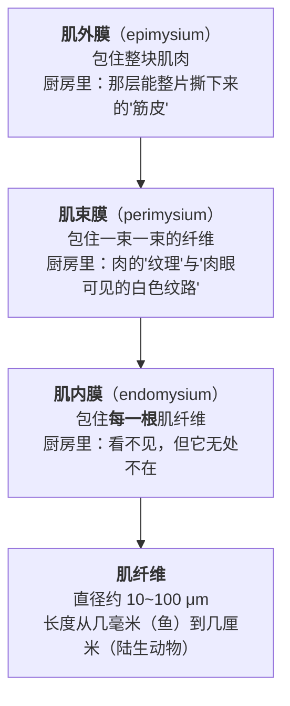
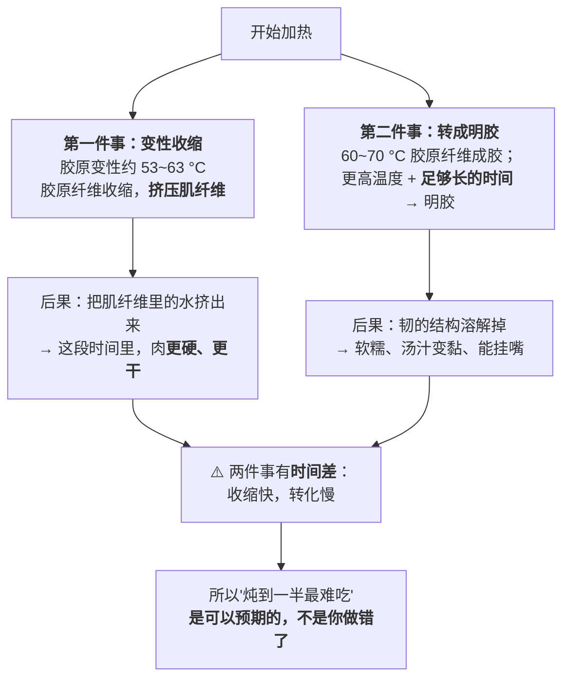

# 第 5 章 胶原与结缔组织：为什么"炖得久"能让硬肉变软

> **本章目标**：解释第 4 章留下的那个矛盾——
> 瘦肉的规律是"温度越高，留下的水越少"，
> 可是硬肉偏偏要**长时间高温**才肯软。这两条规律作用在同一块肉上，
> 就是"炖"这件事的全部难点。
>
> 学完这一章，你**看一眼一块肉就知道它该炒、该炖还是该烤**——
> 而这个判断不需要认识部位名称。

## 5.1 一块肉里的"骨架"

肌肉不是一团均匀的东西。文献给出的宏观结构是：

> **骨骼肌大约由 90% 的肌肉纤维 + 10% 的结缔组织与脂肪组织构成。**

而那 10% 的结缔组织不是随便散落的，它是一套**三层的套筒**：

**这张图解释了三件厨房里的事**：

1. **"筋"有三个层级，处理方式不同**。肌外膜可以**用刀去掉**（所以整理牛排时要"去筋膜"）；
   肌束膜决定了肉的"纹理"和"粗细"，**只能靠加热改造**；
   肌内膜看不见摸不着，**只能靠加热**。
2. **"一整块肉"其实是很多根被反复包裹的细丝**。这就是为什么**逆着纹理切**
   能明显改变口感——你是在替牙齿提前切断那些束。
3. **鱼为什么那么容易散**：鱼的肌纤维长度只有毫米量级，
   而且是按"肌节"一片一片排列的——**一受热，片与片之间就分开了**。
   所以清蒸鱼追求的从来不是"炖烂"，而是"刚好还连着"。

## 5.2 硬不硬，看三件事

### 第一件：含量

胶原[^1]是结缔组织的主要蛋白质。文献给出的含量（注意单位是**肌肉干重**的百分比）：

| 动物 / 部位 | 总胶原含量（占肌肉干重） |
|------------|--------------------|
| 成年牛（各肌肉的跨度） | **1%~15%** |
| 大白猪（商品屠宰阶段）腰内肉（Psoas major） | 1.3% |
| 大白猪 背阔肌（Latissimus dorsi） | 3.3% |
| 禽类 | 0.75%~2% |

另一篇综述给出的一个总体量级是：**胶原约占肉中蛋白质的 5.3%**。

> **第一个可迁移结论**：**同一头牛身上，不同肌肉的胶原含量能差十几倍。**
> 所以"牛肉该怎么做"这个问题问错了——**该问"这块牛肉该怎么做"**。

### 第二件：交联

含量只说了"有多少绳子"，**交联**[^2]说的是"这些绳子被打了多少个结"。文献明确列出，
肌内胶原的比例与**交联程度**取决于：

> **肌肉类型、物种、基因型、年龄、性别，以及**——这一条最有厨房意义——**运动量。**

而另一篇综述给出了交联随年龄变化的方向：

> **动物年龄增长时，胶原的交联会"成熟"，变得更加热稳定、更难被打断。**
> 因此**老龄动物的肉需要更高的温度和更长的时间**，才能达到与年轻动物的肉同等的嫩度。

> ## 第二个可迁移结论（本章最有用的一条）
>
> **动得多的部位 + 年纪大的动物 = 结缔组织又多又难拆 → 必须用时间。**
>
> 你不需要背部位名称。看三样东西就够了：
> **①这块肉在动物身上是不是"干活"的（腿、肩、颈、尾）；
> ②它有没有肉眼可见的白色筋络；③它生的时候硬不硬、有没有弹性。**

这条规律还解释了一件常被误解的事：

> **猪肉和鸡肉为什么不像牛肉那样"非炖不可"？**
>
> 文献的解释很直接：猪和禽通常在**相对早的生理阶段**就被屠宰，
> 此时**肌内胶原还没有显著交联**，所以**胶原对猪肉和鸡肉的感官质量影响有限**。
> 相应地，牛肉的"**基础韧度**"（由肌内结缔组织的比例、分布和性质决定）更高，
> 宰后自然嫩化的程度也更弱——**所以牛肉对排酸时间特别敏感。**
>
> 另外，禽肉里较多的是**前胶原**，它在水环境中容易膨胀，**不需要长时间热处理**。

### 第三件：分布

同样多的胶原，**排布方式不同，吃起来也不同**。文献指出：
**肌束膜的束越粗，剪切力越大**（在牛和猪上都观察到）——
这就是"肉的纹理粗"和"口感粗"之间的联系。

⚠️ 但这里必须加一条**非常重要的诚实说明**：

> 文献同时指出：**生肉的剪切力与胶原含量高度相关**，
> 但**在熟肉里，胶原的含量、热溶解度或交联水平与剪切力之间的相关性并不清楚，
> 且随肌肉类型与烹饪条件而变化**。
>
> **换句话说：胶原能解释"这块生肉硬不硬"，但不能单独解释"做出来嫩不嫩"。**
> 熟肉的口感是胶原和肌纤维**两套系统共同作用**的结果——
> 这正是本章要讲的主题。

## 5.3 加热时，结缔组织做了两件相反的事

这是本章的核心机制。**同一个加热过程，胶原先帮倒忙，后来才帮忙。**

文献里那句关键的话是：

> **加热时，胶原纤维会收缩并对肌纤维施加压力，压力的大小取决于胶原的交联程度
> 以及肌内膜与肌束膜的组织方式。**

也就是说，**第 4 章讲的"肌纤维收缩挤水"还只是一半**——
外面还有一层胶原套筒在**同时往里挤**。**交联越多的肉，这个挤压越狠。**

**而回报要等很久才来**。一项研究（转引）比较了猪里脊在 55 °C 与 60 °C、
分别加热 4、8、24 小时的结果，得到一个很说明问题的现象：

> **温度更高时，胶原的含量下降了，但它的溶解度上升了。**
>
> 翻译成厨房语言：**那些胶原没有消失，它们变成了能溶进汤里的东西。**
> 这就是"出胶"——也是汤变稠、变黏、冷了会凝的来源。

## 5.4 到达"软"有两条路：高温短时，和低温长时

第 1 章的"时间—温度"线在这里给出了两条完全不同的做法。

### 路线一：低温长时（实验室里做得最多的那条）

一篇低温慢煮综述汇总的结果：

| 条件 | 结果 |
|------|------|
| **50~58 °C / 24~48 小时** | 适合嫩化**瘦而硬**的牛肉部位 |
| 剪切力分析 | **软化从约 51.5 °C 开始** |
| 56 °C / 24 小时，再 65 °C 烤 | 剪切力与用**菠萝蛋白酶**软化后再烤的样品**相当**——作者归因于胶原的降解 |
| 多段式（1 小时 39 °C → 1 小时 49 °C → 4 小时 59 °C） | 剪切力比单一温度的做法**降低 23%~27%** |
| 烤箱烤 vs 低温慢煮 | 最大剪切力 **103 N vs 76 N** |

> **这条路线的逻辑很干净**：把温度**停在第 4 章那个持水量悬崖的上方**（低于约 60 °C），
> 于是瘦肉部分几乎不失水；然后**用极长的时间**去累积胶原的转化。
> **它用时间买软，代价是时间。**

### 路线二：高温长时（家庭厨房实际在走的那条）

家里没有恒温水浴，所以中式炖、焖、卤走的是另一条：**让锅里保持"咕嘟"而不是"大滚"**，
温度在水的沸点以下一点，时间一到两小时。

> **这条路线用更高的温度换更短的时间**。代价在第 4 章已经算清楚了：
> **瘦肉部分的水几乎注定要丢掉大半**。

汇总数据可以给这个代价一个量级（⚠️ 见下面的警告）：

| 条件 | 得率 |
|------|------|
| 约 100 °C，2 小时 | **64.2%** |
| 75 °C，36 小时 | **61.1%** |

> ⚠️ **这两行来自不同研究，条件不同，不能直接比较**，
> 综述把它们放在一起是为了说明一个趋势。
> 但趋势本身很清楚：**只要走到"久炖"的区间，得率就是六成上下——
> 也就是说，你已经放弃了约四成的重量。**

**所以红烧肉、炖牛腩为什么好吃？不是因为它们没失水，而是因为**：

1. 它们的**主角本来就不是瘦肉**——好吃的是转化出来的胶质和脂肪；
2. **失去的水被汤汁补回了口感**——这就是为什么炖菜必须有汁、
   而且收汁的浓度极其重要（第 3 章）；
3. **脂肪在填补润滑**——这也是为什么全瘦的部位炖出来往往"柴而不香"。

### 两条路线的选择表

| 你有的 | 你的肉 | 该走哪条 | 成品会是 |
|-------|-------|---------|---------|
| 恒温设备 + 很多时间 | 瘦而硬（牛腱心、后腿瘦肉） | **低温长时** | 嫩、保水多、但**没有"炖烂出胶"的那种软糯** |
| 普通灶台 + 1~3 小时 | 带筋带皮带肥（牛腩、猪蹄、肘子、鸡爪） | **高温长时（咕嘟）** | 软糯、出胶、汤汁浓——**这是中式炖菜要的那个东西** |
| 普通灶台 + 30 分钟 | 任何硬部位 | **都不成立** | 见第 1 章 Q4：换切法、换设备（压力锅）或换目标 |

## 5.5 为什么"小火咕嘟"通常好过"大火滚"

这是中式厨房里传得最广、也最少被追问的一条经验。**本书能给出的支持是分层的**：

| 环节 | 证据状态 |
|------|---------|
| 胶原的转化**需要累积时间**，而不是更高的温度 | ✅ 有文献支持（低温长时路线整条都是证据） |
| 瘦肉部分的失水**由温度决定**，且在 60~70 °C 之间急剧上升 | ✅ 两个独立来源（持水量曲线 + 蒸煮损失汇总） |
| 因此**在能完成转化的前提下，温度越低，瘦肉部分保留越多** | ✅ 由上面两条直接推出 |
| "大滚"的**机械撕扯**会让肉散、汤浑 | ⚠️ **惯例 + 机制推理**，本书**未核到**一手对照实验 |
| "大滚"和"微沸"在家用锅里的**实际温差有多大** | ⚠️ **未核到**任何测量数据 |

> **所以本书的表述是**：
> **"咕嘟"比"大滚"更可取，主要是因为温度更低而不是因为别的；
> 而"大滚会把肉冲散"是一条合理但未经本书核实的惯例。**
>
> ⚠️ 顺便纠正一个可能的误读：**"小火"不等于"低温"**。
> 只要锅里的水在沸腾，温度就在沸点附近——小火只是**减少沸腾的剧烈程度**。
> 真正意义上的"低温炖"需要**让水不沸腾**（表面只有零星小泡），
> 而这在家用灶上很难稳定维持。

## 5.6 明胶的回报：汤为什么会变黏、冷了会凝

胶原转化成**明胶**[^3]之后，它溶进了汤里。这带来三个厨房效果：

| 效果 | 为什么 |
|------|-------|
| **汤变稠、挂嘴、"粘唇"** | 溶解的明胶提高了汤的黏度 |
| **汤能"挂住"食材** | 黏度上升，汁不再从表面滑走——**这等于自带勾芡**（第 3 章讲过"挂住"就是调味手段） |
| **放凉后会凝成冻** | 明胶在降温时形成凝胶——**肉皮冻、猪蹄冻、卤汤结冻，都是同一件事** |

> **所以"汤凉了会结冻"是一个很好用的判据**：
> 它说明这锅汤里**真的转化出了不少明胶**，也就说明**炖到位了**。
> 反过来，炖了很久汤还是清汤寡水、凉了也不凝，
> 通常意味着你选的部位**本来就没多少结缔组织**（例如纯瘦肉）——
> **那就不该用炖这个办法。**

## 5.7 本章的可迁移规则：看肉先看筋

> ## 拿到一块不认识的肉，按这三步走：
>
> **① 数筋**：它有没有肉眼可见的白色筋络？它在动物身上是"干活"的部位吗？
> 这动物年纪大吗（老母鸡、老牛 vs 仔鸡、小牛）？
>
> **② 算时间**：结缔组织多 → 需要**累积时间**。
> 我今天有多少时间？有没有压力锅？
>
> **③ 对不上就改，别硬做**：
>
> | 情况 | 怎么改 |
> |------|-------|
> | 筋多、时间够 | **炖 / 焖 / 卤**：接受瘦肉失水，换胶原转化。先煎上色再加水，因为炖的过程永远上不了色 |
> | 筋多、时间不够 | **改切法**（逆纹切薄，把"需要拆的长度"变短）→ 炒 / 涮；或**改设备**（压力锅：提高沸点换时间）；或**换一块肉** |
> | 筋少、瘦（里脊、鸡胸、牛柳） | **绝不能炖**。走第 4 章的路：控温、短时、别越过悬崖 |
> | 筋少、但脂肪多（五花、雪花） | 两条路都走得通，取决于你要的成品 |
>
> **④ 最后一条，也是最容易忘的**：**你能靠加热改造的只有胶原，改造不了"瘦"。**
> 一块又瘦又老的肉，炖到胶原全化了，瘦的部分也已经柴透了。
> **这类肉的正确用法是剁碎或撕丝**，靠"改变入口尺寸"来解决，而不是靠火。

## 5.8 常见说法辨析

按本书约定标注**证据强度**：✅ 有共识 / ⚠️ 有争议 / ❌ 明确错误 / 缺乏证据。
来源见[出处登记](../../standards.md)。

| 说法 | 判定 | 说明 |
|------|------|------|
| "肉炖得越久越烂" | ⚠️ **分部位，不能一概而论** | **对结缔组织多的部位**方向成立：胶原的转化需要累积时间，且转化后溶解度上升。**对瘦肉部分恰恰相反**：持水量在约 62~72 °C 之间掉掉一半以上，越久越柴。**同一锅里这两件事在同时发生**——这就是炖菜"肥的软糯、瘦的发柴"的原因 |
| "牛腩牛腱要炖，里脊不用" | ✅ **有共识** | 机制清楚：同一头牛不同肌肉的总胶原含量能从肌肉干重的 1% 跨到 15%；交联程度又随部位、年龄、**运动量**变化。**炖是针对结缔组织的手段，对本来就没多少结缔组织的部位只有坏处** |
| "猪肉、鸡肉也要炖很久才烂" | ⚠️ **通常不必** | 文献指出：猪和禽在**相对早的生理阶段**屠宰，肌内胶原**未显著交联**，因此胶原对它们的感官质量影响有限；禽肉里较多的前胶原在水中易膨胀，**不需要长时间热处理**。⚠️ 例外：猪蹄、猪皮、鸡爪、老母鸡这类部位/年龄，仍然需要时间 |
| "老母鸡 / 老牛的肉需要炖更久" | ✅ **年龄这一条有支持** | 文献明确：**动物年龄增长时胶原交联成熟、更加热稳定、更难打断**；且"老龄动物的肉需要更高温度与更长时间才能达到同等嫩度"。⚠️ 但"老的更香"这一条，本书**没有核到**支持证据，属于另一个问题（风味物质，第 13 章） |
| "**大火滚**比小火咕嘟差" | ⚠️ **主要理由成立，次要理由缺证据** | 成立的部分：胶原转化靠**时间**，而瘦肉失水靠**温度**——所以在能完成转化的前提下，温度低一点更划算。⚠️ 缺证据的部分："大滚的机械撕扯把肉冲散、把汤冲浑"是合理的机制推理与行业惯例，本书**未核到一手对照实验**；两者在家用锅里的实际温差也**未核到测量数据**。另外注意：**小火 ≠ 低温**，只要在沸腾，温度就在沸点附近 |
| "炖到一半最难吃，说明我做错了" | ❌ **不是你的错** | 这是**可预期的**：胶原在约 53~63 °C 变性收缩，会**挤压肌纤维**、把水挤出来；而它转成明胶需要更长的累积时间。**收缩快、转化慢，中间必然有一个又硬又干的阶段**。解法是继续，不是加大火力 |
| "汤炖白了说明营养出来了" | **缺乏证据** | 本书**没有核到**支持这一说法的一手文献，也**不做营养判断**（本书纪律）。可确认的相邻事实只有：胶原转成明胶后溶解度上升、汤的黏度上升、冷却会凝胶。**汤的颜色与"营养"之间的关系，本书不予评价**，留到第 27、44 章 |
| "喝骨汤 / 吃胶原能补充胶原、对皮肤好" | **缺乏证据，且不属于本书范围** | 这是健康声称，**本书不做医疗或营养治疗建议**。本书只讨论胶原在**厨房里的物理行为**（韧 → 转成明胶 → 汤变黏 → 冷了结冻）。相关的证据等级讨论留到第 44 章 |
| "高压锅炖的肉不如砂锅香" | **缺乏证据** | 本书**没有核到**任何对照实验。可确认的只有机制方向：高压锅提高沸点（因而缩短所需时间），同时是**密闭**的——挥发性香气跑不掉，但也不发生开放锅里的浓缩与褐变。**两者的成品不同是可以预期的，但"哪个更香"本书不下结论** |
| "肉焯水会让它变柴" | ⚠️ **缺乏直接证据** | 焯水确实会带走可溶物、让表面经历高温（第 1、3 章），但"因此整块肉更柴"本书**没有核到**一手对照。可确认的是：**焯水解决的是血水与异味，不是嫩度**——所以该不该焯，要按目的判断，而不是按"会不会柴"判断 |
| "胶原含量高的肉，做熟了一定更韧" | ❌ **文献明确否定了这个简单对应** | 文献指出：**生肉**的剪切力与胶原含量高度相关；但**熟肉**里，胶原的含量、热溶解度与交联水平和剪切力之间的相关性**并不清楚，且随肌肉类型与烹饪条件而变化**。同一篇综述还指出，在 70~80 °C 时肌内结缔组织对剪切力的贡献**小于**肌原纤维部分。**所以"熟了嫩不嫩"是两套系统共同决定的** |

## 5.9 🔎 下次做菜时的用处

1. **买肉时先看筋**，而不是先看名字。有明显白色筋络 = 需要时间；
   摸着紧实但看不见筋 = 瘦肉型，千万别炖。
2. **炖之前先煎**——因为一旦加水，褐变就永远不会发生了（第 2、3 章）。
   但**别为了"锁汁"去煎**（第 1 章）。
3. **"炖到一半更硬"时不要加大火力**。那是胶原收缩期，正常现象，解法是**继续等**。
4. **用"汤凉了凝不凝"给自己一个反馈**：凝了说明转化到位、部位选对了；
   一直不凝，多半是这块肉本来就不该炖。
5. **时间不够就别开始**。硬部位 + 30 分钟 = 又硬又柴。
   换切法（逆纹薄片去炒）、换设备（压力锅）或换菜。
6. **又瘦又老的肉，靠刀不靠火**：剁碎、撕丝、做馅，
   用"改变入口尺寸"解决，加热解决不了。
7. **记住"小火不等于低温"**：水在沸腾时温度就在沸点附近。
   想要真正的低温，得让它**不沸腾**。

## 5.10 思考题

1. 结缔组织的三层套筒分别叫什么、分别在厨房里对应什么？
   哪一层可以用刀解决，哪一层只能靠加热？
2. 为什么说"炖到一半最难吃"是可以预期的？请用胶原在加热时做的**两件相反的事**来解释，
   并说明这两件事的时间尺度为什么不同。
3. 本章说"胶原能解释生肉硬不硬，但不能单独解释熟肉嫩不嫩"。
   这句话的文献依据是什么？它对你选肉、做菜分别意味着什么？
4. **【案例】** 你在市场看到两块牛肉，摊主没说是什么部位。
   A 块颜色深红、有明显的白色筋络交错、按下去很紧实；
   B 块颜色偏浅、几乎看不到筋、按下去软。你只有**一个半小时**和一口普通汤锅。
   请回答：（a）它们各属于哪一类？判断依据是什么？
   （b）两块肉你分别打算怎么做？为什么？
   （c）如果你**必须**在一个半小时内把 A 块做得能入口，有哪些办法？各自的代价是什么？
   （d）如果你搞反了（把 A 拿去快炒、把 B 拿去炖），分别会得到什么？
5. **【案例】** 一份红烧肉菜谱写："五花肉切块，冷水下锅焯水，捞出；锅中放糖炒糖色，
   下肉块翻炒上色；加热水没过，大火烧开后**转小火炖 1 小时**；最后**大火收汁**。"
   请逐段回答：（a）"炒糖色 + 翻炒上色"这一段为什么必须在加水**之前**？
   （b）"大火烧开后转小火"——这里的"小火"实际把温度控制在了什么范围？
   它和低温慢煮的 55 °C 是一回事吗？
   （c）"最后大火收汁"同时在动哪几条线？为什么它必须放在最后？
   （d）这道菜里，第 4 章的"持水量悬崖"和第 5 章的"胶原转化"分别发生在什么时候？
   为什么这道菜能容忍瘦肉部分失水？
6. **【辨析】** "大火滚不如小火咕嘟"——判断证据强度，说清楚哪部分有支持、哪部分没有，
   并指出"小火 = 低温"这个理解错在哪。
7. **【辨析】** "胶原含量高的肉做熟了一定更韧"——判断证据强度，
   并说明文献是怎么区分**生肉**和**熟肉**这两种情况的。
8. 第 4 章的结论是"温度越高，肉留下的水越少"，本章的结论是"硬肉需要长时间的高温"。
   请说明这两条规律在一锅炖肉里是**怎么同时成立**的，
   以及厨师实际上是用什么办法**接受**这个冲突的。

> 📖 **参考答案**（想清楚再看）：[Q1](../../qa/05-collagen-qa.md#q1) ·
> [Q2](../../qa/05-collagen-qa.md#q2) · [Q3](../../qa/05-collagen-qa.md#q3) ·
> [Q4](../../qa/05-collagen-qa.md#q4) · [Q5](../../qa/05-collagen-qa.md#q5) ·
> [Q6](../../qa/05-collagen-qa.md#q6) · [Q7](../../qa/05-collagen-qa.md#q7) ·
> [Q8](../../qa/05-collagen-qa.md#q8)

## 5.11 本章实操

### 🅐 零成本版 · 任务一：给肉柜做一次"看筋练习"

不用开火，**不用买**。去超市或菜市场的肉柜，站五分钟，把看到的肉填进下表。
**不要看标签上的部位名，先自己判断，最后再对答案。**

| 我看到的肉 | 有没有可见筋络 | 颜色深浅 | 我判断：炒 / 炖 / 烤 | 标签上写的是什么 | 我判断对了吗 |
|-----------|------------|---------|------------------|---------------|------------|
| | | | | | |
| | | | | | |
| | | | | | |
| | | | | | |
| | | | | | |

> 这个练习做过三五次，你就不再需要"XX 部位怎么做"这类搜索了——
> **因为你判断的依据比部位名更本质。**

### 🅐 零成本版 · 任务二：把家里常做的肉菜做一次"归类审计"

| 我常做的肉菜 | 用的是什么部位 | 它属于哪一类（瘦 / 带筋 / 带肥） | 我用的技法 | 匹配吗 | 如果不匹配，问题出在哪 |
|------------|------------|------------------------|-----------|-------|------------------|
| | | | | | |
| | | | | | |
| | | | | | |

> 常见的两类错配：**把带筋的部位拿去快炒**（结果又老又嚼不动），
> 和**把纯瘦的部位拿去炖**（结果柴而无味）。
> 如果你有"总是做不好的那道肉菜"，八成能在这张表里找到原因。

### 🅐 零成本版 · 任务三：读一份炖肉菜谱，标出"上色窗口"

拿任意一份红烧 / 炖肉菜谱，找出**加水那一行**，在它前面画一条线。

| 加水之前的步骤 | 加水之后的步骤 |
|--------------|--------------|
| | |

然后回答：

| 问题 | 你的答案 |
|------|---------|
| 这份菜谱把哪些操作放在了线的**前面**？ | |
| 为什么这些操作**必须**在前面？（用第 2、3 章的话回答） | |
| 如果作者不小心把某一步放到了线的后面，会发生什么？ | |

> **这条线就是"褐变窗口"的关闭时刻。** 一旦加水，锅里的温度就被封顶在沸点附近，
> **上色的机会永远关闭了**（直到最后收汁把水赶走为止）。

### 🅑 开火版 · 任务四：同一块肉，两种部位（有灶台和食材时做）

**需要**：同一种动物的**两个部位**——一块明显带筋的（牛腩 / 牛腱 / 猪前腿），
一块明显瘦的（里脊 / 后腿瘦肉），尽量等量；同一口锅、厨房秤、计时器。

**唯一变量**：部位。做法完全相同（同样切块大小、同样水量、同样火力、同样时间）。

| 组 | 下锅前重量 | 出锅后重量 | 失重比例 | 30 分钟时的口感 | 60 分钟时的口感 | 90 分钟时的口感 | 汤放凉后凝不凝 |
|----|-----------|-----------|---------|-------------|-------------|-------------|------------|
| ① 带筋部位 | | | | | | | |
| ② 纯瘦部位 | | | | | | | |

做完回答：

| 问题 | 你的答案 |
|------|---------|
| 带筋那组，30 分钟和 90 分钟的口感差别有多大？ | |
| 瘦肉那组，30 分钟和 90 分钟哪个更好吃？ | |
| 两组的汤，哪一组凉了会凝？为什么？ | |
| 如果只能给 40 分钟，你会怎么改这两块肉的做法？ | |

> **这个实验是本章的浓缩版**：你会亲眼看到**同样的处理，对两类肉是完全相反的**——
> 一个越做越好，一个越做越差。**这就是"先分类"为什么是第一步。**

### 🅑 开火版 · 任务五：微沸 vs 大滚

**需要**：两份尽量一样的带筋肉、两口锅（或分两次做，条件尽量一致）、
秤、计时器。⚠️ 这个实验**只能比现象，不能下定论**，原因见下。

**唯一变量**：沸腾的剧烈程度。水量、肉量、时间保持一致。

| 组 | 锅面状态 | 失重比例 | 肉的完整度（散没散） | 汤的清浊 | 口感 |
|----|---------|---------|-----------------|---------|------|
| ① 微沸 | 表面只有零星小泡 | | | | |
| ② 大滚 | 持续翻滚 | | | | |

做完回答：

1. 两组的差别主要体现在哪一项上？
2. 你觉得这个差别更可能来自**温度**，还是来自**机械搅动**？你的实验能区分这两者吗？
3. 如果要区分它们，你需要什么条件？（提示：你需要测量两锅水的实际温度。）

> **第 2、3 问才是这个任务的目的。**
> 本书对"大滚 vs 微沸"的态度是：**主要理由（温度）有支持，次要理由（撕扯）未核实。**
> 这个实验能让你体会到差别，但**不能**告诉你差别是从哪来的——
> **而"知道自己的实验不能回答什么"，是本书最想教给你的习惯。**

> ⚠️ **安全提醒**：长时间炖煮的肉，安全性通常不成问题（远超各国指引的中心温度要求），
> 但请注意：**做好的菜要在安全时间内冷藏**（例如美国 FDA 的指引是烹调后 2 小时内冷藏，
> 室外高于 90 °F 时 1 小时；各国口径不同）。大锅炖菜降温慢，
> **分装成小份再冷藏**比整锅放进冰箱更稳妥。

## 5.12 本章依据

本章引用的来源与核对状态详见[参考书目与出处登记](../../standards.md)，具体对应如下：

| 本章用到的内容 | 依据 |
|--------------|------|
| 骨骼肌约 90% 肌纤维 + 10% 结缔与脂肪组织；肌外膜/肌束膜/肌内膜三层结构；肌纤维直径 10~100 μm、长度从鱼的几毫米到陆生动物的几厘米；哺乳动物以 I、III 型胶原为主、鱼类以 I、V 型为主；成年牛总胶原 1%~15% 肌肉干重、大白猪 1.3%~3.3%、禽类 0.75%~2%；**交联程度取决于肌肉类型、物种、基因型、年龄、性别与运动量**；加热时胶原纤维收缩并挤压肌纤维；**猪与禽因屠宰生理年龄早、胶原未显著交联，胶原对感官质量影响有限**；牛肉基础韧度更高、宰后嫩化更弱；剪切力随肌束膜束粗细上升；**生肉剪切力与胶原含量高度相关，而熟肉中该相关性不清楚且随肌肉与烹饪条件变化** | 一篇关于肌肉结构与组成如何影响肉/鱼品质的综述，*The Scientific World Journal*，2016（PMC4789028），✅ 开放获取全文 |
| 胶原约占肉中蛋白质 5.3%；胶原变性 53~63 °C、胶原纤维 60~70 °C 成胶、更高温度形成明胶；**动物年龄增长时胶原交联成熟、更热稳定、更难打断**；老龄动物的肉需更高温度与更长时间；禽肉前胶原在水中易膨胀、不需长时间热处理；50~58 °C/24~48 小时适合嫩化瘦而硬的牛肉、软化从约 51.5 °C 开始、56 °C/24 小时与酶处理相当；多段式（39/49/59 °C）剪切力降 23%~27%；烤箱 103 N vs 低温慢煮 76 N；55 vs 60 °C 下"胶原含量下降但溶解度上升"；约 100 °C×2 小时得率 64.2%、75 °C×36 小时 61.1%；70~80 °C 时肌内结缔组织对剪切力的贡献小于肌原纤维 | 一篇关于低温慢煮改善肉品质量的综述，*Foods*，2023（PMC10453940），✅ 开放获取全文。⚠️ 综述汇总的是**不同研究**的结果，**不可横向直接比较**，只能看方向 |
| 持水量随温度的悬崖（约 62~72 °C，中点约 67 °C） | 一项关于肉在烹饪中各向异性大变形的有限元研究，*Current Research in Food Science*，2025（PMC12615324）的持水力拟合函数，✅；数值由本书按该函数计算（第 4 章已详述） |
| 烹调后 2 小时内冷藏（室外高于 90 °F 时 1 小时） | 美国 FDA「Safe Food Handling」，✅。⚠️ 各国口径不同 |
| "大滚会把肉冲散、把汤冲浑"；家用锅里"大滚"与"微沸"的实际温差 | ⚠️ **均未核到**一手实验或测量数据，本章标为惯例 + 机制推理 |
| "汤炖白 = 营养出来了"；"骨汤补胶原" | ⚠️ **无支持证据**，且属于健康声称，本书不予评价，留到第 44 章 |
| "高压锅炖的不如砂锅香"；"肉焯水会变柴" | ⚠️ **未核到**任何对照实验，本章标为缺乏证据 |
| 明胶溶液冷却成胶（肉皮冻） | ✅ 机制层面与上述文献一致（胶原转明胶、溶解度上升、黏度上升）；⚠️ 具体的凝胶温度与浓度关系本书**未核到**，正文不写数字 |

[^1]: [胶原与明胶](../../glossary.md#collagen-gelatin)（collagen / gelatin）。
[^2]: [交联](../../glossary.md#crosslink)（cross-link）。
[^3]: [肌内结缔组织](../../glossary.md#imct)（intramuscular connective tissue, IMCT）。

---

**下一章**：第 6 章 淀粉——糊化与回生。
到这里，第一部分已经讲完了"热""水"和两类蛋白质。
下一章换一个主角：勾芡、米饭、面条、土豆，这四件看起来毫不相干的事，
其实是同一个反应的四种应用。
