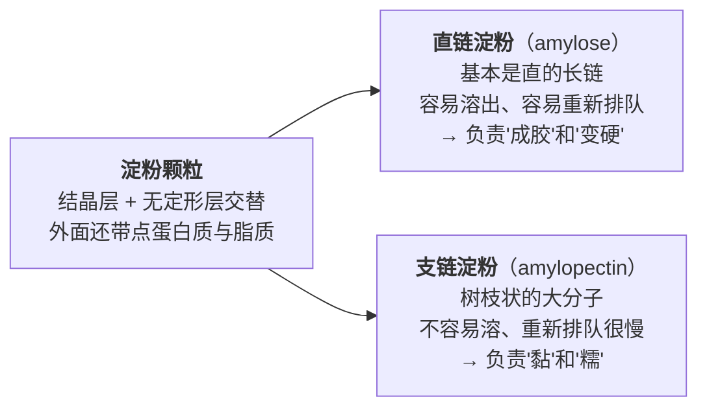
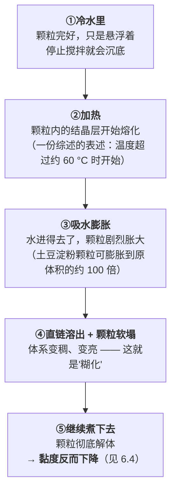
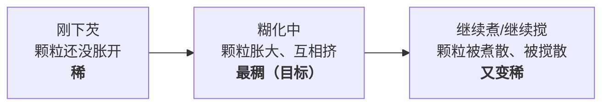

# 第 6 章 淀粉：糊化与回生

> **本章目标**：把四件看起来毫不相干的事——**勾芡、米饭、面条、土豆**——
> 收敛成同一个过程：**淀粉颗粒吸水、膨胀、崩解，然后（放凉之后）又慢慢排回去**。
>
> 学完这一章，你会知道：芡为什么会结块、为什么久煮反而会变稀、
> 米饭为什么会夹生、冷饭为什么变硬又为什么特别适合做炒饭。
> 这些问题的答案是**同一条曲线上的不同位置**。

## 6.1 淀粉颗粒：一个"会吸水的小包裹"

淀粉不是粉末状的糖，它在植物里是一颗一颗的**颗粒**。

| 事实 | 数字 | 厨房里的意思 |
|------|------|------------|
| 颗粒大小 | 从 **1 μm 到 100 μm 以上**，由植物种类决定（例如同一项研究里，大米淀粉中位粒径约 9 μm、木薯淀粉约 15 μm） | 所以"淀粉"不是一种东西：玉米、土豆、木薯、红薯、小麦的行为都不一样 |
| 组成 | 两种分子：**直链淀粉**[^1]和**支链淀粉**[^2]。普通淀粉颗粒含 **15%~30% 直链**，**糯性（waxy）淀粉不到 1%** | 糯米、糯玉米之所以黏，是因为几乎全是支链 |
| 还有别的 | 颗粒里还包着**少量蛋白质和脂质**，不同植物、不同品种含量差别很大 | 这一条看起来无关紧要，但它是**勾芡会结块**的直接原因（见 6.4） |

> **一句话记住这两个分子**：
> **直链负责"凝"，支链负责"黏"。**
> 一份淀粉里它们的比例，基本决定了这份淀粉煮出来是**能切开的冻**还是**扯不断的黏**。

## 6.2 糊化：需要水，也需要温度，缺一不可

天然淀粉**不溶于冷水**。要让它起作用，必须同时给两样东西：**水**和**热**。

**"糊化温度"不是一个数字，是一段区间，而且会移动**。本书能交叉到的两条：

| 来源 | 说法 |
|------|------|
| 一篇分子美食学综述（*Chemical Reviews*，2010） | 淀粉颗粒受热时，有序的"结晶"层**在温度超过约 60 °C 时开始熔化**；实际熔化温度取决于直链/支链比例与分子堆积方式 |
| 一本食品化学教材（经二手转引，⚠️ 待核到一手） | 未改性的天然淀粉，**有的从约 55 °C 开始膨胀，有的要到约 85 °C**；糊化温度取决于植物种类、含水量、pH、盐/糖/脂/蛋白浓度 |

> **两条来源对"起点"的量级是一致的（55~60 °C 上下），但对"终点"分歧很大。**
> 所以本书**不给"淀粉在 x °C 糊化"这种单点数字**，只给三条可用的规律：
>
> 1. **它明显低于水的沸点**——所以"煮开了"通常不是糊化的瓶颈；
> 2. **它随植物种类大幅漂移**——换一种淀粉，参数要重调；
> 3. **它随含水量下降而升高**——这一条最反直觉，下一节专门讲。

### 水不够，温度再高也糊化不了

同一篇综述里有一句非常有用的话：

> **结晶区的熔化温度，随含水量下降而升高。**

翻成厨房语言：

| 现象 | 解释 |
|------|------|
| **米饭夹生** | 中心的水不够（水放少了 / 米没泡透 / 火太急水先跑光了），那部分淀粉的糊化"门槛"被抬高了，于是没熟透 |
| **面条中间有白芯** | 同理：水还没渗到中心，中心就没有足够的水去糊化 |
| **烤箱里的淀粉不会"煮烂"** | 干热环境下水一直在往外跑，表面的淀粉不是糊化，而是**变干、变玻璃态**——这就是脆皮的来源（见第 7 章） |
| **炒饭能"粒粒分明"** | 因为炒的过程一直在**赶水**，不给淀粉继续糊化的条件 |

> **这是"水"这条线在淀粉上的表现**：
> **第 3 章说"有水就上不了 100 °C 以上"，这一章要加一句——"没水就糊化不了"。**
> 水在这两件事上的作用刚好相反，而一道菜里两件事经常同时发生。

## 6.3 糊化之后：它先变稠，然后会变稀

这是很多人没意识到的一段——**黏度是先升后降的**。

综述里的表述很直白：

> 勾芡（用面粉或玉米淀粉给酱汁增稠）是让淀粉颗粒糊化到**一个最佳的膨胀状态**；
> **煮过头会让颗粒彻底解体**，把直链和支链都释放到溶液里，
> 结果是"**酱汁被不希望地变稀了**"。

> **所以"芡澥了"往往不是你放少了，而是你煮久了、搅狠了。**
> 补救的正确动作不是"再加一次淀粉"（那只会让味道发糊、口感发粉），
> 而是**下次把勾芡放到最后、下了芡就别久煮**。

## 6.4 勾芡的四件事：结块、酸、糖、脂

### ① 为什么水淀粉一定要先用冷水化开

综述给出的机理很具体，而且和"淀粉本身"无关，是**颗粒外面那层蛋白质**干的：

> 冷水加到淀粉里时，水**几乎进不去**直链与支链，但**会被颗粒表面的蛋白质吸走**。
> 如果颗粒外围的蛋白质足够多、吸够了水，**它们会把颗粒粘在一起**；
> 一旦一大团颗粒被粘成块，**处在团块中心的颗粒就再也胀不开了**——
> 这就是酱汁里"**疙瘩**"的由来。

> **可迁移的操作结论**：
> **疙瘩是"外层先粘住、内层进不去"的结果，所以对策全是"让颗粒先彼此分开"**：
> ① 先用**冷水**把淀粉充分搅散（热水会立刻在表面糊化，封住内部）；
> ② 下锅前**再搅一次**（淀粉早就沉底了）；
> ③ **边倒边搅**，不要一次倒成一坨；
> ④ 面粉类（含蛋白质更多）比纯淀粉更容易结块——所以西餐用**油面糊**（先用油把面粉颗粒分开）来解决同一个问题。

### ② 酸：会让芡变稀

一项以"水果派馅"为模型的研究（6% 淀粉、35% 蔗糖、用柠檬酸缓冲到 pH 约 3）给出了两件事：

| 加了什么 | 对糊化温度 | 对最终黏度 |
|---------|-----------|-----------|
| **酸**（pH 约 3） | 该研究**没有**观察到柠檬酸降低糊化温度 | **下降**：酸会优先水解颗粒里的无定形区，把长链切短，峰值黏度与最终黏度都降低（该文并转引了两项在 pH 约 3 下峰值/最终黏度下降的研究） |
| **糖**（35% 蔗糖） | **峰值糊化温度升高约 11~12 °C**（作者判断主要是蔗糖造成的） | 糖抢水、并与淀粉形成氢键，限制颗粒膨胀 |

> **厨房结论**：
> - **糖醋类、番茄类、加醋加柠檬的菜，同样的淀粉量会更稀**——要么多放一点淀粉，要么**把酸放在勾芡之后**；
> - **糖浆、蜜汁、含糖量很高的酱汁，淀粉需要更高的温度才会稠**——别看它不稠就一直加淀粉，先让温度到位。

### ③ 脂：既推迟糊化，也推迟变硬

另一篇综述转引的结论：

> 淀粉中的**脂质会提高糊化温度、延缓颗粒膨胀、并阻止直链淀粉溶出**；
> 而形成的**直链—脂质复合物又会延缓回生**。

> 这一条同时解释了两个厨房现象：
> **①米饭里加一点油会更松散**（直链溶出减少，米粒不容易黏在一起）；
> **②加了油脂的米饭 / 面点，放凉后没那么快变硬**（回生被延缓）。
> ⚠️ 但这是**机理方向**：本书**没有核到**"家庭里加多少油、能延缓多久"的定量数据，
> 所以不要把它当成配方。

### ④ 一张勾芡排查表

| 现象 | 最可能的原因 | 下次怎么改 |
|------|------------|-----------|
| 有疙瘩 | 淀粉没在冷水里分散好，或直接撒了干粉 | 冷水化开、下锅前再搅、边倒边搅 |
| 一开始稠、越煮越稀 | 煮过头/搅过头，颗粒解体 | 勾芡放最后，下芡后只留很短时间 |
| 怎么都不稠 | ①锅里温度不够（没到糊化区间）②酸太多 ③糖太多 ④淀粉量真的不够 | 先确认在冒泡；把醋/柠檬挪到芡之后；含糖高时给更高温度 |
| 稠但发暗、发糊 | 淀粉过量，或反复补芡 | 少量多次，每次等它起效再判断 |
| 放凉后凝成一块 | 直链重新排队成胶（6.5） | 正常现象；要"凉了也能倒"就选支链为主的淀粉（如糯性/木薯类） |

## 6.5 回生：放凉之后，它会慢慢排回去

**糊化不是终点**。把糊化过的淀粉放凉，那些散开的分子会**慢慢重新排列成有序结构**，
并把水**挤出来**。这个过程叫**回生**[^3]（retrogradation），面包行业里叫**老化 / 发陈**（staling）。

综述里列出的回生后果，几乎每一条都能在厨房里看到：

| 文献列出的后果 | 厨房里叫它 |
|--------------|-----------|
| 黏度上升、变得不透明、浑浊 | 芡放凉后"发死"、汤变糊 |
| 热糊表面结出不溶的"皮" | 粥/糊表面那层皮 |
| 形成凝胶 | 凉粉、肉皮冻式的"能切" |
| **析水**（syneresis） | 隔夜的芡汁、冻过的粥出一汪水 |
| 变硬、口感变干 | 冷饭发硬、馒头发柴、面包发干 |

### 两个分子的速度完全不同

| 分子 | 重新排队需要的时间 |
|------|-----------------|
| **直链淀粉** | **几分钟到几小时** |
| **支链淀粉** | **几小时到几天** |

> **这条时间差解释了面包的一生**（综述的原话大意）：
> 刚出炉的面包心是"面糊感"的，**冷却过程中直链淀粉部分结晶**，
> 才形成新鲜面包该有的口感；**继续放下去，支链淀粉也开始结晶，面包就"陈"了**。
>
> 而更反直觉的一句是：
> **陈面包给人"又干又硬"的感觉，但这不一定意味着它失去了水分。**
> **"硬"来自分子重新排队，不一定来自"水跑了"。**
> ——所以"用袋子密封就不会变硬"这种做法，解决的是另一个问题。

### 冷藏会加快回生

一项研究把煮好的米饭分别存在 4 °C、−20 °C、−40 °C、−80 °C，观察到：

- 冷藏储存期间，米饭内部形成**蜂窝状的多孔结构**——那是**水被排出来**的证据；
- **直链的重结晶快、支链的重结晶慢**，所以前 12 小时的变化主要由直链贡献；
- 作者引用的解释是：**温度更低有利于成核与晶体生长，所以低温会让回生更快发生**；
- 存得越久，**抗性淀粉**[^4]（消化酶不易分解的那部分）越多。

> ⚠️ **两点必须说清楚**：
> ① 这项研究比较的是 4 °C 与更低的冷冻温度，**不是"冷藏 vs 室温"的对照**；
> 本书**没有核到**家庭条件下"冷藏比室温快多少"的定量数据，
> 所以"面包别放冰箱"这条流传很广的建议，本书只能标**方向合理、定量未核**。
> ② **抗性淀粉增加是消化层面的现象，本书不做任何营养或健康建议**（本书纪律）。
> 它在这里只是"回生确实发生了"的一个客观指标。

### 回生能不能逆转？

**部分能**——这是"冷饭上锅一蒸又软了""隔夜面包烤一下又还行"的依据。
机制上讲得通：回生形成的晶体是靠热熔化掉的。

> ⚠️ 但本书**没有核到**一手的定量对照（复热能恢复到几成、恢复后放凉是不是回生更快），
> 所以这一条标为**机制推理 + 家庭惯例**，不写死。
> 可以确认的相邻事实只有：综述提到回生后的凝胶会变得**更致密、更耐热**。

## 6.6 同一个过程，四种应用

| 你在做 | 你想要淀粉停在哪一步 | 主要变量 | 最常见的失败 |
|--------|------------------|---------|------------|
| **勾芡** | 停在"最大膨胀"那一刻 | 分散、温度、时间、酸与糖 | 结块 / 煮过头变稀 |
| **米饭** | 完全糊化，但不过度 | **水量**与**时间**（保证中心有水） | 夹生（中心水不够）/ 太烂（水多+搅动） |
| **面条** | 中心刚刚糊化 | 水量要大、水要滚、时间要准 | 白芯 / 坨掉（捞出后直链继续排队） |
| **土豆** | 让细胞里的淀粉吸饱水、细胞彼此分开 | 温度与时间 | 外烂内生（块太大）/ 捣成"胶"（过度搅拌把细胞捣破、直链释放） |

> **面条要补一句**：面里除了淀粉还有**面筋蛋白**，它是另一套系统（属于第 4 章蛋白质那条线，
> 第 22 章会专门讲）。**"面条筋道"主要是面筋的功劳，"面条坨掉"主要是淀粉的责任**——
> 这两件事经常被混在一起讨论。

> **土豆也要补一句**：一篇关于低温慢煮蔬菜的综述指出，
> **含淀粉的蔬菜通常要用比一般蔬菜更低的温度（低于约 80 °C）处理，以避开糊化带来的质地变化**，
> 而一般（非淀粉类）蔬菜的推荐区间更高（该文转引的建议是约 82~85 °C）。
> 这说明：**土豆的"好吃点"和青菜的"好吃点"，本来就不在同一个温度上**。

## 6.7 本章的可迁移规则：淀粉只有三个状态

> ## 看到任何"粉的、糊的、黏的"东西，先问它现在在哪个状态：
>
> | 状态 | 它是什么 | 你能做什么 |
> |------|---------|-----------|
> | **①生的（没糊化）** | 颗粒完好，冷水里泡不开 | 需要**水 + 热**。水不够就永远到不了下一步 |
> | **②糊化了** | 吸水膨胀、变稠变亮 | **这是你要的口感**。继续加热只会让它变稀 |
> | **③回生中** | 放凉后分子重新排队、排水 | 变硬、析水、返砂。**复热可部分挽回；选支链为主的淀粉可以推迟** |
>
> **然后按这三个问题定操作**：
>
> 1. **中心有水吗？** —— 没有就先解决水（多加水、泡一泡、切小一点）；
> 2. **温度到了吗、还是已经过了？** —— 不稠先看温度，太稀先看是不是煮久了；
> 3. **它是要马上吃，还是要放凉/隔夜？** —— 要放凉的，选糯性/木薯类淀粉，或加一点油脂。

## 6.8 常见说法辨析

按本书约定标注**证据强度**：✅ 有共识 / ⚠️ 有争议 / ❌ 明确错误 / 缺乏证据。
来源见[出处登记](../../standards.md)。

| 说法 | 判定 | 说明 |
|------|------|------|
| "淀粉要用冷水化开" | ✅ **有共识，且机理明确** | 综述指出：冷水几乎进不了直链与支链，但会被**颗粒表面的蛋白质**吸走；蛋白质吸饱水后**把颗粒粘成团**，团块中心的颗粒再也胀不开——这正是疙瘩的成因。用冷水的目的是**先把颗粒彼此分开** |
| "芡不够稠就再加淀粉" | ⚠️ **经常是误判** | 不稠有四种原因：温度没到、酸太多、糖太多、淀粉确实少。**其中三种加淀粉都解决不了**，反而会发糊发粉。先确认锅里在冒泡，再判断 |
| "勾芡要早点下，让它煮透" | ❌ **方向反了** | 综述明确：煮过头会让颗粒**彻底解体**，直链与支链释放到溶液里，酱汁**被不希望地变稀**。勾芡是最后一步 |
| "糖醋菜的芡特别难勾" | ✅ **有支持** | 同一体系里 35% 蔗糖使峰值糊化温度**升高约 11~12 °C**；而 pH 约 3 的酸会水解淀粉、**降低峰值与最终黏度**。糖和酸各从一边削弱勾芡 |
| "隔夜饭更适合做炒饭" | ⚠️ **方向有支持，但常被解释错** | 有支持的部分：冷藏中米饭发生回生，**水被排出、结构变得多孔**，米粒更硬、更不易黏连。常被说错的部分：这不是"水分蒸发掉了"那么简单——综述明确指出，陈化带来的"干硬"**不一定意味着失水**。⚠️ 本书**没有核到**"隔夜饭 vs 现煮饭"炒制效果的对照实验 |
| "面包放冰箱能保鲜" | ⚠️ **至少在口感上方向相反** | 可确认的是：低温有利于成核与晶体生长，**回生在低温下更容易发生**；冷藏的主要收益是抑制霉变，代价是变硬更快。⚠️ 本书**未核到**家庭条件下"冷藏 vs 室温"的定量对照，故只标方向 |
| "冷饭变硬是因为水跑掉了" | ❌ **主要机制不是失水** | 综述的表述很明确：陈化的面包**给人又干又硬的感觉，尽管这不一定意味着水分的损失**。硬来自**分子重新排队**（回生），而回生还会把水**挤出来**（析水）——水常常还在那儿，只是不在原来的位置 |
| "糯米/糯玉米黏，是因为淀粉多" | ❌ **是成分不同，不是含量不同** | 普通淀粉含 15%~30% 直链淀粉，**糯性淀粉不到 1%**。**支链负责黏、直链负责凝**——所以糯性的东西黏而不易返硬，普通淀粉的东西放凉容易变硬 |
| "米饭夹生是火不够大" | ❌ **通常是水不够** | 结晶区的熔化温度**随含水量下降而升高**：中心没有足够的水，那部分淀粉的糊化门槛就被抬高了。加大火只会让锅底的水跑得更快，**让情况更糟**。正确动作是补水 + 小火焖 |
| "土豆泥越搅越细腻" | ❌ **会变成"胶"** | 过度机械搅打会把细胞捣破、把直链淀粉释放出来，结果是发黏拉丝。综述在讨论土豆时也强调，土豆泥是"**打破主要结构让淀粉分子吸收液体**"的过程——**打破到什么程度是可以选择的**，不是越碎越好 |
| "抗性淀粉多的冷饭更健康" | **不在本书范围** | 可确认的只有物理层面：冷藏储存使煮熟米饭的抗性淀粉比例上升。**任何健康/减重/血糖相关的推论，本书不做**（本书纪律：不做医疗与营养治疗建议） |

## 6.9 🔎 下次做菜时的用处

1. **勾芡永远是最后一步**：下芡 → 翻匀 → 出锅。下完芡再炖两分钟，等于在拆自己的芡。
2. **水淀粉下锅前一定再搅一次**——它在碗里早就沉底了，你倒进去的很可能是清水。
3. **糖醋菜、番茄菜，把醋/柠檬留到勾芡之后**；糖多的酱汁别急着补粉，先让温度上去。
4. **米饭夹生时加水，不是加火**。补两勺热水，盖盖小火焖，比开大火有用得多。
5. **要"粒粒分明"就一路赶水**（隔夜饭、摊开吹凉、锅别太满）；
   要"绵软"就反着来（水足、焖透、别摊开）。
6. **土豆泥用压的，不要用打的**；打成拉丝就回不来了。
7. **要凉着吃的芡汁、勾了要过夜的菜**，优先用糯性/木薯类淀粉，或者干脆**别勾芡**——
   靠收汁（第 3 章）来挂味。

## 6.10 思考题

1. 直链淀粉和支链淀粉在厨房里各负责什么？为什么说"糯米黏是成分问题不是含量问题"？
2. 为什么"水淀粉必须用冷水化开"？请用**颗粒表面的蛋白质**这条机理说明，
   并解释为什么面粉比纯淀粉更容易结块。
3. 本章说黏度是"先升后降"的。请画出（或用文字描述）勾芡过程中黏度随时间的变化，
   并标出"目标点"在哪里、过了会怎样。
4. 为什么"米饭夹生"通常是水的问题而不是火的问题？请用"熔化温度随含水量下降而升高"来解释。
5. **【案例】** 你要做一道糖醋里脊，菜谱写着："调糖醋汁（糖、醋、番茄酱、水淀粉混合），
   炸好里脊后倒入糖醋汁，**大火烧开后转中火熬 3 分钟收浓**，再放回里脊翻匀。"
   请回答：（a）这份菜谱里有**两处**会让芡变稀的因素，分别是什么？
   （b）"熬 3 分钟"这一步有什么风险？（c）你会怎么改这三步的顺序？
   （d）如果改完还是不够稠，你按什么顺序排查？
6. **【案例】** 你煮了一锅粥，放凉后表面结了一层皮，第二天从冰箱拿出来发现碗边有一圈水，
   粥体变硬。请解释这三个现象分别对应本章的哪个过程，并说明"再加热"能解决其中哪些、
   不能解决哪些。
7. **【辨析】** "冷饭变硬是因为水分蒸发掉了"——判断证据强度，
   说明文献是怎么表述的，并设计一个你在家就能做的验证方法。
8. **【辨析】** "面包放冰箱能保鲜"——判断证据强度。
   请分别说明它在**微生物**层面和**口感**层面各意味着什么，
   并指出本书为什么只给"方向"不给"数字"。
9. 第 3 章说"有自由水的地方温度上不去"，本章说"没有水就糊化不了"。
   请举一个**同一道菜里这两条同时起作用**的例子，并说明厨师是靠什么顺序来兼顾它们的。

> 📖 **参考答案**（想清楚再看）：[Q1](../../qa/06-starch-qa.md#q1) ·
> [Q2](../../qa/06-starch-qa.md#q2) · [Q3](../../qa/06-starch-qa.md#q3) ·
> [Q4](../../qa/06-starch-qa.md#q4) · [Q5](../../qa/06-starch-qa.md#q5) ·
> [Q6](../../qa/06-starch-qa.md#q6) · [Q7](../../qa/06-starch-qa.md#q7) ·
> [Q8](../../qa/06-starch-qa.md#q8) · [Q9](../../qa/06-starch-qa.md#q9)

## 6.11 本章实操

### 🅐 零成本版 · 任务一：把厨房里的淀粉列一张"身份表"

不用开火。把家里有的所有"粉"翻出来，填下表。**先自己判断，再看包装**。

| 我家有的粉 | 我猜它来自什么植物 | 我猜它偏直链还是偏支链 | 它现在被我用来做什么 | 更适合做什么 |
|-----------|----------------|------------------|-----------------|------------|
| | | | | |
| | | | | |
| | | | | |

> 判断线索：**煮出来放凉会不会变硬/返砂**（偏直链）、
> **煮出来是不是透亮拉丝**（偏支链）、**是不是标着"糯"**。
> 这张表做一次，以后"勾芡该用哪种粉"就不用搜了。

### 🅐 零成本版 · 任务二：找一份菜谱，标出"淀粉的三个状态"

拿任意一份带勾芡的菜谱（或一份煮饭/煮面的说明），逐行标注。

| 菜谱里的这一行 | 淀粉此刻处于哪个状态（生 / 糊化 / 回生） | 这一步的目的 | 能不能省 |
|--------------|--------------------------------|------------|---------|
| | | | |
| | | | |
| | | | |

然后回答：

| 问题 | 你的答案 |
|------|---------|
| 这份菜谱把勾芡放在第几步？它后面还有几步？ | |
| 如果照它做，芡有没有被"煮过头"的风险？ | |
| 这道菜是趁热吃还是会放凉？这会影响选哪种淀粉吗？ | |

### 🅑 开火版 · 任务三：一碗水，四杯芡（有灶台时做）

**需要**：玉米淀粉（或土豆/红薯淀粉）、白糖、白醋、四个小碗、一口小锅、计时器。

**做法**：每组都用**同样多的水和同样多的淀粉**（例如 200 mL 水 + 一小勺淀粉），
只改一个变量，煮到同样的状态后倒进碗里对比。

| 组 | 变量 | 我看到的稠度 | 透明度 | 放凉 30 分钟后 | 第二天 |
|----|------|-----------|-------|------------|-------|
| ① 对照 | 只有水 + 淀粉 | | | | |
| ② 加糖 | 加两大勺糖 | | | | |
| ③ 加酸 | 加两大勺醋 | | | | |
| ④ 久煮 | 和①相同，但**多煮 5 分钟并持续搅** | | | | |

做完回答：

1. ②和③分别比①稠还是稀？这和本章说的机理对得上吗？
2. ④和①相比怎么样？这说明"煮透一点更稳妥"这个直觉对不对？
3. 放凉后哪一组变硬/析水最明显？你会把这种淀粉用在热菜还是凉菜上？

### 🅑 开火版 · 任务四：同一锅米，两种水量

**需要**：同一种米两份（等量）、两口锅（或分两次）、量杯、计时器。

**唯一变量**：水量（例如一份按平时的量，一份少两成）。火力、时间、焖的时间都保持一致。

| 组 | 水量 | 出锅时中心有没有硬芯 | 口感 | 放凉 2 小时后的硬度 | 第二天冷藏后的硬度 |
|----|------|----------------|------|---------------|---------------|
| ① 正常水量 | | | | | |
| ② 少两成水 | | | | | |

做完回答：

1. 少水那组是"硬"还是"夹生"？这两者的区别是什么？
2. 如果中途发现②夹生了，你会加水还是加火？为什么？
3. 两组放凉后谁更硬？如果明天要炒饭，你会选哪一组？为什么？

> ⚠️ **安全提醒**：煮好的米饭属于易腐食品。按美国 FDA 的指引，
> 熟食应在**烹调后 2 小时内**冷藏（环境温度高于 90 °F 时缩短到 1 小时），
> 冰箱温度 ≤40 °F（约 4 °C）。**各国口径不同，以自己所在地现行发布为准。**
> 做"隔夜饭"实验时，请**煮好尽快摊开降温并冷藏**，不要在室温下放一夜。

## 6.12 本章依据

本章引用的来源与核对状态详见[参考书目与出处登记](../../standards.md)，具体对应如下：

| 本章用到的内容 | 依据 |
|--------------|------|
| 淀粉颗粒结构与其中的蛋白质；冷水被表面蛋白质吸收并把颗粒粘成团（结块机理）；结晶层在温度超过约 60 °C 时开始熔化；**熔化温度随含水量下降而升高**；土豆淀粉颗粒可膨胀到原体积约 100 倍；勾芡是"糊化到最佳膨胀状态"，**煮过头颗粒解体导致酱汁变稀**；冷却成胶；回生是支链淀粉重结晶、凝胶排水并变得更致密更耐热；面包冷却时直链部分结晶形成新鲜口感、继续储存则支链结晶而"陈"；**陈化的干硬不一定意味着失水**；干淀粉的玻璃化转变温度高于 200 °C | 一篇关于分子美食学的综述，*Chemical Reviews*，2010（PMC2855180；doi:10.1021/cr900105w），✅ 开放获取全文 |
| 普通淀粉含 15%~30% 直链、糯性淀粉不到 1%；颗粒粒径 1 μm 到 100 μm 以上（大米约 9 μm、木薯约 15 μm）；**35% 蔗糖使峰值糊化温度升高约 11~12 °C**（作者判断主要由蔗糖造成）；pH 约 3 时酸优先水解无定形区、降低峰值与最终黏度（并转引两项同向研究）；该研究**未**观察到柠檬酸降低糊化温度 | 一项关于糖—酸体系中淀粉糊/凝胶糊化与流变性质的研究，*Foods*，2022（PMC9778545；doi:10.3390/foods11244060），✅ 开放获取全文 |
| 天然淀粉不溶于冷水；**直链淀粉在几分钟到几小时内结晶、支链淀粉需要几小时到几天**；回生的后果清单（黏度上升、不透明、结皮、析水、成胶、变硬）；脂质**提高糊化温度、延缓膨胀、阻止直链溶出**，直链—脂质复合物**延缓回生**；糊化与糊化后"pasting"难以分开 | 一篇关于淀粉特性与无麸质产品的综述，*Foods*，2017（PMC5409317；doi:10.3390/foods6040029），✅ 开放获取全文（该文多处结论为转引，本书已注明为"综述转引"） |
| 煮熟米饭在 4 °C 与冷冻条件下储存：形成多孔的蜂窝结构（水被排出）、直链重结晶快而支链慢、抗性淀粉随储存上升；**低温有利于成核与晶体生长，因而回生更快** | 一项关于低温储存对熟米饭微观结构、消化性与吸附能力影响的研究，*Foods*，2022（PMC9180724；doi:10.3390/foods11111642），✅ 开放获取全文。⚠️ 该研究比较的是 4 °C 与更低的冷冻温度，**不包含"室温对照"** |
| 未改性天然淀粉"有的从约 55 °C 开始膨胀、有的到约 85 °C"；糊化温度取决于种类、含水量、pH、盐/糖/脂/蛋白 | Belitz、Grosch、Schieberle《Food Chemistry》第 3 版，第 318~323 页，⚠️ **二手转引，待核到一手**。本章只用它与上一条**交叉印证"起点在 55~60 °C 量级"**，不单独用它写数字 |
| 含淀粉的蔬菜宜用低于约 80 °C 处理以避开糊化带来的质地变化；非淀粉类蔬菜的推荐区间约 82~85 °C（转引 Baldwin） | 一篇关于低温慢煮对蔬菜品质影响的综述，*Foods*，2026（PMC12840460），✅ 开放获取全文 |
| 熟食 2 小时内冷藏（室外高于 90 °F 时 1 小时）、冰箱 ≤40 °F | 美国 FDA「Safe Food Handling」，✅。⚠️ 各国口径不同 |
| "隔夜饭 vs 现煮饭"炒制效果的对照；家庭条件下"冷藏 vs 室温"的回生速度差；复热能把回生逆转多少；加油延缓回生的定量 | ⚠️ **均未核到**一手数据，本章只写方向并标注为机制推理 / 家庭惯例 |

[^1]: [直链淀粉](../../glossary.md#amylose)（amylose）。
[^2]: [支链淀粉](../../glossary.md#amylopectin)（amylopectin）。
[^3]: [回生 / 老化](../../glossary.md#retrogradation)（retrogradation / staling）。
[^4]: [抗性淀粉](../../glossary.md#resistant-starch)（resistant starch, RS）。

---

**下一章**：第 7 章 褐变——美拉德反应与焦糖化。
淀粉这一章讲的是"水进去"，下一章讲的是"水必须先出来"：
**香味不是食材自带的，是被造出来的**——而造它的第一个条件，是把表面弄干。
