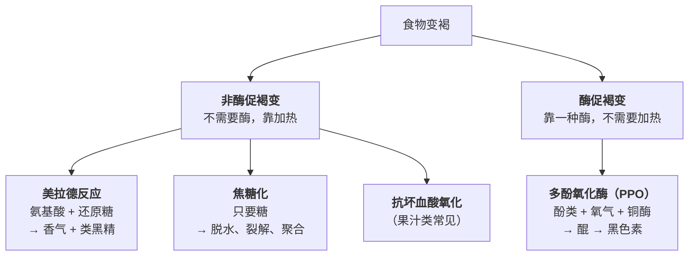
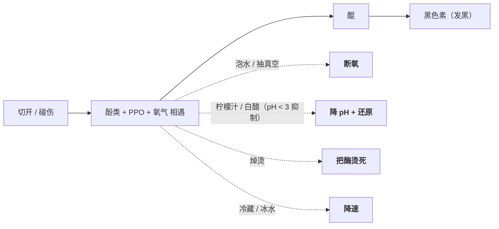

# 第 7 章 褐变：美拉德反应与焦糖化

> **本章目标**：讲清楚一件事——**香味大部分不是食材自带的，是被"造"出来的**。
> 而造它的条件很苛刻：**表面必须先干，温度必须真的上去，而你家的灶可能不够。**
>
> 学完这一章，你会知道：为什么肉要擦干才下锅、为什么一次别炒太多、
> 为什么"加了水就再也上不了色"、以及为什么苹果切开会变黑——
> **最后这一件和前面几件不是同一个反应**，这正是本章要先分清楚的。

## 7.1 先分家：厨房里有三种"变褐"，机理完全不同

很多混乱来自把三件事叫成同一个名字。一篇关于控制酶促褐变的综述把它们分成两大类：



| | 非酶促（美拉德 / 焦糖化） | 酶促（PPO） |
|---|---|---|
| 什么时候发生 | **加热**时 | **切开、碰伤之后**，室温就发生 |
| 需要什么 | 高温 + 干燥表面 | 酚类 + **氧气** + 活的酶 |
| 你想要它吗 | **通常想要**（香、色、味） | **通常不想要**（苹果、土豆、藕、香蕉发黑） |
| 怎么加强 | 弄干表面、给足功率 | —— |
| 怎么阻止 | 保持湿、降低温度 | 隔氧 / 降温 / 加酸 / **焯水把酶烫死** |

> **诚实说明**：综述也指出，真实食物里这些反应**通常是混在一起发生的**，
> 不是各自独立。分家是为了让你**知道该动哪个旋钮**，不是说它们真的互不干扰。

## 7.2 美拉德反应：它到底是什么

**美拉德反应**[^1]是**氨基酸（或蛋白质上的氨基）与还原糖**之间的一大类反应，
1912 年由 Louis Maillard 首次描述。它不是"一个反应"，而是一张反应网络，
最终产物包括**大量挥发性香气分子**和**褐色的类黑精**[^2]。

一篇综述转引的经典分期表，说明了一件对厨房很重要的事——**香和色不是同时出现的**：

| 阶段 | 产生颜色 | 产生风味 |
|------|---------|---------|
| 初期 | 几乎没有 | 几乎没有 |
| 中期 | 开始 | **明显** |
| 末期 | **最强** | 强 |

> **可迁移的结论**：**"看起来还没多黄"不代表"还没出味"。**
> 风味在颜色明显之前就已经开始产生了；而等到颜色最深的时候，你也很接近"焦"了。
> 所以**判断上色不要只看颜色，要同时闻**。

### 影响它的四个旋钮

综述列出的影响因素是：**温度—时间的组合、含水量、pH、以及前体（氨基与羰基化合物）的种类**。
其中对家庭厨房最有用的一句话是：

> **这个反应往往在产品的表面最剧烈，因为那里的含水量在局部下降、前体浓度被浓缩。**

这句话就是整章的核心，它值得单独拆开讲。

## 7.3 为什么"表面必须先干"

第 3 章已经给过一半答案：**只要还有自由水在蒸发，那一层的温度就上不去**。
本章把它补完。

**证据一（建模 + 实测）**：一项汉堡煎制的有限元建模与实验研究（第 2、3 章已引用）测到：
锅面设定 **215 °C** 时，**距接触面 2 mm 处的温度接近 100 °C 但不超过**，
脱水区厚度**不到 2 mm**；作者的解释是——**下方蒸发区的潜热需求给向内的热流设了一个强上限**。

**证据二（独立来源）**：分子美食学综述在讲煎炸时的表述是——
**"就在壳的下面，由于水的蒸发，温度预计接近 100 °C"**，
因此在壳上形成了一个**很大的温度梯度**；
而**壳表面的温度与油温相当**，"**如果壳里的温度足够高，褐变反应就能以可观的速率进行**"。

> **两个独立来源指向同一幅图景**：
>
> ```mermaid
> flowchart TD
>     P["<b>锅面 / 油</b><br/>典型浅煎表面温度约 200~240 °C"] --> CR["<b>干壳</b>（不到 2 mm 厚）<br/>温度接近锅面 → <b>褐变在这里发生</b>"]
>     CR --> EV["<b>蒸发区</b><br/>温度被钉在 100 °C 附近<br/>（水在这里变成蒸汽）"]
>     EV --> IN["<b>内部</b><br/>靠导热慢慢升温<br/>牛排煎到中心 40~60 °C 时结束<br/>（3 cm 厚的牛排约 5~12 分钟）"]
> ```
>
> **所以"擦干肉表面"不是仪式，是在缩短第一步**：
> 表面越湿，越多的能量要先拿去蒸发水，**干壳就越晚形成，褐变开始得越晚**。

### ⚠️ 关于"美拉德从 140~165 °C 开始"这个数字

本书**不写这个数字**。理由在第 1 章和[出处登记](../../standards.md)里已经写过：
它在二手资料里到处流传，但本次查证**没有找到给出该区间的一手实验出处**。

**本书能负责任地说的是**：

| 能说的 | 不能说的 |
|-------|---------|
| 温度越高，反应越快 | "从 x °C 开始" |
| 在厨房的时间尺度里，要看到明显褐变，需要一个**高于水沸点的、干燥的表面** | 一个精确的起始温度 |
| 综述提到：在**玻璃化转变温度以下**，小分子迁移受限，褐变速率普遍很低 | 把这个温度换算成"烤箱开多少度" |

> 顺带说一句反例：本书查证时读到一篇关于起泡酒陈年的综述，指出这类反应
> **在约 10~15 °C、pH 2.9~3.2 的条件下也在进行**——只是慢得多。
> **所以"美拉德需要高温"准确的说法是"需要高温才快到你能在一顿饭的时间里看见"。**

## 7.4 你家的灶能一次上色多少：一个可以算的限制

这是本章最有实用价值、也最少被提起的一段。分子美食学综述给出的推理链是：

1. 煎的时候，肉在持续**释放水**（蛋白质变性之后，见第 4 章）；
2. 要让表面温度**保持在 100 °C 以上**，灶的功率就必须**大于蒸发这些水所需的功率**；
3. 功率不够时，表面温度会**停在 100 °C 附近**——"结果是褐变更少、风味形成也不同"。

然后是那组很有厨房杀伤力的数字：

| | 典型功率 | 一次能褐变的肉量（该综述给出的量级） |
|---|---------|--------------------------------|
| **家用灶** | 通常**最高约 2.5 kW** | 约 **800 g** |
| **餐馆灶** | 常可达 **8 kW** | 约 **2.5 kg** |

综述还特地点出一个后果：

> **一份"做四人份很成功"的菜谱，放大到八人份可能完全失败**——
> 因为肉一多，锅的温度就上不了 100 °C 以上。

同样的逻辑在炸的时候也成立：

> **一次下太多，油温会降到 100 °C 以下，食物就"脆"不起来。**

> ## 本章最实用的一条规则
>
> **上色是一场"你的功率" vs "食材出水速度"的比赛。**
> 你只有三种办法赢：
>
> 1. **减少要蒸发的水**——擦干表面、别腌得太湿、食材先沥水；
> 2. **减少同时要处理的量**——分批下锅（这是最有效、也最被忽略的一条）；
> 3. **增加功率或蓄热**——锅先烧够热、用厚重的锅（蓄热更多）、别频繁翻动。

### 一个反直觉的推论：炒锅表面其实没那么热

同一篇综述在讲爆炒时写道：

> 在炒锅里（或任何持续搅动的过程中），**接触锅面的那一面会短暂受热，
> 而背向锅面的那一面又会因为水分蒸发迅速冷却**；
> 因此**爆炒过程中食材的平均表面温度其实相当低（低于 100 °C）**，
> 热量向内传导反而是缓慢而温和的。

> **这解释了两件一直被误解的事**：
> ① **炒青菜的"锅气"不等于青菜表面一直在 200 °C**——它是短促的高温接触 + 强烈脱水的组合；
> ② **炒蔬菜之所以能保持脆**，正是因为中心温度其实不高，
> 细胞壁多糖的转化比水煮少（这一点第 20 章会展开）。
> 综述也点明了代价：**蔬菜在这个过程中经历了剧烈的脱水**。

## 7.5 焦糖化：只有糖也能变褐

**焦糖化**[^3]不需要氨基酸，只要糖。综述的表述是：

> 糖的焦糖化同样产生褐变与挥发性风味物质，涉及烯醇化、脱水与裂解等途径；
> **糖脱水生成 2-呋喃甲醛（来自戊糖）与 5-羟甲基糠醛（来自己糖）发生在高于 150 °C 的温度**；
> **更高的温度下则生成有色色素与聚合物。**

> **这是本书目前唯一敢写的"褐变温度"数字**——而且要注意它说的是**具体产物的生成**，
> 不是"焦糖化从 150 °C 开始"这种笼统说法。
> **炒糖色之所以必须离水、必须盯着**，就是因为它工作在一个远高于沸点的区间里，
> **而从"琥珀色"到"发苦"之间只有很短的时间**。

**厨房里它们几乎总是同时发生**：炒糖色的锅里既有糖也有肉/酱油带来的氨基酸；
面包皮上既有糖也有蛋白质。**分清它们的意义在于知道"缺哪一样"**：

| 现象 | 可能缺的是 |
|------|----------|
| 蔬菜怎么炒都不上色 | 缺**蛋白质/氨基酸**（很多蔬菜本身少）——所以素菜靠焦糖化和脱水，上色比肉难 |
| 鸡胸、鱼肉上色浅 | 表面糖少 + 水多。中式做法里"加一点糖""刷一层蜂蜜/酱油"就是在**补前体** |
| 上色很快但香味不足 | 可能是温度过高只跑到了"颜色"那一段（回看 7.2 的三阶段表） |

## 7.6 pH 也是一个旋钮

综述明确把 **pH** 列为美拉德反应的关键影响因素，并给了两条具体的：

| 条件 | 后果 |
|------|------|
| **碱性** | 促进 Amadori 化合物的 2,3-烯醇化路径，产物谱不同；**碱性条件下褐变更明显**（这也是碱水面、碱水扭结面包颜色深的原因） |
| **熟肉中 pH 从 5.6 降到 4.0** | **挥发物总量随 pH 下降而增加**；一批**呋喃硫醇**类（带强烈肉香）在酸性下优先生成；而**噻唑、吡嗪**类则偏好较高的 pH |

> **厨房里的用法**（都属于"方向"而非"配方"）：
> - 想让表面**更快更深地上色** → 一点点碱（中式"碱面"、西式给洋葱加一小撮小苏打加速焦糖化）。
>   ⚠️ 代价是碱味和质地变软，第 8 章会讲；
> - 想要**更"肉"的香气** → 偏酸的环境有它的道理（腌料里的酸、番茄、酸奶）；
> - 这一段的证据等级是"**文献报道了 pH 会改变产物谱**"，
>   **不是**"加多少小苏打能上色快多少"。后者本书**没有核到**。

## 7.7 褐变的代价：丙烯酰胺

褐变不是只有好处。美国 FDA 的公开页面（本书写作时实际打开）这样表述：

| FDA 的表述 | 本书的复述 |
|-----------|----------|
| 丙烯酰胺是**在某些食物高温烹调（煎炸、烘烤、焙烤）时可能形成的化学物质**，来自食物中天然存在的**糖与天冬酰胺**的反应，**不是来自包装或环境** | 它是美拉德反应体系的**副产物之一** |
| "**一般来说，烹调时间越长、温度越高，积累的丙烯酰胺越多**" | 该页面**没有给出任何温度数字**——本书因此也不写 |
| 主要出现在**植物来源**的食物（土豆制品、谷物制品、咖啡），"**通常与肉、奶制品或海产品无关**" | 这与美拉德需要"还原糖 + 天冬酰胺"的机理一致 |
| **煎炸产生最多，烤块状次之，整只烘烤更少**；"**煮土豆和带皮微波整只土豆不产生丙烯酰胺**" | 有水的地方温度上不去（第 3 章），所以水煮路线不涉及这个问题 |
| 生土豆片**下锅前在水里泡 15~30 分钟**可减少生成（沥干并擦干后再下锅，以免溅油） | 泡水带走的是表面的糖等前体 |
| **土豆冷藏储存会导致烹调时丙烯酰胺增加**，建议放在阴凉避光处（也能减少发芽） | 这是一条很多人不知道的储存建议 |
| 把切开的土豆制品**做到金黄色而不是棕色**；面包烤到浅棕即可，"**颜色很深的部位含量最高**" | **"颜色判据"同时是风味判据和风险判据** |

> ⚠️ **本书的立场**（纪律要求）：
> 上面只是**复述美国 FDA 页面的公开表述**。FDA 同时说明它仍在研究食物中的暴露水平
> 对人的风险，并**不建议因此减少全谷物等健康食物**。
> **本书不做任何摄入量建议、不做风险或疗效承诺**——
> 这里列出它，是因为"上色到什么程度"是一个**厨房决策**，而这个决策有另一面。

## 7.8 酶促褐变：切开就变黑的那种

这是**完全不同的一件事**：苹果、土豆、藕、香蕉、蘑菇、牛油果切开发黑，
和"煎出焦香"没有任何关系。

综述给出的机理与数字：

| 要点 | 内容 |
|------|------|
| **谁干的** | **多酚氧化酶（PPO）**[^4]，一种**含铜**的氧化还原酶 |
| **需要什么** | 组织被破坏（削皮、切、擦伤）→ **酚类物质与 PPO 接触到氧气** → 酚被氧化成醌 → 醌聚合成不溶的**黑色素** |
| **最适 pH** | **pH 5~7**；**低于 pH 3.0 受到抑制** |
| **对策（物理）** | **热处理（焯烫）使酶变性**（该文举例：酿酒前 60 °C / 3 分钟的热处理可抑制酶促褐变）；**隔绝氧气**（浸在水/糖水/盐水里、真空或惰性气体、可食用涂膜）；**降温**（预冷、冷藏） |
| **对策（化学）** | **酸化**（柠檬酸、抗坏血酸——既降 pH 又还原醌）、**还原剂**、**铜的螯合剂**（柠檬酸、草酸能结合 PPO 活性中心的铜） |
| **代价** | 焯烫"可能带来不需要的颜色或风味变化以及质地软化"，所以不是万能解 |



> **这四条对策正好对应四条线**：断氧是"隔离"，加酸是"味"（第 8 章），
> 焯烫是"热"，冷藏是"时间"。**你选哪一条，取决于这道菜后面还要干什么**：
> 要生吃的沙拉只能用酸和断氧；要下锅炒的藕片，焯烫最省事。

## 7.9 本章的可迁移规则：上色是一道"水—功率—时间"的算术题

> ## 下锅前问自己四个问题：
>
> **① 表面干吗？** 湿的表面 = 能量先去蒸发水 = 上色推迟。
> 擦干、沥水、腌完把汁擦掉。
>
> **② 锅里放得下吗？** 家用灶（通常 ≤2.5 kW）一次大约只能让 800 g 肉真正上色。
> **分批，是普通人最容易拿到的那个提升。**
>
> **③ 后面还要加水吗？** 要加水 → **上色必须现在做**。
> 一旦加水，锅内温度被封顶在沸点附近，**褐变窗口就关了**（直到收汁把水赶走）。
>
> **④ 我要的是颜色还是香味？** 香味比颜色出现得早；颜色最深的时候离苦也不远。
> **鼻子比眼睛更早给出信号。**
>
> 而如果你面对的是**切开会发黑**的食材，那是另一套问题——
> 走 7.8 的四条对策，别和上色混为一谈。

## 7.10 常见说法辨析

按本书约定标注**证据强度**：✅ 有共识 / ⚠️ 有争议 / ❌ 明确错误 / 缺乏证据。
来源见[出处登记](../../standards.md)。

| 说法 | 判定 | 说明 |
|------|------|------|
| "美拉德反应从 140~165 °C 开始" | ⚠️ **来源薄弱，本书不写这个数字** | 该区间在二手资料里极为常见，但本书查证**没有找到给出它的一手实验出处**。可确认的替代表述：温度越高反应越快；在厨房时间尺度内要看到明显褐变，需要**高于水沸点的干燥表面**；玻璃化转变温度以下褐变很慢 |
| "肉要擦干了再下锅" | ✅ **有共识，机理清楚** | 两个独立来源：汉堡煎制实验测到**距接触面 2 mm 处温度接近但不超过 100 °C**；分子美食学综述表述**壳下方温度接近 100 °C**、壳表面则与油温相当。表面越湿，能量越多被蒸发消耗，干壳形成越晚 |
| "锅里一次别放太多" | ✅ **有共识，而且有量级** | 综述给出：家用灶功率通常最高约 2.5 kW，一次能褐变的肉约 **800 g**；餐馆灶约 8 kW、约 2.5 kg。并明确提醒**菜谱从四人份放大到八人份可能失败**，因为锅温上不了 100 °C 以上 |
| "煎肉是为了'锁住肉汁'" | ❌ **这个理由是错的**（第 1、4 章已详述） | 煎的真实收益是**褐变带来的颜色与香气**。本章补充一个量化侧证：褐变发生在**不到 2 mm 厚的干壳**里，它并不构成什么"封层" |
| "炒菜的锅气就是食材被 200 °C 烤过" | ⚠️ **需要修正** | 综述指出：持续翻动时，接触面短暂受热而背面被蒸发冷却，**爆炒过程中食材的平均表面温度其实低于 100 °C**；热量向内传导缓慢。"锅气"更接近**短促高温接触 + 强烈脱水**的组合效果 |
| "加一点小苏打能让洋葱/肉上色更快" | ⚠️ **方向有文献支持，定量没有** | 支持的部分：pH 是美拉德反应的关键因素，**碱性条件促进特定路径、褐变更明显**（碱水面食颜色深即为例证）。缺失的部分：本书**没有核到**任何"用量—效果"的定量数据；且碱会带来质地变软与碱味（第 8 章） |
| "焦糖化和美拉德是一回事" | ❌ **不是** | 焦糖化**只需要糖**、不需要氨基酸。综述给出的具体节点：糖脱水生成 2-呋喃甲醛（戊糖）与 5-羟甲基糠醛（己糖）**发生在高于 150 °C**。两者在厨房里常同时发生，但缺的东西不同、对策也不同 |
| "炸过的东西颜色越深越香" | ⚠️ **只在前半段成立** | 综述转引的分期表显示：**风味在中期就明显了，而颜色到末期才最强**。继续加深颜色，收益递减而苦味风险上升。另外美国 FDA 指出**颜色很深的部位丙烯酰胺含量最高** |
| "土豆放冰箱保存更好" | ❌ **至少对煎炸用途相反** | 美国 FDA 明确表述：**冷藏储存土豆会导致烹调时丙烯酰胺增加**，建议存放在阴凉避光处 |
| "薯条炸之前泡水是为了去淀粉" | ⚠️ **部分对，但官方给的理由是另一个** | 美国 FDA 给出的表述是：生土豆片**下锅前泡水 15~30 分钟**可**减少丙烯酰胺生成**（泡完要沥干擦干以防溅油）。"去表面淀粉改善口感"是常见的厨房解释，本书**未核到**其一手对照 |
| "苹果切开变黑是氧化，滴柠檬汁能防" | ✅ **有共识，机理明确** | 这是**酶促褐变**：PPO（含铜酶）+ 酚类 + 氧气 → 醌 → 黑色素。PPO 最适 pH 5~7，**低于 pH 3.0 被抑制**；柠檬酸/抗坏血酸同时起到降 pH、还原和螯合铜的作用 |
| "焯一下就不会变黑了" | ✅ **成立，但有代价** | 热处理使酶变性即可阻断酶促褐变（综述举例：60 °C/3 分钟的热处理）。⚠️ 综述同时指出焯烫**可能带来不希望的颜色或风味变化以及质地软化**，所以生食用途通常不用这招 |
| "锅底的焦褐是脏东西，要洗掉" | ❌ **通常正相反** | 锅底附着的褐色物质是美拉德/焦糖化的产物，是**风味的主要载体之一**——这正是西餐"deglaze（用液体溶起锅底）"和中式"加水刮锅底"的意义。⚠️ 例外：**已经发黑发苦的**部分是过度反应的产物，那才该倒掉 |

## 7.11 🔎 下次做菜时的用处

1. **下锅前用厨房纸把表面按干**——这是投入产出比最高的一个动作。
2. **分两批煎**，而不是一次全倒进去。家用灶一次大约只能让 800 g 肉真正上色。
3. **先上色，再加水**。加水之后褐变窗口就关闭了，只有收汁时才会重新打开。
4. **靠鼻子判断时机**：香气比颜色早；颜色最深的时候离苦很近。
5. **素菜上色难是正常的**——它们缺氨基酸。想要上色就补前体（一点糖、一点酱油）
   或者换成靠脱水取胜（把水赶掉，让它变干变焦香）。
6. **切开会变黑的食材**（土豆、藕、苹果、牛油果、香蕉）：
   要生吃 → 泡水/加酸；要熟吃 → 直接焯烫最省事。
7. **土豆别放冰箱**（美国 FDA 的储存建议），炸之前可以泡一会儿水再擦干。
8. **炸东西一次别下太多**——油温掉到 100 °C 以下就脆不起来了。

## 7.12 思考题

1. 厨房里的三种"变褐"分别是什么？各自需要什么条件？
   如果你想**阻止**其中一种、**促进**另一种，分别该动哪个旋钮？
2. 为什么"表面必须先干"？请用两个独立来源的说法解释"壳—蒸发区—内部"这三层的温度分布。
3. 本书为什么不写"美拉德从 140~165 °C 开始"？
   如果你在别处看到这个数字，你会怎么判断它可不可信？
4. 家用灶一次只能让大约多少肉真正上色？这个限制是从什么推出来的？
   它对"把菜谱翻倍"意味着什么？
5. **【案例】** 你要做一道干煸/干炒类的菜（比如干煸豆角、煎香菇），
   发现成品总是"水唧唧的、不香"。请回答：
   （a）用本章的"功率 vs 出水"框架，列出至少三个可能的原因；
   （b）针对每个原因给一个具体动作；
   （c）如果你的灶就是很小，有哪两种"绕过去"的办法？
6. **【案例】** 一份红烧菜谱写着："热锅凉油，下姜蒜爆香，下肉翻炒至变色，
   **加生抽老抽翻匀**，加开水没过，炖 40 分钟，大火收汁。"
   请回答：（a）"翻炒至变色"和"褐变"是一回事吗？怎么判断这一步做到位了没有？
   （b）加酱油这一步，对褐变是帮助还是妨碍？为什么？（提示：酱油同时带来了什么？）
   （c）"大火收汁"这一步，褐变有没有可能重新发生？条件是什么？
7. **【辨析】** "颜色越深越香"——判断证据强度，并用本章的"三阶段表"说明它在哪一段成立、
   哪一段不成立。
8. **【辨析】** "加小苏打能让菜上色更快"——判断证据强度。
   说明文献支持到什么程度、缺的是什么、以及代价是什么。
9. 为什么爆炒时"食材的平均表面温度其实低于 100 °C"，而我们还是觉得它有"锅气"？
   请说明这与"煎一块牛排"在物理上的差别。

> 📖 **参考答案**（想清楚再看）：[Q1](../../qa/07-browning-qa.md#q1) ·
> [Q2](../../qa/07-browning-qa.md#q2) · [Q3](../../qa/07-browning-qa.md#q3) ·
> [Q4](../../qa/07-browning-qa.md#q4) · [Q5](../../qa/07-browning-qa.md#q5) ·
> [Q6](../../qa/07-browning-qa.md#q6) · [Q7](../../qa/07-browning-qa.md#q7) ·
> [Q8](../../qa/07-browning-qa.md#q8) · [Q9](../../qa/07-browning-qa.md#q9)

## 7.13 本章实操

### 🅐 零成本版 · 任务一：给自家厨房算一次"上色预算"

不用开火。查一下你家灶的铭牌（或说明书）上的**功率**，然后填表。

| 项目 | 我的情况 |
|------|---------|
| 灶具类型（燃气 / 电磁 / 电陶） | |
| 标称功率（最大挡） | |
| 我平时用的锅有多大（直径） | |
| 我平时一次煎多少肉（大约克数） | |
| 对照本章的量级（家用约 2.5 kW ↔ 约 800 g），我是不是放多了？ | |
| 如果分两批，多花几分钟？我愿意吗？ | |

> ⚠️ 这里的 800 g 是综述给出的**量级参考**，不是精确阈值——
> 锅的大小、肉的含水量、切块厚薄都会改变它。**它的用法是"提醒你减量"，不是"算配方"。**

### 🅐 零成本版 · 任务二：冰箱里的"会变黑清单"

不用开火。把家里会发生**酶促褐变**的食材列出来，给每样选一条对策。

| 食材 | 我平时怎么处理 | 它变黑得快吗 | 本章的四条对策我该选哪条 | 为什么选这条 |
|------|------------|------------|------------------|------------|
| | | | 断氧 / 加酸 / 焯烫 / 冷藏 | |
| | | | | |
| | | | | |

> 选择的依据只有一个：**这样东西接下来要干什么**。
> 生吃 → 只能断氧 + 加酸；要下锅 → 焯烫最省事；要放一会儿 → 冷藏降速。

### 🅐 零成本版 · 任务三：读一份菜谱，画出"褐变窗口"

拿一份需要上色又需要加汤水的菜谱（红烧、炖、焖都行）。

| 步骤序号 | 这一步在做什么 | 此时锅里有没有大量液态水 | 能不能上色 |
|---------|------------|------------------|-----------|
| | | | |
| | | | |
| | | | |

然后回答：

| 问题 | 你的答案 |
|------|---------|
| 褐变窗口在第几步关闭？ | |
| 它在第几步重新打开？（提示：收汁） | |
| 这份菜谱有没有把"该上色的事"放在窗口里？ | |
| 如果没有，你会怎么调顺序？ | |

### 🅑 开火版 · 任务四：湿 vs 干（有灶台和食材时做）

**需要**：同样的两块肉（或两块厚豆腐/两片蘑菇）、厨房纸、同一口锅、计时器。

**唯一变量**：表面是否擦干。火力、油量、时间完全一致。

| 组 | 处理 | 下锅后前 30 秒的声音 | 多久开始出现褐色 | 出锅时的颜色 | 香味 |
|----|------|---------------|--------------|-----------|------|
| ① 擦干 | 用厨房纸按干表面 | | | | |
| ② 不擦 | 直接下锅（甚至带点腌汁） | | | | |

做完回答：

1. 两组"开始上色"的时间差多少？
2. ②组在开始上色之前，锅里在发生什么？（听声音：是"滋啦"还是"咕噜"？）
3. 如果只能记住一件事，你会记住什么？

### 🅑 开火版 · 任务五：一锅 vs 两批

**需要**：一份肉（约一斤/500 g 左右即可）、同一口锅、秤、计时器。

**唯一变量**：一次全下 vs 分两批下。总火力、总时间尽量一致。

| 组 | 下锅方式 | 锅里有没有出现明显积水 | 上色均匀度 | 总耗时 | 成品香味 |
|----|---------|------------------|----------|-------|---------|
| ① 一次全下 | | | | | |
| ② 分两批 | | | | | |

做完回答：

1. ①组有没有出现"由煎变煮"的时刻？你是怎么察觉的（声音/水汽/颜色）？
2. ②组多花了多少时间？值不值？
3. 这个实验能不能证明"是功率不够造成的"？如果不能，你还需要测什么？
   （提示：你需要知道锅面温度，或者至少知道水什么时候被蒸干。）

> **第 3 问才是这个任务的目的**：现象你能看到，**归因需要另一个测量**。

### 🅑 开火版 · 任务六：酶促褐变的四条对策实测

**需要**：一个苹果（或一个土豆）、柠檬汁/白醋、一碗清水、一口小锅。

把食材切成四份，分别处理，摆在盘子上，每 10 分钟记录一次。

| 组 | 处理 | 10 分钟 | 30 分钟 | 60 分钟 |
|----|------|--------|--------|--------|
| ① 对照 | 什么都不做，敞着 | | | |
| ② 断氧 | 完全浸在清水里 | | | |
| ③ 加酸 | 表面抹柠檬汁/白醋 | | | |
| ④ 焯烫 | 沸水烫十几秒后捞出晾着 | | | |

做完回答：

1. 哪一组最有效？哪一组代价最大（口感/味道被改变了）？
2. ④组虽然不变黑了，但它还能用来做原本那道菜吗？
3. 如果这是要做沙拉的苹果，你会选哪条？如果是要炒的藕片呢？

## 7.14 本章依据

本章引用的来源与核对状态详见[参考书目与出处登记](../../standards.md)，具体对应如下：

| 本章用到的内容 | 依据 |
|--------------|------|
| 美拉德反应由 Maillard 于 1912 年首次描述；它与 Strecker 反应、焦糖化常同时发生；**影响速率与方向的主要参数是温度—时间、含水量、pH 与前体种类**；**反应在表面最剧烈，因为局部含水量下降、前体被浓缩**；玻璃化转变温度以下褐变速率低；反应分期表（颜色在末期最强、风味在中期已明显，转引 Nursten）；**熟肉 pH 4.0~5.6 范围内挥发物总量随 pH 下降而增加**、呋喃硫醇偏酸性、噻唑与吡嗪偏高 pH；**糖脱水生成 2-呋喃甲醛与 5-羟甲基糠醛发生在高于 150 °C**；浅煎表面温度典型 **200~240 °C**、**壳下方温度接近 100 °C**、壳表面与油温相当；牛排煎到中心 40~60 °C 结束、3 cm 厚约需 5~12 分钟；**家用灶功率通常最高约 2.5 kW、一次约能褐变 800 g 肉；餐馆灶约 8 kW、约 2.5 kg**；菜谱放大可能失败；炸时下料过多会使温度降到 100 °C 以下而不脆；**爆炒时食材平均表面温度低于 100 °C**、向内传热缓慢、蔬菜经历剧烈脱水 | 一篇关于分子美食学的综述，*Chemical Reviews*，2010（PMC2855180；doi:10.1021/cr900105w），✅ 开放获取全文 |
| 距锅面 2 mm 处温度接近但不超过 100 °C；脱水区厚度不到 2 mm；蒸发潜热给向内热流设上限；锅面设定 215 °C | 一项关于汉堡煎制的有限元建模与实验研究，*Current Research in Food Science*，2026（PMC12887417），✅ 开放获取全文（第 2、3 章已引用） |
| 非酶促褐变包括美拉德、焦糖化与抗坏血酸氧化；酶促褐变由 **PPO（含铜氧化还原酶）**引起，机制为酚类被氧化成醌、聚合成黑色素；**PPO 最适 pH 5~7、低于 pH 3.0 受抑制**；对策包括热处理（举例 60 °C/3 分钟）、隔绝氧气（浸泡、惰性气体、涂膜）、降温、酸化、还原剂与铜螯合剂（柠檬酸、草酸）；**焯烫可能带来颜色/风味变化与质地软化** | 一篇关于控制果蔬酶促褐变的综述，*Molecules*，2020（PMC7355983；doi:10.3390/molecules25122754），✅ 开放获取全文 |
| 丙烯酰胺由食物中天然的糖与天冬酰胺在高温下反应生成、不来自包装或环境；时间越长温度越高积累越多（**该页面未给温度数字**）；主要见于植物来源食物、通常与肉/奶/海产无关；煎炸最多、水煮与带皮微波整只土豆不产生；生土豆片下锅前泡水 **15~30 分钟**；**冷藏土豆会使烹调时丙烯酰胺增加**；做到金黄而非棕色、颜色最深处含量最高 | 美国 FDA「Acrylamide and Diet, Food Storage, and Food Preparation」页面，✅ 本次写作实际打开。⚠️ 美国口径，**各国表述可能不同**；本书只复述，不做摄入量建议 |
| 碱性条件促进美拉德反应的特定路径、碱水面食颜色更深 | 关于美拉德反应的通用条目与文献（见出处登记 §5.5），⚠️ 机制层面共识清楚，一手实验出处待补 |
| "美拉德从 140~165 °C 开始"这一数字 | ⚠️ **确认来源薄弱**：本书两次检索均未找到给出该区间的一手实验出处，故**正文不写**（见出处登记 §5.5） |
| 美拉德类反应在约 10~15 °C、pH 2.9~3.2 的条件下也能进行 | 一篇关于起泡酒陈年中烘烤香气演化的综述，*Food Chemistry*，2026，✅（摘要层面） |
| "加多少小苏打能让上色快多少"；"泡水去表面淀粉改善口感"；"锅气"的定量刻画 | ⚠️ **均未核到**一手对照，本章只写方向或明确标注为未核 |

[^1]: [美拉德反应](../../glossary.md#maillard)（Maillard reaction）。
[^2]: [类黑精](../../glossary.md#melanoidin)（melanoidins）。
[^3]: [焦糖化](../../glossary.md#caramelization)（caramelization）。
[^4]: [酶促褐变与多酚氧化酶](../../glossary.md#enzymatic-browning)（enzymatic browning / polyphenol oxidase, PPO）。

---

**下一章**：第 8 章 酸与碱——对质地、颜色和气味的三种作用。
本章已经两次碰到 pH 这个旋钮（美拉德的产物谱、PPO 的抑制）。
下一章把它单独拿出来讲：**醋、柠檬、小苏打在菜里到底动了什么**——
答案是三样东西：**质地、颜色、气味**，而且三样各有各的方向。
