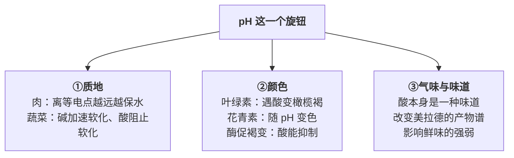
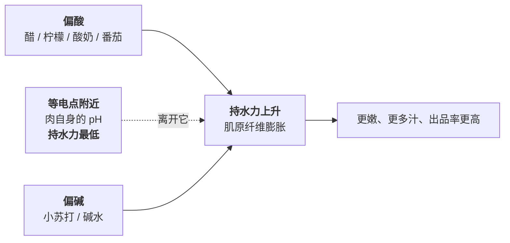

# 第 8 章 酸与碱：对质地、颜色和气味的三种作用

> **本章目标**：把"加点醋""放点柠檬""来点小苏打"从习惯变成决策。
> pH 这个旋钮同时在动**三样东西**——**质地、颜色、气味/味道**——
> 而且三样的方向**并不一致**：对质地有利的，可能对颜色有害。
>
> 学完这一章，你会知道：为什么醋腌和碱腌**都**能让肉变嫩（而且是同一个原因）、
> 为什么加了醋的豆子怎么都煮不烂、为什么青菜盖着盖子焖会发黄、
> 以及为什么腌料**基本只作用在外面那一层**。

## 8.1 先把"酸碱"从化学课里拉回厨房

pH 是"氢离子浓度"的度量，数值越小越酸、越大越碱、7 是中性。
但在厨房里，你基本不需要知道具体数值，**你需要知道的是方向和强弱**：

| 方向 | 厨房里的来源 | 相对强弱（按尝到的酸/碱感） |
|------|------------|--------------------|
| **酸** | 白醋、香醋、柠檬汁、青柠、番茄、酸奶、酸菜/泡菜的汁、料酒中的酸、山楂 | 白醋与柠檬汁属于"强"的一档；番茄、酸奶属于温和的一档 |
| **中性附近** | 水、大部分肉与蔬菜 | —— |
| **碱** | 小苏打（碳酸氢钠）、碱面/碱水（中式面食）、草木灰水（传统做法）、皮蛋的腌料 | 小苏打属于温和的碱；工业碱水更强，家庭使用要非常小心 |

> ⚠️ **本书不给具体的 pH 数值表**。
> 原因是：厨房里同一样东西（比如番茄、醋）的 pH 随品种、成熟度、品牌差别很大，
> 而本书**没有核到**一份可靠的、面向家庭食材的一手实测数据。
> 后面凡引用数字的地方，都是**具体研究里的具体体系**，会注明条件。

本章的结构就是那三件事：

## 8.2 作用一：质地（这一节最有用）

### 肉：酸和碱**都**能嫩，因为它们走的是同一条曲线

这是本章最反直觉、也最有价值的一段。分子美食学综述的表述是：

> **pH 值对肌肉的膨胀能力、进而对持水力（WHC）很重要。**
> **腌制后肌肉 pH 无论偏低还是偏高，对质地都有正面作用**，都会提高结水能力与肌原纤维的膨胀。
> **pH 离等电点越远，持水力越高**——因为肉蛋白上能结合水的负电荷变多了。
> **既然在等电点两侧持水力都会上升，碱性溶液同样具有嫩化作用。**

> **所以"酸腌"和"碱腌"不是两个流派，是同一条 U 形曲线的两侧。**
> 中式厨房大量使用碱腌，西式厨房大量使用酸腌——**它们在物理上是同一件事。**

**综述还给出了两侧各自的细节：**

| | 酸腌（醋、柠檬、葡萄酒） | 碱腌（小苏打，中式常用） |
|---|---|---|
| 文献表述 | 酸性腌制被发现能**改善嫩度与多汁感、并因保水而增加重量**；机理涉及**蛋白水解增强**与**胶原向明胶的转化增加** | 综述明确写道"**碱性腌制是中式烹饪中常用的嫩化方法**"，在印度家庭烹饪中同样常用 |
| 实验证据 | —— | 一项 1980 年的研究观察到**碳酸氢盐处理使肌原纤维膨胀并融合**；后续研究报道注射碳酸氢钠可**提高持水力与肌原纤维蛋白溶解度、降低滴水损失、蒸煮损失与剪切力** |
| 与其他方法比 | —— | 一项对比研究发现**碳酸氢钠在剪切力与蒸煮损失上的效果，与盐和磷酸盐相当** |
| 已知副作用 | 综述指出酸腌会**影响风味，带来不受欢迎的酸味** | 同一对比研究发现碳酸氢钠处理的样品**在纤维之间出现充气的孔隙、外观异常**，作者推测与加热时产生的二氧化碳有关 |

> **给厨房的三条结论**：
>
> 1. **小苏打腌肉是有文献支持的**（这在中式厨房里是几十年的惯例，现在有了机理解释）；
> 2. **它的副作用是真实的**：气孔、外观、以及过量时的碱味——所以**宁少勿多**；
> 3. ⚠️ **本书不给用量**。上面所有研究用的都是**特定浓度的溶液或注射**，
>    不是"一斤肉放几克小苏打"。**家庭用量的定量证据，本书没有核到**（已登记为缺口）。

### 一个被严重低估的事实：腌料几乎进不去

同一段综述里还有一句极其重要的话：

> **腌制存在一个特别的问题：腌料渗入肉的速度非常慢，因此它只作用于外层。**
> 工业上有时用**注射**来解决这个问题。

> ## 这一句话推翻了很多厨房习惯
>
> **既然腌料只作用在外层，那么"腌一整晚"对一大块肉的内部几乎没有意义。**
> 真正有效的做法是**增加"外层"的比例**：
>
> | 做法 | 它在做什么 |
> |------|-----------|
> | **切薄、切丝、切丁** | 让"外层"占比大幅上升——**这是中式炒菜腌料有效的根本原因** |
> | **划刀、扎孔** | 人为增加表面积与渗透路径 |
> | **抓拌、摔打** | 机械破坏 + 让腌料接触更充分 |
> | **延长时间** | 效果**最差**的一条：渗透很慢，时间的回报是递减的 |
>
> ⚠️ 这条结论对**盐**也部分适用，但盐的分子小、行为与大分子腌料不同，
> 细节留到第 11 章（盐）。

### 蔬菜与豆类：碱让它烂，酸让它不烂

蔬菜变软的主要机制是**果胶**[^1]的降解与中间层的溶解。一篇关于低温慢煮蔬菜的综述写道：

> **β-消除反应是果胶降解的主要原因**，它切断果胶中的糖苷键，
> **发生在非酸性环境中**，由**氢氧根离子催化**，
> 其速率取决于**温度、pH 与果胶的酯化程度**。
> 软化还得益于细胞壁的破坏与**中间层的减少**，后者使细胞彼此分开。

把这段翻成厨房语言：

| 你加了什么 | 果胶发生什么 | 结果 |
|-----------|------------|------|
| **碱**（一小撮小苏打） | β-消除被催化，**加快** | 蔬菜/豆子**更快烂**。这就是"煮豆放一点碱"的机理 |
| **酸**（醋、柠檬、番茄） | β-消除**被抑制**（它需要非酸性环境） | 蔬菜**保持脆**、豆子**怎么煮都不烂** |

> **这一条能解释一堆看似无关的现象**：
>
> - **番茄放早了，土豆/豆子就煮不软**——番茄的酸抑制了 β-消除。
>   所以**要软的东西先煮软，再加酸**；
> - **凉拌藕片、泡椒莲藕加醋特别脆**——酸在帮你保持质地；
> - **煮红豆绿豆放一点小苏打确实快**，⚠️ 但代价是质地容易过烂、颜色和风味改变，
>   而且本书**没有核到**家庭用量的定量数据；
> - **腌黄瓜/泡菜脆**，酸是原因之一。

> **一条通用的顺序规则**：
> **"要烂的事先做，要脆的事后做；酸永远是后来者。"**

## 8.3 作用二：颜色

### 绿色：酸是叶绿素的敌人

分子美食学综述给出的机制很清楚：

> 叶绿素在**酸催化的反应**中会失去卟啉环里配位的**镁离子**，
> 颜色**从鲜绿变成暗褐**。
> 在厨房里，这种颜色变化**可以通过用略带碱性的水煮绿色蔬菜来避免，
> 例如加入小苏打**。

失去镁之后的产物叫**脱镁叶绿素**[^2]（pheophytin），颜色是橄榄褐。
另一篇关于蔬菜的综述从另一个角度印证了同一件事：

> 加热引起蛋白质凝固时，**叶绿素会暴露在植物组织自身所含的酸中，
> 因而容易转变成橄榄绿色的脱镁叶绿素**；
> 低温慢煮（无液态水、限氧）条件下这种转变**比与水直接接触的烹饪更少**。

> ## 这解释了"青菜为什么会发黄"的三条路径
>
> | 路径 | 机理 | 对策 |
> |------|------|------|
> | **煮太久** | 组织自身的酸有更多时间与叶绿素反应 | **缩短时间**——这是最有效的一条 |
> | **盖着盖子焖** | 蔬菜受热释放的挥发性酸被困在锅里 | **敞开锅**（这是行业惯例，机制上与"酸"这条线一致，⚠️ 但本书**未核到**直接的对照实验） |
> | **菜里/锅里有酸** | 直接提供酸 | **醋、柠檬、番茄最后放**，或者出锅前才淋 |
>
> **加碱能保绿，但要慎用**：文献确实支持"略带碱性的水能避免变色"，
> 但第 8.2 节刚说过，**碱会加速果胶的 β-消除**——
> **你保住了颜色，可能赔上了口感**。而且过量的碱会带来皂味（见 8.4）。
> 所以**保绿的第一手段永远是"快"，不是"加碱"**。

### 红紫色：花青素是一个 pH 指示剂

综述指出，**花青素**[^3]的颜色由一组随 pH 移动的酸碱平衡决定，
**在酸性条件下红色形式占优势**；厨房里"pH 很容易控制，所以水果类甜品或饮料的颜色可以据此调整"。

> **厨房里的表现**：紫甘蓝、紫薯、红心火龙果、蓝莓、桑葚——
> **加酸偏红、偏碱偏蓝绿**。
> 所以"炒紫甘蓝加点醋会更红亮"是有依据的；
> 而"紫薯做的馒头蒸出来发蓝绿"，通常是因为**面团/配料偏碱**（例如加了碱或用了碱性水）。

### 褐色：酸能拦住酶促褐变

这一条第 7 章已经讲过，这里只做一次跨章连接：
**PPO 最适 pH 5~7，低于 pH 3.0 受到抑制**；柠檬酸与抗坏血酸还能**还原醌**、**螯合铜**。
所以**切开的苹果、土豆、藕、牛油果，泡酸水是有机理支持的做法**。

## 8.4 作用三：气味与味道

| 现象 | 机理 / 文献表述 | 厨房里的用法 |
|------|--------------|------------|
| **酸本身是一种味道** | 酸味受体目前最被看好的候选是 **Otop1**（一种质子通道），详见第 9 章 | 酸是**调味的第四个旋钮**（第 12、15 章展开） |
| **酸改变美拉德的产物谱** | 熟肉在 pH 4.0~5.6 范围内，**挥发物总量随 pH 下降而上升**；**呋喃硫醇**类（强烈肉香）在酸性下优先生成，而**噻唑、吡嗪**类偏好较高 pH | 这是"腌料里放点酸"除了嫩化之外的另一重收益。⚠️ 属于方向性证据，不是配方 |
| **强酸/强碱会削弱鲜味** | 味觉综述指出：**味精在强酸性或强碱性条件下鲜味强度下降**，原因与谷氨酸分子上氨基与羧基的带电状态有关 | 一道很酸的菜里，"觉得不够鲜"未必是鲜味物质不够，可能是**环境 pH 把它压住了**。先调酸，再判断鲜 |
| **碱催化的水解会产生风味** | 综述提到，用石灰等碱性物质处理鱼（北欧与部分亚洲的传统做法）时，**碱催化的水解对风味形成有显著作用** | 这类做法风味强烈、争议也大，本书只作机理记录 |
| **碱多了会有皂味** | 综述在讲膨松剂时指出：工业上使用**膨松酸**，是为了让碳酸氢盐在更低温度下分解，并**防止 pH 升高和碳酸根离子带来的皂味** | **小苏打放多了发涩、发苦、有"碱味"，是可预期的**，不是你的错觉 |
| **小苏打能让面团膨起来** | 综述：碳酸氢钠受热分解产生**二氧化碳**；碳酸氢铵则产生二氧化碳和氨 | 这就是"泡打粉/小苏打"的作用。**泡打粉 = 碳酸氢盐 + 膨松酸**，所以它比纯小苏打更不容易留下碱味 |

## 8.5 一个必须分清的问题：酸不是加热的替代品

生腌、柠檬汁"腌熟"的鱼（ceviche 类做法）非常常见，说法是"酸把它做熟了"。

**本书能确认的**：**酸确实会让蛋白质变性**——外观变白、质地变紧，看起来"熟了"
（第 4 章讲的变性，热不是唯一的触发方式，酸和盐也能触发）。

**本书不能确认的**：酸能不能**替代加热**来保证安全。

> ⚠️ **本书的处理方式（纪律要求）**：
>
> - 美国 CDC 明确指出：**除海鲜外，不能靠颜色和质地判断食物是否熟透**，只有温度计可靠。
>   而"看起来白了"恰恰是一个**颜色与质地判据**；
> - 各国官方对鱼类给出的是**加热**口径（例如美国 FDA 的有鳍鱼类 145 °F 约 63 °C
>   或"肉质不透明、可用叉轻易分开"；加拿大卫生部给的是 70 °C）；
> - 本书**没有核到**任何"用酸处理可以达到等效杀菌"的官方指引；
> - 因此本书**不对生腌类做法给出安全建议**，只说明它**在物理上是变性、不是加热**。
>   要吃生的，请遵循自己所在地官方对**生食水产**的专门指引（通常涉及冷冻处理要求），
>   并注意**各国口径不同**。

**顺带说一个相邻的、有官方数字的知识**：在食品法规里，酸度**确实**是一条安全分界线。
美国 FDA 的规定中：

| 类别 | 定义 |
|------|------|
| **低酸罐头食品（LACF）** | 最终平衡 **pH 大于 4.6**、**水活度大于 0.85** 的食品（番茄及番茄制品另有 pH 4.7 的例外条款） |
| **酸化食品（AF）** | 加入酸或酸性食品后，最终平衡 **pH 等于或低于 4.6**、水活度大于 0.85 的低酸食品 |

> ⚠️ **这是美国的法规分类，服务于"罐藏食品需要什么处理与备案"，
> 不是家庭腌菜或自制罐头的操作指南。**
> 家庭密封保存食物涉及肉毒毒素等风险，**必须遵循本地官方的家庭食品保藏指引**，
> 不能靠"我加了很多醋"来自行判断。本书**不提供家庭罐藏方案**。

## 8.6 本章的可迁移规则：酸该什么时候加

> ## 酸（醋、柠檬、番茄、酸奶）一共有三个可能的时机，选哪个取决于你要什么：
>
> | 时机 | 你想要的效果 | 代价 / 注意 |
> |------|------------|-----------|
> | **①下锅前（腌）** | 嫩化、保水、改变美拉德的产物谱、抑制酶促褐变 | 只作用于外层 → **必须配合切薄/划刀**；会带来酸味；⚠️ 用量本书不给 |
> | **②加热中途** | 让味道融进汤汁、提供酸味的骨架、平衡油腻 | **会阻止后面的软化**（β-消除被抑制）→ 所有"要煮烂"的东西必须**已经烂了**；会让芡变稀（第 6 章）；会让绿色变褐 |
> | **③出锅前 / 出锅后** | 保留**香气**（挥发性的酸香一加热就跑）、保护绿色、精确控制酸度 | 味道停留在表面，不够"融" |
>
> **三条最常用的判断**：
>
> 1. **要软 → 酸最后放**；**要脆 → 酸早点放**；
> 2. **要绿 → 酸最后放，而且锅要敞开、时间要短**；
> 3. **想要酸"香" → 最后放**（挥发性的东西一煮就没了）；
>    **想要酸"味" → 可以早放**（不挥发的酸留得住）。
>
> **碱（小苏打）只有两个常见用途**：
> **①腌肉嫩化**（有文献支持，宁少勿多）、**②加速软化/上色**（有效但代价明显）。
> **用之前先问一句：我愿意付出的代价是质地变软、还是碱味？**

## 8.7 常见说法辨析

按本书约定标注**证据强度**：✅ 有共识 / ⚠️ 有争议 / ❌ 明确错误 / 缺乏证据。
来源见[出处登记](../../standards.md)。

| 说法 | 判定 | 说明 |
|------|------|------|
| "小苏打腌肉能让肉变嫩" | ✅ **方向有文献支持**（但用量未核） | 综述明确表述"**碱性腌制是中式烹饪中常用的嫩化方法**"，并汇总了多项研究：碳酸氢盐处理使肌原纤维**膨胀并融合**；注射碳酸氢钠**提高持水力与蛋白溶解度、降低滴水损失、蒸煮损失与剪切力**；其对剪切力与蒸煮损失的效果**与盐和磷酸盐相当**。⚠️ 副作用也有记录：纤维间出现**充气孔隙**、外观异常。⚠️ **家庭用量本书未核到** |
| "用醋/柠檬腌肉能让肉变嫩" | ✅ **方向有支持，理由和碱是同一个** | 同一篇综述：酸性腌制**改善嫩度与多汁感并因保水而增重**，机理涉及**蛋白水解增强**与**胶原向明胶转化增加**；更根本的解释是"**pH 离等电点越远，持水力越高**"——所以酸碱两侧都有效。⚠️ 综述同时指出酸腌会带来**不受欢迎的酸味** |
| "腌一夜比腌半小时入味得多" | ⚠️ **对大块肉基本不成立** | 综述明确指出：**腌料渗入肉的速度非常慢，因此只作用于外层**（工业上靠注射解决）。真正有效的是**把"外层"的比例做大**：切薄、切丝、划刀。延长时间的回报递减 |
| "煮豆子放一点碱熟得快" | ✅ **机理清楚** | 果胶降解的主要途径 **β-消除由氢氧根离子催化、发生在非酸性环境**，速率取决于温度、pH 与酯化程度。⚠️ 代价是质地易过烂、风味与颜色改变；家庭用量本书未核到 |
| "炖肉/煮豆时早放番茄（或醋）会煮不烂" | ✅ **机理清楚** | 同上反过来：酸性环境**抑制 β-消除**，果胶不容易降解，于是"怎么煮都硬"。**要烂的事先做完，再加酸** |
| "青菜盖盖子焖会发黄" | ⚠️ **机制方向一致，但本书未核到直接对照** | 可确认的机制：叶绿素在**酸催化**下失去镁离子，变成橄榄褐的**脱镁叶绿素**；加热时叶绿素会暴露在**植物组织自身的酸**中。"盖盖导致挥发性酸积聚"是合理推论与行业惯例，本书**没有核到**一手对照实验 |
| "焯青菜加一点小苏打能保持翠绿" | ⚠️ **有效，但代价常被忽略** | 综述明确写"这种颜色变化可以通过用**略带碱性的水**煮绿色蔬菜来避免，例如加入小苏打"。⚠️ 但碱同时**加速果胶的 β-消除**（更容易烂），过量还带来皂味。**本书的首选对策仍是"时间短、锅敞开、酸最后放"** |
| "焯青菜加油/加盐能保绿" | **缺乏证据** | 本书**没有核到**支持这两条的一手对照实验。可确认的相邻事实：加盐会改变渗透压、使水分与水溶性成分损失更多（第 3 章引用的综述）。所以"加盐保绿"至少有一个相反方向的代价 |
| "紫甘蓝炒出来发蓝，加点醋就红了" | ✅ **机理清楚** | 花青素的颜色由一组随 pH 移动的酸碱平衡决定，**酸性条件下红色形式占优势**；综述还明确说厨房里可以据此**主动调整颜色** |
| "柠檬汁能把鱼'腌熟'" | ⚠️ **物理上是变性，不能等同于加热** | 酸确实使蛋白质变性（外观变白、质地变紧）。但美国 CDC 明确指出**除海鲜外不能靠颜色和质地判断是否熟透**，而各国官方对鱼给的是**加热**口径。本书**没有核到**任何"酸处理等效于加热杀菌"的官方指引，因此**不对生腌做法给出安全建议**，请遵循本地官方对生食水产的专门指引 |
| "加了很多醋的自制罐头/腌菜就安全了" | ❌ **不能这样自行判断** | 酸度在法规里**确实**是分界线（美国 FDA：最终平衡 pH >4.6 且水活度 >0.85 属低酸罐头食品；加酸后 pH ≤4.6 的属酸化食品），但那是**针对工业罐藏的分类与备案要求**，不是家庭配方的安全证明。家庭密封保存必须遵循本地官方的家庭食品保藏指引 |
| "菜太酸了加糖就能救" | ⚠️ **有方向性证据，但不是万能** | 本书目前能核到的是**混合味之间存在增强、抑制与无影响三种结果**，且相互作用在低到中等浓度下更明显（第 9、10 章展开）。"糖压酸"在具体体系里是否成立、压多少，本书**没有核到**定量数据。实操上更可靠的做法是**稀释 + 补其他维度**（见[尝味纠偏表](../../forms/tasting-fix.md)） |
| "酸的菜里放味精没用" | ⚠️ **方向有支持** | 味觉综述指出**味精在强酸或强碱条件下鲜味强度下降**，并给出了分子层面的解释。所以很酸的菜里"觉得不鲜"，**先调酸度再加鲜味物质**可能更有效。⚠️ "强酸"的具体范围该文未量化到厨房浓度 |

## 8.8 🔎 下次做菜时的用处

1. **要煮烂的东西，酸一律最后放**（番茄、醋、柠檬、酸菜）。先把豆子、土豆、肉煮软，再加酸。
2. **要脆的东西，酸可以早点放**（凉拌藕、泡菜、腌黄瓜）。
3. **腌肉别指望时间，指望刀**——腌料只作用于外层，切薄切丝比腌一夜有用得多。
4. **小苏打腌肉：宁少勿多**。有文献支持，但过量会带来气孔、外观异常和碱味。
5. **保绿的第一手段是"快"**：时间短、锅敞开、酸最后放。加碱能保绿但会让质地变软。
6. **紫色食材当成 pH 指示剂用**：发蓝就加点酸。
7. **一道很酸的菜觉得不鲜，先降酸再补鲜**，别一路加鲜味调料。
8. **不要用"加醋"来给自制腌渍/密封保存背书**——那是另一套需要官方指引的事。

## 8.9 思考题

1. 为什么说"酸腌"和"碱腌"在原理上是同一件事？请用**等电点**和**持水力**解释，
   并说明两者各自已知的副作用。
2. 文献里那句"腌料渗入肉的速度非常慢、只作用于外层"，对你平时的腌制习惯意味着什么？
   请列出三种比"延长时间"更有效的做法，并说明它们为什么有效。
3. β-消除反应是什么？为什么"加碱煮豆子更快"和"早放番茄煮不烂"是同一条规律的两面？
4. 青菜发黄的三条路径分别是什么？为什么本书把"加碱保绿"列为**次选**而不是首选？
5. **【案例】** 你要做一道番茄炖牛腩，菜谱写着："牛腩焯水，下锅翻炒，
   **加番茄块炒出汁**，加水没过，炖 1.5 小时，加盐调味。"
   请回答：（a）这份菜谱有一个顺序上的风险，是什么？机理是什么？
   （b）你会怎么改？改完之后番茄的"味"会不会损失？怎么补？
   （c）如果就是要按原顺序做（因为想要番茄味融进汤里），你会怎么调整其他参数来补偿？
6. **【案例】** 你想做一盘"滑嫩的炒肉片"，手里有：小苏打、白醋、淀粉、蛋清、料酒、盐。
   请回答：（a）按本章与第 4、6 章的原理，这几样各自在解决什么问题？
   （b）你会怎么组合、按什么顺序？（c）哪一样最容易过量？过量的表现是什么？
   （d）这套做法里，哪些环节是有文献支持的、哪些是惯例？
7. **【辨析】** "柠檬汁能把鱼腌熟"——判断证据强度。
   请分别说明它在**质地/外观**层面和**安全**层面各是什么情况，
   以及为什么本书拒绝给出安全建议。
8. **【辨析】** "焯青菜加一点小苏打保持翠绿"——判断证据强度，说清收益与代价，
   并给出一个不加碱的替代方案。
9. 本章说 pH 同时在动质地、颜色、气味三样东西。
   请举一个**三样发生冲突**的具体例子，并说明你会优先保哪一样、为什么。

> 📖 **参考答案**（想清楚再看）：[Q1](../../qa/08-acid-alkali-qa.md#q1) ·
> [Q2](../../qa/08-acid-alkali-qa.md#q2) · [Q3](../../qa/08-acid-alkali-qa.md#q3) ·
> [Q4](../../qa/08-acid-alkali-qa.md#q4) · [Q5](../../qa/08-acid-alkali-qa.md#q5) ·
> [Q6](../../qa/08-acid-alkali-qa.md#q6) · [Q7](../../qa/08-acid-alkali-qa.md#q7) ·
> [Q8](../../qa/08-acid-alkali-qa.md#q8) · [Q9](../../qa/08-acid-alkali-qa.md#q9)

## 8.10 本章实操

### 🅐 零成本版 · 任务一：给家里的酸和碱排个队

不用开火、不用买。把家里所有**带酸**和**带碱**的东西列出来，各尝一点点（或回忆），排序。

| 名称 | 酸 / 碱 | 我尝到的强度（1~5） | 它还带来什么（香气、甜、咸、色） | 我平时用它做什么 | 按本章，它更适合什么时机 |
|------|--------|---------------|------------------------|------------|------------------|
| | | | | | 腌 / 中途 / 出锅前 |
| | | | | | |
| | | | | | |

> 重点是最后两列：**大多数酸除了"酸"还带着别的东西**
> （香醋带香气与甜、柠檬带挥发性香气、番茄带鲜与甜、酸奶带脂与稠）。
> **选哪种酸，本质上是在选"除了酸之外还想要什么"。**

### 🅐 零成本版 · 任务二：把三份菜谱里的"酸"找出来并归类

找三份不同类型的菜谱（一份炖菜、一份凉拌、一份炒菜），把每一处酸标出来。

| 菜谱 | 酸来自哪里 | 在第几步加 | 它在解决什么（质地/颜色/味道/香气） | 换个时机会怎样 |
|------|----------|----------|----------------------------|------------|
| | | | | |
| | | | | |
| | | | | |

> 做完你会发现一个规律：**好的菜谱经常把同一种酸分两次放**——
> 早放的那份管"味"，晚放的那份管"香"。

### 🅑 开火版 · 任务三：酸的时机对质地的影响（有灶台时做）

**需要**：容易煮软的东西（土豆块 / 干豆子泡发 / 胡萝卜）、白醋、两口小锅、计时器。

**唯一变量**：醋加入的时间。总醋量、水量、火力、总时间保持一致。

| 组 | 加醋时机 | 20 分钟时的软硬 | 40 分钟时的软硬 | 最终口感 | 味道 |
|----|---------|------------|------------|---------|------|
| ① 一开始就加 | 下锅时 | | | | |
| ② 快好时加 | 出锅前 2 分钟 | | | | |

做完回答：

1. 哪一组更软？差别有多明显？
2. 两组的**酸味**一样吗？（提示：一部分酸会随加热跑掉）
3. 如果一道菜既要"软"又要"酸"，你会怎么安排？

### 🅑 开火版 · 任务四：绿叶菜的颜色实验

**需要**：一把绿叶菜（分成三份）、小苏打、白醋、一口锅、计时器、手机拍照。

**每组都用沸水焯烫同样的时间**（比如 60 秒），捞出后立刻拍照，30 分钟后再拍一次。

| 组 | 处理 | 刚出锅的颜色 | 30 分钟后的颜色 | 口感（脆 / 软 / 烂） |
|----|------|-----------|------------|----------------|
| ① 对照 | 清水，敞开锅 | | | |
| ② 加碱 | 清水 + 一小撮小苏打 | | | |
| ③ 加酸 | 清水 + 一勺醋 | | | |
| ④ 盖盖 | 清水，**全程盖盖** | | | |

做完回答：

1. ③组和①组的颜色差别有多大？这符合"酸使叶绿素失镁"的预期吗？
2. ②组颜色好看吗？它的**口感**呢？你愿意为颜色付这个代价吗？
3. ④组和①组有差别吗？如果有，你能确定是"酸积聚"造成的吗？
   **还需要测什么才能确定？**（提示：你无法直接测锅里的酸。）

> **第 3 问是这个任务的重点**：④组是本书标为"⚠️ 未核到直接对照"的那一条。
> 你做出来的差别是**现象**，不是**归因**——这个区别是本书最想教给你的习惯。

### 🅑 开火版 · 任务五：小苏打腌肉，找到你自己的"过量点"

⚠️ **这个任务的目的是找出上限，不是推荐用量。** 本书**不给**用量数字。

**需要**：同一块瘦肉切薄片分三份、小苏打、盐、清水、秤（能称到 0.1 g 更好）。

做法：三份分别用**不同量**的小苏打（从"极少量"开始，每组翻倍）+ 同样的水抓匀，
静置同样的时间，冲洗后用同样的方式炒熟。

| 组 | 小苏打用量（相对） | 嫩度 | 有没有"滑"到发假的感觉 | 有没有碱味/涩味 | 断面有没有异常孔隙 |
|----|--------------|------|------------------|-------------|--------------|
| ① 极少 | ×1 | | | | |
| ② 中 | ×2 | | | | |
| ③ 多 | ×4 | | | | |

做完回答：

1. 从第几组开始出现碱味或"假滑"的口感？
2. 文献提到碳酸氢盐处理会让**纤维之间出现充气孔隙**，你在哪一组看到了？
3. 你自己的"可用区间"在哪里？把它记下来——**这比任何菜谱给的克数都可靠**，
   因为它对应的是你的肉、你的刀工、你的口味。

## 8.11 本章依据

本章引用的来源与核对状态详见[参考书目与出处登记](../../standards.md)，具体对应如下：

| 本章用到的内容 | 依据 |
|--------------|------|
| **腌料渗入肉的速度非常慢、只作用于外层**（工业上用注射解决）；酸性腌制**改善嫩度与多汁感、因保水而增重**，机理涉及**蛋白水解增强与胶原向明胶的转化增加**，并**带来不受欢迎的酸味**；**pH 对肌肉膨胀能力与持水力很重要**，腌后 pH 偏低或偏高**都**有正面作用；**pH 离等电点越远持水力越高**，因而**碱性溶液同样具有嫩化作用**；**碱性腌制是中式烹饪中常用的嫩化方法**（印度家庭亦常用）；碳酸氢盐使**肌原纤维膨胀并融合**；注射碳酸氢钠**提高持水力与肌原纤维蛋白溶解度、降低滴水损失、蒸煮损失与剪切力**；其效果**与盐、磷酸盐相当**，但样品**纤维间出现充气孔隙、外观异常**（推测与加热产生的二氧化碳有关）；**叶绿素在酸催化下失去镁离子、由鲜绿变暗褐**，可用**略带碱性的水（如加小苏打）**避免；**花青素的颜色由随 pH 移动的酸碱平衡决定，酸性下红色占优**；碳酸氢钠受热分解产生**二氧化碳**，工业用膨松酸以**防止 pH 升高与碳酸根带来的皂味**；碱催化的水解对某些传统鱼制品的风味形成有显著作用；熟肉 pH 4.0~5.6 时**挥发物总量随 pH 下降而上升**、呋喃硫醇偏酸性、噻唑与吡嗪偏高 pH；烹饪介质高于 85 °C 时硬度普遍较高、低温给出更嫩的产品（转引 Califano 等的模拟） | 一篇关于分子美食学的综述，*Chemical Reviews*，2010（PMC2855180；doi:10.1021/cr900105w），✅ 开放获取全文。⚠️ 其中多处为综述**转引**他人研究，条件各异，本书只取方向 |
| **β-消除是果胶降解的主要反应**，切断糖苷键、**发生在非酸性环境**、由**氢氧根离子催化**，速率取决于**温度、pH 与酯化程度**；软化还得益于**中间层减少**使细胞分离；加热使叶绿素**暴露于植物组织自身的酸**而转成橄榄绿的**脱镁叶绿素**，低温慢煮（限氧、无液态水）下这种转化更少 | 一篇关于低温慢煮对蔬菜品质影响的综述，*Foods*，2026（PMC12840460；doi:10.3390/foods15020206），✅ 开放获取全文 |
| **PPO 最适 pH 5~7、低于 pH 3.0 受抑制**；柠檬酸/抗坏血酸兼有降 pH、还原与螯合铜的作用 | 一篇关于控制果蔬酶促褐变的综述，*Molecules*，2020（PMC7355983；doi:10.3390/molecules25122754），✅ 开放获取全文（第 7 章已引用） |
| **味精在强酸或强碱条件下鲜味强度下降**（并给出分子层面的解释） | 一篇关于人类味觉与鲜味物质的综述，*Journal of Food Science*，2022（PMC9314127；doi:10.1111/1750-3841.16101），✅ 开放获取全文 |
| **低酸罐头食品：最终平衡 pH >4.6 且水活度 >0.85**（番茄类有 pH 4.7 的例外）；**酸化食品：加酸后最终平衡 pH ≤4.6 且水活度 >0.85** | 美国 FDA「Acidified & Low-Acid Canned Foods」监管信息页，✅ 本次写作实际打开。⚠️ **美国法规口径，服务于工业罐藏的备案要求，不是家庭保藏指南** |
| "除海鲜外不能靠颜色和质地判断是否熟透" | 美国 CDC 食品安全页面，✅（第 1、4 章已引用）。⚠️ 各国口径不同 |
| 鱼类的加热口径（美国 FDA 145 °F 约 63 °C 或"肉质不透明、可用叉分开"；加拿大卫生部 70 °C） | 美国 FDA「Safe Food Handling」、加拿大卫生部「Safe internal cooking temperatures」，✅。⚠️ 各国口径不同 |
| 家庭用量的小苏打腌肉定量；"盖盖导致挥发性酸积聚使青菜发黄"的直接对照；"焯水加油/加盐保绿"；"糖压酸"的定量 | ⚠️ **均未核到**一手对照，本章分别标为"未核到用量""机制方向一致但未核到对照""缺乏证据" |

[^1]: [果胶与 β-消除](../../glossary.md#pectin)（pectin / β-elimination）。
[^2]: [脱镁叶绿素](../../glossary.md#pheophytin)（pheophytin）。
[^3]: [花青素](../../glossary.md#anthocyanin)（anthocyanins）。

---

**到这里，第一部分的八章讲完了。**
热（第 2 章）、水（第 3 章）、两类蛋白质（第 4、5 章）、淀粉（第 6 章）、
褐变（第 7 章）、酸碱（第 8 章）——这就是"一道菜里到底在发生什么"的全部机理骨架。

**下一站**：[项目 P1](project-p1-recipe-translation.md)——
把一份你看不懂的菜谱，逐行翻译成原理。
这是第一部分的验收：**如果你能把每一步都归到四条线上、说出它的目的、
并判断它能不能省，那么这八章就算学会了。**
