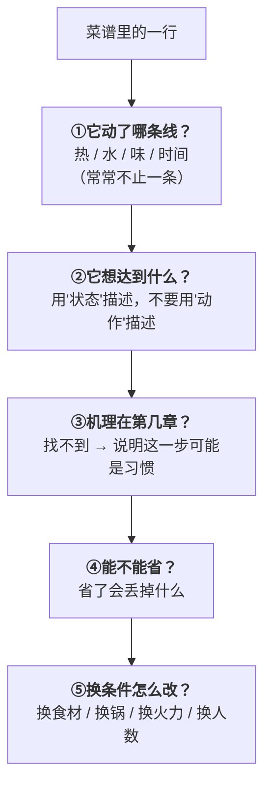

# 🛠 项目 P1：把一份看不懂的菜谱翻译成原理

> **这是第一部分的验收。**
> 前八章讲了热、水、两类蛋白质、淀粉、褐变、酸碱。
> 这个项目只做一件事：**拿一份真实的菜谱，逐行说出"它在干什么、为什么、能不能省"。**
>
> **做完你会得到一份可以一直用下去的能力**：
> 以后看任何菜谱，你读到的不再是"步骤"，而是**别人在四条线上做的一组选择**——
> 而选择是可以改的。

## P1.1 交付物

做完这个项目，你手上应该有**两样东西**：

| 交付物 | 是什么 | 用在哪 |
|--------|-------|-------|
| **①逐行翻译表** | 菜谱的每一步 → 属于哪条线 / 目的 / 机理在哪一章 / 能不能省 / 换条件怎么改 | 这是本项目的核心产出 |
| **②一张改写后的做法** | 按你自己的厨房条件（火力、锅、时间、人数）重排的版本 | 下次真的照它做 |

零成本版只做①；开火版做①+②，并**按②做一遍**、记录差异。

## P1.2 选哪份菜谱

**选一份你"照做过但不确定为什么"的菜谱**，满足这三个条件最好：

1. **有加热**（否则热这条线用不上）；
2. **中途加过水或汤**（这样才能看到"褐变窗口"的开与关）；
3. **有至少一个你不理解的步骤**（"为什么要焯水""为什么先煎一下""为什么最后才放醋"）。

> 典型的好素材：红烧类、炖煮类、糖醋类、干煸类、一锅出的家常菜。
> **不要选烘焙**（那是另一套配比体系，本书第一部分不覆盖）。

## P1.3 翻译的方法：每一步问五个问题

**第②问最容易做错**。举例：

| 菜谱写的 | ❌ 错误的翻译 | ✅ 正确的翻译 |
|---------|------------|------------|
| "热锅下油，下肉翻炒至变色" | "把肉炒一下" | **目的是让表面形成干壳并褐变**；"变色"（肌红蛋白变性）只是肉从红转白，**不等于褐变**（第 7 章 Q6） |
| "加开水没过食材" | "加水炖" | **目的是把体系温度钉在沸点附近**，让胶原有时间转明胶；**同时它关闭了褐变窗口**（第 3、5、7 章） |
| "最后淋一勺香醋" | "调味" | **目的是补挥发性酸香**——挥发的东西一煮就跑，所以必须最后（第 8 章） |

## P1.4 交付物①：逐行翻译表（模板）

把它抄到笔记里、或者直接在这张表上写。**每一行菜谱对应一行表**。

| # | 菜谱原文（抄一行） | 动了哪条线 | 真实目的（写"状态"） | 机理在第几章 | 能不能省？省了丢什么 | 换条件怎么改 |
|---|------------------|-----------|------------------|------------|------------------|------------|
| 1 | | 热 / 水 / 味 / 时间 | | | | |
| 2 | | | | | | |
| 3 | | | | | | |
| 4 | | | | | | |
| 5 | | | | | | |
| 6 | | | | | | |
| 7 | | | | | | |
| 8 | | | | | | |

填完之后，做**三项检查**：

| 检查 | 怎么做 | 说明 |
|------|-------|------|
| **① 褐变窗口在哪** | 找到"加水那一行"，在它前面画线 | 线以前是可以上色的，线以后不能（直到收汁）。**该上色的事有没有被放在线之前？**（第 7 章） |
| **② 有没有"时间不够"的步骤** | 找结缔组织多的食材 + 加热时间 | 硬部位 + 短时间 = 又硬又柴（第 5 章）。这是菜谱最常见的乐观假设 |
| **③ 有没有"功率不够"的步骤** | 找"下锅煎/炒"的分量 | 家用灶（通常最高约 2.5 kW）一次大约只能让 800 g 肉真正上色（第 7 章）。**份量翻倍的菜谱尤其要查这一条** |

## P1.5 交付物②：改写成"你的版本"

拿着上面的表，回答四个问题，然后重排步骤。

| 问题 | 我的条件 | 因此我要改什么 |
|------|---------|--------------|
| 我的**火力**够吗？ | 灶具功率： | 例如：分两批煎 |
| 我的**锅**合适吗？（大小、厚薄、涂层） | | 例如：换厚锅 / 换更大的锅 |
| 我有多少**时间**？ | | 例如：硬部位换成薄切；或改用压力锅 |
| 我做**几人份**？ | | 例如：不要等比例放大"要上色"的那一步 |

**改写后的做法**（自己写，尽量写成"状态判据"而不是"分钟数"）：

| 步骤 | 我要做什么 | 做到什么状态就进入下一步（判据） | 大概多久 |
|------|----------|--------------------------|---------|
| 1 | | | |
| 2 | | | |
| 3 | | | |
| 4 | | | |
| 5 | | | |
| 6 | | | |

> **"判据"比"分钟"重要**：菜谱写"炒 3 分钟"是在替你假设火力和锅。
> 写成"炒到表面出现褐色的壳、闻到明显香味、锅底开始有附着物"，
> **换了任何厨房都还成立**。

## P1.6 🅐 零成本版（不用开火，现在就能做）

**做什么**：完整走完 P1.4 + P1.5，**但不下厨**。

| 步骤 | 内容 | 预计时间 |
|------|------|---------|
| 1 | 选一份菜谱，逐行抄进翻译表 | 10 分钟 |
| 2 | 逐行回答五个问题（不确定的先标"？"） | 30 分钟 |
| 3 | 做三项检查（褐变窗口 / 时间 / 功率） | 10 分钟 |
| 4 | 写出你自己的改写版本 | 15 分钟 |
| 5 | 把标"？"的地方列成一张**问题清单** | 5 分钟 |

**第 5 步是这个项目最有价值的部分**。你的问题清单会长这样：

| 我不确定的地方 | 我猜是 | 我打算怎么弄清楚 |
|--------------|-------|--------------|
| 为什么这里要放料酒？ | 去腥 | 第 19 章（⚠️ 本书也还没核到一手文献，所以这是"暂时没有答案"的一条） |
| 为什么要盖盖子焖 5 分钟？ | 让中心熟透 | 第 2 章余温加热 + 第 5 章时间 |
| | | |

> **允许出现"暂时没有答案"**。
> 本书自己也有一张[已知缺口清单](../../standards.md)——
> **知道哪里是空白，比假装填满它更有价值。**

## P1.7 🅑 开火版（有灶台和食材时做）

**做什么**：按你的**改写版本**真做一遍，并记录**它和原菜谱的差异**。

| 记录项 | 原菜谱说的 | 我实际做的 | 我观察到的 |
|-------|----------|----------|----------|
| 上色阶段花了多久 | | | |
| 我分了几批下锅 | | | |
| 加水前表面是什么样 | | | |
| 总时长 | | | |
| 成品：颜色 | | | |
| 成品：质地（老 / 嫩 / 柴 / 烂） | | | |
| 成品：味道（咸 / 淡 / 酸 / 鲜 / 香） | | | |

做完回答：

| 问题 | 我的答案 |
|------|---------|
| 我改的哪一处**效果最明显**？ | |
| 我改的哪一处**没看出差别**？（说明它可能不是瓶颈） | |
| 这道菜的**真正瓶颈**是什么？（火力 / 时间 / 食材 / 刀工） | |
| 如果再做一次，我只改**一件事**，会改什么？ | |

> **"只改一件事"是本书反复教的实验纪律**：
> 一次改三样，成功了你也不知道是哪样起了作用。

**可选的进阶**：把这道菜的最终方案填进
[一道菜的处理方案表](../../forms/dish-plan.md)，
把尝味调整的过程记进[尝味纠偏表](../../forms/tasting-fix.md)。
这两张表是全书通用的工具，从这里开始用。

## P1.8 一个已填好的示范（红烧肉，节选）

**下面是示范，不是标准答案**——你的菜谱、你的厨房，结论会不一样。

| # | 菜谱原文 | 哪条线 | 真实目的 | 章节 | 能不能省 | 换条件怎么改 |
|---|---------|-------|---------|------|---------|------------|
| 1 | 五花肉切块 | 时间 / 热 | 决定**热传到中心需要多久**，也决定"外层占比"（腌料、调味只作用外层） | 第 2、8 章 | ❌ 不能省 | 时间紧 → 切小；要"入口即化" → 切大块但给足时间 |
| 2 | 冷水下锅焯水 | 水 | 去血水与部分异味；**代价是可溶物溶出** | 第 3 章 | ⚠️ 视目的 | 若不介意血沫，可改成"洗净 + 直接煸"；注意焯水解决的是**异味**，不是嫩度（第 5 章辨析） |
| 3 | 锅中放糖炒糖色 | 热 / 味 | **焦糖化**：糖单独受热产生颜色与风味（该反应的特征产物生成在高于 150 °C） | 第 7 章 | ✅ 能省（用老抽替代） | 新手风险高：从琥珀到发苦时间很短。功率大的灶更容易过头 |
| 4 | 下肉块翻炒上色 | 热 / 水 | **形成干壳 + 美拉德**。要点：表面要干、一次别太多 | 第 3、7 章 | ⚠️ 不建议省 | 家用灶一次约 800 g 上限 → **份量大就分批** |
| 5 | 加热水没过 | 热 / 水 / 时间 | 把温度钉在沸点附近，给**胶原转明胶**足够时间；**同时关闭褐变窗口** | 第 3、5、7 章 | ❌ 不能省 | 用开水是为了不让锅温骤降（惯例，机制合理）；压力锅可缩短时间 |
| 6 | 大火烧开转小火炖 1 小时 | 时间 / 热 | 让胶原累积转化。注意**"小火"不等于"低温"**——沸腾时温度就在沸点附近 | 第 5 章 | ❌ 不能省 | 时间不够 → 换压力锅 / 换切法 / 换菜。**硬做只会又硬又柴** |
| 7 | 最后大火收汁 | 水 / 味 / 热 | 三件事同时发生：浓缩味道、提高黏度让汁挂住、**赶走水后褐变窗口重新打开** | 第 3、7 章 | ❌ 不能省 | 收汁末段温度上升很快，**必须盯着**。汁太多 → 转大火；肉已够软 → 先捞出再收 |

**三项检查的结论示范**：

| 检查 | 结论 |
|------|------|
| 褐变窗口 | 第 3~4 步是唯一的完整窗口，第 7 步是补窗口。**如果第 4 步偷懒，整道菜的香气就少了一大块** |
| 时间 | 五花肉带皮带脂，1 小时属于合理量级；但如果换成**牛腩或老母鸡**，1 小时**远远不够**（第 5 章） |
| 功率 | 第 4 步是风险点：份量一大就会"由煎变煮"（听声音：滋啦 → 咕噜） |

## P1.9 评分标准（给自己打分）

| 你做到了 | 说明你掌握了 |
|---------|------------|
| 每一步都能归到至少一条线 | 第 1 章的框架 |
| 能指出褐变窗口在哪里开、哪里关 | 第 3、7 章 |
| 能判断"这块肉够不够时间" | 第 4、5 章 |
| 能说出哪一步是为了质地、哪一步是为了颜色 | 第 6、8 章 |
| 能说出**哪些步骤你查不到理由** | **本书最看重的一条**：诚实标注不确定 |
| 改写后的版本用的是"状态判据"而不是"分钟数" | 你已经不需要菜谱了 |

> **如果有三行以上你填不出"为什么"**，别硬填——
> 回去重读对应章节，或者把它记进问题清单。
> **这份清单会陪你走完这本书的其余六个部分。**

## P1.10 本项目依据

本项目不引入新的数值。用到的结论全部来自第 1~8 章，出处见
[参考书目与出处登记](../../standards.md)：

| 项目里用到的判断 | 来自哪一章 |
|----------------|----------|
| 四条线的归类框架 | 第 1 章 |
| 有自由水时温度被封顶在沸点附近；收汁同时做三件事 | 第 3 章 |
| 持水力在约 62~72 °C 之间明显下降 | 第 4 章 |
| 胶原转明胶需要累积时间；"小火"不等于"低温" | 第 5 章 |
| 淀粉的三个状态与勾芡时机 | 第 6 章 |
| 壳下方温度接近 100 °C；家用灶约 2.5 kW、一次约 800 g；焦糖化特征产物生成于高于 150 °C | 第 7 章 |
| 腌料只作用于外层；酸抑制果胶的 β-消除 | 第 8 章 |

---

**第一部分到此结束。**

你现在有了一套语言：**热、水、味、时间**，以及它们背后的六个机理
（传热、水与水活度、蛋白质、胶原、淀粉、褐变、酸碱）。

**下一部分换一个方向**：前八章讲的是"食材身上发生了什么"，
[第二部分](../02-taste/00-intro.md)讲的是"**你嘴里发生了什么**"——
为什么"好像没味道"往往不是缺盐，以及怎么把"尝一口"变成一套可靠的判断流程。
