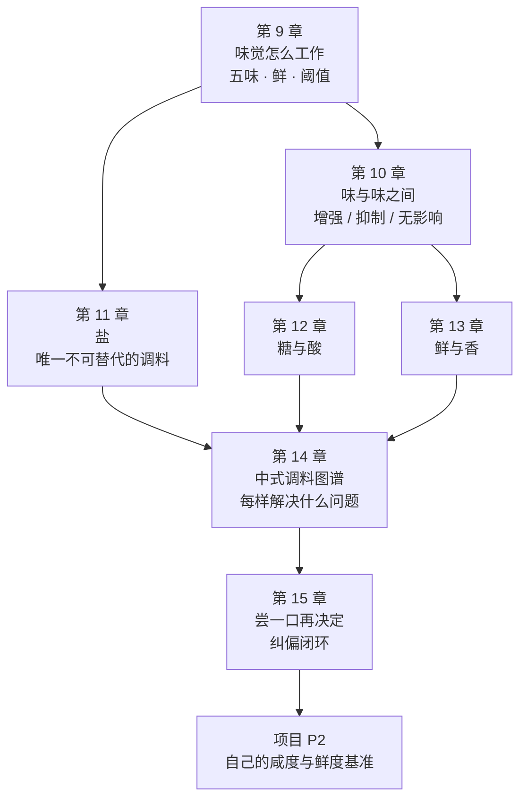

# 第二部分 · 味觉与调味原理：从"按菜谱放"到"按目标放"

> **第一部分讲的是食材身上发生了什么，这一部分讲的是你嘴里发生了什么。**
> 它们是两套完全不同的知识：前者是物理化学，后者是感官生理学。
> 而调味的全部困难在于——**你要用前者的手段，去达成后者的目标。**

## 为什么调味要单独占一个部分

因为绝大多数"做得不好吃"，并不是火候问题，而是**你说不出它缺什么**。

菜谱能告诉你"放 3 g 盐"，但它不能替你回答：

- 尝了一口觉得"差点意思"，差的是**盐、鲜、酸、香，还是褐变**？
- 已经很咸了却还是"没味道"——这可能吗？（可能，而且很常见）
- 太咸了怎么救？太酸了怎么救？加糖真的能压酸吗？
- 盐到底什么时候放？为什么有的菜要早放，有的菜必须最后放？

这些问题的答案不在食材里，**在感受里**。所以这一部分的顺序是：

> **先搞清楚"尝"这件事本身是怎么工作的（第 9、10 章），
> 再一样一样讲调料在解决什么问题（第 11~14 章），
> 最后把它们收成一套可以反复执行的纠偏流程（第 15 章）。**

## 这一部分的地图

## 这一部分的两条纪律

**第一条：只讲证据等级，不讲健康建议。**

调味是本书里"谣言密度"最高的区域——味精、钠、代糖、"重口味伤身"。
本书的处理方式始终一样：**复述官方机构与同行评议文献的结论及其适用范围，
不做摄入量建议、不做疗效或风险承诺**。你想吃多咸是你的事，
本书只负责让你**知道自己在做什么**。

**第二条：感官的结论比物理的结论更"软"，所以更要标清楚。**

温度和时间可以测量，"好吃"不能。感官研究里大量结论依赖于
**特定浓度、特定体系、特定人群**——换一个条件可能就不成立。
所以这一部分会**更频繁地出现 ⚠️ 标记**，也会更多地出现
"**这条只有方向，没有数值**"。

> **这不是本书偷懒，而是这个领域的真实状态。**
> 与其给你一个听起来精确的假数字，不如告诉你：
> **你自己的舌头才是这一部分的测量仪器——而它需要被标定。**
> （项目 P2 就是在做这件事。）

## 学完这一部分，你应该能

1. 尝一口就说出"它缺的是盐、是鲜、是酸、是香，还是缺褐变"；
2. 知道每种常用调料**解决什么问题**，以及**什么时候放**；
3. 有一套属于自己的**咸度基准**（而不是照搬克数）；
4. 对"这样吃对身体好/不好"这类说法，能分辨**哪些有官方结论、哪些只是流传**。

---

**从这里开始**：[第 9 章 · 味觉是怎么工作的](09-taste.md)。
第一个要打破的直觉是——**你以为的"味道"，大部分其实不是味觉。**
