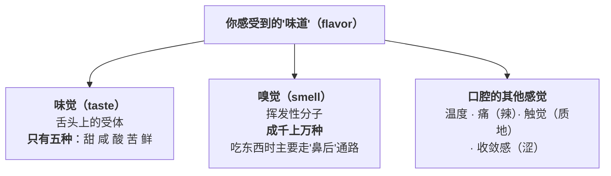

# 第 9 章 味觉是怎么工作的：五味、鲜与阈值

> **本章目标**：解释一个几乎每个人都遇到过、却很少被正确诊断的现象——
> **"这菜好像没什么味道。"**
>
> 学完这一章你会知道：这句话背后可能是**五种完全不同的问题**，
> 而其中最常见的那一种**根本不是缺盐**。
>
> 这一章也是全书"味"这条线的地基：后面六章（盐、糖酸、鲜香、调料图谱、纠偏流程）
> 都建立在这里的三个概念上——**受体、阈值、相互作用**。

## 9.1 先拆一个词：你说的"味道"，大部分不是味觉

日常语言里的"味道"，在感官科学里至少是三样东西叠在一起：

一篇综述给出的表述很直接：

> 除了味觉之外，**嗅觉、触觉以及化学刺激感（如辣）都对食物的"味道"有重大贡献**；
> **嗅觉的重要性可以很容易地通过在吃东西时阻断它来证明**——
> 只要捏住鼻子，整体的风味感受就会**大幅下降**。

> ## 本章最有用的一条诊断
>
> **"没味道"最常见的原因不是缺盐，而是缺香。**
>
> 因为**味觉只有五种，而香气有成千上万种**——一道菜"寡淡"的时候，
> 缺的往往是后者。继续加盐只会让它**又咸又没味**。
>
> **怎么当场区分**：捏住鼻子尝一口，松开鼻子再尝一口。
> **两口差别很小** → 说明这道菜本来就没什么香气 → **该补的是香，不是盐**（第 13、14 章）。

顺带给一个量级感：同一篇综述整理的气味阈值表里，
不少香气分子的阈值在**每升水零点几到十几微克**的量级
（例如麦芽味的甲基丙醛约 0.7 μg/L、爆米花味的 2-乙酰基噻唑约 10 μg/L）。

> **换句话说：香气是一种"极微量就能被察觉"的东西。**
> 这解释了为什么**最后淋的那几滴香油、那把香菜**能改变整道菜的感受，
> 也解释了为什么它们**一加热就白费**（第 3 章讲过挥发）。

## 9.2 五味：五套不同的受体

现在公认的**基本味觉**有五种。一篇 2022 年的综述给出的分类与机制：

| 味 | 受体 / 通道 | 它在演化上意味着什么 |
|----|-----------|------------------|
| **甜** | **T1R2 + T1R3** 二聚体 | 能量（糖） |
| **鲜**（umami） | **T1R1 + T1R3** 二聚体 | 蛋白质 / 氨基酸 |
| **苦** | **T2R 家族**（数量众多，且个体间差异大） | 有毒物质的警报——综述指出人与其他哺乳动物对强苦味有**先天的回避** |
| **酸** | 目前最被看好的是 **Otop1**（一种质子通道） | 未成熟 / 腐败的信号 |
| **咸** | **上皮钠通道（ENaC）**被认为是主要候选 | 电解质 |

⚠️ **两条必须说清楚的不确定性**：

1. **咸味受体的直接证据仍不充分**。综述的表述是：ENaC"被认为是"负责检测盐的受体，
   支持证据主要来自基因敲除小鼠，而"**针对 ENaC 的直接验证研究至今尚未成功**"；
   另有证据提示存在**两类**咸味感受细胞（对低浓度敏感的一类、对高浓度不敏感的一类）。
2. **酸味受体的定论也还在路上**：Otop1 是"最有希望"的候选（体外表现为质子通道），
   早前的一些候选已被后续研究否定。

> **本书为什么要写这些不确定性**：因为"咸味受体"听起来像一个已经解决的问题，
> 而它不是。**知道科学在哪里还没定论，是判断厨房说法的基本功。**

### 顺手拆掉一个流传极广的图：舌头的"味觉分区"

那张"舌尖甜、两侧咸/酸、舌根苦"的图，**与现代味觉生理学不符**。两条证据：

| 证据 | 来源 |
|------|------|
| 味蕾位于**轮廓乳头、菌状乳头和叶状乳头**上；而覆盖舌面大部分的**丝状乳头感受触觉、温度和痛觉，不含味蕾、不能感受味道** | 味觉综述（2022） |
| **每个味蕾都含有能对各种味觉品质做出反应的细胞**；也就是说，**味觉细胞是"化学调谐"的，而味蕾不是** | 味觉信号转导综述（2019） |

> **所以准确的说法是**：**不同区域的敏感度可以有差别，但"某个区域只管某一种味"是错的。**
> ⚠️ 这张图的来源（通常被归因于对二十世纪初某项研究的误读与转译）
> 本书**没有核到**一手考证，因此只说"现代生理学证据不支持分区说"，不复述那段来历。

## 9.3 辣、麻、涩、凉：它们不是味觉

这一条对做菜非常重要，因为**它们走的是完全不同的通路，遵循完全不同的规律**。

综述的表述是：**"辛辣（pungency）与收敛（astringency）主要由躯体感觉系统检测，
因此不被列入五种基本味觉。"**

而温度与刺激的感受靠一族**温度敏感的离子通道**，它们各有激活阈值：

| 通道 | 激活条件 |
|------|---------|
| TRPV1 | 高于 **43 °C** |
| TRPV2 | 高于 **52 °C** |
| TRPV3 | 约 **34~38 °C** 以上 |
| TRPV4 | 约 **27~35 °C** 以上 |
| TRPM8 | 低于约 **25~28 °C** |
| TRPA1 | 低于 **17 °C** |

综述还指出：**高于 43 °C 和低于 15 °C 会伴随疼痛感**，
但"我们仍然经常喝远高于痛觉与组织损伤温度的热饮"。

> ## 这张表解释了四件厨房里的事
>
> 1. **辣椒的"辣"和"烫"共用同一套报警系统**——所以**热的辣菜比凉的辣菜更辣**，
>    而**放凉之后辣感会减弱**；
> 2. **薄荷的"凉"和低温共用另一套**——所以薄荷、绿茶让你觉得"清凉"，
>    而这和温度计上的温度无关；
> 3. **辣不能靠"多喝水"解决**（辣椒素不溶于水），
>    这一点的通俗解释在厨房里流传很广，⚠️ 本书**没有核到**一手对照实验，只标机制推理；
> 4. **涩（茶、柿子、红酒）是触觉层面的**：综述提到富含脯氨酸的唾液蛋白会与多酚**沉淀**，
>    造成**润滑感丧失**——所以涩是"嘴里发干发涩"，不是"尝到某种味道"。

> **做菜时的用法**：**辣、麻、涩、凉不能用"味"的逻辑去平衡。**
> 太咸可以用稀释来救，**太辣不能**——因为它是痛觉，
> 常见的做法（加油脂、加乳制品、加糖）走的是另一条路，第 14 章再展开。

## 9.4 阈值：为什么"加了一点点盐，忽然就有味道了"

**阈值**[^1]分两种：**察觉阈**（能感觉到"有点什么"）和**识别阈**（能说出它是什么）。

> **阈值解释了调味的"非线性"**：
> 在阈值以下，加多少都像没加；越过阈值之后，感受迅速出现。
> **所以"我明明放盐了啊"和"这菜没味道"可以同时是真的。**

更有意思的是：**阈下浓度并非没有作用**。味觉综述提到：

> 各种**焦谷氨酰肽与 Amadori 产物**在**阈下浓度**就能**增强酱油的鲜味**；
> 而这些化合物在**阈上浓度**下通常被感知为**苦**。

> **这条给了两个厨房启示**：
> 1. **有些东西你尝不出它，但它在起作用**——这正是"高汤""底味""一点点酱油"的意义；
> 2. **同一种物质，浓度不同，作用可能相反**（阈下增鲜，阈上发苦）。
>    所以**"好东西多放点"经常是错的**。

**个体差异有多大**：苦味受体 **T2R** 家族有明显的**多态性**，
不同个体对特定苦味物质的敏感度差异显著（综述在人、黑猩猩和小鼠中都提到这一点）。

> ## 本章的第一条可迁移规则
>
> **别人的克数不是你的克数。**
> 阈值因人而异（年龄、基因、当天状态、你上一口吃了什么都会影响）。
> **所以本书从头到尾不给"放几克盐"，而是教你建立自己的基准**——
> 这正是项目 P2 要做的事。

## 9.5 鲜：最晚被承认的那一味

**鲜味**[^2]由日本学者**池田菊苗于 1909 年**提出并命名（umami，"美味"之意）。
第一个被鉴定出来能引起鲜味的化合物是**谷氨酸**。

综述描述它的特点是：**"连续性、满口感、冲击感、温和、厚度"**，
并被描述为一种"**满足感**"；有意思的是，
**它常被形容得像香气，尽管它本身基本没有气味**。

### 协同：1 + 1 远大于 2

这是鲜味最有厨房价值的性质：

> **核苷酸（IMP、GMP）与谷氨酸之间存在强烈的协同作用**（1960 年代首次报道）。
> 一项经典研究测量了 MSG 与 IMP 混合物的鲜味强度：
> 固定总量、改变 IMP 的比例（0~100%），
> **当 IMP 占比在 20%~80% 之间时，鲜味强度大幅上升**——曲线呈**倒 U 形**。

而综述紧接着指出了一件事：

> **几千年来，世界各地的菜系都在把"含谷氨酸的食材"和"含核苷酸的食材"配在一起**——
> 日本的**昆布 + 鲣节**、西方的**牛肉 + 洋葱、胡萝卜、芹菜**，都是这个模式。

> ## 本章的第二条可迁移规则
>
> **想要"更鲜"，不要只加多同一种鲜——去加另一类鲜。**
>
> | 偏"谷氨酸"的一侧 | 偏"核苷酸"的一侧 |
> |----------------|----------------|
> | 海带 / 昆布、番茄、酱油、豆瓣、发酵制品、部分奶酪 | 干香菇、干贝、肉类、鱼干（鲣节）、鸡骨 |
>
> **中式厨房里的很多"经典搭配"都落在这条线上**：
> 香菇 + 酱油、火腿 + 笋、番茄 + 牛肉、白菜 + 干贝。
> ⚠️ 但要注意：上表是**按类型归组**，**本书没有核到**各食材具体含量的一手数据，
> 所以**只用它来指导"搭配方向"，不要拿它算配比**。

### 盐和鲜是互相帮忙的

味觉综述给了两条相关但不同的结论：

1. **只需要少量氯化钠，就能提高鲜味的感知**；而且 **MSG 与核苷酸之间的协同也会被 NaCl 促进**；
2. ⚠️ 但同时：**盐的存在并不改变鲜味的阈值**——也就是说，
   盐提升的是**阈上的强度感受**，而不是"让你更早尝到鲜"。

反过来，第 3 节引用的一篇减钠综述给出了另一个方向的数据（已登记在出处里）：

> **0.10% 的味精可以增强咸味强度**；多种鲜味物质在不同浓度下都能增强咸味，
> 在最佳情形下实现了约 **24.25%** 的减钠。

> **所以"盐和鲜"是一对互相放大的组合**。
> 实用推论：**觉得淡的时候，先试试补鲜而不是补盐**——
> 有时候半勺酱油/一点高汤解决的问题，你原本打算用一勺盐去解决。

### 酸碱会削弱鲜味

味觉综述还指出：**味精在强酸性或强碱性条件下鲜味强度下降**，
并从分子结构上给了解释（α-氨基与 γ-羧基之间的静电相互作用被破坏，无法形成结合所需的构型）。

> **厨房里的推论**：**一道很酸的菜里"觉得不鲜"，先调酸度，再考虑加鲜味调料**（第 8 章）。

## 9.6 味与味之间：只有三种结果

这是第 10 章的主题，这里先给结论，因为它影响本章的所有实操。

一篇关于通过感官相互作用减钠的综述（转引 Keast & Breslin 2003）指出：

> 混合味之间可能出现三种结果：**增强、抑制、或没有影响**；
> 且增强效应在**低到中等**浓度下更明显。

它给出的一组具体数据（注意：这些是**在溶液里测阈值**，不是在菜里）：

| 在 NaCl 溶液里加入 | 咸味的**察觉阈值**变化 |
|------------------|------------------|
| 0.40 M 蔗糖 | 下降约 **60%** |
| 0.0042 M 柠檬酸 | 下降约 **56%** |
| 0.00025 M 奎宁（苦） | 下降约 **33%** |

> ⚠️ **务必注意这三行说的是什么**：
> 它们说的是"**别的味道让咸味更容易被察觉**"，
> **不是**"加糖会让菜更咸"，**更不是**厨房里常说的"**盐能提甜**"。
> **"盐提甜"这个方向在该综述里没有对应数据**——本书因此把它标为
> ⚠️ **证据不足**，不当定论用（详见出处登记 §5.3 的说明）。

## 9.7 两个会骗你的变量：温度和你自己

### 温度

分子美食学综述在讲冰淇淋时提到一句很有用的话：

> **在低温下，我们对甜味的敏感度会下降。**
> 这也是为什么冰淇淋的含糖量常高达 15%——高于大多数其他甜点。

> **厨房推论（非常实用）**：
> - **凉着吃的东西要调得更浓**（凉菜、沙拉、冷面的汁）；
> - **热菜在锅里尝的味道，端上桌会变**——温度降了，感受会变；
> - **尝味要在"接近实际食用温度"时尝**，否则你在给另一道菜调味。

### 你自己

- **适应**：连续尝同一种味道，感受会钝化（这就是"做着做着就越放越咸"的原因之一）；
- **个体差异**：苦味受体的多态性已被反复报道；
- **状态**：综述提到老年人常见唾液分泌减少、味觉与嗅觉受体功能受损，
  因而**同样的菜对不同人是不同的味道**。

> **对策（专业厨房的通行做法，属于惯例）**：
> **尝味之间用清水/白粥类"清口"**，并且**尽量让别人也尝一口**。
> ⚠️ 这是经验做法，本书未核到对照研究。

## 9.8 本章的可迁移规则：尝一口时的四个问题

> ## 尝一口，按顺序问这四个问题：
>
> | 顺序 | 问题 | 怎么判断 | 如果是，补什么 |
> |------|------|---------|------------|
> | **①** | 是**缺香**吗？ | **捏鼻子尝一口 vs 松鼻子尝一口**，差别小 = 缺香 | 挥发性的东西，**最后放**（第 13、14 章） |
> | **②** | 是**缺鲜**吗？ | 感觉"扁平、不厚、一下就没了" | 补另一类鲜（谷氨酸侧 ↔ 核苷酸侧），**别只加同一种** |
> | **③** | 是**缺盐**吗？ | 各种味道都"隔着一层"、模糊 | 少量多次，每次等 10 秒再判断 |
> | **④** | 是**缺酸**吗？ | 觉得腻、沉、闷 | 出锅前一点点酸（第 8、12 章） |
>
> **第 5 个问题留给第 7 章**：**是不是缺褐变？**
> 如果这道菜从头到尾都泡在水里，那它的问题可能根本不在调味台上。
>
> **顺序为什么是这个**：因为**加盐是不可逆的**，而补香、补鲜、补酸的代价更小。
> **先做可逆的事，再做不可逆的事。**

## 9.9 常见说法辨析

按本书约定标注**证据强度**：✅ 有共识 / ⚠️ 有争议 / ❌ 明确错误 / 缺乏证据。
来源见[出处登记](../../standards.md)。

| 说法 | 判定 | 说明 |
|------|------|------|
| "舌尖尝甜、舌根尝苦，舌头分区" | ❌ **与现代生理学不符** | 两条证据：①味蕾位于轮廓、菌状、叶状乳头上，而覆盖舌面大部分的**丝状乳头不含味蕾**、只感受触觉温度痛觉；②**味觉细胞是化学调谐的，但味蕾不是**——每个味蕾都含有能响应各种味觉品质的细胞。敏感度可有区域差别，但"某区只管某味"是错的 |
| "辣是一种味道" | ❌ **不是味觉** | 综述明确：**辛辣与收敛（涩）主要由躯体感觉系统检测，不列入五种基本味觉**。辣走的是温度/痛觉通道（TRPV1 在**高于 43 °C** 时激活），所以**热的辣菜更辣**、凉了会减弱 |
| "味精有害 / 吃了口渴头疼" | ❌ **官方结论不支持"有害"**；个别症状的说法证据有限 | 美国 FDA：在食品中添加味精"**一般认为是安全的（GRAS）**"；味精里的谷氨酸与食物蛋白消化产生的游离谷氨酸**化学上相同**；典型膳食每天从蛋白质获得约 13 g 谷氨酸，而添加味精约 0.55 g；**对照试验中科学家未能稳定地诱发反应**。FASEB 报告同时指出敏感个体在**不随餐**摄入 3 g 或以上时可能出现短暂轻微症状，而"一份添加味精的食物通常含不到 0.5 g"。⚠️ **本书不做任何摄入量建议** |
| "鸡精/味精是'科技与狠活'，天然食材才有鲜" | ❌ **混淆了来源与分子** | 鲜味来自谷氨酸与核苷酸这些**具体分子**；海带、番茄、香菇、酱油里同样是它们。FDA 也指出**含天然游离谷氨酸的产品不得标"无味精"**。**用不用是口味与偏好问题，不是"天然 vs 化学"的问题** |
| "多放点鲜味调料就更鲜" | ⚠️ **通常不如"换一类"有效** | 协同效应的经典数据：在 MSG 与 IMP 的混合物中，**IMP 占比 20%~80% 时鲜味强度大幅上升**（倒 U 形）。所以**加另一类**（谷氨酸侧 ↔ 核苷酸侧）比加更多同一类更有效。这也是"昆布+鲣节""番茄+牛肉"这类组合在全世界反复出现的原因 |
| "菜没味道就是盐不够" | ⚠️ **最常见的误诊** | "味道"至少由味觉 + 嗅觉 + 口腔感觉三部分构成，而**味觉只有五种、香气有成千上万种**。综述指出**捏住鼻子就能证明嗅觉的重要性**。先做"捏鼻测试"，再决定加什么 |
| "觉得淡就加盐" | ⚠️ **有时候补鲜更划算** | 减钠综述的数据：**0.10% 味精可增强咸味强度**；多种鲜味物质能增强咸味，最佳情形实现约 **24.25%** 的减钠。⚠️ 这些是在特定体系里测得的，**不能直接换算成你的菜** |
| "盐能提甜（西瓜撒盐、绿豆汤加盐）" | ⚠️ **证据不足，本书不当定论** | 可核到的数据是**反方向**的：在 NaCl 溶液里加蔗糖会让**咸味**的察觉阈值下降约 60%。而"盐使甜更强"在本书查到的综述里**没有对应数据**。混合味的结果有三种（增强/抑制/无影响），**不能假定某一种** |
| "尝的时候觉得刚好，端上桌就淡了" | ✅ **有机制支持** | 温度会改变感受：综述明确指出**低温下我们对甜味的敏感度下降**（冰淇淋含糖常达 15%）。**要在接近实际食用温度时尝味** |
| "做菜做到后面越放越咸" | ✅ **有机制支持（适应）** | 连续暴露于同一刺激会使感受钝化。专业厨房用"清口"和"让别人尝"来对抗。⚠️ 具体的清口方法属于惯例，本书未核到对照研究 |
| "阈值以下的量等于没放" | ❌ **不一定** | 味觉综述给了一个反例：多种**焦谷氨酰肽与 Amadori 产物在阈下浓度就能增强酱油的鲜味**，而它们在**阈上浓度**下反而被感知为苦。**同一种物质在不同浓度下的作用可能相反** |
| "喝水能解辣" | ⚠️ **机制推理，本书未核到对照** | 常见解释是辣椒素为脂溶性、水冲不走。本书**没有核到**一手对照实验，故只标机制推理。可确认的相邻事实是：辣走的是温度/痛觉通道，**所以降低食物温度会减弱辣感** |

## 9.10 🔎 下次做菜时的用处

1. **"没味道"先做捏鼻测试**：差别小 = 缺香，别加盐。
2. **觉得淡，先补鲜再补盐**——半勺酱油、一点高汤、几片香菇，往往比一勺盐更对症。
3. **补鲜要"换一类"**：已经放了酱油（谷氨酸侧），再加就加香菇/干贝/肉（核苷酸侧）。
4. **尝味要在接近上桌的温度尝**。锅边刚好 = 桌上偏淡（尤其是凉菜）。
5. **凉菜调得比热菜浓**——低温下你对甜（以及整体风味）的敏感度更低。
6. **尝三口就停一停，喝口水**。适应会让你越放越多。
7. **很酸的菜里别急着加鲜味调料**——先把酸调下来（第 8 章）。
8. **辣了不能靠稀释救**，它不是味觉。别把"太辣"和"太咸"用同一套办法处理。

## 9.11 思考题

1. "味道"由哪三部分构成？为什么说"没味道"最常见的原因不是缺盐？
   怎么在 10 秒内当场区分？
2. 五种基本味各自对应什么受体？哪两种的受体机制**至今仍不完全确定**？
   本书为什么要特地写出这种不确定性？
3. 为什么"舌头味觉分区图"是错的？请给出**两条**独立的证据。
4. 辣、涩为什么不算味觉？温度敏感通道的阈值表能解释哪几个厨房现象？
5. 什么是阈值？为什么说"阈值以下等于没放"是不一定成立的？请举出本章给的反例。
6. **【案例】** 你做了一锅冬瓜排骨汤，喝起来"很清淡、没什么味道"。
   已知：你放了盐、放了姜、没放其他调料。请回答：
   （a）按本章的四问顺序，你会怎么依次排查？
   （b）如果确认是"缺鲜"，你有哪几种补法？为什么不建议只是多加盐？
   （c）如果确认是"缺香"，你会在什么时候加什么？
   （d）这道菜有没有可能是第 7 章的问题（缺褐变）？怎么判断？
7. **【案例】** 你在做一道凉拌菜，在厨房里尝觉得味道刚好，端上桌吃却觉得淡。
   （a）给出至少两个可能的原因；（b）分别对应什么对策？
   （c）下次你会怎么调整"尝味"这个动作本身？
8. **【辨析】** "味精有害"——判断证据强度。
   请复述美国 FDA 的表述，并说明**本书为什么不给摄入量建议**。
9. **【辨析】** "西瓜撒点盐更甜"——判断证据强度。
   请说明本书查到的数据是哪个方向的，以及为什么"方向相反的数据"不能用来证明这句话。
10. 为什么本书说"补香、补鲜、补酸都可逆，加盐不可逆"？
    这对尝味纠偏的**顺序**意味着什么？

> 📖 **参考答案**（想清楚再看）：[Q1](../../qa/09-taste-qa.md#q1) ·
> [Q2](../../qa/09-taste-qa.md#q2) · [Q3](../../qa/09-taste-qa.md#q3) ·
> [Q4](../../qa/09-taste-qa.md#q4) · [Q5](../../qa/09-taste-qa.md#q5) ·
> [Q6](../../qa/09-taste-qa.md#q6) · [Q7](../../qa/09-taste-qa.md#q7) ·
> [Q8](../../qa/09-taste-qa.md#q8) · [Q9](../../qa/09-taste-qa.md#q9) ·
> [Q10](../../qa/09-taste-qa.md#q10)

## 9.12 本章实操

### 🅐 零成本版 · 任务一：捏鼻测试（现在就能做，5 分钟）

**需要**：任何有香气的食物（一块水果、一勺酱、一口汤都行）。

**做法**：捏住鼻子放进嘴里，充分咀嚼后**记录你尝到什么**；然后**松开鼻子**，再记录一次。

| 食物 | 捏着鼻子时我尝到 | 松开鼻子后我尝到 | 差别有多大（1~5） |
|------|--------------|--------------|--------------|
| | | | |
| | | | |
| | | | |

做完回答：

| 问题 | 你的答案 |
|------|---------|
| 捏着鼻子时，你还能分辨出"五味"中的哪几种？ | |
| 差别最大的是哪种食物？为什么？ | |
| 你家里哪道菜最经不起"捏鼻测试"？（差别小 = 香气少） | |

> **这个测试要一直用下去**：它是本书给"缺香还是缺盐"这个问题的**现场判据**。

### 🅐 零成本版 · 任务二：给自己做一次"鲜味配对练习"

不用开火。把家里的食材按"偏谷氨酸 / 偏核苷酸"分两栏（按本章 9.5 的归类方向），
然后看看你常做的菜有没有用到协同。

| 偏谷氨酸的一侧（海带、番茄、酱油、豆瓣、发酵品…） | 偏核苷酸的一侧（干香菇、干贝、肉、鱼干、鸡骨…） |
|------------------------------------|--------------------------------|
| | |
| | |

| 我常做的菜 | 它用到了哪一侧 | 另一侧缺不缺 | 可以加什么 |
|-----------|------------|------------|-----------|
| | | | |
| | | | |
| | | | |

> ⚠️ 这张表是**按类型归组**的方向性工具。
> 本书**没有核到**各食材的具体含量数据，**别拿它算比例**。

### 🅐 零成本版 · 任务三：找出你自己的咸度阈值（不用开火）

**需要**：水、盐、几个杯子、小勺。

**做法**：从一杯清水开始，每次加**极少量**盐，搅匀后尝一口（尝完漱口），
记录"第一次察觉到有点什么"和"第一次能确认是咸"分别在第几次。

| 第几次加盐 | 我尝到了什么 | 这是察觉阈还是识别阈 |
|-----------|------------|------------------|
| 1 | | |
| 2 | | |
| 3 | | |
| 4 | | |
| 5 | | |

做完回答：

1. 你的"察觉阈"和"识别阈"之间差了几次？
2. 找个家人朋友做同样的测试，你们一样吗？
3. 这个结果对"照着菜谱放几克盐"意味着什么？

> **这是项目 P2 的预演**。真正的标定会在那里系统地做一遍。

### 🅑 开火版 · 任务四：一碗清汤，四种加法（有灶台时做）

**需要**：一锅清淡的底汤（清水煮点蔬菜也行）、盐、酱油（或味精）、干香菇（或肉汤）、醋、香油/香菜。

把底汤分成五小碗，**每碗只做一种处理**，然后按同样的顺序尝。

| 碗 | 加了什么 | 我尝到的变化 | 它解决了"没味道"中的哪个问题 |
|----|---------|------------|----------------------|
| ① | 什么都不加（对照） | | |
| ② | 只加盐 | | |
| ③ | 只加一点酱油或味精（补谷氨酸侧） | | |
| ④ | ③ 的基础上再加香菇水/肉汤（补核苷酸侧） | | |
| ⑤ | 只加几滴香油/一点香菜（补香） | | |

做完回答：

1. ②和③哪一个让你觉得"更有味道"？为什么？
2. ④比③强多少？这符合"协同"的预期吗？
3. ⑤只加了香气，它改变了"味道"的感受吗？
4. 如果只能选一种加法救这碗汤，你选哪个？

> **这个实验是第 9 章的浓缩版**：它会让你**亲口体验到**
> "淡"不是一个问题，而是**四个不同问题**。

### 🅑 开火版 · 任务五：同一道菜，两个温度

**需要**：任意一道你常做的菜，做好后分成两份。

一份**趁热尝**并调到"刚好"，另一份**放到接近室温**再尝。

| 组 | 尝的温度 | 我的评价（咸淡、甜、酸、鲜） | 如果要调，我会加什么 |
|----|---------|------------------------|------------------|
| ① 热的 | | | |
| ② 凉的 | | | |

做完回答：

1. 同一道菜，两个温度下你的评价差多少？
2. 如果这是一道**凉菜**，你应该在什么温度下定味？
3. 以后你打算怎么改自己的"尝味"习惯？

> ⚠️ **安全提醒**：做这个实验时，不要让菜在室温下久放。
> 美国 FDA 的指引是易腐食品应在烹调后 **2 小时内**冷藏
> （环境温度高于 90 °F 时缩短到 1 小时）。**各国口径不同，以本地现行发布为准。**
> 尝完剩下的请及时冷藏或丢弃。

## 9.13 本章依据

本章引用的来源与核对状态详见[参考书目与出处登记](../../standards.md)，具体对应如下：

| 本章用到的内容 | 依据 |
|--------------|------|
| 五种基本味；**辛辣与收敛主要由躯体感觉系统检测，不列入基本味觉**；**丝状乳头感受触觉温度痛觉、不含味蕾**，味蕾位于轮廓/菌状/叶状乳头；**T1R2+T1R3 甜、T1R1+T1R3 鲜、T2R 家族苦**；**ENaC 被认为是咸味受体但直接验证尚未成功**、提示存在两类咸味细胞；**Otop1 是最有希望的酸味受体（质子通道）**；人对强苦味有先天回避；**鲜味由池田于 1909 年命名**、第一个被鉴定的鲜味化合物是谷氨酸；鲜味被描述为连续性、满口感、厚度与"满足感"，且**几乎无气味却常被形容得像香气**；**核苷酸（IMP/GMP）与谷氨酸的协同，IMP 占比 20%~80% 时鲜味强度大幅上升（倒 U 形）**；世界各地把谷氨酸食材与核苷酸食材配对（昆布+鲣节、牛肉+洋葱胡萝卜芹菜）；**少量 NaCl 即可提高鲜味感知、并促进 MSG 与核苷酸的协同**，但**盐并不改变鲜味阈值**；**味精在强酸或强碱条件下鲜味强度下降**；**焦谷氨酰肽与 Amadori 产物在阈下浓度增强酱油鲜味、在阈上浓度被感知为苦**；苦味受体的多态性；老年人味觉与嗅觉功能下降 | 一篇关于人类味觉与鲜味物质的综述，*Journal of Food Science*，2022（PMC9314127；doi:10.1111/1750-3841.16101），✅ 开放获取全文 |
| **味觉细胞是"化学调谐"的、而味蕾不是**——每个味蕾都含有能响应各种味觉品质的细胞；甜/鲜/苦由 II 型细胞、酸由 III 型细胞转导 | 一篇关于味觉转导与信号传递新进展的综述，*F1000Research*，2019（PMC7059786；doi:10.12688/f1000research.21099.1），✅ 开放获取全文 |
| 味觉受体在味蕾中的分布与类型（T1R 二聚体、T2R、酸咸为离子通道，2010 年时咸味受体身份未定）；**嗅觉对风味的重要性可用"捏鼻子"证明**；气味阈值量级（μg/L 级，例如甲基丙醛约 0.7、2-乙酰基噻唑约 10）；**六种温度敏感通道的激活阈值**（TRPV1 >43 °C、TRPV2 >52 °C、TRPV3 约 34~38 °C、TRPV4 约 27~35 °C、TRPM8 <25~28 °C、TRPA1 <17 °C），**高于 43 °C 与低于 15 °C 伴随痛感**；**富含脯氨酸的唾液蛋白沉淀多酚、造成润滑感丧失（涩）**；**低温下对甜味的敏感度下降**（冰淇淋含糖常达 15%，典型食用温度 −13~−6 °C） | 一篇关于分子美食学的综述，*Chemical Reviews*，2010（PMC2855180；doi:10.1021/cr900105w），✅ 开放获取全文 |
| 混合味之间存在**增强、抑制、无影响**三种结果，增强在低到中等浓度更明显；在 NaCl 溶液中加 0.40 M 蔗糖使咸味察觉阈值下降约 **60%**、0.0042 M 柠檬酸约 **56%**、0.00025 M 奎宁约 **33%**；**0.10% 味精可增强咸味强度**；多种鲜味物质增强咸味、最佳情形实现约 **24.25%** 减钠 | 一篇关于通过感官相互作用实现减钠的综述，*Food Science & Nutrition*，2025（PMC12231224；doi:10.1002/fsn3.70548），✅ 开放获取全文。⚠️ 这些是**溶液体系**的阈值/强度数据，**不能直接换算到菜里** |
| 味精的安全性：GRAS；味精中的谷氨酸与食物蛋白消化产生的游离谷氨酸**化学上相同**；典型膳食约 13 g/天 vs 添加味精约 0.55 g；**对照试验未能稳定诱发反应**；FASEB 关于不随餐摄入 3 g 以上的表述；一份添加味精的食物通常含不到 0.5 g；含天然游离谷氨酸的产品不得标"无味精" | 美国 FDA「Questions and Answers on Monosodium Glutamate (MSG)」，✅。⚠️ 美国口径；**本书只复述机构结论，不做摄入量建议** |
| 易腐食品烹调后 2 小时内冷藏（高于 90 °F 时 1 小时） | 美国 FDA「Safe Food Handling」，✅。⚠️ 各国口径不同 |
| "盐能提甜"；"喝水解辣"；"清口方法"的有效性；各食材中谷氨酸与核苷酸的具体含量 | ⚠️ **均未核到**一手数据。"盐提甜"在本书查到的减钠综述中**没有对应数据**（该综述研究的是反方向），故标为证据不足；其余标为机制推理或惯例 |

[^1]: [阈值](../../glossary.md#threshold)（threshold）。
[^2]: [鲜味](../../glossary.md#umami)（umami）。

---

**下一章**：第 10 章 味与味之间——增强、抑制与互相掩盖。
本章末尾给了一个"三种结果"的结论；下一章要把它展开：
**为什么"加糖压酸""加盐提鲜"这类说法有的成立、有的不成立，
以及你该怎么判断眼前这一锅属于哪一种。**
