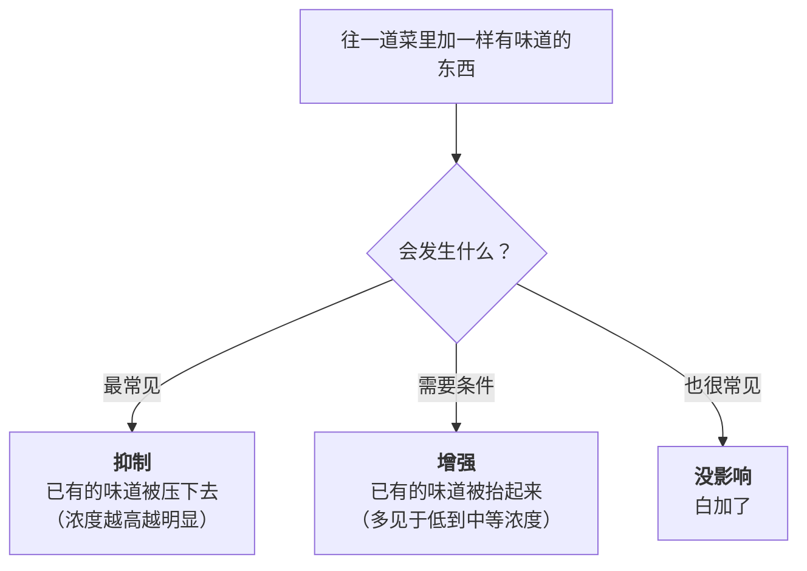
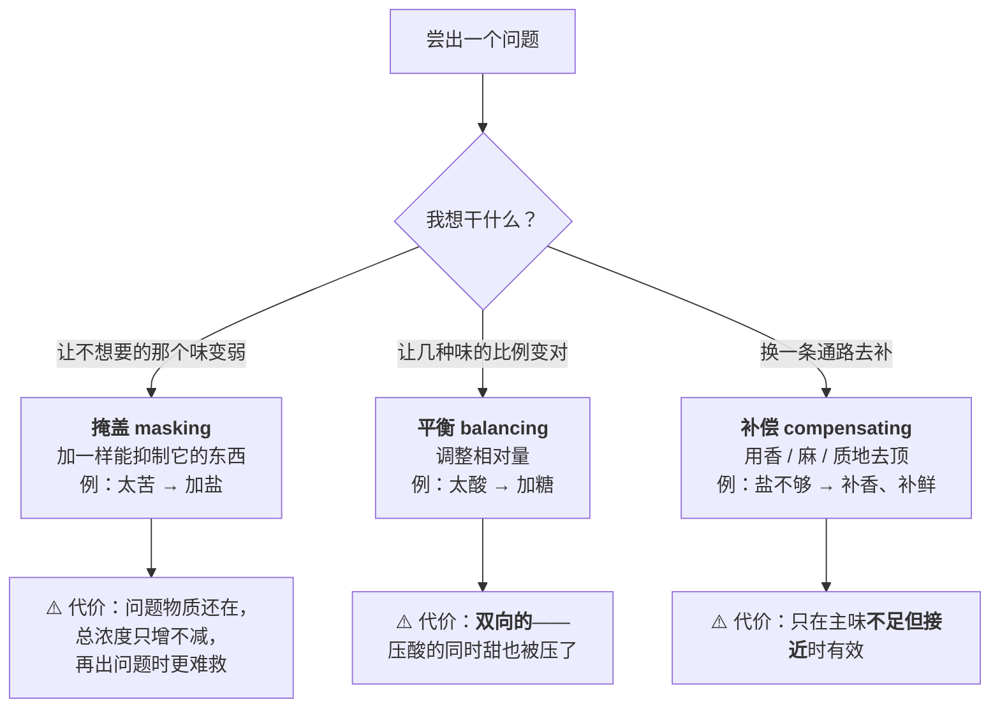

# 第 10 章 味与味之间：增强、抑制与互相掩盖

> **本章目标**：回答一个菜谱从来不解释、但你每天都在做的决定——
> **"我到底该加哪一样？"**
>
> 第 9 章说过：混合味只有三种结果——**增强、抑制、没影响**。
> 这一章要把这句话展开成**能用的东西**：哪些配对已经有证据、方向是什么、
> 在什么浓度下成立、以及**它们为什么经常反过来**。
>
> 学完这一章你会知道：**"太酸了加点糖"是对的，但它的代价不是你以为的那个。**

## 10.1 先立一个默认值：混在一起，通常是变弱

这是本章最重要、也最反直觉的一句话。

一篇 2024 年在受体层面研究盐与苦味的论文，在引言里复述了感官研究的基本观察：

> 在人类感官研究中，**每一种味觉属性在两成分混合物中通常都被感知为比单独尝时更弱**。

换句话说：

> ## 本章的第一条规则
>
> **"抑制"是默认，"增强"是例外。**
>
> 你往锅里加任何一样有味道的东西，**最可能的结果是把已有的味道压下去一点**，
> 而不是把它抬起来。**增强需要特定条件**（下一节讲），而抑制几乎不需要条件。
>
> **推论**：当你觉得"味道不够"而开始往里加东西的时候，
> **你很可能同时在削弱另一样你本来喜欢的味道**——
> 这就是"越调越平、越调越像调料味"的机制。

## 10.2 方向由浓度决定：同一对味，低浓度和高浓度结论相反

这是感官科学里最容易被厨房误读的一点。

一篇减钠综述转引 Keast 与 Breslin 2003 年那篇关于二元味味相互作用的总览，
给出的总结是：混合味之间可能出现**增强、抑制或没有影响**三种结果，
且**增强效应在低到中等浓度下更明显**。

另一篇 2022 年研究蔗糖—柠檬酸相互作用的论文，在引言里汇总了前人的结果，
这份汇总本身就说明了"浓度决定方向"：

| 前人报告的观察（该论文的引言汇总） | 方向 |
|--------------------------------|------|
| **低强度的甜**对不同味道**既有增强也有抑制**的效果 | 不定 |
| **中等或高强度的甜**通常**抑制**其他味觉 | 抑制 |
| 中高浓度的味精**抑制**甜味与苦味 | 抑制 |
| **高浓度**味精可**增强**氯化钠的咸味 | 增强 |
| 中等浓度的鲜味**增强**甜与咸、**抑制**酸与苦 | 混合 |

> ⚠️ **这张表怎么用**：它是**该论文对前人研究的复述**，各条来自不同实验、
> 不同物质、不同浓度，**本书没有逐条核到原始文献**。
> 它的价值不在于任何单独一行，而在于**整体形状**：
> **同一对味，换个浓度，结论就可能翻过来。**

**有一条一手实验正好印证了这一点。** 一项 2025 年关于"家庭做法如何影响咸度"的研究
（法国与南非的研究者，158 名未受训练的消费者，水煮鸡胸）发现：
加入烟熏培根香精带来的**咸味增强效应只在"低盐"那一档显著出现**，
在"常规盐"那一档，几种香精带来的增强效应**与零没有显著差别**。

> ## 本章的第二条规则
>
> **"补一样东西来救另一样"这个办法，只在原来那样本来就不多的时候管用。**
>
> 一道**已经很咸**的菜，你再怎么加鲜、加香，它也不会更咸——
> 但一道**盐放得偏少**的菜，一点酱油香就能把咸度撑起来。
>
> 所以正确的顺序永远是：**先把主味调到"不足但接近"，再用相互作用去补最后那一段**，
> 而不是先放足再来平衡。

## 10.3 已经比较确定的几对：一张可查的表

按**证据强度**排列。这一节是全章最该收藏的部分。

| 配对 | 方向 | 证据强度与来源 |
|------|------|--------------|
| **糖 ↔ 酸**（互相抑制） | 双向抑制 | ✅ **两个独立来源**。一项中丹跨文化消费者研究（中国 120 人、丹麦 139 人）：在 **2.50% 蔗糖 + 0.140% 柠檬酸**的水溶液里，甜度评分从 6.32 降到 **4.53**、酸度评分从 6.42 降到 **4.79**（两种酸结果一致，均 p<0.001）。另一项用阈值方法建模的研究发现：**柠檬酸背景浓度越高，蔗糖的绝对阈值越高**（即甜味被压住） |
| **盐 → 苦**（盐抑制苦） | 抑制 | ✅ 现象层面有共识。该结论最有名的出处是 1997 年《Nature》上一篇题目直译为"盐通过抑制苦味来增强风味"的短文（⚠️ 本书只核到其书目信息与标题，全文非开放获取）。2024 年一项受体层面的研究复述："此前的人类感官研究中观察到了钠对苦味的抑制"，并进一步发现**在受体层面只有部分受体—苦味物质配对被钠抑制**（测试的四个受体中只有 TAS2R16 的信号下降），因此**对多数苦味物质来说，这种抑制可能主要发生在中枢而不是舌头上** |
| **鲜 → 咸**（鲜增强咸） | 增强 | ✅ 一手 + 综述。一项用近红外光谱同时测感受与脑响应的研究：在 0.18%、0.58%、0.80% 的氯化钠溶液中加入 **0.10% 味精**，咸度感受与颞区脑响应被增强。减钠综述汇总：鲜味物质在最佳情形下实现约 **24.25%** 的减钠 |
| **鲜 → 苦**（鲜抑制苦） | 抑制 | ⚠️ 体外证据。2024 年那篇受体研究提到：体外表达的人苦味受体研究显示**味精能抑制 TAS2R16 的信号**。⚠️ 这是细胞实验，不是吃到嘴里的感受 |
| **酸 → 咸**（酸降低盐的阈值） | 增强 | ⚠️ 转引。减钠综述转引一项研究："**往氯化钠溶液里加醋，显著降低了盐的察觉阈与识别阈**"。另有转引称酸味与咸味**互相增强**。本书**未核到**这两条的原始文献 |
| **糖 / 酸 / 苦 → 咸**（都降低盐的察觉阈） | 阈值下降 | ✅ 第 9 章已给：0.40 M 蔗糖使咸味察觉阈降约 **60%**、0.0042 M 柠檬酸约 **56%**、0.00025 M 奎宁约 **33%**。⚠️ 这是**阈值**层面的数据，说的是"更容易被察觉"，不是"尝起来更咸" |
| **甜 ↔ 苦**（互相抑制） | 双向抑制 | ⚠️ 转引（"甜与苦之间是对称抑制"） |
| **盐 → 甜**（"西瓜撒盐更甜"） | — | ⚠️ **仍然证据不足，本书维持第 9 章的判定**。本轮查证中新见到一条**转引**表述（"低浓度的咸味物质可以增强甜味"），但它出现在一篇论文的引言汇总里，**本书没有核到原始实验**，因此**不升级为结论**。详见[出处登记](../../standards.md) |

> **读这张表的三条纪律**：
>
> 1. **✅ 的行才能当判断依据**，⚠️ 的行只能当"值得一试的方向"；
> 2. **所有这些数据都是在溶液或单一食品里测的**，你的锅里有几十种物质在同时作用，
>    **不能直接换算**；
> 3. **表里没有的配对，不代表不存在，只代表本书没查到**——
>    别用"它没写"来证明"它不成立"。

## 10.4 不只是"味和味"：真正好用的相互作用大多是跨模态的

这一节可能是全章对做菜帮助最大的部分。

第 9 章说过：你嘴里感受到的"味道" = 味觉 + 嗅觉 + 口腔其他感觉。
既然是三样叠加，那**能互相影响的就不只是味觉内部**。

### ① 香气能改写你尝到的味（OITE）

**气味引起的味觉增强**[^1]（odor-induced taste enhancement）是减钠研究里最热的方向。
本书核到的四条证据：

| 证据 | 内容 | 状态 |
|------|------|------|
| 中式豆豉的香气 | 从永川豆豉中筛出的气味物质里，**2-乙基-3,5-二甲基吡嗪、2,5-二甲基吡嗪、二甲基三硫醚、3-(甲硫基)丙醇、3-(甲硫基)丙醛**五种，在 **0.3% 氯化钠溶液**中能显著增强咸味感受 | ✅ 一手 |
| 酱油的香气 | 在氯化钠溶液中加入酱油气味，用**时间—强度法**测得的咸味被增强 | ✅ 一手 |
| 奶酪里的香气 | 低盐奶酪中加入**沙丁鱼香气**显著增强咸味、**黄油香气**增强程度较小；而**脂肪感**的增强只有在两种香气混合时才显著 | ✅ 一手 |
| 烟熏大蒜 | 在水煮鸡的汤里加入烟熏大蒜风味后，按"刚刚好"量表判断，**可以少放 33% 的盐而不影响接受度** | ✅ 一手 |

**但它有两个必须知道的限制条件**：

> **限制一：气味必须"对得上"。**
> 减钠综述的表述是：**只有一致且熟悉的风味组合才能有效产生这种增强**。
> 酱油香、培根香、豆豉香增强的是**咸**；草莓香增强的是**甜**。
> **你不能指望香草味让汤更咸。**
>
> **限制二：鼻后远比鼻前重要。**
> 综述给的对比很直接：**鼻后嗅觉**[^2]路径的相互作用能实现**高达 75%** 的减钠
> （香辛料组合用于人造黄油的那项研究），而**鼻前**（隔着空气闻）的效果小得多——
> 一项用培根气味的研究最高只到约 **13.60%**。
> **也就是说：香气要"在嘴里"才算数，闻着香没什么用。**

### ② 麻和辣也能增强咸味

第 9 章说过辣与麻不是味觉，但它们**确实会改变味觉**：

- 减钠综述汇总：**花椒引起的"麻"**（来自羟基山椒素类物质）在水相中**增强咸味**，
  相关研究报告的最高减钠幅度约 **39.06%**，典型的化学刺激感刺激物能实现 **30% 以上**；
- 也有研究报告**加入 0.5 或 1 μM 辣椒素提高了人对咸味的敏感度**。

> **这解释了川菜里一件长期被误解的事**：
> 麻辣菜"重口味"，不一定等于**盐重**。
> 花椒和辣椒本身就在替一部分盐干活。

### ③ 质地也会改变味道：勾芡之后必须重新尝

一项 2025 年的研究把增稠剂加进糖、酸、盐三种模型饮料（56 名健康受试者）：

> **咸（β = −4.16）、酸（β = −3.29）、甜（β = −3.43）三种味觉强度在加入增稠剂后都显著下降**（p < 0.001），
> 且**下降幅度与斜率随味觉种类差别很大**。

⚠️ 但作者同时指出一件重要的事：**黏度本身并不能很好地解释这个下降**
（把黏度作为解释变量时模型的解释力反而更低）。
也就是说，**"变稠 → 变淡"这个现象是确实的，但机理还没搞清楚**。

> ## 这条直接改掉一个厨房习惯
>
> **勾芡、收汁、加淀粉之后，味道会变淡——所以"勾完芡再尝一次"不是讲究，是必须。**
>
> ⚠️ 该研究用的是**模型饮料**（含较高浓度的盐溶液）与**专用增稠剂**，
> 不是中式芡汁，**方向可参考，幅度不可照搬**。

### ④ 分布均匀不均匀，也是一个旋钮

一篇 2026 年关于减糖的综述指出：**甜味强度不仅取决于糖的绝对浓度，
还取决于它在口腔加工过程中的时间与空间递送方式**；
在凝胶体系里，**做成有浓度梯度的分层结构可以比均匀配方少用约 20% 的糖而不损失风味**。

> **厨房里对应的说法**："**最后撒的那一点盐比拌进去的那一点更有用。**"

⚠️ **但本书必须给出一个诚实的反例**：前面提到的水煮鸡实验，
作者**正是抱着这个假设去做的**——他们预期"出锅后撒在表面的盐会形成不均匀分布、感觉更咸"。
结果是：在同等钠含量下，**汤里放盐与出锅后撒盐，咸度感受没有显著差异**（p > 0.2）。

> **所以准确的说法是**：
> **不均匀分布在某些体系里有用（凝胶、固体），在另一些体系里（带汤的炖煮）可能完全无效。**
> 带汤的菜里，盐迟早会均匀分布——**你撒在表面的那点盐，会跟着汤一起进嘴。**

## 10.5 三个不同的动作：掩盖、平衡、补偿

厨房里说"救一下这道菜"，其实是三种完全不同的操作，代价也完全不同。

> **三者的判据**：
>
> - **能补偿就补偿**（代价最小，因为它不增加任何一种味的浓度）；
> - **能平衡就平衡**（代价是双向的，但结果可控）；
> - **最后才掩盖**（代价最大，因为你只是在往上堆东西）。
>
> 这和第 9 章"先做可逆的事，再做不可逆的事"是同一条方法论。

## 10.6 本章的可迁移规则

> ## 尝出问题以后，按这个顺序问自己：
>
> | 顺序 | 问题 | 如果是 |
> |------|------|--------|
> | **①** | 我要的是**某一样更强**，还是**某一样更弱**？ | 这决定你是要"增强"还是"抑制"，两者的手段完全不同 |
> | **②** | 现在主味处在**什么量级**？ | **已经很足** → 相互作用帮不上忙，只能稀释或重做；**不足但接近** → 相互作用最有效 |
> | **③** | 有没有**不加味觉物质**的办法？ | 香（一致的香）、麻辣、质地、分布——这四条都能改变感受而不增加浓度 |
> | **④** | 我加的这一样，会**顺带压掉什么**？ | 加糖压酸，酸也在压甜；加盐压苦，盐也在改甜和鲜 |
> | **⑤** | 加完**等一下再尝**了吗？ | 盐要溶解扩散，芡要糊化，香要挥发出来——**立刻尝到的不是最终结果** |

## 10.7 常见说法辨析

按本书约定标注**证据强度**：✅ 有共识 / ⚠️ 有争议 / ❌ 明确错误 / 缺乏证据。
来源见[出处登记](../../standards.md)。

| 说法 | 判定 | 说明 |
|------|------|------|
| "太酸了加点糖就好了" | ✅ **方向成立**，但**代价常被忽略** | 两个独立来源支持甜与酸**互相抑制**：跨文化消费者研究中，2.50% 蔗糖使柠檬酸的酸度评分从 6.42 降到 4.79；阈值建模研究中柠檬酸浓度升高会抬高蔗糖的甜味阈值。**关键在于它是双向的**——你压住酸的同时，**这些糖的甜也被酸压掉了**。所以糖醋味不是"糖 + 酸"，是"两个都被削弱之后的新平衡"，也解释了为什么糖醋菜**要放的糖比你想象的多** |
| "苦的东西加点盐就不苦了" | ✅ **现象有共识**，机制**部分在中枢** | 最有名的出处是 1997 年《Nature》上一篇标题即为"盐通过抑制苦味来增强风味"的短文（⚠️ 本书只核到书目信息）。2024 年受体层面的研究复述了这一感官观察，但发现**在受体层面只有部分配对被钠抑制**（四个受体中只有 TAS2R16），推断对其他苦味物质而言"中枢效应可能占主导"。**厨房推论**：苦瓜、某些青菜、咖啡里加一点盐是有道理的——但它是**掩盖**，不是去除 |
| "加了鲜味调料就会更咸" | ⚠️ **在低盐时成立，高盐时未必** | 一手研究：在 0.18%~0.80% 的氯化钠溶液中加 0.10% 味精增强咸味感受；但同一研究发现味精对咸味**持续时间**的作用**只限于低与中等浓度**的盐。水煮鸡实验里，香气增强效应也**只在低盐档显著** |
| "香菜/香油/胡椒只是增香，不影响咸淡" | ❌ **与证据不符** | 气味引起的味觉增强已在多个体系里重复：豆豉气味物质在 0.3% 盐水中增强咸味、酱油气味增强咸味、沙丁鱼香气增强低盐奶酪的咸味、烟熏大蒜让水煮鸡**少放 33% 盐**仍被接受。**香气确实会改变你尝到的咸淡** |
| "闻着香就等于吃着香" | ⚠️ **不等价，鼻后才是主战场** | 减钠综述明确对比：**鼻后嗅觉**的相互作用可实现高达 **75%** 的减钠，而**鼻前**（隔空闻）最高只到约 **13.60%**。所以"端上桌香气扑鼻"和"入口有味"是两件事 |
| "什么香气都能用来补味" | ❌ **必须"对得上"** | 综述表述：**只有一致且熟悉的风味组合**才能有效产生气味引起的味觉增强。咸味要配"闻起来就咸"的香（酱油、豆豉、腊味、鱼干），甜味要配甜香。**乱配香气不会增强，只会变怪** |
| "勾芡只影响外观和挂汁，不影响味道" | ❌ **会变淡** | 一手研究：加入增稠剂后咸、酸、甜三种强度**都显著下降**（p < 0.001）。⚠️ 但同一研究指出**黏度本身解释不了这个下降**，机理待定。**操作结论不变：勾完芡要重新尝** |
| "最后撒的盐比拌进去的更咸" | ⚠️ **分体系，带汤的菜里没被证实** | 减糖综述支持"空间不均匀分布能少用约 20% 的糖"（凝胶体系）。但一项一手实验专门检验了这个假设：水煮鸡在**汤里放盐**与**出锅后撒盐**、同等钠含量下，咸度感受**没有显著差异**（p > 0.2）。**干的、固体的、表面吃得到颗粒的菜可能成立；带汤的菜不成立** |
| "麻辣就是重口味，一定放盐多" | ⚠️ **不一定** | 花椒的"麻"与辣椒素都被报告能**增强咸味**，相关研究的最高减钠幅度约 **39.06%**。**麻辣可以是替代盐的手段，而不只是叠加在盐之上** |
| "西瓜撒盐更甜" | ⚠️ **证据不足（维持第 9 章判定）** | 本轮查证新见到一条**转引**称"低浓度的咸味物质可增强甜味"，但**未核到原始实验**，因此**不升级为结论**。可核到的一手方向仍然是反过来的（糖降低咸味阈值）。**本书继续不把它当定论** |
| "混着加总比只加一样好" | ❌ **默认是变弱** | 感官研究的基本观察是：**每种味在二元混合物中通常都比单独尝时更弱**。"抑制是默认，增强是例外"——加得越杂，越容易得到一锅**谁也不突出**的味道 |

## 10.8 🔎 下次做菜时的用处

1. **加东西之前先想一秒：我会顺带压掉什么。** 加糖压酸的同时，甜也被酸压着。
2. **主味不足但接近时，才轮到"相互作用"上场。** 已经很咸的菜，加什么都救不回咸度。
3. **香要"对得上"才有用**——补咸用酱油/腊味/豆豉/鱼干这一路的香，别拿甜香去补咸。
4. **香要在嘴里才算数**：鼻后 > 鼻前。所以香油是**淋在菜上**，不是喷在空气里。
5. **勾芡、收汁之后一定重新尝**——变稠会让三种味觉都变淡。
6. **苦（苦瓜、某些青菜）先试一点盐**，比试糖更对症。
7. **麻辣可以替一部分盐的活**，不必在麻辣的基础上再加重盐。
8. **别用"多加几样"去救一道菜**——混合的默认结果是每一样都变弱、整体变平。

## 10.9 思考题

1. 为什么本书说"抑制是默认、增强是例外"？这个默认值对"往锅里加东西"这个动作意味着什么？
2. 为什么同一对味在低浓度和高浓度下结论可能相反？请举出本章给的**一条一手证据**。
3. "糖压酸"成立吗？请给出**两个独立来源**的数据，并说明它**双向**的那一面是什么。
4. "盐抑制苦"的证据处在什么层次？为什么本书说这种抑制"可能主要发生在中枢"？
5. 什么是"气味引起的味觉增强"？它的**两个限制条件**分别是什么？
6. 鼻前嗅觉和鼻后嗅觉在减钠效果上差多少？这对"香油什么时候放"意味着什么？
7. **【案例】** 你做了一道番茄牛腩，尝起来"又酸又寡淡，还有点苦"。
   已知你放了番茄、盐、少量酱油，炖了 90 分钟。
   （a）按本章的五问顺序，你会怎么排查？
   （b）"酸"和"苦"你打算分别用什么手段处理？属于掩盖、平衡还是补偿？
   （c）如果你决定加糖，请说明你预期会付出什么代价；
   （d）如果你决定加香（比如出锅前一点点香菜或胡椒），你预期它能解决哪个问题、不能解决哪个问题？
8. **【案例】** 你做了一锅勾了芡的汤，出锅前尝觉得刚好，勾完芡端上桌大家都说淡。
   （a）给出本章能解释的那个原因；（b）本书为什么说这条的"机理待定"？
   （c）下次你打算把"尝味"这个动作放在流程的哪一步？
9. **【辨析】** "最后撒的盐比拌进去的更咸"——判断证据强度。
   请说明支持它的证据来自什么体系、反对它的一手实验又是怎么做的，
   以及你会在什么菜上相信它、什么菜上不相信它。
10. **【辨析】** "西瓜撒点盐更甜"——本书这一轮查证有没有改变第 9 章的判定？为什么没有？
    这体现了本书的哪条纪律？
11. 掩盖、平衡、补偿三个动作的代价分别是什么？为什么本书建议的顺序是"补偿 → 平衡 → 掩盖"？

> 📖 **参考答案**（想清楚再看）：[Q1](../../qa/10-taste-interaction-qa.md#q1) ·
> [Q2](../../qa/10-taste-interaction-qa.md#q2) · [Q3](../../qa/10-taste-interaction-qa.md#q3) ·
> [Q4](../../qa/10-taste-interaction-qa.md#q4) · [Q5](../../qa/10-taste-interaction-qa.md#q5) ·
> [Q6](../../qa/10-taste-interaction-qa.md#q6) · [Q7](../../qa/10-taste-interaction-qa.md#q7) ·
> [Q8](../../qa/10-taste-interaction-qa.md#q8) · [Q9](../../qa/10-taste-interaction-qa.md#q9) ·
> [Q10](../../qa/10-taste-interaction-qa.md#q10) · [Q11](../../qa/10-taste-interaction-qa.md#q11)

## 10.10 本章实操

### 🅐 零成本版 · 任务一：自己测一次"甜酸互相抑制"（不用开火）

**需要**：水、糖、白醋（或柠檬汁）、三个杯子、小勺。

按下面配三杯，**顺序尝**（每杯之间用清水漱口），只记你的感受。

| 杯 | 里面有什么 | 我尝到的甜度（0~10） | 我尝到的酸度（0~10） |
|----|-----------|------------------|------------------|
| ① | 只有糖水（甜到"刚好有点甜"就行） | | — |
| ② | 只有酸水（酸到和①的甜"差不多强"） | — | |
| ③ | 把①和②**等量混合** | | |

做完回答：

| 问题 | 你的答案 |
|------|---------|
| ③里的甜，比①弱了多少？（大致百分比） | |
| ③里的酸，比②弱了多少？ | |
| 你是"被压得多的人"还是"几乎不被压的人"？ | |

> **对照参考**：那项中丹研究里，2.50% 蔗糖与 0.140% 柠檬酸混合后，
> 甜度评分从 6.32 降到约 4.5、酸度从 6.4 降到约 4.8——**两边都掉了约四分之一到三成**。
> ⚠️ 但该研究还做了聚类分析：**有一群人几乎不被压**
> （某个聚类里甜度从 6.62 只降到 6.28）。
> **所以你测出来和参考值不一样是正常的，那正是重点。**

### 🅐 零成本版 · 任务二：把"相互作用"从菜谱里找出来

拿一份你手边的菜谱（糖醋类、红烧类、凉拌类都行），把每一样调料按**它在这道菜里的角色**归类。

| 调料 | 它提供什么味 | 它可能**压住**了什么 | 它可能**增强**了什么 | 我的判断依据 |
|------|-----------|------------------|------------------|------------|
| | | | | |
| | | | | |
| | | | | |

做完回答：

1. 这道菜里有没有一样调料，**主要作用其实是"压"而不是"加"**？
2. 如果把它去掉，你预计哪一样味道会突然冒出来？
3. 这份菜谱里有没有"补偿"型的手段（香、麻、质地）？

### 🅐 零成本版 · 任务三：给自己列一张"补偿清单"

不用开火。翻一遍你的调料柜与冰箱，把能**不增加咸度**却能改变感受的东西列出来。

| 手段 | 我家里有什么 | 它对得上哪种味（一致性） |
|------|------------|--------------------|
| 咸香型香气（酱油、腊味、豆豉、虾皮、鱼干…） | | 咸 |
| 甜香型香气（桂皮、香草、某些水果…） | | 甜 |
| 麻 / 辣（花椒、辣椒…） | | 咸 |
| 酸（醋、柠檬、番茄…） | | 咸（降低阈值）/ 平衡 |
| 质地（芡、油、乳化…） | | ⚠️ 方向是**削弱** |

> **这张表是第 15 章纠偏流程的原材料**，建议贴在厨房里。

### 🅑 开火版 · 任务四：一锅汤，五碗对照（有灶台时做）

**需要**：一锅**偏淡**的底汤（关键：**必须偏淡**，因为增强效应在低浓度时才明显）、
盐、酱油、花椒（或胡椒）、香油/香菜、淀粉。

把底汤分成五小碗，**每碗只做一种处理**：

| 碗 | 处理 | 咸度（0~10） | 整体"有味道"程度（0~10） | 我的判断 |
|----|------|-----------|--------------------|---------|
| ① | 对照，什么都不加 | | | |
| ② | 只加**一小撮盐** | | | |
| ③ | 不加盐，只加**几滴酱油**（补一致的香 + 鲜） | | | |
| ④ | 不加盐，只加**一点花椒或胡椒**（补麻/辣） | | | |
| ⑤ | 不加盐，只**勾一点薄芡** | | | |

做完回答：

1. ③和④的咸度评分，比①高吗？高多少？
2. ⑤的咸度评分比①低吗？（本章预期它会低）
3. 如果现在把②的盐量减半、同时做③的处理，你觉得能不能达到②的效果？
4. **加强版**：把底汤调到"已经足够咸"，再重复③④。**增强效应还在吗？**
   （本章预期：会明显变弱甚至消失）

> **第 4 问是这个实验的核心**：它验证的是本章第二条规则——
> **相互作用只在主味不足时帮得上忙。**

### 🅑 开火版 · 任务五：糖醋汁的"双向抑制"实测

**需要**：醋、糖、水、四个小碗。

配一份基础糖醋汁（比例随你），然后做四个版本：

| 版本 | 糖 | 醋 | 我尝到的甜 | 我尝到的酸 | 整体评价 |
|------|----|----|---------|---------|---------|
| ① | 1 份 | 1 份 | | | |
| ② | 2 份 | 1 份 | | | |
| ③ | 1 份 | 2 份 | | | |
| ④ | 2 份 | 2 份（两个都翻倍） | | | |

做完回答：

1. ④和①相比，**总浓度翻倍了，但"甜酸比"没变**——尝起来是"两倍强"吗？
2. 要让一份糖醋汁"酸得明显"，你觉得是加酸有效，还是减糖有效？为什么？
3. 这个实验能解释"为什么糖醋菜里的糖用量总是比想象中多"吗？

> ⚠️ **安全提醒**：实验剩下的汤汁不要在室温下久放。
> 美国 FDA 的指引是易腐食品在烹调后 **2 小时内**冷藏
> （环境温度高于 90 °F 时缩短到 1 小时）。**各国口径不同，以本地现行发布为准。**

## 10.11 本章依据

本章引用的来源与核对状态详见[参考书目与出处登记](../../standards.md)，具体对应如下：

| 本章用到的内容 | 依据 |
|--------------|------|
| 混合味的三种结果（增强 / 抑制 / 无影响）与"增强在低到中等浓度更明显"；0.40 M 蔗糖 / 0.0042 M 柠檬酸 / 0.00025 M 奎宁分别使咸味察觉阈下降约 60% / 56% / 33%；**加醋显著降低盐的察觉阈与识别阈**（转引）；鲜味物质最佳情形减钠约 **24.25%**；**只有一致且熟悉的风味组合才能有效产生气味引起的味觉增强**；**鼻后路径减钠可达 75%、鼻前最高约 13.60%**；**花椒羟基山椒素类的"麻"增强咸味、最高减钠约 39.06%，典型化学刺激感刺激物减钠超过 30%**；0.5~1 μM 辣椒素提高咸味敏感度；**高钠（>150 mM）溶液可激活苦味受体** | 一篇关于通过感官相互作用实现减钠的综述，*Food Science & Nutrition*，2025（PMC12231224），✅ 开放获取全文。⚠️ 综述内多为**转引**，条件各异；数据来自**溶液或特定食品体系**，不可直接换算到家常菜 |
| **蔗糖与柠檬酸/酒石酸互相抑制的实测**：2.50% 蔗糖 + 0.140% 柠檬酸（或 0.114% 酒石酸）水溶液，甜度评分 6.32 → 4.53/4.49、酸度 6.42/6.36 → 4.79/4.70（均 p<0.001）；中国 120 人与丹麦 139 人结论一致；**聚类分析显示个体差异显著**（某聚类甜度仅从 6.62 降到 6.28）；文献综述表述"甜与酸互相抑制是总体共识"，而**阈下浓度**的实验协议曾报告过增强 | 一项关于蔗糖甜味与柠檬酸/酒石酸酸味相互作用的跨文化消费者研究，*Foods*，2020（PMC7600934），✅ 开放获取全文 |
| **柠檬酸背景下蔗糖的绝对阈值随酸浓度升高而升高**（Weber–Fechner 框架下的拟合）；引言中对前人二元味味相互作用的汇总（低强度甜既增强又抑制、中高强度甜通常抑制、味精中高浓度抑制甜与苦、高浓度味精增强咸、中等浓度鲜增强甜咸抑制酸苦、**低浓度咸增强甜**等） | 一项关于蔗糖—柠檬酸混合物甜酸交互响应的研究，*npj Science of Food*，2022（PMC9296459），✅ 开放获取全文。⚠️ 引言中的汇总为**转引**，本书**未核到**其原始文献，仅用于说明"浓度决定方向"，**不用于写死任何单条结论**（尤其"低浓度咸增强甜"一条仍标为证据不足） |
| **每种味觉属性在二元混合物中通常比单独尝时更弱**；**钠对苦味的抑制在此前人类感官研究中被观察到**（并指向 1997 年《Nature》上的相关论文）；受体层面测试四个人类苦味受体后发现**只有 TAS2R16 的信号在氯化钠存在下下降**，因而其他苦味物质的抑制**可能以中枢效应为主**；**味精可抑制 TAS2R16 信号**（体外） | 一项关于氯化钠对人类苦味受体响应影响的研究，*Journal of Agricultural and Food Chemistry*，2024（PMC11082923），✅ 开放获取全文 |
| "盐通过抑制苦味来增强风味"这一结论的经典出处 | Breslin & Beauchamp，*Nature*，1997（doi:10.1038/42388）。⚠️ **本书只核到书目信息与标题**（经 Crossref 查询），**全文非开放获取、未核到**。同一作者组另有 1995 年发表于 *Chemical Senses* 的相关研究（doi:10.1093/chemse/20.6.609），同样只核到书目信息 |
| 二元味味相互作用的总览性框架 | Keast & Breslin，*Food Quality and Preference*，2003（doi:10.1016/S0950-3293(02)00110-6）。⚠️ 只核到书目信息，内容经上述减钠综述转引 |
| **0.10% 味精增强咸味**的一手实验：氯化钠浓度 0%、0.18%、0.58%、0.80%，加 0.10% 味精或酱油气味；用近红外光谱测颞区脑响应；**味精对咸味持续时间的作用限于低与中等盐浓度，而酱油气味在所有浓度下都有效**；作者判断味精的增强主要来自"味精自身类咸属性与氯化钠咸味的融合"，酱油气味的增强主要来自"改变咸味感受的时间动态" | 一项用功能性近红外光谱研究味精与酱油气味增强咸味的研究，*Chemical Senses*，2018（PMC6018886），✅ 开放获取全文 |
| 中式豆豉（永川豆豉）中筛出的 5 种气味物质（2-乙基-3,5-二甲基吡嗪、2,5-二甲基吡嗪、二甲基三硫醚、3-(甲硫基)丙醇、3-(甲硫基)丙醛）在 **0.3% 氯化钠溶液**中显著增强咸味 | 一项关于中式豆豉气味物质增强咸味感受的研究，*Foods*，2022（PMC9368459），✅ 开放获取全文 |
| 低盐奶酪中**沙丁鱼香气显著增强咸味、黄油香气增强较小**，**脂肪感的增强只在混合香气时显著** | 一项关于用香气在降低奶酪钠含量的同时提升咸味与脂肪感的研究，*Frontiers in Nutrition*，2022（PMC9309206），✅ 开放获取全文 |
| **盐加在汤里 vs 出锅后撒在盘中，同等钠含量下咸度感受无显著差异**（p > 0.2，158 名未受训练消费者，水煮鸡胸，常规档 6.5 mmol Na⁺/100 g、低盐档 4.1 mmol Na⁺/100 g）；**烟熏培根香精的咸味增强只在低盐档显著**（p = 0.02）；**烟熏大蒜风味使盐可减少 33% 而不影响"刚刚好"评价**；作者**原本的假设（表面撒盐形成不均匀分布因而更咸）未被证实** | 一项关于家庭烹饪做法与加盐时机对水煮鸡咸度影响的研究，*International Journal of Food Science*，2025（PMC12165749），✅ 开放获取全文 |
| 加入增稠剂后**咸（β=−4.16）、酸（β=−3.29）、甜（β=−3.43）三种强度均显著下降**（p<0.001），幅度与斜率随味觉种类差别很大；⚠️ **黏度本身不是好的解释变量**；实验用 0.3 M 氯化钠等模型体系、56 名健康受试者 | 一项关于增稠剂浓度对甜、酸、咸感知影响的研究，*Journal of Texture Studies*，2025（PMC12450616），✅ 开放获取全文 |
| **甜味强度不仅取决于糖的浓度，也取决于时间与空间上的递送方式**；凝胶体系中的**梯度分层结构可少用约 20% 的糖**而不损失风味 | 一篇关于复杂食品体系中减糖的综述，*npj Science of Food*，2026（PMC13448172），✅ 开放获取全文 |
| 易腐食品烹调后 2 小时内冷藏（高于 90 °F 时 1 小时） | 美国 FDA「Safe Food Handling」，✅。⚠️ 各国口径不同 |
| "盐能提甜"的一手证据 | ⚠️ **仍未核到**。本轮新见到一条**转引**表述，但未核到原始实验，**判定维持第 9 章的"证据不足"不变** |

[^1]: [气味引起的味觉增强](../../glossary.md#oite)（odor-induced taste enhancement, OITE）。
[^2]: [鼻后嗅觉](../../glossary.md#retronasal)（retronasal olfaction）。

---

**下一章**：第 11 章 盐——唯一不可替代的调料。
本章反复出现的那个词是"盐"；下一章要问一个更基本的问题：
**为什么在五味里，只有咸这一味没有替代品？以及盐在锅里同时还在干哪三件与味道无关的事。**
