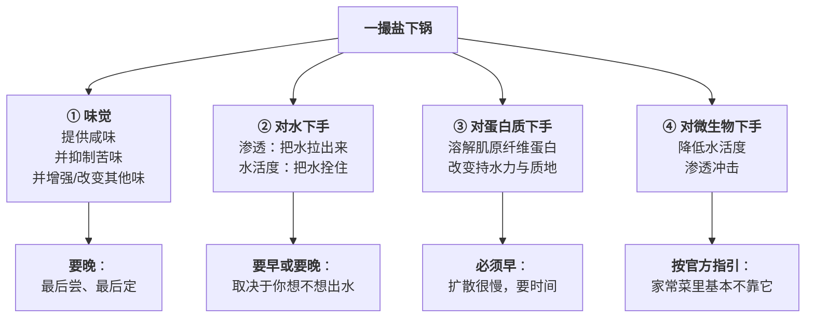

# 第 11 章 盐：唯一不可替代的调料

> **本章目标**：把"放盐"这个动作从"按克数执行"变成"按目的执行"。
>
> 盐是厨房里唯一一样**既是调味品又是加工助剂**的东西：
> 它同时在你的舌头上、在食材的细胞里、在蛋白质的表面、在微生物的生存条件上工作。
> 这四件事**需要的时机完全不同**——这就是"盐什么时候放"永远吵不出结论的根本原因。
>
> 学完这一章你会知道：**这个问题没有统一答案，但有一个统一的问法。**

## 11.1 盐同时在做四件事

> ## 本章的核心问题不是"什么时候放盐"，而是：
>
> **"我这次放盐，是为了它四件事里的哪一件？"**
>
> 回答了这个，时机就自动定了。回答不了，那就是照菜谱放——本书希望你别停在这里。

## 11.2 为什么说它"不可替代"

先看一张五味的"替代品"清单：

| 味 | 有没有替代品 | 说明 |
|----|------------|------|
| **甜** | 有很多 | 蔗糖、其他糖类、高强度甜味剂（美国 FDA 已批准 7 种人工甜味剂与 2 种天然来源甜味剂用于食品，中国另有自己的批准清单） |
| **酸** | 有很多 | 醋（乙酸）、柠檬（柠檬酸）、酒石酸、乳酸、番茄、酸奶…… |
| **鲜** | 有很多 | 谷氨酸侧、核苷酸侧、多种鲜味肽（第 13 章） |
| **苦** | 通常不追求 | 厨房里更常见的是**想去掉它** |
| **咸** | **基本没有** | 钾盐等替代物存在，但会带来自己的味道问题；这是整个食品工业几十年的难题——**"减钠"之所以能成为一个研究领域，正是因为咸味没有干净的替身** |

> **一个能说明问题的侧证**：本章引用的减钠综述、低钠肉制品综述、
> 咸味增强研究……它们全都不是在找"盐的替代品"，
> 而是在找**"怎么用别的感觉去顶掉一部分盐"**。
> **如果有替代品，这些研究就不必存在。**

## 11.3 味觉侧：盐不只在"加"，它也在"删"

这是第 10 章那张表里最有用的一条，值得在这里展开。

**盐会抑制苦味。** 这个结论最有名的出处是 1997 年《Nature》上一篇标题直译为
"盐通过抑制苦味来增强风味"的短文（⚠️ 本书只核到其书目信息与标题，全文非开放获取）。
2024 年一项受体层面的研究复述了这一感官观察，并发现：
**在受体层面，只有部分受体—苦味物质配对被钠抑制**（测的四个受体里只有 TAS2R16 信号下降），
因此对多数苦味物质而言，**这种抑制可能主要发生在中枢**。

> ## 这解释了"为什么加盐能让一道菜整体变好吃"
>
> 加盐做了**两件事**：
>
> 1. **加上**咸味（你能直接尝到的）；
> 2. **删掉**一部分你本来不想要的苦、涩、生味（你察觉不到它被删了，只觉得"变干净了"）。
>
> **第二件事往往比第一件更重要**——这就是为什么"只差一点盐"能带来
> 不成比例的改善，也是为什么盐被叫作"味道的开关"而不是"一种味道"。

### 但盐多了会发苦：这不是错觉

减钠综述提到一条很有意思的机制：

> **高钠（高于 150 mM）的溶液可以激活 II 型细胞上的苦味受体**，
> 触发细胞内钙信号与神经递质释放。

也就是说：**盐在低浓度时压住苦，在高浓度时自己变成苦。**

> **厨房推论**：一道菜"咸得发苦、发涩、发冲"不是你的想象——
> **那是同一个分子跨过了一条线。**
> 而且这条线是**不可逆**的：你已经没有"稍微少一点"的选项了，只能稀释或增量。

### 温度和适应还在骗你（第 9 章的复习）

- **凉了会变淡**（低温下对甜的敏感度下降，整体风味感受也降）；
- **尝多了会钝化**（适应）；
- **每个人的阈值不同**。

> **所以本书从头到尾不给"放几克盐"。**
> 项目 P2 会带你建立自己的基准——**那才是你能复用的数字。**

## 11.4 水侧：盐是"对水下的一道命令"

第 3 章已经讲过[渗透](../../glossary.md#osmosis)与[水活度](../../glossary.md#water-activity)，
这里只讲**它对做菜决策的直接后果**。

| 场景 | 盐做了什么 | 决策含义 |
|------|-----------|---------|
| **撒盐在蔬菜上** | 渗透把细胞里的水拉出来 | **想要出水**（黄瓜杀水、腌白菜、去涩）→ **早放**；**不想出水**（清炒青菜、拌沙拉）→ **最后放** |
| **焯水时加盐** | 一篇综述转引的研究指出：**加盐造成渗透失衡，水分流失更多、水溶性成分损失更大** | ⚠️ 这是"焯水加盐保绿"说法的**反方向**证据（第 8 章已登记为缺乏支持） |
| **腌肉** | 表面的盐先把水拉出来，然后（在一定条件下）随盐一起回吸 | **需要时间**——这不是"撒上去就生效"的操作 |
| **保存** | 降低水活度，抑制微生物 | 家常菜里基本用不上这个量级；腌渍与保藏请遵循**本地官方的家庭食品保藏指引** |

> ⚠️ **一件必须说清楚的事**：分子美食学综述明确指出
> **腌料渗入很慢、主要只作用于外层**（工业上靠注射解决）。
> 这意味着：**"腌了两小时"和"腌了一夜"对一块厚肉的内部，差别可能远小于你的预期。**
> 想让盐进得深，**靠的是把东西切薄、划刀、或者给足时间，而不是多放盐**。

## 11.5 蛋白质侧：盐把肌肉蛋白"溶开"

这一节的数据来自**加工肉制品**的研究，所以先说清楚适用范围。

一篇关于低钠肉制品的综述总结了氯化钠在肉制品中的角色：

| 盐做的事 | 后果 |
|---------|------|
| **把肌原纤维蛋白从肉里溶出来** | 溶出的蛋白在乳化体系中**包住脂肪、阻止水分释放**，给肉糜制品带来它该有的质地 |
| **提高持水力** | 综述的表述是：多汁感的提升来自**盐溶性肌原纤维蛋白的溶出**，让蛋白与水结合得更稳定 |
| **抑制微生物生长** | 通过调节水活度、渗透冲击与电解质失衡 |

综述还引了一条量化的门槛：在**宰后早期腌制**（pre-rigor salting）的研究里，
**至少需要 2% 的氯化钠**才能保证蛋白溶解度、乳化能力与持水力的改善。

> ⚠️ **这条 2% 不要拿去炒菜。**
> 它的语境是**香肠、火腿这类肉糜/重组制品的工业加工**，
> 综述本身给的商品盐含量范围是"香肠约 1.1 g 盐/100 g 到萨拉米约 4.6 g 盐/100 g"。
> **家常菜的盐量与这个体系没有可比性**，本书**不给家常菜的百分比**。

> ## 但它给了一条能迁移的机理判断
>
> **盐让肉更"多汁、有弹性、抱得住水"，靠的是溶解蛋白质——
> 而溶解需要时间和接触。**
>
> 所以：
>
> - **肉丸、肉馅、虾滑这类"要有弹性"的东西，盐必须早加并搅打**
>   （这是把蛋白溶出来的过程，中式厨房叫"打上劲"）；
> - **整块肉临下锅才撒盐，走的是味觉这条线，不是蛋白质这条线**——
>   它能让表面有味，但改变不了内部的持水力。
>
> ⚠️ 本书**未核到**家庭尺度上"提前多久腌肉能改善多汁感"的定量对照，
> 因此**不给时间数字**，只给机理方向。

## 11.6 那到底什么时候放盐？一个诚实的答案

先给一条**一手实验**，因为它的结果和很多人的直觉相反。

2025 年，法国与南非的研究者做了这样一个实验（158 名未受训练的消费者）：

| 项目 | 内容 |
|------|------|
| 菜品 | **水煮鸡胸**（南非常见家常做法，在标准家常汤里煮 6 分钟） |
| 变量 | 盐**在煮之前加进汤里** vs **出锅后撒在盘中** |
| 盐量 | 两档：常规 6.5 mmol 钠/100 g 熟鸡、低盐 4.1 mmol 钠/100 g（两档相差 33%） |
| 作者的假设 | **撒在盘中的盐会留在肉表面，形成更不均匀的分布，因而尝起来更咸** |

**结果：两种加盐方式的咸度感受没有显著差异**（p > 0.2，两个盐档都不显著）。
**作者的假设没有被证实。**

> ⚠️ **这条结论的适用范围很窄**：**一种菜、一种做法、一个国家的消费者**。
> 它**不能**推广成"盐什么时候放都一样"。
> 但它足以推翻一个通则式的说法：**"最后放盐一定更咸"在带汤的菜里没有成立。**

那本书能给什么？**能给的是一张"按目的选时机"的表。**

> ## 放盐时机决策表
>
> | 我这次放盐是为了 | 时机 | 理由 | 证据强度 |
> |----------------|------|------|---------|
> | **让它有味**（味觉） | **晚**，出锅前定味 | 味觉是最后才需要确定的；早放也会均匀化，但你会失去调整机会 | ✅ 机理清楚（第 9、10 章） |
> | **把水拉出来**（杀水、去涩、腌菜） | **早**，并给时间 | 渗透需要时间 | ✅ |
> | **不要出水**（清炒青菜、拌菜） | **最后**，出锅或上桌前 | 同上，反过来用 | ✅ 机理清楚 |
> | **让肉糜"上劲"**（肉丸、虾滑） | **早**，加盐后搅打 | 要把肌原纤维蛋白溶出来 | ✅ 机理有文献（⚠️ 来自加工肉制品研究） |
> | **让整块肉更多汁** | ⚠️ **本书不给时间** | 腌料渗入很慢、只作用于外层；家庭尺度的定量对照本书未核到 | ⚠️ 缺口 |
> | **让菜"更咸"而少用盐** | **看第 11.7 节** | 用相互作用，不是用时机 | ✅ 有数据 |
>
> **一条兜底规则**：
> **能分两次放就分两次**——早放的那一次做"物理工作"（水、蛋白质），
> 晚放的那一次做"味觉工作"（定味）。
> 这样你既拿到了前者的效果，又保留了后者的调整余地。

## 11.7 想少放盐又不难吃：四条有数据的路

这一节的数字全部来自减钠研究，**它们都是在特定体系里测的，不能直接换算到你的菜**——
但**它们的相对大小是有参考价值的**。

| 手段 | 报告的减钠幅度 | 条件与限制 |
|------|------------|----------|
| **鼻后香气**（进嘴之后闻到的） | **高达 75%**（香辛料组合用于人造黄油）；多项研究**超过 48%** | 香气必须"对得上"（咸香配咸味） |
| **麻 / 辣**（化学刺激感） | 最高约 **39.06%**；典型刺激物**超过 30%** | 会改变菜的风格，不是所有菜都能用 |
| **鲜味** | 最佳情形约 **24.25%** | 在低—中盐时最有效 |
| **鼻前香气**（隔空闻到的） | 最高约 **13.60%** | **明显弱于鼻后** |
| 一个具体的家常例子 | **烟熏大蒜风味让水煮鸡少放 33% 盐**而不影响"刚刚好"的评价 | ✅ 一手实验 |

> ## 本章第二条可迁移规则
>
> **"不够咸"的第一反应不该是加盐，而是问：我能不能用香、用麻、用鲜去顶一部分？**
>
> **顺序建议**：
>
> 1. 先补**一致的香**（酱油、腊味、豆豉、虾皮、烟熏、蒜——闻起来就该是咸的那一类）；
> 2. 再补**鲜**（并且"换一类"，见第 9 章的协同）；
> 3. 需要的话加**麻/辣**；
> 4. **最后**才加盐。
>
> ⚠️ **前提（第 10 章第二条规则）**：这一套只在**盐本来就不足**时管用。
> 已经很咸的菜，加什么都不会让它"更咸"，只会让它更乱。

## 11.8 钠：只讲机构怎么说

> ⚠️ **本书纪律**：营养相关**只讲证据等级与机构结论的适用范围**，
> **不给摄入量建议、不做健康承诺**。以下只是复述公开发布的内容。

| 机构 | 公开表述 |
|------|---------|
| **WHO**（盐减量专题页） | 成人的建议是**每天少于 2000 mg 钠**（相当于少于 5 g 盐）；给出的换算是 **1 g 盐 ≈ 400 mg 钠**、**5 g 盐 = 2000 mg 钠**；2021 年成人平均摄入量估计为 **4278 mg 钠/天**（相当于 11 g 盐），为其上限的两倍以上；建议内容包括做菜时少放或不放盐、把盐罐从餐桌上拿走、用香草与香辛料代替盐 |
| **美国 FDA**（膳食中的钠） | 营养标签的每日值为**每天少于 2300 mg 钠**，并说明这"大约等于 1 茶匙食盐"；美国人平均约 **3400 mg/天**；并指出**超过 70% 的膳食钠来自包装食品与在外就餐的食物**，而不是灶台和餐桌上的盐罐；CDC 数据显示约 **40%** 的钠来自一小串食品（三明治、披萨、卷饼与塔可、汤、咸味零食、禽肉、意面类菜肴、汉堡、蛋类菜品） |

> ## 一个诚实但重要的推论
>
> **在美国的口径下，家里做菜放的那点盐，在总钠里不是大头。**
>
> ⚠️ **但这条不能直接搬到中国**：中国的膳食结构里
> **烹调用盐与酱油等调味品的占比与美国不同**，
> 而本书**没有核到中国官方的相应统计与口径**（已登记为缺口）。
>
> 本书在这里唯一想说的是：**"我做菜少放点盐"和"我摄入的钠少了多少"之间，
> 隔着一个你必须自己去查的数据。** 本书不替你回答这个问题。

## 11.9 一个被忽略的实际问题：你的"一勺盐"是多少

**同样一"勺"盐，粗盐和细盐的重量可以差很多**——因为它们的堆积密度不同。
这就是为什么菜谱里的"1 小勺盐"在不同人手里结果不同。

本书能给的只有操作建议（**属于惯例，不是实验结论**）：

- **用同一个勺、同一种盐**，让你自己的基准稳定下来；
- 想精确就**用秤**（称重不受晶体形状影响）；
- **换盐就要重新标定**（换品牌、换粗细都算）。

⚠️ 关于**盐晶体的大小与形状是否改变咸味感受**：
低钠肉制品综述提到"改变盐晶体形状"是一条减盐技术路线，
理由是离子扩散速度与在肉基质中的作用速度不同；
但**本书没有核到这方面的一手实验数据**，因此**只记录存在这条技术路线，不给结论**。

## 11.10 本章的可迁移规则

> ## 拿起盐罐之前，问三个问题：
>
> | 顺序 | 问题 | 怎么用 |
> |------|------|-------|
> | **①** | **我要它做四件事里的哪一件？** | 味觉 → 晚；出水 → 早；不出水 → 最后；蛋白质上劲 → 早并搅打 |
> | **②** | **主味现在是"不足但接近"，还是"已经足够"？** | 不足但接近 → **先试香、鲜、麻**；已经足够 → 别再加任何"增强"的东西 |
> | **③** | **这一步之后还有什么会改变味道？** | 收汁、勾芡、放凉、静置——**有的话就先别定味** |
>
> **两条兜底**：
>
> - **少量多次，每次等 10 秒以上再判断**（盐需要溶解与扩散）；
> - **加盐是不可逆的**——它排在补香、补鲜、补酸之后（第 9 章）。

## 11.11 常见说法辨析

按本书约定标注**证据强度**：✅ 有共识 / ⚠️ 有争议 / ❌ 明确错误 / 缺乏证据。
来源见[出处登记](../../standards.md)。

| 说法 | 判定 | 说明 |
|------|------|------|
| "盐早放晚放差别很大" | ⚠️ **分菜、分目的**，不是通则 | 一项一手实验（水煮鸡，158 人）发现：**同等钠含量下，汤里放盐与出锅后撒盐的咸度感受没有显著差异**（p > 0.2）。但这只覆盖"带汤的菜 + 味觉这条线"。**对出水（渗透）和肉糜上劲（蛋白溶出）这两条线，时机确实关键**——因为它们需要时间 |
| "最后撒的盐更咸，能少放" | ⚠️ **带汤的菜里没被证实** | 该实验作者**原本就是抱着这个假设去做的**，结果没有证实。支持"不均匀分布更有效"的证据来自**凝胶体系的糖**（可少用约 20%）。**干的、能保住表面颗粒的菜可能成立** |
| "炒青菜早放盐会出水" | ✅ **机理清楚** | 渗透：盐把细胞里的水拉出来。同一条机理的反面用法是"黄瓜杀水""腌白菜"。⚠️ 本书**未核到**家庭炒菜尺度的定量对照，只给方向 |
| "焯水时加盐能保绿" | ❌ **缺乏证据，且有反方向的代价** | 第 8 章已登记：未核到任何支持证据；而一篇综述转引的研究指出**加盐造成渗透失衡，水分流失更多、水溶性成分损失更大** |
| "多腌一会儿盐就进去了" | ⚠️ **进得比你以为的慢得多** | 分子美食学综述明确：**腌料渗入很慢，主要只作用于外层**，工业上靠注射解决。**想让味道进去，靠切薄、划刀、增加表面积，而不是延长时间或加大用量** |
| "肉丸/虾滑要弹，就得多摔多打" | ✅ **有机理支持**，但**关键是盐不是"摔"** | 低钠肉制品综述：氯化钠把**肌原纤维蛋白溶出**，溶出的蛋白包住脂肪、阻止水分释放，形成稳定质地。搅打是在帮助溶出与形成网络。**所以这一步的盐必须早加**。⚠️ 该综述的语境是**工业肉糜制品**，本书**不给家庭配比** |
| "盐能让苦的东西不苦" | ✅ **现象有共识**，但它是**掩盖** | 见第 10 章。机制上**可能主要发生在中枢**——受体层面测的四个人类苦味受体里只有 TAS2R16 被钠抑制 |
| "咸得发苦是我的错觉" | ❌ **不是错觉** | 减钠综述提到：**高钠（>150 mM）溶液可以激活 II 型细胞上的苦味受体**。**盐在低浓度抑制苦，高浓度自己变苦** |
| "少放盐菜就一定不好吃" | ❌ **有多条有数据的替代路径** | 鼻后香气高达 **75%**、麻/辣约 **39%**、鲜味约 **24%** 的减钠幅度都有报告；一项一手实验中**烟熏大蒜让水煮鸡少放 33% 盐**仍被接受。⚠️ 这些数字来自特定体系，**不可直接换算**，且都要求**主味处在低—中水平** |
| "在家少放盐，钠摄入就下来了" | ⚠️ **取决于你的膳食结构** | 美国 FDA 的表述是**超过 70% 的膳食钠来自包装食品与在外就餐的食物**。⚠️ **中国口径本书未核到**（已登记为缺口）。**本书不给任何摄入量建议**，只复述机构结论 |
| "海盐/岩盐比精盐更咸（或更健康）" | ⚠️ **本书不下结论** | 关于**晶体形状影响咸味感受**：低钠肉制品综述把它列为一条减盐技术路线，但**本书没有核到一手实验数据**。关于"更健康"：**属于营养与健康断言，本书纪律上不做评价**。**能确定的只有一件事：不同粗细的盐，同样一勺的重量不同** |
| "盐是唯一没有替代品的调料" | ✅ **在本书的意义上成立** | 甜、酸、鲜都有多种可选物质；咸味没有干净的替身，这正是"减钠"能成为一个持续几十年的研究领域的原因。⚠️ 存在钾盐等替代物，但会带来自身的味道问题 |

## 11.12 🔎 下次做菜时的用处

1. **拿起盐罐先问："这一次是为味觉、为水、为蛋白质，还是为保存？"**
2. **能分两次放就分两次**：早的那次干物理活，晚的那次定味。
3. **炒青菜的盐最后放**；**要杀水的盐最早放**——同一条渗透，两个方向用。
4. **肉丸虾滑的盐必须早加并搅打**，那不是调味，那是在溶蛋白。
5. **想让味道进到肉里，先切薄划刀**，别靠"多腌一会儿"。
6. **觉得淡，先试一致的香 / 鲜 / 麻，最后才加盐**——前三样都不增加咸度的上限。
7. **加盐后等 10 秒再尝**，连着加两次是过咸最常见的原因。
8. **咸得发苦就别再调了**——那已经跨过了一条线，只能靠稀释或增量。
9. **换了盐（品牌、粗细）就重新标定你的"一勺"。**

## 11.13 思考题

1. 盐同时在做哪四件事？为什么说"盐什么时候放"这个问题没有统一答案？
2. 为什么本书说咸味"基本没有替代品"？请给出一个能说明问题的侧证。
3. 盐在味觉上做了哪"两件"事？为什么本书说第二件往往比第一件更重要？
4. 为什么"咸得发苦"不是错觉？这对"能不能救回来"意味着什么？
5. 那项水煮鸡实验是怎么设计的？结论是什么？为什么本书说它"适用范围很窄"，
   却仍然值得写进来？
6. 盐让肉糜"上劲"的机理是什么？为什么这一步的盐必须早加？
   本书为什么不给家庭配比？
7. **【案例】** 你要做一顿三道菜：①清炒菠菜 ②手打猪肉丸汤 ③凉拌黄瓜。
   请分别说明这三道菜的盐**什么时候放、为什么**，并指出每一道走的是四件事里的哪一条线。
8. **【案例】** 你炖了一锅排骨汤，喝起来"不够咸"。
   （a）按本章的三问顺序，你会怎么处理？
   （b）如果你决定不加盐，你有哪三条有数据支持的路可以试？各自的限制是什么？
   （c）如果加完之后你发现"咸了、而且有点发苦"，还有救吗？为什么？
9. **【辨析】** "最后撒的盐更咸，所以能少放"——判断证据强度。
   请说明支持与反对的证据分别来自什么体系，以及你会在哪类菜上采用它。
10. **【辨析】** "在家少放盐，钠摄入就下来了"——请复述美国 FDA 与 WHO 的相关表述，
    并说明**本书为什么不给出任何摄入量建议**、也不把美国数据搬到中国。
11. 为什么本书建议"想让味道进到肉里，靠切薄划刀而不是延长腌制时间"？
    这条和第 8 章的哪条结论是同一件事？

> 📖 **参考答案**（想清楚再看）：[Q1](../../qa/11-salt-qa.md#q1) ·
> [Q2](../../qa/11-salt-qa.md#q2) · [Q3](../../qa/11-salt-qa.md#q3) ·
> [Q4](../../qa/11-salt-qa.md#q4) · [Q5](../../qa/11-salt-qa.md#q5) ·
> [Q6](../../qa/11-salt-qa.md#q6) · [Q7](../../qa/11-salt-qa.md#q7) ·
> [Q8](../../qa/11-salt-qa.md#q8) · [Q9](../../qa/11-salt-qa.md#q9) ·
> [Q10](../../qa/11-salt-qa.md#q10) · [Q11](../../qa/11-salt-qa.md#q11)

## 11.14 本章实操

### 🅐 零成本版 · 任务一：标定你自己的"一勺盐"（5 分钟，不用开火）

**需要**：你家的盐、你平时用的那个勺、一个厨房秤（没有秤就做后半部分）。

| 次数 | 我"随手一勺"的重量 | 我"刮平一勺"的重量 |
|------|---------------|---------------|
| 1 | | |
| 2 | | |
| 3 | | |
| **平均** | | |

如果家里有两种盐（粗/细、海盐/精盐），两种都测：

| 盐的种类 | 刮平一勺的重量 | 与另一种差多少 |
|---------|------------|------------|
| | | |
| | | |

做完回答：

1. 你三次"随手一勺"的差距有多大？这对照菜谱做菜意味着什么？
2. 两种盐的一勺重量差多少？
3. 从今天起，你打算用哪一种盐、哪一个勺作为自己的基准？

> **这是项目 P2 的第一块砖**：**没有稳定的计量，就没有可复用的经验。**

### 🅐 零成本版 · 任务二：给你常做的菜做一张"盐的目的表"

列出你最常做的 5~8 道菜，判断每道菜里的盐**主要在干哪件事**。

| 菜 | 盐主要为了（味觉/出水/不出水/蛋白质/保存） | 我现在什么时候放 | 按本章应该什么时候放 | 要不要改 |
|----|------------------------------------|-------------|----------------|---------|
| | | | | |
| | | | | |
| | | | | |
| | | | | |
| | | | | |

做完回答：

1. 有几道菜你现在的放盐时机和"目的"不匹配？
2. 有没有哪道菜，其实应该**分两次放**？

### 🅐 零成本版 · 任务三：找出你的"咸度舒适区"（不用开火）

第 9 章的实操找的是**阈值**（能不能尝到），这次找的是**偏好**（喜不喜欢）。

配几杯浓度递增的盐水（每次加极少量，搅匀，尝一口后漱口），
记录"第一次觉得是咸的"和"第一次觉得太咸了"分别在哪一杯。

| 杯 | 大致盐量（勺/刀尖） | 我的评价（没味/有点/刚好/偏咸/太咸） |
|----|----------------|----------------------------|
| 1 | | |
| 2 | | |
| 3 | | |
| 4 | | |
| 5 | | |
| 6 | | |

做完回答：

1. 你的"刚好"区间**有多宽**？（宽 = 你比较好伺候；窄 = 你对咸度敏感）
2. 找家人朋友各做一遍——**你们的"刚好"重叠吗**？
3. 这解释了你家餐桌上的哪场争论？

### 🅑 开火版 · 任务四：同一份青菜，三种放盐时机（有灶台时做）

**需要**：同一把青菜分成三份、同一口锅、同样的火、同样的油和盐量。

| 组 | 放盐时机 | 出锅时锅里的水多不多 | 菜的颜色与脆度 | 咸度感受 |
|----|---------|----------------|------------|---------|
| ① | 下锅时就放 | | | |
| ② | 炒到一半放 | | | |
| ③ | **出锅前一刻**放 | | | |

做完回答：

1. 哪一组出水最多？这符合渗透的预期吗？
2. 三组的**咸度感受**差别大吗？（本章预期：出水差别大，咸度差别小）
3. 如果只能选一个时机，你选哪个？为什么？

> **这个实验想让你亲眼看到的是**：**"放盐时机"改变的主要是"水"，
> 而不是"咸"**——这正是本章 11.1 那张图的意思。

### 🅑 开火版 · 任务五：用香气替掉三分之一的盐

**需要**：两份同样的汤（或同一道菜分两份）、盐、一样"咸香型"的东西
（酱油、豆豉、虾皮、腊味、烟熏、蒜——挑一样）。

| 组 | 盐量 | 额外加了什么 | 咸度（0~10） | "刚刚好"吗（太淡/刚好/太咸） | 整体喜欢程度 |
|----|------|-----------|-----------|----------------------|-----------|
| ① 对照 | 正常量 | 无 | | | |
| ② 减盐 | **约减三分之一** | 一点咸香型的东西 | | | |

做完回答：

1. ②尝起来比①淡多少？（参考：那项一手实验里，烟熏大蒜让**减 33% 的盐**仍被判为"刚刚好"）
2. 如果②还是偏淡，你会先加盐，还是先加更多香？为什么？
3. 换一样"甜香型"的东西重做②，结果一样吗？（本章预期：**不一样，因为香气必须对得上**）

> ⚠️ **安全提醒**：实验剩下的食物不要在室温下久放。
> 美国 FDA 的指引是易腐食品在烹调后 **2 小时内**冷藏
> （环境温度高于 90 °F 时缩短到 1 小时）。**各国口径不同，以本地现行发布为准。**

## 11.15 本章依据

本章引用的来源与核对状态详见[参考书目与出处登记](../../standards.md)，具体对应如下：

| 本章用到的内容 | 依据 |
|--------------|------|
| 氯化钠在肉制品中的作用：**溶出肌原纤维蛋白**、溶出的蛋白包住脂肪并阻止水分释放、提高持水力与多汁感、通过水活度/渗透冲击/电解质失衡抑制微生物；**宰后早期腌制研究中"至少 2% 氯化钠"**才能保证蛋白溶解度、乳化能力与持水力的改善；商品盐含量范围（香肠约 1.1 g/100 g 至萨拉米约 4.6 g/100 g）；**改变盐晶体形状**被列为一条减盐技术路线 | 一篇关于低氯化钠含量肉制品生产技术的综述，*Foods*，2021（PMC8145339），✅ 开放获取全文。⚠️ 全篇语境是**工业肉制品加工**，**不可直接搬到家常菜**；晶体形状一条本书**未核到**一手实验数据 |
| **盐加在汤里 vs 出锅后撒在盘中，同等钠含量下咸度感受无显著差异**（p > 0.2）；两个盐档 6.5 与 4.1 mmol 钠/100 g 熟鸡（相差 33%）；158 名未受训练消费者；作者**原本的假设（表面盐形成不均匀分布因而更咸）未被证实**；**烟熏大蒜风味使盐可减少 33% 而不影响"刚刚好"评价**；香精的咸味增强**只在低盐档显著** | 一项关于家庭烹饪做法与加盐时机对水煮鸡咸度影响的研究，*International Journal of Food Science*，2025（PMC12165749），✅ 开放获取全文。⚠️ 单一菜品、单一做法 |
| **高钠（>150 mM）溶液可激活 II 型细胞上的苦味受体**；减钠幅度的量级对比：**鼻后香气高达 75%**（多项超过 48%）、**化学刺激感最高约 39.06%**（典型超过 30%）、**鲜味约 24.25%**、**鼻前香气最高约 13.60%**；**只有一致且熟悉的风味组合**才能有效产生气味引起的味觉增强 | 一篇关于通过感官相互作用实现减钠的综述，*Food Science & Nutrition*，2025（PMC12231224），✅ 开放获取全文。⚠️ 多为转引，条件各异，**不可直接换算** |
| **钠对苦味的抑制在人类感官研究中被观察到**；受体层面测试四个人类苦味受体后**只有 TAS2R16 的信号在氯化钠存在下下降**，因此多数苦味物质的抑制**可能以中枢效应为主** | 一项关于氯化钠对人类苦味受体响应影响的研究，*Journal of Agricultural and Food Chemistry*，2024（PMC11082923），✅ 开放获取全文 |
| "盐通过抑制苦味来增强风味" | Breslin & Beauchamp，*Nature*，1997（doi:10.1038/42388）。⚠️ **只核到书目信息与标题**（Crossref 查询），全文非开放获取 |
| **腌料渗入很慢、主要只作用于外层**（工业上靠注射解决） | 一篇关于分子美食学的综述，*Chemical Reviews*，2010（PMC2855180），✅ 开放获取全文 |
| **焯水/烹煮时加盐造成渗透失衡，水分流失更多、水溶性成分损失更大** | 一篇关于热处理对果蔬中多酚、类胡萝卜素、硫苷与抗坏血酸影响的综述，*Comprehensive Reviews in Food Science and Food Safety*，2024（PMC11605278），✅ 开放获取全文（该条为综述转引） |
| **美国 FDA 已批准 7 种人工甜味剂与 2 种天然来源甜味剂用于食品**，中国另有自己的批准清单 | 一篇关于复杂食品体系中减糖的综述，*npj Science of Food*，2026（PMC13448172），✅ 开放获取全文 |
| **WHO**：成人建议每天少于 2000 mg 钠（少于 5 g 盐）；1 g 盐 ≈ 400 mg 钠；2021 年成人平均 4278 mg 钠/天（约 11 g 盐）；建议做菜少放盐、拿走餐桌盐罐、用香草香辛料代替 | WHO「Salt reduction」专题页，✅。⚠️ **本书只复述机构结论，不做摄入量建议**；各国发布会修订 |
| **美国 FDA**：钠的每日值为每天少于 2300 mg（约合 1 茶匙食盐）；美国人平均约 3400 mg/天；**超过 70% 的膳食钠来自包装食品与在外就餐的食物**；CDC 数据显示约 40% 的钠来自一小串食品类别 | 美国 FDA「Sodium in Your Diet」，✅。⚠️ **美国口径**，反映的是美国的膳食结构；**不可直接套用到中国** |
| 易腐食品烹调后 2 小时内冷藏（高于 90 °F 时 1 小时） | 美国 FDA「Safe Food Handling」，✅。⚠️ 各国口径不同 |
| 家庭尺度"提前多久腌肉能改善多汁感"的定量对照；盐晶体大小与咸味感受的定量关系；中国膳食中烹调用盐占总钠的比例 | ⚠️ **均未核到**，正文只给机理方向、不给数字（已登记为缺口） |

---

**下一章**：第 12 章 糖与酸——它们在菜里干的活不只是甜和酸。
本章反复提到"用别的东西去顶一部分盐"；下一章要看看另外两个旋钮：
**糖和酸除了提供甜味与酸味，还在同时改着水、改着质地、改着颜色、改着你对其他味道的感受。**
