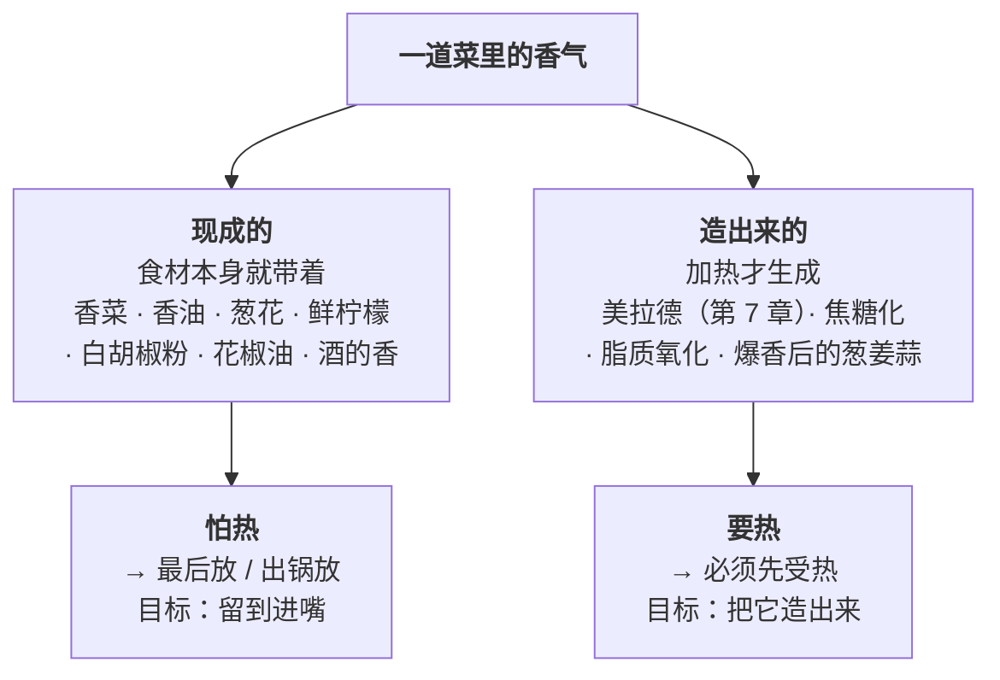

# 第 13 章 鲜与香：谷氨酸、核苷酸与挥发性香气

> **本章目标**：把第 9 章那条诊断——"**没味道最常见的原因是缺香不是缺盐**"——
> 变成一套能执行的操作。
>
> 这一章回答三个问题：
>
> 1. **"鲜"到底有几层？**（不止谷氨酸和核苷酸，还有第三层）
> 2. **香气从哪来？**（"现成的"和"造出来的"是两套完全不同的逻辑）
> 3. **香气为什么留不住、以及什么东西能留住它？**（答案是油）
>
> 学完这一章你会知道：**"一加热就跑"这句话只对了一半——
> 加热同时在赶走香气和制造香气，判据不是温度，而是"这个香是哪来的"。**

## 13.1 鲜的第三层：厚味（kokumi）

第 9 章讲了鲜的两层：**谷氨酸**（T1R1 + T1R3 受体）与**核苷酸协同**
（IMP 占比在 20%~80% 时鲜味强度大幅上升，呈倒 U 形）。

还有第三层——**厚味**[^1]，它在中文里最接近的词是"**厚**""**醇厚**""**有底**"。

### 它是什么

日文里叫 **kokumi**（コク味）。两篇综述给出的描述一致：

> 这类物质**在起作用的浓度下本身不产生任何味道**，
> 却能**增强鲜、甜、咸以及脂肪感的强度**，
> 并带来**厚度（thickness）、满口感（mouthfulness）、持续感（continuity）**。

**最早的发现**来自大蒜：研究者从**无臭的大蒜提取物**里找到了
一种本身没有气味也没有质地的物质，把它加进
**0.05% 味精 + 0.05% IMP** 的鲜味溶液后，那杯溶液变得"更厚、更满口、更持久"。
后来确认这类物质里最典型的是**谷胱甘肽**与一类 **γ-谷氨酰肽**。

### 它在哪些食物里

按两篇综述汇总（这一栏对中式厨房特别有用）：

| 来源 | 综述提到的具体例子 |
|------|----------------|
| **葱蒜类** | 大蒜（谷胱甘肽的最早来源）、洋葱中的含硫成分 |
| **豆类与豆制品** | 菜豆中的 γ-谷氨酰肽；大豆中的 γ-Glu-Tyr、γ-Glu-Phe；**酱油**中的 γ-谷氨酰肽与多种肽 |
| **发酵食品** | 泡菜（N-乳酰氨基酸、N-琥珀酰氨基酸等）、发酵可可豆、泰国发酵淡水鱼、酵母提取物 |
| **奶酪** | 陈年高达奶酪中的肽被认为带来持久的满口感 |
| **长时间烹煮** | 综述提到**蜂蜜、陈年奶酪与"炖透的菜"**都具有这类复杂的口腔感受 |

一项研究还发现：韩国酱油（ganjang）中 **500~10000 Da 的肽组分**
作为厚味物质**同时增强了咸味与鲜味**。

### 它的机理与一条极有用的推论

受体层面，这类物质主要作用于**钙敏感受体（CaSR）**
（另有鸟氨酸通过 GPRC6A 起作用）。它们**不激活味觉受体本身**，
而是**调制**其他味觉信号。

而其中一篇综述提出了一个对做菜非常有用的框架：

> **在只有基本味的水溶液里加味精，不会增强也不会抑制任何味道，
> 因为溶液里根本没有厚味物质；
> 只有把味精加进复杂的食材体系里，已有的味道才会被增强。**

> ## 本章第一条可迁移规则
>
> **味精（以及任何鲜味调料）不是"万能增味剂"——它需要有东西可增。**
>
> - 往**一锅白水**里放味精：你得到的是"一杯有鲜味的水"，不是"高汤"；
> - 往**一锅炖了很久的菜、有葱蒜、有酱油、有发酵物**的东西里放一点：
>   它会把已经存在的味道**整体抬起来**。
>
> ⚠️ **这是那篇论文提出的解释框架，不是已经定论的机制**
> （作者自己也写明"直接的受体层面相互作用仍有待阐明"）。
> 本书采用它，是因为它**同时解释了两件长期被分开讲的事**：
> "味精要配着菜用"和"炖透的菜更厚"。

> **中式厨房的对照**：葱姜蒜爆锅、放酱油、豆瓣、久炖——
> **这四样各自都在往"厚味"这条线上加东西**。
> 它们不是"每一样都加一点鲜"，而是**在搭建一个能被增强的底**。

## 13.2 香：现成的 vs 造出来的

这是本章最重要的分类。**判断"什么时候放"靠的不是这样东西是不是香料，
而是这股香是哪来的。**

### 一个必须纠正的简化说法

"香气一加热就跑"——**这句话只对了一半。**

一项 2025 年的研究测了同一体系在不同温度下顶空中的挥发物浓度，结果是：

> 加水后的模型体系里，**只有 3 种挥发物的浓度随温度升高而下降，
> 而 22 种随温度升高而上升**。

上升的那批包括**醛类**（3-甲基丁醛、辛醛、壬醛、己醛、苯甲醛）
与**醇类**——论文把它们归因于加热过程中的**脂质与蛋白质氧化**以及**美拉德反应**。

> ⚠️ **两条必须说清楚的限制**：
>
> 1. 这测的是**顶空浓度**（也就是"释放出来多少"），
>    **升温本身就会提高挥发物的释放**——所以"浓度上升"里既有"新造出来的"，
>    也有"本来就在、只是跑出来了"，**该研究没有把这两者分开**；
> 2. 它测的是**酵母蛋白**这一个体系，**不能直接推广到所有食材**。
>
> **但方向足够清楚**：**加热不是单向地赶走香气，它同时在造香气。**

> ## 本章第二条可迁移规则
>
> **不要问"这个香料怕不怕热"，要问"这股香是现成的还是要造的"。**
>
> | 这股香 | 什么时候放 | 中式例子 |
> |-------|----------|---------|
> | **现成的、挥发性强的** | **最后放 / 出锅放** | 香菜、葱花、香油、鲜柠檬汁、现磨白胡椒、蒜末（生的那种辛香） |
> | **要靠加热生成的** | **最早放，并给它温度** | 爆香的葱姜蒜、炒香的花椒与干辣椒、炒糖色、煎出来的焦褐外壳 |
> | **两者都要的** | **放两次** | 醋（早放给味、晚放给香）、蒜（早放爆香、晚放给辛香）、花椒（早放油、晚放粉） |
>
> **"放两次"这个动作，是本书第二部分最值钱的一个操作。**

### 香气的量级感（第 9 章的复习）

分子美食学综述整理的气味阈值表里，不少香气分子的阈值在
**每升水零点几到十几微克**的量级（麦芽味的甲基丙醛约 0.7 μg/L、
爆米花味的 2-乙酰基噻唑约 10 μg/L）。

> **所以"最后那几滴香油"是有道理的**：**挥发性香气物质**[^2]是一种**极微量就能被察觉**的东西。
> 也正因为极微量，**它也极容易在长时间加热里被耗尽。**

## 13.3 油是香气的仓库

这一节解释了一件中式厨房天天在做、却很少被解释的事：**为什么香要用油来爆、用油来存。**

一篇关于减脂乳液中香气释放的研究复述了这套机理：

| 事实 | 含义 |
|------|------|
| **大多数香气分子在脂里比在水里更易溶** | 油是香气的**溶剂**——爆香就是把香气从食材里"萃取"到油里 |
| **在乳液里，疏水性香气分子的释放量随脂肪含量增加而减少** | 油是香气的**缓释器**——有油的体系香得慢，但**留得久** |
| 一项被引的研究中：模型乳液脂肪含量降低时，**疏水化合物（庚-2-酮、丁酸乙酯）的释放减少**，而**亲水化合物（丁二酮、短链醇）基本不受影响** | 脂肪管的是**疏水那一半**香气；水溶性的香气不受它控制 |
| **蛋白质也会结合并"扣住"香气分子**；**直链淀粉的螺旋可以通过疏水作用把香气分子包进去**形成包合物 | 第 6 章的直链淀粉在这里又出现了一次——**勾了芡的汤，香气也会被"扣"一部分** |

> ## 本章第三条可迁移规则
>
> **有油的菜"香得慢但久"，清汤"香得快但短"。**
>
> 三条操作推论：
>
> 1. **要爆的香，必须有油**——干锅炒香料和用油爆香不是一回事；
> 2. **香油最后淋**：它既是香气来源，又是把已有香气"兜住"的载体；
> 3. **减油的菜香气留不住**，需要在别处补（更多现成香、出锅前再补一次）。
>
> ⚠️ 这几条的机理证据来自**乳液模型体系**，不是中式炒锅；
> 本书**只用方向，不给比例**。

## 13.4 香气会改写你尝到的味

第 10 章已经给了这条的量级数据（鼻后减钠可达 **75%**、鼻前最高约 **13.60%**，
且**只有一致且熟悉的风味组合才有效**）。这里补两条与"鲜"直接相关的新证据。

### ① 肉香类化合物能增强鲜味——而且在夹鼻条件下仍然存在

一项 2025 年的研究用**鼻夹**（阻断鼻前通路）做感官评价，发现：

> **甲硫基丙醛（methional）、二甲基硫醚、D-柠檬烯、2,3-二甲基吡嗪、二甲基三硫醚**
> 五种化合物显著增强了味精的鲜味强度；
> **这种增强在戴鼻夹的条件下依然存在**，作者据此提出存在一条
> **不依赖跨模态整合**的通路，并用分子动力学模拟给出了
> "香气分子变构调节 T1R1/T1R3 受体"的解释。

另一篇综述独立提到了同一条：**甲硫基丙醛**（常见于番茄与奶酪）
可以**通过与人鲜味受体 T1R1 的跨膜结构域相互作用**显著增强对味精的响应。

> ⚠️ **本书对这条的处理**：**两个来源指向同一个方向**（甲硫基丙醛增强鲜味），
> 但**机制部分依赖分子模拟**，且"鼻夹下仍存在"目前只有单一研究。
> 因此本书把**现象**标为 ⚠️ 有初步证据、**机制**标为待确认。

**厨房里怎么用**：甲硫基丙醛是**煮土豆、番茄、奶酪**里常见的气味物质，
而二甲基三硫醚、吡嗪类正是**豆豉、酱油、烤制与发酵食品**里的典型成分
（第 10 章那项豆豉研究筛出来的也是这几类）。

> **这解释了一组在中式厨房里反复出现的搭配**：
> **番茄 + 肉、酱油 + 香菇、豆豉 + 肉、土豆 + 炖肉**——
> 它们**同时**满足了第 9 章的"谷氨酸侧 + 核苷酸侧"协同，
> 和这里的"含硫/吡嗪类香气 + 鲜味物质"增强。

### ② 一条阴性结果，也必须写出来

一项 2021 年的研究让 60 人连续 5 天嚼含有特定气味的口香糖
（一种气味与蔗糖共同出现，另一种单独出现），检验"联结学习"
是不是气味获得甜味特性的原因。

**结果：没有发现联结学习带来的效应。**

> **本书为什么要写这条**：因为"气味能改变味觉"是本章和第 10 章的核心论点之一，
> 而**这个领域里同样存在做不出结果的研究**。
> **只挑阳性结果讲，就是在制造一种虚假的确定感。**
>
> **现在的状态是**：**气味增强味觉的现象本身有多项一手证据**（第 10 章四条），
> 但**它是怎么形成的（先天？学习？受体？）还没有定论。**

## 13.5 "鲜"和"香"分别什么时候放

把第 9 章的协同、本章的厚味、香气的两分法合起来，得到一张时机表。

> ## 鲜与香的时机表
>
> | 我要加的东西 | 属于哪一层 | 时机 | 理由 |
> |------------|----------|------|------|
> | **干香菇、干贝、海带、火腿、鸡架**（要靠泡发/熬煮释放） | 鲜（核苷酸侧 / 谷氨酸侧） | **最早** | 呈味物质要有时间溶出（第 3 章的溶出） |
> | **酱油、豆瓣、豆豉**（既有鲜又有香、还含厚味物质） | 鲜 + 香 + 厚味 | **分两次**：早放给味与上色，晚放（或沿锅边淋）给香 | 香是挥发性的，久煮会没 |
> | **味精、鸡精类** | 鲜 | **晚**，出锅前 | ⚠️ 第 9 章：**味精在强酸或强碱条件下鲜味强度下降**；且它需要"有东西可增" |
> | **葱姜蒜（爆香那一次）** | 造出来的香 | **最早**，用油 | 香要靠加热造 |
> | **葱花、蒜末、香菜（生的那一次）** | 现成的香 | **出锅后** | 极易挥发 |
> | **香油、花椒油、辣椒油** | 现成的香 + 载体 | **出锅后** | 既提供香，又兜住其他香 |
> | **整粒花椒、八角、桂皮、干辣椒** | 造出来的香 | **最早**，用油或随汤 | 需要时间与温度把成分带出来 |
> | **现磨胡椒粉、五香粉** | 现成的香 | **晚** | 磨过的粉表面积大、挥发快 |
>
> ⚠️ 这张表是**按机理归类**的操作建议，其中"沿锅边淋酱油"一条
> 本书**未核到对照实验**（第 7 章已登记为缺口），标为惯例 + 机制推理。

## 13.6 关于味精，本书只说这些

第 9 章已经处理过安全问题（美国 FDA 的 GRAS 结论、谷氨酸化学上相同、
典型膳食约 13 g/天 vs 添加味精约 0.55 g、对照试验未能稳定诱发反应）。
这里补三条**与做菜有关**的事实。

| 事实 | 依据 |
|------|------|
| **你可能一直在吃它，只是没叫它味精** | 一项对土耳其市场调味品的检测：**调味料样品中谷氨酸钠含量在 0.08~102.88 g/kg**、酱汁类 **0.20~11.06 g/kg**、香精类 0.37~3.81 g/kg；被引的另一项研究测得鸡汤/牛肉汤块为 **7.2~14.6 g/kg**；该研究还发现**19 个样品在未标注的情况下检出了谷氨酸钠**。⚠️ **土耳其市场样本与当地法规语境**，不能直接套用到中国的产品 |
| **它在强酸强碱下会变弱** | 第 9 章：味精在强酸性或强碱性条件下鲜味强度下降（有分子构型层面的解释） |
| **它需要"有东西可增"** | 本章 13.1：在只有基本味的溶液里加味精不产生增强；在复杂食材里才会 |

> **本书的立场（重申）**：**用不用味精是口味与偏好问题，不是"天然 vs 化学"的问题。**
> 鲜味来自**谷氨酸、核苷酸这些具体分子**，海带、番茄、香菇、酱油里同样是它们。
> **本书不做任何摄入量建议。**

## 13.7 本章的可迁移规则

> ## 想让一道菜"更香更鲜"，按这个顺序问：
>
> | 顺序 | 问题 | 怎么做 |
> |------|------|-------|
> | **①** | 这道菜有没有**可被增强的底**？ | 有葱蒜 / 发酵物 / 久炖 / 酱油 → 加鲜味调料有效；一锅白水 → 先搭底 |
> | **②** | 鲜的**两侧都有吗**？ | 谷氨酸侧（海带、番茄、酱油、发酵物）↔ 核苷酸侧（干香菇、干贝、肉、鱼干）——**缺哪侧补哪侧**（第 9 章的倒 U 形协同） |
> | **③** | 我要的香是**现成的还是造出来的**？ | 现成的 → 最后放；造出来的 → 最早放并给温度；**两者都要 → 放两次** |
> | **④** | 有**油**吗？ | 要爆的香必须有油；减油的菜香留不住，要在出锅时补 |
> | **⑤** | 后面还有什么会**吃掉香气**？ | 长时间加热、勾芡（淀粉与蛋白会扣住香气）、放凉——**有的话就把香留到它们之后** |

## 13.8 常见说法辨析

按本书约定标注**证据强度**：✅ 有共识 / ⚠️ 有争议 / ❌ 明确错误 / 缺乏证据。
来源见[出处登记](../../standards.md)。

| 说法 | 判定 | 说明 |
|------|------|------|
| "香气一加热就跑" | ⚠️ **只对了一半** | 一项研究测得：同一体系升温后，**22 种挥发物的顶空浓度上升、只有 3 种下降**，上升的多为加热过程中由脂质氧化与美拉德反应生成的醛类与醇类。⚠️ 该研究测的是**释放**而非总量，且只覆盖一个体系。**正确的判据不是温度，而是"这股香是现成的还是造出来的"** |
| "香料越早放越入味" | ❌ **要分两类** | 需要加热生成的香（爆香的葱姜蒜、炒香的花椒、褐变香）必须早；现成的挥发性香（香菜、香油、葱花、现磨胡椒）越早放损失越大 |
| "爆香用不用油都一样" | ⚠️ **机理上不一样** | **大多数香气分子在脂里比在水里更易溶**；乳液中疏水性香气的释放随脂肪增加而减少（油"兜"得住）。所以油既是**萃取剂**又是**缓释器**。⚠️ 证据来自乳液模型体系，本书只给方向 |
| "味精放多少都能提鲜" | ❌ **它需要有东西可增** | 一篇综述提出的框架：**在只有基本味的水溶液里加味精，不增强也不抑制任何味道，因为没有厚味物质**；加进复杂食材体系才会增强已有的味道。⚠️ 这是作者提出的解释框架，**不是已定论的机制** |
| "高汤就是把味精和水混一起" | ❌ **少了一整层** | 高汤里除了谷氨酸与核苷酸，还有**厚味物质**（γ-谷氨酰肽、谷胱甘肽类），它们本身无味却带来**厚度、满口感、持续感**。综述提到"炖透的菜"具有这类复杂口腔感受 |
| "葱姜蒜只是去腥增香" | ⚠️ **还有第三个作用** | 厚味物质最早就是从**大蒜提取物**中发现的（谷胱甘肽），洋葱的含硫成分同样被列为厚味物质。⚠️ 这类研究多在模型体系中进行，"家常菜里放几瓣蒜能贡献多少"本书**未核到** |
| "鲜味调料越多越鲜" | ⚠️ **不如"换一类"** | 第 9 章：IMP 占比在 **20%~80%** 时鲜味强度大幅上升（倒 U 形）。**补另一类比加更多同一类有效** |
| "很酸的菜里多加点味精就鲜了" | ❌ **方向反了** | 第 9 章：**味精在强酸或强碱条件下鲜味强度下降**。**先调酸度，再判断鲜够不够** |
| "香气能让菜尝起来更咸" | ✅ **有多条一手证据**，但**有条件** | 豆豉气味物质在 0.3% 盐水中增强咸味、酱油气味增强咸味、沙丁鱼香气增强低盐奶酪的咸味、烟熏大蒜让水煮鸡少放 33% 盐。**两个条件**：香气必须"对得上"、必须走**鼻后**通路（鼻后可达 75%、鼻前最高约 13.60%） |
| "肉香分子能直接增强鲜味" | ⚠️ **有初步证据，机制待确认** | 两个来源指向同一方向：一项 2025 年研究发现五种化合物增强味精鲜味且**在鼻夹条件下依然存在**；另一篇综述提到**甲硫基丙醛通过与 T1R1 跨膜结构域相互作用**增强对味精的响应。⚠️ 机制部分依赖**分子动力学模拟**，"鼻夹下仍存在"目前只有单一研究 |
| "气味的甜味特性是吃出来（学出来）的" | ⚠️ **未被一项专门的实验证实** | 一项 60 人、连续 5 天的口香糖暴露实验**没有发现联结学习的效应**。**现象（气味改变味觉）证据充分，形成机制没有定论** |
| "不吃味精就没吃过谷氨酸钠" | ❌ **多数调味品里都有** | 一项对土耳其市场的检测：调味料样品 **0.08~102.88 g/kg**、酱汁 **0.20~11.06 g/kg**、汤块 **7.2~14.6 g/kg**；**19 个样品在未标注的情况下检出**。⚠️ **土耳其市场样本与当地法规语境**，不能套用到中国产品。另见第 9 章：美国 FDA 指出**含天然游离谷氨酸的产品不得标"无味精"** |

## 13.9 🔎 下次做菜时的用处

1. **加鲜味调料前先问："这锅里有没有可被增强的底？"** 白水里加味精只会得到鲜味的水。
2. **补鲜要"换一类"**：已经有酱油（谷氨酸侧），就补香菇/干贝/肉（核苷酸侧）。
3. **判断香料时机只问一句："这股香是现成的，还是要造出来的？"**
4. **两者都要就放两次**——醋、蒜、花椒、酱油都适用。这是本部分最值钱的一个动作。
5. **要爆的香必须有油**；**香油最后淋**，它既给香又兜住香。
6. **减油的菜香留不住**，出锅时要再补一次现成的香。
7. **勾芡之后香也会被扣掉一部分**（淀粉与蛋白会结合香气分子）——芡后补香。
8. **很酸的菜里别加味精**，先把酸调下来。
9. **葱姜蒜别只当去腥**——它们也在给这道菜搭"厚"的底。

## 13.10 思考题

1. 什么是"厚味"？它的三个描述词是什么？它和"鲜"的关键区别在哪里？
2. 厚味物质最早是从什么食材里发现的？哪些常见中式食材被综述列为厚味来源？
3. 为什么本书说"味精不是万能增味剂"？这条结论的证据强度如何？为什么要标注它？
4. "香气一加热就跑"错在哪里？请给出本章的一手数据，以及这条数据的**两个限制**。
5. 判断香料时机的正确问题是什么？请给出"现成的"和"造出来的"各三个中式例子。
6. 油在香气这件事上扮演了哪两个角色？请分别说明机理。
7. **【案例】** 你要做一锅"香菇鸡汤"，希望它又鲜又香。
   （a）请按本章的五问顺序，写出这锅汤从备料到出锅的**加入顺序表**；
   （b）哪些东西要"放两次"？为什么？
   （c）如果你想在不加盐的前提下让它尝起来更"够味"，你有哪几条路？
   （d）如果最后要勾一点薄芡，这会改变你的方案吗？
8. **【案例】** 你做了一道爆炒菜，出锅时厨房里很香，但端上桌吃却觉得"没什么香味"。
   （a）请至少给出两个可能的原因；（b）分别对应什么对策？
   （c）本章和第 10 章的哪条数据能解释"厨房里香 ≠ 吃起来香"？
9. **【辨析】** "肉香分子能直接增强鲜味"——判断证据强度。
   请说明有几个来源、各自是什么类型的证据、以及本书为什么把"现象"和"机制"分开标注。
10. **【辨析】** "不吃味精就没吃过谷氨酸钠"——判断证据强度，
    并说明本书在引用那项检测数据时为什么要强调"土耳其市场样本"。
11. 本章写了一条**阴性结果**（口香糖暴露实验没做出联结学习效应）。
    本书为什么要把它写进来？它改变了本章的哪个结论、没有改变哪个结论？

> 📖 **参考答案**（想清楚再看）：[Q1](../../qa/13-umami-aroma-qa.md#q1) ·
> [Q2](../../qa/13-umami-aroma-qa.md#q2) · [Q3](../../qa/13-umami-aroma-qa.md#q3) ·
> [Q4](../../qa/13-umami-aroma-qa.md#q4) · [Q5](../../qa/13-umami-aroma-qa.md#q5) ·
> [Q6](../../qa/13-umami-aroma-qa.md#q6) · [Q7](../../qa/13-umami-aroma-qa.md#q7) ·
> [Q8](../../qa/13-umami-aroma-qa.md#q8) · [Q9](../../qa/13-umami-aroma-qa.md#q9) ·
> [Q10](../../qa/13-umami-aroma-qa.md#q10) · [Q11](../../qa/13-umami-aroma-qa.md#q11)

## 13.11 本章实操

### 🅐 零成本版 · 任务一：给你的厨房做一张"香气时机表"

把家里所有能提供香气的东西列出来，判断它属于哪一类。

| 东西 | 现成的 / 造出来的 / 两者都有 | 我现在什么时候放 | 按本章应该什么时候放 | 要不要改 |
|------|------------------------|-------------|----------------|---------|
| 葱 | | | | |
| 姜 | | | | |
| 蒜 | | | | |
| 花椒 | | | | |
| 干辣椒 | | | | |
| 八角 / 桂皮 | | | | |
| 白胡椒 | | | | |
| 香油 | | | | |
| 酱油 | | | | |
| 醋 | | | | |
| 料酒 | | | | |
| 香菜 | | | | |

做完回答：

1. 哪几样你判断为"**两者都有**"？这意味着它们应该**放两次**。
2. 你现在的习惯里，有几样放错了时机？
3. 列出你打算从下一顿开始改的**三样**。

### 🅐 零成本版 · 任务二：鲜味的"三层盘点"

把家里的食材按**鲜的三层**归位。

| 层 | 是什么 | 我家里有 |
|----|-------|---------|
| **谷氨酸侧** | 海带、番茄、酱油、豆瓣、发酵制品、部分奶酪 | |
| **核苷酸侧** | 干香菇、干贝、肉类、鱼干、鸡骨 | |
| **厚味（kokumi）** | 大蒜、洋葱、豆类、酱油、发酵食品、陈年奶酪、久炖的汤 | |

做完回答：

1. 你常做的三道菜，各自用到了**哪几层**？
2. 有没有哪道菜**三层都只有一层**？那正是它"单薄"的原因吗？
3. 最容易补上的是哪一层？（提示：多数人厨房里最缺的是**核苷酸侧**的干货）

> ⚠️ 这张表是**按类型归组**的方向性工具。
> 本书**没有核到**各食材的具体含量数据，**别拿它算比例**。

### 🅐 零成本版 · 任务三：把一份菜谱的香气路线画出来

找一份步骤较多的中式菜谱（红烧、爆炒、炖菜都行），把每一处"香"标出来。

| 步骤 | 加了什么带香的东西 | 现成 / 造出 | 这一步在造香还是在损耗香 | 我的评价 |
|------|---------------|-----------|------------------|---------|
| | | | | |
| | | | | |
| | | | | |

做完回答：

1. 这份菜谱里有没有"**造出来的香被后面的长时间加热消耗掉**"的环节？
2. 有没有哪一步的香料**明显放早了**？
3. 如果让你改一处，你改哪一处？

### 🅑 开火版 · 任务四：同一把蒜，三个时机（有灶台时做）

**需要**：蒜、油、一样中性的主料（豆腐、白菜、面条都行）、三口小锅或分三次做。

| 组 | 蒜什么时候放 | 香气的类型（冲/焦/甜/辛） | 香气强度（0~10） | 入口后还香吗 |
|----|-----------|-------------------|-------------|-----------|
| ① | **热油里爆香**（最早） | | | |
| ② | **中途**加入 | | | |
| ③ | **出锅后**撒生蒜末 | | | |
| ④ | **①和③都做**（放两次） | | | |

做完回答：

1. ①和③的香**是同一种香吗**？（本章预期：不是——一个是造出来的，一个是现成的）
2. ④ 比 ① 和 ③ 单独做**更好吗**？好在哪里？
3. 这个实验能不能解释很多菜谱为什么"蒜要分两次放"？

### 🅑 开火版 · 任务五：有油 vs 没油，香气留多久

**需要**：同一种香料（花椒、干辣椒或蒜片都行）、油、水、两口小锅。

| 组 | 介质 | 刚出锅时的香（0~10） | 放 5 分钟后的香 | 放 15 分钟后的香 |
|----|------|----------------|------------|-------------|
| ① | **油**（用油把香料炒香） | | | |
| ② | **水**（用水把香料煮一会儿） | | | |

做完回答：

1. 刚出锅时哪组更香？15 分钟后呢？
2. 这符合"**油是缓释器**"的预期吗？
3. ⚠️ 本书说这条机理的证据来自**乳液模型体系**，不是炒锅。
   你这次的结果算不算"验证"？为什么不算？

### 🅑 开火版 · 任务六：一锅汤，鲜的三层各加一次

**需要**：一锅偏淡的清汤（鸡汤、菜汤都行）、酱油（谷氨酸侧）、干香菇水或肉汤（核苷酸侧）、
蒜或洋葱（厚味侧）。

| 碗 | 加了什么 | 鲜的强度（0~10） | "厚不厚 / 满不满口"（0~10） | 持续多久 |
|----|---------|--------------|---------------------|---------|
| ① | 对照 | | | |
| ② | 只加酱油 | | | |
| ③ | ②再加香菇水 | | | |
| ④ | ③再加一点蒜/洋葱 | | | |

做完回答：

1. ③比②强多少？这符合第 9 章"协同"的预期吗？
2. ④和③在"强度"上差别大吗？在"**厚度与持续感**"上呢？
3. 如果只能选一步，你选哪一步？为什么？

> ⚠️ **安全提醒**：实验剩下的食物不要在室温下久放。
> 美国 FDA 的指引是易腐食品在烹调后 **2 小时内**冷藏
> （环境温度高于 90 °F 时缩短到 1 小时）。**各国口径不同，以本地现行发布为准。**

## 13.12 本章依据

本章引用的来源与核对状态详见[参考书目与出处登记](../../standards.md)，具体对应如下：

| 本章用到的内容 | 依据 |
|--------------|------|
| **厚味（kokumi）的定义与描述词**（厚度、满口感、持续感）；厚味物质**在自身无味的浓度下**增强鲜、甜、咸与脂肪感；最早由**无臭大蒜提取物**中的谷胱甘肽在 **0.05% 味精 + 0.05% IMP** 溶液模型中被发现；洋葱含硫成分、豆类 γ-谷氨酰肽、陈年高达奶酪肽也是厚味物质；受体为 **CaSR**（鸟氨酸另经 GPRC6A）；**在只有基本味的水溶液里加味精不增强也不抑制任何味道，因为没有厚味物质，加进复杂食材体系才会增强**；**甲硫基丙醛通过与 T1R1 跨膜结构域相互作用增强对味精的响应** | 一篇关于谷氨酸的风味增强作用及其与厚味关系的文章，*npj Science of Food*，2023（PMC9883458），✅ 开放获取全文。⚠️ 该文**明确是作者提出的解释框架**（作者自陈"直接的受体层面相互作用仍有待阐明"），**不是已定论的机制** |
| 厚味物质的食物来源汇总：大蒜（谷胱甘肽的最早来源）、菜豆与大豆的 γ-谷氨酰肽、**酱油**、发酵可可豆、**泡菜**（N-乳酰氨基酸、N-琥珀酰氨基酸）、泰国发酵淡水鱼、酵母提取物、奶酪；**韩国酱油 500~10000 Da 肽组分同时增强咸味与鲜味**；蜂蜜、陈年奶酪与"炖透的菜"具有这类复杂口腔感受 | 一篇关于厚味物质作为味觉调制剂的综述，*Chemical Senses*，2026（PMC13016972），✅ 开放获取全文。⚠️ **利益冲突需说明**：三位作者在研究进行时为味之素公司雇员，研究由该公司资助（论文自行披露） |
| **五种肉香类化合物（甲硫基丙醛、二甲基硫醚、D-柠檬烯、2,3-二甲基吡嗪、二甲基三硫醚）显著增强味精鲜味，且在鼻夹条件下依然存在**；分子动力学模拟提示为对 T1R1/T1R3 的变构调节；引言复述"气味可增强或抑制味觉，尤其是咸味与甜味"，并列举鳀鱼、培根、烟熏沙丁鱼、干香肠、花生的香气增强低浓度盐溶液的咸味感受，以及酱油气味增强咸味、草莓气味增强甜味 | 一项关于肉香化合物通过变构调节 T1R1/T1R3 增强味精鲜味的研究，*Foods*，2025（PMC12427676），✅ 开放获取全文。⚠️ **机制部分依赖分子模拟**；"鼻夹下仍存在"目前只有这一项研究 |
| **同一体系升温后，22 种挥发物的顶空浓度上升、只有 3 种下降**；上升的醛类（3-甲基丁醛、辛醛、壬醛、己醛、苯甲醛）与醇类被归因于加热过程中的脂质/蛋白质氧化与美拉德反应 | 一项关于温度与加水比例对酵母蛋白香气释放影响的研究，*Foods*，2025（PMC11941986），✅ 开放获取全文。⚠️ 测的是**顶空释放**而非总量，升温本身会提高释放；**单一体系**，不可推广到所有食材 |
| **大多数香气分子在脂里比在水里更易溶**；**乳液中疏水性香气的释放随脂肪含量增加而减少**（被引研究中脂肪减少时庚-2-酮与丁酸乙酯释放减少，而丁二酮与短链醇基本不受影响）；**蛋白质会结合并扣住香气分子**；**直链淀粉螺旋可通过疏水作用形成香气包合物** | 一项关于脂肪替代物对减脂乳液流变、摩擦学与香气释放性质影响的研究，*Foods*，2022（PMC8947701），✅ 开放获取全文。⚠️ **乳液模型体系**，本书只用方向 |
| **60 人、连续 5 天口香糖暴露实验未发现联结学习效应** | 一项关于食物感知中气味—味觉相互作用与联结学习的研究，*Chemical Senses*，2021（PMC8130510），✅ 开放获取全文 |
| **鼻后路径减钠可达 75%、鼻前最高约 13.60%**；**只有一致且熟悉的风味组合才能有效产生气味引起的味觉增强** | 一篇关于通过感官相互作用实现减钠的综述，*Food Science & Nutrition*，2025（PMC12231224），✅ 开放获取全文（第 10 章已登记） |
| **IMP 占比 20%~80% 时鲜味强度大幅上升（倒 U 形）**；**味精在强酸或强碱条件下鲜味强度下降** | 一篇关于人类味觉与鲜味物质的综述，*Journal of Food Science*，2022（PMC9314127），✅ 开放获取全文（第 9 章已登记） |
| 气味阈值的量级（μg/L 级，甲基丙醛约 0.7、2-乙酰基噻唑约 10） | 一篇关于分子美食学的综述，*Chemical Reviews*，2010（PMC2855180），✅ 开放获取全文（第 9 章已登记） |
| 豆豉气味物质在 0.3% 盐水中增强咸味；低盐奶酪加沙丁鱼香气增强咸味；烟熏大蒜使水煮鸡少放 33% 盐 | 分别见 *Foods* 2022（PMC9368459）、*Frontiers in Nutrition* 2022（PMC9309206）、*International Journal of Food Science* 2025（PMC12165749），均 ✅ 开放获取全文（第 10 章已登记） |
| 调味品中谷氨酸钠含量：调味料 **0.08~102.88 g/kg**、酱汁 **0.20~11.06 g/kg**、香精 0.37~3.81 g/kg；被引研究测得汤块 **7.2~14.6 g/kg**；**19 个样品在未标注情况下检出** | 一项对土耳其本地市场风味料、调味料与酱汁中谷氨酸钠含量的检测研究，*Food Science & Nutrition*，2024（PMC11521682），✅ 开放获取全文。⚠️ **土耳其市场样本与当地法规语境**，**不能套用到中国产品**；本书只用它说明"谷氨酸钠在调味品中普遍存在"这一事实 |
| 味精的安全性结论（GRAS、化学上相同、13 g vs 0.55 g 的量级对比、对照试验未能稳定诱发反应、含天然游离谷氨酸的产品不得标"无味精"） | 美国 FDA「Questions and Answers on Monosodium Glutamate (MSG)」，✅（第 9 章已登记）。⚠️ 美国口径；**本书不做摄入量建议** |
| 易腐食品烹调后 2 小时内冷藏（高于 90 °F 时 1 小时） | 美国 FDA「Safe Food Handling」，✅。⚠️ 各国口径不同 |
| 常见食材中谷氨酸与核苷酸的**具体含量**；家常菜里葱蒜能贡献多少厚味物质；"沿锅边淋酱油"的对照实验 | ⚠️ **均未核到**。正文只给类型归组与机理方向，已登记为缺口 |

[^1]: [厚味](../../glossary.md#kokumi)（kokumi）。
[^2]: [挥发性香气物质](../../glossary.md#volatile)（volatile aroma compounds）。

---

**下一章**：第 14 章 中式调料图谱——酱油、醋、料酒、蚝油、豆瓣、花椒、葱姜蒜，
**每一样解决什么问题、什么时候放**。
第 9~13 章建立的五个概念（阈值、相互作用、盐、糖酸、鲜香）到那里会被合起来，
变成一张**可以贴在厨房里的分工表**。
