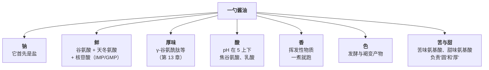
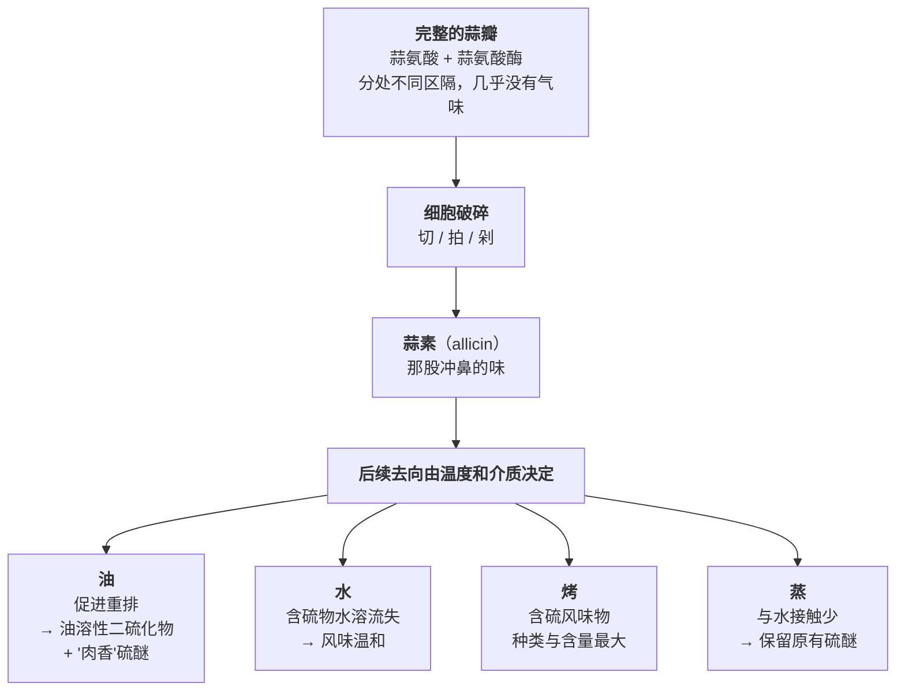

# 第 14 章 中式调料图谱：每一样解决什么问题

> **本章目标**：把第 9~13 章的五个概念（阈值、相互作用、盐、糖酸、鲜香）
> 合起来，变成一张**可以贴在厨房里的分工表**。
>
> 这一章回答两个问题：
>
> 1. **每一样中式调料到底在解决什么问题？**（几乎没有一样只做一件事）
> 2. **什么时候放？**（这由"它带来的东西怕不怕热"决定，不由"它是不是调料"决定）
>
> 学完这一章你会知道：**中式调料的绝大多数是"复合体"——
> 酱油同时是盐、是鲜、是酸、是香、是色。
> 所以"加一样调料"从来不是"加一个味"，而是同时动了好几条线。**

## 14.1 先换一个看法：调料不是"味道"，是"一包东西"

菜谱写"加一勺生抽"，你脑子里出现的可能是"咸味 + 深色"。

但如果去看市售酱油的实测成分，这一勺里同时进来的东西是：

> ## 本章的第一条可迁移规则
>
> **中式调料几乎全是复合体。判断"要不要加""什么时候加"，
> 必须先把它拆成五栏：味 · 香 · 色 · 质地 · 功能。**
>
> | 栏 | 问什么 | 决定什么 |
> |----|-------|---------|
> | **味** | 它带来咸 / 鲜 / 酸 / 甜 / 苦里的哪几样？ | 它会不会顶掉你后面要加的东西 |
> | **香** | 是"现成的"还是"造出来的"？（第 13 章） | **什么时候放** |
> | **色** | 会不会上色、会不会毁色？ | 放在哪一步、放多少 |
> | **质地** | 会不会变稠？会不会带淀粉？ | 会不会把味觉整体压低（第 10 章） |
> | **功能** | 对水、蛋白质、pH 有没有作用？ | 它是不是其实在做预处理 |
>
> **只填"味"这一栏，就是把复合体当成单一味来用——这是家庭调味出错最常见的起点。**

## 14.2 酱油：它首先是盐，其次才是鲜

### 实测成分告诉我们什么

一项 2025 年发表的研究买了 **10 种中国市售酱油**，
用液相色谱—质谱与电感耦合等离子体发射光谱逐项测定，并配了 60 人的感官评价小组。
挑出与做菜直接相关的几栏：

| 测的是什么 | 10 个样品的范围 | 对做菜的含义 |
|-----------|--------------|-------------|
| **钠离子** | 平均 **54.6 mg/mL**（钾 8.13 mg/mL） | **酱油是一种液态的盐**。引言里还转引"传统酱油含盐 15%~20%" |
| **总游离氨基酸** | **41.31~106.38 mg/mL** | 不同酱油差**两倍以上** |
| **鲜味氨基酸**（天冬氨酸 + 谷氨酸） | **22.66~76.63 mg/mL** | 鲜的主力 |
| **谷氨酸占总氨基酸的比例** | **17%~61%** | 差别极大；最低的那个样品被作者归因为**没有额外添加味精** |
| **总核苷酸** | **1.55~13.21 mg/mL**（IMP 0.44~12.50） | 第 9 章的"核苷酸侧"在酱油里**有的多、有的几乎没有** |
| **甜味氨基酸 / 苦味氨基酸** | 8.13~22.97 / 10.20~24.24 mg/mL | 甜味氨基酸被认为"缓冲咸味的尖锐"，苦味氨基酸带来回味与厚度 |
| **pH** | **4.9~5.5** | **酱油是酸性的** |
| **水活度** | **0.83~0.86** | 呼应第 3 章：靠低水活度保存 |

> ⚠️ **适用范围**：这是**10 个中国市售样品**的实测，不是行业普查；
> 具体品牌之间差异很大。本书用它说明**量级与离散度**，不用它写"酱油含多少"。

### 从这张表能直接推出的四件事

**① 加酱油就是在加盐——所以先加酱油，再决定盐。**

如果你习惯"先放盐，再看颜色够不够补酱油"，那你几乎一定会咸。
正确的顺序是**反过来**：先把酱油（以及蚝油、豆瓣这些自带盐的东西）放到位，
尝一口，**最后**用盐做微调。

**② 换一瓶酱油，菜谱的克数就不成立了。**

样品之间总氨基酸差两倍以上、谷氨酸占比从 17% 到 61%、核苷酸差近十倍。
这是本书目前找到的、**对"照着克数做还是不对"最直接的一手解释**：
**你和写菜谱的人用的不是同一种液体。**

**③ 酱油是酸的（pH 4.9~5.5），所以它会"带副作用"。**

- 第 9 章：**味精在强酸或强碱条件下鲜味强度下降**——酱油放很多的菜里，
  再加鲜味调料的边际效果会变差；
- 第 8 章：**叶绿素在酸催化下失镁、由鲜绿变暗褐**——
  这是"绿叶菜一放老抽就发暗"的机理方向（⚠️ 本书未核到直接对照实验）。

**④ 酱油同时是"味"和"香"，所以它属于第 13 章说的"要放两次"的那一类。**

酱油的香气是挥发性的，久煮会没；而它的咸、鲜、色需要时间融进去。
**早放一次给味与色，起锅前再补一点给香**——这是第 13 章那条规则在酱油上的具体落地。

> ⚠️ **"沿锅边淋酱油"**：机制上讲得通（先接触热锅面、快速蒸发并产生焦香），
> 但本书**未核到对照实验**，在[出处登记](../../standards.md)里是一条已知缺口，
> 这里标为**惯例 + 机制推理**。

## 14.3 醋：酸留得下来，醋香留不下来

### 醋里有两类酸，它们的命运完全不同

一篇 2025 年的中国谷物醋综述汇总了多项测定：

| 事实 | 数据 | 含义 |
|------|------|------|
| 有机酸是谷物醋最主要的呈味成分 | 一项对 **17 种麸醋**的分析：有机酸总量 **4100~7500 mg/100 mL** | 醋的"酸"不是单一物质 |
| **乙酸 + 乳酸合计占八成以上** | ">80% 的总有机酸"，且地域间差异很小 | 这两样决定基调 |
| **乙酸是挥发性的、刺激性强**[^3] | 综述称其"含量最高、刺激性强" | **它会跑掉**，也会呛 |
| **乳酸、苹果酸、柠檬酸、琥珀酸是不挥发的** | 综述称它们"缓和乙酸的刺激，带来柔和与醇厚" | **它们留下来** |
| 醋的香气来自酯类、吡嗪、呋喃等 | 酯类带果香花香、**挥发性突出**；吡嗪带烤坚果香；呋喃带焦糖香，在**熏醅与陈酿**中升高 | 香气整体怕热 |

> ## 本章的第二条可迁移规则
>
> **久煮的醋，酸还在、香没了。**
>
> 这解释了两件事：
>
> 1. **早放的醋和晚放的醋，做的是两件不同的事**——
>    早放是"用酸去改变体系"（软化、调 pH、帮助胶原转明胶），
>    晚放是"用挥发性酸香去提神"；
> 2. **糖醋、醋溜这类菜要放两次醋**——
>    一次在烧的过程里（给酸与作用），一次在出锅前（给香）。

### 不同的醋不能互换

综述给出的原料与工艺对照（挑与厨房相关的）：

| 醋 | 主料与工艺 | 综述描述的风味特征 |
|----|-----------|------------------|
| **山西老陈醋** | 高粱；固态发酵 + **熏醅** + 晒与捞冰陈酿 | 色深、体厚、酸味绵长；熏香是其典型风味 |
| **镇江香醋** | 糯米 + 麦麸；固态分层发酵 | "酸而不涩、香而微甜"，陈酿后香气更复杂 |
| **四川保宁醋** | 麸皮 + 小麦，药曲 | 综述称其**乳酸明显多于乙酸**，是四类名醋中总有机酸最高的 |
| **永春老醋** | 糯米；**液态**深层发酵 | 其他有机酸含量明显低于三种固态发酵醋 |

> **厨房推论**：**"乳酸型"的醋（如保宁）柔和、后味长，"乙酸型"的醋更冲、更跳。**
> 一道菜里换醋种，改变的不只是酸度，还有"这股酸出现得多快、走得多快"。
> ⚠️ 上表是**综述转引的产品特征描述**，不是同一批次的并行测定，**不能当成定量比较**。

## 14.4 料酒：它不只是"带走异味"，还在"阻止异味产生"

这是本章最值得改写认知的一条。

一项 2026 年发表的研究以**红烧肉**为对象，对比了**加黄酒**与**不加黄酒**两组，
测了游离氨基酸、核苷酸、脂肪酸，并用电子鼻、电子舌与气相色谱—质谱跟踪加热过程中的风味演变。
结论是黄酒的"去腥增香"作用**分两条路**：

| 路径 | 研究观察到的 | 厨房含义 |
|------|------------|---------|
| **①防止异味生成** | 黄酒**抑制了不饱和脂肪酸的过度氧化**，从而减少了 **1-辛烯-3-醇、辛醛**这类异味物；**异味物含量与不饱和脂肪酸含量显著负相关** | **料酒必须在"异味还没产生"的时候就在场**——也就是加热早期 |
| **②带走 + 补上** | 它"溶解并挥发掉部分异味成分"，同时**直接贡献苯乙醇、香茅醛**等带花果香的物质 | 这一半是"现成的香"（第 13 章），**怕久煮** |

研究还筛出十个区分两组的关键挥发物，包括 (E,E)-2,4-壬二烯醛、乙醇、壬醛、辛醛、
庚醛、1-辛烯-3-醇、香茅醛、己醛、(E)-2-辛烯醛、苯乙醇。

> ⚠️ **适用范围**：**单一菜品（红烧肉）、单一酒种（黄酒）、单项研究**。
> 本书用它把"料酒去腥"从纯粹的口传升级为**有一手依据的双路径解释**，
> **不用它推广到所有肉、所有酒**。

> ## 本章的第三条可迁移规则
>
> **料酒是"早放"的东西，不是"起锅前去腥"的东西。**
>
> - 它的第一条作用路径（抑制脂肪氧化）要求**它在氧化发生之前就在**；
> - 它的第二条路径（带走 + 补香）要求**锅是敞的、温度够高**，
>   否则酒精带着异味出不去，反而留下"酒味"。
>
> **所以"腥味重了才补一勺料酒"基本是无效操作**——
> 那时候异味物已经生成，而你又没给它跑掉的条件。

> **一个必须说清楚的边界**：本书在[出处登记](../../standards.md)里
> **仍把"酸和酒去腥的机理（三甲胺等挥发性胺）"列为已核到不足的缺口**。
> 上面这项研究给的是**红烧肉体系里的现象与相关性**，
> **不是"酒中和了胺类"这条常见说法的证据**。两者不要混为一谈。

## 14.5 蚝油：一个自带"减味"副作用的鲜味来源

一项 2024 年的研究在介绍蚝油时写明了它的构成：
**以牡蛎酶解产物为核心，辅以糖、盐、变性淀粉与增稠剂**。
该研究用固相微萃取—气相色谱—嗅闻—质谱比较了市售蚝油与牡蛎酶解液，
筛出 15 种可用于判别的气味物质，其中**乙酸、2-戊基呋喃、2-乙基呋喃、2-甲基丁醛、壬醛**
只在蚝油与牡蛎酶解液中检出。

对做菜真正要紧的是**"变性淀粉与增稠剂"这半句**：

> 第 10 章的一手研究（56 名受试者、三种模型饮料）显示：
> **加入增稠剂后，咸、酸、甜三种强度均显著下降**
> （β 分别约为 −4.16、−3.29、−3.43，p<0.001）。
> ⚠️ 该研究同时指出**黏度本身不是好的机理解释变量**——现象成立，机理未定。

> ## 蚝油的正确用法（由上面两条推出）
>
> 1. **它是"鲜 + 咸 + 稠"三件套**，所以它和酱油**不是加法关系**，会互相顶；
> 2. **它带来的稠会把整锅的味觉强度压低一点**——
>    所以**放完蚝油要重新尝**，很容易误判成"还不够味"而继续加盐；
> 3. 淀粉类增稠物**怕长时间大火**（第 6 章：煮过头颗粒解体，酱汁反而变稀），
>    所以蚝油偏向**中后段**放，不适合一开始就下去久煮。

## 14.6 豆瓣：一次"把它拿掉"的实验，证明了盐替代不了鲜

一项 2025 年发表的研究做了件很少有人做的事——**缺项实验**：
以川菜**水煮牛肉**为对象，分别做了完整版、去掉郫县豆瓣版、去掉刀口辣椒版、不泼油版，
用电子鼻、电子舌、气相色谱—离子迁移谱与感官评价一起测。

| 组 | 改了什么 | 感官结果 |
|----|---------|---------|
| **A（完整）/ D（不泼油）** | — | 鲜、辣、香与喜好度**均在 8.0 以上** |
| **B** | **去掉郫县豆瓣** | **鲜味 4.25、总体可接受度 4.25**——**尽管这一组的咸度更高** |
| **C** | 去掉刀口辣椒 | 辣与麻减弱、香气下降，可接受度 5.25 |
| **D** | **不泼油** | **香气评分最高（8.83）**，鲜与辣不降 |

### 三条推论

**① "更咸"救不了"缺鲜"——这是一手证据。**

B 组咸度比对照更高，鲜味与可接受度却都掉到一半左右。
这正是[尝味纠偏表](../../forms/tasting-fix.md)里"咸是有的，但寡、空、不厚"那一行的实证：
**你不断加盐却觉得没味道时，缺的东西盐给不了。**

**② 豆瓣在"味"这一栏，辣椒在"香"这一栏。**

电子舌指向豆瓣对**味**（尤其鲜）贡献最大，电子鼻指向刀口辣椒对**香**影响最大——
两样东西**不可互相替代**。

**③ 泼油这一步，很可能在"损耗香气"而不是"释放香气"。**

作者的解释是**泼油加速了香气挥发**；
未泼油样品中烯类与 **2,6-二甲基-3-乙基吡嗪**（烤香类）反而更高。

> ⚠️ **这条反直觉结论只有这一项研究**，且是**工业预制菜语境下的标准化研究**。
> 本书把它标为 ⚠️ **有初步证据**，并提醒：
> 泼油还承担着"把干辣椒与花椒的香在最后一刻造出来并送到鼻前"的作用，
> 而**鼻前的香不等于吃到的香**（第 10、13 章）。
> **"厨房里很香"本来就可能是香气正在离开食物。**

## 14.7 葱姜蒜：蒜是可以被"设计"的

### 蒜的风味不是现成的，是你动手那一刻才开始生成的

一篇 2026 年的大蒜含硫风味综述给出了完整链条——关键角色是**蒜氨酸酶**与**蒜素**[^1]：

综述里几条可以直接拿来用的判据：

| 事实 | 综述给出的内容 |
|------|--------------|
| **拍 vs 切** | 有实验比较了**新鲜切片蒜**与**新鲜捣碎蒜**：捣碎的蒜素与丙酮酸含量更高、整体风味与香气**更受偏好**；但**切片的更稳定**（捣碎后表面积大、蒜素更快被氧化分解） |
| **温度决定走哪条路** | 蒜氨酸酶最适温度约 **35~40 °C**；到 **60 °C** 以上逐渐失活；**超过 80 °C 不可逆失活**，此后由非酶反应（硫醚重排、美拉德、焦糖化）主导 |
| **久热的代价** | 长时间加热会降解热不稳定的环状硫化物，**挥发性硫化物随蒸汽流失** |
| **放置时间** | 有研究观察到捣碎后 **30~240 分钟**内挥发性含硫物增加，但蒜素总量无显著变化（它处在降解与合成的动态平衡中） |

> ## 本章的第四条可迁移规则
>
> **蒜不是"一种味道"，是一组你可以挑的味道。选哪一个，由"破碎程度 × 温度 × 介质"决定。**
>
> | 你想要 | 怎么做 | 机理 |
> |-------|-------|------|
> | **冲、辛、生猛** | **拍碎**，**出锅后**或低温下放 | 蒜素本身；不给它被热改造的机会 |
> | **肉香、厚、垫底** | **拍碎或切片，用油爆** | 油促进蒜素重排，生成油溶性硫醚 |
> | **甜、软、温和** | **整瓣**，随汤炖或蒸 | 细胞未大量破碎 + 水溶流失 |
> | **烤香、浓** | 整瓣或切开**烤** | 含硫风味物种类与含量最大 |
> | **两种都要** | **放两次**（早放爆香 + 出锅撒生蒜） | 第 13 章那条规则 |
>
> **推论**：**"整颗蒜炖汤没有蒜味"不是蒜的问题，是你没让它破碎。**
> 反过来，**"蒜末一下锅就焦苦"也不是火大的问题，是你把它单独放在了最高温里。**

### 关于葱和姜，本书现在只能说这些

**葱**：第 13 章已核到，**洋葱的含硫成分被列为厚味物质**，
大蒜是厚味研究的最早来源。所以葱蒜类**不只是去腥增香，也在搭"厚"的底**。

**姜**：厨房里流传的"姜受热后辣味会变"有具体的化学说法，
但本书**这一轮没有核到一手实验**，因此**不写机理、不写数字**，
只在[出处登记](../../standards.md)里登记为缺口。

> **这就是本书的纪律**：**宁可在一章里承认"姜这一格是空的"，
> 也不用听起来合理的说法把它填满。**

## 14.8 花椒与辣椒：它们根本不在"味觉"这条线上

### 麻是一种触觉/痛觉事件

第 9 章已经讲过：**辛辣与收敛（涩）主要由躯体感觉系统检测，不列入基本味觉**。
花椒更极端。一篇 2024 年的综述汇总了山椒素类酰胺的作用机制：

- 代表物质是**羟基-α-山椒素**[^2]；
- 它能**激活 TRPV1 与 TRPA1 通道**（与辣椒素、芥末的作用通道部分重合）；
- 它还通过**抑制对 pH 和麻醉剂敏感的双孔钾通道（KCNK3、KCNK9、KCNK18）**
  直接兴奋感觉神经元；
- 同属的酰胺在感官上分别被描述为"刺痛""麻""灼烧""清凉""苦"，
  **分子构型（Z 式双键）决定它偏"麻"还是偏"刺"**。

> **所以"麻"是可以和"咸"共存、也可以和"咸"竞争的东西，
> 但它不会被"加盐"补上，也补不了盐。**

### 花椒的麻怕氧、爱油

另有研究报告：山椒素**容易被氧化分解**；
把花椒果皮用**中链甘油三酯油**提取后制成的水包油乳液，
在 50 °C 的加速试验中羟基-α-山椒素保持稳定；
但当体系里缺少 **α-生育酚**（一种抗氧化剂）且加入粉体时，它就变得不稳定——
作者强调关键在于**让山椒素和抗氧化剂待在一起**。

> **厨房推论（方向性）**：**花椒的麻味物质适合"存在油里"。**
> 这给"花椒油""油泼花椒"提供了机理方向。
> ⚠️ 这是**模型乳液与加速试验**，不是炒锅；**本书只用方向，不给比例与时间**。

### 三叉神经刺激能不能"替代盐"？——这条要格外小心

一篇 2026 年的迷你综述专门回顾了"三叉神经刺激与咸味感知"的关系。
它转引的两组数字是：

| 转引的结果 | 条件 |
|----------|------|
| 用**花椒**时，在中等敏感与高敏感人群中**最大减盐幅度接近 40%** | 感官试验；该综述明确指出**这类研究未在复杂食品体系中考察可口性** |
| 在 **氯化钠 + 辣椒素 + 胡椒碱的水溶液**中，咸味强度最大增强 **37.65%**，对应减盐 **26.09%** | **水溶液**体系 |

综述自己给出的三条限制，本书原样保留：

1. 这种增强**常常被随之而来的不良感受掩盖**——酸、苦、金属味、灼烧感，
   结果是**消费者接受度下降**；
2. 化学刺激物的**挥发性、反应性与低溶解度**限制了它们的实际使用；
3. 效应**随年龄变化**：转引的一项研究中**年轻受试者报告的咸味增强幅度大于年长者**。

> ⚠️ **本书对这条的处理**：
> **证据层级是"综述里的转引"，体系是"水溶液或试纸"，终点是"感官评分"。**
> 因此本书**只写方向**——"麻辣能在低盐时把咸味顶上来一点"——
> **不把 40% 或 37.65% 当成厨房里的可迁移数字**，
> 也不据此做任何摄入量建议。
> 这一条与第 10 章的水煮鸡实验形成呼应：
> **气味与刺激带来的"补偿"只在低盐档显著，在常规盐档基本看不到。**

## 14.9 总表：每一样解决什么问题、什么时候放

把前面各节收成一张表。**这张表是本章的交付物**。

| 调料 | 味（它带来什么） | 香（现成/造出） | 色 | 质地 | 其他功能 | 什么时候放 |
|------|---------------|---------------|-----|------|---------|----------|
| **生抽 / 酱油** | **咸**（首先是盐）+ 鲜（谷氨酸侧，部分含核苷酸）+ 厚味 + 微酸微甜微苦 | **两者都有** | 上色 | — | 酸性（pH 约 5） | **分两次**：早放给味与色，起锅前补给香 |
| **老抽** | 咸 + 色为主 | 弱 | **强上色** | — | 同上 | 早放（要时间上色） |
| **醋** | **酸**（挥发性乙酸 + 不挥发乳酸等） | **两者都有** | 深色醋会上色 | — | 降 pH（影响胶原、叶绿素、酶） | **分两次**：早放给作用，出锅前给香 |
| **料酒 / 黄酒** | 微甜、微鲜 | 现成的香 + **防止异味生成** | — | — | 抑制不饱和脂肪酸过度氧化 | **早放**，且要让它跑得掉（别盖严） |
| **蚝油** | 鲜 + **咸** | 现成的香（弱） | 微上色 | **会变稠**（含变性淀粉与增稠剂） | 稠度会**压低**味觉强度 | 中后段；**放完必须重新尝** |
| **豆瓣** | **鲜 + 咸**（味的主力） | 造出来的香（需炒出红油） | 上色（红油） | 有颗粒 | 发酵物，含厚味物质 | **早放并炒香** |
| **味精 / 鸡精** | 鲜 | — | — | — | 需要"有东西可增"（第 13 章） | 晚；强酸强碱体系里效果差 |
| **糖** | 甜 | 造出来的香（糖色、焦糖化） | **炒糖色时上色** | 高浓度影响质地 | 提高蛋白变性温度（方向性，第 12 章） | 看用途：调味晚、糖色最早 |
| **盐** | **咸** | — | — | — | 溶出肌原纤维蛋白、控水、抑菌（第 11 章） | **最后微调**（前面的复合调料已带盐） |
| **葱** | 微甜 | 造出的香（爆）/ 现成的香（葱花） | — | — | 含硫成分，厚味侧 | **放两次** |
| **姜** | — | 现成 + 造出 | — | — | ⚠️ 本书未核到一手机理 | 早放（惯例） |
| **蒜** | 微甜 | **由你决定**（见 14.7） | — | — | 厚味最早的来源 | **放两次**最划算 |
| **花椒** | 不是味觉——**麻**（TRPV1/TRPA1 + 钾通道） | 造出来的香 | — | — | 麻味物质**易氧化、亲油** | 整粒早放用油；粉末最后 |
| **干辣椒 / 辣椒面** | 不是味觉——**辣** | 造出来的香 | 上红色 | — | 三叉神经刺激，低盐时可略增咸感 | 早放用油；泼油那一次在最后 |
| **香油** | — | **现成的香 + 载体** | — | — | 兜住其他香气（第 13 章） | **出锅后** |

## 14.10 常见说法辨析

按本书约定标注**证据强度**：✅ 有共识 / ⚠️ 有争议 / ❌ 明确错误 / 缺乏证据。
来源见[出处登记](../../standards.md)。

| 说法 | 判定 | 说明 |
|------|------|------|
| "酱油是用来上色和提鲜的" | ⚠️ **漏掉了最要紧的一项** | 实测 10 个中国市售样品**钠离子平均 54.6 mg/mL**，引言转引"传统酱油含盐 15%~20%"。**它首先是盐。** 正确顺序是先放酱油、最后用盐微调 |
| "菜谱写多少克盐就放多少克" | ❌ **前提不成立** | 同一研究中 10 种酱油的**总氨基酸差两倍以上**、**谷氨酸占总氨基酸从 17% 到 61%**、总核苷酸相差近十倍。你和菜谱作者用的**不是同一种液体** |
| "醋一煮就没了" | ⚠️ **只对香气那一半** | 谷物醋中**乙酸 + 乳酸占总有机酸八成以上**；乙酸挥发、乳酸等不挥发。久煮跑掉的是**乙酸的一部分与酯类香气**，**酸味主体留下**。所以醋要**放两次** |
| "各种醋可以互换" | ⚠️ **风味结构不同** | 综述转引：保宁醋**乳酸明显多于乙酸**、总有机酸最高；永春（液态发酵）其他有机酸明显低；山西老陈醋有**熏醅**带来的特征香。⚠️ 这些是产品特征描述，**不是同批次定量比较** |
| "料酒是起锅前用来去腥的" | ❌ **时机反了** | 红烧肉的一手研究显示黄酒走两条路：**抑制不饱和脂肪酸过度氧化**（减少 1-辛烯-3-醇、辛醛等异味物）与**溶解挥发 + 直接补香**。第一条要求它在**异味生成之前**就在锅里。⚠️ 单一菜品、单项研究 |
| "料酒靠酸碱中和把腥味物质中和掉" | 缺乏证据（本书未核到） | 这条常见解释指向三甲胺等挥发性胺。本书**仍未核到一手实验**，[出处登记](../../standards.md)中列为缺口。上面那项研究给的是**红烧肉体系内的现象与相关性**，不是这条说法的证据 |
| "蚝油就是浓一点的酱油" | ❌ **成分与副作用都不同** | 蚝油以**牡蛎酶解产物**为核心，辅以糖、盐、**变性淀粉与增稠剂**。而一手研究显示**加入增稠剂后咸、酸、甜强度均显著下降**（β 约 −4.16 / −3.29 / −3.43）。所以**放完蚝油要重新尝**，否则容易越加越咸 |
| "不够味就多放点盐" | ❌ **有反例，且是一手的** | 水煮牛肉的缺项实验中，**去掉郫县豆瓣的一组咸度更高，鲜味与总体可接受度却都只有 4.25**（完整组 8.0 以上）。**盐补不了鲜与厚** |
| "最后泼一勺热油更香" | ⚠️ **鼻前更香，吃到的未必** | 同一研究中**不泼油的一组香气评分最高（8.83）**，未泼油样品的烯类与 2,6-二甲基-3-乙基吡嗪更高，作者归因为**泼油加速香气挥发**。⚠️ **仅此一项研究**；且泼油还在"最后一刻造香"，而鼻前的香不等于鼻后吃到的香（第 10、13 章） |
| "蒜要切还是要拍都一样" | ❌ **不一样** | 综述转引的对比实验：**捣碎的蒜蒜素与丙酮酸含量更高、风味与香气更受偏好**；切片的**更稳定**（捣碎后氧化更快）。破碎程度直接决定生成多少蒜素 |
| "蒜怎么做都是蒜味" | ❌ **介质决定风味走向** | 综述：**油炸**促进蒜素重排生成油溶性二硫化物与"肉香"硫醚；**水煮**因水溶流失而风味温和；**烤**使含硫风味物种类与含量最大；**蒸**保留更多原有硫醚。另：蒜氨酸酶最适 **35~40 °C**、**超过 80 °C 不可逆失活** |
| "花椒的麻是一种味道" | ❌ **不是味觉** | 羟基-α-山椒素**激活 TRPV1/TRPA1**，并**抑制双孔钾通道（KCNK3/9/18）**直接兴奋感觉神经元。第 9 章：辛辣与收敛由躯体感觉系统检测，不列入基本味觉 |
| "多放辣多放麻就能少放盐" | ⚠️ **方向有证据，数字不可照搬** | 一篇迷你综述**转引**：花椒使最大减盐接近 **40%**；氯化钠+辣椒素+胡椒碱**水溶液**中咸味最大增强 **37.65%**（减盐 26.09%）。⚠️ **转引 + 水溶液/试纸体系**；综述自己指出这种增强**常被酸、苦、金属味与灼烧感掩盖**，导致接受度下降，且效应**随年龄下降**。本书只取方向 |
| "调料放得越多越有味" | ❌ **与第 10 章直接冲突** | 二元混合中**每种味通常都被感知为比单独尝时更弱**。"往锅里加东西"的默认后果是把已有的味道一起压下去 |

## 14.11 🔎 下次做菜时的用处

1. **先放带盐的复合调料（酱油、蚝油、豆瓣），尝过之后再用盐微调。** 顺序反了必咸。
2. **换了一瓶酱油就当换了一份菜谱**——重新尝、重新定量，别照搬克数。
3. **醋和酱油都要放两次**：早一次给味与作用，晚一次给香。
4. **料酒早放、锅别盖严**；腥味已经出来才补酒，基本无效。
5. **放完蚝油一定重新尝**——它带来的稠会把整锅味觉压低一点。
6. **"越加越咸还是没味"时，停下来想鲜与厚**，不要继续加盐。
7. **下锅前先决定你要哪一种蒜**：冲的（拍碎、晚放）、肉香的（油爆）、甜的（整瓣炖）。
8. **花椒粉最后放、整粒花椒用油早放**；麻味物质怕氧、亲油。
9. **麻辣能在"已经偏淡"的菜里把咸味顶上来一点，但救不了一锅本来就没鲜的菜。**

## 14.12 思考题

1. 为什么本书说"中式调料几乎全是复合体"？把一样调料拆成哪五栏？
2. 酱油的实测数据里，哪一条最直接地解释了"照着菜谱的克数做还是不对"？
3. 酱油的 pH 在 4.9~5.5，这会带来哪两个"副作用"？分别牵涉到前面哪两章？
4. 醋里的两类酸命运有什么不同？由此推出的操作是什么？
5. **【案例】** 你在做一道红烧类的菜，手边有生抽、老抽、香醋、黄酒、蚝油、豆瓣、
   糖、盐、葱姜蒜、花椒、香油。
   （a）请排出这些东西的**加入顺序**，并给每一样写一句理由；
   （b）哪几样要"放两次"？
   （c）如果最后尝起来"咸但空"，你会做什么？**不会**做什么？
6. 料酒的两条作用路径分别是什么？为什么"起锅前补一勺料酒去腥"基本无效？
   这项证据的适用范围有多大？
7. 蚝油为什么需要"放完重新尝"？请给出这条结论背后的一手数据及其局限。
8. **【辨析】** "不够味就多放点盐"——请用水煮牛肉缺项实验的数据判断这条说法，
   并说明这组数据为什么特别有说服力。
9. **【案例】** 你想让一盘蒜香排骨既有"爆过的香"又有"生蒜的冲"。
   （a）你会怎么处理蒜？（b）分别在什么时候放？（c）机理分别是什么？
   （d）如果换成炖一锅排骨汤，你的做法要怎么改？
10. **【辨析】** "多放辣多放麻就能少放盐"——判断证据强度。
    请说明数字来自什么层级的来源、在什么体系中得到、综述自己给出了哪三条限制。
11. 本章在"姜"这一格写了"本书未核到一手机理"。
    为什么不直接写一个听起来合理的解释？这体现了本书的哪条纪律？

> 📖 **参考答案**（想清楚再看）：[Q1](../../qa/14-chinese-condiments-qa.md#q1) ·
> [Q2](../../qa/14-chinese-condiments-qa.md#q2) · [Q3](../../qa/14-chinese-condiments-qa.md#q3) ·
> [Q4](../../qa/14-chinese-condiments-qa.md#q4) · [Q5](../../qa/14-chinese-condiments-qa.md#q5) ·
> [Q6](../../qa/14-chinese-condiments-qa.md#q6) · [Q7](../../qa/14-chinese-condiments-qa.md#q7) ·
> [Q8](../../qa/14-chinese-condiments-qa.md#q8) · [Q9](../../qa/14-chinese-condiments-qa.md#q9) ·
> [Q10](../../qa/14-chinese-condiments-qa.md#q10) · [Q11](../../qa/14-chinese-condiments-qa.md#q11)

## 14.13 本章实操

### 🅐 零成本版 · 任务一：给你家的调料柜做一张"五栏拆解表"

把你厨房里所有调料列出来，按 14.1 的五栏拆。

| 调料 | 味（含不含盐？） | 香（现成/造出/都有） | 色 | 质地（会不会变稠） | 其他功能 | 我现在什么时候放 | 按本章该什么时候放 |
|------|--------------|-----------------|----|--------------|---------|--------------|----------------|
| 生抽 | | | | | | | |
| 老抽 | | | | | | | |
| 醋 | | | | | | | |
| 料酒 | | | | | | | |
| 蚝油 | | | | | | | |
| 豆瓣/辣酱 | | | | | | | |
| 味精/鸡精 | | | | | | | |
| 糖 | | | | | | | |
| 葱 / 姜 / 蒜 | | | | | | | |
| 花椒 / 辣椒 | | | | | | | |

做完回答：

1. 有几样是**自带盐**的？你平时放盐时把它们算进去了吗？
2. 有几样被你判断为"**两者都有**"（要放两次）？
3. 你现在的顺序里，最该改的**三处**是哪三处？

### 🅐 零成本版 · 任务二：把家里的酱油瓶拿出来对比

不用开火，只看标签与颜色、闻香。

| 我家的酱油 | 标签上的用途（生抽/老抽/其他） | 闻起来（香气强弱、什么类型） | 颜色深浅 | 我平时用它做什么 | 该改成什么 |
|-----------|---------------------------|------------------------|---------|--------------|-----------|
| ① | | | | | |
| ② | | | | | |

做完回答：

1. 两瓶的香气强度差别大吗？**香气强的那瓶更应该"晚放一次"**——为什么？
2. 如果你只买一瓶，你会选偏"味"的还是偏"香"的？为什么这个选择会改变你的放置时机？

> ⚠️ 本书**没有核到**家用酱油的逐品牌成分数据。
> 这张表是**让你建立自己的基准**，不是让你判断"哪瓶更好"。

### 🅐 零成本版 · 任务三：把一份川菜菜谱按"缺项实验"拆一遍

找一份有豆瓣、有辣椒、有花椒、最后泼油的菜谱，逐项做思想实验。

| 如果拿掉这一样 | 我预测会丢掉什么（味/香/色/口感） | 本章的实验数据支持吗 | 能用什么替代 |
|--------------|------------------------------|------------------|-----------|
| 豆瓣 | | | |
| 干辣椒 | | | |
| 花椒 | | | |
| 最后那勺泼油 | | | |

做完回答：**哪一样是"不可替代"的？为什么？**

### 🅑 开火版 · 任务四：同一把蒜，四种做法（有灶台时做）

**需要**：蒜、油、水、一样中性主料（豆腐、面、白菜都行）、烤箱或蒸锅（有则做）。

| 组 | 处理 | 闻起来（冲/肉香/甜/焦） | 尝起来 | 余味长短 |
|----|------|--------------------|-------|---------|
| ① | **拍碎 + 出锅后生放** | | | |
| ② | **拍碎 + 热油爆** | | | |
| ③ | **整瓣 + 随水煮** | | | |
| ④ | **整瓣 + 烤或蒸**（有条件时） | | | |

做完回答：

1. ①和②是同一种香吗？本章预测它们不同——你的结果符合吗？
2. ③为什么最温和？（提示：水溶性 + 细胞未大量破碎）
3. 你平时做菜时，**想要的是哪一种**？你现在的做法拿到的是哪一种？

### 🅑 开火版 · 任务五：酱油放两次 vs 只放一次

**需要**：同一种酱油、同一样主料、两口锅（或分两次做）。

| 组 | 做法 | 咸度（0~10） | 鲜度（0~10） | **闻起来的酱香**（0~10） | 颜色 |
|----|------|------------|------------|--------------------|------|
| ① | 全部酱油**一开始**放 | | | | |
| ② | **八成一开始放、两成起锅前放** | | | | |

做完回答：

1. 两组的**咸度**差别大吗？**酱香**呢？
2. 这个结果符合"酱油同时是味和香"的预期吗？
3. 你会不会把这个做法固定下来？对哪几类菜最值得？

### 🅑 开火版 · 任务六：蚝油前后各尝一次

**需要**：一锅偏淡的菜或汤、蚝油。

| 时点 | 咸度（0~10） | 鲜度（0~10） | **整体味道的"清晰度"**（0~10） | 稠不稠 |
|------|------------|------------|------------------------|-------|
| 加蚝油**前** | | | | |
| 加蚝油**后、搅匀静置 1 分钟** | | | | |

做完回答：

1. 加完之后"清晰度"是上升还是下降？
2. 如果你此时觉得"还不够咸"，**在加盐之前**你应该先排除什么？
3. 这和第 10 章"增稠使咸、酸、甜强度均显著下降"的结论一致吗？

> ⚠️ **安全提醒**：实操剩下的食物不要在室温下久放。
> 美国 FDA 的指引是易腐食品在烹调后 **2 小时内**冷藏
> （环境温度高于 90 °F 时缩短到 1 小时）。**各国口径不同，以本地现行发布为准。**

## 14.14 本章依据

本章引用的来源与核对状态详见[参考书目与出处登记](../../standards.md)，具体对应如下：

| 本章用到的内容 | 依据 |
|--------------|------|
| **10 种中国市售酱油的实测成分**：钠离子平均 **54.6 mg/mL**、钾 8.13 mg/mL；总游离氨基酸 **41.31~106.38 mg/mL**；鲜味氨基酸（Asp+Glu）**22.66~76.63 mg/mL**；**谷氨酸占总氨基酸 17%~61%**（最低者被归因于未添加味精）；甜味氨基酸 8.13~22.97、苦味氨基酸 10.20~24.24 mg/mL；总核苷酸 **1.55~13.21 mg/mL**（IMP 0.44~12.50、GMP 0.41~2.51）；焦谷氨酸 19.6~79.22 mg/mL；**pH 4.9~5.5**、**水活度 0.83~0.86**；引言转引"传统酱油含盐 **15%~20%**" | 一项关于酱油关键呈味物质多元分析与咸度强度建模的研究，*Foods*，2025（PMC12731317），✅ 开放获取全文。⚠️ **10 个市售样品**的实测，非行业普查；本书只用其**量级与离散度** |
| **中国谷物醋的呈味与香气结构**：17 种麸醋有机酸总量 **4100~7500 mg/100 mL**、**乙酸 + 乳酸占八成以上**；乙酸挥发且刺激性强，乳酸/苹果酸/柠檬酸/琥珀酸不挥发并缓和乙酸；酯类带果香花香且挥发性突出、吡嗪带烤坚果香、呋喃带焦糖香并在熏醅与陈酿中升高；山西老陈醋（高粱 + 熏醅）、镇江香醋（糯米 + 麦麸）、保宁醋（麸皮 + 药曲，**乳酸多于乙酸、总有机酸最高**）、永春老醋（液态发酵，其他有机酸明显更低） | 一篇关于中国传统谷物醋风味差异与形成机制的综述，*Foods*，2025（PMC12248918），✅ 开放获取全文。⚠️ 产品特征与部分数值为**综述转引**，不同研究条件各异，**不可横向定量比较** |
| **黄酒在红烧肉中的双路径作用**：抑制不饱和脂肪酸过度氧化从而减少 **1-辛烯-3-醇、辛醛**等异味物（异味物含量与不饱和脂肪酸含量**显著负相关**）；溶解并挥发掉部分异味成分，同时**直接贡献苯乙醇、香茅醛**等花果香；十个关键差异挥发物清单；丙氨酸对整体滋味贡献显著、IMP 的呈味活性值大于 1 | 一项用风味组学研究黄酒对红烧肉风味影响的研究，*Food Chemistry: X*，2026（PMC13129437），✅ 开放获取全文。⚠️ **单一菜品、单一酒种、单项研究**，不可推广到所有肉与所有酒 |
| **蚝油的构成与气味物质**：以**牡蛎酶解产物**为核心，辅以糖、盐、**变性淀粉与增稠剂**；筛出 15 种判别性气味物质，其中乙酸、2-戊基呋喃、2-乙基呋喃、2-甲基丁醛、壬醛只在蚝油与牡蛎酶解液中检出 | 一项比较市售蚝油与牡蛎酶解液气味物质的研究，*Food Chemistry: X*，2024（PMC10877158），✅ 开放获取全文 |
| **水煮牛肉的缺项实验**：去掉郫县豆瓣一组**鲜味 4.25、总体可接受度 4.25**（完整组与不泼油组均在 **8.0** 以上），**尽管该组咸度更高**；去掉刀口辣椒一组辣与麻减弱、可接受度 5.25；**不泼油一组香气评分最高（8.83）**且鲜辣不降，未泼油样品烯类与 **2,6-二甲基-3-乙基吡嗪**更高，作者归因为**泼油加速香气挥发**；电子舌指向豆瓣主导"味"、电子鼻指向刀口辣椒主导"香" | 一项关于省略郫县豆瓣、刀口辣椒与泼油工序对水煮牛肉风味影响的研究，*Food Chemistry: X*，2025（PMC12554931），✅ 开放获取全文。⚠️ "不泼油更香"**仅此一项研究**，且为工业预制菜标准化语境 |
| **大蒜风味的形成与调控**：完整蒜瓣中蒜氨酸与蒜氨酸酶分处区隔，**细胞破碎后才生成蒜素**；转引的对比实验中**捣碎蒜的蒜素与丙酮酸高于切片蒜、风味与香气更受偏好，而切片蒜更稳定**；**蒜氨酸酶最适 35~40 °C、60 °C 以上逐渐失活、超过 80 °C 不可逆失活**，此后非酶反应（硫醚重排、美拉德、焦糖化）主导；**油炸**促进蒜素重排生成油溶性乙烯基二硫化物与"肉香"硫醚、**水煮**因水溶性而流失致风味温和、**烤**使含硫风味物种类与含量最大、**蒸**保留更多原有硫醚；长时间加热降解热不稳定环状硫化物并使挥发性硫化物随蒸汽流失；捣碎后 30~240 分钟内挥发性含硫物增加而蒜素总量无显著变化 | 一篇关于大蒜含硫风味物形成机制、影响因素与加工技术的综述，*Food Chemistry: X*，2026（PMC13144594），✅ 开放获取全文。⚠️ 多处为**综述转引** |
| **花椒"麻"的机制**：代表物质**羟基-α-山椒素**可激活 **TRPV1 与 TRPA1**，并通过**抑制 pH 与麻醉剂敏感的双孔钾通道（KCNK3、KCNK9、KCNK18）**兴奋感觉神经元；同属酰胺在感官上分别被描述为刺痛、麻、灼烧、清凉、苦，**Z 式双键构型**是产生"麻/刺"感的关键 | 一篇关于花椒属酰胺类成分与局部麻醉活性的综述，*International Journal of Molecular Sciences*，2024（PMC11595231），✅ 开放获取全文 |
| **山椒素易氧化、亲油**：山椒素易被氧化分解；花椒果皮的中链甘油三酯提取物制成的水包油乳液在 **50 °C** 加速试验中羟基-α-山椒素保持稳定，而缺少 **α-生育酚**并加入粉体时变得不稳定；作者强调关键是让山椒素与抗氧化剂**保持邻近** | 一项关于羟基-α-山椒素在中链甘油三酯油及其乳液中稳定性的研究，*Foods*，2023（PMC10572447），✅ 开放获取全文。⚠️ **模型乳液与加速试验**，非炒锅；本书只用方向 |
| **三叉神经刺激与咸味**：化学刺激物作用于口腔的**痛觉、温度与触觉受体**而非味觉受体；辣椒素经 **TRPV1**、异硫氰酸烯丙酯经 TRPV1/TRPA1、胡椒碱经 TRPV1；**转引**：用花椒时在中等敏感与高敏感人群中**最大减盐接近 40%**；**氯化钠 + 辣椒素 + 胡椒碱水溶液**中咸味最大增强 **37.65%**、对应减盐 **26.09%**；**转引**年轻受试者报告的咸味增强大于年长者。综述自陈三条限制：增强**常被酸、苦、金属味与灼烧感掩盖**导致接受度下降；刺激物的挥发性、反应性与低溶解度限制其应用；相关研究**未在复杂食品体系中考察可口性** | 一篇关于三叉神经感觉能否影响咸味感知的迷你综述，*Journal of the Science of Food and Agriculture*，2026（PMC13543734），✅ 开放获取全文。⚠️ **证据层级为综述中的转引**，体系为**水溶液/试纸**；本书**只取方向，不把 40% 与 37.65% 当作厨房可迁移数字**，且不做摄入量建议 |
| **增稠会降低咸、酸、甜的强度**（β 约 −4.16 / −3.29 / −3.43，p<0.001），但**黏度不是好的解释变量** | 一项关于增稠剂浓度对甜、酸、咸感知影响的研究，*Journal of Texture Studies*，2025（PMC12450616），✅ 开放获取全文（第 10 章已登记） |
| **二元混合中每种味通常比单独尝时更弱** | 一项关于氯化钠对人类苦味受体响应影响的研究，*Journal of Agricultural and Food Chemistry*，2024（PMC11082923），✅ 开放获取全文（第 10 章已登记） |
| **辛辣与收敛（涩）由躯体感觉系统检测、不列入基本味觉**；**味精在强酸或强碱条件下鲜味强度下降** | 一篇关于人类味觉与鲜味物质的综述，*Journal of Food Science*，2022（PMC9314127），✅ 开放获取全文（第 9 章已登记） |
| **叶绿素在酸催化下失镁、由鲜绿变暗褐** | 一篇关于分子美食学的综述，*Chemical Reviews*，2010（PMC2855180），✅ 开放获取全文（第 7~9 章已登记） |
| **洋葱含硫成分与大蒜谷胱甘肽属厚味物质**；**酱油中的 γ-谷氨酰肽** | 谷氨酸与厚味（*npj Science of Food*，2023，PMC9883458）与厚味物质综述（*Chemical Senses*，2026，PMC13016972），✅（第 13 章已登记，含利益冲突披露） |
| 易腐食品烹调后 2 小时内冷藏（高于 90 °F 时 1 小时） | 美国 FDA「Safe Food Handling」，✅。⚠️ 各国口径不同 |
| **姜的辛辣成分受热转化的机理与数字**；**"沿锅边淋酱油"的对照**；**酒与酸去腥（三甲胺等胺类）的一手实验**；**家常菜尺度上葱蒜能贡献多少厚味物质**；**家用酱油的逐品牌成分** | ⚠️ **均未核到**。正文分别标为缺口、惯例 + 机制推理，或只给类型归组，已登记在[出处登记](../../standards.md)的缺口清单 |

[^1]: [蒜氨酸酶](../../glossary.md#alliinase)（alliinase）与[蒜素](../../glossary.md#allicin)（allicin）。
[^2]: [山椒素](../../glossary.md#sanshool)（sanshool）。
[^3]: [挥发性酸与不挥发酸](../../glossary.md#volatile-acid)（volatile / non-volatile acids）。

---

**下一章**：第 15 章 尝一口再决定——把前六章收成一套**可以反复执行的纠偏闭环**：
**在什么状态下尝 → 判断缺什么 → 按什么顺序补 → 补完再尝**。
那一章会给出一个大多数人不知道的事实：**越咸的东西，你越尝不准。**
