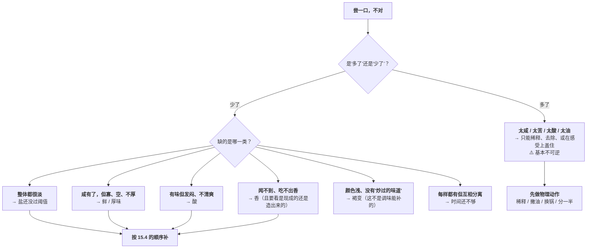
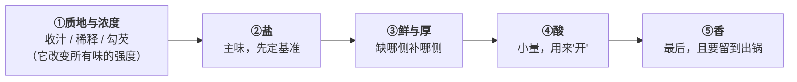
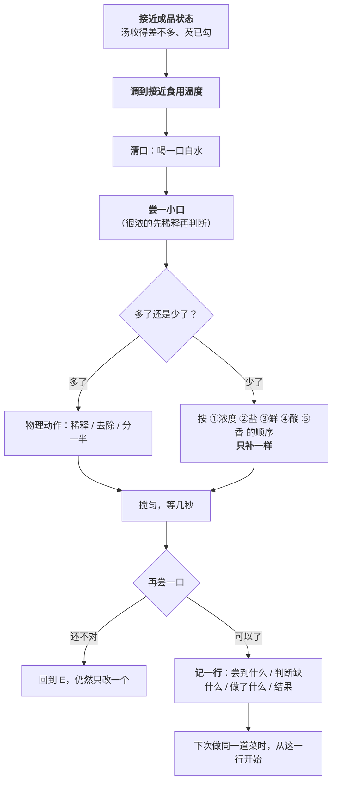

# 第 15 章 尝一口再决定：调味的纠偏流程

> **本章目标**：把第 9~14 章收成一套**可以反复执行的闭环**。
>
> 这一章不引入新的调料，也不引入新的机理。它只回答一个问题：
>
> > **锅在火上，你尝了一口觉得不对——接下来的三十秒该干什么？**
>
> 学完这一章你会知道：**大多数人不是"不会调味"，而是"在错误的状态下尝，
> 又用错误的顺序补"。这两件事都有明确的、可以改的规则。**

## 15.1 先承认一件事：你的舌头是一台会漂移的仪器

本书第二部分反复在做同一件事——**把"好吃"拆成可判断的成分**。
但判断要靠你自己尝，而**尝这件事本身有系统误差**。

第 9~13 章已经给出了误差的来源，这里汇总成一张表：

| 误差来源 | 一手证据 | 对纠偏的影响 |
|---------|---------|------------|
| **浓度越高越分不清** | 一项 60 人的感官研究：氯化钠溶液在 **1.0~6.0 g/L** 区间内咸度感知与浓度**高度线性**（R²=0.9995）；**超过 6.0 g/L 后排序准确率骤降——即使梯度拉到 0.5 g/L，准确率也只有 20%**；而在 4.0~6.0 g/L 区间用 0.5 g/L 梯度时准确率为 70% | **越咸越尝不准**。所以判断要在**偏淡的那一侧**做 |
| **混合会互相压低** | 二元混合中**每种味通常被感知为比单独尝时更弱** | **你"加一样"的默认后果是把别的一起压下去** |
| **变稠会整体变淡** | 56 人、三种模型饮料：加入增稠剂后**咸、酸、甜强度均显著下降**（β 约 −4.16 / −3.29 / −3.43，p<0.001）。⚠️ 作者指出**黏度本身不是好的解释变量** | **勾芡、收汁、放蚝油之后必须重新尝** |
| **温度会改变感知** | 分子美食学综述：**低温下对甜味的敏感度下降**（冰淇淋含糖常达 15%，而食用温度在 −13~−6 °C） | **在接近食用温度时定咸淡** |
| **香气会改写味觉，但要走鼻后** | 减钠综述：**鼻后路径减钠可达 75%、鼻前最高约 13.60%**，且**只有一致且熟悉的组合有效** | **闻着香不算数，得咽下去之后回上来那一下** |
| **个体差异极大** | 跨文化糖酸研究的聚类：同样"加酸压甜"，一个聚类从 5.80 掉到 3.25，另一个只从 6.62 掉到 5.73 | **别人的"刚刚好"不是你的** |

> ## 本章第一条可迁移规则
>
> **在"偏淡 + 接近成品状态 + 接近食用温度"这三个条件下做调味决定。**
>
> 三个条件各自的理由：
>
> - **偏淡**：因为你在高浓度区**分辨不出差别**（>6.0 g/L 时准确率只有 20%）；
>   而且**"少了"比"多了"好救得多**；
> - **接近成品状态**：因为收汁、勾芡会大幅改变浓度与味觉强度；
> - **接近食用温度**：因为温度会移动感知（已核到的是甜味在低温下敏感度下降）。

## 15.2 尝之前的五步准备

专业感官评价（**定量描述分析**[^2]那一套）有一套很朴素的防错做法。
前面那项酱油研究的方法部分就写明了它们：

| 他们怎么做 | 为什么 | 你在厨房怎么用 |
|-----------|-------|--------------|
| **每个样品之间用纯水漱口** | 防止前一个样品"串"到下一个 | **两次尝之间喝一口白水**，尤其在尝过很咸或很辣的东西之后 |
| **每轮评价间隔 1 小时以避免疲劳** | 感官会**适应与疲劳**[^1] | 厨房里做不到 1 小时，但**连尝五口比第一口更不准**——所以**要在第一口时就集中注意力** |
| **样品用三位随机数编码** | 防止预期影响判断 | 你知道自己放了什么，**预期一定会影响你**——所以**尽量让别人替你尝一次** |
| **酱油稀释 50 倍后再评价**（原液太咸） | 高浓度无法分辨 | **很咸的东西（酱料、卤汁）先用水或汤稀释一点再判断** |
| **用 1.0 / 3.0 / 6.0 g/L 的盐水作为 1 / 3 / 6 分的锚点** | 需要一把**外部的尺子** | 这正是**项目 P2** 要你给自己做的事 |

> ⚠️ **证据层级**：上面这些是**感官评价的行业方法学**（写在该研究的方法部分），
> 不是"这样做能让菜更好吃"的实验结论。本书标为**惯例 + 有明确理由**。

### 还有一条是安全，不是口味

> **不要为了"尝一下熟没熟"去尝生的或半生的肉、禽、蛋、海鲜，
> 也不要尝泡过生肉的腌料。**
>
> 美国 CDC 的食品安全页面明确写道：**除海鲜外，不能靠颜色和质地判断食物是否熟透**，
> **只有食品温度计可靠**。
> 美国 FDA 的指引则是：**腌制必须在冰箱里进行**，
> **泡过生肉的腌料不要重复使用，除非先煮沸**。
>
> **各国口径不同，以本地现行发布为准。**
> 换句话说：**"尝"负责调味，"温度计"负责熟没熟。这是两件事，不要混用。**

## 15.3 诊断：先问"多了还是少了"，再问"缺哪一类"

**这张图和[尝味纠偏表](../../forms/tasting-fix.md)是同一件事的两个形态**——
图用于当场判断，表用于事后查。

### "多了"为什么几乎不可逆

因为你**没有"减法工具"**。能做的只有三类：

| 手段 | 例子 | 证据强度 |
|------|------|---------|
| **稀释** | 加水/高汤、加无味载体（豆腐、土豆、米饭、面）、另做一份不加盐的合并 | ✅ 确定（纯物理） |
| **去除** | 撇油、换到干净的锅里（把苦源留在焦渣里）、把苦的食材挑出来 | ✅ 确定 |
| **在感受上盖住** | 加糖压酸、加酸解腻、加脂肪降苦 | ⚠️ 属于味味相互作用，**三种结果都可能**（增强/抑制/无影响） |

> **所以本书第二部分最实用的一条操作纪律仍然是：宁可先少放，尝过再补。**
> 这不是保守，这是**因为方向不对称**。

## 15.4 补的顺序：从"改变浓度"到"改变感受"

**加东西的默认后果是把已有的味道一起压下去**（第 10 章）。
所以"补"不能乱补，要按**从物理到感受**的顺序来。

| 次序 | 补什么 | 为什么排在这里 | 注意 |
|------|-------|-------------|------|
| **①** | **质地与浓度** | 收汁/勾芡会**整体改变**所有味的强度——在它之前做的任何调味判断都会作废 | 增稠使咸、酸、甜强度均显著下降，**勾完必须重新尝** |
| **②** | **盐** | 它是主味，也是唯一不可替代的（第 11 章）；后面几步都建立在"盐已经对了"之上 | **分次加，每次很少，搅匀再尝**；且要先把酱油/蚝油/豆瓣带进来的钠算进去（第 14 章） |
| **③** | **鲜与厚** | 鲜味物质能**增强咸味感知**，所以它可能让你重新判断第②步 | **补另一侧比加更多同一侧有效**（IMP 占比 20%~80% 时协同最强）；且它需要"有东西可增"（第 13 章） |
| **④** | **酸** | 酸与甜**互相抑制**、与咸**互相增强**，它会动前面所有东西 | **小量**。阈上浓度下糖与酸互相压制是有实测的（跨文化研究） |
| **⑤** | **香** | 挥发性的东西**留不住**，越早加损失越大 | 现成的香出锅放；要造的香早就该造了，**这一步补不回来** |

> ## 本章第二条可迁移规则
>
> **顺序是"浓度 → 盐 → 鲜 → 酸 → 香"，而且每一步之后都要重新尝。**
>
> **最常见的错误是跳过第①步**：汤还没收就定咸淡，
> 收完发现太咸；或者勾完芡觉得变淡了，于是加盐，冷了之后齁。

### 有一件事是补不了的

**褐变。**

如果你尝到的是"颜色浅、没有炒过的味道"，那不是调味问题——
**是第 7 章的问题**：锅不够热、食材太湿、一次下得太多。
**这一锅救不了**，只能下次分批下锅、表面擦干、锅先充分预热。

> **把"补不了的"和"补得了的"分开，本身就是纠偏能力的一部分。**
> 否则你会在一锅已经定型的菜里不停加调料，越加越糊涂。

## 15.5 一次只改一个

这条听起来像废话，但它有一个具体的理由：

**如果你同时加了盐、糖和醋，那么无论结果变好还是变坏，
你都不知道是哪一个起的作用——这一次的经验就无法沉淀到下一次。**

而第 10 章已经说明：混合味的结果有**增强、抑制、无影响**三种可能，
**方向取决于浓度**。也就是说，"加盐 + 加糖"的净效果**不是两者效果之和**，
你没法靠事后推理拆开。

> ## 本章第三条可迁移规则
>
> **每次只动一个变量，动完搅匀、等几秒、再尝。**
>
> "等几秒"有两个理由：
> ①固体调料需要时间溶解与分布；
> ②增稠体系里味觉物质的释放本来就慢。

## 15.6 完整的闭环

把前面五节接起来：

**最后那一步——记录——是这套流程唯一会随时间变强的部分。**
[尝味纠偏表](../../forms/tasting-fix.md)的末尾就有这张记录表。

## 15.7 这套流程的两个诚实的局限

**① 它没有告诉你"应该多咸"。**

因为**没有人能告诉你**。跨文化糖酸研究里，同样的"加酸压甜"，
一个聚类（110 人，其中 71% 是中国受试者）的甜度从 **5.80 掉到 3.25**，
另一个聚类（64 人）只从 **6.62 掉到 5.73**——**个体差异极大**。

**所以本书不给"一斤菜放几克盐"。**
它给的是**方法**：建立你自己的基准（项目 P2），然后按流程纠偏。

**② 它依赖你的舌头，而舌头会随状态变化。**

第 9 章已经核到：**老年人味觉与嗅觉功能下降**。
感冒、抽烟、刚吃过很咸或很辣的东西、口腔干燥，都会改变判断。

> **应对办法只有一个：不要只信一次尝。**
> 重要的菜，**在不同时间尝两次**，或者**让别人替你尝一次**。

## 15.8 常见说法辨析

按本书约定标注**证据强度**：✅ 有共识 / ⚠️ 有争议 / ❌ 明确错误 / 缺乏证据。
来源见[出处登记](../../standards.md)。

| 说法 | 判定 | 说明 |
|------|------|------|
| "边做边尝，尝准了就行" | ⚠️ **状态不对时尝不准** | 收汁、勾芡会改变浓度与味觉强度（增稠使咸/酸/甜强度均显著下降）；温度也会移动感知（低温下甜味敏感度下降）。**要在接近成品、接近食用温度时定咸淡** |
| "多尝几口就能尝准" | ❌ **方向反了** | 感官评价的做法是**每样之间漱口、每轮间隔 1 小时以避免疲劳**。**连尝五口比第一口更不准** |
| "越咸越容易判断差别" | ❌ **正好相反** | 一手数据：氯化钠溶液在 **1.0~6.0 g/L** 内感知与浓度高度线性；**超过 6.0 g/L 后排序准确率骤降到 20%**（梯度已放宽到 0.5 g/L）。**判断要在偏淡那一侧做** |
| "太咸了加点糖就能压住" | ⚠️ **可能有用，但不降钠** | 混合味有增强/抑制/无影响三种结果，且**浓度决定方向**。**它不会降低钠含量**，只可能改变突出感。小量试 |
| "太咸了放块土豆能吸盐" | ❌ **机制不成立** | 土豆吸走的是**含盐的汤水**，不是盐。效果等于少量稀释——**想稀释就直接加水或加料** |
| "没味道就加盐" | ❌ **最常见的误诊** | 第 9 章的诊断：**"没味道"最常见的原因是缺香不是缺盐**；第 14 章的一手反例：去掉豆瓣的那组**咸度更高而鲜味与可接受度只有 4.25** |
| "勾完芡尝着淡了，是芡把味吃掉了" | ⚠️ **现象成立，机理未定** | 一手研究显示咸、酸、甜强度均随增稠剂显著下降，但作者明确指出**黏度本身不是好的解释变量**。本书只写操作结论：**勾完芡要重新尝** |
| "调味靠天赋" | ❌ **它主要是流程** | 本章的三条规则（在什么状态下尝、按什么顺序补、一次只改一个）都是可执行的。真正需要"个人化"的只有**基准**——那正是项目 P2 要标定的东西 |
| "尝一下就知道熟没熟" | ❌ **而且不安全** | 美国 CDC：**除海鲜外，不能靠颜色和质地判断是否熟透**，只有温度计可靠。美国 FDA：腌制须在冰箱中进行、**泡过生肉的腌料不得重复使用（除非先煮沸）**。⚠️ 各国口径不同 |
| "每道菜都有标准咸度" | ⚠️ **个体差异极大** | 跨文化研究的聚类分析中，同一处理下不同聚类的评分变化幅度差出数倍（5.80→3.25 vs 6.62→5.73）。**别人的"刚刚好"不是你的** |

## 15.9 🔎 下次做菜时的用处

1. **尝的时候先问自己："这是接近成品的状态吗？"** 汤没收、芡没勾就下的结论都会作废。
2. **在偏淡的那一侧做决定**——那是你唯一分得清差别的区间。
3. **两次尝之间喝一口白水**，并且**认真对待第一口**。
4. **补的顺序是：浓度 → 盐 → 鲜 → 酸 → 香。**
5. **一次只改一个，搅匀、等几秒、再尝。**
6. **"多了"只能靠稀释、去除、分一半**——所以永远先少放。
7. **勾完芡、放完蚝油、收完汁，一律重新尝。**
8. **颜色浅、没有炒香味 = 褐变问题，这一锅补不了**，记下来下次改。
9. **熟没熟交给温度计，好不好吃交给舌头。** 别用尝生肉来判断熟度。

## 15.10 思考题

1. 为什么本书说"要在偏淡的那一侧做调味决定"？请给出一手数据。
2. 尝之前的五步准备分别是什么？它们的证据层级是什么？
3. 为什么"多了"比"少了"难救？能用的三类手段各自的证据强度如何？
4. 补味的顺序为什么是"浓度 → 盐 → 鲜 → 酸 → 香"？跳过第一步会发生什么？
5. 哪一类问题是调味补不了的？为什么？尝到它时应该做什么？
6. "一次只改一个"这条规则的具体理由是什么？（提示：和第 10 章的三种结果有关）
7. **【案例】** 你做了一锅排骨汤，喝起来"咸度够了，但寡淡、没有厚度"，
   而且你刚刚勾了一点薄芡。
   （a）请按本章流程写出你接下来的完整动作序列；
   （b）第一步应该排除什么？
   （c）如果补完鲜还是觉得空，你会怀疑什么？
   （d）哪一步是你**不应该**做的？
8. **【案例】** 一份菜谱写"加盐 4 g"。你照做后觉得偏咸。
   （a）列出至少三个可能的原因（不要只说"我口味淡"）；
   （b）你怎么验证是哪一个；
   （c）下次你会怎么改写这份菜谱给自己用？
9. **【辨析】** "多尝几口就能尝准"——判断证据强度，
   并说明专业感官评价是怎么处理这个问题的。
10. **【辨析】** "勾完芡尝着淡了，是芡把味吃掉了"——
    判断这条说法里哪部分成立、哪部分本书不写，为什么。
11. 本章说这套流程有两个"诚实的局限"。它们分别是什么？
    本书为什么宁可写出局限，也不给"一斤菜放几克盐"？

> 📖 **参考答案**（想清楚再看）：[Q1](../../qa/15-tasting-loop-qa.md#q1) ·
> [Q2](../../qa/15-tasting-loop-qa.md#q2) · [Q3](../../qa/15-tasting-loop-qa.md#q3) ·
> [Q4](../../qa/15-tasting-loop-qa.md#q4) · [Q5](../../qa/15-tasting-loop-qa.md#q5) ·
> [Q6](../../qa/15-tasting-loop-qa.md#q6) · [Q7](../../qa/15-tasting-loop-qa.md#q7) ·
> [Q8](../../qa/15-tasting-loop-qa.md#q8) · [Q9](../../qa/15-tasting-loop-qa.md#q9) ·
> [Q10](../../qa/15-tasting-loop-qa.md#q10) · [Q11](../../qa/15-tasting-loop-qa.md#q11)

## 15.11 本章实操

### 🅐 零成本版 · 任务一：给自己写一张"尝味检查卡"

抄到手机备忘录里，贴在厨房也行。做菜时照着走一遍。

| 步骤 | 我要问自己的问题 | 打勾 |
|------|---------------|------|
| ① | 现在是**接近成品**的状态吗？（汤收了吗、芡勾了吗） | |
| ② | 温度**接近吃的时候**吗？ | |
| ③ | 我**清口**了吗？ | |
| ④ | 这一口是"**多了**"还是"**少了**"？ | |
| ⑤ | 如果是少了，缺的是**盐 / 鲜 / 酸 / 香 / 褐变 / 时间**里的哪一个？ | |
| ⑥ | 我这次**只改一个**吗？ | |
| ⑦ | 改完**搅匀、等几秒、重新尝**了吗？ | |
| ⑧ | 我**记下来**了吗？ | |

### 🅐 零成本版 · 任务二：把最近三次"失败"重新诊断一遍

回忆最近三次做得不满意的菜，用本章的诊断树重判。

| 菜 | 当时我觉得的问题 | 当时我做了什么 | 按本章该判成什么 | 该做什么 | 这是不是"补不了"的那一类 |
|----|--------------|-------------|--------------|---------|----------------------|
| | | | | | |
| | | | | | |
| | | | | | |

做完回答：

1. 三次里有几次其实是**褐变问题**（补不了）？
2. 有几次是**在错误的状态下尝**导致的误判？
3. 有几次你**同时改了两样以上**？

### 🅐 零成本版 · 任务三：找一份菜谱，把它的"尝味点"标出来

大多数菜谱只在最后写一句"调味"。请你把它改成有流程的版本。

| 菜谱步骤 | 这一步之后浓度会变吗 | 该不该在这里尝一口 | 尝的话看什么 |
|---------|------------------|---------------|-----------|
| | | | |
| | | | |

做完回答：**这份菜谱漏掉了几个必须尝的点？**（提示：收汁后、勾芡后、关火前）

### 🅑 开火版 · 任务四：同一锅汤，三个温度尝三次（有灶台时做）

**需要**：一锅调好味的汤、三个小碗。

| 组 | 温度状态 | 咸度（0~10） | 甜度（0~10） | 鲜度（0~10） | 香气（0~10） |
|----|---------|------------|------------|------------|------------|
| ① | **刚出锅（烫）** | | | | |
| ② | **放到能正常入口** | | | | |
| ③ | **放到接近室温** | | | | |

做完回答：

1. 哪一项变化最大？
2. 如果你在①的状态下定咸淡，端上桌时会偏咸还是偏淡？
3. 本章已核到的只有"**低温下对甜味的敏感度下降**"这一条。
   你这次观察到的其他变化，**算不算验证**？为什么不算？

### 🅑 开火版 · 任务五：勾芡前后各尝一次

**需要**：一锅有汤汁的菜、淀粉水。

| 时点 | 咸度 | 酸度 | 鲜度 | 香气 | 我的判断 |
|------|------|------|------|------|---------|
| **勾芡前** | | | | | |
| **勾芡后、搅匀静置 30 秒** | | | | | |

做完回答：

1. 哪几项下降了？下降幅度一样吗？
2. 一手研究中咸、酸、甜的下降系数**幅度与斜率随味觉种类差别很大**——
   你的结果符合这个方向吗？
3. **如果此时你加盐，冷下来会怎样？**

### 🅑 开火版 · 任务六：一次只改一个（对照练习）

**需要**：一锅偏淡的汤，分成四小碗。

| 碗 | 做法 | 咸度 | 鲜度 | 整体"够味"程度 | 我的结论 |
|----|------|------|------|------------|---------|
| ① | 对照，不动 | | | | |
| ② | **只加一点盐** | | | | |
| ③ | **只加一点鲜味来源**（酱油/香菇水/肉汤） | | | | |
| ④ | **同时加盐和鲜味来源** | | | | |

做完回答：

1. ②和③哪一个更接近你要的"够味"？
2. ④比②③好吗？如果好，你**说得出是哪一样起的作用**吗？
3. 这个练习怎么支持"一次只改一个"这条规则？

> ⚠️ **安全提醒**：尝味用小勺分出来尝，**不要用同一把勺反复回锅**（交叉污染）。
> 实操剩下的食物不要在室温下久放：美国 FDA 的指引是易腐食品在烹调后 **2 小时内**冷藏
> （环境温度高于 90 °F 时缩短到 1 小时）。**各国口径不同，以本地现行发布为准。**

## 15.12 本章依据

本章引用的来源与核对状态详见[参考书目与出处登记](../../standards.md)，具体对应如下：

| 本章用到的内容 | 依据 |
|--------------|------|
| **咸度分辨的上限**：60 人感官小组测得氯化钠溶液在 **1.0~6.0 g/L** 区间内咸度感知与浓度高度线性（R²=0.9995；1.0~9.0 g/L 时 R²=0.9867）；**超过 6.0 g/L 后排序准确率显著下降，即使梯度放宽到 0.5 g/L 也只有 20%**，而 **4.0~6.0 g/L 区间在 0.5 g/L 梯度下准确率为 70%**；据此把感知量表上限定为 6.0 g/L。**感官方法学**：样品间用纯水漱口、**每轮间隔 1 小时以避免疲劳**、三位随机数编码、原液过咸故**稀释 50 倍**后评价、以 **1.0 / 3.0 / 6.0 g/L 盐水作为 1 / 3 / 6 分锚点** | 一项关于酱油关键呈味物质多元分析与咸度强度建模的研究，*Foods*，2025（PMC12731317），✅ 开放获取全文。⚠️ 方法学部分属**感官评价的行业做法**，不是"这样做菜更好吃"的实验结论 |
| **增稠使咸、酸、甜强度均显著下降**（β 约 −4.16 / −3.29 / −3.43，p<0.001），且**幅度与斜率随味觉种类差别很大**；⚠️ 作者指出**把黏度作为解释变量时模型解释力更低** | 一项关于增稠剂浓度对甜、酸、咸感知影响的研究，*Journal of Texture Studies*，2025（PMC12450616），✅ 开放获取全文（第 10 章已登记） |
| **二元混合中每种味通常被感知为比单独尝时更弱** | 一项关于氯化钠对人类苦味受体响应影响的研究，*Journal of Agricultural and Food Chemistry*，2024（PMC11082923），✅ 开放获取全文（第 10 章已登记） |
| **混合味可能出现增强、抑制或无影响三种结果**，且**增强效应在低到中等浓度下更明显**；**鼻后路径减钠可达 75%、鼻前最高约 13.60%**，且只有**一致且熟悉**的风味组合有效 | 一篇关于通过感官相互作用实现减钠的综述，*Food Science & Nutrition*，2025（PMC12231224），✅ 开放获取全文（第 9、10 章已登记） |
| **阈上浓度下糖与酸互相抑制的实测评分**；**个体差异极大**：聚类 1（110 人，71% 中国受试者）甜度 5.80 → 3.25，聚类 3（64 人）6.62 → 5.73 | 一项关于蔗糖甜味与柠檬酸/酒石酸酸味相互作用的跨文化消费者研究，*Foods*，2020（PMC7600934），✅ 开放获取全文（第 12 章已登记） |
| **低温下对甜味的敏感度下降**（冰淇淋含糖常达 15%、食用温度 −13~−6 °C）；**嗅觉的重要性可用"捏鼻子"证明** | 一篇关于分子美食学的综述，*Chemical Reviews*，2010（PMC2855180），✅ 开放获取全文（第 6~9 章已登记） |
| **IMP 占比 20%~80% 时鲜味协同最强**；**少量氯化钠可提高鲜味感知**；**老年人味觉与嗅觉功能下降** | 一篇关于人类味觉与鲜味物质的综述，*Journal of Food Science*，2022（PMC9314127），✅ 开放获取全文（第 9 章已登记） |
| **去掉郫县豆瓣的一组咸度更高，鲜味与总体可接受度却只有 4.25**（完整组 8.0 以上） | 一项关于省略关键调味料与泼油工序对水煮牛肉风味影响的研究，*Food Chemistry: X*，2025（PMC12554931），✅ 开放获取全文（第 14 章已登记） |
| **不能靠颜色和质地判断食物是否熟透（海鲜除外），只有温度计可靠**；危险温度带与 2 小时规则 | 美国 CDC 食品安全页面，✅。⚠️ 美国口径，各国不同 |
| **腌制必须在冰箱中进行**；**泡过生肉的腌料不要重复使用，除非先煮沸**；易腐食品烹调后 **2 小时内**冷藏（高于 90 °F 时 1 小时） | 美国 FDA「Handling Food Safely While Eating Outdoors」与「Safe Food Handling」，✅。⚠️ 美国口径，以本地现行发布为准 |
| **"一斤菜放几克盐"这类通用用量**；**清口方法的有效性对照**；**家庭尺度上"尝几次后准确度下降多少"的定量** | ⚠️ **均未核到**。正文只给方法与方向，不给数值，已登记为缺口 |

[^1]: [感官适应与疲劳](../../glossary.md#taste-adaptation)（sensory adaptation / fatigue）。
[^2]: [定量描述分析](../../glossary.md#qda)（quantitative descriptive analysis, QDA）。

---

**下一站**：[🛠 项目 P2](project-p2-salt-umami-baseline.md)——
这一章反复说"你需要自己的基准"，项目 P2 就是去做出这把尺子：
**用几杯不同浓度的盐水，标定你自己的咸度阈值与"刚刚好"点，
再用一碗汤练一遍完整的纠偏闭环。**
