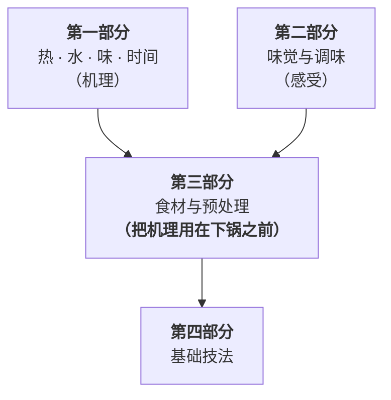
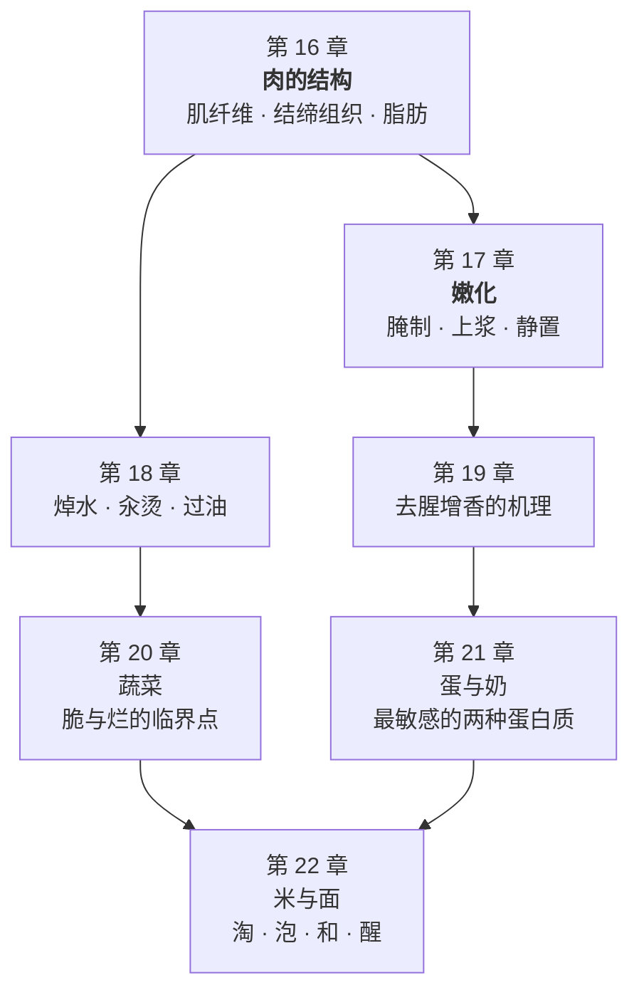

# 第三部分 · 食材与预处理：每一步都要解决一个具体的问题

> **第一部分讲机理，第二部分讲感受，这一部分讲"下锅之前那十分钟"。**
>
> 预处理是家庭厨房里**最像玄学的一段**：
> 焯水、腌制、上浆、去腥、泡发、逆纹切——
> 菜谱让你做，但很少告诉你**它在解决什么问题**，
> 更不会告诉你**不做会怎样、做过头又会怎样**。

## 为什么预处理值得单独占一个部分

因为它是**四条线里"时间"那一条最被忽略的部分**。

一道菜的失败常常不发生在锅里，而发生在锅之前：

- 肉切得太厚、又逆纹切错了方向 → 怎么炒都嚼不动；
- 表面没擦干就下锅 → 第 7 章的褐变窗口根本没开过；
- 焯水焯过头 → 该留的留不住，该去的也没去干净；
- 腌了一整夜 → 未必更嫩，甚至可能更差。

> ## 这一部分的唯一判据
>
> **每一步预处理都必须能回答："它解决的是哪一个具体问题？"**
>
> **回答不出来的那一步，就不要做。**
>
> 这条判据比任何技巧都重要。因为预处理是**成本最高的环节**——
> 它花掉你最多的时间，却最不容易看出效果，
> 所以它也是**最容易积累无效动作**的地方。

## 它和前两部分的关系

具体的依赖关系是这样的：

| 这一部分的内容 | 用到前面哪一章 |
|--------------|--------------|
| 肉的结构与部位选择 | 第 4 章蛋白质、**第 5 章胶原** |
| 腌制、上浆、静置 | 第 4 章持水力、**第 8 章酸碱**、第 11 章盐 |
| 焯水与过油 | 第 3 章溶出、第 7 章褐变、第 2 章传热 |
| 去腥增香 | 第 13 章香气的两分法、第 14 章料酒 |
| 蔬菜的脆与烂 | 第 8 章叶绿素与果胶 |
| 蛋与奶 | **第 4 章窄窗口蛋白质** |
| 米与面 | **第 6 章淀粉糊化与回生** |

**所以这一部分几乎不引入新机理**——它做的是**把已有的机理用到具体食材上**。

## 这一部分的地图

**第 16、17 章是这一部分的地基**：
先学会**看懂一块肉**，再学会**该不该动它、怎么动**。

## 这一部分的两条纪律

**第一条：中餐工艺的这一段，公开文献覆盖得最差。**

"上浆挂糊""过油""逆纹切""小苏打腌肉"——这些是中式厨房每天在做的事，
但它们在英文食物科学文献里**几乎是空白**，
而中式烹饪教材本书**至今没有核到一手书目信息**
（见[出处登记](../../standards.md) §3）。

**本书的处理方式**：

> 凡是只能靠惯例与机制推理的，**明确标出来**；
> 凡是能找到相邻的一手证据的（比如"酸腌"能借用肉品科学里的酸性腌制研究），
> **说明它相邻到什么程度、差在哪里**；
> **绝不用"中餐师傅都这么做"当作原理。**

**第二条：这一部分的数字大多来自肉品工业，不是家庭厨房。**

肉品科学的文献几乎都在工业语境下做实验——注射腌制、真空滚揉、
分离肌原纤维蛋白体系、几百个样品的统计。
它们的**机理方向**可以用，**用量与工艺参数不能直接搬**。

> **每次出现这类数字，本书都会写明它的体系。**
> 看到"注射""分离蛋白""滚揉"这些词，就要知道：
> **这条结论离你的厨房还有一段距离。**

## 学完这一部分，你应该能

1. **拿起一块肉**，从它的部位、纹理、颜色、肥瘦判断它该炒、该炖还是该烤；
2. **对每一步预处理**说出它解决什么问题，以及不做会丢什么；
3. **不再做无效动作**——尤其是那些"因为菜谱写了所以做"的步骤；
4. **打开冰箱就能定方案**，而不是先去搜"XX 怎么做"。

---

**从这里开始**：[第 16 章 · 肉的结构](16-meat-structure.md)。
第一个要打破的直觉是——**"嫩"和"软"是两件不同的事，
而它们由肉里两种完全不同的东西决定。**
