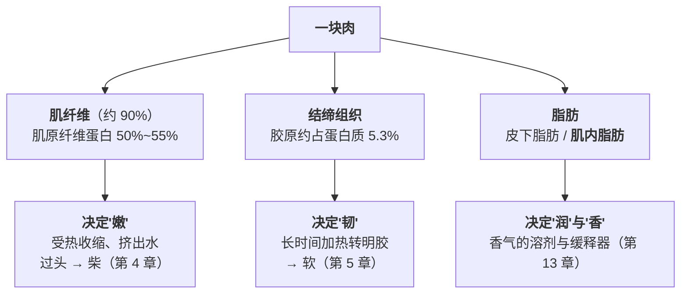
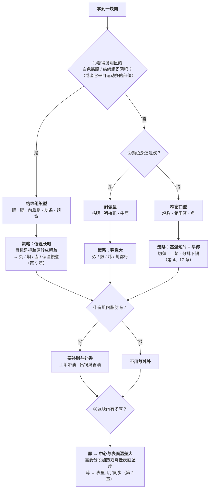

# 第 16 章 肉的结构：肌纤维、结缔组织与脂肪

> **本章目标**：让你**看一块肉就知道它该怎么做**。
>
> 这一章回答三个问题：
>
> 1. **一块肉由什么组成？**（三样东西，各有各的脾气）
> 2. **为什么同一头猪身上的两块肉，做法完全不同？**
> 3. **"嫩"到底由什么决定？**（答案比"新不新鲜"复杂得多）
>
> 学完这一章你会知道：**"嫩"和"软"是两件不同的事**——
> 一个由肌纤维与失水决定，一个由结缔组织决定，
> **而它们需要两套完全相反的加热策略。**

## 16.1 一块肉的三样东西

先把量级摆清楚。一篇关于肌肉结构与肉品质的综述给出：

| 组成 | 占比 | 是什么 |
|------|------|-------|
| **肌纤维** | 骨骼肌的**约 90%** | 一根根长条细胞，直径约 **10~100 μm**；长度从鱼的几毫米到陆生动物的几厘米 |
| **结缔组织 + 脂肪组织** | 约 **10%** | 把肌纤维捆起来的"网"，以及夹在其中的脂肪 |

按化学成分看，骨骼肌大约是：

> **75% 水、20% 蛋白质、1~10% 脂肪、1% 糖原。**

而那 20% 的蛋白质又分成三类（来自另一篇低温慢煮综述）：

| 蛋白质 | 占肉中蛋白质 | 它管什么 |
|-------|------------|---------|
| **肌原纤维蛋白**（肌球蛋白、肌动蛋白等） | **50%~55%** | 收缩、持水——**"嫩不嫩、柴不柴"主要看它** |
| **肌浆蛋白** | — | 溶在细胞液里，含**肌红蛋白**[^3]（肉的红色来源） |
| **结缔组织蛋白**（主要是胶原） | **胶原约占 5.3%** | 韧、有嚼劲——**"炖得烂不烂"看它** |

> ## 本章第一条可迁移规则
>
> **"嫩"和"软"由两样不同的东西决定，需要两套相反的策略。**
>
> | 你嫌它 | 问题出在 | 对策 | 机理在哪一章 |
> |-------|---------|------|------------|
> | **柴、干、嚼不烂但不韧** | **肌纤维过熟失水** | **高温短时**，早点停 | 第 4 章：持水量的下降集中在约 62~72 °C |
> | **韧、有筋、咬不断** | **结缔组织多** | **低温长时**，给足时间 | 第 5 章：胶原转明胶需要时间 |
>
> **把这两件事搞混，是家庭做肉失败最常见的根源**：
> 用炖的办法对付里脊（结果又老又柴），
> 用炒的办法对付牛腩（结果咬不动）。

## 16.2 结缔组织：为什么同一头动物身上差别这么大

### 量级

综述给出的胶原含量范围（注意单位是**肌肉干重**）：

| 动物 | 总胶原含量 |
|------|-----------|
| **成年牛** | **1%~15%**（跨度极大，取决于部位） |
| **大白猪** | **1.3%（腰大肌）~3.3%（背阔肌）** |
| **禽类** | **0.75%~2%** |

而**交联程度**（第 5 章：交联越成熟越难打断）取决于
**肌肉类型、物种、基因型、年龄、性别与运动量**。

### 一组直接的部位对照

一项关于猪肉的研究同时测了**后腿（股二头肌）**与**里脊/大排（胸腰最长肌）**：

| 测的是什么 | 结果 |
|-----------|------|
| **剪切力、总胶原、不溶性胶原** | **后腿显著高于里脊**（p<0.05） |
| 总胶原与剪切力的相关 | **r = 0.47**（正相关，p<0.05） |
| 不溶性胶原与剪切力的相关 | **r = 0.49** |
| 总胶原与硬度、咀嚼性、回复性的相关 | r 分别为 0.49、0.58、0.63 |
| **III 型胶原占比与剪切力的相关** | **r = −0.68**（**负相关**——III 型比例高反而更嫩） |

> **厨房翻译**：**运动多的部位胶原多、更韧**——后腿、前腿、腱子、肋条、颈背；
> **运动少的部位胶原少、更嫩**——里脊、通脊。
> 这不是"哪块肉更好"，而是**它们需要不同的做法**。

### 一个必须写出来的反直觉结论

肌肉结构综述里有一条很少被科普提到的话：

> **生肉**的剪切力与胶原含量**高度相关**；
> 而**熟肉**中，胶原含量、热溶解度与交联水平**与剪切力的相关性并不清楚**，
> 且**随肌肉类型与烹饪条件而变化**。

同一篇综述还指出：**猪与禽因为屠宰时生理年龄早、肌内胶原尚未显著交联，
胶原对其感官质量的影响有限**；而牛肉的"基础韧度"更高、宰后嫩化更弱。

> ⚠️ **所以"胶原多 = 一定柴"是不成立的。**
> 正确的说法是：**胶原多意味着"如果你用错方法，它会很韧"，
> 同时也意味着"如果你用对方法，它能变得特别好吃"**——
> 因为胶原转成的明胶带来的是**黏、糯、挂嘴**那种口感（第 5 章）。
>
> **红烧肉、牛腩、蹄髈之所以好吃，恰恰是因为它们胶原多。**

## 16.3 肌纤维类型：为什么有的肉红、有的肉白

### 颜色从哪来

**肌红蛋白**是肌浆中的携氧色素，**肉呈红色就是因为它**。
运动多、需要持续供氧的肌肉，肌红蛋白多，颜色深。

这也是"鸡腿肉比鸡胸肉深、牛肉比猪肉深"的直接原因。

### 纤维类型与口感的关系

一项对 32 篇同行评议文献（牛 7 篇、猪 25 篇）做的**meta 回归分析**，
给出了**肌纤维类型**[^2]与口感之间的这些关联
（下面是**猪**的结果）：

| 纤维类型 | 频率升高时 | 
|---------|-----------|
| **I 型**（红肌、氧化型、慢） | **滴水损失下降**、蒸煮损失上升、亮度 L* 下降（颜色更深）、**感官嫩度上升** |
| **IIb 型**（白肌、酵解型、快） | **滴水损失上升** |

合并牛与猪分析时，只有 **pH、剪切力与滴水损失**与纤维类型的频率和横截面积相关（p<0.05）。

> ⚠️ **这是一项 meta 回归，不是一次对照实验**。
> 作者自己在结论里写明：未来研究需要跨品种、跨肌肉进一步理解纤维类型的影响。
> 本书**只取方向**：**红肌偏向"存得住水、更嫩"，白肌偏向"容易掉水"。**

> ## 本章第二条可迁移规则
>
> **颜色深的部位通常更"耐做"，颜色浅的部位窗口更窄。**
>
> 最典型的例子是鸡：**鸡胸（白）很容易做柴，鸡腿（红）宽容得多**。
> 这不是玄学——它对应着纤维类型与持水行为的差异。
>
> **推论**：**同一只鸡，胸和腿不该同时下锅、也不该做到同一个终点温度。**

## 16.4 脂肪：它不只是"香"，它还是香气的载体

### 肌内脂肪与"好吃"的关系

一项对 **167 头日本黑毛和牛**胴体的研究，测了**肌内脂肪**[^1]（IMF）与油酸含量，
并由训练过的感官小组评价熟牛肉：

| 结果 | 内容 |
|------|------|
| **嫩度、多汁感、脂香** | 主要与 **IMF 含量**相关 |
| **甜香与"和牛香"** | 受**油酸组成**与 IMF 共同影响 |
| **关键的非线性** | 在 **IMF 低**的样品中，油酸比例越高，甜香与和牛香越强（r = 0.401、0.376）；**IMF 中等**时相关变弱（r = 0.278、0.273）；**IMF 高**时**几乎观察不到**（r = 0.030、0.011） |

> **翻译成厨房语言**：**脂肪少的时候，脂肪的"质量"很要紧；脂肪多到一定程度，就无所谓了。**
>
> ⚠️ **适用范围**：**和牛、单一品种、胴体分级语境**。
> 本书用它说明"IMF 同时影响质地与香气"这个方向，**不推广到猪、鸡、鱼**。

### 为什么这一节要放在"味"的后面讲

因为第 13 章已经核到：

> **大多数香气分子在脂里比在水里更易溶**；
> **在乳液中，疏水性香气化合物的释放随脂肪含量增加而减少**——
> **油既是萃取剂，又是缓释器。**

把两件事接起来：

> ## 本章第三条可迁移规则
>
> **脂肪在肉里干三件事：给润（多汁感）、给香（脂香本身）、兜住香（缓释）。**
>
> 所以**纯瘦肉的问题不只是"柴"，还有"香留不住"**。
> 对策不是"多放油炸一下"，而是：
>
> 1. **选带一点肥的部位**（比如梅花肉而不是纯里脊）；
> 2. **做法上补脂**（上浆时带一点油、出锅淋香油——第 13 章）；
> 3. **接受它的终点更早**（瘦肉窗口更窄，见 16.5）。

## 16.5 把这三样东西合成一张决策表

拿到一块肉，按顺序问四个问题：

### 常见部位的归类（惯例 + 结构推理）

| 部位 | 归到哪一类 | 理由 |
|------|----------|------|
| 猪**里脊 / 通脊** | 窄窗口型 | 运动少、胶原低（腰大肌是猪身上胶原最低的部位之一，约 1.3% 干重） |
| 猪**梅花 / 前腿上部** | 耐做型 | 肌内脂肪多、结缔组织中等 |
| 猪**五花** | 结缔组织型 + 高脂 | 层状结缔组织 + 大量脂肪 → 红烧的经典对象 |
| 猪**后腿 / 臀尖** | 结缔组织型（偏瘦） | 研究中后腿的总胶原与不溶性胶原显著高于里脊 |
| 牛**里脊 / 西冷** | 窄窗口型 | 运动少 |
| 牛**腩 / 腱 / 肩** | 结缔组织型 | 运动多、交联成熟 |
| **鸡胸** | 窄窗口型 | 白肌为主，容易掉水 |
| **鸡腿** | 耐做型 | 红肌比例高 |
| **鱼** | 极窄窗口型 | 肌纤维短（综述：鱼的肌纤维长度只有几毫米）、结缔组织少 |

> ⚠️ **这张表是"结构推理 + 惯例"**，**不是**对每个部位的实测数据。
> 本书核到的部位级实测只有两组（猪的后腿 vs 里脊；胶原含量的物种范围），
> 其余按结构与运动量推理，**已在[出处登记](../../standards.md)登记为方向性内容**。

## 16.6 常见说法辨析

按本书约定标注**证据强度**：✅ 有共识 / ⚠️ 有争议 / ❌ 明确错误 / 缺乏证据。
来源见[出处登记](../../standards.md)。

| 说法 | 判定 | 说明 |
|------|------|------|
| "贵的部位就是好吃的部位" | ❌ **是"适合不同做法"** | 里脊胶原低、适合高温短时；腩腱胶原高、适合低温长时。**红烧肉、牛腩好吃恰恰因为胶原多**（第 5 章：胶原转明胶） |
| "胶原多的肉一定柴" | ❌ **只在做错时成立** | 综述指出：**生肉**的剪切力与胶原含量高度相关，但**熟肉**中胶原含量与剪切力的相关性**不清楚且随肌肉类型与烹饪条件变化**。同一篇还指出**猪与禽因宰杀时生理年龄早、肌内胶原未显著交联，胶原对其感官质量影响有限** |
| "肉柴了是因为没腌" | ❌ **最常见的误诊** | "柴"多数是**肌纤维过熟失水**（第 4 章：持水量的下降集中在约 62~72 °C）。腌制解决不了做过头。见第 17 章 |
| "肉红是因为有血" | ❌ **是肌红蛋白** | 肌红蛋白是**肌浆中的携氧色素**，肌肉呈红色就是因为它。运动多的肌肉肌红蛋白多、颜色深 |
| "鸡胸和鸡腿可以一起下锅" | ⚠️ **窗口不同** | meta 回归（猪）显示 **I 型（红肌）频率高时滴水损失下降、感官嫩度上升**，**IIb 型（白肌）频率高时滴水损失上升**。⚠️ 这是猪的 meta 回归，不是鸡的实验；但方向与"鸡胸更容易柴"的经验一致。**本书标为方向性** |
| "肥肉只是不健康的部分" | ⚠️ **它同时在做三件事** | 和牛研究：**嫩度、多汁感、脂香主要与肌内脂肪含量相关**；第 13 章：**大多数香气分子在脂里比水里更易溶**，且乳液中疏水性香气的释放随脂肪增加而减少（油"兜"得住香）。**本书不做任何营养建议** |
| "越肥越香" | ⚠️ **有上限** | 和牛研究中，油酸对甜香与和牛香的影响在**低 IMF 时显著（r≈0.40）**、**中等时变弱**、**高 IMF 时几乎观察不到（r≈0.03）**。⚠️ 单一品种、胴体分级语境 |
| "新鲜的肉最嫩" | ⚠️ **不一定** | 肉的嫩度还受**宰后成熟**（钙蛋白酶系统降解肌纤维）影响。⚠️ 本书这一轮**未核到家庭尺度的成熟建议**，不给时间与做法 |
| "看纹路就能判断怎么切" | ✅ **方向正确** | 肌纤维是成束排列的；综述指出**剪切力随二级肌束膜束的粗细上升**。⚠️ 但"逆纹切能降低多少剪切力"本书**未核到定量证据**，见第 17 章与缺口清单 |

## 16.7 🔎 下次做菜时的用处

1. **买肉之前先决定做法**，再选部位——反过来做几乎必错。
2. **看到明显的白色筋膜网，就别想着炒**；它需要时间，不需要火力。
3. **颜色浅的部位（鸡胸、里脊、鱼）窗口窄**：切薄、分批、早停。
4. **同一只鸡的胸和腿分开处理**，别追求"同时熟"。
5. **"柴"先怀疑做过头，不要先怀疑没腌。**
6. **纯瘦肉要补脂也要补香**——脂肪是香气的溶剂与缓释器。
7. **胶原多的部位不是次品**，它是红烧、炖卤这类菜的**必要条件**。
8. **厚度决定策略**：厚的肉表面与中心温差大，需要分段加热（第 2 章）。

## 16.8 思考题

1. 一块肉由哪三样东西组成？它们各自决定口感的哪一面？
2. 为什么说"嫩"和"软"需要两套相反的策略？分别是什么？
3. 猪的后腿与里脊在哪些指标上有显著差异？相关系数说明了什么？
4. 本章说"胶原多 = 一定柴"不成立。请给出综述里的原话方向，并解释为什么这条很重要。
5. 肌红蛋白是什么？它解释了哪些日常现象？
6. **【案例】** 你在超市看到三块猪肉：①颜色浅、几乎没有筋、很瘦；
   ②颜色偏深、有明显大理石纹；③层状结构明显、肥瘦相间、带明显结缔组织。
   （a）分别判断它们属于哪一类；（b）各自适合什么做法；
   （c）如果你只想做一道快手炒菜，选哪块？为什么另外两块不合适？
   （d）如果非要用③做快手菜，你要做什么补救？
7. **【案例】** 你要做一道"整鸡"的菜，希望胸和腿都好吃。
   （a）本章的哪条结论说明这件事本身就有矛盾？
   （b）给出至少两种解决思路；（c）这两种思路各自的代价是什么？
8. 脂肪在肉里干哪三件事？为什么"纯瘦肉不香"不能只靠"多放油"解决？
9. **【辨析】** "越肥越香"——判断证据强度，
   并说明和牛研究中那组相关系数（0.401 / 0.278 / 0.030）意味着什么。
10. **【辨析】** "鸡胸和鸡腿可以一起下锅"——判断证据强度。
    请说明本章引用的是什么类型的研究、它测的是什么动物，
    以及为什么本书仍然把结论标为"方向性"。
11. 16.5 那张部位归类表，本书为什么要在下面加一句"这是结构推理 + 惯例"？
    如果去掉这句话，会有什么问题？

> 📖 **参考答案**（想清楚再看）：[Q1](../../qa/16-meat-structure-qa.md#q1) ·
> [Q2](../../qa/16-meat-structure-qa.md#q2) · [Q3](../../qa/16-meat-structure-qa.md#q3) ·
> [Q4](../../qa/16-meat-structure-qa.md#q4) · [Q5](../../qa/16-meat-structure-qa.md#q5) ·
> [Q6](../../qa/16-meat-structure-qa.md#q6) · [Q7](../../qa/16-meat-structure-qa.md#q7) ·
> [Q8](../../qa/16-meat-structure-qa.md#q8) · [Q9](../../qa/16-meat-structure-qa.md#q9) ·
> [Q10](../../qa/16-meat-structure-qa.md#q10) · [Q11](../../qa/16-meat-structure-qa.md#q11)

## 16.9 本章实操

### 🅐 零成本版 · 任务一：把冰箱（或超市货架）里的肉归类

不用买、不用做，只看。

| 这块肉 | 颜色深浅 | 看得见筋膜吗 | 肥瘦 | 我判断的类型 | 适合的做法 | 我原本打算怎么做 |
|-------|---------|------------|------|------------|-----------|--------------|
| | | | | 结缔组织型 / 耐做型 / 窄窗口型 | | |
| | | | | | | |
| | | | | | | |

做完回答：

1. 有几块你**原本的打算和本章的判断不一致**？
2. 不一致的那几块，改了之后你预期会有什么不同？

### 🅐 零成本版 · 任务二：给你常做的三道肉菜做"部位复盘"

| 菜 | 我常用的部位 | 这个部位属于哪一类 | 这道菜的做法属于哪一类 | 匹配吗 | 如果不匹配，换哪个部位 |
|----|------------|----------------|------------------|-------|------------------|
| | | | 高温短时 / 低温长时 | | |
| | | | | | |
| | | | | | |

做完回答：**有没有一道菜，你其实一直在用错的部位做？**

### 🅐 零成本版 · 任务三：读一份菜谱，判断它为什么指定这个部位

找一份指定了部位的菜谱（"五花肉""牛腩""鸡腿肉"）。

| 菜谱指定的部位 | 菜谱的做法（温度/时间特征） | 这个部位的结构特点 | 为什么必须是它 | 能不能换？换了要改什么 |
|--------------|----------------------|---------------|-------------|------------------|
| | | | | |

### 🅑 开火版 · 任务四：同一种做法，两个部位（有灶台时做）

**需要**：同一种动物的两个部位（比如猪里脊 + 猪后腿，或鸡胸 + 鸡腿），
切成**同样厚度**，用**完全相同**的方法做（同锅、同火、同时间）。

| 组 | 部位 | 类型 | 咬下去的感觉 | 柴 / 韧 / 刚好 | 多汁吗 | 香吗 |
|----|------|------|------------|---------------|-------|------|
| ① | | | | | | |
| ② | | | | | | |

做完回答：

1. 两块的失败模式**一样吗**？（本章预期：一块偏"柴"，一块偏"韧"——这是两个不同的问题）
2. 如果要各自改进，你会分别怎么改？
3. 这个实验说明"同一份菜谱对不同部位不成立"吗？

### 🅑 开火版 · 任务五：同一部位，两种策略

**需要**：一块结缔组织型的肉（牛腩、猪后腿、鸡翅根都行），分成两份。

| 组 | 策略 | 韧不韧 | 柴不柴 | 汤汁是否变黏（明胶） | 总体 |
|----|------|-------|-------|------------------|------|
| ① | **高温短时**（大火炒/煎几分钟） | | | | |
| ② | **低温长时**（小火炖 1 小时以上） | | | | |

做完回答：

1. ① 的主要问题是什么？② 呢？
2. ② 的汤汁放凉后会变稠吗？这对应第 5 章的什么？
3. 如果你**只尝过①**，你会不会误以为"这块肉不好"？

### 🅑 开火版 · 任务六：鸡胸 vs 鸡腿，同一个终点

**需要**：鸡胸与鸡腿各一块、一支食品温度计（**这个任务需要温度计**）。

| 组 | 部位 | 做到同一个中心温度 | 嫩度（0~10） | 多汁（0~10） | 我的判断 |
|----|------|----------------|------------|------------|---------|
| ① | 鸡胸 | | | | |
| ② | 鸡腿 | | | | |

做完回答：

1. 同一个中心温度下，两者的口感差多少？
2. 这支持"它们不该做到同一个终点"吗？
3. ⚠️ **安全前提**：美国 FDA 的指引是**禽类（含绞肉、整只、填料）165 °F（约 74 °C）**，
   加拿大卫生部对**禽类分割件是 74 °C、整只禽是 82 °C**。
   **各国口径不同，以本地现行发布为准。**
   本任务**不得**为了口感而低于当地现行的安全温度。

> ⚠️ **安全提醒**：生肉与熟食要分开处理（交叉污染）。
> 美国 CDC 明确指出**除海鲜外不能靠颜色和质地判断是否熟透**，只有温度计可靠。
> 实操剩下的食物在烹调后 **2 小时内**冷藏（环境温度高于 90 °F 时 1 小时，美国 FDA 口径）。

## 16.10 本章依据

本章引用的来源与核对状态详见[参考书目与出处登记](../../standards.md)，具体对应如下：

| 本章用到的内容 | 依据 |
|--------------|------|
| **结构与组成**：骨骼肌约 **90% 肌纤维 + 10% 结缔与脂肪组织**；结缔组织分肌内膜/肌束膜/肌外膜三层；**肌纤维直径约 10~100 μm**，长度从鱼的几毫米到陆生动物的几厘米；骨骼肌约 **75% 水、20% 蛋白质、1~10% 脂肪、1% 糖原**。**胶原**：总胶原含量在成年牛为肌肉干重的 **1%~15%**，大白猪 **1.3%（腰大肌）~3.3%（背阔肌）**，禽类 **0.75%~2%**；**交联程度取决于肌肉类型、物种、基因型、年龄、性别与运动量**；**猪与禽因屠宰生理年龄早、肌内胶原未显著交联，胶原对其感官质量影响有限**，牛肉"基础韧度"更高。**关键反直觉结论**：**生肉**剪切力与胶原含量高度相关，而**熟肉**中胶原含量/热溶解度/交联水平与剪切力的相关性**不清楚且随肌肉类型与烹饪条件变化**；**剪切力随二级肌束膜束的粗细上升**。**肌红蛋白是肌浆中的携氧色素，是肌肉呈红色的原因** | 一篇关于肌肉结构与组成如何影响肉/鱼品质的综述，*The Scientific World Journal*，2016（PMC4789028），✅ 开放获取全文（第 4、5 章已登记） |
| **蛋白质三分类**：肌原纤维蛋白占肉中蛋白质 **50%~55%**，另有肌浆蛋白与结缔组织蛋白；**胶原约占肉中蛋白质 5.3%** | 一篇关于低温慢煮改善肉品质量的综述，*Foods*，2023（PMC10453940），✅ 开放获取全文（第 4、5 章已登记） |
| **猪后腿（股二头肌）与里脊（胸腰最长肌）的对照**：后腿的**剪切力、总胶原、不溶性胶原显著更高**（p<0.05）；总胶原与剪切力 **r = 0.47**、不溶性胶原与剪切力 **r = 0.49**、与硬度 0.49/0.50、与咀嚼性 0.58/0.59、与回复性 0.63/0.63；**III 型胶原占比与剪切力 r = −0.68**、与硬度 −0.58 | 一项关于胶原特性影响猪最长肌与股二头肌质地的研究，*Translational Animal Science*，2022（PMC9558871），✅ 开放获取全文。⚠️ **两块肌肉的相关性研究**，非因果实验 |
| **纤维类型与肉质的 meta 回归**：32 篇文献（牛 7、猪 25）；合并分析中只有 **pH、剪切力（WBSF）与滴水损失**与纤维类型频率和横截面积相关（p<0.05）；**限于猪**时：**I 型频率高 → 滴水损失下降、蒸煮损失上升、亮度 L* 下降、感官嫩度上升**；**IIb 型频率高 → 滴水损失上升** | 一项关于纤维类型与牛猪肉质关系的 meta 回归分析，*Foods*，2023（PMC10252544），✅ 开放获取全文。⚠️ **meta 回归而非对照实验**；作者自陈需跨品种跨肌肉进一步研究。本书**只取方向** |
| **肌内脂肪与香气**：167 头日本黑毛和牛胴体；**嫩度、多汁感与脂香主要与 IMF 含量相关**；甜香与"和牛香"受油酸与 IMF 共同影响；**低 IMF 时油酸与甜香/和牛香的相关 r = 0.401 / 0.376，中等 IMF 时 r = 0.278 / 0.273，高 IMF 时 r = 0.030 / 0.011** | 一项关于油酸与肌内脂肪水平对和牛鼻后香气影响的研究，*Foods*，2026（PMC13024740），✅ 开放获取全文。⚠️ **单一品种（日本黑毛和牛）、胴体分级语境**，不可推广到猪、鸡、鱼 |
| **大多数香气分子在脂里比在水里更易溶**；**乳液中疏水性香气的释放随脂肪含量增加而减少** | 一项关于脂肪替代物对减脂乳液性质影响的研究，*Foods*，2022（PMC8947701），✅ 开放获取全文（第 13 章已登记）。⚠️ 乳液模型体系 |
| **持水量的下降集中在约 62~72 °C**（拟合函数中点 66.76 °C） | 一项关于肉在烹饪中各向异性大变形的有限元研究，*Current Research in Food Science*，2025（PMC12615324），✅（第 4 章已登记）。⚠️ 模型取值与拟合函数 |
| 安全最低中心温度：禽类（含绞肉、整只、填料）**165 °F（约 74 °C）**；禽类分割件 **74 °C**、**整只禽 82 °C**（加拿大口径）；**不能靠颜色和质地判断是否熟透（海鲜除外）**；易腐食品烹调后 2 小时内冷藏（高于 90 °F 时 1 小时） | 美国 FDA「Safe Food Handling」、美国 CDC 食品安全页面、加拿大卫生部「Safe internal cooking temperatures」，✅。⚠️ **各国口径不同，以本地现行发布为准** |
| **各常见部位的逐项实测数据**（本章 16.5 归类表）；**逆纹切能降低多少剪切力**；**家庭尺度的"宰后成熟"建议**；**鸡胸与鸡腿纤维类型的直接对照实验** | ⚠️ **均未核到**。16.5 的归类表标为**结构推理 + 惯例**；相关条目已登记在[出处登记](../../standards.md)的缺口清单 |

[^1]: [肌内脂肪](../../glossary.md#imf)（intramuscular fat, IMF）。
[^2]: [肌纤维类型](../../glossary.md#fiber-type)（muscle fibre type）。
[^3]: [滴水损失](../../glossary.md#drip-loss)（drip loss）与[肌红蛋白](../../glossary.md#myoglobin)（myoglobin）。

---

**下一章**：第 17 章 嫩化——腌制、上浆挂糊、静置分别在干什么。
那一章会给出一个让很多人意外的一手结果：
**腌制时间和嫩度之间不是单调关系，而且仪器测出来的"更嫩"和人尝出来的"更好"并不一致。**
