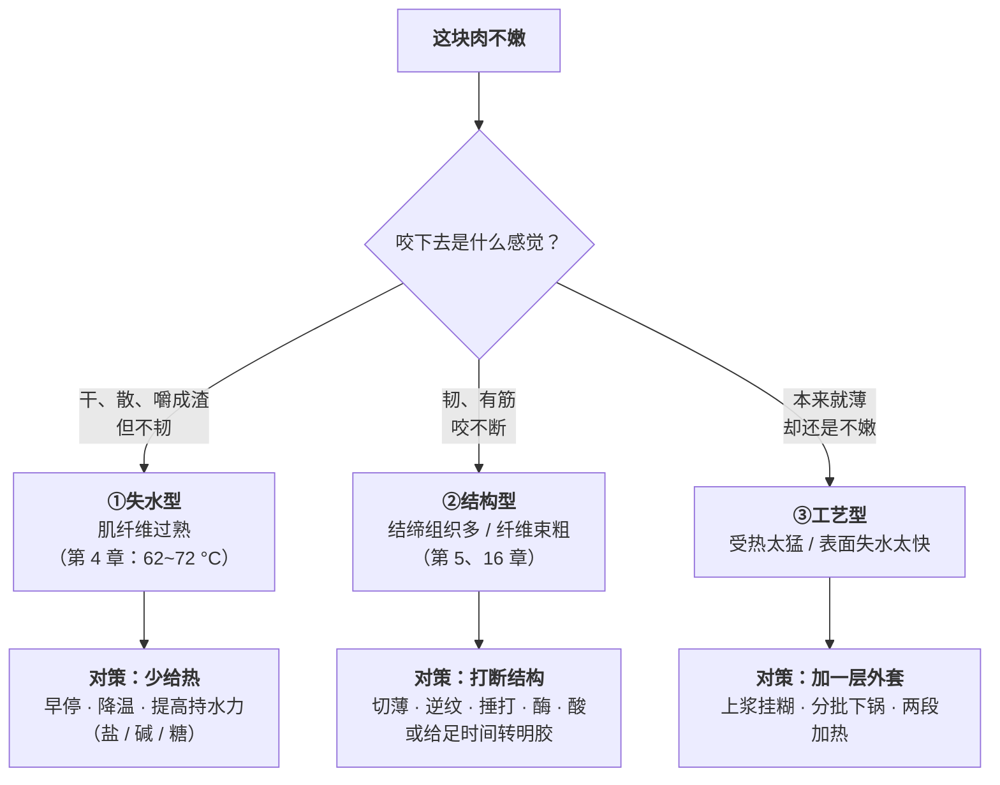

# 第 17 章 嫩化：腌制、上浆挂糊、静置分别在干什么

> **本章目标**：把"腌一下会更嫩"这句含糊的话拆开。
>
> 这一章回答三个问题：
>
> 1. **"嫩"有几种做法？**（至少三种，机理完全不同，**不能混用**）
> 2. **腌久一点是不是更好？**（一手数据说：不是，而且不是单调关系）
> 3. **上浆挂糊到底在干什么？**（本书能说到哪一步、说不到哪一步）
>
> 学完这一章你会知道：**大多数"柴"不是因为没腌，而是因为做过头了**——
> 而这两件事需要完全不同的对策。

## 17.1 先分诊：你要解决的是哪一种"不嫩"

第 16 章已经把"不嫩"拆成了两类。这里再加一类，凑齐三条路：

> ## 本章第一条可迁移规则
>
> **动手之前先分诊。三种"不嫩"的对策彼此无效，甚至互相冲突。**
>
> 最典型的两个错配：
>
> - **把①当成②**：肉做过头了，于是下次腌得更久——**没用**，
>   因为问题在锅上不在腌料上；
> - **把②当成①**：牛腩咬不动，于是缩短加热时间——**更糟**，
>   因为胶原需要的正是时间。

## 17.2 腌制：一手数据里的三个意外

关于"腌多久"，本书这一轮核到了一项设计比较完整的研究：
**192 个样品**，取自安格斯、海福特、夏洛来、利木赞四个品种的公牛，
两块肌肉（**胸腰最长肌**与**半膜肌/后腿**），
三种腌料（**全脂牛奶**、**大蒜 + 橄榄油**、**柠檬汁配方**），
三个时长（**12、24、72 小时**），并同时做了仪器测定与感官评价。

### 意外一：腌制时间与嫩度不是单调关系

| 肌肉 | **剪切力**[^1]（WBSF）随时间的变化 |
|------|------------------------|
| **胸腰最长肌** | 对照最高；**12 小时降到最低**；**24 小时与 72 小时反而回升** |
| **半膜肌（后腿）** | **12 小时时最高**；到 24 小时**回落到与对照相当** |

**两块肌肉的走向甚至是相反的。**

> **所以"腌得越久越嫩"是错的。** 不但不单调，**不同部位的曲线形状还不一样**。

### 意外二：仪器说的和人说的不一致

- **仪器**（剪切力）：最长肌在 **12 小时**最嫩；
- **感官小组**：整体上**偏好 24 小时**——
  在后腿肌上，**24 小时在所有指标上得分最高**；
  最高的单项组合是**安格斯 + 橄榄油大蒜腌料 + 24 小时**（平均 7.14 分）。

作者对色泽给出的解释是：**24 小时才够腌料充分渗入并改变特性**，
而**低 pH 的腌料（如柠檬）可能启动一种"预熟"过程**，改变肉的颜色。

> ## 本章第二条可迁移规则
>
> **"更嫩"和"更好吃"不是同一件事，别只盯着一个指标。**
>
> 腌制同时在动好几样东西：嫩度、颜色、风味渗透、水分。
> **仪器只测了其中一项**。
> 这也是本书反复强调"感官结论更软"的一个具体例子。

### 意外三：酸腌确实有效，但机制是一串

该研究中**柠檬汁腌料的剪切力最低**，与"酸性腌制"的预期一致。
文中复述的机制链条是：

1. **组织膨胀**稀释了受力——pH 降到肌肉蛋白**等电点**[^2]以下时，
   蛋白带净正电荷、同种电荷互相排斥，**腾出空间容纳更多水**；
2. **酸性环境增强蛋白水解**（组织蛋白酶活性提高）；
3. **酸性条件促进胶原在烹饪时转成明胶**——
   文中提到**pH 从 6 降到 4 时肽键水解显著加速**。

这和第 8 章已核到的内容是同一件事的两侧：

> **pH 离等电点越远，持水力越高**——
> 所以**酸腌和碱腌都能提高持水力**，它们在同一条 U 形曲线的两端。

## 17.3 碱（小苏打）：机理清楚，家庭用量仍然不给

第 8 章已经核到这些：

- **碱性腌制是中式烹饪常用的嫩化方法**；
- **碳酸氢盐使肌原纤维膨胀并融合**；
- 注射碳酸氢钠**提高持水力与蛋白溶解度、降低滴水损失、蒸煮损失与剪切力**，
  效果**与盐、磷酸盐相当**；
- ⚠️ 但样品**纤维间出现充气孔隙、外观异常**。

本轮新核到的一条补充了"温度"这个被忽略的变量：

> 一项研究在 **0.4%（w/w）碳酸氢钠**的条件下，
> 考察了 **4~50 °C** 的静置温度对鸡肌原纤维蛋白凝胶性质的影响。
> 结果：**保水性、出品率、凝胶强度、硬度、弹性与咀嚼性都在 30 °C 静置时达到峰值**；
> 作者归因为 30 °C 时分子间疏水相互作用与氢键最大化、形成致密有序的网络；
> **超过 30 °C 则破坏凝胶结构、降低保水与质地**。

> ⚠️ **这条的体系必须说清楚**：
> **分离出来的鸡肌原纤维蛋白溶液**，不是一块肉；
> 而且它测的是**凝胶性质**（做丸子、做肉糜那一类），不是整块肉的嫩度。
>
> **本书只用它说明一件事：碱腌里"静置温度"是一个真实存在的变量，
> 而不是"放冰箱还是放桌上都一样"。**
> **家庭用量与时间本书仍然不给**——见下面这一段。

> ## 本书为什么坚持不给小苏打的家庭用量
>
> 因为已核到的文献用的都是**特定浓度溶液或注射处理**，
> 而家庭场景是"抓一把肉、撒一点粉、抓匀、放一会儿"——
> **浓度、分布、接触时间全都不可控**。
>
> 把工业参数换算成"一斤肉放几克"是**本书明确拒绝做的事**
> （见[出处登记](../../standards.md)的缺口清单）。
>
> **替代方案**：第 8 章给的做法——**自己做梯度实验找上限**。
> 因为碱腌过量有非常明确的失败信号：**滑得发假、发涩、有碱味、颜色发黄**。
> 你只需要找到"出现这些信号之前的那一档"。

## 17.4 盐：它其实是嫩化手段之一

第 11 章已经核到（工业肉制品语境）：

- 氯化钠**把肌原纤维蛋白从肉中溶出**，溶出的蛋白在乳化体系中**包住脂肪、阻止水分释放**；
- **多汁感的提升来自盐溶性肌原纤维蛋白的溶出**；
- 宰后早期腌制的研究中，**"至少 2% 氯化钠"**才能保证蛋白溶解度、乳化能力与持水力的改善。

> ⚠️ **全篇语境为工业肉制品加工，不可直接搬到家常菜。**

而第 7 章核到的另一条限制同样重要：

> **腌料渗入很慢、主要只作用于外层**（工业上用注射来解决这个问题）。

> ## 本章第三条可迁移规则
>
> **腌料进不去，所以"延长时间"的收益很快见顶——真正有效的是改变几何形状。**
>
> | 做法 | 为什么有效 |
> |------|----------|
> | **切薄** | 把"要渗进去的距离"直接缩短 |
> | **切条、切片而不是整块** | 增大表面积 / 体积比 |
> | **划刀、改花刀** | 人为制造更多入口 |
> | **逆纹切** | 把长纤维束截短（⚠️ 定量证据本书未核到） |
>
> **一句话**：**与其腌一整夜，不如把肉切薄一半。**

## 17.5 酶：效果很强，强到需要小心

一项 2026 年的研究把**木瓜蛋白酶**与**菠萝蛋白酶**加入注射用盐水，处理猪里脊，
设了对照与 **0.015% / 0.030% / 0.045%** 三个浓度：

| 指标 | 结果 |
|------|------|
| **剪切力** | 从对照的 **26.22 N/cm²** 降到最高浓度组的 **10.78 N/cm²**（木瓜）与 **9.38 N/cm²**（菠萝） |
| **颜色** | 变得**更亮、更不红**：红度 a* 从对照 **13.07** 降到 **5.19~6.66**，总色差达到 **8.66** |
| **质构** | 硬度、胶着性、咀嚼性、剪切功**同步显著下降** |
| **感官** | 嫩度与多汁感**提升**，总体可接受度**未下降** |
| 微生物 | 冷藏储存中总菌数最高 4.56 × 10² CFU/g，未检出大肠杆菌、沙门氏菌、单增李斯特菌 |

> **翻译成厨房语言**：**酶的效果非常强——剪切力可以掉到原来的四成左右。**
> 强到什么程度？**它同时把肉的颜色改掉了**（红度掉了一半以上）。
>
> ⚠️ **适用范围**：**注射法 + 工业配方（含红藻基盐水）+ 猪里脊**。
> 家庭里常见的做法是"用菠萝汁/木瓜/猕猴桃/嫩肉粉抓一下"，
> **浓度和分布完全不同**，本书**不给家庭用量**。

**家庭使用时唯一需要记住的**：

> **酶不会自己停下来。** 它在你腌着的时候一直在工作，
> 时间过长的典型后果是**表面变糊、发面、发渣**——
> 那不是"更嫩"，那是**结构已经被拆散**。
> 所以**用酶的时候，时间比用量更需要小心**。

## 17.6 上浆挂糊：本书能说到哪一步

**这是中式厨房最典型的"文献空白区"。**

### 能说的（机制方向）

**上浆挂糊**[^3]是**给蛋白质加一层外套**，这层外套做三件事：

| 它做什么 | 机理在哪一章 |
|---------|------------|
| **先受热糊化，形成一层含水的凝胶** | 第 6 章：淀粉糊化 |
| **把热量的冲击挡在外面**，让内部升温更慢更均匀 | 第 2 章：多了一层导热阻力 |
| **减少水分直接蒸发** | 第 3 章：表面不再是自由水直接暴露 |

另外，浆里常见的成分各有分工（**这一栏是机制推理**）：

| 成分 | 推测的作用 | 依据层级 |
|------|----------|---------|
| **淀粉** | 糊化成膜 | ✅ 机理清楚（第 6 章） |
| **蛋清** | 受热凝固成膜；蛋白质还会**结合香气分子** | ✅ 机理清楚（第 4、13 章） |
| **水** | 被外套锁在里面 | ⚠️ 机制推理 |
| **碱（小苏打）** | 提高持水力 | ✅ 机理已核（第 8 章），⚠️ 用量未核 |
| **油** | 防粘连；也是香气载体 | ⚠️ 机制推理 + 惯例 |

### 不能说的

> ⚠️ **"上浆挂糊能减少多少失水"——本书未核到任何定量对照。**
>
> 这在[出处登记](../../standards.md)里是一条**从第 4 章就登记、至今未补上**的缺口。
> 所以本书：
>
> - **不给配比**（几个蛋清配多少淀粉配多少水）；
> - **不给"能减少百分之多少失水"**；
> - **不说"上浆一定更嫩"**——只说**机理方向支持它减少水分流失**。

**这一格空着是诚实的**。你可以照惯例做（代价很低），
但**不要拿它当原理去推新情况**。

## 17.7 静置：只有一半有依据

厨房里"静置"有两种，证据强度**差别很大**：

| 说法 | 判定 | 说明 |
|------|------|------|
| **"静置让余温继续把中心做熟"** | ✅ **有依据** | 这就是**余温加热**（第 4 章已登记术语）——厚的食材内部还在被外层导热加热。美国 FDA 的整块牛/猪/羊/小牛肉指引本身就写明 **145 °F（约 63 °C）+ 静置 3 分钟** |
| **"静置让肉汁回到肉里"** | ⚠️ **未找到实验证据** | 这条本书从第 4 章起就登记为缺口，**至今未核到**。机制推理（温度下降后蛋白网络部分回复持水）讲得通，但**没有实验支撑** |

> **所以本书对静置的表述是**：
> **静置的确定收益是"温度继续走完"，"肉汁回流"是待验证的说法。**
> 两者都不妨碍你静置一下（代价为零），但**别把第二条当原理去教别人**。

## 17.8 安全：腌制这一步有官方规定

嫩化是本部分里**唯一一个会长时间把生肉放在常温边缘**的操作，所以必须单独说。

> 美国 FDA 的指引写得很明确：
>
> - **在冰箱里腌制——绝不要在厨房台面或户外腌制**；
> - **不要重复使用泡过生肉的腌料**；如果要当酱汁用，
>   **在生肉下去之前先分出一份**，或者**先把腌料煮沸**；
> - 冷藏应保持在 **40 °F 以下**；
> - 食物不应在 **40~140 °F 之间停留超过 2 小时**（户外高于 90 °F 时缩短到 1 小时）。
>
> **各国口径不同，以本地现行发布为准。**

这条在家庭里最常被违反的场景是：**腌一夜时直接放在厨房台面上**，
以及**用腌过生肉的料汁去收汁却没煮沸**（其实后者只要煮沸就没问题）。

## 17.9 把五种手段合成一张选择表

| 手段 | 解决哪一类"不嫩" | 机理 | 证据状态 | 主要风险 |
|------|--------------|------|---------|---------|
| **切薄 / 逆纹 / 划刀** | ②结构型 | 缩短纤维束长度、缩短渗透距离 | ✅ 方向清楚；⚠️ 逆纹的**定量**未核到 | 几乎无风险——**应该最先做** |
| **盐** | ①失水型 | 溶出肌原纤维蛋白、提高持水 | ✅ 机理已核（⚠️ **工业语境**，"至少 2%"不可直接搬） | 过量则咸；且腌料**渗不进去** |
| **碱（小苏打）** | ①失水型 | pH 远离等电点 → 持水力上升；碳酸氢盐使肌原纤维膨胀融合 | ✅ 机理已核；⚠️ **家庭用量本书不给**；静置温度是真实变量（30 °C 峰值，但为分离蛋白体系） | 过量：**滑得发假、发涩、碱味、发黄**；文献中另见"纤维间充气孔隙、外观异常" |
| **酸（醋 / 柠檬 / 番茄）** | ②结构型（部分①） | pH 远离等电点 + 增强蛋白水解 + 促进胶原转明胶 | ✅ 一手对照支持（柠檬腌料剪切力最低）；⚠️ **时间非单调** | **带来酸味**；**低 pH 可能"预熟"改变颜色** |
| **酶（木瓜 / 菠萝 / 猕猴桃）** | ②结构型 | 直接水解蛋白 | ✅ 效果强（剪切力 26.22 → 9.38~10.78 N/cm²）；⚠️ **注射 + 工业配方**，家庭用量未核 | **不会自己停**：过头就变糊、发渣；**明显改变颜色**（a* 13.07 → 5.19~6.66） |
| **上浆挂糊** | ③工艺型 | 外套：糊化成膜、减缓传热、减少蒸发 | ⚠️ **机理方向清楚，定量未核** | 几乎无风险；过厚会影响口感与上色 |

> ## 本章最后一条、也是最重要的一条规则
>
> **在动用任何嫩化手段之前，先确认这块肉不是"被做过头"的。**
>
> 因为：
>
> - 第 4 章：**持水量的下降集中在约 62~72 °C**——十度左右的窗口；
> - 第 16 章：**窄窗口型的部位（鸡胸、里脊、鱼）本来就容易越过它**。
>
> **如果问题是过熟，那么腌料、碱、酶、浆全都救不了。**
> **唯一有效的是：切薄、分批下锅、早一点停火。**

## 17.10 常见说法辨析

按本书约定标注**证据强度**：✅ 有共识 / ⚠️ 有争议 / ❌ 明确错误 / 缺乏证据。
来源见[出处登记](../../standards.md)。

| 说法 | 判定 | 说明 |
|------|------|------|
| "腌得越久越嫩" | ❌ **不是单调关系** | 192 个样品的研究：**最长肌 12 小时剪切力最低，24 与 72 小时回升**；**后腿肌 12 小时反而最高，24 小时回落到与对照相当**。两块肌肉走向**相反** |
| "腌过一定更好吃" | ⚠️ **要看测什么** | 同一研究中**仪器（剪切力）与感官不一致**：仪器说 12 小时最嫩，**感官小组整体偏好 24 小时**（最高组合为安格斯 + 橄榄油大蒜 + 24 小时，7.14 分） |
| "肉柴了是没腌够" | ❌ **多数是做过头** | "柴"的主因是**肌纤维过熟失水**（持水量的下降集中在约 62~72 °C）。腌制解决不了过熟——**切薄、分批、早停**才有效 |
| "加酸能嫩肉" | ✅ **有一手支持，机制是一串** | 该研究中**柠檬汁腌料剪切力最低**；机制包括组织膨胀（pH 离等电点越远持水力越高）、**酸性增强蛋白水解**、**促进胶原转明胶**（文中提到 pH 从 6 降到 4 时肽键水解显著加速）。⚠️ 代价是**酸味**与**低 pH 可能"预熟"改变颜色** |
| "小苏打腌肉，一斤肉放 X 克" | 缺乏证据（本书不给） | 机理已核（碱性腌制是中式常用嫩化法、碳酸氢盐使肌原纤维膨胀融合、降低剪切力与蒸煮损失、效果与盐和磷酸盐相当），但文献用的是**特定浓度溶液或注射处理**。**家庭用量本书明确不给**，改为让读者做梯度实验找上限（第 8 章） |
| "腌肉放冰箱还是放桌上都一样" | ❌ **既不安全，也不等价** | **安全**：美国 FDA 指引是**在冰箱里腌制，绝不要在台面或户外**；食物不应在 40~140 °F 之间停留超过 2 小时。**工艺**：一项 0.4% 碳酸氢钠的研究显示**静置温度（4~50 °C）显著影响保水与凝胶性质，30 °C 时达峰、超过 30 °C 反而破坏结构**。⚠️ 后者是**分离肌原纤维蛋白体系**，不是整块肉 |
| "腌料腌一夜就能入味到里面" | ❌ **渗入很慢** | 已核到：**腌料渗入很慢、主要只作用于外层**（工业上用注射解决）。**真正有效的是改变几何形状**：切薄、切条、划刀 |
| "嫩肉粉/菠萝汁越多越好" | ❌ **酶不会自己停** | 一手数据显示酶的效果很强：剪切力从 **26.22 N/cm²** 降到 **9.38~10.78 N/cm²**，同时**红度 a* 从 13.07 掉到 5.19~6.66**。过头的表现是表面发糊、发渣。⚠️ 该研究为**注射法 + 工业配方**，家庭用量本书不给 |
| "上浆挂糊能锁住肉汁" | ⚠️ **机理方向支持，定量未核** | 机理清楚（淀粉糊化成膜、减缓传热、减少蒸发），但**"能减少多少失水"本书从第 4 章起登记为缺口、至今未核到**。所以本书**不给配比、不给百分比** |
| "静置能让肉汁回到肉里" | ⚠️ **未找到实验证据** | 能确认的是**余温加热**（美国 FDA 对整块牛/猪/羊/小牛肉的指引本身就是 **145 °F + 静置 3 分钟**）。"肉汁回流"本书从第 4 章起登记为缺口，**至今未核到** |
| "腌过生肉的料汁可以直接当酱汁" | ❌ **除非煮沸** | 美国 FDA：**不要重复使用泡过生肉的腌料**；要当酱汁用就**在生肉下去之前先分出一份**，或**先煮沸**。⚠️ 美国口径，各国不同 |

## 17.11 🔎 下次做菜时的用处

1. **先分诊**：干而散（过熟）、韧而有筋（结构）、还是薄了还不嫩（工艺）。三种对策不通用。
2. **最先做的永远是切薄和逆纹**——零成本、零风险、收益最直接。
3. **"柴"先怀疑火和时间，不要先怀疑腌料。**
4. **别指望腌一夜能入味到中心**——腌料主要作用于外层。
5. **腌制一律在冰箱里**；腌过生肉的料汁要用就先煮沸。
6. **用酶（菠萝、木瓜、猕猴桃、嫩肉粉）时，时间比用量更危险**——它不会自己停。
7. **酸腌会带来酸味，也会改变颜色**——这是代价，不是失败。
8. **碱腌过量有明确信号**：滑得发假、发涩、碱味、发黄。找到信号之前的那一档。
9. **上浆是"外套"不是"魔法"**——它减缓传热与蒸发，救不了本来就做过头的肉。

## 17.12 思考题

1. 三种"不嫩"分别是什么？为什么说它们的对策"彼此无效甚至互相冲突"？
2. 腌制时间与嫩度的关系，一手数据给出了什么结果？为什么说它"不单调"？
3. 同一项研究里，仪器与感官的结论不一致。这说明什么？本书从中提炼出哪条规则？
4. 酸腌的机制是哪三条？它和碱腌为什么可以放在同一条曲线上理解？
5. 本书为什么坚持不给小苏打的家庭用量？替代方案是什么？
6. 为什么说"与其腌一整夜，不如把肉切薄一半"？
7. **【案例】** 你买了一块猪后腿肉（偏瘦、有明显筋膜），想做一道**快手滑炒**。
   （a）请按本章的分诊流程判断主要矛盾；
   （b）列出你会用的手段，并排出先后顺序；
   （c）每一条手段你打算承担什么代价；
   （d）哪些手段你**不会**用？为什么？
8. **【案例】** 你用菠萝汁腌了鸡胸两小时，做出来表面发糊、口感发渣，
   但中间部分还是柴的。
   （a）解释这两个现象分别是怎么产生的；
   （b）说明它们为什么会**同时**出现；
   （c）下次你会怎么改？
9. **【辨析】** "腌肉放冰箱还是放桌上都一样"——
   请从**安全**和**工艺**两个角度分别判断，并说明工艺那条证据的体系限制。
10. **【辨析】** "上浆挂糊能锁住肉汁"——判断证据强度。
    本书能说什么、不能说什么？为什么这一格宁可空着？
11. "静置"的两种说法证据强度差别很大。分别是什么？
    为什么本书仍然建议你静置一下？

> 📖 **参考答案**（想清楚再看）：[Q1](../../qa/17-tenderizing-qa.md#q1) ·
> [Q2](../../qa/17-tenderizing-qa.md#q2) · [Q3](../../qa/17-tenderizing-qa.md#q3) ·
> [Q4](../../qa/17-tenderizing-qa.md#q4) · [Q5](../../qa/17-tenderizing-qa.md#q5) ·
> [Q6](../../qa/17-tenderizing-qa.md#q6) · [Q7](../../qa/17-tenderizing-qa.md#q7) ·
> [Q8](../../qa/17-tenderizing-qa.md#q8) · [Q9](../../qa/17-tenderizing-qa.md#q9) ·
> [Q10](../../qa/17-tenderizing-qa.md#q10) · [Q11](../../qa/17-tenderizing-qa.md#q11)

## 17.13 本章实操

### 🅐 零成本版 · 任务一：把你做过的"不嫩"做一次分诊

| 菜 / 食材 | 当时的口感描述 | 属于哪一类（失水/结构/工艺） | 我当时做了什么 | 按本章该做什么 |
|----------|------------|------------------------|-------------|-------------|
| | | | | |
| | | | | |
| | | | | |

做完回答：

1. 有几次其实是**失水型**（做过头），却被你当成"没腌够"？
2. 有几次你用的手段**和问题类型不匹配**？

### 🅐 零成本版 · 任务二：给你常用的腌法做一张"代价表"

大多数人只记得腌法的好处。这次把代价写出来。

| 我常用的腌法 | 它解决哪一类不嫩 | 证据状态（查本章表） | 代价是什么 | 我遇到过这个代价吗 |
|-----------|--------------|----------------|----------|---------------|
| 盐 | | | | |
| 小苏打 | | | | |
| 醋 / 柠檬 / 番茄 | | | | |
| 嫩肉粉 / 菠萝 / 木瓜 | | | | |
| 淀粉 + 蛋清（上浆） | | | | |

### 🅐 零成本版 · 任务三：检查一遍你的腌制安全习惯

| 检查项 | 官方指引（美国 FDA 口径） | 我平时 | 要不要改 |
|-------|---------------------|-------|---------|
| 在哪里腌 | **冰箱**，绝不在台面或户外 | | |
| 腌过生肉的料汁怎么处理 | **不重复使用**；要用就先煮沸，或事先分出一份 | | |
| 生熟砧板 / 刀具 | 分开（交叉污染） | | |
| 腌完到下锅之间放了多久 | 40~140 °F 之间不超过 2 小时（高于 90 °F 时 1 小时） | | |

> ⚠️ **各国口径不同，以本地现行发布为准。**

### 🅑 开火版 · 任务四：切法对照（有灶台时做）

**这是本章最该做的一个实验，因为它零成本、零风险。**

**需要**：同一块肉（后腿或里脊都行）、同样的调味、同样的火。

| 组 | 处理 | 嚼几下能咽 | 韧不韧 | 柴不柴 | 总体 |
|----|------|----------|-------|-------|------|
| ① | **顺纹切，厚** | | | | |
| ② | **顺纹切，薄** | | | | |
| ③ | **逆纹切，厚** | | | | |
| ④ | **逆纹切，薄** | | | | |

做完回答：

1. **厚薄**和**纹向**哪个影响更大？
2. ④比①改善了多少？这个改善**一分钱没花**——
   和你平时用的腌料相比，性价比如何？
3. ⚠️ 本书说"逆纹切降低多少剪切力"**未核到定量证据**。
   你这次的结果**算不算验证**？为什么不算？（提示：单次、单人、无盲测、无重复）

### 🅑 开火版 · 任务五：腌制时间的三档对照

**需要**：同一块肉分成四份、一种腌料（建议先用最简单的：盐 + 少量水）。

| 组 | 腌多久 | 嫩度（0~10） | 多汁（0~10） | 味道渗到多深 | 总体喜好 |
|----|-------|------------|------------|-----------|---------|
| ① | **不腌**（对照） | | | | |
| ② | **15 分钟** | | | | |
| ③ | **2 小时**（冰箱） | | | | |
| ④ | **过夜**（冰箱） | | | | |

做完回答：

1. 嫩度是**单调上升**的吗？（本章预期：不是）
2. **味道渗到多深**？切开看——是不是只有外层有味？
   （已核到：**腌料渗入很慢、主要只作用于外层**）
3. 你的"**最喜欢**"和"**最嫩**"是同一组吗？
   （一手研究里它们就不是同一组）

> ⚠️ **全程冷藏**。美国 FDA：在冰箱里腌制，绝不在台面上。

### 🅑 开火版 · 任务六：上浆 vs 不上浆

**需要**：同一块肉分两份、淀粉、蛋清（可选）。

| 组 | 处理 | 表面状态 | 嫩度 | 多汁 | **上色情况** | 总体 |
|----|------|---------|------|------|-----------|------|
| ① | 不上浆 | | | | | |
| ② | 上浆（淀粉 + 蛋清 + 少量水） | | | | | |

做完回答：

1. ② 更嫩吗？**更不上色吗**？（提示：外套挡住了褐变——第 7 章）
2. 这说明上浆的**代价**是什么？
3. ⚠️ 本书**未核到**"上浆能减少多少失水"的定量对照。
   你这次观察到的差别，能不能写成"上浆减少了 X% 的失水"？为什么不能？

> ⚠️ **安全提醒**：生肉与熟食分开处理；腌制全程冷藏；
> 腌过生肉的料汁**不要直接当酱汁**，要用就先煮沸。
> 熟度判断用温度计——美国 CDC 指出**除海鲜外不能靠颜色和质地判断是否熟透**。
> 剩余食物在烹调后 **2 小时内**冷藏（高于 90 °F 时 1 小时，美国 FDA 口径）。
> **各国口径不同，以本地现行发布为准。**

## 17.14 本章依据

本章引用的来源与核对状态详见[参考书目与出处登记](../../standards.md)，具体对应如下：

| 本章用到的内容 | 依据 |
|--------------|------|
| **腌制时间的非单调性与仪器/感官不一致**：192 个样品，取自安格斯、海福特、夏洛来、利木赞四品种公牛的**胸腰最长肌**与**半膜肌**，三种腌料（全脂牛奶 / 大蒜 + 橄榄油 / 柠檬配方）× **12、24、72 小时**。**最长肌**：对照剪切力最高，**12 小时最低，24 与 72 小时回升**；**半膜肌**：**12 小时最高，24 小时回落到与对照相当**。**感官**：整体偏好 **24 小时**，半膜肌上 24 小时在所有指标得分最高；最高单项组合为**安格斯 + 橄榄油大蒜 + 24 小时（7.14 分）**；**柠檬汁腌料剪切力最低**。机制复述：组织膨胀稀释受力、**酸性增强蛋白水解（组织蛋白酶）**、**促进胶原转明胶**，并提到 **pH 从 6 降到 4 时肽键水解显著加速**；低 pH 腌料可能启动"预熟"并改变颜色 | 一项关于腌制时间、腌制处理与品种对牛肉品质影响的研究，*Foods*，2024（PMC11431012），✅ 开放获取全文。⚠️ **牛肉、四个品种、两块肌肉**；本书只用其"非单调"与"仪器/感官不一致"这两个结构性结论 |
| **碳酸氢钠与静置温度**：**0.4%（w/w）碳酸氢钠**、静置温度 **4~50 °C**；**保水性、出品率、凝胶强度、硬度、弹性、咀嚼性均在 30 °C 时达峰**（白度则最低），归因于 30 °C 时疏水相互作用与氢键最大化、形成致密有序网络；**超过 30 °C 破坏凝胶结构、降低保水与质地** | 一项关于碳酸氢钠与静置温度改善低盐鸡肌原纤维蛋白保水性与凝胶特性的研究，*Food Chemistry: X*，2025（PMC12720121），✅ 开放获取全文。⚠️ **分离的鸡肌原纤维蛋白体系**，测的是**凝胶性质**，**不是整块肉的嫩度**；本书仅用它说明"静置温度是真实变量" |
| **植物蛋白酶的嫩化强度**：木瓜蛋白酶与菠萝蛋白酶加入注射盐水处理猪里脊，浓度 0.015% / 0.030% / 0.045%；**剪切力从对照 26.22 N/cm² 降到 10.78（木瓜）与 9.38（菠萝）N/cm²**；**红度 a* 从 13.07 降到 5.19~6.66、总色差达 8.66**；硬度、胶着性、咀嚼性、剪切功同步显著下降；**感官嫩度与多汁感提升、总体可接受度未下降**；冷藏储存中总菌数最高 4.56 × 10² CFU/g，未检出大肠杆菌、沙门氏菌与单增李斯特菌 | 一项关于木瓜蛋白酶与菠萝蛋白酶对猪里脊嫩化及其理化与感官影响的研究，*Foods*，2026（PMC13298935），✅ 开放获取全文。⚠️ **注射法 + 工业配方（含红藻基盐水）**；**本书不给家庭用量** |
| **碱的机理**：**pH 离等电点越远持水力越高**，故碱性溶液同样有嫩化作用；**碱性腌制是中式烹饪常用的嫩化方法**；碳酸氢盐使**肌原纤维膨胀并融合**；注射碳酸氢钠**提高持水力与蛋白溶解度、降低滴水损失、蒸煮损失与剪切力**，效果**与盐、磷酸盐相当**，但样品**纤维间出现充气孔隙、外观异常**；**腌料渗入很慢、主要只作用于外层**（工业用注射解决） | 一篇关于分子美食学的综述，*Chemical Reviews*，2010（PMC2855180），✅ 开放获取全文（第 7、8 章已登记） |
| **盐的作用**：氯化钠**把肌原纤维蛋白从肉中溶出**，溶出的蛋白阻止水分释放；**多汁感的提升来自盐溶性肌原纤维蛋白的溶出**；宰后早期腌制研究中**"至少 2% 氯化钠"**才能保证蛋白溶解度、乳化能力与持水力的改善 | 一篇关于低氯化钠含量肉制品生产技术的综述，*Foods*，2021（PMC8145339），✅ 开放获取全文（第 11 章已登记）。⚠️ **工业肉制品语境**，不可直接搬到家常菜 |
| **持水量的下降集中在约 62~72 °C**（拟合中点 66.76 °C） | 一项关于肉在烹饪中各向异性大变形的有限元研究，*Current Research in Food Science*，2025（PMC12615324），✅（第 4 章已登记）。⚠️ 模型取值与拟合函数 |
| **胶原转明胶需要时间**；**剪切力随二级肌束膜束的粗细上升** | 低温慢煮综述（*Foods*，2023，PMC10453940）与肌肉结构综述（*The Scientific World Journal*，2016，PMC4789028），✅（第 4、5、16 章已登记） |
| **淀粉糊化成膜**（上浆挂糊的机理方向）；**蛋白质会结合香气分子** | 分子美食学综述（PMC2855180）与减脂乳液香气释放研究（*Foods*，2022，PMC8947701），✅（第 6、13 章已登记） |
| **腌制必须在冰箱中进行**；**不要重复使用泡过生肉的腌料**（要用就事先分出一份或先煮沸）；冷藏 **40 °F 以下**；食物在 **40~140 °F 之间不超过 2 小时**（户外高于 90 °F 时 1 小时）；整块牛/猪/羊/小牛肉 **145 °F（约 63 °C）+ 静置 3 分钟**；**除海鲜外不能靠颜色和质地判断是否熟透** | 美国 FDA「Handling Food Safely While Eating Outdoors」与「Safe Food Handling」、美国 CDC 食品安全页面，✅。⚠️ **美国口径，各国不同，以本地现行发布为准** |
| **小苏打腌肉的家庭用量**；**上浆挂糊减少失水的定量对照与配比**；**"静置让肉汁回到肉里"的实验证据**；**逆纹切降低剪切力的定量**；**家庭尺度"腌多久"的定量** | ⚠️ **均未核到**。正文分别标为"不给用量""机理方向""待验证说法""方向合理缺乏定量"，并已登记在[出处登记](../../standards.md)的缺口清单 |

[^1]: [剪切力](../../glossary.md#shear-force)（Warner–Bratzler shear force, WBSF）。
[^2]: [等电点](../../glossary.md#isoelectric-point)（isoelectric point）。
[^3]: [上浆挂糊](../../glossary.md#velveting)与[余温加热](../../glossary.md#carryover)。

---

**下一章**：第 18 章 焯水、汆烫、过油——预处理到底解决什么问题。
那一章会把"焯水"拆成**四个互不相同的目的**，
并算清它的代价：已核到的是 90 °C/15 分钟条件下，
**豌豆与茄子的抗坏血酸损失约 65~70%**。
