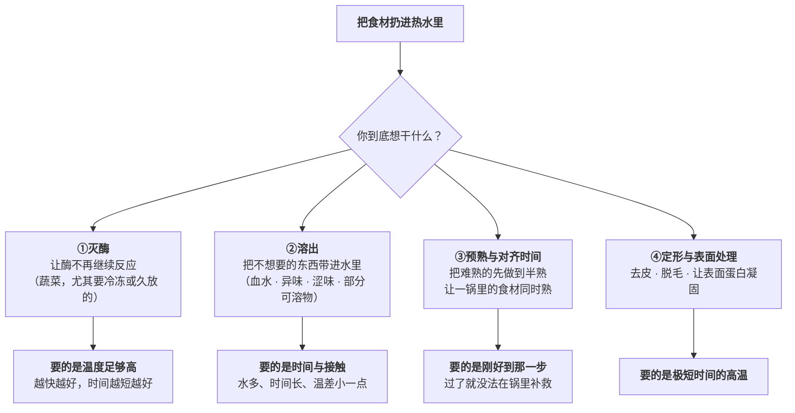
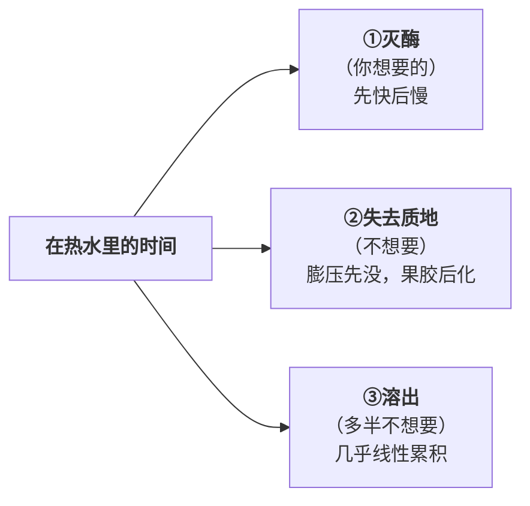

# 第 18 章 焯水、汆烫、过油：预处理到底解决什么问题

> **本章目标**：把"焯一下"这个动作拆成**四个互不相同的目的**，
> 并且把它的**代价算清楚**。
>
> 这一章回答四个问题：
>
> 1. **焯水到底在解决什么问题？**（至少四个，而且它们要求的火候完全不同）
> 2. **为什么焯水这么快？**（本轮补上了一条从第 2 章就挂着的缺口）
> 3. **代价有多大？**（一手数据：质地、溶出、颜色，三条曲线同时在走）
> 4. **过油和油炸的油，到底是什么时候进去的？**（答案很反直觉）
>
> 学完这一章你会知道：**"焯一下更干净"不是一个目的，它是四个目的的混称**——
> 说不出你要的是哪一个，就会出现"该去的没去掉、该留的全跑了"。

## 18.1 先拆开：焯水是四件不同的事

第三部分的判据是"**每一步预处理都必须回答它解决哪个具体问题**"。
焯水是这条判据最好的试金石，因为它同时被用来做四件事：

> ## 本章第一条可迁移规则
>
> **①和②要求的操作方向是相反的。**
>
> - **灭酶**要的是"**快进快出**"——最好一秒之内就把表面烫到失活温度，
>   因为每多待一秒，溶出与软化都在继续；
> - **溶出**要的是"**慢一点、久一点**"——你就是想让东西跑到水里去。
>
> 所以**"焯水焯多久"没有统一答案**，只有"**你要的是①还是②**"。
> 最常见的失败是：想灭酶（绿叶菜），却按溶出的时间去焯——结果**该去的去了，该留的也去了**。

## 18.2 为什么焯水这么快：水的换热系数终于有数了

第 2 章讲传热时留了一条缺口：**沸水与热油在烹饪场景下的换热系数没核到**。
本轮补上了水这一半。

一项 2026 年关于青豆角焯水建模的研究，用热水浴中豆荚的实测升温曲线去拟合模型，
得到的**外部换热系数约 1000 W/(m²·K)**（作者说明这与文献报道的量级一致）。
把它和本书已核到的几个数放在一起：

| 介质 | 换热系数的**量级**（模型取值） | 出处状态 |
|------|----------------------|---------|
| **静止空气** | 约 **8** W/(m²·K) | 已核（第 2 章） |
| **强制热风 / 气炸** | 约 **100** W/(m²·K) | 已核（第 2 章） |
| **锅面接触** | 约 **200**（另一篇拟合出约 40 的量级） | 已核（第 2 章） |
| **热水浴** | 约 **1000** W/(m²·K) | ✅ **本章新核到** |

> ⚠️ **这些都是不同论文里的模型取值与拟合参数，不是物性手册**，
> 定义口径也不完全一致（"锅面接触"那两篇差了五倍）。
> **本书只用它们比量级，不用它们算数**。

即便如此，量级差别已经足够说明问题：

> ## 本章第二条可迁移规则
>
> **同样是 100 °C，水传热比空气快两个数量级左右。**
>
> 所以：
>
> - **焯水的时间尺度是"秒"，不是"分钟"**——绿叶菜下去十几秒就变色，不是错觉；
> - **烤箱里 200 °C 待十分钟不算狠，水里 100 °C 待十分钟就狠得多**；
> - **"稍微焯一下"在热水里根本不存在**——你以为的"稍微"，已经是一次完整的热处理。

蒸汽还要更特殊一点：**冷凝时释放潜热**（第 2 章已核：水的汽化潜热约 2.26 × 10⁶ J/kg），
所以**蒸汽在食材表面放热非常猛**。下面 18.4 节会看到它的实际后果。

## 18.3 灭酶：焯水唯一"必须用热"的目的

蔬菜里有一批酶，在**你不加热它就会一直干活**：

| 酶 | 它会做什么 | 厨房里的表现 |
|----|----------|------------|
| **多酚氧化酶（PPO）** | 酚 + 氧 → 醌 → 黑色素 | 切开发黑（第 7 章已讲）。已核到：**PPO 失活发生在约 80~100 °C** |
| **脂氧合酶（LOX）** | 催化不饱和脂肪酸氧化 | 生成醛类异味物，**冷冻储存期间的"哈味"** |
| **过氧化物酶（POD）** | 催化多种氧化反应 | **最耐热**，工业上用它当"焯够了没有"的指示剂 |
| **果胶甲酯酶（PME）** | 脱掉果胶上的甲酯基 | ⚠️ **它不是坏蛋**——见下节 |

一手研究给出的几条：

- **不灭酶，冷冻储存时反应会继续，而且被"冻结浓缩"效应放大**——
  所以冷冻蔬菜在工业上**一定先焯**；
- **POD 最耐热，所以被当成"时间—温度积分器"**——
  工业上用愈创木酚 + 过氧化氢喷在切面上，
  **变红棕色说明酶还活着**（该定性法与定量测定的相关 r² = 0.77）；
- ⚠️ **但作者明确指出这个惯例有问题**：POD 活性和**产品质量**的相关只有中等（r² = 0.60），
  换成对应 LOX / 果胶水解那一档的活化能后才升到 0.80。
  **"POD 灭活了"更接近"热处理够了"，而不是"品质保住了"。**

> **翻译成厨房语言**：
> **"灭酶"这个理由，只在"这批菜要冷冻或要放很久"时才成立。**
> 你今天焯了今天就下锅炒的青菜，酶有没有灭活**几乎不影响结果**——
> 那一锅水解决的是别的问题（预熟、去涩、对齐时间）。

## 18.4 代价：三条曲线同时在走

这是本章最重要的一节。你把菜扔进热水的那一刻，**有三件事同时开始**：

### 质地：分两步没的，第一步救不回来

一手研究说得很清楚：

1. **膨压（turgor）的丧失基本上不可避免**——
   **细胞膜在高于约 40 °C 时就已经破裂**。
   也就是说，**只要你打算加热，"生脆"就一定会丢**；
2. **果胶的溶解才是可控的那一半**——
   果胶通过 **β-消除**降解（第 8 章已核：由氢氧根催化、发生在非酸性环境），
   而**它在高于约 90 °C 时变得显著**。

这解释了一个很多人没想通的现象：

> **"焯过的青菜为什么再也脆不回来了？"**
> 因为**脆有两种**：一种是细胞鼓胀带来的"生脆"（40 °C 就没了，回不来），
> 另一种是细胞壁还没垮带来的"有筋道"（这一种你还能保住）。
> **焯水能保住第二种，保不住第一种。**

一手的数字（西兰花，98 ± 1 °C 热水 vs 100 °C 蒸汽）：

| 处理 | 硬度 |
|------|------|
| **新鲜**（对照） | 约 **62 N** |
| **热水焯 30 秒** | **30.58 N** |
| **蒸汽焯 30 秒** | **39.57 N** |
| **蒸汽焯 150 秒** | 约 **10 N**（约为鲜样的 **16%**） |

> **三十秒，硬度掉一半。** 这就是"稍微焯一下"的真实量级。

该研究还转引了一条消费者偏好的参考：
**质地保留在鲜样的 20%~40% 时喜好度最高，5%~20% 仍属可接受**。
⚠️ 这是转引，且是西兰花，**不要当成通用刻度**——
本书用它只说明一件事：**"最好吃"不在两端，而在中间某处**。

### 溶出：它几乎是按时间线性累积的

同一项青豆角研究测了焯水水里的**酚类、电导率与 pH**，
并与"**等效时间**"（把变化的温度历程折算成某个参考温度下的等效时长）做回归：
**相关系数 r² ≈ 0.9**。

> **意思是：溶出量基本上由"你在热水里待了多久（折算过温度）"决定，几乎没有别的变数。**
> 这也意味着——**没有什么技巧能让你"只焯不溶"**。

与此配套的是第 3 章已核到的那组数字：

> **焯水（90 °C / 15 分钟）条件下，豌豆与茄子的抗坏血酸损失约 65~70%、青椒约 50%。**
> ⚠️ 这是**转引**，且 15 分钟远长于家庭焯水；本书用它标出**代价的上限量级**，不是日常值。

### 颜色：焯完更绿，是个反直觉的事

一手测量显示：焯过之后 **a\* 变得更负，也就是更绿**。原因**不是"锁住了叶绿素"**，
研究给出的两种解释是：

1. **细胞结构被破坏，叶绿素反而漏到细胞外**，绿色因此更显；
2. **焯水赶走了表面绒毛与细胞间隙里的空气**，改变了光的反射——看起来更绿。

> ## 这一条直接影响一个流传很广的说法
>
> **"焯青菜要加油/加盐才能保绿"——本书从第 8 章起就登记为"未核到任何支持证据"，本轮仍然没有。**
>
> 而现在我们知道了：**焯完变绿这件事本身，机制上和你往水里加了什么没有关系**
> （细胞间隙排气 + 叶绿素外泄）。
>
> 与此同时，加盐**有一个已核到的相反方向的代价**：
> 加盐造成渗透失衡，**水分流失更多、水溶性成分损失更大**（第 3 章已核）。
>
> **所以这一步你可以照惯例做（成本低），但别把它当原理。**

至于"**久了发黄**"，那是另一件事：b\* 上升，
化学身份是**脱镁叶绿素**（第 8 章：叶绿素在酸催化下失镁）。**它和"变绿"不是同一条曲线。**

## 18.5 水焯 vs 汽蒸：同样的秒数，结果不一样

上面那项西兰花研究是一次干净的对照（热水 98 ± 1 °C vs 蒸汽 100 °C，30~150 秒）。
结果一边倒：

| 指标 | 热水焯（HWB） | 蒸汽焯（SB） |
|------|-------------|------------|
| **灭酶速度** | 慢：**120 秒**后切面才不再变色 | 快：**90 秒**后切面就不再变色。作者归因为**蒸汽冷凝放出潜热，表面升温更快** |
| **质地** | 30 秒掉到 30.58 N | 30 秒仍有 39.57 N |
| **颜色偏离（ΔE）** | 更大 | 更小 |
| **萝卜硫素保留** | 更少 | 更多 |
| **回热异味（WOF）相关醛** | **戊醛随时间明显升高** | 60 秒组明显更低 |
| **细胞结构（电镜）** | 塌得更厉害 | 保存更好 |

作者的结论是 **60 秒蒸汽焯整体最优**。⚠️ 语境是**西兰花 + 工业预处理**，
且该研究有**企业合作背景**（论文自行披露资助来源）。

> ## 本章第三条可迁移规则
>
> **"能不能不泡在水里"是焯水这一步最值钱的一个问题。**
>
> 因为泡在水里会同时付两笔钱：**溶出**（可溶物跑进水里）与**更快的软化**
> （浸泡促进溶质浸出与果胶流失）。
>
> 所以：
>
> - 目的是**灭酶 / 预熟 / 去生味** → **蒸汽是更好的选择**；
> - 目的**就是溶出**（去血水、去涩、去咸） → **必须用水，而且要给时间**。
>
> **注意这条和"蒸汽温度更低所以更温和"是两回事**——
> 蒸汽因为冷凝放潜热，表面升温其实**更快**。它温和的地方在于**没有水把东西带走**。

## 18.6 肉的焯水：和蔬菜完全不是一回事

肉焯水的目的**不在灭酶**，而在 18.1 里的②和④：

**能核到的（方向）**：

- 一篇 2026 年关于肉与肉制品异味的综述指出：**煮制过程中，部分致味物质会溶进烹调水里**，
  这构成"热蒸发/溶解"这一类去味手段的一部分；同一类里还包括
  **高温促进异味成分挥发或热分解**；
- 同一篇综述还给出了**盐水浸泡**的一手转引：
  牛肝用 **1.0% 氯化钠溶液浸泡 60 分钟**时脱腥效果最好，
  若干异味物显著下降。

> ⚠️ **这是"浸泡"不是"焯"**，且对象是内脏。
> 本书只用它说明一个方向：**"泡出来"和"烫出来"是两条不同的路，泡的那条更依赖时间。**

**说不了的（缺口）**：

> ⚠️ **"冷水下锅 vs 沸水下锅"——本书未核到任何对照实验。**
>
> 机制上可以推：想让东西溶出来，就该让它在**低温区多待一会儿**（冷水起）；
> 想锁住，就该**短时高温**让表面蛋白迅速凝固（沸水下）。
> 这条推理和第 3 章的溶出机理一致，**但它没有实验支持**，
> 所以本书**标为机制推理**，并登记进[出处登记](../../standards.md)的缺口清单。

**关于浮沫**：那层灰褐色的沫，主要是**受热变性并聚集的可溶性蛋白**（第 4 章：肌浆蛋白约 40~60 °C 聚集），
混着血红素与脂肪。**撇掉它主要是让汤清亮**——
这是**外观与口感的选择**，不是安全问题。

## 18.7 过油与油炸：油是什么时候进去的？

中式的"**过油**"（滑油、走油）在原理上是**用油代替水做那一步预处理**。
换介质带来两个变化（第 2、3 章的直接推论）：

1. **温度可以高于 100 °C** → 表面能**结壳、能上色**（水做不到）；
2. **不会把可溶物泡走** → 少了溶出这笔代价，多了吸油这笔代价。

那么**油到底什么时候进去的？** 一项 2025 年用**同步辐射高速 CT**做的研究，
以小麦面团为模型，在**真炸的过程中和出锅后的冷却过程中**连续成像。结论很明确：

> **炸的时候，内部水蒸气往外冲的正压把油挡在外面；
> 油主要是在出锅之后、冷却的时候被"吸"进去的**——
> 因为蒸汽冷凝造成内部负压，加上毛细作用，把表面的油拉进壳里的小孔。

该研究也测了最终含油量：**180 °C 为 14.4%、150 °C 为 12.2%、120 °C 仅 1.3%**。
作者的解释是：**温度越高、壳越明显、表面开孔越多，毛细吸油的通道就越多**；
120 °C 没有形成明显的壳，结构还在冷却时塌掉了，所以油进不去。

> ⚠️ **这一条必须把限制写清楚**：
>
> - 体系是**小麦面团模型**，不是裹粉的肉、不是薯条、不是过油的肉片；
> - **仅此一项研究**（但用的是很直接的在线观测方法）；
> - ⚠️ 它的方向**与厨房里"油温不够才会吸油"的说法相反**。
>   本书**不据此推翻那条说法**——两者的体系差得太远。
>   **本书只写能站住的那一半：油主要在冷却阶段进入。**

而"油主要在冷却阶段进入"这一条**是可以直接用的**：

> ## 本章第四条可迁移规则
>
> **炸完之后怎么放，和怎么炸一样重要。**
>
> 既然油是在**冷却时被吸进去的**，那么：
>
> - **出锅后立刻沥干、单层摊开、别堆在一起**——减少表面残油可被吸入的量；
> - **别盖盖子、别垫吸不住水的容器**——闷住会让蒸汽冷凝在食物上，壳软了还更吸油；
> - **"炸完泡在油里等一会儿"是最差的做法**。

工业上薯条的做法正好印证了这套逻辑：
**先焯水（灭酶 + 让部分淀粉糊化 + 浸出糖以控制上色），再半炸（par-fry），冷冻，最后成品炸**——
**焯水那一步的热输入必须控制，因为果胶在那一步就开始降解了**。
⚠️ 这是**工业链条**，家庭里做不了也不需要做，
但它说明了一件事：**"两段加热"不是玄学，它在工业上是被算过的。**

## 18.8 把四个目的合成一张决定表

| 你的目的 | 该用什么 | 时间尺度 | 主要代价 | 证据状态 |
|---------|---------|---------|---------|---------|
| **灭酶**（要冷冻/久放的蔬菜） | 蒸汽优于热水 | 秒~分钟，以"酶灭活"为准 | 质地（膨压必丢） | ✅ 一手（POD/LOX/PME 动力学、西兰花对照） |
| **溶出**（血水、涩、咸、异味） | **必须用水**，可冷水起 | 更长；泡比烫有效 | 可溶物一起走 | ⚠️ 方向已核（煮制使部分异味物溶入水中、盐水泡内脏）；**冷水 vs 沸水未核** |
| **预熟 / 对齐时间** | 水或蒸汽都行 | 以"刚到那一步"为准 | 过了无法补救 | 惯例 + 机制清楚 |
| **定形 / 表面处理** | 沸水极短时间 | 秒 | 几乎没有 | 惯例 |
| **过油（换介质）** | 油 | 秒 | 吸油；且**油在冷却时进入** | ✅ 一手（在线 CT），⚠️ 面团模型 |

> ## 本章最后一条规则
>
> **焯水不是"洗干净"，它是一次真正的热处理。**
>
> 所以它应该和"炒多久""炖多久"放在同一个预算里算：
> **你在焯水上花掉的热与时间，要从后面的烹饪里扣掉。**
>
> 最常见的连锁失败是：**焯过了头，又按没焯过的时间去炒**——
> 于是出来的是**两次过熟**。

## 18.9 常见说法辨析

按本书约定标注**证据强度**：✅ 有共识 / ⚠️ 有争议 / ❌ 明确错误 / 缺乏证据。
来源见[出处登记](../../standards.md)。

| 说法 | 判定 | 说明 |
|------|------|------|
| "焯水是为了洗干净" | ❌ **混淆了目的** | 焯水至少在做四件不同的事（灭酶 / 溶出 / 预熟 / 定形），它们**要求的操作方向甚至相反**。"洗干净"对应的只是其中的②溶出 |
| "稍微焯一下没什么影响" | ❌ **影响很大** | 热水的换热系数约 **1000 W/(m²·K)** 量级，比静止空气（约 8）高两个数量级。一手实测：西兰花热水焯 **30 秒**硬度就从约 62 N 掉到 **30.58 N** |
| "焯水能锁住颜色" | ⚠️ **现象成立、机制不是"锁"** | 焯后 a\* 更负（更绿）是真的，但研究给的解释是**细胞破裂使叶绿素外泄**与**赶走细胞间隙的空气改变光反射**——不是"锁住"。⚠️ 单项研究 |
| "焯青菜加油/加盐能保绿" | 缺乏证据（且加盐有反向代价） | 自第 8 章登记以来**未核到任何支持证据**。已核到的相反方向：**加盐造成渗透失衡，水分与水溶性成分损失更大**。而"变绿"本身的机制与加什么无关 |
| "蒸比煮温和，因为温度低" | ⚠️ **结论对，理由错** | 蒸汽因**冷凝释放潜热**，表面升温其实**更快**——一手对照中蒸汽反而**更早灭酶**（90 秒 vs 热水 120 秒）。蒸汽温和的地方是**没有液态水把可溶物带走**，且软化更慢（30 秒时 39.57 N vs 30.58 N） |
| "焯久一点更干净" | ⚠️ **同时也更空** | 溶出量与**等效时间**高度相关（r² ≈ 0.9），即"待多久"几乎单独决定了流失多少。转引的上限量级：90 °C/15 分钟时豌豆与茄子的抗坏血酸损失约 65~70% |
| "焯过的菜就不会再出水了" | ❌ **两回事** | 出水的主因是细胞膜破裂后水被放出来（**高于约 40 °C 即发生**）。焯过的菜**已经把这部分水放掉了一部分**，所以炒时出水**看起来**少了——但这不是"锁住"，是"已经流掉了" |
| "冷水下锅焯肉才能焯出血水" | ⚠️ **机制合理，对照未核** | 溶出需要时间与接触，低温区多待确实有利于溶出——但本书**未核到任何冷水 vs 沸水的对照实验**，已登记为缺口。可核到的相邻事实：**煮制时部分异味物会溶入水中**；牛肝用 1.0% 盐水泡 60 分钟脱腥效果最好（⚠️ 内脏 + 浸泡，非焯水） |
| "浮沫是脏东西，必须撇干净" | ⚠️ **主要是外观问题** | 浮沫主要是**受热变性聚集的可溶性蛋白**（第 4 章：肌浆蛋白约 40~60 °C 聚集）加血红素与脂肪。撇它是为了汤清亮，**不是安全要求** |
| "油温不够所以吸油" | ⚠️ **有一项方向相反的一手证据** | 在线 CT 研究（**小麦面团模型**）中最终含油量为 **180 °C 14.4% / 150 °C 12.2% / 120 °C 1.3%**，作者归因于高温形成的壳上有更多可供毛细吸油的开孔。⚠️ **体系差异很大，本书不据此推翻厨房说法**，只记录存在这条反向证据 |
| "炸的时候油在往里渗" | ❌ **主要不是** | 同一项在线观测：**炸的过程中向外冲的蒸汽正压把油挡在外面**；油**主要在出锅冷却时**因蒸汽冷凝造成的压力梯度与毛细作用被吸入。⚠️ 面团模型、单项研究，但方法很直接 |
| "冷冻蔬菜不用焯，焯了浪费营养" | ❌ **对冷冻而言必须焯** | 不灭酶时，酶反应在冷冻储存期**继续进行并被冻结浓缩效应放大**；LOX 残留会在冻藏期产生醛类异味。⚠️ 这条只适用于"要冷冻或久放"，**当天吃的菜不成立** |
| "焯水能去掉大部分嘌呤/草酸/农残" | 缺乏证据（本书不写比例） | 本书**未核到**任何家庭尺度的定量数据。能确定的只有"水溶性成分会迁移到水里"这一方向（第 3 章已核）。**具体去掉多少，本书不给数字** |

## 18.10 🔎 下次做菜时的用处

1. **动手前先说出你要的是哪一个目的**——灭酶、溶出、预熟，还是定形。说不出来就别焯。
2. **要灭酶/预熟就上蒸汽；要溶出才用水。** 泡在水里是有代价的。
3. **"稍微焯一下"不存在**——水的传热比空气快两个数量级，三十秒就能让硬度掉一半。
4. **焯过的时间要从后面的烹饪里扣掉**，否则就是两次过熟。
5. **青菜的"生脆"救不回来**（40 °C 以上细胞膜就破了），能保住的是"不烂"那一档。
6. **焯完发黄和焯完变绿是两件事**：黄是脱镁叶绿素（时间越长越黄），绿是排气与色素外泄。
7. **炸完立刻沥干、单层摊开、别堆别盖**——油主要是在冷却时被吸进去的。
8. **浮沫撇不撇是外观选择**，别把它当安全问题。
9. **要冷冻的蔬菜一定先焯；当天吃的不用为"灭酶"焯。**

## 18.11 思考题

1. 焯水至少在解决哪四个不同的问题？为什么说其中两个的操作方向是相反的？
2. 水的换热系数比静止空气高多少量级？这个差别在厨房里翻译成什么操作结论？
3. 蔬菜焯水时同时在走的三条曲线是什么？哪一条是你想要的，哪些是代价？
4. "脆"分成哪两种？为什么说其中一种在焯水时一定丢掉？
5. 为什么一手对照里**蒸汽反而比热水更早灭酶**？这说明"蒸比煮温和"的理由错在哪？
6. 焯完的青菜看起来更绿，机制是什么？这条结论如何影响"加油加盐保绿"的判定？
7. **【案例】** 你买了一斤芦笋，**今天晚上就吃**，打算做蒜蓉炒芦笋。
   （a）按本章的四个目的，判断你到底需不需要焯这一步；
   （b）如果需要，你用水还是蒸汽？时间以什么为准？
   （c）如果这斤芦笋是**要冻起来下周吃**，答案会变吗？为什么？
8. **【案例】** 你焯了一锅排骨（冷水下锅，煮到大量浮沫出现），
   撇沫后继续按菜谱炖了两小时，结果肉很柴、汤也不鲜。
   （a）列出至少三个可能的原因，并标明各自对应本书哪一章；
   （b）哪些是焯水这一步造成的，哪些不是？
   （c）下次你会改哪一步？为什么先改这一步？
9. **【辨析】** "焯久一点更干净"——请判断证据强度，
   并说明"溶出与等效时间 r² ≈ 0.9"这条数据为什么让这句话变成了一笔明确的交易。
10. **【辨析】** "油温不够所以吸油"——本书为什么**既不支持也不推翻**它？
    在线 CT 研究能支持的是哪一半结论？
11. 为什么说"焯水不是洗干净，而是一次真正的热处理"？
    这句话对应的最常见连锁失败是什么？

> 📖 **参考答案**（想清楚再看）：[Q1](../../qa/18-blanching-qa.md#q1) ·
> [Q2](../../qa/18-blanching-qa.md#q2) · [Q3](../../qa/18-blanching-qa.md#q3) ·
> [Q4](../../qa/18-blanching-qa.md#q4) · [Q5](../../qa/18-blanching-qa.md#q5) ·
> [Q6](../../qa/18-blanching-qa.md#q6) · [Q7](../../qa/18-blanching-qa.md#q7) ·
> [Q8](../../qa/18-blanching-qa.md#q8) · [Q9](../../qa/18-blanching-qa.md#q9) ·
> [Q10](../../qa/18-blanching-qa.md#q10) · [Q11](../../qa/18-blanching-qa.md#q11)

## 18.12 本章实操

### 🅐 零成本版 · 任务一：把你做过的焯水逐条归目的

翻出你最近做的五道菜，凡是有"焯"这一步的，填这张表。

| 菜 | 焯的是什么 | 我当时以为是为了什么 | 按本章它其实解决了哪个目的（①灭酶/②溶出/③预熟/④定形） | 这个目的成立吗 | 能不能省 |
|----|----------|------------------|-------------------------------------------|------------|--------|
| | | | | | |
| | | | | | |
| | | | | | |
| | | | | | |
| | | | | | |

做完回答：

1. 有几步**说不出目的**？（说不出就是本部分判据里"不要做"的那一步）
2. 有几步的目的是**①灭酶**，但那道菜其实**当天就吃**？
3. 有几步**用水但目的不是溶出**？（这些是可以改成蒸汽的）

### 🅐 零成本版 · 任务二：给一份菜谱算"热预算"

找一份有焯水步骤的菜谱，把整道菜的加热分段列出来。

| 阶段 | 介质 | 温度（写明是读数还是推测） | 时间 | 这一段主要在做什么 | 它花掉了总"熟度预算"的多少（自己估） |
|------|------|----------------------|------|----------------|--------------------------|
| 焯水 | | | | | |
| 主加热 | | | | | |
| 收汁/回锅 | | | | | |

做完回答：菜谱有没有在焯水之后**相应缩短**主加热时间？如果没有，你打算怎么改？

### 🅐 零成本版 · 任务三：给"焯水的四个目的"做一张自查卡

把下面这张卡抄到你常用的记事本里，下次动手前问一遍。

| 问题 | 我的答案 |
|------|---------|
| 我要的是①灭酶还是②溶出？ | |
| 如果是②，我想让**什么**跑到水里去？ | |
| 我愿意一起损失掉什么？ | |
| 能不能改成蒸汽（不泡水）？ | |
| 焯完我打算把主加热缩短多少？ | |

### 🅑 开火版 · 任务四：水焯 vs 汽蒸的对照（有灶台时做）

**这是本章最值得做的实验，因为两组的差别肉眼可见。**

**需要**：同一把绿叶菜或西兰花分两份、一口锅、一个蒸屉、计时器。
**关键**：**两组时间必须一样**，否则比不了。

| 组 | 处理 | 颜色（0~10，越绿越高） | 咬下去的脆度（0~10） | 出水多少 | 味道浓淡 | 总体 |
|----|------|-------------------|-----------------|---------|---------|------|
| ① | **热水焯 30 秒** | | | | | |
| ② | **蒸汽蒸 30 秒** | | | | | |
| ③ | **热水焯 90 秒** | | | | | |
| ④ | **蒸汽蒸 90 秒** | | | | | |

做完回答：

1. **同样 30 秒**，哪一组更脆？（一手研究的预期：蒸汽组）
2. **哪一组味道更淡？** 这对应本章哪一条代价？
3. 从 30 秒到 90 秒，哪一组掉得更快？
4. ⚠️ 你这次的结果**算不算验证**？为什么不算？
   （提示：单次、单人、无盲测、无重复、没有测硬度的仪器）

### 🅑 开火版 · 任务五：焯水水的"账单"

**需要**：透明玻璃碗两个、焯菜的水、焯肉的水。

把焯完的水分别倒进碗里，静置放凉后观察并记录：

| 焯的是什么 | 水的颜色 | 有没有沉淀/浮沫 | 尝一口是什么味（⚠️ 放凉、少量） | 你判断跑掉了什么 |
|----------|---------|--------------|------------------------|--------------|
| 绿叶菜 | | | | |
| 排骨/鸡 | | | | |

做完回答：

1. 这碗水**有味道吗**？那些味道本来应该在哪里？
2. 哪一碗你**愿意倒掉**，哪一碗你会**留下来用**？为什么？
3. 这个判断和你的**目的**（①还是②）是不是一致？

### 🅑 开火版 · 任务六：炸完怎么放（验证"油在冷却时进入"）

**需要**：任意可炸的东西（裹糊的、不裹糊的都行）分成三份、厨房纸、盘子。

| 组 | 出锅后的处理 | 十分钟后摸上去有多油 | 脆不脆 | 纸上的油渍大小 |
|----|------------|-----------------|-------|-------------|
| ① | **立刻单层摊在架子/厨房纸上** | | | |
| ② | **堆在碗里** | | | |
| ③ | **盖上盖子** | | | |

做完回答：

1. 三组的差别在哪一项上最明显？
2. 这个差别对应本章的哪条机制？
3. ⚠️ 本书引用的那项研究用的是**小麦面团模型**。
   你这次炸的东西和它差在哪里？这会不会让你的观察**不能**当作验证？

> ⚠️ **安全提醒**：热水与热油都会造成严重烫伤——**下料时贴着水面/油面放，不要从高处扔**；
> **食材务必擦干再下油**（水遇热油会剧烈飞溅）；锅柄朝内；孩子与宠物远离灶台。
> 焯过生肉的水**不要**再用来焯蔬菜（交叉污染）；处理生肉后洗手至少 20 秒（美国 FDA 口径）。
> 焯水与过油**都不等于做熟**——最终熟度仍需按官方中心温度判断，
> 美国 CDC 指出**除海鲜外不能靠颜色和质地判断是否熟透**。
> **各国口径不同，以本地现行发布为准。**

## 18.13 本章依据

本章引用的来源与核对状态详见[参考书目与出处登记](../../standards.md)，具体对应如下：

| 本章用到的内容 | 依据 |
|--------------|------|
| **焯水的目的与代价的建模**：焯水用于灭酶，**不灭酶时酶反应会在冷冻储存期继续并被冻结浓缩效应放大**；**过度焯水损害质地与营养**；质地下降来自 ①**膨压丧失（细胞膜在高于约 40 °C 时即破裂，基本不可避免）**与 ②**果胶溶解（β-消除，在高于约 90 °C 时变显著）**；**PME 脱甲酯后果胶反而更耐 β-消除**；**POD 最耐热、被工业用作时间—温度积分器**，愈创木酚定性法与定量测定相关 **r² = 0.77**，但 **POD 与产品质量的相关只有 r² = 0.60**（换成 LOX/果胶那一档活化能后升到 0.80），作者建议改用 LOX；**LOX 残留导致冻藏期脂质氧化与异味**；**浸出量与等效时间高度相关（r² ≈ 0.9）**；**热水浴的外部换热系数拟合为约 1000 W/(m²·K)** | 一项关于青豆角焯水过程中酶失活与品质变化建模的研究，*Current Research in Food Science*，2026（PMC13217498），✅ 开放获取全文。⚠️ **建模研究 + 青豆角**；⚠️ 论文自行披露**一位作者受雇于部分资助该项目的公司**；⚠️ 换热系数是**拟合值**，本书只用量级 |
| **水焯 vs 汽蒸的一手对照**：西兰花，热水 **98 ± 1 °C** vs 饱和蒸汽 **100 °C**，30~150 秒。**灭酶**：切面愈创木酚显色在热水 **120 秒**、蒸汽 **90 秒**后消失；蒸汽 60 秒使 POD 由 2660.03 降到 595.47 U/g FW；作者归因为**蒸汽冷凝释放潜热使表面升温更快**。**质地**：鲜样约 **62 N**，30 秒时热水 **30.58 N**、蒸汽 **39.57 N**；蒸汽 150 秒降到约 **10 N（鲜样的 16%）**；转引的偏好参考为**保留 20%~40% 时喜好度最高、5%~20% 仍可接受**。**颜色**：两法都使 ΔE > 3.0，蒸汽更小；**a\* 变得更负（更绿）**，解释为**细胞结构破坏使叶绿素外泄**与**排除细胞间隙与表面绒毛中的空气改变光反射**；b\* 随时间上升（偏黄）。**风味**：9 个关键标志物（戊醛、1-戊醇、二甲基二硫、二甲基三硫、1-辛烯-3-醇、庚醛、己醛、1-己醇、癸醛）；**热水组戊醛（回热异味相关）随时间明显升高**，蒸汽 60 秒组明显更低；蒸汽组萝卜硫素保留更多 | 一项关于蒸汽与热水焯烫调控西兰花回热异味的研究，*Foods*，2026（PMC13298270），✅ 开放获取全文。⚠️ **单一品种西兰花 + 工业预处理语境**；论文披露有企业合作方与地方专项资助 |
| **油什么时候进入食物**：用同步辐射高速 CT 对小麦面团在**炸制中与出锅冷却中**连续成像。**炸制时水分蒸发与制品膨胀产生的正压抑制油进入**；**冷却时蒸汽冷凝形成有利压力梯度，油被吸入**，本研究直接观察到**油主要在冷却阶段进入**，且**集中在外层壳的孔隙中、与芯部孔隙不连通**。最终含油量：**180 °C 14.4%、150 °C 12.2%、120 °C 1.3%**，作者归因于高温形成明显的壳与表面开孔、毛细吸油通道更多；120 °C 未形成明显壳且结构在冷却时塌缩。另记录：**壳温持续高于 100 °C，而芯部稳定在水的沸点附近** | 一项用高速计算机断层成像观察油炸食品吸油三维微结构动力学的研究，*Nature Communications*，2025（PMC11911452），✅ 开放获取全文。⚠️ **小麦面团模型体系**，不是裹粉的肉或薯条；⚠️ **仅此一项研究**；⚠️ 含油量随温度上升的方向与厨房常见说法相反，本书**不据此推翻厨房说法**，只记录该反向证据 |
| **工业薯条链条**：**先焯水、再半炸（par-fry）、冷冻、最后成品炸**；**焯水的一个主要目的是灭活 PPO（发生在约 80~100 °C）**，但**果胶的 β-消除在同一步就已开始**，所以焯水的热输入必须控制；**焯水时可溶营养会浸出**；细胞分离由**果胶溶解、蒸汽压积累与淀粉糊化引起的细胞膨胀**共同造成 | 一篇关于工业规模薯条质地成因的综述，*Current Research in Food Science*，2024（PMC10909613），✅ 开放获取全文。⚠️ **工业加工语境**，家庭不适用；多处为综述转引 |
| **煮制使部分异味物溶入水中**；**高温促进异味成分挥发或热分解**；**盐水浸泡**：牛肝以 **1.0% 氯化钠浸泡 60 分钟**时脱腥效果最好，若干异味物显著下降 | 一篇关于肉与肉制品异味形成机制与调控策略的综述，*Current Research in Food Science*，2026（PMC13266231），✅ 开放获取全文。⚠️ **综述转引 + 内脏/浸泡语境**，不是焯水 |
| **焯水（90 °C/15 分钟）豌豆与茄子抗坏血酸损失约 65~70%、青椒约 50%**；**加盐造成渗透失衡使水分与水溶性成分损失更大**；**蒸没有液态水、不允许抗坏血酸浸出** | 一篇关于热处理对果蔬成分影响的综述，*Comprehensive Reviews in Food Science and Food Safety*，2024（PMC11605278），✅（第 3 章已登记）。⚠️ 均为**综述转引** |
| **β-消除由氢氧根催化、发生在非酸性环境**；**叶绿素在加热时暴露于组织自身的酸而转成脱镁叶绿素** | 一篇关于低温慢煮对蔬菜品质影响的综述，*Foods*，2026（PMC12840460），✅（第 8 章已登记） |
| **PPO 机制与对策（焯烫使酶变性）** | 一篇关于控制果蔬酶促褐变的综述，*Molecules*，2020（PMC7355983），✅（第 7、8 章已登记） |
| **换热系数的其他量级**（静止空气约 8、强制热风/气炸约 100、锅接触约 200 与约 40 W/(m²·K)）；**水的汽化潜热 2.26 × 10⁶ J/kg**；**肌浆蛋白约 40~60 °C 聚集** | 第 2、4 章已登记的三篇食品工程建模文献（PMC12615324、PMC12887417、PMC13157119）与低温慢煮综述（PMC10453940），✅。⚠️ 均为**模型取值** |
| **腌过生肉的处理与交叉污染、颜色不能判断熟度、2 小时规则** | 美国 FDA「Safe Food Handling」「Handling Food Safely While Eating Outdoors」与美国 CDC 食品安全页面，✅。⚠️ **美国口径，各国不同** |
| **"冷水下锅 vs 沸水下锅"的对照**；**焯水去除嘌呤/草酸/农残的定量**；**"加油/加盐保绿"的支持证据**；**家庭尺度焯水时长与损失的定量** | ⚠️ **均未核到**。正文分别标为"机制推理""本书不给数字""缺乏证据"，并已登记在[出处登记](../../standards.md)的缺口清单 |

[^1]: [焯水](../../glossary.md#blanching-cn)（blanching）与[膨压](../../glossary.md#turgor)（turgor）。
[^2]: [过氧化物酶](../../glossary.md#pod-lox-pme)（POD）、[脂氧合酶](../../glossary.md#pod-lox-pme)（LOX）与[果胶甲酯酶](../../glossary.md#pod-lox-pme)（PME）；[果胶与 β-消除](../../glossary.md#pectin)。
[^3]: [等效时间](../../glossary.md#equivalent-time)（equivalent time）与[回热异味](../../glossary.md#wof)（warmed-over flavor, WOF）。
[^4]: [过油](../../glossary.md#oil-blanching)与[两段炸](../../glossary.md#par-frying)（par-frying）。

---

**下一章**：第 19 章 去腥增香的机理——哪些气味物质、用什么办法赶走。
那一章会正面处理本书**自第 1 章就挂着的一条缺口**：
"腥"到底是什么分子？答案会推翻一个流传极广的等式——
一手数据里，**新鲜鱼的"腥"主要不是三甲胺**。
