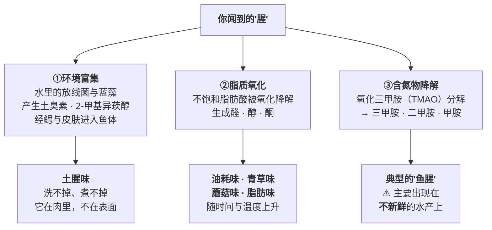

# 第 19 章 去腥增香的机理：哪些气味物质、用什么办法赶走

> **本章目标**：把"腥"从一个形容词变成**一串可以分类的分子**，
> 然后逐条检查厨房里那几种去腥办法**各自有多少证据**。
>
> 这是本书**从第 1 章就挂着的一条缺口**。本轮正面补查的结果，
> 推翻了一个流传极广的等式。
>
> 这一章回答四个问题：
>
> 1. **"腥"到底是什么分子？**（至少三类来源，对策完全不同）
> 2. **新鲜的鱼为什么也腥？**（一手数据里，它主要**不是**三甲胺）
> 3. **酒和酸到底在干什么？**（能核到的机理和厨房里流传的说法**不是同一条**）
> 4. **哪些做法只是"盖住"？**（盖住不丢人，但你得知道自己在盖）

## 19.1 先分诊：腥味有三个完全不同的来源

一项 2026 年比较淡水鲫鱼与海水黄鳍鲷腥味物质的研究，在引言里把来源归成三条：

请特别注意第三条下面那行小字——**它就是本章要推翻的那个等式**。

## 19.2 推翻等式："腥 = 三甲胺"在新鲜鱼上不成立

上面那项研究做得相当完整：**HS-SPME + 气相色谱—质谱 + 嗅闻（GC-MS-O）+ 气味活性值（OAV）
+ 香气重组 + 缺失实验**。也就是说，它不只是"检出了什么"，
还用**把某个成分从重组模型里拿掉、看人还能不能分辨**的方式做了因果验证。

**结果**（新鲜、当天处理的鱼）：

| 鱼 | 经缺失实验确认的关键腥味物 |
|----|--------------------|
| **鲫鱼**（淡水） | (E,Z)-2,6-壬二烯醛、壬醛、(E,E)-2,4-癸二烯醛、(E,E)-2,4-壬二烯醛、**1-辛烯-3-醇**、己醛 |
| **黄鳍鲷**（海水） | (E,Z)-2,6-壬二烯醛、壬醛、(E,E)-2,4-癸二烯醛、(E,E)-2,4-壬二烯醛 |

鲫鱼这几个的气味活性值分别是 **267、85、43、42、41、21、14**——
(E,Z)-2,6-壬二烯醛一骑绝尘。另外，**2-甲基异莰醇只在淡水的鲫鱼里检出**
（这就是"淡水鱼土腥味重"的化学身份）。

> ## 本章第一条可迁移规则
>
> **新鲜鱼的"腥"，主力是脂质氧化产物（醛和醇），不是三甲胺。**
>
> 证据有两层：
>
> 1. 上面那项研究里，**三甲胺根本没有出现在关键腥味物名单上**——
>    它在实验里的身份是**训练评价员时"腥"这个描述词的参照标准**；
> 2. 同一篇的引言明确写：氧化三甲胺分解出的三甲胺等胺类，
>    是"**腐败**水产品中令人不快的鱼腥味的主要来源"。
>
> **所以"腥"至少要分两种**：
>
> | 你闻到的 | 多半是什么 | 该怎么办 |
> |---------|----------|---------|
> | **新鲜但有味**（脂肪味、青草味、蘑菇味、土味） | 脂质氧化产物 + 环境富集物 | 抗氧化、降温、缩短暴露、掩盖、挥发 |
> | **明显的"鱼腥"、发冲、有氨味** | 胺类——这是**新鲜度问题** | ⚠️ **先判断还能不能吃**，不要想着怎么盖住 |
>
> **这条分诊是本章最有用的一句话**：
> 你买回来当天就做的鱼，和放了三天的鱼，"腥"的分子不一样，**对策也不该一样**。

⚠️ **限制**：这是**一项研究、两种鱼、新鲜状态**。
本书据此**不写死"三甲胺不重要"**，只写"**在新鲜鱼上，主力是脂质氧化产物**"。

## 19.3 为什么"越放越腥、越热越腥"

一篇 2026 年关于肉与肉制品异味的综述把机制串了起来：

- **脂质氧化是自由基介导的链式反应**，由**金属离子（铜、铁）、血红素蛋白、光、氧、酶**引发；
  不饱和脂肪酸（亚油酸、α-亚麻酸）先生成不稳定的氢过氧化物，
  再分解成**低气味阈值的醛、酮、羧酸**——这就是"哈味/腥味"的化学来源；
- **酶也在推**：内源**脂氧合酶（LOX）**催化氧气与不饱和脂肪酸反应
  （第 18 章讲焯水灭酶时的同一个酶）；
- **加热会加剧**：鸭肉在 90 °C、100 °C、105 °C 处理以及**复热**后，
  脂质氧化程度上升，生成壬醛、(E)-2-辛烯醛、己醛等；
- **冷却速度也有影响**：宰后 −35 °C 快速冷却的羊肉，
  比 4 °C 或 −20 °C 冷却的**1-辛烯-3-醇更低**（转引）。

> ## 本章第二条可迁移规则
>
> **去腥的第一战场不在锅里，在冰箱里。**
>
> 因为腥味物质的主力是**氧化的产物**，而氧化在你买回来之后一直在进行。
> 所以最有效的三件事分别是：
>
> 1. **买新鲜的**（这一条的效果大于所有调料）；
> 2. **尽快降温、减少暴露**（少切开、少翻动、盖好、冷藏）；
> 3. **别反复加热**（复热会把脂质氧化再推一步——第 18 章的"回热异味"）。
>
> 等到下锅才开始想"放多少料酒"，**你处理的已经是既成事实**。

## 19.4 去腥的六条路径，以及它们各自的证据等级

同一篇综述把工业上的去腥手段分成物理、化学、生物三大类。
下面这张表是**按本书的需要重新组织的**——只留下家庭厨房用得上的六条，
并标出**本书核到了什么**：

| 路径 | 它怎么起作用 | 家庭里对应什么 | 证据状态 |
|------|------------|-------------|---------|
| **①掩盖** | 香辛料与多酚类"盖住"或与蛋白/酶相互作用 | 葱姜蒜、花椒、八角、桂皮、香叶、茶 | ✅ 有一手转引：**迷迭香提取物在多种香辛料中脱腥效果最好**，归因于多酚；**0.2% 八角炖鸭腿**显著降低己醛、庚醛、1-辛烯-3-醇、2-戊基呋喃。⚠️ **综述自陈"掩盖效果有限"** |
| **②热挥发 / 热溶解** | 高温促进异味成分**挥发或热分解**；水煮时部分异味物**溶进水里** | 焯水、煸炒、炸一下 | ✅ 方向已核（第 18 章同源）。综述指出**油炸尤其能有效降低肉里的鱼腥** |
| **③酸 / 碱 / 盐** | 引起**蛋白质变性与结构伸展**，腥味物与蛋白结合成不溶复合物而分离；同时溶出脂质与色素、抑制脂质氧化 | 醋、柠檬、番茄、盐水泡 | ✅ 机制已核（综述转引）；一手：**牛肝 1.0% 氯化钠泡 60 分钟**脱腥最佳；见 19.6 的柑橘汁一手对照 |
| **④抗氧化** | 清除自由基、螯合金属离子，**从源头减少醛类生成** | 香辛料里的多酚本来就有这个作用；葡萄籽提取物、茶多酚 | ✅ 有一手转引：**百里香酚提取物**降低熟羊脂中 4-甲基辛酸等"膻味"化合物 |
| **⑤酒（乙醇）** | 见 19.5——**三条路径，证据强度不同** | 料酒、黄酒、白酒 | ⚠️ 见下节 |
| **⑥美拉德反应** | 生成吡咯、吡啶等**掩盖异味**并增强肉香色泽 | 煎、炒、炸、烤、糖色 | ✅ 方向已核（第 7 章）。⚠️ 综述提醒：**过度的斯特雷克降解反而产生焦糊味并盖住肉香** |

> **注意 ①④⑥ 三条其实是同一样东西在干不同的活**：
> 你往锅里丢的那把香辛料，**同时在掩盖、在抗氧化、在参与美拉德**。
> 所以"葱姜蒜到底有没有用"这个问题问错了——
> 该问的是"**它在哪条路径上起作用，那条路径的证据有多少**"。

## 19.5 酒到底在干什么：三条路径，只有两条核到了

本书上一轮核到过一项关于**黄酒对红烧肉风味影响**的风味组学研究，
本轮又核到一项**料酒浸泡稻花鱼**的对照。把两者合起来：

| 路径 | 说的是什么 | 证据 |
|------|----------|------|
| **①抑制氧化** | 黄酒**抑制不饱和脂肪酸的过度氧化**，从而减少 1-辛烯-3-醇、辛醛等异味物；文中**异味物含量与不饱和脂肪酸含量显著负相关** | ✅ **一手**（红烧肉风味组学），⚠️ 单一菜品、单一酒种 |
| **②溶解并带走** | 乙醇**溶解部分异味成分并随挥发带走** | ⚠️ **方向有支持，机理未核到一手**——见下面的缺口说明 |
| **③直接贡献香气** | 黄酒直接带来**苯乙醇、香茅醛**等花果香 | ✅ **一手**（同上） |

本轮新核到的对照（**稻花鲤**，**5% 料酒水溶液浸泡 30 分钟**，另设紫苏汁组与两者混合组）：

- 电子鼻上，**硫化物（W1W）、甲基类（W1S）、醇醛酮（W2S）与氮氧化物（W5S）四个传感器的响应显著下降**；
- **鲜味增强**（电子舌），游离氨基酸总量从 8777.67 升到 11125.98 mg/100 g（紫苏 + 料酒组）；
- **紫苏 + 料酒的组合效果最好**，单用料酒次之。

> ⚠️ **两条必须写清楚的限制**：
>
> 1. 这是**室温浸泡 30 分钟**，不是"炒菜时沿锅边淋一勺"。
>    **后者本书从第 14 章起就登记为缺口，至今未核到对照**；
> 2. 该研究同时观察到**去腥处理后挥发性物质的总量反而更高**——
>    也就是说，它在减少某几类的同时**加进了另一些**。
>    **这更像"减少 + 添香"，不是"纯粹带走"。**

> ## 本书至今没有核到的那一条
>
> ⚠️ **"酒精挥发时把腥味物质一起带走（共沸）"这个具体机理，本书没有核到一手实验。**
>
> 能核到的只有两种表述：
>
> - 红烧肉研究提出的"**溶解并挥发掉部分异味成分**"（该研究的机制解释）；
> - 稻花鱼研究在讨论里**转引**的一句"料酒中的乙醇可以溶解并去除三甲胺与挥发性硫化物"
>   ——⚠️ **这是转引，本书没有核到它的原始实验**。
>
> **按本书纪律，这条不升级为结论。** 正文只写：
> **酒有一条已核到的作用（抑制氧化）、一条已核到的贡献（直接添香），
> 以及一条方向合理但机理未核实的作用（溶解带走）。**

## 19.6 酸到底在干什么：一手对照给了完整的账

本轮核到一项设计很干净的对照：**鲈鱼背肉切块，4 °C 腌 1 小时**，
固液比 3:5，分五组——**鲜样（F）／纯水泡（C）／15% 橙汁（O）／15% 西柚汁（G）／10% 柠檬汁（L）**
（柠檬浓度低是因为它酸度更高）。

### 好的一面：醛类确实降了，而且同时添了香

- **柑橘汁腌过之后，己醛、3-甲基丁醛、丙醛、2-甲基丙醛等醛类信号下降**；
- ⚠️ **而纯水泡的对照组，醛类信号反而上升**；
- 同时**增加了果香酯**（丁酸乙酯等，西柚组明显）与**柑橘萜烯**（柠檬烯、γ-萜品烯、β-蒎烯，柠檬组明显）。

> **所以酸做的是两件事：把一部分醛压下去，同时加进一批好闻的东西。**
> **它不是"中和"。**

### 代价的一面：酸过头，分数反而掉

| 组 | pH | 持水力 | 亮度 L\* | 感官总分 |
|----|----|-------|---------|---------|
| **鲜样 F** | <7 | **76.83%**（最高） | — | — |
| **纯水 C** | 7.21 | 70.71% | — | 与鲜样无明显差别 |
| **橙汁 O** | 6.94 | — | 变化温和 | **70.5**（最高） |
| **西柚 G** | 6.79 | 72.69% | 变化温和 | **70.0** |
| **柠檬 L** | **6.63**（最低） | **67.73%**（最低） | **58.30**，ΔE **10.47**（明显发白） | **66.5**（三个腌制组里最低） |

电子舌上，柠檬组**酸、涩、苦都上升，咸度下降**。
作者的解释是：pH 靠近肌原纤维蛋白的**等电点**，净电荷与静电排斥下降，**结合的水变少**
（这正是第 8、17 章那条 U 形曲线的左半边）。

> ## 本章第三条可迁移规则
>
> **酸要"够到把醛压下去"，但不要"够到把肉泡白"。**
>
> 一手数据里，**酸度最强的那一组反而分数最低**——
> 它赢了颜色的显眼度，输了持水力、输了咸鲜的平衡、输了总分。
>
> 落到操作上：
>
> - **用酸度温和的**（橙汁、番茄、米醋）比**用最酸的**（柠檬汁直接泡）更容易讨好；
> - **发白 = 已经过了**——这是可见的停止信号（酸致表面蛋白变性、光散射增强）；
> - 如果非要用强酸，**缩短时间**，而不是降低"酸不酸"的追求。

### 关于"酸中和三甲胺"这条说法

⚠️ **本书未核到任何"酸使三甲胺成盐、因而不挥发"的一手食品科学实验。**

能核到的是**方向不同的一条**：

> 综述指出，**乳酸、过氧乙酸、山梨酸等有机酸能通过抑制微生物活性或螯合金属离子，
> 抑制三甲胺的生成**（例如乳酸处理鸡腿肉显著降低气味强度）。

**请注意这两句话说的不是一回事**：

| 说法 | 时间点 | 本书判定 |
|------|-------|---------|
| "酸**抑制三甲胺的生成**"（抑菌 / 螯合金属离子） | **在它产生之前** | ✅ 有综述转引支持 |
| "酸**中和已经存在的三甲胺**"（成盐 → 不挥发） | **在它产生之后** | ⚠️ **未核到一手**，登记为缺口 |

而且第一条对家庭厨房的意义有限——**你下锅前十分钟加的醋，来不及去抑制三天前就发生的腐败**。

## 19.7 "用清水泡一泡去腥"有用吗

上面那项鲈鱼研究的**纯水对照组给了一个很直接的反例**：

- **醛类信号反而上升**；
- 持水力从 76.83% 降到 **70.71%**；
- 硬度比鲜样降了约 **26%**（显微结构上纤维间的空隙明显变大、边缘模糊）；
- **感官总分与鲜样相比没有明显差别**。

但这不等于"泡水一定没用"——另一条相邻证据方向相反：

> **牛肝用 1.0% 氯化钠溶液浸泡 60 分钟**时脱腥效果最好，
> 若干异味物（戊烯醇、戊烯酮、甲硫醇）显著下降。

> ## 本章第四条可迁移规则
>
> **泡水本身不去腥——起作用的是"泡的是什么"和"泡多久"。**
>
> - **纯水**：把可溶物泡走了（包括味道），同时松散了组织，
>   **在一项一手对照里连气味评分都没改善**；
> - **盐水**：有一手转引支持（内脏，1.0%、60 分钟）；
> - **酸性/含酒精的液体**：有一手对照支持（柑橘汁、料酒，见 19.5、19.6）。
>
> **所以"泡"是载体，真正干活的是溶质。**
> 下次别说"泡一泡去腥"，说"**我要用什么泡、为了去掉哪一类分子**"。

## 19.8 增香这一半：本章不重复，但要接上

"去腥"和"增香"在厨房里总是一起说，但它们的机理在本书里分属不同章：

| 增香的机理 | 在哪一章 | 一句话 |
|-----------|---------|-------|
| **香要放两次** | 第 13 章 | 现成的香（葱花、香油、香菜）最后放；造出来的香（美拉德、爆香）前面做 |
| **香气改写味觉需要"一致 + 鼻后"** | 第 10、13 章 | 厨房里很香 ≠ 吃起来香 |
| **大蒜在不同介质里走向不同** | 第 14 章 | 油炸生成油溶性硫化物与"肉香"硫醚；水煮则含硫物溶失、风味温和 |
| **香气分子在脂里比在水里更易溶** | 第 13 章 | 所以"要香就得有油" |
| **美拉德生成的杂环化合物能盖住异味** | 第 7 章 + 本章 ⑥ | 但过度会产生焦糊味，反而盖住肉香 |

> **本章唯一要补的一句**：
> **"增香"里有很大一部分，其实是"用新的气味把旧的气味挤出感知"**——
> 也就是路径①掩盖。**它有效，但它不改变分子。**
> 所以**掩盖救不了已经变质的食材**——那是安全问题，不是风味问题。

## 19.9 把六条路径压成一张决定表

| 你闻到的 | 最可能是什么 | 先做什么 | 再做什么 | 不要做什么 |
|---------|------------|---------|---------|----------|
| **土腥、霉味**（尤其淡水鱼） | 2-甲基异莰醇 / 土臭素（环境富集） | ⚠️ **它在肉里，洗不掉**——只能靠掩盖与增香 | 重口味做法（红烧、豆瓣、香辛料） | 指望"多洗几遍" |
| **油耗味、纸板味**（尤其剩菜、复热） | 脂质氧化醛类（回热异味） | **别再加热第三次** | 抗氧化型香辛料 + 酸 + 新鲜香气 | 靠加盐去救（第 15 章：更咸救不了缺鲜，也救不了异味） |
| **蘑菇味、青草味**（新鲜鱼也有） | 1-辛烯-3-醇、己醛 | 酒或柑橘汁短时腌 | 用油做（把香气带起来） | 长时间泡纯水 |
| **冲鼻的"鱼腥"、氨味** | 胺类 → **新鲜度问题** | ⚠️ **先判断还能不能吃** | — | **不要想着怎么盖住** |
| **膻味**（羊） | 支链脂肪酸（4-甲基辛酸等） | 抗氧化型香辛料 | 高温 + 美拉德 | — |

> ## 本章最后一条规则
>
> **先分诊，再选路径；选完路径，再问"我有没有这条路径的证据"。**
>
> 本章最重要的收获不是"加什么"，而是：
> **"腥"这个字在厨房里被用来指至少三类完全不同的分子，
> 而它们的对策互不通用。**
>
> 这和第 17 章的"三种不嫩"是同一种思维方式——
> **预处理的第一步永远是分诊，不是动手。**

## 19.10 常见说法辨析

按本书约定标注**证据强度**：✅ 有共识 / ⚠️ 有争议 / ❌ 明确错误 / 缺乏证据。
来源见[出处登记](../../standards.md)。

| 说法 | 判定 | 说明 |
|------|------|------|
| "腥味就是三甲胺" | ❌ **在新鲜鱼上不成立** | 用 GC-MS-O + OAV + 香气重组 + **缺失实验**做的研究中，鲫鱼与黄鳍鲷的关键腥味物全是**脂质氧化产物**（(E,Z)-2,6-壬二烯醛 OAV 267、壬醛 85、1-辛烯-3-醇 43、2,4-癸二烯醛 42、己醛 41 等），三甲胺**只是训练评价员时"腥"的参照标准**。同篇明确：胺类是"**腐败**水产品"腥味的主要来源 |
| "淡水鱼比海鱼腥，是因为不新鲜" | ❌ **不是新鲜度问题** | 同一研究中，**2-甲基异莰醇（土霉味）只在淡水的鲫鱼里检出**，来自淡水中放线菌与蓝藻的代谢产物，**经鳃与皮肤进入鱼体**。鲫鱼的醛、醇、酮含量也整体更高。⚠️ 单项研究、两种鱼 |
| "腥味多洗几遍就能洗掉" | ❌ **环境富集物洗不掉** | 土臭素与 2-甲基异莰醇是**富集在肉里**的，不在表面。而一项一手对照显示**纯水浸泡 1 小时后醛类信号反而上升**，持水力从 76.83% 降到 70.71%、硬度降约 26%、**感官总分与鲜样无明显差别** |
| "泡水能去腥" | ⚠️ **要看泡的是什么** | 纯水泡见上一行（反例）。有支持的是**含溶质的浸泡**：牛肝 **1.0% 氯化钠 60 分钟**脱腥最佳（转引）；**5% 料酒水溶液 30 分钟**使电子鼻硫化物与氮氧化物响应显著下降；**柑橘汁 1 小时**使醛类信号下降 |
| "料酒能把腥味带走（挥发掉）" | ⚠️ **方向有支持，机理未核到一手** | 能核到的是：①黄酒**抑制不饱和脂肪酸过度氧化**从而减少 1-辛烯-3-醇、辛醛（一手，异味物与不饱和脂肪酸显著负相关）；②黄酒**直接贡献苯乙醇、香茅醛**等花果香（一手）。"**溶解并挥发带走**"是研究者提出的解释与他处**转引**，**本书未核到该机理的一手实验**，登记为缺口 |
| "沿锅边淋料酒去腥效果最好" | 缺乏证据（本书不判定） | 已核到的料酒研究都是**浸泡**（30 分钟、室温或冷藏）。"淋锅边"这一操作本书自第 14 章起登记为缺口，**至今未核到任何对照** |
| "加醋/柠檬能中和腥味" | ⚠️ **有效果，但机理不是"中和"** | 一手对照：柑橘汁腌 1 小时后**醛类信号下降**，同时**增加了果香酯与柑橘萜烯**——即"减少 + 添香"。**"酸中和三甲胺成盐"的一手实验本书未核到**；能核到的是另一件事：**有机酸通过抑菌或螯合金属离子抑制三甲胺的生成**（作用在它产生之前） |
| "酸越多去腥越好" | ❌ **一手数据里酸最强的一组分数最低** | 柠檬组 pH 最低（6.63）、**持水力最低（67.73%，鲜样 76.83%）**、发白最明显（L\* 58.30、ΔE 10.47）、电子舌酸涩苦上升而咸下降，**感官总分 66.5**，低于橙汁 70.5 与西柚 70.0。机制是 pH 靠近**等电点**使持水力下降（第 8、17 章的 U 形曲线） |
| "葱姜蒜料酒都放了，还是腥" | ✅ **正常，因为掩盖效果有限** | 综述自陈"**调味掩盖是最传统最简单的方式，但效果有限**，需要与其他技术结合"。已核到的有效转引：**迷迭香提取物在多种香辛料中脱腥最好**（归因于多酚）、**0.2% 八角炖鸭腿**显著降低己醛、庚醛、1-辛烯-3-醇、2-戊基呋喃 |
| "剩菜第二顿更腥，是因为营养跑了" | ❌ **是脂质氧化** | 复热与高温处理会**加剧脂质氧化**，积累己醛、(E)-2-辛烯醛、癸醛等醛类——这就是**回热异味**（第 18 章术语）。与"营养跑了"无关 |
| "腥是因为没洗干净血水" | ⚠️ **部分场景成立，但不是通则** | 血红素蛋白与铁等**过渡金属是脂质氧化的促氧化剂**——这一条已核到，所以去血水**在机制上指向减少后续氧化**。但一手的关键腥味物清单里没有"血"这一项。本书标为**机制方向合理、缺乏直接对照** |
| "腥味重就多放点糖/多放点盐盖住" | ❌ **味觉盖不住嗅觉** | "腥"是**气味**（嗅觉），糖和盐改的是**味觉**。第 10 章已核：二元混合中每种味通常都**更弱**；第 15 章的一手反例：缺项实验中**去掉豆瓣的一组咸度更高，可接受度反而腰斩**。要盖气味必须用**气味**（香辛料、美拉德香气） |

## 19.11 🔎 下次做菜时的用处

1. **闻一下再决定**：土味、油耗味、蘑菇青草味、冲鼻氨味——四种腥的对策完全不同。
2. **冲鼻的氨味不是风味问题，是新鲜度问题**——先判断还能不能吃，别想着盖。
3. **去腥的主战场在冰箱**：买新鲜的、尽快降温、少暴露、别反复加热。
4. **淡水鱼的土腥味洗不掉**——它在肉里。那种鱼就该用重口味的做法。
5. **"泡一泡"要说清楚泡的是什么**：纯水在一手对照里没改善气味，还把肉泡松了。
6. **酸有效，但发白就是过了**。用温和的酸（番茄、橙、米醋）比用最酸的更容易讨好。
7. **料酒至少有两件事是核到的**：抑制氧化、直接添香。至于"带走"，机理还没有一手证据。
8. **香辛料是在"盖"**——盖得住新鲜食材的小毛病，盖不住变质。
9. **别用盐和糖去盖腥**：味觉盖不住嗅觉。

## 19.12 思考题

1. "腥"的三个来源分别是什么？为什么说它们的对策互不通用？
2. 一手研究用什么方法确认"关键腥味物"？为什么**缺失实验**比"检出了什么"更有说服力？
3. 为什么说"腥 = 三甲胺"在新鲜鱼上不成立？这条结论如何改变你的处理顺序？
4. 为什么本书说"去腥的第一战场在冰箱里"？列出三条依据。
5. 酒的三条作用路径分别是什么？哪两条核到了一手，哪一条没有？本书为什么不把它写成结论？
6. 柑橘汁腌鱼的一手对照里，酸做了哪两件事？代价的具体数字是什么？
7. **【案例】** 你买了一条**冷冻的巴沙鱼柳**（解冻后闻着有明显的"纸板味 + 淡淡土味"，
   没有冲鼻的氨味），想做一道家常清蒸。
   （a）按本章分诊，这两股味各自最可能是什么？
   （b）清蒸这个做法对这两股味分别是有利还是不利？为什么？
   （c）如果你坚持清蒸，你会加什么、在什么时候加？每一条的证据等级是什么？
   （d）如果允许换做法，你会换成什么？理由是什么？
8. **【案例】** 你按菜谱"淋两勺料酒"做了一道爆炒腰花，出锅还是很腥。
   （a）列出至少四个可能的原因，并说明各自对应本章哪一节；
   （b）其中哪几个**不是**料酒能解决的？
   （c）下次你会先改哪一步？为什么先改它？
9. **【辨析】** "加醋能中和腥味"——请区分"抑制生成"与"中和已存在的"这两件事，
   说明本书分别核到了什么，以及为什么这个区分对家庭厨房**有实际后果**。
10. **【辨析】** "料酒能把腥味带走"——本书为什么**只写一半**？
    如果你想验证另一半，需要什么样的实验设计？（提示：想想缺失实验的思路）
11. 为什么说"葱姜蒜是在盖，不是在去"？盖有什么用、什么时候盖不住？

> 📖 **参考答案**（想清楚再看）：[Q1](../../qa/19-off-odor-qa.md#q1) ·
> [Q2](../../qa/19-off-odor-qa.md#q2) · [Q3](../../qa/19-off-odor-qa.md#q3) ·
> [Q4](../../qa/19-off-odor-qa.md#q4) · [Q5](../../qa/19-off-odor-qa.md#q5) ·
> [Q6](../../qa/19-off-odor-qa.md#q6) · [Q7](../../qa/19-off-odor-qa.md#q7) ·
> [Q8](../../qa/19-off-odor-qa.md#q8) · [Q9](../../qa/19-off-odor-qa.md#q9) ·
> [Q10](../../qa/19-off-odor-qa.md#q10) · [Q11](../../qa/19-off-odor-qa.md#q11)

## 19.13 本章实操

### 🅐 零成本版 · 任务一：给你说过的"腥"做一次分子分诊

回忆最近三次你觉得"腥"的经历，填这张表。

| 是什么食材 | 我当时怎么形容这股味 | 按本章它最可能属于哪一类（环境富集/脂质氧化/胺类） | 我当时做了什么 | 按本章该做什么 |
|----------|------------------|--------------------------------------|-------------|-------------|
| | | | | |
| | | | | |
| | | | | |

做完回答：

1. 有几次其实是**新鲜度问题**（冲鼻、氨味），却被你当成"调料没放对"？
2. 有几次你用的是**味觉手段**（加盐、加糖）去对付**嗅觉问题**？

### 🅐 零成本版 · 任务二：练习用鼻子分四类味

**不用开火，也不用买鱼。** 找身边现成的东西，把四类气味的"参照"建立起来。

| 类别 | 身边的参照物（示例） | 我找到的参照 | 我的描述词 |
|------|------------------|------------|----------|
| **蘑菇 / 泥土味**（1-辛烯-3-醇、2-甲基异莰醇那一类） | 鲜香菇、雨后泥土、干木耳泡开的水 | | |
| **青草 / 黄瓜味**（己醛、壬二烯醛那一类） | 刚切开的黄瓜、新割的草、生青豆 | | |
| **油耗 / 纸板味**（回热异味） | 放久的坚果、开封很久的食用油、隔夜的炒菜 | | |
| **冲鼻 / 氨味**（胺类） | ⚠️ **不要主动制造**；回忆不新鲜水产的味道即可 | | |

> **为什么这个练习有用**：本章所有结论都建立在"你能分辨自己闻到的是哪一类"上。
> **分不出来，后面的对策全是猜。**

### 🅐 零成本版 · 任务三：给一份"去腥步骤"逐条标证据等级

找一份你常用的鱼/肉菜谱，把它写的每一条去腥措施抄下来。

| 菜谱写的步骤 | 它走的是哪条路径（①掩盖 ②热挥发 ③酸碱盐 ④抗氧化 ⑤酒 ⑥美拉德） | 本书核到的证据等级 | 我打算保留 / 删掉 / 改 |
|------------|----------------------------------------------------|----------------|-------------------|
| | | | |
| | | | |
| | | | |
| | | | |

做完回答：有几条你**说不出它走哪条路径**？（那几条就是第三部分判据里"不要做"的候选。）

### 🅑 开火版 · 任务四：浸泡液的四组对照（有灶台时做）

**需要**：同一块鱼或同一份肉切成四份、清水、盐、料酒、番茄汁或橙汁、计时器。
**关键**：**四组的浸泡时间、温度、用量必须一致**，**全程冷藏**。

| 组 | 浸泡液 | 泡 30 分钟后**生着闻**（0~10，越腥越高） | 做熟后闻 | 做熟后吃 | 质地变化 | 总体 |
|----|-------|----------------------------------|---------|---------|---------|------|
| ① | **不泡**（对照） | | | | | |
| ② | **纯水** | | | | | |
| ③ | **淡盐水** | | | | | |
| ④ | **料酒 + 水**（少量） | | | | | |
| ⑤ | **番茄汁 / 橙汁 + 水** | | | | | |

做完回答：

1. **②纯水组**比①好了吗？（一手对照里**没有改善气味评分**，而且质地更松）
2. **⑤酸组**有没有出现**发白**？如果有，那是本章说的什么信号？
3. **生着闻**和**做熟后闻**的排序一样吗？
   （提示：加热同时在赶走香气和造香气——第 13 章）
4. ⚠️ 这次结果**算不算验证**？为什么不算？
   （单次、单人、无盲测、无重复、没有气相色谱）

> ⚠️ **全程冷藏**（美国 FDA：腌制必须在冰箱里进行，绝不在台面或户外）。
> 泡过生鱼生肉的液体**一律倒掉**，不要拿来当酱汁，除非先煮沸。

### 🅑 开火版 · 任务五：同一条鱼、两种做法

**需要**：同样的两块鱼（或两块肉）、一份清蒸、一份煎或红烧。

| 组 | 做法 | 腥味强度（0~10） | 香气强度 | 我觉得腥味是被"去掉"了还是"盖住"了 | 总体 |
|----|------|--------------|---------|---------------------------|------|
| ① | **清蒸**（几乎不上色） | | | | |
| ② | **煎 / 红烧**（有明显褐变） | | | | |

做完回答：

1. 哪一组腥味更低？这里面有多少是**掩盖**（路径①⑥），有多少是**减少**（路径②）？
2. 为什么本书说"**清蒸对腥味最不宽容**"？（提示：没有褐变香气可用来掩盖）
3. 这个结论怎么影响你**挑什么鱼去清蒸**？

### 🅑 开火版 · 任务六：复热一次，验证回热异味

**需要**：今天做的一道有肉有油的菜，留一半冷藏，明天复热。

| 时间点 | 闻起来（描述词） | 油耗/纸板味强度（0~10） | 好吃程度 |
|-------|--------------|-------------------|---------|
| 刚做好 | | | |
| 冷藏一夜（凉着闻） | | | |
| **复热后** | | | |

做完回答：

1. 三个时间点里，哪一步涨得最多？
2. 这对应本章哪条机制？
3. 下次你会怎么改（提示：本章给的是"别再加热第三次"与"抗氧化型香辛料"）？

> ⚠️ **安全提醒**：生鱼生肉与熟食分开处理，刀具砧板分开；处理后洗手至少 20 秒。
> 腌制与浸泡**全程冷藏**；剩余食物在烹调后 **2 小时内**冷藏
> （高于 90 °F 时 1 小时，美国 FDA 口径）。
> ⚠️ **闻着不对就不要吃**——美国 CDC 指出**除海鲜外不能靠颜色和质地判断是否熟透**，
> 而"能不能吃"更不能靠调料掩盖来判断。**各国口径不同，以本地现行发布为准。**

## 19.14 本章依据

本章引用的来源与核对状态详见[参考书目与出处登记](../../standards.md)，具体对应如下：

| 本章用到的内容 | 依据 |
|--------------|------|
| **腥味的三个来源**（环境中微生物代谢物富集、鱼体内脂质氧化、内源 **TMAO 分解**）；**TMAO 分解释放的三甲胺、二甲胺与甲胺是"腐败"水产品腥味的主要来源**；**新鲜鱼的关键腥味物**（经 OAV + GC-MS-O + 香气重组 + **缺失实验**确认）：鲫鱼为 (E,Z)-2,6-壬二烯醛、壬醛、(E,E)-2,4-癸二烯醛、(E,E)-2,4-壬二烯醛、1-辛烯-3-醇、己醛（OAV 依次 267、85、43、42、41、21，癸醛 14），黄鳍鲷为前四者；**2-甲基异莰醇只在淡水鲫鱼中检出**（来自放线菌与蓝藻，经鳃与皮肤进入）；己醛与 1-辛烯-3-醇会**增强 2-MIB 的土味**（转引）；三甲胺在该研究中的身份是**训练评价员时"腥"这一描述词的参照标准** | 一项关于鲫鱼与黄鳍鲷关键腥味物的研究，*Food Chemistry: X*，2026（PMC13452400；doi:10.1016/j.fochx.2026.104261），✅ 开放获取全文。⚠️ **两个鱼种、新鲜状态、鱼汤原料语境**；本书据此**只写"新鲜鱼的主力是脂质氧化产物"**，不写死"三甲胺不重要" |
| **异味形成机制**：脂质氧化是**自由基介导的链式反应**，由金属离子（铜、铁）、血红素蛋白、光、氧、**脂氧合酶**引发，不饱和脂肪酸生成氢过氧化物再分解为**低阈值的醛酮酸**；**1-辛烯-3-醇与己醛是多数畜禽肉异味的关键贡献者**；**加热温度与复热加剧脂质氧化**（鸭肉 90/100/105 °C 与复热；牛肉复热积累己醛、(E)-2-辛烯醛、癸醛等）；**斯特雷克降解过度会产生焦糊味并盖住肉香**；**快速冷却（−35 °C）的羊肉 1-辛烯-3-醇更低**（转引）。**去腥路径**：①**调味掩盖**——"最传统最简单但效果有限"，**迷迭香提取物在多种香辛料中脱腥效果最好**（归因于多酚）、**0.2% 八角炖鸭腿**显著降低己醛/庚醛/1-辛烯-3-醇/2-戊基呋喃；②**热挥发与热溶解**——高温促进异味成分挥发或热分解，**煮制时部分异味物溶入水中**，**油炸能有效降低肉中的鱼腥**；③**酸碱盐**——引起**蛋白质变性与结构伸展**，使腥味物与蛋白结合成不溶复合物而分离，同时溶出脂质与色素、抑制脂质氧化；**有机酸（乳酸、过氧乙酸、山梨酸）通过抑制微生物活性或螯合金属离子抑制三甲胺的生成**（乳酸处理鸡腿肉显著降低气味强度）；**牛肝以 1.0% 氯化钠浸泡 60 分钟**脱腥效果最好；④**抗氧化**——清除自由基、螯合金属离子，**百里香酚提取物降低熟羊脂中 4-甲基辛酸等"膻味"化合物**；⑥**美拉德**——生成吡咯、吡啶等掩盖异味 | 一篇关于肉与肉制品异味形成机制与调控策略的综述，*Current Research in Food Science*，2026（PMC13266231；doi:10.1016/j.crfs.2026.101463），✅ 开放获取全文。⚠️ **综述，绝大多数结论为转引**，条件各异；⚠️ 语境为**工业肉制品加工**，本书只取路径分类与方向 |
| **料酒浸泡的一手对照**：稻花鲤鱼肉分四组——空白、**紫苏汁 5% 水溶液**、**料酒 5% 水溶液**、**紫苏 + 料酒（1:3）5% 水溶液**，室温浸泡 **30 分钟**。**电子鼻**：**硫化物（W1W）、甲基（W1S）、醇醛酮（W2S）与氮氧化物（W5S）四个传感器响应显著下降**；**电子舌**：鲜味显著增强（紫苏 + 料酒最强，其次料酒）、咸味下降；**游离氨基酸由 8777.67 升到 11125.98 mg/100 g**、鲜味氨基酸 128.24 → 150.37 mg/100 g；等效鲜味浓度达 3.15 g 味精当量/100 g；GC-IMS 检出 **52 种**香气物质，**去腥处理后挥发性物质总量反而升高** | 一项比较不同脱腥处理对稻花鲤风味影响的研究，*Foods*，2024（PMC11353584；doi:10.3390/foods13162623），✅ 开放获取全文。⚠️ **浸泡处理、单一鱼种**；⚠️ 文中"乙醇可溶解并去除三甲胺与挥发性硫化物"一句为**转引**，**本书未核到其原始实验**，不作为结论 |
| **柑橘汁腌鱼的一手对照**：鲈鱼背肉（4 cm × 1.5 cm × 1.5 cm），**4 °C 腌 1 小时**、固液比 3:5，五组——鲜样 F／纯水 C／**15% 橙汁 O**／**15% 西柚汁 G**／**10% 柠檬汁 L**（柠檬浓度更低是为避免过度酸化）。**风味**：GC-IMS 共鉴定 **26 种**挥发物；**柑橘汁腌制后醛类（己醛、3-甲基丁醛、丙醛、2-甲基丙醛）信号下降**，而**纯水组醛类信号上升**；柑橘组增加**果香酯**（丁酸乙酯等，西柚组明显）与**柑橘萜烯**（柠檬烯、γ-萜品烯、β-蒎烯，柠檬组明显）。**持水力**：F **76.83 ± 1.62%**、C **70.71 ± 1.67%**、G **72.69 ± 1.78%**、**L 最低 67.73 ± 0.60%**。**pH**：C 7.21、O 6.94、G 6.79、**L 6.63**。**硬度**：F 580.50 g，O 528.32 g、G 520.35 g、**C 最低 426.38 g（比 F 低约 26%）**。**颜色**：L 的 **L\* 58.30、ΔE 10.47**，明显发白。**电子舌**：柠檬组酸、涩、苦上升，咸下降。**感官总分**：**O 70.5 ＞ G 70.0 ＞ L 66.5**，C 与 F 无明显差别。作者把 L 组持水力最低归因于 **pH 接近肌原纤维蛋白的等电点** | 一项关于柑橘汁腌制改善鲈鱼风味的研究，*Foods*，2026（PMC12939022），✅ 开放获取全文。⚠️ **单一鱼种、1 小时冷藏腌制、GC-IMS 为信号强度而非绝对定量**；作者自陈未测氧化指标，机制链待进一步验证 |
| **黄酒的两条路径**：①**抑制不饱和脂肪酸的过度氧化**，减少 1-辛烯-3-醇、辛醛等异味物，**异味物含量与不饱和脂肪酸含量显著负相关**；②**溶解并挥发掉部分异味成分**，并**直接贡献苯乙醇、香茅醛**等花果香 | 一项用风味组学研究黄酒对红烧肉风味影响的研究，*Food Chemistry: X*，2026（PMC13129437），✅（第 14 章已登记）。⚠️ **单一菜品、单一酒种、单项研究**；⚠️ 路径②中"溶解挥发"部分是**研究者的机制解释**，不是直接验证 |
| **香气的两分法与"香要放两次"**；**香气分子在脂中比在水中更易溶**；**大蒜在油/水/烤/蒸四种介质里走向不同**；**捏鼻测试** | 第 13、14 章已登记的来源（PMC11941986、PMC8947701、PMC13144594、PMC2855180），✅ |
| **等电点与持水力的 U 形关系** | 分子美食学综述（PMC2855180）与牛肉腌制研究（PMC11431012），✅（第 8、17 章已登记） |
| **腌制与浸泡必须在冰箱中进行**；**泡过生肉的液体不得重复使用，除非先煮沸**；**2 小时规则**；**除海鲜外不能靠颜色和质地判断是否熟透** | 美国 FDA「Handling Food Safely While Eating Outdoors」「Safe Food Handling」与美国 CDC 食品安全页面，✅。⚠️ **美国口径，各国不同，以本地现行发布为准** |
| **"酒精挥发带走腥味（共沸）"的一手实验**；**"酸使三甲胺成盐而不挥发"的一手实验**；**"沿锅边淋料酒"的对照**；**去血水与腥味的直接对照**；**家庭尺度去腥用量与时长** | ⚠️ **均未核到**。正文分别标为"机理未核""与'抑制生成'不是同一件事""缺口""机制方向合理、缺乏直接对照""本书不给用量"，并已登记在[出处登记](../../standards.md)的缺口清单 |

[^1]: [三甲胺与氧化三甲胺](../../glossary.md#tma)（TMA / TMAO）。
[^2]: [土臭素与 2-甲基异莰醇](../../glossary.md#geosmin)（geosmin / 2-MIB）。
[^3]: [气味活性值](../../glossary.md#oav)（OAV）与[缺失实验](../../glossary.md#omission-test)（omission test）；[回热异味](../../glossary.md#wof)（WOF）。

---

**下一章**：第 20 章 蔬菜——细胞、水、叶绿素与"脆和烂"的临界点。
第 18 章已经给了半个答案（**细胞膜高于约 40 °C 就破裂，"生脆"回不来**），
那一章会把另一半补齐：**"烂"是可以被算出来的**，
而"发黄""发苦""出水"分别走的是三条不同的路。
