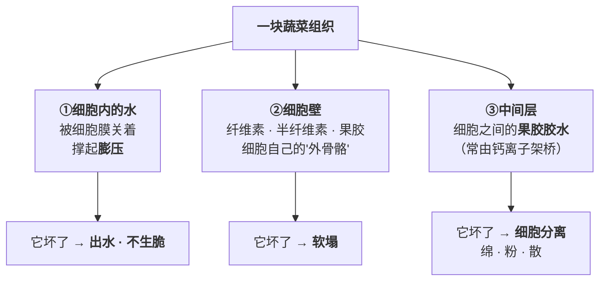

# 第 20 章 蔬菜：细胞、水、叶绿素与"脆和烂"的临界点

> **本章目标**：把蔬菜当成一种**和肉完全不同的材料**来理解。
>
> 肉的关键词是"纤维束 + 结缔组织"，蔬菜的关键词是"**细胞 + 细胞壁 + 把细胞粘在一起的胶水**"。
> 三样东西坏掉的方式不同，对应三种不同的失败。
>
> 这一章回答四个问题：
>
> 1. **"脆"是什么？为什么有一种脆永远回不来？**（第 18 章给了半个答案）
> 2. **"烂"是怎么发生的？**（它是可以被算出来的）
> 3. **炒青菜为什么出水？那些水本来在哪？**
> 4. **发黄到底是什么反应？为什么它是"时间"的函数而不是"火力"的函数？**
>
> 学完这一章你会知道：**蔬菜的四种常见失败——出水、发黄、发苦、烂——
> 走的是四条不同的路，而它们的对策不通用。**

## 20.1 先看材料：蔬菜是三层结构

对照第 16 章的肉：

| | 肉 | 蔬菜 |
|--|----|-----|
| **承力的主结构** | 肌纤维束 + 结缔组织（胶原） | **细胞壁 + 中间层的果胶** |
| **水在哪** | 肌原纤维之间 | **细胞里面**（被膜关着） |
| **加热让它变软的机制** | 胶原转明胶（**要时间**） | 果胶降解（**要温度与 pH**） |
| **加热让它变硬的机制** | 蛋白质收缩失水 | **基本没有**——蔬菜只会越煮越软 |

> ## 本章第一条可迁移规则
>
> **肉有"先变硬再变软"的两段曲线，蔬菜只有单向的一条：越加热越软。**
>
> 所以**蔬菜没有"炖久一点就回来了"这回事**——
> 第 5 章那条"硬肉要给时间"的规则，**在蔬菜上不成立**。
> 蔬菜过头了，就是过头了。

## 20.2 "脆"有两种，"烂"也有两种

### 两种脆

第 18 章已经核到了这条，这里把它讲透：

| 脆的种类 | 物理来源 | 什么时候丢 | 能不能救 |
|---------|---------|----------|---------|
| **生脆**（黄瓜、生菜那种鼓胀的爽脆） | **膨压**：细胞吸满水、把细胞壁撑紧 | **细胞膜在高于约 40 °C 时就破裂** | ❌ **不可逆**。只要你打算加热，它就一定丢 |
| **筋道 / 挺括**（焯过的西兰花、炒过的芦笋） | 细胞壁与中间层**还没垮** | 果胶降解（见下节），主要在 **90 °C 以上**加速 | ✅ **可控**——这是你唯一能管的那一半 |

> **所以"炒出来不脆"这句话必须先问清楚：你说的是哪一种脆？**
> 想要第一种，只能生吃（凉拌、沙拉）；
> 想要第二种，就去管温度、时间与 pH。

### 两种烂

| 烂的种类 | 机制 | 口感 | 典型场景 |
|---------|------|------|---------|
| **细胞分离** | **中间层的果胶胶水化掉了**，细胞们**彼此分开**（每个细胞还是完整的） | **绵、粉、糯、面**（土豆煮粉了就是这个） | 久煮、加碱、**冷冻过的蔬菜** |
| **细胞破裂** | 细胞壁 / 细胞膜**破了**，内容物流出 | **塌、出水、发蔫** | 过度加热、冻伤、机械挤压 |

**一条来自冷冻蔬菜研究的一手描述很能说明问题**：

> 冷冻时细胞间隙先结冰 → 未冻的细胞内渗透压升高 → **水被从细胞里拉出去** →
> 细胞脱水收缩、膨压下降；同时**中间层里钙桥果胶的结构失效**，
> 结果是"**细胞分离而不是细胞破裂**，产生软而粉的质地"。
> 而**膜的完整性一旦丧失，解冻时融化的水就回不去细胞里**——
> 所以冻过的蔬菜"**冻着看还行，一煮就塌**"。

> ## 本章第二条可迁移规则
>
> **冻过的蔬菜，膨压那一档已经预支掉了。**
>
> 所以：
>
> - **冷冻蔬菜不要指望脆**——直接按"已经焯过一次"来安排时间；
> - **不要反复冻融**（温度波动会让冰晶重结晶、破坏加剧）；
> - **绿叶菜基本不适合家庭冷冻**，而豆类、玉米这类结构更结实的相对耐冻。

## 20.3 "烂"是可以算的：β-消除这条曲线

第 8 章已经核到了果胶降解的主反应，这里把它和操作对上：

> **β-消除**切断果胶的糖苷键，**由氢氧根离子催化、发生在非酸性环境中**，
> 速率取决于**温度、pH 与酯化程度**；**在高于约 90 °C 时变得显著**。

把这三个变量拆开看，正好对应厨房里三条老规矩：

| 变量 | 规律 | 厨房里的表现 |
|------|------|------------|
| **温度** | 越高越快，**90 °C 是个明显的台阶** | 沸水里几分钟能做到的事，80 °C 要慢得多 |
| **pH** | **碱催化**；酸性环境里这条反应走不动 | **煮豆放碱容易烂**；**番茄放早了土豆煮不软** |
| **酯化程度** | **脱掉甲酯的果胶更耐 β-消除** | 见下面 PME 那一段 |

### PME：那个"帮倒忙"的酶其实在帮忙

**果胶甲酯酶（PME）**把果胶上的甲酯基脱掉。听起来像是在拆结构，
但结果相反——**脱过甲酯的果胶反而更耐 β-消除**，而且能和**钙离子交联**，
让细胞壁更结实。

工业上因此有一个反直觉的做法：

> **低温长时的预热（LTLT 焯水）可以先激活 PME**，
> 让果胶脱甲酯，**之后再高温处理时组织反而更挺**；
> 若再补钙，交联更强、硬度更高。
> 这在薯条生产里是实打实的工艺。

> ⚠️ **家庭版这条本书不给操作参数**。
> 已核到的是**工业链条**（土豆条、控温水槽、可加钙），
> 而家庭里"先用温水泡一会儿再煮"是否有同样效果，**本书未核到对照**。
> 正文只写**机制存在**，把它登记为缺口。

### 一条能用的分档（转引）

低温慢煮蔬菜的综述给了一个粗分档：

- **含淀粉的蔬菜**宜用**低于约 80 °C**处理（避开淀粉糊化带来的质地变化）；
- **非淀粉类蔬菜**的推荐区间约 **82~85 °C**。

⚠️ 这是**综述里的转引**（原出处为低温慢煮的专业著作），
且针对的是**真空低温慢煮**，不是炒锅。本书只用它说明一件事：

> **"烂"的开关不在 100 °C，而在更低的地方。**
> 你以为"只是在煮"，其实已经在快速降解果胶了。

## 20.4 出水：那些水本来在哪

炒青菜出的那一摊水，**几乎全部来自细胞内部**。

三个可控的旋钮：

| 旋钮 | 机制 | 出处状态 |
|------|------|---------|
| **温度与时间** | 膜破裂是温度的函数；待得越久放出来越多 | ✅ 已核 |
| **盐** | **加盐造成渗透失衡，水分流失更多、水溶性成分损失更大** | ✅ 已核（第 3、18 章，焯水语境） |
| **切得多大** | **表面积／体积比**：10 mm 的方块大约是 20 mm 方块的**两倍**，暴露面更大、扩散距离更短，失水更快 | ✅ 已核（西葫芦研究） |

> ## 本章第三条可迁移规则
>
> **出水不是"没炒好"，出水是"细胞被打开了"——它一定会发生，你能管的只有速度。**
>
> 所以对付出水的三条有效动作是：
>
> 1. **让水走得比出得快**——火要够、锅面积要够、**一次别下太多**
>    （第 7 章已核：家用灶通常最高约 2.5 kW，一次约能褐变 800 g 肉；
>    餐馆灶约 8 kW，能力差三倍以上）；
> 2. **盐晚一点放**——盐会把渗透那条通道也打开；
> 3. **别切太碎**——碎了表面积大，出水更快（但熟得也快，自己权衡）。
>
> ⚠️ **诚实说明**：本书**未核到**"盐的时机对炒青菜出水量影响"的家庭尺度对照实验。
> 已核到的是**焯水语境下加盐使水分与水溶性成分损失更大**，
> 以及第 15 章那项水煮鸡研究——**加盐时机对咸度感受没有显著差别**（但那测的是咸度，不是出水）。
> 所以"盐晚放"在本书里是**机制方向 + 惯例**，不是实验结论。

## 20.5 颜色：绿变黄是一条只跟时间走的曲线

### 化学身份

> **叶绿素失去卟啉环中心的镁离子 → 脱镁叶绿素**，颜色由鲜绿变成**橄榄褐**。

推动它的有两条路：

1. **酸催化失镁**——加热让细胞里的蛋白凝固、结构破坏，
   **叶绿素被暴露在植物组织自身的有机酸里**；
2. **酶催化**（Mg-脱螯合酶等）——冷冻蔬菜研究里写得很清楚：
   **在 −18~−20 °C 的商业冻藏条件下，酶促的叶绿素分解仍在缓慢进行**。

所以：

> ## 本章第四条可迁移规则
>
> **发黄几乎只跟"在热里待了多久"有关，跟"火多大"关系不大。**
>
> 因为它需要的是**累积**（第 1 章的"时间"那条线）：
> 结构破坏 → 酸接触到叶绿素 → 一点点失镁。
>
> 这解释了两个常见现象：
>
> - **大火快炒的青菜更绿**——不是火大"锁住"了颜色，是**总时间短**；
> - **做好了放在锅里等上菜，会继续变黄**——余温还在走那条曲线。

### 两个必须分开的现象

| 现象 | 指标 | 机制 | 本书判定 |
|------|------|------|---------|
| **焯完立刻变得更绿** | a\* 更负 | **不是"锁色"**：细胞破裂使叶绿素外泄到细胞间隙 + 排掉了细胞间隙与表面绒毛里的空气，改变了光反射 | ⚠️ 单项研究的机制解释（第 18 章） |
| **时间久了发黄** | b\* 上升 | **脱镁叶绿素** | ✅ 机制已核 |

**它们是两条不同的曲线，会同时进行**——所以你会看到"先更绿、再发黄"。

### 一条已核到的、能减慢它的条件

低温慢煮蔬菜的综述指出：
**在限氧、且没有液态水接触的条件下，叶绿素向脱镁叶绿素的转化更少。**

这和第 18 章"蒸优于焯"的结论是同一个方向。

### 两条本书仍然不写的

| 说法 | 状态 |
|------|------|
| **"盖盖子会让青菜发黄"**（挥发性酸积聚说） | ⚠️ **自第 8 章登记以来未核到任何直接对照**。机制方向一致（酸催化失镁 + 盖住不让酸跑掉），但**没有实验**。本书标为机制推理 |
| **"焯水加油/加盐能保绿"** | ⚠️ **未核到任何支持证据**；且加盐有已核到的反向代价（水分与水溶性成分损失更大）。见第 18 章 |

## 20.6 同一把菜，几种做法的一手对照

本书目前核到了两组干净的蔬菜对照。把它们放在一起，能看出一条统一的解释。

### 对照一：西兰花，热水焯 vs 蒸汽焯（第 18 章）

| 指标 | 热水 98 °C | 蒸汽 100 °C |
|------|-----------|------------|
| 30 秒后的硬度 | **30.58 N** | **39.57 N** |
| 灭酶所需时间 | 120 秒 | **90 秒**（更快） |
| 颜色偏离 ΔE | 更大 | 更小 |
| 回热异味相关的戊醛 | 随时间明显升高 | 60 秒组明显更低 |

### 对照二：西葫芦，生 vs 炒 vs 蒸

（10 mm 与 20 mm 两种切块；炒用橄榄油 250 °C、8~11 分钟；蒸 100 °C 全湿度、13~17 分钟）

| 指标 | 生 | **炒** | **蒸** |
|------|----|-------|-------|
| **硬度** | **49500 g** | **20370 g** | **10756 g**（最软） |
| **黏性** | 1016.68 mJ | 48.02 mJ | 63.83 mJ |
| **干物质 / 灰分 / 蛋白 / 脂肪** | — | **显著上升** | 与生样无显著差别 |
| **抗氧化能力** | 13.40 | **39.77**（20 mm） | 19.66（20 mm） |
| **外观 / 颜色 / 气味 / 质地的感官评分** | — | 较低 | **最高** |
| **总体接受度** | — | 无显著差别 | 无显著差别 |

⚠️ 注意：**两次对照的"蒸"站在不同的位置**——
对西兰花，蒸**比焯水更能保住硬度**；对西葫芦，蒸**比炒更软**。
这不矛盾，因为**比较对象不同**，而且西葫芦那组的**蒸比炒多花了 5~6 分钟**。

统一的解释是两条变量：

> ## 本章第五条可迁移规则
>
> **决定蔬菜质地的两个变量是：①有没有液态水泡着；②表面有没有迅速脱干。**
>
> | 做法 | ①液态水 | ②表面脱干 | 结果 |
> |------|--------|----------|------|
> | **水煮 / 焯水** | **有** | 无 | 溶出多、软化最快 |
> | **蒸** | 无 | 无 | 溶出少，但软化仍按时间走 |
> | **炒 / 煎** | 无 | **有**（表面快速失水限制内部水迁移） | **最能保住硬度**；但会吸油、会褐变 |
>
> 西葫芦那项研究对"炒更硬"给的解释正是**表面快速脱水限制了内部水分迁移**；
> 而炒的**干物质、灰分、蛋白、脂肪上升**也有两个原因：
> **没有水所以水溶性成分流失少**，以及**表层脱水后油渗进去**（油同时是传热介质）。
> 抗氧化能力上升还有第三个原因：**橄榄油自带的生育酚、角鲨烯等被带进了菜里**。

⚠️ 最后这条**要小心**：那项研究里"炒"用的是 1000 g 西葫芦配 **64 g 特级初榨橄榄油**。
**"炒的菜抗氧化能力更高"里有相当一部分是油带来的**，
不是蔬菜自己变好了。本书**不做任何营养推论**。

## 20.7 发苦与发涩：本书能说到哪一步

这是蔬菜一侧证据最薄的一格，必须把话说清楚。

**能说的**：

- **十字花科（西兰花、芥蓝、芥菜）的特征风味来自含硫化合物**——
  芥子油苷与 S-甲基-L-半胱氨酸亚砜在受热时降解，
  生成**二甲基二硫、二甲基三硫**等（一手，西兰花焯烫研究）；
  这些既是"香"也是"冲"，取决于量；
- **酶促褐变的产物（醌类、黑色素）与多酚**跟**涩**有关——
  第 9、13 章已核：**富含脯氨酸的唾液蛋白沉淀多酚，造成润滑感丧失（涩）**；
- **过度加热会产生焦糊味并盖住本味**（第 19 章的斯特雷克降解那一段）。

**说不了的**：

> ⚠️ **"苦味随烹饪怎么变、焯水能去掉多少苦/涩/草酸"——本书未核到任何定量数据。**
>
> 能确定的只有"**水溶性成分会迁移到水里**"这一条方向（第 3 章）。
> **具体去掉多少，本书不给数字**，已登记为缺口。

**能给的只有一条操作性判据**（惯例 + 机制）：

> 苦与涩**在口腔里持续时间长**（第 9、15 章：味觉适应与残留），
> 所以它们最容易被**脂肪**和**甜**压住——
> 这就是"苦瓜配鸡蛋""芥蓝要用油走一遍"这类做法流行的原因。
> ⚠️ **这是机制推理 + 惯例，不是实验结论。**

## 20.8 把四种失败合成一张排查表

| 失败现象 | 走的是哪条路 | 主要原因 | 对策 | 证据状态 |
|---------|-----------|---------|------|---------|
| **出水，变成水煮** | 细胞膜破裂 + 渗透 | 高于约 40 °C 膜就破；盐加速；锅的功率不够、一次下太多 | 火够 + 分批 + 盐晚放 + 别切太碎 | ✅ 膜破裂与渗透已核；⚠️ **"盐晚放"是机制 + 惯例** |
| **发黄** | 叶绿素 → 脱镁叶绿素 | **在热里待的总时间**（酸催化失镁），余温也算 | 缩短总时间、别在锅里等、限氧少水（蒸） | ✅ 机制已核；⚠️ **"盖盖子致黄"未核到对照** |
| **烂 / 绵 / 粉** | 果胶 β-消除 → **细胞分离** | 温度（>90 °C 加速）、碱性、时间 | 降温、缩时、酸性环境（番茄/醋最后放会更不容易烂） | ✅ 机制已核；⚠️ **家庭尺度的 LTLT/补钙未核** |
| **发苦 / 发涩** | 含硫物降解 + 多酚 | 品种与部位为主；过度加热会加剧焦糊味 | 焯（能带走一部分水溶物）、配脂肪与甜 | ⚠️ **定量全部未核**，本书不给数字 |
| **冻过就塌** | 冰晶 → 膨压预支 + 中间层失效 | 细胞脱水 + 钙桥果胶结构失效 + 膜不可逆损伤 | 按"已焯过一次"安排时间；别反复冻融 | ✅ 机制已核（综述） |

> ## 本章最后一条规则
>
> **蔬菜的四种失败要分开诊断，因为它们的时间常数不一样。**
>
> - **出水**是**秒级**的（膜一破就出）；
> - **发黄**是**分钟级累积**的；
> - **烂**是**温度 + 时间**共同决定的；
> - **发苦**多半在你买菜的时候就决定了。
>
> 所以当你说"这盘菜炒失败了"，**先问是哪一种失败**——
> 这和第 17 章"三种不嫩"、第 19 章"三种腥"是同一种思维。

## 20.9 常见说法辨析

按本书约定标注**证据强度**：✅ 有共识 / ⚠️ 有争议 / ❌ 明确错误 / 缺乏证据。
来源见[出处登记](../../standards.md)。

| 说法 | 判定 | 说明 |
|------|------|------|
| "大火快炒能锁住水分" | ❌ **锁不住，只是来不及出来** | 细胞膜在高于约 40 °C 时就破裂，水一定会被放出来。大火快炒真正做到的是**缩短总时间**并让**水以蒸汽的形式走掉**，而不是留在菜里 |
| "青菜发黄是火太大" | ❌ **主要是时间** | 发黄的化学身份是**脱镁叶绿素**（叶绿素在酸催化下失镁），它依赖**累积**。所以大火快炒反而更绿（总时间短），而做好了在锅里等会继续变黄（余温） |
| "焯过的青菜更绿，说明锁住了叶绿素" | ⚠️ **现象成立，机制不是"锁"** | 一手测量：焯后 a\* 更负（更绿）。研究给的解释是**细胞破裂使叶绿素外泄**与**排掉细胞间隙与表面绒毛中的空气改变光反射**。⚠️ 单项研究、机制解释 |
| "盖盖子炒青菜会发黄" | ⚠️ **机制方向一致，无对照证据** | 自第 8 章登记以来**未核到任何直接对照实验**。可核到的是"酸催化失镁"与"加热时叶绿素暴露于组织自身的酸"，**盖住不让酸挥发**在机制上说得通，但**没有实验** |
| "蔬菜炖久一点会重新变软变好吃" | ⚠️ **只有"更软"，没有"回来"** | 蔬菜没有肉那条"先硬后软"的曲线。加热对蔬菜是**单向软化**（果胶 β-消除 + 膨压丧失）。"炖久一点就好了"来自肉（胶原需要时间，第 5 章），**不能搬到蔬菜上** |
| "煮豆子放点碱容易烂" | ✅ **机制清楚** | **β-消除由氢氧根离子催化、发生在非酸性环境**，速率取决于温度、pH 与酯化程度。碱性 = 这条反应的催化剂。⚠️ 代价：碱同时加速叶绿素以外的多种降解，且会带来碱味（第 8 章） |
| "番茄放早了土豆煮不软" | ✅ **同一条规律的反面** | 酸性环境里 β-消除走不动，中间层的果胶不容易溶解，所以细胞不分离、质地保持。这不是"玄学"，是同一个反应的 pH 依赖 |
| "冷冻的青菜炒出来一样脆" | ❌ **膨压已经预支掉了** | 冷冻时细胞间隙先结冰、把细胞内的水拉出去，膨压下降；**中间层钙桥果胶结构失效**导致**细胞分离而非破裂**（软而粉）；**膜损伤不可逆，解冻时水回不去细胞**。冻藏中酶促软化仍在继续（残留 PME/PG/β-半乳糖苷酶） |
| "炒比蒸更伤蔬菜" | ⚠️ **要看你在意哪一项** | 一手对照（西葫芦）：硬度 生 **49500 g** ＞ **炒 20370 g** ＞ **蒸 10756 g**——**炒反而更硬**（作者归因于表面快速脱水限制内部水分迁移）；炒的干物质、灰分、蛋白、脂肪与抗氧化能力显著上升。但**感官上蒸的外观/颜色/气味/质地评分更高**，⚠️ **总体接受度两者无显著差别**。⚠️ 另外那组的蒸比炒多花了 5~6 分钟 |
| "炒的菜比蒸的更有营养" | ⚠️ **有一部分是油带来的** | 同一研究中炒组抗氧化能力最高（39.77 vs 蒸 19.66 vs 生 13.40 mg AA/g 干重），但作者明确指出**橄榄油自带的生育酚、角鲨烯等被带进了菜里**；且 1000 g 菜配了 **64 g 油**。**本书不做任何营养推论** |
| "切小一点熟得快所以更好" | ⚠️ **同时也更容易出水** | **表面积／体积比**：10 mm 方块约为 20 mm 方块的**两倍**。暴露面大、扩散距离短——熟得快，**失水也快**。一手研究中小块的感官外观/颜色/质地评分更高，但那是另一件事 |
| "焯水能去掉蔬菜的苦味和草酸" | 缺乏证据（本书不写比例） | 能确定的只有"**水溶性成分会迁移到水里**"这一方向。**具体去掉多少，本书未核到任何家庭尺度的定量数据**，不给数字 |
| "低温先煮一会儿再大火，菜会更挺" | ⚠️ **工业上成立，家庭未核** | 机制真实：**低温长时可激活 PME**，脱甲酯的果胶更耐 β-消除、还能与钙交联增强细胞壁——这在**薯条工业**里是成熟工艺。但**家庭尺度的对照本书未核到**，且需要控温与（常常）补钙 |

## 20.10 🔎 下次做菜时的用处

1. **先问是哪一种失败**：出水、发黄、烂、发苦——四条不同的路。
2. **"生脆"只能生吃**——一旦加热到 40 °C 以上就回不来了。别再追求它。
3. **出水一定会发生**，你能管的是速度：火够、分批、盐晚放、别切太碎。
4. **发黄看总时间，不看火力**——做好了就装盘，别在锅里等。
5. **蔬菜没有"炖久一点就好了"**——那条规则属于肉。
6. **想让它不烂：降温、缩时、别加碱、酸性的东西可以早放**（番茄、醋）。
7. **想让它快烂：升温、加碱**（代价是碱味与颜色）。
8. **冻过的蔬菜按"已经焯过一次"来安排时间**，别指望脆。
9. **"炒比蒸更软"未必成立**——一手数据里炒反而更硬，因为表面迅速脱干了。
10. **蒸是"少溶出"的做法，不是"温度低"的做法**（第 18 章）。

## 20.11 思考题

1. 蔬菜的三层结构分别是什么？它们坏掉分别对应哪种口感失败？
2. 为什么说"蔬菜只有单向软化这一条曲线"？这条结论如何限制第 5 章那条规则的适用范围？
3. "脆"的两种分别来自什么？为什么其中一种一定丢？
4. "烂"的两种（细胞分离 / 细胞破裂）机制与口感各是什么？冻过的蔬菜属于哪一种？
5. β-消除的三个变量是什么？分别对应厨房里的哪条老规矩？
6. 为什么说"发黄跟火力关系不大"？请用本章的机制解释"大火快炒更绿"和"在锅里等会变黄"。
7. **【案例】** 你打算做一道**清炒荷兰豆**，家里是普通家用灶、一口 28 cm 的炒锅，
   买了 500 g 荷兰豆。
   （a）按本章，这道菜最可能出现哪两种失败？各自的机制是什么？
   （b）你会怎么安排：焯不焯、切不切、火多大、盐什么时候放、一次下多少？
   （c）每一条决定，请标明它是"已核证据"还是"机制推理/惯例"；
   （d）如果换成**冷冻豌豆**，方案要改哪几条？为什么？
8. **【案例】** 你做了一锅"土豆炖豆角"，结果**土豆还是硬的，豆角已经烂了**。
   （a）解释这两个现象各自的机制；
   （b）如果你在锅里加了番茄，它会让哪一个更严重？
   （c）列出至少三种改法，并排出你会先试哪一个、为什么。
9. **【辨析】** "大火快炒能锁住水分"——判断证据强度，
   说明"锁住"这个词错在哪，以及大火快炒**实际上**做对了什么。
10. **【辨析】** "炒的菜比蒸的更有营养"——一手数据说了什么？
    本书为什么**只复述数据而不下营养结论**？
11. 本章的"四种失败时间常数不同"是什么意思？举一个它能帮你少犯的错。

> 📖 **参考答案**（想清楚再看）：[Q1](../../qa/20-vegetables-qa.md#q1) ·
> [Q2](../../qa/20-vegetables-qa.md#q2) · [Q3](../../qa/20-vegetables-qa.md#q3) ·
> [Q4](../../qa/20-vegetables-qa.md#q4) · [Q5](../../qa/20-vegetables-qa.md#q5) ·
> [Q6](../../qa/20-vegetables-qa.md#q6) · [Q7](../../qa/20-vegetables-qa.md#q7) ·
> [Q8](../../qa/20-vegetables-qa.md#q8) · [Q9](../../qa/20-vegetables-qa.md#q9) ·
> [Q10](../../qa/20-vegetables-qa.md#q10) · [Q11](../../qa/20-vegetables-qa.md#q11)

## 20.12 本章实操

### 🅐 零成本版 · 任务一：给冰箱里的蔬菜做一张"结构分类表"

打开冰箱，把现有的蔬菜按**结构**而不是按菜名分类。

| 蔬菜 | 主要靠什么撑着（膨压为主 / 细胞壁为主 / 含淀粉） | 生吃脆不脆 | 煮久了是"绵粉"还是"塌烂" | 我通常怎么做 | 按本章该怎么做 |
|------|------------------------------------|----------|--------------------|------------|------------|
| 黄瓜 | | | | | |
| 西兰花 | | | | | |
| 土豆 | | | | | |
| 菠菜 | | | | | |
| 豆角 | | | | | |
| | | | | | |

做完回答：

1. 哪几样是**"膨压型"**（靠细胞里的水撑着）？它们适合加热吗？
2. 哪几样久煮会变成**"绵粉"**（细胞分离）？这和"塌烂"有什么不同？

### 🅐 零成本版 · 任务二：把四种失败与自己的经历对上

| 我遇到过的失败 | 现象描述 | 属于哪一种（出水/发黄/烂/苦涩/冻塌） | 机制是什么 | 我当时的解释 | 正确的解释 |
|-------------|---------|----------------------------|----------|------------|----------|
| | | | | | |
| | | | | | |
| | | | | | |

做完回答：有几次你把**发黄**归因成了"火太大"？（本章：它主要跟**时间**走。）

### 🅐 零成本版 · 任务三：用一杯凉水观察膨压

**不用开火。** 取两片有点发蔫的生菜（或芹菜、白菜帮）：

| 组 | 处理 | 半小时后的硬挺程度 | 掰一下的声音 |
|----|------|----------------|------------|
| ① | 放在盘子上（对照） | | |
| ② | **泡在凉水里** | | |

做完回答：

1. ②为什么会"活过来"？（提示：细胞重新吸水、膨压恢复）
2. 如果把②**烫一下**，还能靠泡水恢复吗？为什么不能？
   （提示：细胞膜在高于约 40 °C 时破裂，**这一步不可逆**）
3. 这个实验说明"新鲜"与"脆"之间是什么关系？

### 🅑 开火版 · 任务四：pH 对"烂"的对照（有灶台时做）

**这是本章最能看出差别的实验，而且很安全。**

**需要**：同一种较耐煮的蔬菜（豆角、白萝卜、土豆都行）分三份、白醋、小苏打、三口小锅。
**关键**：**三锅的水量、火力、时间必须一样**。

| 组 | 水里加了什么 | 5 分钟后戳一下 | 10 分钟后 | 颜色 | 味道有没有异常 |
|----|-----------|------------|---------|------|------------|
| ① | **什么都不加**（对照） | | | | |
| ② | **一点白醋** | | | | |
| ③ | **一点小苏打** | | | | |

做完回答：

1. 哪一组最快烂？这对应 β-消除的哪个变量？
2. ③有没有出现**颜色或味道的代价**？（第 8 章：碱会带来碱味、并影响颜色）
3. 这个结果怎么解释"番茄放早了土豆煮不软"？
4. ⚠️ 这次结果**算不算验证**？（单次、目测、无重复——不算。但机制是已核到的。）

### 🅑 开火版 · 任务五：出水的三组对照

**需要**：同一把绿叶菜分三份、同一口锅、计时器。

| 组 | 处理 | 锅里积水多少（目测/倒出来量） | 颜色 | 口感 | 总体 |
|----|------|------------------------|------|------|------|
| ① | **一次全下**，盐一开始放 | | | | |
| ② | **一次全下**，盐最后放 | | | | |
| ③ | **分两批下**，盐最后放 | | | | |

做完回答：

1. 哪一组积水最少？哪一组最绿？
2. **分批**和**盐的时机**，哪个影响更大？
3. ⚠️ 本书说"盐晚放"只是**机制方向 + 惯例**（家庭尺度的对照未核到）。
   你这次的结果**能不能**当成验证？为什么不能？

### 🅑 开火版 · 任务六：蒸 vs 炒 vs 焯的三方对照

**需要**：同一种蔬菜（西兰花或西葫芦最接近文献体系）分三份、蒸屉、炒锅、一锅水。
**关键**：**尽量让三组"熟到差不多的程度"**，而不是时间相同——
因为这三种做法的传热速度差很多（第 18 章：水约 1000、热风约 100 W/(m²·K) 量级）。

| 组 | 做法 | 用了多久 | 硬挺程度（0~10） | 颜色 | 味道浓淡 | 出水/吸油 | 总体 |
|----|------|--------|--------------|------|---------|---------|------|
| ① | **焯水** | | | | | | |
| ② | **蒸** | | | | | | |
| ③ | **炒** | | | | | | |

做完回答：

1. 哪一组最硬挺？和一手数据的方向一致吗？
   （西葫芦研究：生 49500 g ＞ 炒 20370 g ＞ 蒸 10756 g）
2. 哪一组**味道最淡**？对应本章/第 18 章的哪条代价？
3. ③吸了多少油？这对"炒的菜更有营养"那条说法意味着什么？
4. 如果你只能保留一种做法给这样菜，你选哪个？**理由要写成"我更在意哪一项"**。

> ⚠️ **安全提醒**：开水与热油都会造成严重烫伤，下料贴近水面/油面、锅柄朝内。
> 小苏打组**不要反复尝**（碱性液体刺激口腔）；尝味一律**放凉、少量**。
> 生熟分开；蔬菜与生肉的砧板分开（交叉污染）。
> 冷冻蔬菜（甜玉米、豌豆等）**需彻底加热后再食用**（英国 FSA 口径）。
> 剩余食物在烹调后 **2 小时内**冷藏（高于 90 °F 时 1 小时，美国 FDA 口径）。
> **各国口径不同，以本地现行发布为准。**

## 20.13 本章依据

本章引用的来源与核对状态详见[参考书目与出处登记](../../standards.md)，具体对应如下：

| 本章用到的内容 | 依据 |
|--------------|------|
| **膨压丧失不可逆**：细胞膜在**高于约 40 °C 时即破裂**，因此膨压损失"或多或少不可避免"；**果胶溶解由 β-消除造成、在高于约 90 °C 时显著**；**PME 脱甲酯后的果胶更耐 β-消除**；焯水时**浸出量与等效时间高度相关（r² ≈ 0.9）**；**热水浴换热系数拟合约 1000 W/(m²·K)** | 一项关于青豆角焯水过程中酶失活与品质变化建模的研究，*Current Research in Food Science*，2026（PMC13217498），✅（第 18 章已登记）。⚠️ 建模研究 + 单一作物；论文披露作者之一受雇于部分资助方 |
| **β-消除由氢氧根离子催化、发生在非酸性环境**，速率取决于温度、pH 与酯化程度；软化还得益于**细胞壁破坏与中间层减少导致的细胞分离**；**加热使蛋白凝固时叶绿素暴露于植物组织自身的酸**而转成**脱镁叶绿素**，**限氧、无液态水接触时这种转化更少**；**含淀粉蔬菜宜用低于约 80 °C 处理、非淀粉类推荐约 82~85 °C**（转引 Baldwin） | 一篇关于低温慢煮对蔬菜品质影响的综述，*Foods*，2026（PMC12840460），✅（第 8、18 章已登记）。⚠️ 分档为**综述转引**，且针对**真空低温慢煮**，不是炒锅 |
| **冷冻蔬菜的质地与颜色劣化机制**：细胞间隙先成冰 → 未冻相渗透压升高 → **水从细胞内流出、细胞脱水收缩、膨压下降**；**膜完整性丧失后解冻时水无法被重新吸回**，导致滴水损失与组织松软（"冻着看还行、一煮就塌"）；**中间层中钙桥果胶的结构失效导致细胞分离而非细胞破裂，产生软而粉的质地**；**残留 PME、聚半乳糖醛酸酶与 β-半乳糖苷酶在冻藏期继续弱化细胞壁**（工业焯水很少能完全灭酶）；**冷浓缩效应使酶与底物更接近**；**叶绿素经 Mg-脱螯合作用生成脱镁叶绿素**并进一步降解，**在 −18~−20 °C 的商业冻藏条件下酶促分解仍在缓慢进行**；软化常按一级或 Weibull 动力学描述，报道的软化速率常数 k 约 **0.015~0.035 /月** | 一篇关于冷冻热带蔬菜颜色与质地稳定性机制的综述，*Food Science & Nutrition*，2026（PMC13239076），✅ 开放获取全文。⚠️ **综述，多为转引**；⚠️ 语境为**热带蔬菜的工业冷冻与冷链**，k 值随品种与条件差别很大，本书**只用机制与方向** |
| **切块尺寸与做法对西葫芦的影响**：10 mm 与 20 mm 立方，**炒**（1000 g 配 64 g 特级初榨橄榄油、250 °C、8~11 分钟）vs **蒸**（100 °C 全湿度、13~17 分钟）vs 生。**质地**：硬度 生 **49500 g** ＞ 炒 **20370 g** ＞ 蒸 **10756 g**；黏性 生 **1016.68 mJ** ＞ 蒸 63.83 ＞ 炒 48.02；**切块尺寸不显著影响硬度**（但影响生样的黏性）。**成分**：**炒使干物质、灰分、蛋白与脂肪显著上升**，蒸与生样无显著差别；作者归因为**炒不用水因而水溶性成分损失少**、以及**表层脱水后油渗入**。**抗氧化能力**：生 13.40、蒸（20 mm）19.66、**炒（20 mm）39.77 mg 抗坏血酸当量/g 干重**；作者明确指出炒组的上升部分来自**橄榄油自带的生育酚、角鲨烯与燕麦甾醇**。**几何**：10 mm 立方的**表面积／体积比约为 20 mm 的两倍**。**感官**：蒸在外观、颜色、气味、质地上评分最高，小块评分高于大块，⚠️ **但总体接受度各处理间无显著差别** | 一项关于切块尺寸与烹饪方式对西葫芦营养与感官影响的研究，*Foods*，2025（PMC12469137），✅ 开放获取全文。⚠️ **单一作物、单一产地**；⚠️ 蒸与炒的**时间不同**（蒸多 5~6 分钟），不是严格的等熟度对照；⚠️ 抗氧化能力用 DPPH 表达，**本书不做任何营养推论** |
| **水焯 vs 汽蒸的一手对照**（硬度 30.58 N vs 39.57 N、灭酶 120 s vs 90 s、ΔE、戊醛、焯后 a\* 更负的两种解释） | 一项关于蒸汽与热水焯烫调控西兰花回热异味的研究，*Foods*，2026（PMC13298270），✅（第 18 章已登记） |
| **十字花科含硫风味物**：**芥子油苷与 S-甲基-L-半胱氨酸亚砜受热降解生成二甲基二硫与二甲基三硫**（萝卜硫素在 100 °C 水溶液中热降解亦生成二甲基二硫；S-甲基甲烷硫代亚磺酸酯在 80~200 °C 分解） | 同上（PMC13298270），✅ |
| **工业上低温长时焯水可激活 PME**，脱甲酯后的果胶更耐降解、并可与钙交联增强细胞壁；**PPO 失活发生在约 80~100 °C**；焯水时可溶营养会浸出 | 一篇关于工业规模薯条质地成因的综述，*Current Research in Food Science*，2024（PMC10909613），✅（第 18 章已登记）。⚠️ **工业语境**，家庭尺度未核 |
| **加盐造成渗透失衡使水分流失更多、水溶性成分损失更大**；**蒸没有液态水、不允许抗坏血酸浸出**；焯水 90 °C/15 分钟的抗坏血酸损失量级 | 一篇关于热处理对果蔬成分影响的综述，*Comprehensive Reviews in Food Science and Food Safety*，2024（PMC11605278），✅（第 3 章已登记）。⚠️ 综述转引 |
| **酶促褐变与 PPO**；**多酚沉淀唾液蛋白造成涩**；**家用灶功率约 2.5 kW / 一次约 800 g 的量级**；**爆炒时食材平均表面温度低于 100 °C** | 酶促褐变综述（PMC7355983）与分子美食学综述（PMC2855180），✅（第 7、9 章已登记） |
| **冷冻蔬菜需彻底加热后食用**；**2 小时规则**；**生熟分开** | 英国 FSA「Cooking your food」与美国 FDA / CDC 食品安全页面，✅。⚠️ **各国口径不同，以本地现行发布为准** |
| **"盖盖子致青菜发黄"的直接对照**；**"焯水加油/加盐保绿"的支持证据**；**焯水去除苦味/涩味/草酸的定量**；**家庭尺度"盐的时机对出水量"的对照**；**家庭版 LTLT 预热让蔬菜更挺的对照** | ⚠️ **均未核到**。正文分别标为"机制推理""缺乏证据""本书不给数字""机制 + 惯例""工业成立、家庭未核"，并已登记在[出处登记](../../standards.md)的缺口清单 |

[^1]: [膨压](../../glossary.md#turgor)（turgor）与[果胶与 β-消除](../../glossary.md#pectin)。
[^2]: [细胞分离与细胞破裂](../../glossary.md#cell-separation)（cell separation / cell rupture）。
[^3]: [脱镁叶绿素](../../glossary.md#pheophytin)（pheophytin）与[POD / LOX / PME](../../glossary.md#pod-lox-pme)。

---

**下一章**：第 21 章 蛋与奶——最敏感的两种蛋白质。
那一章会把"窗口很窄的食材该怎么办"讲成一套通用对策，
并正面回答一个第 4 章就留下的问题：
**为什么蛋的"凝固温度"在不同资料里差了近 20 °C，而两个数字都没错。**
