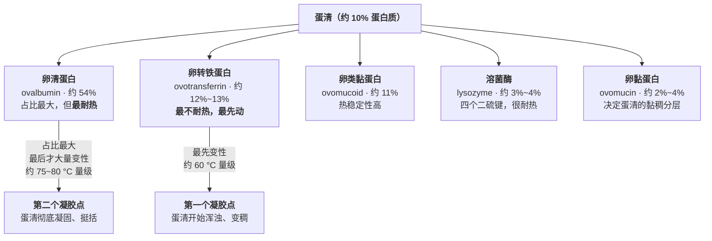
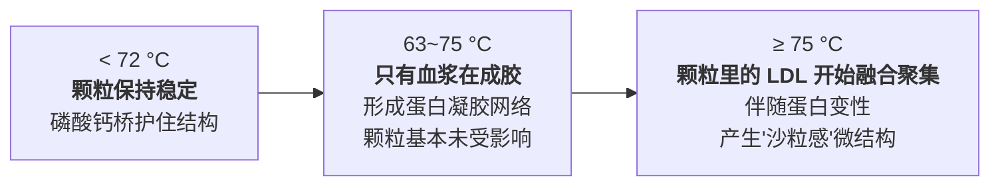
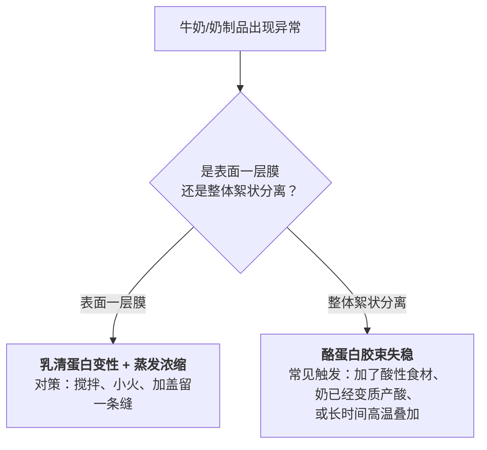

# 第 21 章 蛋与奶：最敏感的两种蛋白质

> **本章目标**：正面回答第 4 章留下的一个问题——
> **为什么"蛋白质在 X °C 凝固"这种数字，在不同资料里能差出 20 °C，而两个数字可能都没错？**
>
> 答案在这一章揭晓：**因为蛋清根本不是"一种蛋白"，它是好几种变性温度彼此差了
> 20 °C 以上的蛋白质混在一起**；蛋黄也不是均质的，它分成**先动的血浆**和
> **靠矿物质桥撑住、后动的颗粒**两部分。牛奶同样是两类蛋白的混合物，
> 但它们的"脾气"差得更极端——一类对热几乎无动于衷，另一类低温就开始变。
>
> 这一章回答四个问题：
>
> 1. **蛋清的"凝固温度"到底是哪个温度？**（答案：不止一个）
> 2. **为什么温泉蛋能做到"蛋黄已经半凝固、蛋清还是流动的"？**（利用的正是上面那个结构）
> 3. **牛奶煮沸时"结皮"和"结块"是不是同一件事？**（不是，动的是不同的蛋白）
> 4. **窄窗口食材的通用对策，到了蛋和奶身上具体怎么落地？**（第 4 章给过框架，这里给细节）

## 21.1 蛋清不是"一种蛋白"，是一个蛋白质家族[^3]

先纠正一个默认假设：当你说"蛋清凝固了"，你以为是一种物质在发生一个单一的
相变（像水结冰），但实际上蛋清是**至少五种蛋白质**的混合物，它们各自有各自的
变性温度，而且这些温度**彼此差了 20 °C 以上**。

一项用差示扫描量热法（DSC）与流变学同时测量蛋清热行为的研究，
在 pH 7.5 的纯蛋清体系（10% 蛋白质、水溶液、0.5 °C/min 升温）里测到：

| 蛋白质 | DSC 变性峰温度 |
|--------|---------------|
| 卵转铁蛋白（conalbumin / ovotransferrin） | **61.1 °C** |
| 卵清蛋白（ovalbumin） | **76.7 °C** |
| S-卵清蛋白（更耐热的卵清蛋白变体） | **83.5 °C** |

同一项研究用流变仪测的"凝胶点"（储能模量开始陡升的温度）出现了**两个**：
**59.3 °C** 与 **75.4 °C**——分别对应最不耐热的卵转铁蛋白先聚集成网、
和占比最大的卵清蛋白后聚集成网。pH 升到 9.0（接近新鲜蛋清的天然 pH）时，
两个峰分别移到约 58.8 °C 与 75.2 °C，位置基本不变，但该研究同时测到
**溶菌酶在 pH 9.0 下有独立可辨的峰，约 69.5 °C**——换句话说，
蛋清里至少排布着"**60 °C 附近一个、70 °C 附近一个、75~80 °C 又一个**"
这样三层变性温度，而不是一个点。

> ## 第一条可迁移规则：问"凝固温度"之前，先问"哪个凝固"
>
> **"蛋清在多少度凝固"这个问题本身就问错了**——蛋清不是一种物质。
> 你看到的"开始变浑浊"，是**最不耐热的卵转铁蛋白先动了**（约 60 °C 量级）；
> 你看到的"彻底凝固、挺括不流动"，要等**占比最大的卵清蛋白也大量变性**
> （约 75~80 °C 量级）。这两个温度之间差了将近 20 °C，
> **全都是"蛋清在变化"，只是变化的是不同的蛋白质、程度也不同**。
>
> 这也正面回答了第 4 章留下的疑问：为什么"蛋白质在 62 °C 凝固"这类说法在
> 不同资料里能差出 20 °C 而两个数字都"没错"——**它们测的根本不是同一种蛋白**，
> 或者不是同一个阶段（"开始变化" vs "彻底凝固"）。

## 21.2 蛋黄也不是均质的：血浆先动，颗粒后动[^4]

蛋黄同样不是一锅均匀的糊，用离心可以把它分成两部分：

| 部分 | 占蛋黄干物质比例 | 主要成分 | 受热表现 |
|------|----------------|---------|---------|
| **血浆（plasma）** | 约 75%~81% | 低密度脂蛋白（LDL）、卵黄球蛋白 | **先成胶**，温度较低时就开始凝结 |
| **颗粒（granule）** | 约 19%~25% | 高密度脂蛋白（HDL）、磷黄素 | 靠**磷酸钙桥**连接得很紧，**耐热性明显更高** |

一项用相干 X 射线（XPCS）研究加热蛋黄的论文，分别测了这两部分随温度的行为，
给出了一条很清楚的时间线：

这项研究还有一个值得记住的发现：**在 75 °C 以上，继续升高温度已经不能再
明显加速这个变化过程**（作者称为"时间—温度叠加规律失效"）——
也就是说，温度升到某个点之后，"更烫"换不来"更快"，这条规律和第 4 章
肉的持水力曲线"悬崖之下已经到底"是同一种现象的另一个版本。

> **这解释了温泉蛋为什么能存在**：把蛋维持在约 65~70 °C 这一段区间，
> **蛋黄的血浆部分已经开始成胶（变得不再完全流动），而蛋黄的颗粒部分因为
> 磷酸钙桥的保护还没有被明显破坏**；与此同时，蛋清里那个占比最大、
> 最耐热的卵清蛋白还远没有到大量变性的温度，所以蛋清仍然很稀。
> 这不是什么特殊工艺，**只是精确停在了"蛋黄血浆先动、蛋清主力蛋白后动"
> 这个结构性窗口里**。

⚠️ **诚实说明**：上面关于蛋黄血浆/颗粒分野的数字（72 °C、75 °C 这两个节点）
来自**分离蛋黄血浆与颗粒后分别测量**的物理表征研究，不是对完整带壳蛋的
直接观测；家庭里整颗蛋受热的实际速率还要看蛋的大小、水温与放入方式，
**本书只用这条曲线说明"蛋黄不是均质的、有两个不同耐热程度的部分"这一结构性事实**，
不把 72 °C / 75 °C 当作家庭操作的精确开关。

## 21.3 牛奶：两类蛋白，脾气完全相反

牛奶的蛋白质构成比蛋更简单，也更极端——只分两大类，但这两类的耐热程度
差得非常夸张：

| 蛋白质类别 | 占牛奶蛋白质比例 | 存在形式 | 对热的反应 |
|-----------|---------------|---------|-----------|
| **酪蛋白（casein）** | 约 **80%** | 胶束（微米级的球形复合物，靠磷酸钙桥与疏水作用维持） | **对单纯加热极其耐受**——牛奶本身在低于沸点时整体保持稳定 |
| **乳清蛋白（whey protein）** | 约 **20%**（主要是 β-乳球蛋白、α-乳白蛋白） | 溶解在乳清里的球状蛋白 | **受热敏感**，高于约 65~70 °C 就开始明显变性展开 |

> ## 第二条可迁移规则：牛奶的"结皮"和"结块"是两件不同的事
>
> - **结皮（表面那层膜）**：动的是**乳清蛋白**——它们受热变性、在表面与
>   脂肪一起聚集，再加上水分蒸发把固形物浓缩在表面，形成一层膜。
>   **这只需要"热"，不需要额外加酸**；
> - **结块（整体分离成絮状物与清液）**：动的是**酪蛋白胶束**——
>   胶束表面原本靠**κ-酪蛋白**形成的"毛刷"互相排斥而保持分散，
>   **当 pH 降到接近酪蛋白的等电点[^1]（约 4.6）附近时**，
>   这层排斥力消失，胶束才会聚集沉淀。
>   **单纯把牛奶加热到接近沸点，通常不足以让酪蛋白胶束大量聚集**——
>   这也是为什么"奶煮沸了一层皮鼓起来"很常见，但"奶一煮就结块"并不是
>   默认会发生的事，**结块通常需要额外的酸（柠檬汁、变质产酸）或者
>   长时间的高温**才会显著发生。

这条区分能直接用来诊断厨房现象：

**牛奶的巴氏杀菌，正是"时间—温度等效"[^2]这条规律的直接应用**：
美国联邦法规（21 CFR § 1240.61）给出的牛奶巴氏组合包括
**145 °F（63 °C）/30 分钟**与**161 °F（72 °C）/15 秒**两种（脂肪含量
或加糖量高的乳制品要求再提高约 5 °F），本质是"温度越高、需要维持的时间
越短，但达到的杀菌效果相当"——这和第 1 章讲的"高温短时与低温长时
是同一条曲线的两端"是同一件事。⚠️ **巴氏杀菌不是把牛奶煮熟**，
它用的温度远低于"让牛奶整体质地发生明显变化"所需的温度，
所以巴氏奶开封后仍需冷藏、仍有保质期，不是无菌产品。

> **官方的态度很明确**：美国 FDA 的表述是"巴氏杀菌确实杀死有害菌、
> 确实挽救生命"，且**不会**导致乳糖不耐受、**不会**降低营养价值；
> 生乳则被列为高风险食品——CDC 统计 1998~2018 年美国与生乳相关的疫情
> 达 202 起、2645 例患病、228 例住院。⚠️ **这是美国口径的统计与规定，
> 各国对生乳销售与巴氏参数的具体规定不同**，以当地现行发布为准。

## 21.4 蛋黄绿变：一个需要两种食材"同谋"的反应

蛋煮太久、蛋黄表面出现一圈灰绿色，这是厨房里最常被问到"是不是坏了"的
现象之一。机制其实很早就被搞清楚了：

> **蛋清里的含硫氨基酸受热分解释放出硫化氢；硫化氢向内扩散，
> 与蛋黄里以磷黄素结合形式存在、受热才释放出来的铁离子，
> 在蛋黄与蛋清的交界面反应生成硫化亚铁（FeS）**——灰绿色沉淀
> 恰好出现在这个交界面，而不是整个蛋黄，原因就在这里。

这个机制有一个很干净的证据：**单独加热蛋黄或单独加热蛋清，都不会显色**，
必须两者共存、硫化氢能扩散到铁离子所在的位置，反应才会发生。

其他几条已知的影响因素：

| 因素 | 影响 |
|------|------|
| **温度** | 反应在蛋黄温度**低于约 70 °C 时进行得很慢** |
| **蛋的新鲜度** | 陈蛋蛋清偏碱性，反应更容易发生 |
| **冷却速度** | **快速冷却能减少显色**——气体在热液体里溶解度更低，快速降温能让硫化氢更倾向于向外扩散而不是停留在交界面继续反应 |

> ## 第三条可迁移规则：绿变是"可以不发生"的失败，不是"过熟"的必然代价
>
> 既然它需要**时间**（反应累积）和**滞留在交界面的气体**两个条件，
> 那么两个动作就能直接压低它：**别煮过头**（时间短，反应来不及累积）、
> **煮完立刻过凉水**（气体更快扩散出去）。
> 这和第 20 章"发黄跟总时间走"、本章 21.1 的"变性是速率过程"是同一套逻辑——
> **窄窗口食材的大多数"坏现象"，解法都是缩短总的受热时间**。

⚠️ **诚实说明**：这个机制由 Tinkler & Soar 在 1920 年的研究系统确立，
此后被反复引用，但本书这次写作**没有核到该论文的一手开放获取全文**，
只核到多篇独立转引、结论彼此一致。按本书纪律，这里标注为
**⚠️ 经典研究、本次写作未直接打开一手原文**；机制本身不涉及需要精确到
小数点的数字，所以不影响"方向"这一层的可信度，但也不把"70 °C"
当成一个精确到家庭操作层面的开关去使用。

## 21.5 糖与盐都能推迟蛋白变性，但走的不是同一条路

第 4、12 章都留过一个缺口："加糖让蛋羹更嫩"到底有没有证据。
这一章能往前补一点，但仍然**不给配方比例**。

一项针对蛋清体系的对照实验，在 **4%、6%、8%、10% 的蔗糖或氯化钠**、
**70 °C 加热 3 分钟**的条件下测到：

| 添加物 | 对蛋清凝胶的影响 | 机制 |
|--------|----------------|------|
| **蔗糖（10%）** | 凝胶强度与硬度**上升**（作者归因于蔗糖同时提高了液态蛋清的黏度） | 糖分子争夺水分子，限制蛋白质解折叠所需的水合过程，**推迟**变性发生所需的条件 |
| **氯化钠（10%）** | 可溶蛋白总量与起泡能力**最高**；高浓度盐会削弱凝胶网络强度 | 低浓度时通过静电屏蔽促进蛋白适度聚集；浓度过高会反向破坏结构 |

两者都能**推迟或改变**蛋白质的热行为，但**机制完全不同**——糖是"抢水"，
盐是"调节静电"。这解释了为什么"糖让蛋羹更嫩"和"加盐让蛋更紧实"
这两条厨房说法**可以同时成立而不矛盾**：它们动的不是同一个变量。

> ⚠️ **仍然不给用量**：上面这项研究测的是**纯蛋清凝胶体系**（70 °C/3 分钟），
> 不是加了水、高汤或牛奶稀释过的家常蛋羹，温度曲线和稀释程度都不一样。
> **本书只给"糖和盐都能推迟蛋白变性、但走不同的路"这个方向**，
> 具体"加多少糖能让这碗蒸蛋多嫩"需要你自己用 21.9 节的对照实验去找。

## 21.6 窄窗口食材的通用对策，落到蛋和奶身上

第 4 章给过一套通用对策（降低介质温度、缩短时间提前离火、单独做最后合并、
加东西稀释）。现在有了蛋清/蛋黄/牛奶各自的结构性细节，可以把对策说得更具体：

| 对策 | 对蛋清 | 对蛋黄 | 对牛奶 |
|------|-------|-------|-------|
| **降低介质温度** | 水浴 / 蒸（而不是直接明火）——把升温速度降下来，给"开始浑浊"和"彻底凝固"之间留出更长的可操作区间 | 同上；温泉蛋就是把这条用到极致 | 小火，而不是大火催开 |
| **缩短时间 + 提前离火** | 看到边缘刚开始凝固就离火，靠[余温加热](../../glossary.md#carryover)收尾 | 蛋黄中心留一点"还没完全固化"的余地，离火后它还会继续熟一点 | 看到锅边冒泡就离火，不等整锅翻腾 |
| **单独做、最后合并** | 蛋液和易出水的配料分开处理（第 1 章番茄炒蛋的原则） | — | 牛奶类酱汁最后再加热，避免和其他配料一起久煮 |
| **加东西稀释** | 加水/高汤降低蛋白质浓度（方向已知，比例未核） | — | 加其他液体降低整体蛋白浓度，同样只给方向 |

> ## 第四条可迁移规则（本章收束）
>
> **"窄窗口"从来不是一个点，它是一段由"最不耐热的那个成分先动"
> 到"最耐热的那个成分也动了"撑出来的区间。**
> 你能做的所有事，本质上都是**想办法把这段区间拉得更长**
> （降低升温速度）或者**精确停在区间中间的某一点**（温泉蛋）——
> 而不是去对抗"蛋白质会变性"这件不可逆的事本身（第 4 章）。

## 21.7 常见说法辨析

按本书约定标注**证据强度**：✅ 有共识 / ⚠️ 有争议 / ❌ 明确错误 / 缺乏证据。
来源见[出处登记](../../standards.md)。

| 说法 | 判定 | 说明 |
|------|------|------|
| "蛋清在 62 °C（或任何单一温度）凝固" | ❌ **问法本身不成立** | 蛋清是至少五种变性温度差 20 °C 以上的蛋白质混合物：卵转铁蛋白约 60 °C 量级先动，占比最大的卵清蛋白要到约 75~80 °C 量级才大量变性。"凝固温度"必须先问清楚"哪个阶段、哪个蛋白" |
| "温泉蛋是特殊工艺做出来的" | ⚠️ **只是精确停在了一个结构性窗口里** | 蛋黄血浆先成胶、颗粒靠磷酸钙桥护住到更高温度；蛋清里耐热的卵清蛋白还没大量变性。温泉蛋利用的是这几条曲线天然的位置差，并不需要特殊添加剂 |
| "牛奶煮沸就会结块" | ❌ **混淆了"结皮"与"结块"** | 结皮动的是占比仅约 20% 的乳清蛋白，单纯加热就会发生；结块需要酪蛋白胶束失稳，通常要靠 pH 降到接近其等电点（约 4.6）附近，单纯加热到沸点通常不足以大量触发 |
| "巴氏奶和生奶比，营养差很多" | ⚠️ **机构表述与此相反** | 美国 FDA 的表述是巴氏杀菌**不会**降低营养价值、也**不会**导致乳糖不耐受。⚠️ 本书只复述机构结论，不做营养或健康的延伸判断 |
| "蛋黄发绿是坏了、不能吃" | ⚠️ **只是观感问题，不是安全标志** | 绿变是硫化氢与铁反应生成硫化亚铁，机制上和食材腐败是两回事；它提示的是"煮过头了"而不是"不安全"，但**本书不对个别批次的食品安全状态下结论**，有疑虑时仍以感官异常（异味、黏液）与官方指引为准 |
| "加糖能让蒸蛋更嫩" | ⚠️ **方向有支持，比例未核** | 已核到纯蛋清凝胶体系里蔗糖能提高凝胶强度/热稳定性的方向性证据，但这不是完整蒸蛋体系，**本书不给"加多少糖"的配方** |
| "加盐能让蛋更紧实、更好打发" | ⚠️ **方向成立，且和"加糖更嫩"不矛盾** | 盐通过静电机制影响蛋白聚集，和糖"抢水"的机制不同，二者不是同一个变量，可以同时成立 |
| "牛奶一起皮就是坏了" | ❌ **结皮是正常的受热现象** | 结皮是乳清蛋白受热变性加上表面蒸发浓缩的结果，营养价值未因此流失，可以搅散或撇去，不是变质的标志 |

## 21.8 思考题

1. 为什么说"蛋清的凝固温度"这个问法本身不成立？请用本章给出的两个具体温度说明。
2. 蛋黄的"血浆"和"颗粒"分别是什么？温泉蛋利用了它们之间的哪个差异？
3. 牛奶"结皮"和"结块"分别动的是哪一类蛋白质？为什么单纯加热通常只会导致前者？
4. 蛋黄绿变需要哪两个条件同时满足？从这两个条件出发，能推出哪两个操作上的对策？
5. **【案例】** 你打算在家做一份**蒸蛋羹**，希望质地嫩滑、没有蜂窝眼。
   （a）结合本章 21.1、21.6 两节，说明"蜂窝眼"最可能对应哪个蛋白质事件；
   （b）从"窄窗口通用对策"里选两条用在这道菜上，并说明各自在对抗什么；
   （c）如果想让它更嫩，你会先尝试调整哪个变量？为什么（提示：参考 21.5 节
   关于糖和盐机制不同的讨论，以及本书对"不给配方"的一贯立场）？
6. **【案例】** 你发现早上煮的牛奶放在炉子上没搅拌，表面结了厚厚一层皮，
   倒出来时还有一些小颗粒沉淀在底部。
   （a）"结皮"和"沉淀小颗粒"分别对应本章哪两种机制？
   （b）如果这份牛奶里之前加过一点柠檬汁调味，这会不会改变你的判断？为什么？
   （c）下次怎么操作能减少结皮？
7. **【辨析】** "温泉蛋的温度区间是厨师'试'出来的玄学，没有科学道理"——
   判断证据强度，并用本章 21.2 节的内容说明它实际对应了什么结构性事实。
8. **【辨析】** "蛋黄发绿说明蛋不新鲜，不能吃"——判断证据强度，
   说明本书能确认的是什么、不能确认的是什么。

> 📖 **参考答案**（想清楚再看）：[Q1](../../qa/21-eggs-milk-qa.md#q1) ·
> [Q2](../../qa/21-eggs-milk-qa.md#q2) · [Q3](../../qa/21-eggs-milk-qa.md#q3) ·
> [Q4](../../qa/21-eggs-milk-qa.md#q4) · [Q5](../../qa/21-eggs-milk-qa.md#q5) ·
> [Q6](../../qa/21-eggs-milk-qa.md#q6) · [Q7](../../qa/21-eggs-milk-qa.md#q7) ·
> [Q8](../../qa/21-eggs-milk-qa.md#q8)

## 21.9 本章实操

### 🅐 零成本版 · 任务一：把蛋清/蛋黄/牛奶的"结构表"画出来

不用开火。照着本章 21.1~21.3 节，把蛋清、蛋黄、牛奶三种食材
各自"哪个部分先动、哪个部分后动"画成一张自己的表：

| 食材 | 先动的部分 | 大致先动的温度量级 | 后动/更耐热的部分 | 大致量级 | 这解释了我以前遇到的什么现象 |
|------|-----------|------------------|------------------|---------|------------------------|
| 蛋清 | | | | | |
| 蛋黄 | | | | | |
| 牛奶 | | | | | |

做完回答：**哪一行能解释你以前以为是"运气"或"手艺"的一次经历？**

### 🅐 零成本版 · 任务二：读一份含蛋/奶的菜谱，标出每一步在动哪个蛋白质

拿一份家常菜谱（蒸蛋羹、滑蛋、奶油浓汤、炼奶都行）：

| 步骤 | 涉及蛋还是奶 | 这一步想让哪个蛋白质走到什么程度 | 有没有"过头"的风险 | 按本章，这一步该怎么控制 |
|------|-----------|------------------------------|-------------------|----------------------|
| | | | | |

### 🅑 开火版 · 任务三：同一份蛋液，三种加热方式的对照（有灶台和食材时做）

**需要**：3 个鸡蛋（打散混匀后**分成三等份**，确保起点一致）、水浴用的锅、
蒸锅、普通炒锅、计时器。

**唯一变量**：加热方式。其他（蛋液量、是否加水稀释、判断"凝固"的标准）保持一致。

| 组 | 加热方式 | 从下锅到明显凝固用了多久 | 质地（嫩/刚好/老/有蜂窝） | 有没有出水 |
|----|---------|------------------------|------------------------|-----------|
| ① 直接明火小锅 | | | | |
| ② 水浴 | | | | |
| ③ 蒸 | | | | |

做完回答：

1. 哪一组质地最嫩滑、蜂窝眼最少？这对应本章 21.1、21.6 节的哪条规律？
2. **"升温速度越慢，可操作的反应时间越长"**——这次实验能不能支持这句话？
3. ⚠️ 这是单次、无重复的家庭实验，**不能当成"水浴一定比明火好"的结论**，
   只能当成"我自己这次观察到的方向"。

### 🅑 开火版 · 任务四：牛奶结皮的最小对照实验

**需要**：两份等量牛奶、两口同样的小锅、同样的火力、计时器。

**唯一变量**：是否搅拌。

| 组 | 处理 | 开始结皮的时间 | 皮的厚度（目测） | 锅底有没有糊 |
|----|------|--------------|----------------|------------|
| ① | 全程不搅拌 | | | |
| ② | 每隔 30 秒搅拌一次 | | | |

做完回答：

1. 搅拌为什么能减少结皮？（提示：21.3 节——结皮靠的是乳清蛋白在**表面**聚集
   加上**表面**蒸发浓缩，搅拌打断的是哪一个条件？）
2. 如果往其中一份牛奶里加几滴柠檬汁会发生什么？**不需要真的做**，
   先用本章的机制预测一下，再决定要不要验证。
3. ⚠️ 安全提醒：预测柠檬汁那一步如果真的要做，**不要空腹大量饮用变质或
   结块的奶制品**，少量尝试并观察即可，不要以此判断食品安全状态。

> ⚠️ **安全提醒**：蛋类与奶制品请按所在地官方指引处理——
> 美国 FDA/CDC 的口径是蛋类菜品煮到 **160 °F（约 71 °C）**，
> 生蛋或半熟蛋的食谱应改用**经巴氏处理**的壳蛋或蛋制品；
> 生乳（未经巴氏处理的牛奶）**不建议任何人饮用**（美国 FDA 口径）。
> **各国口径不同，以当地现行发布为准**。
> 本章的温泉蛋实验与水浴实验建议**使用经巴氏处理的蛋与奶**，
> 不要为了做实验而选择来源不明的生鲜乳制品。

## 21.10 🔎 下次做菜时的用处

1. **先问"是哪个蛋白质在反应"，再问"该用多少度"**——蛋清、蛋黄、牛奶
   都不是单一物质，"差不多熟了"和"彻底凝固"之间往往还有好几度的余地，
   这段余地就是你能操作的窗口。
2. **想要嫩滑质地，先降低升温速度，而不是先加糖**——水浴、蒸、小火
   都是在把"开始变化"到"彻底凝固"这段窗口拉长，这比任何配方比例
   都更直接、更可靠。
3. **蛋羹/炖蛋提前一点关火**，让余温收尾——这条和第 4 章对肉的建议
   是同一条原则：宁可不足，不要过头。
4. **牛奶结皮不是坏了**，搅拌或小火就能减少，不用倒掉重做。
5. **牛奶"结块"要先想想是不是加了酸性配料**（番茄、柠檬、醋），
   而不是归咎于"煮太久"——单纯的热很少能让牛奶结块。
6. **蛋黄发绿时先问"煮了多久、怎么冷却的"**，而不是直接怀疑蛋坏了——
   缩短时间、煮完过凉水，是比丢掉重买更该先做的事。
7. **做需要生蛋/半熟蛋的菜（溏心蛋、提拉米苏、自制蛋黄酱）时，
   优先选经巴氏处理的蛋或蛋制品**——这不是小题大做，是官方指引的
   明确建议。

## 21.11 本章依据

本章引用的来源与核对状态详见[参考书目与出处登记](../../standards.md)，具体对应如下：

| 本章用到的内容 | 依据 |
|--------------|------|
| 蛋清蛋白组成占比（卵清蛋白约 54%、卵转铁蛋白约 12%~13%、卵类黏蛋白约 11%、溶菌酶约 3%~4%、卵黏蛋白约 2%~4%）；溶菌酶在酸性溶液中 100 °C/1~2 分钟也不变性；卵类黏蛋白热稳定性高 | 一篇关于鸡蛋清蛋白提取技术与功能性质的综述，*Foods*，2022（PMC9407204），✅ 开放获取全文 |
| 纯蛋清体系 DSC 变性峰（pH 7.5：卵转铁蛋白 61.1 °C、卵清蛋白 76.7 °C、S-卵清蛋白 83.5 °C；pH 9.0：卵转铁蛋白 63.2 °C、溶菌酶 69.5 °C、卵清蛋白 76.4 °C、S-卵清蛋白 83.1 °C）；流变法测的两个凝胶点（pH 7.5：59.3 °C 与 75.4 °C；pH 9.0：58.8 °C 与 75.2 °C） | 一项用 DSC 比较蛋清与豌豆蛋白混合体系热行为的研究，*Foods*，2023（PMC10340197），✅ 开放获取全文。⚠️ **纯蛋白体系（10 wt%、去离子水），不是带壳蛋液**，本书只用其结构性结论 |
| 蛋黄分为血浆（约 75%~81%，LDL + 卵黄球蛋白）与颗粒（约 19%~25%，HDL + 磷黄素，磷酸钙桥连接）；颗粒在低于约 72 °C 保持热稳定；63~75 °C 只有血浆成胶；≥75 °C 颗粒内 LDL 融合聚集并伴随蛋白变性；75 °C 以上时间—温度叠加规律失效 | 一项用相干 X 射线研究蛋黄受热非平衡过程的研究，*Nature Communications*，2023（PMC10495384），✅ 开放获取全文。⚠️ 样品经离心分离成血浆/颗粒两部分，不是完整带壳蛋的直接观测 |
| 牛奶蛋白质构成（酪蛋白约 80%、乳清蛋白约 20%）；酪蛋白以胶束形式存在、对单纯加热极其耐受；乳清蛋白高于约 65~70 °C 开始明显变性 | 一篇关于牛奶蛋白健康相关性质的综述，*Iranian Journal of Pharmaceutical Research*，2016（PMC5149046），✅；以及关于酪蛋白胶束热致凝胶综述，*Food Hydrocolloids*，2021（doi:10.1016/j.foodhyd.2021.106755），⚠️ 待核一手全文（仅核到摘要与要点） |
| 酪蛋白胶束靠 κ-酪蛋白表面"毛刷"的空间稳定性维持分散；pH 降到接近酪蛋白等电点（约 4.6）附近时稳定性丧失、胶束聚集沉淀；加热会使凝胶 pH 上移（与 β-乳球蛋白等电点约 5.3 有关） | 一项关于加热温度与 pH 对酸凝胶化影响的研究，*Foods*，2024（PMC11172180），✅ 开放获取全文 |
| 牛奶巴氏杀菌时间—温度组合表（145 °F/30 分钟、161 °F/72 °C/15 秒等）；脂肪或加糖量高的乳制品温度要求提高约 5 °F | 美国联邦法规 21 CFR § 1240.61，✅（本次写作通过 Cornell LII 直接核对条文） |
| 生乳的致病菌风险（Salmonella、E. coli、Listeria、Campylobacter）；1998~2018 年美国 202 起疫情、2645 例患病、228 例住院；巴氏杀菌有效且不降低营养、不致乳糖不耐受 | 美国 FDA「The Dangers of Raw Milk」页面，✅（本次写作实际打开） |
| 蛋类菜品煮到 160 °F（约 71 °C）；生蛋/半熟蛋食谱应改用经巴氏处理的壳蛋或蛋制品；蛋冷藏 40 °F 以下、3 周内用完；熟蛋食物 2 小时规则；重新加热到 165 °F | 美国 FDA「What You Need to Know About Egg Safety」页面，✅；美国 CDC 蛋类食品安全页面给出一致口径，✅ |
| 蛋黄绿变机制：蛋清含硫氨基酸受热释放硫化氢，向内扩散与蛋黄受热释放的铁离子在交界面反应生成硫化亚铁；单独加热蛋黄或蛋清都不显色；反应在低于约 70 °C 时很慢；陈蛋蛋清偏碱更易反应；快速冷却减少显色 | Tinkler & Soar（1920），*Biochemical Journal*，经多篇后续同行评议文献转引确认，⚠️ **本次写作未核到该文一手开放获取全文**，按纪律标注为经典研究待核一手 |
| 蛋清凝胶中蔗糖（10%）提高凝胶强度/硬度（归因于提高液态蛋清黏度）；氯化钠（10%）提高可溶蛋白总量与起泡能力，高浓度削弱凝胶网络强度 | 一项关于 NaCl 或蔗糖对蛋清液功能与理化性质影响的研究，*Foods*，2023（PMC9957389），✅ 开放获取全文。⚠️ 纯蛋清凝胶体系（70 °C/3 分钟），非完整蛋羹体系 |
| 全蛋液巴氏处理要求（美国 ≥60 °C/3.5 分钟、英国建议 ≥64 °C/2.5 分钟） | 第 4 章已登记（标准登记 §5.2），本章复用对照 |
| 第 1 章"时间—温度等效"框架；第 4 章"变性不可逆""窄窗口食材通用对策""蛋白质分类" | 本书内部交叉引用，详见第 1、4 章「本章依据」 |

[^1]: [等电点](../../glossary.md#isoelectric-point)（isoelectric point）；[酪蛋白与乳清蛋白](../../glossary.md#casein-whey)。
[^2]: [时间—温度等效](../../glossary.md#time-temperature)；[巴氏杀菌](../../glossary.md#pasteurization)。
[^3]: [蛋清蛋白谱系](../../glossary.md#egg-white-fractions)（egg white protein fractions）。
[^4]: [蛋黄的两个相：血浆与颗粒](../../glossary.md#egg-yolk-plasma-granule)（yolk plasma / granule）。

---

**下一章**：第 22 章 米与面——淀粉与水的四次谈判。
这一部分的最后一章会回到第 6 章讲过的淀粉糊化，
把它具体落实到"淘米要不要淘""面要不要醒""米饭要不要泡"这几个日常问题上。
