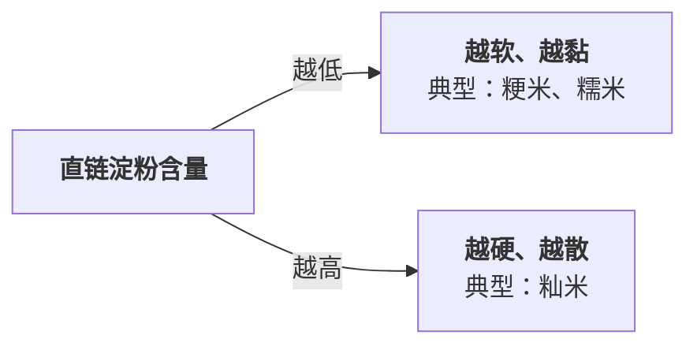
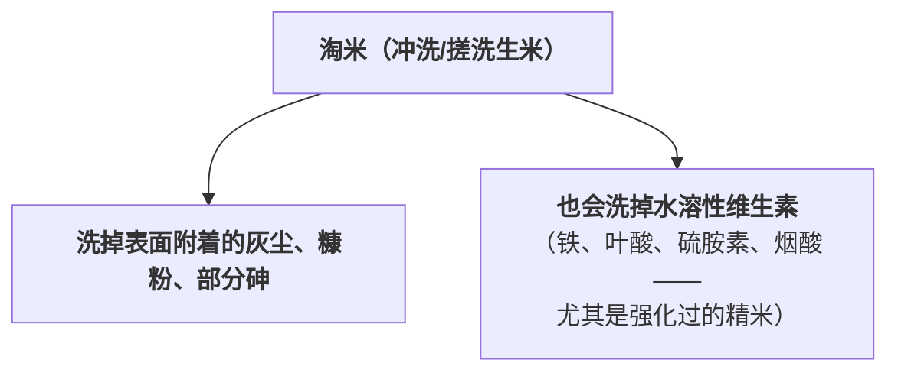
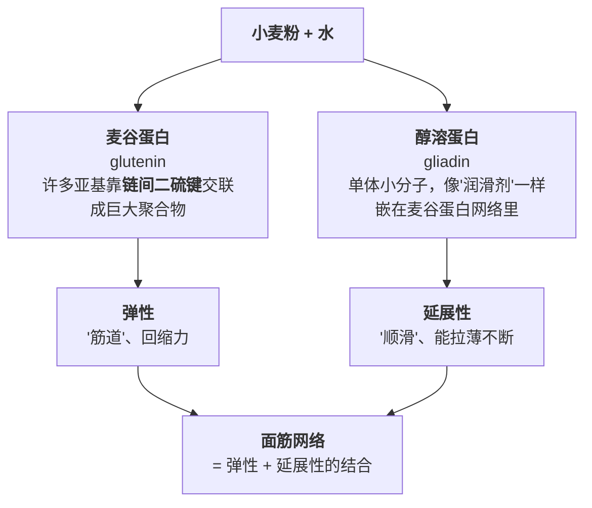
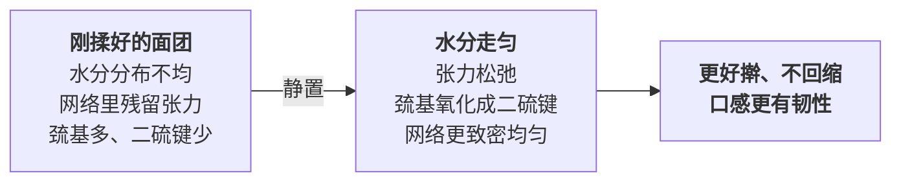
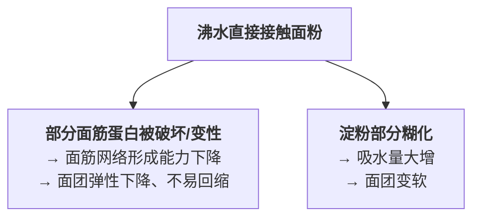

# 第 22 章 米与面：淘、泡、和、醒各自在做什么

> **本章目标**：把"淘米要不要淘""米要不要泡""面要不要醒"这几个几乎每天
> 都会被问到的问题，拆成**淀粉与水的谈判**（米）和**蛋白质与水的谈判**（面）
> 两条完全不同的线——这正是第三部分的总判据在米面上的落地：
> **每一步预处理都要能回答"它解决的是哪个具体问题"**。
>
> 这一章回答四个问题：
>
> 1. **米的软硬是品种玄学，还是可以算出来的化学问题？**
> 2. **淘米到底在洗掉什么、泡米到底在换什么？**
> 3. **面筋是什么？"揉出筋道"到底揉的是哪条网络？**
> 4. **"醒面"是在等发酵，还是在等别的事情发生？**

## 22.1 米的软硬：一条化学曲线，不是品种玄学[^1]

第 6 章讲过淀粉由**直链淀粉**（负责"凝"）和**支链淀粉**（负责"黏"）两种分子
组成。大米之间最大的差别，就是这两种分子的**比例**不同。

按直链淀粉含量，大米大致可以分档（不同文献的边界略有出入）：

| 档位 | 直链淀粉含量 | 典型代表 | 煮出来的样子 |
|------|------------|---------|------------|
| **糯性** | 0%~2% | 糯米、糯玉米 | 黏、糯、几乎不散 |
| **极低~低** | 3%~19% | 多数粳米（日本米、东北大米） | 软、黏、有光泽，粒与粒容易粘连 |
| **中等~高** | 20%以上 | 多数籼米（泰国香米、丝苗米等） | 松散、颗粒分明、不易粘连 |

> ## 第一条可迁移规则
>
> **"这米黏不黏、软不软"，问的其实是"它的直链淀粉含量是多少"**——
> 这是一个可以测量的化学变量，不是"哪个产地的米更好"这种玄学问题。
> 买米时"粳米偏黏、籼米偏散"这条经验之所以可靠，是因为
> **粳稻品种普遍比籼稻品种的直链淀粉含量低**（遗传上由同一个基因位点的不同等位基因决定）。
> 想要饭更软更黏，换一款直链淀粉更低的米，比在水量和火候上反复试探更直接。

⚠️ **诚实说明**：这条规律解释的是**不同品种之间**的差异方向，
不是说"只要知道直链淀粉百分比就能精确算出口感"——**同样直链淀粉含量的
籼米和粳米，黏度仍然可能不同**（有研究发现，这还和煮饭时表面溶出的
支链淀粉量有关，不是只看颗粒里原本的比例）。本书只给方向，不给精确换算。

## 22.2 淘米：在洗掉什么、换什么

淘米这个动作看起来简单，但同时在做两件相反的事：

**关于无机砷**：美国 FDA 给出的官方结论是——**淘米本身对降低砷含量的效果很小**，
真正能明显降低砷的做法是**像煮意面一样用大量水煮饭**（约 **6~10 份水配 1 份米**），
煮好后**把多余的水沥掉**，这样能让无机砷含量降低约 **40%~60%**（因米的种类而异）。
但这个方法是有代价的：它会让**铁、叶酸、硫胺素、烟酸**这些强化维生素
流失约 **50%~70%**（针对经过营养强化的精米/预煮米）。

另一项对照研究用了更细的米水比，结果印证了"水越多、流失和降砷都越明显"
这条方向：

| 米水比 | 砷降低幅度 | 铁流失 | 锌流失 |
|--------|-----------|--------|--------|
| **1:3** | 约 4.5%（不显著） | — | — |
| **1:6** | 约 30%（因产地从 9% 到 52% 不等） | 约 8.2%（不显著） | 约 7.7% |
| **1:10（焖煮法）** | 约 44%（因产地从 33% 到 59% 不等） | 升至约 24.4% | 升至 14.2% |

> ## 第二条可迁移规则：淘米和"大量水煮饭沥水"是两件不同的事
>
> **淘米洗掉的主要是表面附着物和部分水溶性维生素，对砷的影响很有限**；
> **想明显降砷，要换成"大量水煮、煮完沥水"这种完全不同的做法**，
> 而这种做法本身会多丢一部分强化营养素——**两者不能互相替代，也不能
> 把一个的流失比例套到另一个上**。
>
> ⚠️ **美国 FDA 的官方态度很明确**：**不建议因此避开大米**，
> 而是建议吃**品类多样化**的膳食来降低对单一食物中某种污染物的暴露；
> 检测到某种污染物**不等于**这个食物不能吃。**各国的具体评估与建议口径不同**，
> 以当地现行发布为准，本书只复述美国这一份官方表述。

⚠️ **诚实说明**：中式家庭最常见的场景——电饭煲淘洗 1~3 遍后**按固定比例
加水焖煮、不倒掉煮饭水**——和上面 FDA 研究的"大量水煮、沥水"场景
**物理过程不同**（前者没有额外丢弃一锅水），**本书没有核到中式淘米
次数与营养流失的定量对照**，这里只给机制方向，不把上面那组百分比
直接套到日常淘米次数上。

## 22.3 泡米：给中心的淀粉先占个位置

第 6 章已经讲过一条核心规律：**没有水，糊化不了**；而水要渗到米粒中心，
需要**时间**。泡米解决的正是这个问题——**提前把水渗进去，而不是等下锅
之后才让水往里挤**。

一项针对糙米的对照研究（分别用 30、40、50 °C 水温浸泡 30 分钟）测到：

| 浸泡水温 | 吸水率 | 蒸煮后的硬度 |
|---------|--------|------------|
| 30 °C | 约 12.6% | 约 3920 g |
| 40 °C | 约 16.5% | 约 3750 g |
| 50 °C | 约 18.6% | 约 3300 g |

**水温越高，吸水越快，煮出来也越软**——这条曲线和第 6 章"水不够、
温度再高也糊化不了"是同一条规律的另一面：**提前用温水把水分占位，
相当于把第 6 章说的"中心有没有水"这道题提前解决了一部分**。

另一项聚焦浸泡时间与温度对糙米质构影响的研究给出了一个更具体的方向：
**吸水率与糊化焓随浸泡时间和温度上升、大约 4 小时后趋于饱和**，
该研究的作者认为 **40 °C 浸泡约 4 小时**是糙米蒸煮质量的一个较优组合。

> ⚠️ **本书只核到这篇研究的检索摘要，没有打开一手全文**，
> 所以这个"40 °C/4 小时"只作为**一个方向性参考**，不当作放之四海而皆准
> 的配方——糙米本身带着麸皮，水分渗透比精白米慢得多，
> **精白米通常不需要这么长的泡发时间**，具体泡多久要看米的种类自己摸索。

> ## 第三条可迁移规则
>
> **泡米本质上是在"花时间换糊化的均匀度"**——
> 米粒越完整（糙米 > 精米）、温度越低，需要的时间就越长；
> 赶时间的时候，**提高水温能在更短时间内达到类似的吸水效果**，
> 这正是第 1 章"时间—温度等效"框架在淘米泡米上的一次具体应用。

## 22.4 面筋：麦谷蛋白管弹性，醇溶蛋白管顺滑[^2]

把视角从米转到面——小麦粉和大米最大的不同是，它里面除了淀粉，
还有一套**能形成网络的蛋白质系统**：面筋。

一篇综述把两者的分工讲得很清楚：**麦谷蛋白负责弹性**（靠大量链间二硫键把
许多亚基交联成巨大的聚合物），**醇溶蛋白负责延展性**（单体分子，像增塑剂一样
嵌在麦谷蛋白网络里，提供黏性与可拉伸性）。

> ## 第四条可迁移规则
>
> **"揉面"本质上是在同时做两件事：让水渗进蛋白质分子、让分子们彼此缠结。**
> 水合这一步**只要接触到水就已经开始**，不一定非要靠揉；
> 而**机械作用（揉、摔打、擀）能让这个网络排得更整齐、连得更紧密**。
> 这解释了"面团越揉越筋道"：**揉的不是淀粉，揉的是这张蛋白质的网**。
>
> 同时也能倒推一条诊断规则：
> **"面条筋道"主要是面筋（麦谷蛋白）的功劳；"面条坨掉发黏"
> 主要是淀粉（第 6 章的回生/糊化）的责任**——
> 这两件事经常被混在一起讨论，但它们动的是完全不同的两套分子。

### 盐和碱都能让面更筋道，但走的不是同一条路

| 添加物 | 机制 | 效果 |
|--------|------|------|
| **盐（NaCl）** | 中和面筋蛋白表面的电荷排斥、增强分子间疏水相互作用（面筋蛋白约含 40% 疏水氨基酸），同时促进 β-折叠结构、降低游离巯基含量（即促进 -SH 向 -S-S- 交联） | 面团更强韧、更耐拉伸；一项研究实测：从不加盐到加 1.5% 盐，拉伸阻力从约 327 升到 416（BU）、最大阻力从约 226 升到 298（BU） |
| **碱（如碳酸钠/碳酸钾，即"碱水面"[^4]用的那种）** | 同样促进面筋里二硫键的形成，**额外还会让面粉里原本无色的类黄酮色素在碱性条件下转成黄色** | 面更筋道、更耐嚼；**颜色变黄是色素的事，筋道提升是面筋网络的事，两者同时发生、但是两个不同的机制** |

> **一个常被混淆的点**：碱水面发黄**不是加了鸡蛋**，
> 也不是"碱把面粉烧焦了"——**它是面粉自带的类黄酮色素遇碱变色**，
> 这是一个纯粹的酸碱指示剂反应（和第 8 章讲的花青素遇碱变色是同一类机制）。

⚠️ **诚实说明**：上面盐和碱的具体用量（家常每斤面放多少克盐/碱）
**本书不给**——已核到的是机制方向和实验室浓度梯度下的趋势，
不是可以直接照搬进家庭厨房的配方。

## 22.5 醒面：不是在等发酵，是在等网络定型[^3]

很多人把"醒面"和"发酵"混为一谈，但对于**不放酵母的面团**
（饺子皮、面条、烙饼），醒面解决的是完全不同的问题。

一项研究用核磁共振测了面团醒发过程中的水分分布和蛋白质结构变化，
给出了一条很具体的时间线：

> 随醒发时间延长，**水分均匀度上升，并在约 60~120 分钟趋于稳定**，
> **强结合水的比例同步上升**；蛋白网络分布变得**更致密、更均匀**；
> **α-螺旋含量上升**（二级结构更有序）；**离子键与氢键增强、
> 疏水相互作用减弱**。

另一项研究则直接测了面团的**力学松弛**，更能解释"不醒面擀出来的皮
会一直缩回去"这个现象：

> 每一轮静置（约 30 分钟）之后，面团的**弛豫时间（τ）与高弹模量（E2）
> 都会下降**——这意味着面团**更不容易"弹回去"**，更容易被继续加工。
> 机制上，静置期间**游离巯基（-SH）在有氧条件下氧化成二硫键（-S-S-）**，
> 促进蛋白聚集、让面筋结构更稳固。

> ## 第五条可迁移规则
>
> **醒面不是在等"发酵产气"，是在等"水分走匀 + 张力消退 + 网络定型"
> 这三件物理/化学过程完成。** 不放酵母的面同样需要醒，
> 道理就在这里——它和发酵是两件可以独立发生、经常被混在一起讨论的事。
>
> ⚠️ **不是醒得越久越好**：不同研究给出的"最优区间"并不完全一致
> （有研究在约 30~60 分钟观察到网络质量最佳，另一些体系里超过约 90 分钟后
> 质量反而下降）。本书**不给统一的分钟数**，只给"存在一个区间、
> 太短不够、太久会退化"这条方向——具体多久要看面粉、水量和环境温湿度，
> 用 22.9 节的对照实验自己找。

## 22.6 烫面：把第 6 章"没水糊化不了"反过来用

普通和面用的是常温或温水，**烫面**则是直接用沸水和面粉混合，
这是中式面点（烫面饺、烫面饼）常用的一个特殊做法，它同时触发两件事：

这正是第 6 章那条规律的另一种应用场景——**"没水糊化不了"反过来说，
就是"给够了水（和热）就能主动触发糊化"**。烫面刻意利用糊化来
**压低面筋的比重、提高淀粉的比重**，换来的结果是：**面团更软、更容易
擀得很薄、不容易回缩**，但相应地也失去了一部分"筋道"（因为面筋网络
本身被破坏了一部分）。

> **一个可迁移的判断**：当你需要面皮**薄而不破、软而顺滑**（烫面饺、
> 春卷皮一类），用烫面；当你需要面**有嚼劲、能扛得住拉抻**（面条、
> 饺子皮常规做法），用常温/温水和面——**本质上是在"面筋网络"和
> "淀粉糊化"这两个系统之间做取舍**，而不是哪种做法"更高级"。

⚠️ **诚实说明**：本书这次写作**没有核到烫面具体水温与面粉配比的一手
实验数据**，只核到相关综述型检索摘要确认了"沸水破坏部分面筋、
同时触发部分糊化"这个方向。具体"多少沸水配多少面粉""烫到几成"
属于家庭惯例，本书不给配方。

## 22.7 把米与面放在一起看：两条谈判，一个共同判据

| | 米 | 面 |
|--|----|----|
| **主角** | 淀粉（直链/支链比例） | 淀粉 + 面筋（麦谷蛋白/醇溶蛋白） |
| **预处理解决的问题** | 让水在下锅前先渗进去（泡）、去掉表面附着物（淘） | 让蛋白质网络水合缠结（和）、让网络松弛定型（醒） |
| **"软硬/筋道"由什么决定** | 直链淀粉含量（品种差异） | 面筋蛋白的量与网络致密程度 |
| **过犹不及的坑** | 泡太久/水太多会多丢营养素 | 醒过头网络质量可能反而下降；揉过头（超出面筋承受范围）会让网络被破坏 |

> ## 本章最后一条规则：先问"这是淀粉的事还是蛋白质的事"
>
> 米饭/粥的失败多半是**淀粉与水的谈判没谈好**（水不够、时间不够、
> 米的直链含量和你的预期不匹配）；
> 面条/面皮的失败往往要分两步看——**不筋道**先怀疑面筋网络
> （揉得够不够、醒得够不够、盐碱用没用对），**坨掉发黏**再去看淀粉
> （回生、糊化过度）。
> **分清楚现在面对的是哪条线的问题，比直接加水、加粉、多揉一会儿
> 更能对症下药**——这和第 20 章"蔬菜的四种失败要分开诊断"是同一种思维。

## 22.8 常见说法辨析

按本书约定标注**证据强度**：✅ 有共识 / ⚠️ 有争议 / ❌ 明确错误 / 缺乏证据。
来源见[出处登记](../../standards.md)。

| 说法 | 判定 | 说明 |
|------|------|------|
| "粳米比籼米更黏是品种玄学，说不清道理" | ❌ **可以说清楚** | 粳稻品种普遍比籼稻品种**直链淀粉含量更低**，直链淀粉含量越低、米饭越软越黏——这是一条可测量的化学规律，不是玄学 |
| "淘米能把大米里的砷洗掉大半" | ❌ **效果有限** | 美国 FDA 的官方结论是**淘米对降低砷含量的效果很小**；真正能明显降砷的是"大量水煮饭 + 沥水"这种完全不同的做法（约降 40%~60%），但那会额外损失 50%~70% 的强化维生素 |
| "泡米纯粹是为了省煮饭时间" | ⚠️ **只说对了一半** | 泡米确实能缩短煮制时间，但更本质的作用是**提前把水渗到米粒中心，让糊化更均匀**（第 6 章"没水糊化不了"的直接应用）；水温越高、吸水越快，煮出来也相对越软 |
| "面要用力揉才会筋道" | ✅ **方向成立，但"水合"本身不靠揉也会发生** | 机械作用（揉、摔打）确实能让面筋网络排列得更致密，但**水合与初步缠结在面粉接触水的那一刻就已经开始**（这是 autolyse 免揉工艺的科学基础）；揉面加速和强化的是这个本来就在发生的过程 |
| "醒面就是在等它发酵" | ❌ **混淆了两件事** | 不放酵母的面团（面条、饺子皮）同样需要醒，醒面解决的是**水分走匀、张力消退、面筋网络致密化**这几件物理/化学过程，和"发酵产气"是完全独立的两件事 |
| "面条拉面要加碱才筋道，这是因为碱让面变'熟'了" | ⚠️ **机制说反了** | 碱水面筋道提升来自**碱促进面筋蛋白里二硫键的形成**（和加热无关），而不是"把面煮熟/烫熟"；碱水面发黄是**面粉自带类黄酮色素遇碱变色**，这是两个各自独立但同时发生的机制 |
| "醒面醒得越久越好" | ⚠️ **有争议，不是单调关系** | 已核到的研究里，有的体系在约 30~60 分钟观察到网络质量最佳，也有研究观察到超过约 90 分钟后质量反而下降。**不存在"越久越好"这条规律**，本书不给统一时长 |
| "面条坨掉是没揉够面筋" | ⚠️ **归因经常错了对象** | 面条"坨"（黏连成一团）更多时候是**淀粉**（直链淀粉重新排队、表面糊化物黏连）的责任，而不是面筋没揉够；面筋网络主要影响的是"筋道、能不能扛得住拉伸"，不直接决定"坨不坨" |
| "烫面做的皮更筋道" | ❌ **方向反了** | 烫面用沸水，会破坏部分面筋蛋白，**面筋网络形成能力下降**；它换来的是"更软、更容易擀薄、不易回缩"，**不是更筋道**——如果追求筋道，应该用常温/温水和面 |

## 22.9 思考题

1. 为什么说"米的软硬是化学问题，不是品种玄学"？请用直链/支链淀粉的比例说明。
2. 淘米和"大量水煮饭后沥水"分别在解决什么问题？为什么不能把后者的降砷/
   流失比例直接套用到前者上？
3. 面筋的两种蛋白质分别叫什么？各自负责面团的哪个性质？
4. 为什么说"醒面不是在等发酵"？请用本章讲到的水分分布与蛋白质结构变化说明。
5. **【案例】** 你打算在家包一次饺子，皮用普通中筋面粉加温水和出来，
   另准备了一份馅料。和面后你只醒了 5 分钟就开始擀皮，发现皮一直回缩、
   擀不薄。
   （a）用本章的机制解释这个现象；
   （b）你会怎么调整（可以从"醒面时间""水温""用不用烫面"三个角度考虑）；
   （c）如果这次改用烫面来做皮，会带来哪些好处和代价？
6. **【案例】** 家里有两种米：一种标着"东北大米"（偏黏偏软），
   一种标着"泰国香米"（偏松散）。你要做一份**炒饭**。
   （a）从本章的角度，哪种米更适合炒饭？为什么？
   （b）如果只有东北大米，你会在预处理上做哪些调整来弥补（提示：
   结合第 6 章回生、本章泡米的内容）？
   （c）如果临时改主意要煮白粥，两种米的选择逻辑会不会反过来？为什么？
7. **【辨析】** "拉面筋道是因为加了碱把面'烫熟'了"——判断证据强度，
   说明正确的机制是什么。
8. **【辨析】** "醒面醒得越久，面越筋道"——判断证据强度，
   并说明本书为什么不给一个统一的"最佳醒面时间"。

> 📖 **参考答案**（想清楚再看）：[Q1](../../qa/22-rice-flour-qa.md#q1) ·
> [Q2](../../qa/22-rice-flour-qa.md#q2) · [Q3](../../qa/22-rice-flour-qa.md#q3) ·
> [Q4](../../qa/22-rice-flour-qa.md#q4) · [Q5](../../qa/22-rice-flour-qa.md#q5) ·
> [Q6](../../qa/22-rice-flour-qa.md#q6) · [Q7](../../qa/22-rice-flour-qa.md#q7) ·
> [Q8](../../qa/22-rice-flour-qa.md#q8)

## 22.10 本章实操

### 🅐 零成本版 · 任务一：给家里的米分类

不用开火。找出家里现有的米（可以是不同品种、不同包装），
对照包装信息或口感记忆填表：

| 米的名字 | 包装上写的品种（粳/籼/糯，若有） | 我记忆中煮出来黏不黏 | 按本章推测的直链淀粉档位 | 更适合做什么 |
|---------|------------------------------|-------------------|----------------------|------------|
| | | | | |
| | | | | |

做完回答：**家里现有的米，哪种适合煮粥、哪种适合炒饭、哪种适合做寿司？**
理由要落到"直链淀粉含量"这条机制上，不要只说"因为它比较黏"。

### 🅐 零成本版 · 任务二：拿一份面点菜谱，标出"面筋的事"还是"淀粉的事"

找一份含面条、饺子皮或饼皮的菜谱，逐行标注：

| 菜谱里的这一步 | 主要在动面筋还是淀粉 | 这一步的目的 | 如果跳过会怎样 |
|--------------|------------------|------------|------------|
| 和面 | | | |
| 醒面 | | | |
| 擀皮 | | | |
| 煮/蒸 | | | |

### 🅑 开火版 · 任务三：醒面时间对照（有灶台和食材时做）

**需要**：中筋面粉、水、两个碗、擀面杖、计时器。

**做法**：用同样的面粉、水量和揉面力度和出两份面团，**分开醒不同的时间**。

| 组 | 醒面时间 | 擀薄到同样厚度所需的力气/次数 | 擀好后回缩程度 | 煮/烙后的口感 |
|----|---------|------------------------|--------------|-------------|
| ① | 不醒，和完直接擀 | | | |
| ② | 醒 30 分钟 | | | |

做完回答：

1. 两组擀皮的难易程度有没有明显差别？这对应本章哪条机制？
2. 如果时间允许，追加一组"醒 90 分钟"，口感和②比起来怎样？
3. ⚠️ 这是单次、无重复的家庭观察，不能当成"醒 30 分钟是最佳时长"的结论，
   只能当成你自己这次面粉/水量/环境下的一个参考点。

### 🅑 开火版 · 任务四：同一种米，两种泡发时间的对照

**需要**：同一种米两份（等量）、两个碗、计时器。

**唯一变量**：浸泡时间（例如一份不泡直接煮，一份浸泡 30 分钟后再煮）。
其他（水量、火力、焖的时间）保持一致。

| 组 | 浸泡时间 | 出锅时中心有没有夹生 | 软硬 | 口感总体评价 |
|----|---------|------------------|------|------------|
| ① 不泡 | 0 分钟 | | | |
| ② 泡过 | 30 分钟 | | | |

做完回答：

1. 泡过的那组是不是更软、更不容易夹生？这和本章哪条曲线的方向一致？
2. 如果这次用的是糙米而不是精白米，你预期两组的差别会更大还是更小？为什么？

> ⚠️ **安全提醒**：煮好的米饭、面食同样属于易腐食品，按美国 FDA 的指引
> 应在**烹调后 2 小时内**冷藏（环境温度高于 90 °F 时缩短到 1 小时）。
> **各国口径不同，以自己所在地现行发布为准。** 生面团如果含有生蛋，
> 处理方式参考第 21 章的蛋类安全提醒。

## 22.11 🔎 下次做菜时的用处

1. **想要饭更黏更软，换一款直链淀粉更低的米**，而不是一直在水量上找原因。
2. **淘米别指望它能大幅降砷**——那是另一种做法（大量水煮沥水）的效果，
   两者不能互相替代。
3. **泡米是在换时间**：赶时间就提高水温，不赶时间就多泡一会儿，
   本质上是在做第 1 章"时间—温度等效"的同一道题。
4. **面不筋道先别怪没揉够**，可能是没醒够——水合和张力消退需要时间，
   不是揉的力气能单独解决的。
5. **面条坨了，先怀疑淀粉，不要先怪面筋**——这是两套不同的系统。
6. **想要皮薄不回缩，试试烫面**；想要有嚼劲，用常温/温水和面——
   这是"淀粉糊化"和"面筋网络"之间的权衡，不是谁更高级的问题。
7. **醒面别死守一个固定分钟数**，看面团擀开后回不回缩来判断够不够。

## 22.12 本章依据

本章引用的来源与核对状态详见[参考书目与出处登记](../../standards.md)，具体对应如下：

| 本章用到的内容 | 依据 |
|--------------|------|
| 大米按直链淀粉含量分档（糯性 0%~2%、极低~低 3%~19%、中等~高 20%以上）；粳稻/籼稻在 Wx 基因位点的差异决定直链淀粉含量高低；直链淀粉含量越高、米饭越硬越散 | 一篇关于大米直链淀粉含量遗传与品质的综述（经检索摘要确认分档体系与粳籼差异），本章只用其方向性分类，不写单点精确百分比 |
| 大量水煮饭（6~10 份水配 1 份米）沥水后降低无机砷 40%~60%、损失强化维生素 50%~70%；淘米对砷影响很小但同样洗掉铁/叶酸/硫胺素/烟酸 | 美国 FDA「What You Can Do to Limit Exposure to Arsenic」官方页面，✅（本次写作实际打开） |
| 不建议因此避开大米；建议膳食多样化以降低对单一食物中污染物的暴露；检测到污染物不等于不能吃 | 美国 FDA「Arsenic in Food」官方页面，✅（本次写作实际打开） |
| 米水比 1:3/1:6/1:10 对砷与铁、锌流失的实测对照 | 一项关于不同米水比对砷与矿物质影响的研究，*International Journal of Environmental Research and Public Health*，2018（PMC6025416），✅ 开放获取全文 |
| 糙米 30/40/50 °C 浸泡 30 分钟的吸水率（12.6%/16.5%/18.6%）与蒸煮后硬度（约 3920/3750/3300 g） | 一项关于浸泡与高压处理对糙米吸水、色泽、形态与蒸煮质构影响的研究，*Journal of Food Science and Technology*，2017（PMC5430198），✅ 开放获取全文 |
| 糙米浸泡 4 小时后吸水率与糊化焓趋于饱和、40 °C/4 小时被判定为较优组合 | 一项关于糙米浸泡温度与时间对质构与糊化特性影响的研究，*Journal of Cereal Science*，2025，⚠️ **仅核到检索摘要，未打开一手全文** |
| 麦谷蛋白靠链间二硫键交联负责弹性、醇溶蛋白单体分子负责延展性；盐通过中和电荷、增强疏水相互作用与促进二硫键交联增强面筋（1%~2% NaCl 提高机制面条硬度、手拉面常用 3%~5%）；碱促进面筋二硫键形成，并使面粉自带的类黄酮色素在碱性下转黄 | 一篇关于影响面筋网络与面条性质的小麦蛋白及其他成分的综述，*Foods*，2022（PMC9738829），✅ 开放获取全文 |
| NaCl 浓度 0%→1.5% 时面团拉伸阻力 R50 从 327 升到 416（BU）、最大阻力 Rmax 从 226 升到 298（BU）、拉伸能量从 57 升到 85 cm²；强化效应归因于疏水相互作用增强（面筋蛋白约含 40% 疏水氨基酸） | 一项关于食盐添加对小麦粉面团流变性质影响的研究，*Foods*，2020（PMC7278690），✅ 开放获取全文 |
| 醒发使水分均匀度上升并在 60~120 分钟趋于稳定、强结合水比例上升、蛋白网络更致密均匀、α-螺旋含量上升 | 一项关于面团醒发时间对水分分布与面筋形成影响的研究，*LWT*，2024，⚠️ **仅核到摘要与 Highlights，未打开付费全文** |
| 每轮醒发（约 30 分钟）后弛豫时间（τ）与高弹模量（E2）下降；机制归因于游离巯基在有氧条件下氧化成二硫键 | 一项关于面团在不同醒发/擀压循环与温度下流变行为的研究，*Food Chemistry: X*，2025（PMC11968288），✅ 开放获取全文 |
| 沸水使部分面筋蛋白变性、面筋网络形成能力下降；淀粉部分糊化、吸水量增加；烫面后淀粉颗粒出现多孔微结构、可溶糖上升 | 关于"烫面"工艺的综述型检索摘要，⚠️ **本次写作未打开一手论文全文**，只用于说明方向，与第 6 章"糊化需要水+热"机制一致 |
| 淀粉颗粒结构、直链/支链淀粉的分工与速度差异、糊化需要水和热 | 第 6 章已登记（标准登记 §5.6、§5.10），本章复用并延伸到米与面的具体场景 |
| 熟食 2 小时冷藏规则 | 美国 FDA「Safe Food Handling」，✅（第 4 章已登记）。⚠️ 各国口径不同 |

[^1]: [直链淀粉与支链淀粉](../../glossary.md#amylose)（amylose / amylopectin）；
[支链占比与米的软硬](../../glossary.md#amylose-content-rice)（amylose content classification）。
[^2]: [面筋](../../glossary.md#gluten)（gluten）。
[^3]: [醒面 / 松弛](../../glossary.md#dough-resting)（dough resting / autolyse）。
[^4]: [碱水面](../../glossary.md#alkaline-noodle)（kansui / alkaline noodle）。

---

**下一部分**：第四部分 · 基础技法。
第三部分到此结束——从肉到蔬菜，再到蛋奶与米面，我们把"下锅之前"
能做的所有预处理都拆成了"它在解决哪个具体问题"。下一部分要回到
锅里，把炒、煎、炸、蒸、煮、炖、烤、凉拌这八种技法收敛到同一套
物理上：**每种技法只是"用什么介质、在什么温度、让水往哪走"的
不同组合**。
