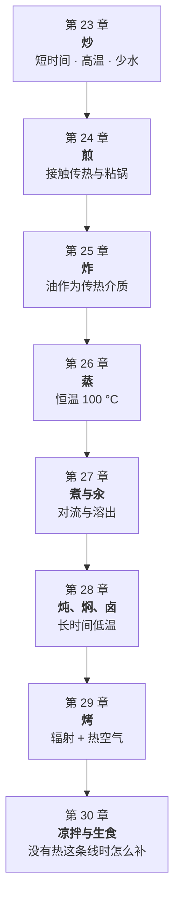

# 第四部分 · 基础技法：八种技法，同一套物理

> **前三部分讲的是"食材本身会发生什么"，这一部分讲的是"你用什么方式让它发生"。**
> 炒、煎、炸、蒸、煮、炖、烤、凉拌——菜谱把它们当成八个互不相干的动词，
> 但从传热的角度看，**它们只是同一组变量的不同取值**。

## 为什么技法要单独占一个部分

因为"这道菜该怎么做"这个问题，九成情况下**第一步就是选技法**，
而选错技法，后面第三部分学到的所有预处理都救不回来——
**该炖的肉去炒，该炒的菜去炖，无论你腌得多用心、处理得多到位，结果都不对。**

每种技法的差别，可以收敛到同一组问题：

> - **用什么介质传热？**（空气、水、油，还是食材本身的辐射环境）
> - **介质能到多高的温度？**（水封顶在 100 °C 附近，油和干热空气可以远高于此）
> - **水往哪个方向走？**（被锁住、被逼出来，还是被主动带走）
> - **这是"加热食材"还是"同时也在给食材脱水/结壳"？**

这正是第一部分"热、水、味、时间"四条线在具体技法上的落地——
**本章开始，每一章都会按"传热特征 + 成功条件 + 典型失败模式与诊断"
这个固定结构来写**，让你能把任何一种新技法也套进这个框架里理解。

## 这一部分的地图

八种技法并不是互不相干地排列，而是沿着**"传热强度从高到低、
从'逼走水'到'靠水传热'再到'完全不靠热'"**这条轴线排布的——
学完这一部分你会发现，它们其实是同一条曲线上的八个点。

## 它和前三部分的关系

| 这一部分的内容 | 用到前面哪一章 |
|--------------|--------------|
| 炒：功率与出水的算术题 | 第 2 章传热、第 3 章水、第 7 章褐变 |
| 煎：粘锅的物理 | 第 2 章传热、第 7 章美拉德 |
| 炸：外壳怎么形成 | 第 3 章水活度、第 7 章褐变、第 6 章淀粉 |
| 蒸：窄窗口食材的首选 | 第 18 章焯水对照、第 21 章蛋与奶 |
| 炖、焖、卤：结缔组织的改造 | **第 5 章胶原**、第 4 章蛋白质 |
| 凉拌与生食：没有热怎么办 | 第 9~15 章味觉与调味、第 8 章酸碱 |

**所以这一部分同样几乎不引入新机理**——它把第一到三部分的机理，
重新组织成"按技法查"的形式，并补上每种技法**独有的失败诊断**。

## 学完这一部分，你应该能

1. **拿到一样陌生的食材**，先选技法、再定参数，而不是先搜"XX 怎么做"；
2. **失败时能说出是哪一步出的问题**——是介质选错了，还是温度没到位，
   还是水的方向搞反了；
3. **看懂"同样的菜，饭店做的和家里做的为什么不一样"**——
   这部分答案往往不在手艺，而在**介质、温度与功率的客观差距**上；
4. **把一种新学到的技法，自己套进"传热特征 + 成功条件 + 失败诊断"
   这个框架里**，不用每次都死记硬背新菜谱。

---

**从这里开始**：[第 23 章 · 炒：短时间、高温、少水](23-stir-fry.md)。
第一个要打破的直觉是——**家庭灶炒菜失败的第一原因，几乎总是同一个，
而它和"手艺"关系不大。**
